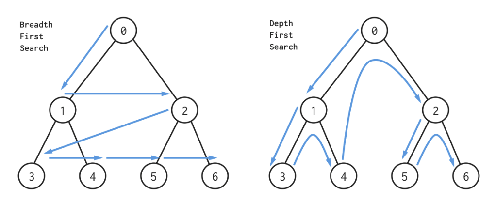
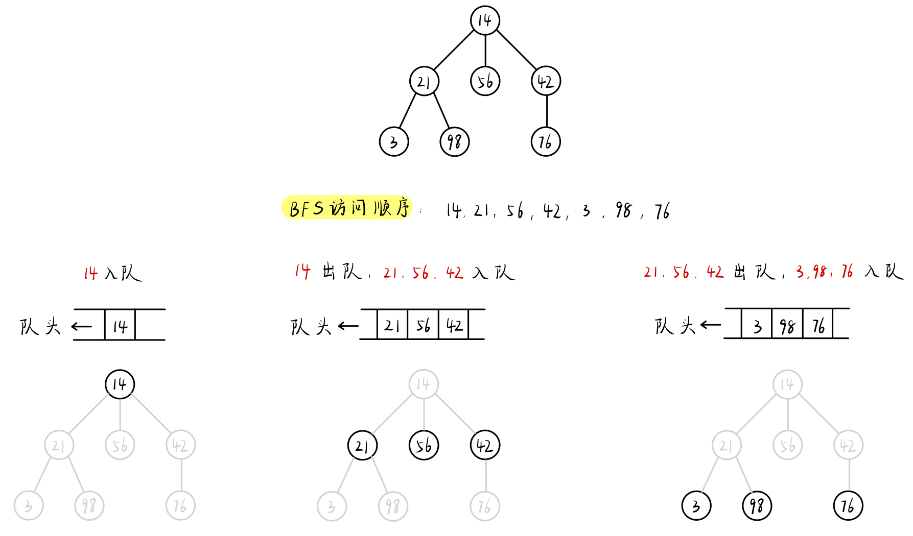
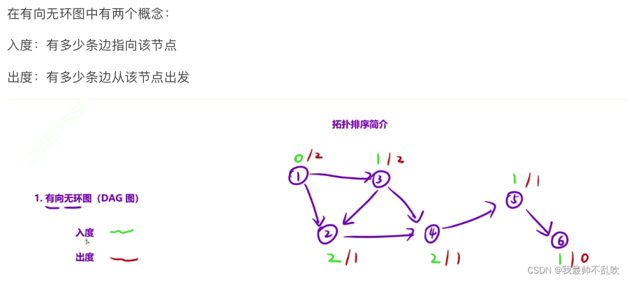

# 1. 算法思想

> BFS同DFS一样，是一种用于遍历、搜索树或图的一种搜索算法。与DFS会先一路走到黑不同，BFS会从根节点开始搜索，在每一个路口面临分叉的时候，先把每个岔路记录下来，然后再去一个一个的往前走一步。
>
> 左下图是BFS搜索路线的一个例子。加入我们要找的是节点5。BFS首先搜索根节点0，然后会依次搜索它的两个子节点(节点1,节点2)，路线为：0->1->2。接着会去搜索节点1和节点2的子节点（节点3，4，5，6），所以最终路线为：0->1->2->3->4->5。
>
> 
>
> BFS的时间复杂度为O(N + M)，N为节点的数量，M为边的数量。

# 2 算法适用场景

> BFS通常在**图(graph)**或者**二叉树(BST)**(实际上BST是一种特殊的图)上使用。在图上使用时，我们往往使用**HashSet**或者**HashMap**来避免指针向回走。
>
> 1. **连通块问题（Connected Component）**，
>
>    > 连通块问题是指通过一个点找到图中所联通的所有点的问题。这类问题我们可以用经典的BFS加上HashSet来解决。  
>
> 2. **分层遍历（Level Order Traversal）**
>
>    >  分层遍历问题要求我们在图中按层次进行遍历，常见的分层遍历问题有简单图的最短路径问题(Simple Graph Shortest Path)
>    >
>    > *简单图指的是每条边的距离相等，或者都视作长度为单位1的图。*
>
> 3. **拓扑排序（Topological Sorting）**
>
>    > 拓扑排序是一种对图中节点的排序。在这种排序中，假若A点指向B点，则A点的序在B点前。同一种图可能有不同的拓扑序。BFS可以用来求任意拓扑序、求一张图是否有拓扑序（如果是图中存在循环则没有拓扑序）、求字典序最小的拓扑序和求图中是否有唯一拓扑序。
>    >
>    > 在拓扑排序中，我们首先要计算出每个点的**入度(In-degree)**。入度指的是一共有多少条边指向这个点。用BFS解决拓扑排序问题的算法步骤如下：
>    >
>    > a). 统计每个点的入度
>    >
>    > b). 将入度为0的所有点放入Queue中作为起始节点
>    >
>    > c). 依次从Queue中取出一个节点，并将它指向的点的入度-1。
>    >
>    > d). 如果它指向的点的入度为0了，就将其添加进Queue中。
>
> 4. **简单图最短路径（100%）**
>
> 5. **给定一个变换规则，从初始状态变到终止状态最少几步（100%）**
>
> 
>
> 分层遍历问题要求我们在图中按层次进行遍历，常见的分层遍历问题有简单图的最短路径问题(Simple Graph Shortest Path)

# 3. 算法模版

## 3.1 基于Tree的实现

> - 递归解决方案的优点是它更容易实现。 但是，存在一个很大的缺点：如果递归的深度太高，你将遭受堆栈溢出。 在这种情况下，您可能会希望使用 BFS，或使用显式栈实现DFS
>
> 
>
> ```java
> /* * Return true if there is a path from cur to target. */
> boolean BFS(int root, int target) {
>     Set<Node> visited = new HashSet<>();
>     Stack<Node> s;
>     add root to s;
>     while (s is not empty) {
>         Node cur = the top element in s;
>         return true if cur is target;
>         for (Node next : the neighbors of cur) {
>             if (next is not in visited) {
>                 add next to s;
>                 add next to visited;
>             }
>         }
>         remove cur from s;
>     }
>     return false;
> }
> 
> // Tree travel
> public bfs(Node startNode) {
>     // BFS 必须要用队列 queue，别用栈 stack！
>     Queue<Node> queue = new ArrayDeque<>();
>     // hashmap 有两个作用，一个是记录一个点是否被丢进过队列了，避免重复访问
>     // 另外一个是记录 startNode 到其他所有节点的最短距离
>     // 如果只求连通性的话，可以换成 HashSet 就行
>     // node 做 key 的时候比较的是内存地址
>     Map<Node, Integer> distance = new HashMap<>();
>     // 把起点放进队列和哈希表里，如果有多个起点，都放进去
>     queue.offer(startNode);
>     distance.put(startNode, 0); // or 1 if necessary
>     // while 队列不空，不停的从队列里拿出一个点，拓展邻居节点放到队列中
>     while (!queue.isEmpty()) {
>         Node node = queue.poll();
>         // 如果有明确的终点可以在这里加终点的判断
>         if (node 是终点) {
>             break or return something;
>         }
>         for (Node neighbor : node.getNeighbors()) {
>             if (distance.containsKey(neighbor)) {
>                 continue;
>             }
>             queue.offer(neighbor);
>             distance.put(neighbor, distance.get(node) + 1);
>         }
>     }
>     // 如果需要返回所有点离起点的距离，就 return hashmap
>     return distance;
>     // 如果需要返回所有连通的节点, 就 return HashMap 里的所有点
>     return distance.keySet();
>     // 如果需要返回离终点的最短距离
>     return distance.get(endNode);
> 
> ```

## 3.2 基于拓扑排序实现

> 
>
> 无论是 directed 还是 undirected Graph，其 BFS 的核心都在于 "indegree"，处理顺序也多是从 indegree 最小的开始，从外向内。
>
> 我们先用一个 HashMap 统计下所有节点的 indegree; 值越高的，在拓扑排序中位置也就越靠后，因为还有 N = current indegree 的 parent node 们没有处理完。
>
> 因此在循环最开始，我们可以把所有 indegree = 0 (也即不在 hashmap 中) 的节点加到 list 中，也作为 BFS 的起点。
>
> 在 BFS 过程中，我们依次取出队列里取出节点 node 的 neighbors， next，并且对 next 对应的 indegree -1，代表其 parent node 已经被处理完，有效 indegree 减少。
>
> 当-1之后如果 next 的 indegree 已经是 0 ， 则可以加入 list，并且作为之后 BFS 中新的起始节点。
>
> ```java
> List<Node> topologicalSort(List<Node> nodes) {
>     // 统计所有点的入度信息，放入 hashmap 里
>     Map<Node, Integer> indegrees = getIndegrees(nodes);
>     // 将所有入度为 0 的点放到队列中
>     Queue<Node> queue = new ArrayDeque<>();
>     for (Node node : nodes) {
>         if (indegrees.get(node) == 0) {
>             queue.offer(node);
>         }
>     }
>     List<Node> topoOrder = new ArrayList<>();
>     while (!queue.isEmpty()) {
>         Node node = queue.poll();
>         topoOrder.add(node);
>         for (Node neighbor : node.getNeighbors()) {
>             // 入度减一
>             indegrees.put(neighbor, indegrees.get(neighbor) - 1);
>             // 入度减到 0 说明不再依赖任何点，可以被放到队列（拓扑序）里了
>             if (indegrees.get(neighbor) == 0) {
>                 queue.offer(neighbor);
>             }
>         }
>     }
>     // 如果 queue 是空的时候，图中还有点没有被挖出来，说明存在环
>     // 有环就没有拓扑序
>     if (topoOrder.size() != nodes.size()) {
>         return 没有拓扑序;
>     }
>     return topOrder;
> }
> 
> Map<Node, Integer> getIndegrees(List<Node> nodes) {
>     Map<Node, Integer> counter = new HashMap<>();
>     for (Node node : nodes) {
>         counter.put(node, 0);
>     }
>     for (Node node : nodes) {
>         for (Node neighbor : node.getNeighbors()) {
>             counter.put(neighbor, counter.get(neighbor) + 1);
>         }
>     }
>     return counter;
> }
> ```
>
> 


# 4. 算法复杂度

> - 时间复杂度：O(N)
>   - O（N + M） `n` 是点数，`m` 是边数
> - 空间复杂度: O(N)

