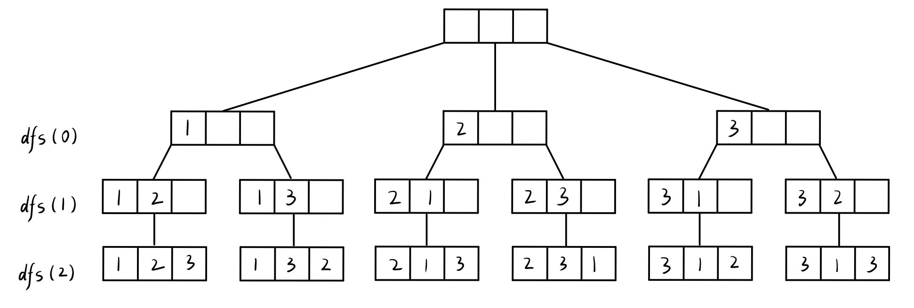
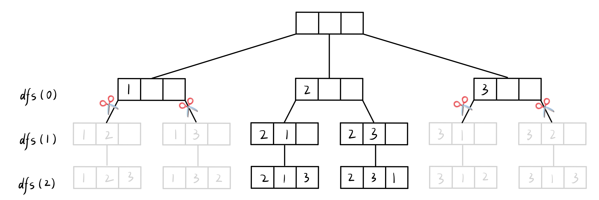

# 1. 算法思想

> 回溯算法和深度优先搜索（DFS）算法有一些相似之处，但也有一些关键区别。
>
> 1. **定义和目标：**
>    - **回溯算法：** 主要用于解决组合、排列、子集等问题，其目标是搜索问题的所有可能解，并在搜索过程中通过回溯（撤销之前的选择）来寻找有效解。
>    - **深度优先搜索（DFS）：** 是一种搜索算法，用于遍历或搜索图或树等数据结构的所有节点。DFS 通常用于判断两个节点之间是否连通，或者寻找路径等。
> 2. **状态的保存：**
>    - **回溯算法：** 在回溯算法中，通常需要显式地保存和恢复状态，即在每一步选择之前保存当前状态，在选择完成后恢复到之前的状态，以实现回溯。
>    - **深度优先搜索（DFS）：** 在 DFS 中，状态的保存通常是隐式的，因为递归调用栈本身就保存了状态。在 DFS 中，通常通过递归函数的参数传递状态信息，不需要显式保存和恢复状态。
> 3. **应用场景：**
>    - **回溯算法：** 通常应用于组合优化问题，如组合、排列、子集等。它更侧重于找到所有可能的解。
>    - **深度优先搜索（DFS）：** 通常应用于图的遍历、连通性判断、路径搜索等问题。它更侧重于在搜索过程中找到其中一个解。
> 4. **剪枝策略：**
>    - **回溯算法：** 回溯算法通常需要考虑剪枝策略，以减少搜索空间，提高算法效率。
>    - **深度优先搜索（DFS）：** 在一些情况下，也可以使用剪枝策略，但通常不需要像回溯算法那样频繁地进行状态的保存和恢复。
>
> 尽管回溯算法和深度优先搜索有一些相似之处，但它们在目标、应用场景和状态的保存方式上存在一些关键区别。在实际问题中，根据问题的性质选择合适的算法是很重要的。

# 2 算法适用场景

> - 通常应用于组合优化问题，如组合、排列、子集等。它更侧重于找到所有可能的解。

# 3. 算法模版

## 3.1 递归方式实现

> - 排列,例如 n == 3
>
>   > 确定第一个位置为 1 ( 1 , _ , _ )
>   > 再去确定第二个位置，假设为 2 ( 1 , 2 , _ )
>   > 再去确定第三个位置，只能为 3 ( 1 , 2 , 3 )
>   >
>   > 不能再拓展，回溯，确定第二个位置为 3 ( 1 , 3 , _ )
>   > 再去确定第三个位置，只能为 2 ( 1 , 3 , 2 )，
>   >
>   > 不能再拓展，回溯到第二个位置
>   > 仍不能再拓展，回溯到第一个位置，确定为 2 ( 2 , _ , _ )
>   >
>   > . . . 
>
>   
>
> - 剪枝特点。
>
>   > 输入一个整数 n，以字典序输出 1 ~ n 这 n 个数的各个排列，要求 第 1 个数 是 偶数 。
>   >
>   > 当 n == 3
>   > 按照之前的 DFS 得到 全排列：123 / 132 / 213 / 231 / 312 / 321
>   > 其中只有 213 / 231 是有效的
>   >
>   > 当 n 很大时，就会发现 近乎一半 的搜索结果都是无效的（第一位为 奇数 的情况）
>   > 造成了大量的资源浪费。
>   >
>   > 浪费的原因在于，当我们确定第一个位置为奇数时，
>   > 就已经能判定这个方案是错误的，但我们仍继续搜索 第二个位置，… ，第 n 个位置。
>   > 想要优化就需要 剪枝 。
>
>   
>
> - 回溯特点
>
>   
>
> ```java
> // permutation 排列
> public void permutation(
>   List<List<Integer>> result, List<Integer> subset, int[] nums) {
>     // 1. 判断是否满足结束条件,如果满足，将当前路径添加到结果集中
>     if(nums.length == subset.size()){
>         results.add(new ArrayList<Integer>(subset));
>         return;
>     }
> 
>     // 2. 尝试每一种可能的选择
>     for (int i = 0; i < nums.length; i++) {
>         if(!subset.contains(nums[i])){
>           // 做选择：将当前元素加入路径
>           path.add(nums[i]);
>           // 递归进入下一层
>           permutation(result, subset, nums);
>           // 撤销选择：回溯到上一层，恢复状态
>           path.remove(path.size() - 1);
>     }
> }
> 
> // combination 组合
> public void combination(List<List<Integer>> result, List<Integer> comb, int[] nums, int sum, 
>                          int	target, int start) {
>     // 1. 判断是否满足结束条件
>     // 如果满足，将当前路径添加到结果集中
>     if (sum == target) {
>         result.add(new ArrayList<>(comb));
>         return;
>     }
> 
>     // 2. 尝试每一种可能的选择
>     for (int i = start; i < nums.length; i++) {
>         if(sum + nums[i] > target){
>           break;
>         }
>         // 做选择：将当前元素加入路径
>         comb.add(nums[i]);
> 
>         // 递归进入下一层，注意更新 start 参数
>         combination(result, comb, nums, sum + nums[i], target,  i + 1);
> 
>         // 撤销选择：回溯到上一层，恢复状态
>         path.remove(path.size() - 1);
>     }
> }
> ```


# 4. 算法复杂度

> - 时间复杂度：O(方案个数∗构造每个方案的时间)
>
>   - 树的遍历 ：O(n)
>
>   - 排列（permutation）问题
>
>     > 时间复杂度是 O(N * N!)，主要来源于两部分：
>     >
>     > 1. 生成 n! 个排列（树的叶节点数量）。
>     > 2. 每次生成排列需要 O(n)的操作, 从顶到底部。
>
>   - 组合（combination）问题
>   
>     > 1. **生成所有组合（子集）** 
>     >
>     >    > 时间复杂度是 O(N * 2^N)
>     >    >
>     >    > 空间复杂度: O(N)
>     >
>     > - 如果只生成固定大小的组合
>     >
>     >   > 时间复杂度为 O ( N! / (K! * (N  -  K)!) )
>     >   >
>     >   > 空间复杂度 O(K) The extra space we use here is for `curr` and the recursion call stack, which is limited to *k*.
>   
> - 空间复杂度: O(N)

