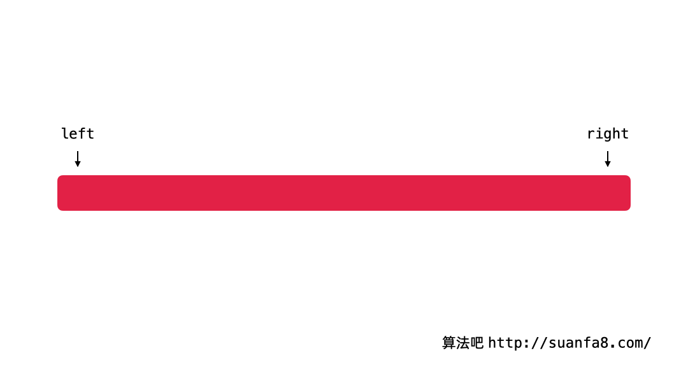

# 1. 算法思想

> 「二分查找 binary search」是一种基于分治策略的高效搜索算法。它利用数据的有序性，每轮缩小一半搜索范围，直至找到目标元素或搜索区间为空为止。

# 2 算法适用场景

> - 适用于排序后的数组， 可以是[1, 2, 3, …n] , 也可以是[OOOOO…XXXXXXXXX], 或者[1,2,3,4, 10, 9, 8, 7, 5]
> - 问题告诉我们的 **单调性**。有些问题虽然没有指出单调性，但是可以从题目中的描述得到可以 **逐步缩小搜索区间** 的条件，这些问题也可以使用「二分查找」来解决。

# 3. 算法模版

> 
>
> - **基本想法**：在循环中做判断，每一轮通过目标元素与中间元素的大小将搜索区间分为 3 个部分。根据看到的中间元素的数值，想清楚下一次搜索的区间是什么，进而设置 `left` 或者 `right` 的值。
>
> - #### 具体做法
>
>   - 先看中间的数与目标元素的关系，如果等于目标元素，就直接返回中间的数的索引；
>   - 如果中间的数比目标元素大，那么中间位置右边的数也一定比目标元素大，即中间位置右边的数也一定不是目标元素，目标元素只可能在中间位置的左边出现，因此把右边界设置为 `mid - 1` ，即 `right = mid - 1`；（同理看待另一边）
>   - 如果中间的数比目标元素小，那么中间位置左边的数也一定比目标元素小，即中间位置左边的数也一定不是目标元素，目标元素只可能在中间位置的右边出现，因此把左边界设置为 `mid + 1` ，即 `left = mid + 1`。

## 3.1 递归方式实现

> - 理解即可。

~~~java
public class Solution {

    public int search(int[] nums, int target) {
        int len = nums.length;
        if (len == 0) {
            return -1;
        }
        return binarySearch(nums, target, 0, len - 1);
    }

    /**
     * 在数组 arr 的子区间 [left..right] 里搜索目标元素
     *
     * @param arr    数组
     * @param target 目标元素
     * @param left   左边界下标，包括 left
     * @param right  右边界下标，包括 right
     * @return
     */
    private static int binarySearch(int[] arr, int target, int left, int right) {
        // 先处理递归到底的情况
        if (left > right) {
            // 不能形成区间，返回 -1 表示没有找到
            return -1;
        }
        int mid = (left + right) / 2;
        if (target == arr[mid]) {
            // 找到了，就将目标元素的索引返回
            return mid;
        } else if (target < arr[mid]) {
            // 既然是有序数组，目标元素的值比中间元素还要小，就应该在中间元素的左边去找
            return binarySearch(arr, target, left, mid - 1);
        } else {
            // 既然是有序数组，目标元素的值比中间元素还要大，就应该在中间元素的右边去找
            return binarySearch(arr, target, mid + 1, right);
        }
    }
}
~~~

## 3.2 非递归方式实现(常用)

> > **情况1**: 如果当前猜的数 `nums[mid]` 符合某个性质，我们还不能确定它一定就是我们要找的元素，
> >
> > > **重点内容**：把区间分成两个部分，~~去掉一定不存在目标元素的区间~~，只在有可能存在目标元素的区间里查找。这样当 `left` 与 `right` 重合的时候，我们才可以确定找到了目标元素（或者确定搜索区间里不存在目标元素）。
> > >
> > > **重点**：每一次排除掉一定不存在问题答案的区间，把 `left` 和 `right` 根据 `mid` 看到的值逐渐向中间靠拢，直到它们重合	`if` 写不符合这个性质，把 `mid` 排除掉；
> > >
> > > ​	`else` 就恰好是这个性质
> >
> > ​	**必须向左边**，继续看下去，才能确定 `nums[mid]`是不是我们要找的元素。为了避免死循环，一般使用 **模版二** 写法。
> >
> > ​	**必须向右边**，继续看下去，才能确定 `nums[mid]`是不是我们要找的元素。为了避免死循环，一般使用 **模版三** 写法。
>
> 
>
> > **情况2:** 如果当前猜的数 `nums[mid]` 符合某个性质，我们还确定它一定就是我们要找的元素，那就直接返回。
> >
> > 一般使用 **模版一** 写法, 当然 **模版二** 和 **模版三** 也可以
>
> > **情况3**: 如果当前猜的数 `nums[mid]` 符合某个性质，我们还不能确定它一定就是我们要找的元素，和情况1 一样需要左右偏移，
> >
> > 可以使用 **模版三** ， 这样就不用担心stack overflow 问题。但是需要搞清楚最后如何比较 left 和 right

~~~java
/* 模版一：（双闭区间） */
int binarySearch(int[] nums, int target) {
    // 初始化双闭区间 [0, n-1] ，即 start, end 分别指向数组首元素、尾元素
    int start = 0, end = nums.length - 1;
    // 循环，当搜索区间为空时跳出（当 start > end 时为空）
    while (start <= end) {
        int m = start + (end - start) / 2; // 计算中点索引 m
        if (nums[m] < target) // 此情况说明 target 在区间 [m+1, end] 中
            start = m + 1;
        else if (nums[m] > target) // 此情况说明 target 在区间 [start, m-1] 中
            end = m - 1;
        else // 找到目标元素，返回其索引
            return m;
    }
    // 未找到目标元素，返回 -1
    return -1;
}

/* 模版二，向左偏移 */
int binarySearchLeftMost(int[] nums, int target) {
    // 初始化双闭区间 [0, n-1] ，即 left, right 分别指向数组首元素、尾元素
    int left = 0, right = nums.length - 1;
    // 循环，当搜索区间为空时跳出（当 left = right 时为空）
    while (left < right) {
        int m = left + (right - left) / 2; // 计算中点索引 m
        // 小于一定不是解
        if (nums[mid] < target) {
            // 下一轮搜索区间是 [mid + 1..right]
            left = mid + 1;
        } else {
            // nums[mid] > target，下一轮搜索区间是 [left..mid]
            right = mid;
            }
    }
  	// 退出循环以后不能确定 nums[left] 是否等于 target，因此需要再判断一次
        if (nums[left] == target) {
            return left;
        }
    // 未找到目标元素，返回 -1
    return -1;
}

/* 模版三，向右偏移 */
int binarySearchRightMost(int[] nums, int target) {
    // 初始化双闭区间 [0, n-1] ，即 left, right 分别指向数组首元素、尾元素
    int left = 0, right = nums.length - 1;
    // 循环，当搜索区间为空时跳出（当 left = right 时为空）
    while (left < right) {
            int mid = left + (right - left + 1) / 2;
            if (nums[mid] > target) {
                // 下一轮搜索区间是 [left..mid - 1]
                right = mid - 1;
            } else
                // 下一轮搜索区间是 [mid..right]
                left = mid;
            }
        }
  	// 退出循环以后不能确定 nums[right] 是否等于 target，因此需要再判断一次
        if (nums[right] == target) {
            return right;
        }
    // 未找到目标元素，返回 -1
    return -1;
}

/* 模版四，专门解决stack overflow */
int binarySearch(int[] nums, int target) {
    // 初始化双闭区间 [0, n-1] ，即 start, end 分别指向数组首元素、尾元素
    int start = 0, end = nums.length - 1;
    // 循环，当搜索区间仅剩下start 和 end 两个时跳出
    while (start + 1 < end) {
        int m = start + (end - start) / 2; // 计算中点索引 m
        if (nums[m] < target) // 此情况说明 target 在区间 [m, end] 中
            start = m;
        else if (nums[m] > target) // 此情况说明 target 在区间 [start, m] 中
            end = m;
        else // 找到目标元素，返回其索引
            return m;
    }
  
//  	//进行判断，情况一：向右偏移
//    if(list.get(end) == target) return end;
//    if(list.get(start) == target) return start;
  
  	//进行判断，情况二：向左偏移
    if(list.get(start) == target) return start;  
    if(list.get(end) == target) return end;

  
    // 未找到目标元素，返回 -1
    return -1;
}
~~~

# 4. 算法复杂度

> - 时间复杂度：O(logN)
> - 空间复杂度: O(1)

