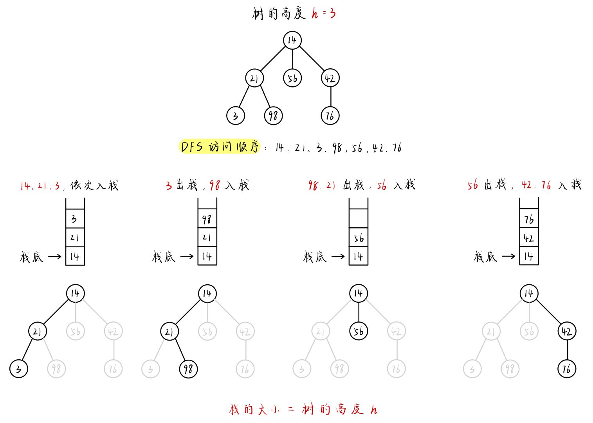
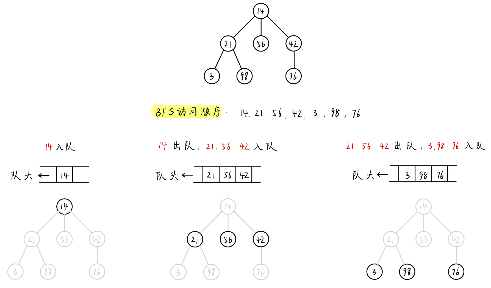

# 1. 算法思想

> DFS适用于那些具有树状或图状结构的问题，以及需要搜索解空间的问题。DFS的实现通常通过递归或栈来实现。需要注意的是，在某些情况下，DFS可能不是最优解决方案，因此在选择算法时需要综合考虑问题的性质和要求。
>
> 回溯算法和深度优先搜索（DFS）算法有一些相似之处，但也有一些关键区别。
>
> 1. **定义和目标：**
>    - **回溯算法：** 主要用于解决组合、排列、子集等问题，其目标是搜索问题的所有可能解，并在搜索过程中通过回溯（撤销之前的选择）来寻找有效解。
>    - **深度优先搜索（DFS）：** 是一种搜索算法，用于遍历或搜索图或树等数据结构的所有节点。DFS 通常用于判断两个节点之间是否连通，或者寻找路径等。
> 2. **状态的保存：**
>    - **回溯算法：** 在回溯算法中，通常需要显式地保存和恢复状态，即在每一步选择之前保存当前状态，在选择完成后恢复到之前的状态，以实现回溯。
>    - **深度优先搜索（DFS）：** 在 DFS 中，状态的保存通常是隐式的，因为递归调用栈本身就保存了状态。在 DFS 中，通常通过递归函数的参数传递状态信息，不需要显式保存和恢复状态。
> 3. **应用场景：**
>    - **回溯算法：** 通常应用于组合优化问题，如组合、排列、子集等。它更侧重于找到所有可能的解。
>    - **深度优先搜索（DFS）：** 通常应用于图的遍历、连通性判断、路径搜索等问题。它更侧重于在搜索过程中找到其中一个解。
> 4. **剪枝策略：**
>    - **回溯算法：** 回溯算法通常需要考虑剪枝策略，以减少搜索空间，提高算法效率。
>    - **深度优先搜索（DFS）：** 在一些情况下，也可以使用剪枝策略，但通常不需要像回溯算法那样频繁地进行状态的保存和恢复。
>
> 尽管回溯算法和深度优先搜索有一些相似之处，但它们在目标、应用场景和状态的保存方式上存在一些关键区别。在实际问题中，根据问题的性质选择合适的算法是很重要的。

# 2 算法适用场景

> - 深度优先搜索（DFS）是一种常用的搜索算法，适用于多种问题，尤其是图和树结构的遍历问题。以下是一些情况下使用DFS的典型场景：
>
>   > 1. **图的遍历：** DFS 可以用于图的深度优先遍历，查找特定节点或寻找路径。
>   > 2. **树的遍历：** 对于树结构，DFS可以用于先序遍历、中序遍历、后序遍历，或者其他变种。
>   > 3. **连通性问题：** 如果问题涉及到判断两个节点是否连通，或者查找图中的连通分量，DFS是一个常用的方法。
>   > 4. **路径问题：** 求解路径问题，如找到从起点到终点的路径，或找到满足某条件的路径。
>   > 5. **拓扑排序：** DFS可以用于拓扑排序，即对有向无环图进行排序。
>   > 6. **回溯算法：** 回溯算法通常使用DFS来穷举所有可能的解空间。
>   > 7. **状态空间搜索：** 在某些问题中，状态可以看作图的节点，DFS用于搜索状态空间。
>   > 8. **生成和验证问题：** 生成问题涉及到生成所有可能的解，验证问题涉及到验证某个解是否符合条件，DFS可以应用于这两种类型的问题。
>   > 9. 找满足某个条件的所有方案（99%）
>   > 10. 组合问题（95%）
>   >     - 问题模型：求出所有满足条件的“组合”
>   >     - 判断条件：组合中的元素是顺序无关的
>   > 11. 排列问题（95%）
>   >     - 问题模型：求出所有满足条件的“排列”
>   >     - 判断条件：组合中的元素是顺序“相关”的
>
> - 不要用 `DFS` 的场景
>
>   > 1. 连通块问题（一定要用 `BFS`，否则 `StackOverflow`）
>   >
>   > 2. 拓扑排序（一定要用 `BFS`，否则 `StackOverflow`）
>   >
>   > 3. 一切 `BFS` 可以解决的问题
>
>   

# 3. 算法模版

## 3.1 递归方式实现

> - 当我们递归地实现 DFS 时，似乎不需要使用任何栈。但实际上，我们使用的是由系统提供的隐式栈，也称为调用栈（Call Stack）。
>
> 

~~~java
/* * Return true if there is a path from cur to target. */
boolean DFS(Node cur, Node target, Set<Node> visited) {
   
    return true if cur is target;
    for (next : each neighbor of cur) {
        if (next is not in visited) {
            add next to visted;
            return true if DFS(next, target, visited) == true;
        }
    }
    return false;
}
~~~

## 3.2 非递归方式实现

> - 递归解决方案的优点是它更容易实现。 但是，存在一个很大的缺点：如果递归的深度太高，你将遭受堆栈溢出。 在这种情况下，您可能会希望使用 BFS，或使用显式栈实现DFS
>
> 

~~~java
/* * Return true if there is a path from cur to target. */
boolean BFS(int root, int target) {
    Set<Node> visited;
    Stack<Node> s;
    add root to s;
    while (s is not empty) {
        Node cur = the top element in s;
        return true if cur is target;
        for (Node next : the neighbors of cur) {
            if (next is not in visited) {
                add next to s;
                add next to visited;
            }
        }
        remove cur from s;
    }
    return false;
}
~~~

# 4. 算法复杂度

> - 时间复杂度：O(方案个数∗构造每个方案的时间)
>   - 树的遍历 ：O(n)
>   - 排列问题 ：O(n!∗n)
>   - 组合问题 ：O(2n∗n)
> - 空间复杂度: O(N)

