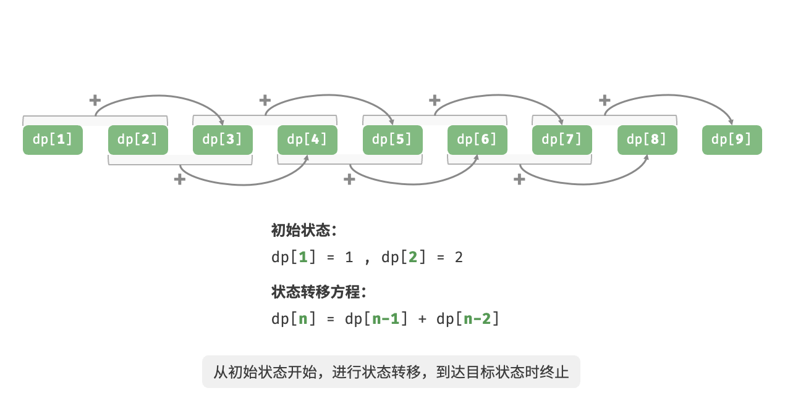
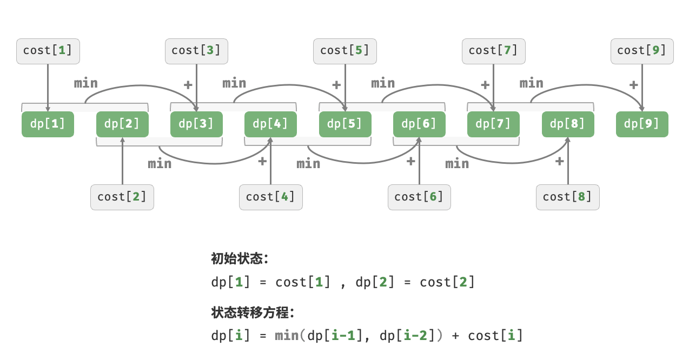
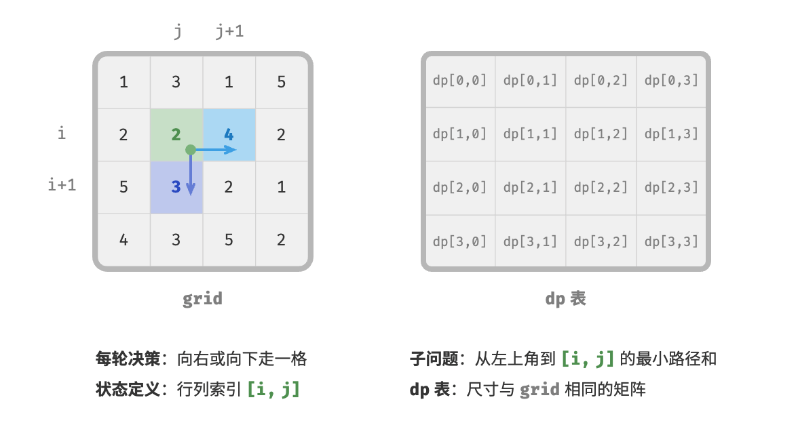
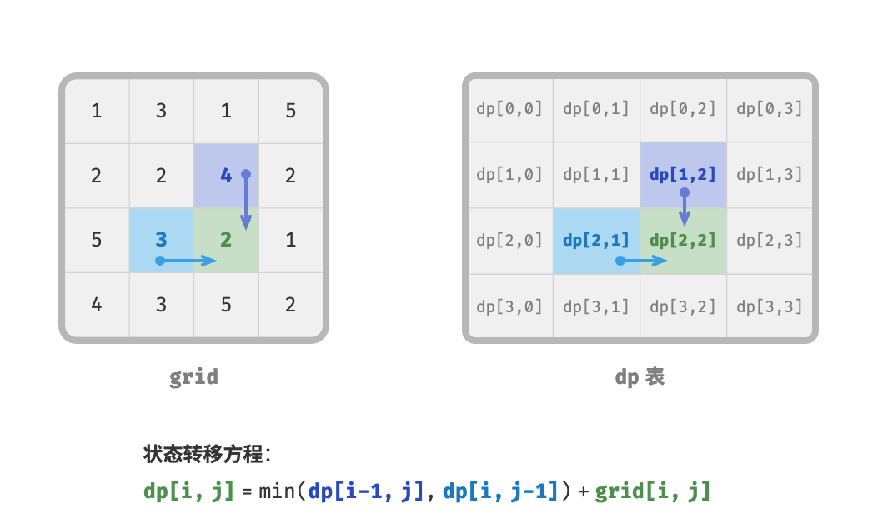
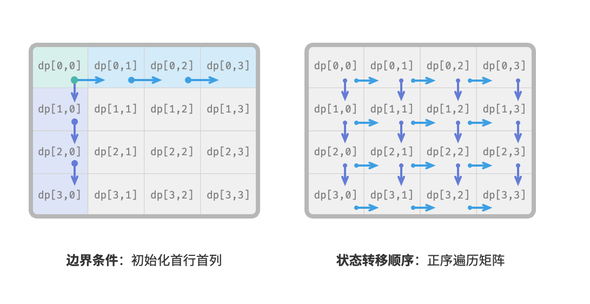
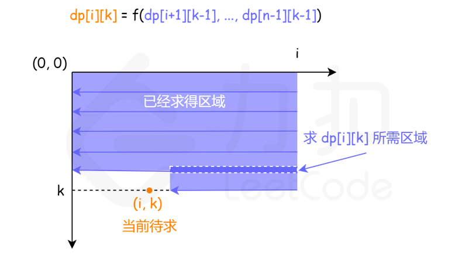
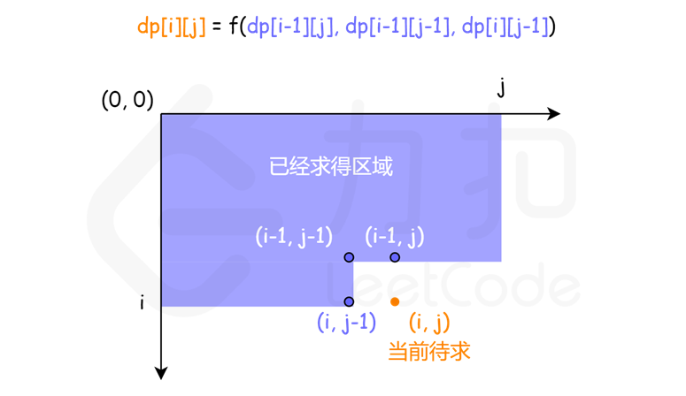
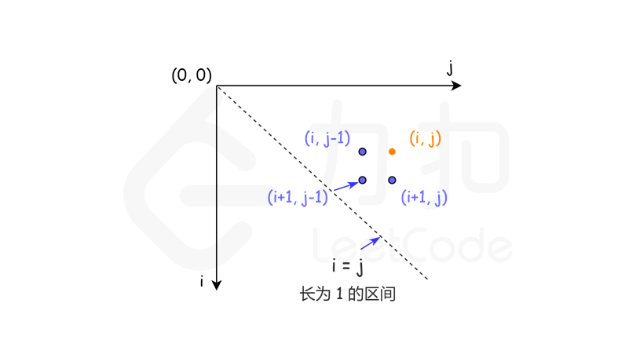
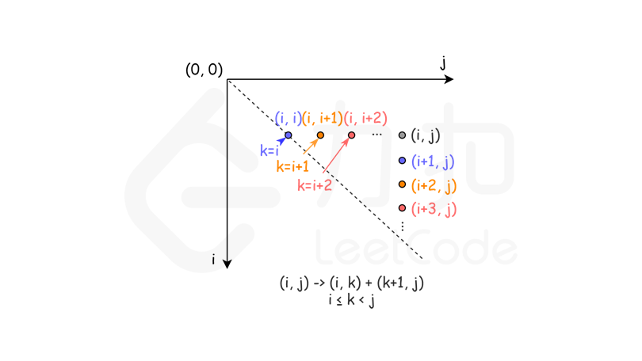

# 1. 算法思想

> - 动态规划对问题进行分解，并通过存储子问题的解来规避重复计算，提高 计算效率。
>
> - 不考虑时间的前提下，所有动态规划问题都可以用回溯（暴力搜索）进行求解，但递归树中存在大量的重叠子问题，效率极低。通过引入记忆化列表，可以存储所有计算过的子问题的解，从而保证重叠子问题只被计算一次。
>
> - 记忆化递归是一种从顶至底的递归式解法，而与之对应的动态规划是一种从底至顶的递推式解法，其如同“填写表格”一样。由于当前状态仅依赖某些局部状态，因此我们可以消除 表的一个维度，从而降低空间复杂度。
>
> - 子问题分解是一种通用的算法思路，在分治、动态规划、回溯中具有不同的性质。
>
> - 动态规划问题有三大特性：**重叠子问题、最优子结构、无后效性**。 
>
> - 如果原问题的最优解可以从子问题的最优解构建得来，则它就具有最优子结构。
>
> - 无后效性指对于一个状态，其未来发展只与该状态有关，而与过去经历的所有状态无关。许多组合优化问题不具有无后效性，无法使用动态规划快速求解。
>
>   - 只记录子问题的结果：这是因为动态规划在求解问题的过程中，实际上需要解决原始问题的所有子问题。如果把这些子问题的求解过程都记录下来，不仅有空间消耗，还有时间消耗。所以使用动态规划解决的问题通常只需要记录子问题的结果。
>
>   
>
> - 动态规划（Dynamic Programming）和分治（Divide and Conquer）都是解决问题的常用算法范式，它们有一些相似之处，但也存在明显的区别。
>
>   - 相似之处：
>
>   1. **问题划分：** 在两者中，问题都被划分为一些子问题，这些子问题可以独立求解。
>   2. **递归求解：** 对子问题的解进行递归求解。
>
>   - 区别：
>
>   1. **子问题重叠性：**
>      - **动态规划：** 动态规划中，子问题通常具有重叠性，即相同的子问题可能会被多次求解。为了避免重复计算，动态规划使用一种记忆化的方式（例如使用数组或哈希表）来存储已经计算过的子问题的解。
>      - **分治：** 分治通常不要求子问题有重叠性，因为分治每次都对问题进行完全划分，子问题之间没有共同的部分。
>   2. **最优子结构：**
>      - **动态规划：** 动态规划问题具有最优子结构性质，即全局最优解可以通过子问题的最优解来构建。
>      - **分治：** 分治问题可以没有最优子结构，即子问题的最优解并不一定能够直接构建全局最优解。
>   3. **问题求解方式：**
>      - **动态规划：** 动态规划通常采用自底向上的迭代方式，从最小的子问题开始逐步构建解。
>      - **分治：** 分治通常采用自顶向下的递归方式，将问题不断划分为子问题。
>   4. **时间复杂度：**
>      - **动态规划：** 动态规划常常具有较小的时间复杂度，因为它避免了重复计算。
>      - **分治：** 分治在不具备重叠子问题性质时可能导致较高的时间复杂度。

# 2 算法适用场景

> - 适用场景
>   - 最短路径问题、背包问题、字符串编辑距离等。
>   - 求最大值最小值
>   -  判断是否可行 
>   - 统计方案个数
> - 不适用场景
>   - 求出所有 具体 的方案而非方案 个数
>   - 输入数据是一个 集合 而不是 序列
>   - 动态规划擅长与优化指数级别复杂度(2^n,n!) 到多项式级别复杂度(n^2,n^3)

# 3. 算法模版

> - 求解一个动态规划问题有两个不同的方向：自顶向下与自底向上
>
>   1. **「递推」是从「问题边界」开始的正向推导**， 即 **Divide And Conquer + 记忆化搜索(剪枝)**
>
>   > 自顶向下：我们在解决问题的时候 **对原问题进行拆分**。
>   >
>   > - 拆分成不同规模的子问题，再对每一个子问题进行拆分。直到它们不能够再拆分为止；
>   >
>   > - 由于不能再拆分了，最小规模的子问题不用求解直接得到答案。然后一步一步 **向上传递**，根据较小规模的子问题得到较大规模的子问题的结果，直到原问题得到了解决。
>   >
>   > 自顶向下这件事情其实我们一直都在做。在生活和工作中遇到的问题，我们会把解决它们的方案和结果记录到博客和笔记中，如果以后再遇到它们，就不用再解决一遍。
>   >
>   > 例如 Minimum Path Sum
>   >
>   > 
>
>   2. **「递归」是从原问题开始到「问题边界」的反向推导**。
>
>   > 自底向上与自顶向下最大的不同在于：自底向上没有「拆分问题」的过程。直接从一个问题最小的规模开始，一步一步通过「递推」的方式得到原问题的答案.
>   >
>   > 例如： 斐波那契数列
>   >
>   > 
>   >
>   > 例如： 爬楼梯
>   >
>   > 
>
> - 动规四要素
>
>   1. 定义状态 **State**：定义子问题
>
>   > 我们在拆分子问题的时候，会想到一个问题：**如何描述子问题**。而描述子问题这件事情就叫做 **定义状态**。
>   >
>   > 例如： 在 Minimum Path Sum中， state: `dp[i][j]`从起点走到 i, j 的最短路径
>   >
>   > 
>
>   2. 推导状态转移方程 **Function**：描述不同规模子问题之间的关系
>
>   > 状态转移方程描述了不同规模子问题之间的关系。
>   >
>   > 由于求汇总值有这样的特点：**由小规模的问题的解可以得到大规模的问题的解**。
>   >
>   > 例如： 在 Minimum Path Sum中， state: `dp[i][j]= min(dp[i-1, j], dp[i, j-1]) + grid[i, j]`
>   >
>   > 例如： 在0-1背包问题中，`dp[i, c] = max(dp[i-1, c], dp[i-1, c - wgt[i-1]] + val[i-1])`
>   >
>   > - **不放入物品 i**：背包容量不变，状态变化为 dp[i-1, c] 。
>   >
>   > - **放入物品 i** ：前 i−1件物品放入剩下的容量为c - wgt[i-1]的背包中, 即`dp[i-1, c - wgt[i-1]] + val[i-1]`
>   >
>   >   
>   >
>   > 
>   
>   3. 确定初始化 **Initialization** ， **边界条件** 和  **状态转移顺序**
>   
>   > 例如在 爬楼梯 问题中， 初始化 `dp[1] = 1, dp[2]=2`
>   >
>   > 
>   
>   4. 答案 **Answer**
>
> 

## 3.1 从上往下实现通常使用递归和记忆化搜索

> - 记忆化递归是一种从顶至底的递归式解法

~~~java
//自顶向下
/* 最小路径和：记忆化搜索 */
int minPathSumDFSMem(int[][] grid, int[][] mem, int i, int j) {
    // 若为左上角单元格，则终止搜索
    if (i == 0 && j == 0) {
        return grid[0][0];
    }
    // 若行列索引越界，则返回 +∞ 代价
    if (i < 0 || j < 0) {
        return Integer.MAX_VALUE;
    }
    // 若已有记录，则直接返回
    if (mem[i][j] != -1) {
        return mem[i][j];
    }
    // 左边和上边单元格的最小路径代价
    int up = minPathSumDFSMem(grid, mem, i - 1, j);
    int left = minPathSumDFSMem(grid, mem, i, j - 1);
    // 记录并返回左上角到 (i, j) 的最小路径代价
    mem[i][j] = Math.min(left, up) + grid[i][j];
    return mem[i][j];
}
~~~

## 3.2 从下往上通常通过迭代实现

> - 

    //自下往上
    /* 最小路径和：动态规划 */
    int minPathSumDP(int[][] grid) {
        int n = grid.length, m = grid[0].length;
        // 初始化 dp 表
        int[][] dp = new int[n][m];
        dp[0][0] = grid[0][0];
        // 状态转移：首行
        for (int j = 1; j < m; j++) {
            dp[0][j] = dp[0][j - 1] + grid[0][j];
        }
        // 状态转移：首列
        for (int i = 1; i < n; i++) {
            dp[i][0] = dp[i - 1][0] + grid[i][0];
        }
        // 状态转移：其余行和列
        for (int i = 1; i < n; i++) {
            for (int j = 1; j < m; j++) {
                dp[i][j] = Math.min(dp[i][j - 1], dp[i - 1][j]) + grid[i][j];
            }
        }
        return dp[n - 1][m - 1];
    }


# 4. 算法复杂度

> - 时间复杂度
> - 空间复杂度


# 5 动态规划总结

## 5.1 线性动态规划

线性动态规划是动态规划中最基础的一类，它的状态一般物理意义很明确，易于分析。在初学动态规划时，通过线性动态规划的大量练习，可以不断加深动态规划的概念理解，例如动态规划中最重要的三个概念：最有子结构，重复子问题，无后效性。下面对动态规划的三个基本概念做个简要回顾，在线性动态规划的题目练习中可以不断地加深理解，之后再学习其它的动态规划类型就会容易很多。

最优子结构：如果问题的最优解所包含的子问题的解也是最优的，就称该问题具有最优子结构。 无后效性：即某阶段状态一旦确定，就不受这个状态以后决策的影响。也就是说，某状态以后的过程不会影响以前的状态，只与当前状态有关。 重复子问题：即子问题之间是不独立的，一个子问题在下一阶段决策中可能被多次使用到。（该性质并不是动态规划适用的必要条件，但是如果没有这条性质，动态规划算法同其他算法相比就不具备优势） 线性动态规划是动态规划中变化最多的一类。

首先线性动态规划针对的问题是最常见的数组，字符串，矩阵等，这三种数据结构本身就是线性的，因此出现这些类型的输入的时候，如果要用到动态规划，首先考虑线性动态规划就很合理了，因此很多问题不论最后正解是不是线性动态规划，都会首先想一下线性动态规划是否可行。

其次由于大部分问题的数据都是以这三种形式给出的，因此题目的变化会非常多，很多常见的输入形式以及问题都非常经典，都存在经典的状态设计。因此不考虑一些比较 Trick 的解法，仅仅是经典问题的经典状态设计，就比其它种类的动态规划问题多很多了。

例如单个数组或字符串上设计一维状态，两个数组或字符串上设计两维状态，以及矩阵上设计两维状态等等，同时以上三种情况的状态设计都有可能再加上额外的指标的状态，就是前面例题中的 k，这里面变化就很多了，比如有的题目在 k 这一维上要使用二分，贪心的策略，有的题目需要 DP 状态与数据结构配合来解决问题。

除此之外还有一类问题没有显式的数组，字符串，但是在求解的时候依然满足前面提到的动态规划三条基本概念，可以用动态规划求解，这种问题通常也是线性动态规划。如此多的变化仅仅本小节例举的题目是远远不够的，下一小节是线性动态规划的练习题，涉及到对线性动态规划的更多的变化。

### 5.1.1 一维单串线性动态规划

#### 5.1.1.1 问题分析

单串 dp [i] 线性动态规划最简单的一类问题，输入是一个串，状态一般定义为 `dp[i] := 考虑 [0..i]` 上，原问题的解，其中 `i` 位置的处理，根据不同的问题，主要有两种方式：

- 第一种是 `i` 位置必须取，此时状态可以进一步描述为 `dp[i] := 考虑 [0..i]` 上，且取 `i`，原问题的解；
- 第二种是 `i` 位置可以取可以不取

大部分的问题，对 `i` 位置的处理是第一种方式，例如力扣：

- 70 爬楼梯问题
- 801 使序列递增的最小交换次数
- 790 多米诺和托米诺平铺
- 746 使用最小花费爬楼梯

线性动态规划中单串 `dp[i]` 的问题，状态的推导方向以及推导公式如下


一般有以下两种问题

- 1. **依赖比 i 小的 O (1) 个子问题**

> `dp[n]` 只与常数个小规模子问题有关，状态的推导过程 `dp[i] = f(dp[i - 1], dp[i - 2], ...)`。时间复杂度 `O(n)`，空间复杂度 `O(n)` 可以优化为 `O(1)`，例如上面提到的 70, 801, 790, 746 都属于这类。
>
> 如图所示，虽然蓝色部分的 `dp[i-1], dp[i-2], ..., dp[0]` 均已经计算过，但计算橙色的当前状态时，仅用到 `dp[i-1]`，这属于比 `i`小的 `O(1)` 个子问题。
>
> 例如，当 `f(dp[i-1], ...) = dp[i-1] + nums[i]` 时，当前状态 `dp[i]` 仅与 `dp[i-1]` 有关。这个例子是一种数据结构前缀和的状态计算方式，关于前缀和的详细内容请参考下一章。

- 2. **依赖比 i 小的 O (n) 个子问题**

> `dp[n]` 与此前的更小规模的所有子问题 `dp[n - 1], dp[n - 2], ..., dp[1]` 都可能有关系。
>
> 状态推导过程如下：`dp[i] = f(dp[i - 1], dp[i - 2], ..., dp[0])`
>
> 依然如图所示，计算橙色的当前状态 `dp[i]` 时，绿色的此前计算过的状态 `dp[i-1], ..., dp[0]` 均有可能用到，在计算 `dp[i]` 时需要将它们遍历一遍完成计算。
>
> 其中 `f` 常见的有 `max`/`min`，可能还会对 `i-1,i-2,...,0` 有一些筛选条件，但推导 `dp[n]` 时依然是 `O(n)` 级的子问题数量。
>
> 例如：
>
> - 139 单词拆分
> - 818 赛车
>
> 以 `min` 函数为例，这种形式的问题的代码常见写法如下

```cpp
for i = 1, ..., n
    for j = 1, ..., i-1
        dp[i] = min(dp[i], f(dp[j])
```

时间复杂度`O(n^2) `，空间复杂度 `O(n)`

#### 5.1.1.2 相关练习题

- 最经典单串 LIS 系列
  - 最长递增子序列
  - 最长递增子序列的个数
  - 俄罗斯套娃信封问题
- 最大子数组和系列
  - 最大子序和
  - 乘积最大子数组
  - 环形子数组的最大和 —— 环形数组的处理
  - 面试题 17.24 最大子矩阵 —— 思路类似一维的最大子数组和
  - 矩形区域不超过 K 的最大数值和 —— 在上一题基础上加了一个 K
- 打家劫舍系列
  - 打家劫舍
  - 打家劫舍 II
  - 删除与获得点数
  - 3n 块披萨
- 变形：需要两个位置的情况
  - 最长的斐波那契子序列的长度
  - 最长等差数列
- 与其它算法配合
  - 形成字符串的最短路径 —— DP + 二分，贪心
  - 最大整除子集 —— 先对数组排序
- 其它单串 dp [i] 问题
  - 最长有效括号
  - 等差数列划分
  - 解码方法
  - 分割回文串 II
  - 比特位计数
  - 使序列递增的最小交换次数
  - 最低加油次数
  - 两个字符串的删除操作

### 5.1.2 多维单串线性动态规划

#### 5.1.2.1 问题分析

单串的问题，子问题仅与位置 `i` 有关时，就形成单串 `dp[i]` 的问题。在此基础上，如果子问题还与某种指标 `k` 有关，`k` 的物理意义比较常见的有长度，个数，次数，颜色等，则是另一大类问题，状态通常写成 `dp[i][k]`。其中 `k` 上可能有二分，贪心等算法.

当 `i` 变小时，形成小规模子问题，当 `k` 变小时，也形成小规模子问题，因此推导 `dp[i][k]` 时，`i` 和 `k` 两个维度分别是一个独立的单串 dp [i] 问题。推导 `k` 时，`k` 可能与 `k - 1,...,1` 中的所有小规模问题有关，也可能只与其中常数个有关，参考单串 `dp[i]` 问题中的两种情况。

例如 256. 粉刷房子 ，其中 `k` 这一维度的物理意义是颜色推导 `k` 时，`k` 与 `k - 1,...,1` 中的所有小规模问题有关，则 `k` 这一维度的时间复杂度为 

单串 `dp[i][k]` 的问题，推导状态时可以先枚举 `k`，再枚举 `i`，对于固定的 `k`，求 `dp[i][k]` 相当于就是在求一个单串 `dp[i]` 的问题，但是计算 `dp[i][k]` 时可能会需要 `k-1` 时的状态。具体的转移需要根据题目条件确定。参考 813。

矩阵上的 `dp[i][j]` 这类问题中也有可能会多出 `k` 这个维度，状态的定义就是 `dp[i][j][k]`，例如

- 576 出界的路径数
- 688 “马” 在棋盘上的概率


**带维度经典问题**

以下将涉及到的知识点对应的典型问题进行讲解，题目和解法具有代表性，可以从一个问题推广到一类问题。

==【813. 最大平均值和的分组】==

> 我们将给定的数组 A 分成 K 个相邻的非空子数组 ，我们的分数由每个子数组内的平均值的总和构成。计算我们所能得到的最大分数是多少。 注意我们必须使用 A 数组中的每一个数进行分组，并且分数不一定需要是整数。

输入是单串，但是有一个额外的次数的指标 k。在这种情况下，第一步是考虑单串 `dp[i]` 的子问题拆分方式：枚举子数组的起点来拆分子问题。

设计状态 `dp[i] := [i..n-1]` 上原问题的解，即 `[i..n-1]` 上分成 `K` 个相邻的非空子数组可得的最大分数

第二步是将额外的指标 `K` 作为一个维度加到状态里　`dp[i][k] := [i..n-1]` 上原问题的解，即 `[i..n-1]` 上分成 `k` 个相邻的非空子数组可得的最大分数

在推导状态时，先枚举 `k`，对于固定的 `k`，枚举 `i` ，枚举 `i` 时，相当于是在推导一个单串 `dp[i]` 的问题，但是计算 `dp[i][k]` 时需要用到 `k-1` 时的状态，这个区别在 2-1-4 中也有讨论。

由于 `i` 枚举的是起点，因此 `i` 越小的时候，子问题规模越大，需要从 `n-1` 到 `0` 枚举。

上面提到，固定 `k` 时，枚举 `i` ，相当于是在推导一个单串 `dp[i]` 的问题，这个问题在计算 `i` 的时候，需要此前已经计算的所有状态，即 `i+1, i+2, ..., n-1`。这相当于一维单串线性动态规划 中的第二种情况，但区别是这里有 `k` 这一个额外指标影响状态的推导。

对于区间 `[i..n-1]`，若分出了区间 `[i,j-1]`, 则在区间 `[j..n-1]` 上分 `k - 1` 个区间，就可以将 `[i..n-1]` 分成 `k` 个区间。而 `[i+1, .., n-1]` 均有可能是这个 `j`。因此枚举这些 `j` ，将 `[j, n-1]` 上分 `k-1` 份的结果 `dp[j][k-1]` 加上 `[i..j-1]` 上的平均追 `avg(i, j-1)` 就得到了当前待计算状态 `dp[i][k]`。

结合题目条件，这个单串 `dp[i][k]` 的问题，状态的推导方向，以及推导公式如下:




按照以上的分析，状态的转移方程可以写出来，如下：

`dp[i][k]= min(dp[i][k], dp[j][k-1] + avg(i, j-1))`,  j 取[i + 1, …, n-1]较小值

其中 `avg(i, j)`，是求子串 (i, j) 上的平均值，其中中间的一步求 可以用前缀和实现。前缀和的内容参考下一章

#### 5.1.2.2 相关练习题

- 带维度单串 `dp [i][k]`
  - 最大平均值和的分组 —— k 是个数
  - 鸡蛋掉落 —— k 是次数，k 上有二分
  - 粉刷房子 —— k 是颜色
  - 粉刷房子 II —— k 是颜色
  - 奇偶跳 —— k 表示当前的奇偶状态
  - 青蛙过河 —— k 表示上一步的跳的步数
  - 安排邮筒 —— k 是个数，前缀和维护状态转移时的查询
  - 抛掷硬币 —— k 是个数
  - 分割数组的最大值 —— k 是份数
  - 给房子涂色 III —— 有两个指标 k 颜色；t 街区数
- 股票系列
  - 买卖股票的最佳时机
  - 买卖股票的最佳时机 II
  - 买卖股票的最佳时机 III
  - 买卖股票的最佳时机 IV
  - 最佳买卖股票时机含冷冻期
  - 买卖股票的最佳时机含手续费

### 5.1.3 双串线性动态规划

#### 5.1.3.1 问题分析

有两个输入从串，长度分别为 m, n，此时子问题需要用 i, j 两个变量表示，分别代表第一个串和第二个串考虑的位置 `dp [i][j]:= `第一串考虑 [0..i]，第二串考虑 [0..j] 时，原问题的解

较大规模的子问题只与常数个较小规模的子问题有关，其中较小规模可能是 i 更小，或者是 j 更小，也可以是 i，j 同时变小。

其中一种最常见的状态转移形式：推导 `dp [i][j]` 时，`dp [i][j]` 仅与 `dp [i-1][j]`, `dp [i][j-1]`, `dp [i-1][j-1]`，例如

- 72 编辑距离
- 712 两个字符串的最小 ASCII 删除和

线性动态规划中双串 dp [i][j] 的问题，状态的推导方向以及推导公式如下：

[

如图所示，绿色部分的 `dp [i-1 ~ 0][j-1 ~ 0]` 均已经计算过，但计算橙色的当前状态时，仅用到 `dp [i-1][j]`, `dp [i][j-1]`, `dp [i-1][j-1]`，即比 i, j 小的 O (1) O (1) 个子问题

这种形式的线性 DP 的代码常见写法

```cpp
for i = 1..m
    for j = 1..n
        dp[i][j] = f(dp[i-1][j-1], dp[i-1][j], dp[i][j-1])
```

时间复杂度 O (mn)，空间复杂度 O (mn)

以上是 O (1) 转移的情况，即计算 dp [i][j] 时，虽然绿色部分的子问题均已经计算完，但只需要用到 dp [i-1][j], dp [i][j-1], dp [i-1][j-1]。也可能出现更高复杂度的转移，类似单串中依赖比 i 小的 O (n) 个子问题的况。

#### 5.1.3.2 相关练习题

- 最经典双串 LCS 系列
  - 最长公共子序列
  - 两个字符串的最小 ASCII 删除和 —— LCS，len 和 ascii 各一个 dp
  - 最长重复子数组 —— 最长公共子串，注意与最长公共子序列的区别
- 字符串匹配系列
  - 编辑距离
  - 通配符匹配
  - 正则表达式匹配
- 其它双串 dp [i][j] 问题
  - 交错字符串
  - 不同的子序列
- 带维度双串 dp [i][j][k]
  - 扰乱字符串

### 5.1.4 矩阵动态规划

#### 5.1.4.1 问题分析

输入是一个矩阵，宽和高分别为 m, n，用两个维度表示问题规模 dp [i][j]:= 第一维度考虑 [0..i], 第二维度考虑 [0..j]，原问题的解

这样的状态定义，i 减小，j 减小均可以得到小规模子问题，两个维度均从小到大按顺序推，单独看各自维度，均是一个类似 上 的单串 dp [i] 问题，同样有单串中的两种情况，即转移时要考虑 O (1) 个小规模子问题，和转移时要考虑 O (n) 个子问题。

两个维度均只需考虑 O (1) O (1) 个子问题是最简单的情况，一般 dp [i][j] 就只与 dp [i-1][j], dp [i][j-1], dp [i-1][j-1] 有关，例如 64，但是也有可能出现需要其它位置的状态的情况，需要结合题目分析，这里分析的计算 dp [i][j] 需要哪些状态，决定了状态推导的方向。

线性动态规划中矩阵 dp [i][j] 的问题，状态的推导方向以及推导公式与双串 dp [i][j] 相同，但是物理意义不一样，且求 dp [i][j] 时所需的子问题的变化相对更多。

#### 5.1.4.2 相关练习题

- 矩阵 `dp [i][j]`
  - 三角形最小路径和
  - 最小路径和
  - 地下城游戏
  - 下降路径最小和
  - 最大正方形
  - 下降路径最小和 II
- 矩阵 `dp [i][j][k]`
  - 最大矩形
  - 矩形区域不超过 K 的最大数值和 —— k 为宽度
  - 最大子矩阵 —— 思路类似一维的最大子数组和
  - 切披萨的方案数 —— 需要二维前缀和判断两个状态之间能否转移


## 5.2 前缀和&区间和

前缀和是一种查询数组中任意区间的元素的和的数据结构，这里数组给定之后就不变了。针对这个不变的数组，前缀和用于多次查询区间 `[i, j]` 上元素的和。

对于动态规划而言，前缀和的意义主要有两点：

1. **一维和二维前缀和的推导，分别用到了单串和矩阵中最经典的状态设计以及状态转移；**
2. **在一些更复杂的动态规划问题中，状态转移的时候需要依赖区间和，因为状态转移是非常频繁的操作，因此必须高效地求区间和才能使得状态转移的时间复杂度可接受，此时就必须用到前缀和了。**

除此之外，一些问题需要前缀和与其它数据结构配合来解决，也有两类：

1. 先预处理出前缀和数组，这一步是动态规划，然后在前缀和数组上用其它数据结构解决；
2. 还是按照动态规划的方式求前缀和，也需要额外的数据结构维护前缀和，但不是预处理好前缀和数组之后再用数据结构计算，而是每求出一个前缀和，就更新一次数据结构并维护答案。

前缀和的推导和计算隐含着动态规划的基本思想，同时它的状态设计是线性动态规划中比较简单的那一类。与线性动态规划一样，前缀和也有一维和二维两种场景。

虽然前缀和本身很简单，但需要用到它解决的问题非常多，与其它数据结构配合的变化也很多，因此需要从线性动态规划中剥离出来单独学习。

考虑以下问题：

给定长度 `n` 的序列 `a`：，给每个前缀求一次和，$S_{i}=\sum_{j=0}^{i-1}a_{j}$ 。这些前缀和维护在一个长度 数组 `S` 里，称为前缀和数组。

有两类在数组 `a` 上的求和需求

- 前缀和：求 `a[0..i]` 的和
- 区间和：求区间 `a[L, R]` 的和

对于**前缀和**，`S[i + 1]` 刚好就是答案，因为这就是前缀和的定义：$ S_{i + 1}=\sum_{j=0}^{i}a_{j} $。

对于**区间和**，解决此问题最直观的方法是枚举 `[L, R]` 上的所有元素求和：$sum(L, R) = \sum_{idx = L}^{R}nums[idx]$。

这种方法虽然直观，但是不足是查询一次需要 `O(N)` 时间，并且每来一个新的查询，就要重新枚举元素求和。通过简单的画图推导可以得到答案为 `S[R + 1] − S[L]`

如果查询次数很多，当新查询来时，此前的查询计算的中间结果很多是可以直接用的，新的查询不必重新枚举，例如 此前查询过 `sum(5, 10)`，现在来了新查询 `sum(4, 8)` 在计算新查询时，`5 ~ 8` 这一段在计算此前的查询 `sum(5, 10)` 的时候已经计算过了，新查询的计算过程可以写成 `nums[4] + sum(5, 8)`，而不用全部枚举。

如果已经有了 前缀和数组，那么通过简单的画图推导可以知道，两个前缀和 `S[R+1]` 和 `S[L]` 的差刚好就是 `[L, R]` 上的区间和。已有前缀和数组之后，这一步操作就是 `O(1)` 的。

现将前缀和数组预处理出来，然后在每次查询中直接通过前缀和数组来计算而不是通过原数组，这是一种缓存中间结果的思想，如果把这一思想执行彻底，可以将所有可能的问题 `sum(i, j)` 其中 `0 <= i <= j <= n-1`，将计算它们所需的所有中间结果先算一次缓存下来。这里提到的是缓存所有所需的中间结果，而不是子问题的中间结果，因为计算 `sum(i, j)` 需要的中间结果是前 `i-1` 个数的和 `sum(0,i)`和前 `j` 个数的和 `sum(0, j+1)`。最终 `sum(i, j) = sum(0, j+1) - sum(0, i)` 这对于所有的区间查询都是适用的。

以上将中间结果缓存思路与动态规划中缓存子问题的解的思路是一致的。

定义 `sums[k]` 为 `[0..k-1]` 的和，其中 `sums[0]` 表示数组中没有数字被选中，`sums[1]` 表示之选中第一个数 `nums[0]`。 预先计算 `0 ~ k (0 <= k <= n-1)` 的和，这一系列的和都是从 `0` 开始的，因此称为前缀和。 

**前缀和公式**：

1. `k = 0` : $sum(0,0)=0$ 
2. `1 <= k <= n-i` : $sum(0,k) = \sum_{i=0}^{k-1}nums[i]$

**区间和公式**

 `sum(i, j) = sums(0, j + 1) - sum(0, i)`

在上一章中，我们把线性动态规划中几种主流问题及其对应的 dp 状态设计做了总结。**其中最基础的一种是单串 `dp[i]`，并且只与子问题 `i - 1` 有关，即 `dp[i] = f(dp[i-1])`。前缀和就是这种情况，`sums[i]` 只与 `sums[i-1]` 有关**。推导前缀和数组的过程是 `O(N)` 的，如果区间和的查询次数达到了 `O(N)` 那么计算区间和的时间复杂度是摊销 `O(1)` 的。

以上就是前缀和的基础介绍了，其中比较关键的有两点

1. **预处理前缀和的过程是最简单且最经典的单串动态规划问题。**
2. **先将所有位置的前缀和预处理出来，然后再处理区间和的查询，这是一种先缓存中间结果再处理查询的思路，因为这些中间结果在查询时需要反复用到，缓存之后就不用反复计算了，因此花时间预处理这些信息是有效的。**

前缀和除了求区间和之外，还有一些其它的应用：

1. 在用 dp 的方式推 `sums[i]` 的时候，有时求完 `sums[i]` 需要查询以前算过的结果计算某种指标，需要用其它数据结构将前面的计算结果维护起来，例如哈希表等等，在求每个位置的前缀和的过程中，查询数据结构并更新答案，这是前缀和的一大类问题，变化比较多，力扣上这类题也有很多，在本章最后一节中汇总了一些题目，在下一节也选择了典型题目做讲解。
2. 前缀和的逆运算是差分，对原序列求出其差分序列，然后在对得到的差分序列求其前缀和序列，可以得到原序列，这在处理一些区间修改的问题时很有用，参考后面小节的题目讲解。
3. 前缀和还可以推广到二维上，并用于快速求矩形和，二维前缀和的计算过程是最经典的矩阵上的线性动态规划，参考后面一节的题目和讲解。

### 5.2.1 前缀和

#### 5.2.1.1 问题分析

前缀和是一种查询数组中任意区间的元素的和的数据结构，这里数组给定之后就不变了。针对这个不变的数组，前缀和用于多次查询区间 `[i, j]` 上元素的和。

**前缀和公式**：

- `k = 0` : $sum(0,0)=0$ 

- `1 <= k <= n-i` : $sum(0,k) = \sum_{i=0}^{k-1}nums[i]$

基于前缀和，会有以下变形

1. **将前缀和维护在数据结构中，以便于后续的 多次 查询，最常见的是维护在哈希表中**。

   >在上一节中提到，在用 `dp` 的方式推 `sums[i]` 的时候，有时求完 `sums[i]` 需要查询以前算过的结果计算某种指标，需要用其它数据结构将前面的计算结果维护起来，以便高效查询。以下几个问题就是以上思路的直接应用。
   >
   >将前缀和维护在数据结构中，以便于后续的 多次 查询，最常见的是维护在哈希表中。
   >
   >力扣上这种题目非常多，更多题目详见本章后续节。下面考虑几个经典问题：
   >
   >第一问： $a_{0}, a_{1}, ..., a_{n-1}$上有没有一个区间，其和为 `target`。 计算前缀和数组 `sums[i]` 。当扫描到 i 时， 的前缀和都已经求过了，在计算的过程中将前缀和维护在数据结构中，以便于后续的多次查询，本题在之后要查询前缀和的值是否存在，因此维护在 `unordered_set` 里。
   >
   >求完当前值 `a[i]` 对应的前缀和 `S[i+1]`, 在插入到 `unordered_set` 之前先问：`S[i+1] - target` 在 `unordered_set` 中是否出现：
   >
   >- 如果出现，说明存在以 i 结尾的某个区间，和为 `target`, 则找到答案。
   >- 如果不出现，则没有以 i 结尾的区间，和为 `target`，继续枚举 `i + 1`。
   >
   >上面的问题还可以有变种：
   >
   >第二问： $a_{0}, a_{1}, ..., a_{n-1}$上有多少个区间，其和为 `target`。
   >
   >按照第一问的思路，把 `unordered_set` 改成 `unordered_map` 就可以
   >
   >> 参考题目：560. 和为 K 的子数组
   >
   >第三问： $a_{0}, a_{1}, ..., a_{n-1}$上有没有一个区间，其和大于或小于 `target`。
   >
   >整体思路与第一问相同，但是维护前缀和的数据结构需要从哈希表变为线段树
   >
   >> 参考题目：327. 区间和的个数
   >
   >第四问：一棵树上有没有某个路径，其和为 `target`。
   >
   >这是第一问的树形版本，`dfs`（前序遍历）时，栈里存的是当前节点到根的链，这条链上的和可以作为前缀和维护在 `unordered_map`里。从左子树跳到右子树的时候，左子树的所有节点对应的前缀和要先从 `unordered_map` 中删掉。
   >
   >> 参考题目： 437. 路径总和 III

2. **基于前缀和的运算推广**

   > 前缀和求的是数组 a 的前缀 [0..i-1] 的和，也就是对这些元素做加法结果，实际上对前缀 [0..i-1]，我们还可以做很多其它运算得到相应结果。 如果利用前缀上的某种运算的结果，可以像前缀和一样快速得到区间 [L, R] 上同样运算的结果，那么前缀和就成功推广了。
   >
   > 事实上这种运算是存在的，例如异或运算，对应每个前缀 [0..i-1] ，我们都可以求得一个异或值，称为前缀异或，而对于区间 [L, R]。	我们可以用 [0..R] 的前缀异或减去 [0..L-1] 的前缀异或就可以得到区间上的异或值，这个逻辑与前缀和完全相同。这依赖于异或运算	的性质。 如果想将某种运算应用到前缀元素上，并且利用前缀的结果快速计算区间结果，需要该运算满足 区间减法：区间 A = [i, j]，区间 B = [i, k] 区间 C = [k+1, j]，那么有了大区间 A 上的结果 a 和其中一个小区间 B 上的结果 b, 要能够算出另一个小区间 C 上的结果 c 。例如:
   >
   > - 异或：$a = b \oplus c => c = b \oplus a$
   > - 乘法或模下乘法：$a = b \times c => c = a / b$

3. **基于前缀和的差分**

   >前缀和序列 $S_{0}, S_{1}, ..., S_{n}$的差分序列 $a_{0}, a_{1}, ..., a_{n-1}$就等于原序列，其中 $a_{i} = S_{i+1} - S_{i}$ 原序列 $a_{0}, a_{1}, ..., a_{n-1}$的差分序列为 $$b_{0}, b_{1}, ..., b_{n-1}$$，其中$$b_{0} = a_{0} - 0, b_{i} = a_{i} - a_{i-1}$$ , 则对差分序列求前缀和序列，就得到原序列。
   >
   >差分序列的好处是如果要对原序列的一个区间 `[l, r]` 上所有值加 `val`，原序列上要操作 `r-l+1` 次 `(a[l .. r] + val)`，在差分序列上只需要操作 `2` 次 `(b[l] + val, b[r+1] - val)`。如果这种区间操作需要很多次，最后的查询只有一次的话，就非常适合在差分序列上操作
   
   

#### 5.2.1.2 相关练习题

**数据结构维护前缀和相关练习题**

- HashMap 维护 (1)，键是前缀和（状态）的值，值为第一次出现时的索引
  - 和等于 k 的最长子数组长度
  - 连续数组
  - 每个元音包含偶数次的最长子字符串 —— 前缀状态为 a,e,i,o,u 的个数的奇偶
- HashMap 维护 (2)，键是前缀和（前缀状态）的值，值为出现次数
  - 和为 K 的子数组
  - 统计优美子数组 —— 前缀状态为奇数的个数
- HashMap 维护 (3)，键是前缀和模 K 的余数（可以理解为前缀状态，状态为前缀和模 K）
  - 连续的子数组和 —— 值为第一次出现时的索引
  - 和可被 K 整除的子数组 —— 值为出现次
- 前缀和（积）与后缀和（积）均需要
  - 除自身以外数组的乘积
  - 寻找数组的中心索引
  - 找两个和为目标值且不重叠的子数组 —— 前缀和后缀和分别推一次，推的时候保存信息（DP），枚举分割点
- 二维前缀和
  - 元素和为目标值的子矩阵数量
  - 矩阵区域和
  - 最大子矩阵 —— 思路类似一维的最大子数组和
  - 矩形区域不超过 K 的最大数值和 —— 在上一题基础上加了一个 K

**基于前缀和的运算推广**

- 前缀和 乘积最大子数组 乘积小于 K 的子数组 最后 K 个数的乘积 —— 若乘法的前缀积会溢出，可以用对数的前缀和防溢出，但是结果转回整数需要用四舍五入而不是下取整
- 前缀异或 子数组异或查询 形成两个异或相等数组的三元组数目 —— 哈希表维护前缀异或结果，类似 「560. 和为 K 的子数组」

**差分相关练习题**

- 区间加法 —— 用差分维护区间加法模板

### 5.2.2 区间和

#### 5.2.2.1 问题分析

利用前缀和求区间和的思想，已经求前缀和的过程在上一节中已经重点介绍，这里主要回顾一下前缀和中的动态规划思想，如下：

- 状态定义：`sums[i] := [0..i-1]` 的和
- 状态转移：`sums[i] = a[i - 1] + sums[i - 1]`
- 初始化：`sums[0] = 0`

这是最简单的单串线性动态规划，其思想在上一章重点介绍。求解该动态规划问题后得到数组 `sums` 。然后区间和问题就变成了两个前缀和的差的问题。

```cpp
int rangeRum(int L, int R)
{
    return sums[R + 1] - sums[L];
}
```

#### 5.2.2.2 相关练习题

- 实现前缀和问题
  - 区域和检索 - 数组不可变
  - 二维区域和检索 - 矩阵不可变

## 5.3 区间动态规划

在输入为长度为 n 的数组时，子问题用区间 `[i..j]` 表示。

状态的定义和转移都与区间有关，称为区间动态规划。

区间动态规划一般用在单串问题上，以区间 [i, j] 为单位思考状态的设计和转移。它与线性动态规划在状态设计和状态转移上都有明显的不同，但由于这两个方法都经常用在单串问题上，导致我们拿到一个单串的问题时，经常不能快速反映出应该用哪种方法。这是区间动态规划的难点之一，但是这个难点也是好解决的，就是做一定数量的练习题，因为区间动态规划的题目比线性动态规划少很多，并且区间动态规划的状态设计和转移都比较朴素，变化也比线性动态规划少很多，所以通过不多的题目数量就可以把区间动态规划常见的方法和变化看个大概了

### 5.3.1 区间动态规划

#### 5.3.1.1 问题分析

区间 DP 是状态的定义和转移都与区间有关，其中区间用两个端点表示。

状态定义 `dp [i][j] = [i..j] `上原问题的解。i 变大，j 变小都可以得到更小规模的子问题。

对于单串上的问题，我们可以对比一下线性动态规划和区间动态规划。线性动态规划，一般是定义 `dp [i]`， 表示考虑到前 i 个元素，原问题的解，i 变小即得到更小规模的子问题，推导状态时候是从前往后，即 i 从小到大推的。区间动态规划，一般是定义 `dp [i][j]`，表示考虑` [i..j]` 范围内的元素，原问题的解增加 i，减小 j 都可以得到更小规模的子问题。推导状态一般是按照区间长度从短到长推的。

区间动态规划的状态设计，状态转移都与线性动态规划有明显区别，但是由于这两种方法都经常用在单串问题上，拿到一个单串的问题时，往往不能快速地判断到底是用线性动态规划还是区间动态规划，这也是区间动态规划的难点之一。

状态转移，推导状态 `dp [i][j] `时，有两种常见情况

- **`dp [i][j] `仅与常数个更小规模子问题有关**

  > 一般是与 `dp [i + 1][j], dp [i][j - 1], dp [i + 1][j - 1] `有关。
  >
  > `dp[i][j] = f(dp[i + 1][j], dp[i][j - 1], dp[i + 1][j - 1])`
  >
  > 
  >
  > 代码常见写法
  >
  > ```ja
  > for len = 1..n
  >     for i = i..len
  >         j = i + len - 1
  >         dp[i][j] = max(dp[i][j], f(dp[i+1][j], dp[i][j-1], dp[i+1][j-1]))
  > 
  > ```
  >
  > 时间复杂度和空间复杂度均为 $O(n^2)$
  >
  > 
  >
  > **经典问题，最常见的形式如下**：
  >
  > 推导 `dp [i][j]` 时，需要用到 `dp [i][j-1], dp [i+1][j], dp [i+1][j-1] `三个子问题
  >
  > - 最长回文子序列
  >
  > > 考虑一个字符串 s 的所有子序列，这些子序列中最长的回文子序列长度是多少
  >
  > 这个问题如果用线性动态规划的经典思路，状态如下：
  >
  > `dp[i] := 考虑 [0..i] , 原问题的答案`
  >
  > 
  >
  > 但是此后我们就遇到了困难，会发现这个状态有些难以转移
  >
  > 而如果考虑区间动态规划，状态如下：
  >
  > `dp[i][j] := 区间 [i..j] 上, 原问题的答案`
  >
  > 
  >
  > 转移的时候，考虑 `dp[i][j-1]`, `dp[i+1][j]`, `dp[i+1][j-1]` 这三个子问题，这是考虑把边界去掉的模式，回文的特点恰好时候这种模式，
  >
  > 根据两个边界的元素关系可以得到转移方程如下：
  >
  > ```
  > dp[i][j] = dp[i + 1][j - 1] + 2;                if (s[i] == s[j])
  > dp[i][j] = max(dp[i + 1][j], dp[i][j - 1]);     if (s[i] != s[j])
  > ```
  >
  > 回文是用区间动态规划解决的常见问题，有很多变种。

- **`dp [i][j] `与 O (n) 个更小规模子问题有关**

  > 一般是枚举` [i,j] `的分割点，将区间分为 `[i,k]` 和 `[k+1,j]`，对每个 k 分别求解（下面公式的 f），再汇总（下面公式的 g）。
  >
  > `dp[i][j] = g(f(dp[i][k], dp[k + 1][j]))` 其中 k = i .. j-1。
  >
  > 
  >
  > 代码常见写法，以下代码以 f 为 max 为例
  >
  > ```java
  > for len = 1..n
  >     for i = i..len
  >         j = i + len - 1
  >         for k = i..j
  >             dp[i][j] = max(dp[i][j], f(dp[i][k], dp[k][j]))
  > ```
  >
  > 时间复杂度可以达到 $O(n^3)$，空间复杂度还是$O(n^2)$
  >
  > 
  >
  > **经典问题，最常见的形式如下：**
  >
  > 推导 `dp[i][j]` 时，需要 `[i..j]` 的所有子区间信息，其中子区间的其中一个端点与原区间重合，共 `O(n)` 个子区间
  >
  > 最常见的形式
  >
  > ```
  > dp[i][j] = g(f(dp[i][k], dp[k][j])) 其中 k = i+1 .. j-1。
  > ```
  >
  > 其中 `g` 常见的有 `max`/`min`，例如 `664` 就是 `min`
  >
  > 下面就以 `664` 题讲解这种模式的思考方式
  >
  > ==【奇怪的打印机】==
  >
  > > 有台奇怪的打印机有以下两个特殊要求： 打印机每次只能打印同一个字符序列。 每次可以在任意起始和结束位置打印新字符，并且会覆盖掉原来已有的字符。 给定一个只包含小写英文字母的字符串 s，你的任务是计算这个打印机打印它需要的最少次数。
  >
  > 首先区间动态规划的状态定义与前面一样，还是经典的定义方式，状态定义模式化这也是区间动态规划的一个特点。
  >
  > ```
  > dp[i][j] := 打印出 [i..j] 上的字符需要的最少次数
  > ```
  >
  > 在转移时，枚举中间的切分位置 `k`，考虑 `i` 边界以及中间枚举的切分位置 `k` 转移时的情况
  >
  > ```
  > i` 要自己涂一次，则 `dp[i][j] = 1 + dp[i + 1][j]
  > ```
  >
  > 其中第一项 `1` 表示 `i` 位置单独花费一次次数 `i` 与中间的某个切分位置 `k` 一起打印 (条件是 `s[i] = s[k]`)，则 `dp[i][j] = dp[i+1][k] + dp[k+1][j]`
  >
  > 其中第一项 `dp[i+1][k]` 表示 `i` 位置跟着 `k` 一起转移了，不在单独考虑 `i` 花费的次数了
  >
  > 综合以上分析可以写出状态转移方程如下：
  >
  > ```
  > dp[i][j] = dp[i + 1][j] + 1;
  > dp[i][j] = min(dp[i][j], dp[i + 1][k] + dp[k + 1][j]); 其中 i < k <= j 且 s[i] == s[k]
  > ```

#### 5.3.1.2 相关练习题

- 区间动态规划回文相关问题

  - 最长回文子串

  - 回文子串

  - 最长回文子序列

  - 段式回文

  - 统计不同回文子字符串

  - 让字符串成为回文串的最少插入次数 —— 最长回文子序列

- 区间动态规划其它问题

  - 戳气球

  - 移除盒子 —— 戳气球升级版，[i][j] 基础上加了一维 k 状态，k 是 j 右侧与 j 相同的元素个数，记忆化

  - 多边形三角剖分的最低得分

  - 奇怪的打印机

  - 合并石头的最低成本

  - 预测赢家

  - 编码最短长度的字符串

## 5.4 背包类动态规划

### 5.4.1 背包类动态规划

背包问题（Knapsack problem）是一种组合优化的 NP 完全问题。

背包问题可以描述为：给定一组物品，每种物品都有自己的重量和价格，在限定的总重量内，我们如何选择，才能使得物品的总价格最高。

有 n 种物品，物品 j 的体积为 , 价值为 , 有一个体积限制 V。如何选择物品使得总体积不超过 V，并使得总价值最大。 这是背包问题最基础的描述，再往下细分还可以把背包问题分成几大类，其中比较基础的是 3 种：01 背包，完全背包，多重背包。

#### 5.4.1.1 问题分析

- **0-1 背包问题**

    > 有 `n` 种物品，物品 `j` 的体积为 ，价值为 $w_{i}$，有一个体积限制 V。每种物品只有 1 个，只有选或者不选，而没有选几个的问题，此问题称为 **背包问题 **。
    > 一个朴素的想法是，只考虑价值尽量大，状态设计是单串线性 DP 中最经典的状态设计，如下：
    >
    > ```
    > dp[i] = dp[i] 已经考虑前 i 个物品可以取得的最大价值
    > ```
    > 由于只考虑价值，则当前物品应该尽量多拿，但是这是错的，因为后面可能有的物品虽然体积大，但是它的价值也很大，由于考虑每个物品时都尽可能多选，轮到后面的物品的时候可能就没有空间了。
    > 因此只用价值做状态是不行的，考虑如下的状态设计：
    > ```
    > dp[i][j] := 已经考虑了 [0..i-1]  前 i 个物品，占用了 j 空间，所能取得的最大价值。
    > ```
    > 转移方式有两种，一种是放入，一种是不放入。如果放，则前 i - 1 个只能占 j - v [i] 空间，如果不放，则前 i - 1 个物品还是占了 j 空间。
    > ```
    > dp[i][j] = dp[i - 1][j] 当前物品不选
    > dp [i][j] = dp[i - 1][j - v[i]] + w[i] 当前物品选，j - v[i] 要大于等于 0
    > ```
    > 初始化时将所有状态置为 0 即可。这就是 01 背包问题。状态设计和状态转移。一共 $N \times V$种状态，状态的转移 O (1) 可以完成，因此时间复杂度，空间复杂度都是 O (NV)。


- **衍生问题：背包必须放满**

    >回顾背包的基本解法的状态转移方程，如下：
    >
    >```java
    >dp [i][j] = dp [i - 1][j] 当前物品不选
    >dp [i][j] = dp [i - 1][j - v [i]] + w [i] 当前物品选，j - v [i] 要大于等于 0
    >```
    >
    >空间复杂度为 O (NV)，状态转移中 i 这一维只跟 i - 1 有关系，因此 i 这一维用滚动数组至少可以将 N 行优化为 2 行。这本来是动态规划的基本操作，在线性动态规划中很常见。这里特别提空间优化是因为 01 背包的 i 这一维用 1 行就可以解决。
    >
    >假设状态只有一行，即 `dp [j] := `占用了 j 空间的情况下可以取到的最大价值，在推第 i 行的时候，dp 数组中存的是第 i - 1 行的信息。
    >
    >看状态的两个转移方向，第一个是 `dp [i - 1][j]`，这刚好就是当前 dp 数组在 j 位置保存的数据，因此不用动，比较麻烦的是另一个，就是 `dp [i - 1][j - v [i]] + w [i]`。这里要用到第 i - 1 行的 `dp [j - v [i]]`，但是如果按照正常的 j 从 0 到 V 推的话，计算 dp [j] 的时候，`dp [j - v [i]]` 保存的已经是第 i 行信息了。
    >
    >因此这里需要转换一下，**从大往小推**，推到 `dp [j]` 时，`dp [j+1], dp [j+2],...,dp [V]` 都已经是第 i 行的信息了，但是它们对 `dp [j] `的计算没有影响，有影响的 `dp [j-v [i]] `此时还是第 i - 1 行的信息，可以满足转移方程 `dp [i - 1][j - v [i]] + w [i] `的需要。因此当空间这一维的状态从大往小推的时候，i 这一维状态可以优化到一维。
    >
    >这就是背包的终极形态了。
    >
    >```
    >dp[j] = max(dp[j], dp[j - v[i]] + w[i]) // j 从大往小推
    >```

- **完全背包问题**

  > 完全背包的问题描述：
  >
  > 有 n 种物品，物品 j 的体积为 ，价值为 $w_{i}$，有一个体积限制 V。**每种物品有无限个 **，此问题称为完全背包问题。
  >
  > 但是由于有体积限制，因此实际取的数量也是有限制的。每个物品其实最多只能取 $V / v[i]$个。
  >
  > 一个朴素的思路是将完全背包强行变成 01 背包：对每个物品 i，都可以求出一个$V / v[i]$ ，然后就 将物品展开 ，即视为有 $V / v[i]$个同样的物品，每个物品有选和不选两种选择。
  >
  > 再套用背包的解法可以解决完全背包。如下：
  >
  > ```
  > dp[j] = max(dp[j], dp[j - v[i]] + w[i]) // j 从大往小推
  > ```
  >
  > 但是这种办法复杂度太高了，需要优化。优化的方法非常巧妙，现在我们不把每个物品展开来考虑这个问题。
  >
  > 首先状态表示与背包相同：
  >
  > ```
  > dp[i][j] := 已经考虑了 [0..i-1]  前 i 个物品，占用了 j 空间，所能取得的最大价值。
  > ```
  >
  > 考虑的状态转移，对于当前物品 i ，也是有两种情况：选和不选。
  >
  > - 如果选，在 01 背包中 前 i - 1 个只能占 j - v [i] 空间，而在完全背包中因为 i 有无限多个，因此选了 i 之后是 前 i 个物品只能占 j - v [i] 空间。
  >
  > - 如果不选，则前 i - 1 个物品还是占了 j 空间，这与 01 背包一样。状态转移方程如下，注意唯一的区别就是第 2 行的 dp [i - 1] 变成了 dp [i]。
  >
  >   ```
  >     dp[i][j] = dp[i - 1][j] 当前物品不选
  >     dp[i][j] = dp[i][j - v[i]] + w[i] 当前物品选，j - v[i] 要大于等于 0
  >   ```
  >
  > 考虑空间优化后的状态转移方程如下：在 01 背包中，由于推第 i 行的 `dp [j] `时需要第 i - 1 行的 dp [j-v [i]] ，因此忌讳在推导 `dp [j] `时，`dp [j-v [i]]` 已经更新过了，这是 01 背包不希望发生的事，解决的办法就是 j **从大往小推**。
  >
  > 而上述 01 背包不希望发生的事正是完全背包希望发生的，即推导第 i 行的 dp [j] 时，用到第 i 行的 dp [j -v [i]] 。而这仅需要把 01 背包中的从大往小推 j 改为从小往大推 j 即可实现。这就是完全背包的优化巧妙的地方。
  >
  > ```
  > dp[j] = max(dp[j], dp[j - v[i]] + w[i])
  > ```
  >

- **多重背包问题**

  > 多重背包问题是这样描述的：
  >
  > 有 n 种物品，物品 j 的体积为 ，价值为$$w_{i}$$，有一个体积限制 V 。每种物品还有一个 $$c_{i}$$，表示每种物品的个数，此问题称为多重背包问题。
  >
  > - 思路 1 ：将物品展开，全拆成 01
  >
  >   > 这与完全背包的朴素思路一致。与完全背包的情况一样，这种方法是正确的，但是时间复杂度较高。
  >   >
  >   > 多重背包的朴素算法与完全背包的朴素算法没有区别，而多重背包的优化相对较难，并且力扣上面没有多重背包的题目。下面仅对多重背包的优化做简单的介绍。
  >
  > - 思路 2 ：2 进制分解
  >
  >   > 这是对思路 1 的优化。
  >   >
  >   > 有这样一个事实：任意一个数 `n`，它一定可以用 1,2,4,8,...,$$2^{k}$$，以及 $$2^{k}$$到 $$2^{k+1}$$之间的某个数表示。例如 `13` 以内的所有数都可以用 `1,2,4,6` 表示。
  >   >
  >   > 所以对于物品 i, 数量限制是 , 可以将其分成若干物品，它们的价值和体积为：$(w_{i},v_{i})$，$(2w_{i}, 2v_{i})$,...
  >   >
  >   > 然后对这些物品做 01 背包。这样 01 背包的物品数就比思路 1 少很多了。这可以理解为类似于倍增法的思想。倍增法超出了力扣的范围，感兴趣的话可以找相关的资料学习。


背包动态规划问题分析步骤

以上介绍了三种最基本的背包问题：01 背包，完全背包，多重背包。包括问题描述，状态设计以及状态转移方程。

实际问题会把背包问题做各种包装，而不会把问题描述的这么直白，背包的问题常见的有三种，

- 第一个是求最值，这是背包的原始问题，

- 第二个是体积要取到背包容量的最值，

- 第三个是求方案数，即组合问题。

背包问题的分析步骤：

1. 分析是否为背包问题。
2. 是背包问题三种问法中的哪一种。
3. 是 0-1 背包问题还是完全背包问题。也就是题目给的 nums 数组中的元素是否可以重复使用。
4. 如果是组合问题，即求方案数，是否需要考虑元素之间的顺序。需要考虑顺序有顺序的解法，不需要考虑顺序又有对应的解法，需要注意。

#### 5.4.1.2 相关练习题

**最值问题**

​	下面这三道题是背包问题最原始的问法，即求最大价值。

​	其中第三题比较特殊，没有价值，但是要求背包的剩余容量最小，以下是传统的背包做法和使得背包剩余容量最小的做法的对比。差	别非常细微。

​	传统做法：

- `dp [i][j] `:= 考虑前 i 件物品，且背包容量为 j 时所能获得的最大价值
- `dp [i][j] = max (dp [i - 1][j], dp [i - 1][j - v [i]] + w [i])`; 第一项是不选 i, 第二项是选 i (j - v [i] >= 0) 使得背包容量剩余最小的做法：
- `dp [i][j]` := 考虑前 i 件物品，背包容量为 j 时，能取到的最大体积
- `dp [i][j] = max (dp [i - 1][j], dp [i - 1][j - v [i]] + v [i])`; 第一项是不选 i, 第二项是选 i (j - v [i] >= 0)

​	练习题目：

- 零钱兑换（完全背包）
- 一和零（二维费用背包）
- 最后一块石头的重量 II —— 转换为背包问题，使得背包剩余容量最小

**恰好取到背包容量**

- 分割等和子集（背包问题 - 要求恰好取到背包容量）

**组合问题（求方案数）**

​	这四道题是背包问题求方案数的题目，涉及到 01 背包，完全背包的方案数问题。以及考虑顺序和不考虑顺序的情况。

- 组合总和 Ⅳ —— 顺序不同的序列被视作不同的组合
- 目标和 —— 背包问题 - 求方案数
- 零钱兑换 II —— 完全背包 - 求方案数
- 盈利计划 —— 背包问题 - 求方案数总价值有要求：有下限


## 5.5 状态压缩动态规划

### 5.5.1 状态压缩动态规划

#### 5.5.1.1 问题分析

状态压缩动态规划，是利用计算机 二进制 的性质来描述状态的一种动态规划方式。

例如：有一个大小为 n*n 的格子，我们可以在任意处放置物品，现在来描述一下某一行的某种状态：

设 n = 9；

有 9 位二进制数 101011011，每一位表示该格子是否被放置物品，1 表示放置了，0 表示没放置，这样一种状态就被我们表示出来了：

```
列 数   1   2   3   4   5   6   7   8   9
二进制  1   0   1   0   1   1   0   1   1
是否用  √   ×   √   ×   √   √   ×   √   √
```

对于一行的状态，一共有 `1 << n` 种。

现在我们得到了表示状态的方法，这里状态为集合中的各个元素选择情况，用二进制枚举了全部的状态，共 。

状压其实是一种很暴力的算法，因为他需要遍历每个状态，所以将会出现 个状态数量，n 一般需要小于等于 20 才可以考虑。

不过有时可以先排除不合法的方案，使一行的总方案数大大减少从而使得用二进制枚举所有状态成为可能。

- 位运算
    > 状态压缩动态规划中，状态是集合，对状态进行操作或访问也就是要对集合进行操作和访问。
    > 
    > 为了更好的理解状压 dp，首先介绍位运算相关的知识。
    > 
    > 与位运算相关的运算符共有 6 种，&，|，^，~，>>，<<
    > 
    >    1.  & 符号，x & y ，会将两个十进制数在二进制下进行与运算，然后返回其十进制下的值。
    >    2. 符号，x | y ，会将两个十进制数在二进制下进行或运算，然后返回其十进制下的值。
    >    3. ^ 符号，x ^ y ，会将两个十进制数在二进制下进行异或运算，然后返回其十进制下的值。
    >    4. << 符号，x << y 左移操作，将 x 在二进制下的每一位向左移动 y 位，最右边用 0 填充。
    >    5. \>> 符号，x >> y 右移操作，将 x 在二进制下的每一位向右移动 y 位，最左边用 0 填充。
    >    6. ~ 符号，~x ，按位取反操作，将 x 在二进制下的每一位取反，返回其十进制下的值
    > 
    > 用位运算可以表示集合的常见操作，如下，其中 A,B 表示两个集合，c 表示某个元素。
    > 
    > - c 插入 A ：A |= (1 << c)
    > 
    > - A 删除 c ：A &= ~(1 << c)
    > 
    > - A 置空 ：A = 0
    > 
    > - 并集 ：A | B
    > 
    > - 交集 ：A & B
    > 
    > - 全集 ：(1 << n) - 1
    > 
    > - 补集 ：((1 << n) - 1) ^ A
    > 
    > - 子集 ：(A & B) == B
    > 
    > - 判断是否是 2 的幂 ：A & (A - 1) == 0
    > 
    > - 最低位的 1 变为 0 ：n &= (n - 1)
    > 
    > - 最低位的 1：A & (-A)，最低位的 1 一般记为 lowbit (A)，表示 A 的二进制表达式中最低位的 1 所对应的值。
    > 
    > - 最高位的 1：
    >   ```cpp
    >   int p = lowbit(A)
    >   while(p != A)
    >   {
    >       A -= p;
    >       p = lowbit(A);
    >   }
    >   return p
    >   ```
    > 
    >   - 枚举 A 的子集：
    > 
    >   ```cpp
    >   for(subset = (A - 1) & A; subset != A; subset = (subset - 1) & A)
    >     {
    >       ...
    >   }
    >   ```
    > 
    > - 枚举全集的子集：
    > 
    >   ```cpp
    >   for(i = 0; i <= (1 << n) - 1; ++i)
    >     {
    >       ...
    >   }
    >   ```
    
      

旅行商问题是状态压缩动态规划的经典问题，它的问题描述如下：

> 一个商人想要旅行各地并进行贸易。各地之间有若干条单向的通道相连，商人从一个地方出发，想要用最短的路程把所有地区环游一遍，请问环游需要的最短路程是多少？

如果在极端情况下也就是所有点之间都有连线的时候，对于每一个点来说，它可以选择的下一个位置一共有 `n-1` 种。那么一共可以选择的路线总共有 `n!` 种。

**状态压缩的做法**

要用动态规划的思路来解决这个问题，就要考虑状态定义和状态转移。

利用二进制可以用一个整数来表示一个集合的状态，我们很容易会把这个状态当成是动态规划当中的状态，但在这里是不全面的。单纯集合之间的转移没有限制条件，比如有 5 个球，已经拿了 1 号球和 2 号球，后面只要是剩下的球都可以拿，但是对于旅行商问题，有 5 个地方，我们已经去过了 1 和 2 两个地方，我们当前在位置 1，我们只能选与 1 相邻的地方来更新状态，也就是说状态转移是有限制的。

为了保证地点之间的移动顺序正确，我们还需要加上一维，也就是当前所处的位置。所以真正的状态是我们之前遍历过的位置的状态，加上当前所处的地点，这两者的结合。

```
状态定义
dp[s][i] := 已经选过 s 这些点，最后一个点是 i

状态转移
dp[s][i] = dp[s | (1 << j)][j] + w[i][j]; 从 i 点转移到 j 点，这里 j 可能已经在 s 中了
```

状态压缩动态规划的变化不多，以上 TSP 问题的分析过程和做法基本就是状态压缩动态规划的分析过程和做法了。

状态压缩动态规划主要的难点是想到用状态压缩动态规划做，下一节有 12 道练习题，通过这些题的练习，我们可以大致了解状态压缩动态规划的常见问题和问法

#### 5.5.1.2 相关练习题

以下 12 道题是力扣上的状态压缩的习题，涵盖了状态压缩动态规划的常见套路。

- 安卓系统手势解锁
- 我能赢吗
- 不同路径 III —— 状态压缩 DP + 记忆化
- 划分为 k 个相等的子集 —— 状态压缩 DP + 记忆化
- 访问所有节点的最短路径 —— Floyd + 状态压缩 DP 求最短哈密顿路
- 最短超级串 —— 状态压缩 DP + DP 过程记录路径
- 优美的排列
- 骑士拨号器
- 参加考试的最大学生数
- 大礼包
- 贴纸拼词
- 按位与为零的三元组


## 5.6 计数问题动态规划

### 5.6.1 计数问题动态规划

#### 5.6.1.1 问题分析

计数是组合数学的重要内容。不考虑用母函数等手段求解析解的话，计数问题一般有两种做法：

1. 找到组合数公式，然后用 DP 的方式或者用含阶乘的公式求组合数 2。 找到递归关系，然后以 DP 的方式求这个递推关系，如果是线性递推关系，可以用矩阵快速幂加速

以卡特兰数为例，

1. 组合数公式：$$C_{n} = \dbinom{2n}{n} - \dbinom{2n}{n - 1} = \frac{1}{n + 1}\dbinom{2n}{n} = \prod_{k=2}^{n}\frac{n + k}{k}$$
2. 递推式: $$C_{n} = \sum_{i=0}^{N-1}C_{i}C_{n-i-1}$$

在实际问题中，绝大多数都是用方法 2 来做，首先是因为递推关系相对好找一些，另外即使找到了组合数公式，依然要面临求组合数的问题。

在找递推关系时，有时需要手算若干例子找规律，然后猜想递推关系再验证。

- 计数问题组合数法的思考过程

  > ==62. 不同路径 ==
  >
  > 本题更好想的做法是用动态规划来做，对于位置 (i,j)，它可能从上面或左面转移而来，因此状态设计和状态转移可以写成如下形式：
  >
  > ```
  > dp[i][j] := 从 (0,0) 到 (i,j) 的方法数
  > dp[i][j] = dp[i - 1][j] + dp[i][j - 1]
  > ```
  >
  > 按照计数问题的思路，我们可以这样想：从 (0,0) 走到 (m, n) 一共需要走 m + n - 2 步，其中 m - 1 步是向下走的，n - 1 步是向右走的。因此问题转化为从 m + n - 2 中选 m - 1 个，共有多少选法。
  >
  > 这个问题的组合数公式比较好写，如下：
  >
  > $$\dbinom{m + n - 2}{m - 1}$$
  >
  > 
  >
  > 我们可以用递推的方式求这个组合数，参考杨辉三角。

- 计数问题递推关系法的思考过程

  > ==276. 栅栏涂色 ==
  >
  > 很多问题用动态规划的思考方式思考时，可能会发现状态不是很好设计，或者不是很好转移，组合数公式也不好想，此时需要手算一些例子，看看能不能找到一些规律，找到突破口进而得到递推公式。
  >
  > 本题是典型的一例。
  >
  > 本题是问：k 种颜色，n 个栅栏，最多连续 2 个颜色相同，问有多少涂色的方案。
  >
  > Step 1：手算若干例子，记 dp [i]:=i 个栅栏的方案数 ：
  >
  > ```
  > // n > 0, k > 0
  > n == 1: dp[n] = k
  > n == 2: dp[n] = k * k
  > n == 3: dp[n] = k * k * k - k
  > n == 4: dp[n] = k * (k * k * k - k) - k * k
  > ```
  >
  > Step 2：通过上述手算例子，可以猜想如下递推公式：
  >
  > ```
  > f[i] = k*f[i - 1] - f[i - 2]
  > ```
  >
  > 如果要证明，可以考虑数学归纳法。
  >
  > Step 3：将递推关系视为动态规划的状态转移，求解问题。
  >
  > 如果递推关系是线性的，可以用矩阵快速幂加速，这是下一章的内容。下一小节中有 16 道计数问题的练习题，练习这些题目时重点体会寻找递推关系的过程。
  >
  > 

#### 5.6.1.2 相关练习题

- 路径问题
  - 不同路径
  - 不同路径 II
- 卡特兰数
  - 不同的二叉搜索树 —— 卡特兰数
  - 不相交的握手 —— 卢卡斯定理求大组合数
- 铺砖问题
  - 多米诺和托米诺平铺
- 斐波那契
  - 爬楼梯
  - 使用最小花费爬楼梯
  - 斐波那契数
  - 第 N 个泰波那契数
- 隐晦的递推关系
  - 骑士拨号器
  - 屏幕可显示句子的数量 —— 可以通过模拟找循环节
  - N 天后的牢房 —— 可以通过模拟找循环节
  - 栅栏涂色
  - 掷骰子的 N 种方法
  - 学生出勤记录 II
  - 不同的子序列 II —— 找规律

## 5.7 矩阵快速幂

### 5.7.1 矩阵快速幂

矩阵快速幂是一种基础算法，本身与动态规划没有关系，但常用于优化线性递推关系的计算，并且其思路比较固定，本章将矩阵快速幂做基础介绍。

动态规划主要用于解决两类问题，一类是优化问题，求最优解，另一类是组合计数，求方案数。 矩阵快速幂主要用在第二类，即组合计数，求方法数这类问题，可以将时间复杂度从 O (N) 降到 O (logN)。

#### 5.7.1.1 问题分析

**快速幂推导**

> ==50. Pow(x, n)==
>
> 不求 $a^{n}$而是求 $a^{n/2}$，然后先不求$a^{n/2}$ , 而是先求$a^{n/4}$ ...
>
> 对以上思路最直接的实现方式是递归，代码如下：
>
> ```cpp
> double _myPow(double x, long long n)
> {
>     if (n == 0)
>         return 1;
>     if (n < 0)
>         return 1 / _myPow(x, -n);
>     double mid = _myPow(x, n / 2);
>     if (n & 1)
>         return mid * mid * x;
>     return mid * mid;
> }
> ```
>
> 此外还有另外一个代码实现技巧：二进制分解，n -> 1, 2, 4, 8, 16, 32. n 可以分解为 2 的幂次的和 。例如 13 = 8 + 4 + 113=8+4+1，求 $a^{13}$需要求 $a^{8}$, $a^{4}$,$a^{1}$ 可以用变量存 $a^{1}$, $a^{2}$, ..., $a^{n-1}$，如果当前幂次是 n 需要的，则加到结果中。如何判断当前幂次是否需要，可以用位掩码来决定，即下面代码中的 n&1。
>
> ```cpp
> int quickpower(int a, int n)
> {
>     // a==0 && n==0 特判
>     int ans = 1; // n = 0 时候不进循环
>     while(n)
>     {
>         if(n & 1) ans *= a;
>         a *= a;
>         n >>= 1;
>     }
>     return ans;
> }
> ```
>
> 


#### 5.7.1.2 相关练习题


## 5.8 数位动态规划

###  5.8.1 数位动态规划

数位 DP 在基础的动态规划问题当中算是比较难的一类，因为数位 DP 的状态的物理意义不太好理解。其它的动态规划，比如区间 DP 状态的物理意义就是区间，状态压缩 DP 中状态的物理意义就是集合，这都比较好理解。

但是数位 DP 比其它 DP 好的一面是数位 DP 的思维相对比较固定。 一个是解决的问题模式比较固定，一个是状态设计也比较固定，因此可以通过一些常见问题把数位 DP 的套路了解个大概。

力扣上有几道数位 DP 的题目，通过这些题目我们可以大致了解数位 DP 的思考过程和做法。

#### 5 .8.1.1 问题分析

数位 DP 主要解决的问题：在一段区间 [L, R] 上：

满足某些条件的数字个数 将$x \in [L, R]$ 代到一个函数$f(x)$ 中，一个数字 x 的  $f(x)$值为一次贡献的量，求总的贡献

时间复杂度一般是 $log_{10}L$

以一个最简单的例子说明数位 DP 的思考过程：[L, R] 上的整数会共有多少个

首先对于区间 [L, R] 上的问题，首先变成解决前缀 [0, N] 的问题，[0, N] 上的问题解决后，求一次 [0, R] 和 [0, L- 1] 就可以得到原问题的解了。

例如 N = 2357

首先位数的范围是 3 ~ 0，第 3 位为 2，第 2 位为 3，第 1 位为 5，第 0 位为 7。在枚举某个位可能的数字的时候，必须要高位的数字已经确定了，才能只当当前位的枚举范围。

比如当前为是第 2 位，如果它的高位第 3 位是 0、1，则当前第 2 位的选择范围是 0 ~ 9 ；而当第 3 位为 2，第 2 为的选择范围就变成 0 ~ 3 。

分类：高位的数字可以分成两类，如果没有顶到上界（例如第 3 位为 2），则枚举范围就是 0 ~ 9，即不限制，而如果高位顶到了上界（例如第 3 位为 2）当前位的范围就会被限制。

如果当前为枚举的数字因高位顶到了上界而被限制，则当前位的数字枚举也要分类：顶到上界，未顶到上界，这两种对低位的枚举影响不一样

- 当高位未顶到上界（可能是未被限制，也可能是被限制了但是选的数未顶到上界），则低位的数字无限制，可选 0 ~ 9
- 当高位顶到了上界，则低位的数字 被限制 且要分类：顶到上界和未顶到上界

可以看出各个位上未被限制的情况被反复的复用，这是用数位 DP 可以提高效率的地方。而顶到上界的情况，只出现一次.

- DP 状态设计

  `dp [pos][lim]`，pos 为当前的数位 N-1 ~ 0 ，lim 表示是否顶到上界，对于 -1 的地方，pos 到 -1 的时候可以 return 1，使得个位的枚举有效。

- DP 状态转移

  ```
  dp[pos][lim]:
  dp[pos][0] = 10 * dp[pos - 1][0]
  dp[pos][1] = digits[i] * dp[pos - 1][0] + dp[pos - 1][1]
  
  
  
  ```

​	因为顶到上界的时候只需要计算一次，所有 lim 可以不放到 dp 数组里记忆化：将 dp 数组改为 1 维，但是在 dfs 的时候带着 lim 这	个参数。有的时候一串前导 0 需要特别处理。此时可以在 dfs 加一个状态 zero，见后面的例题。

- 总结
  - 一般数位 DP 的状态必有的维度有 pos、lim
  - 前导零会对结果产生影响时，加一维 zero
  - 可能需要带上前缀的某种状态 state，此状态可能影响当前位的枚举，也可能影响当前位枚举的值对答案的贡献

**经典问题分析**

> ==902. 最大为 N 的数字组合 ==
>
> 这道题也是问 [1, N] 上的数字有多少个，只是每一位只能用给定的数字。因此在上面推导过程的基础上，在转移的时候，限制枚举的数字种类即可。
>
> 以下为不带前导零状态的数位 dp 模板。
>
> ```
> num_set: 可选数字集合
> digits[i]: 第 i 位的上界, 在第 i 位若被限制, 则需要取 digits[i]
> getdp(...) : dfs
> ```
>
> 以下为用记忆化搜索进行状态转移的过程，是数位 DP 的代码模板。
>
> 其中 pos 表示当前的数位，lim 表示当前是否顶到了上界
>
> ```cpp
> int getdp(int pos, int lim, const vector<int>& digits, const set<int>& num_set, vector<vector<int>>& dp)
> {
>     if(pos == -1) return 1;
>     if(dp[pos][lim] != -1)
>         return dp[pos][lim];
>     dp[pos][lim] = 0;
>     int up = lim ? digits[pos] : 9; // 当前要枚举到的上界
>     for(int i: num_set) // 枚举当前位所有可能数字
>     {
>         if(i> up)
>             break;
>         dp[pos][lim] += getdp(pos - 1, lim && i == up, digits, num_set, dp); // 本位被限制且选顶到上界的数字, 下一位才被限制
>     }
>     return dp[pos][lim];
> }
> ```
>
> ### 前导零的分析
>
> 增加 zero 状态，表示高位是否是前导零。
>
> - 如果高位选了前导零，则当前位无限制，且还可以选前导零。
> - 如果高位没有选前导零且未顶到上界，则当前位在可选数字集合的范围内无限制。
> - 如果高位顶到了上界，则当前位的选择被限制。

#### 5.8.1.2 相关练习题

1. 满足某些条件的数字个数
   - 最大为 N 的数字组合
   - 中心对称数 III
   - 计算各个位数不同的数字个数
   - 不含连续 1 的非负整数
   - 至少有 1 位重复的数字
   - 易混淆数 II
2. 将 $x \in [L, R]$代到一个函数$f(x)$中，一个数字x 的$f(x)$值为一次贡献的量，求总的贡献
   - 数字 1 的个数
   - 范围内的数字计数
   - 2 出现的次数


