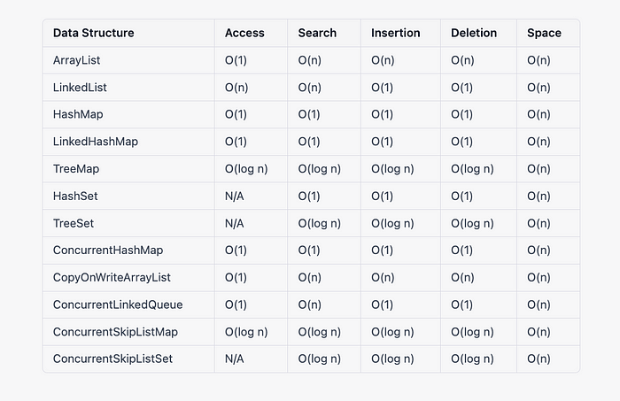

### 1. Collection

> 

### 2. Map

> 

### 3. Method

> 

### 4. Time complexity

1. **ArrayList** - **基于动态数组的列表**，支持快速随机访问，但插入/删除操作相对较慢（除非在末尾）。
2. **LinkedList** - **基于双向链表的列表**，支持高效插入/删除操作，但随机访问较慢。
3. **HashMap** - **基于哈希表的键值对映射**，提供 O(1) 的插入、删除和查找效率，但无序存储。
4. **TreeMap** - **基于红黑树的有序映射**，自动按键排序，提供 O(log n) 的插入、删除和查找操作。
5. **HashSet** - **基于 HashMap 实现的无序集合**，不允许重复元素，查找、插入和删除操作时间复杂度为 O(1)。
6. **TreeSet** - **基于 TreeMap 实现的有序集合**，不允许重复元素，查找、插入和删除操作时间复杂度为 O(log n)。
7. **PriorityQueue** - **基于二叉堆实现的优先队列**，默认最小堆（最小值优先出队），插入和删除的时间复杂度为 O(log n)。
8. **Queue (FIFO)** - **先进先出（FIFO）的队列**，通常基于 `LinkedList` 或 `ArrayDeque` 实现，提供 O(1) 的入队和出队操作。
9. **Deque (双端队列)** - **可在两端插入和删除的队列**，支持 `offerFirst()` 和 `offerLast()` 方法，插入删除操作为 O(1)。
10. **ConcurrentHashMap** - **支持并发操作的哈希表**，使用分段锁优化多线程读写操作，查找/插入/删除为 O(1)。
11. **CopyOnWriteArrayList** - **线程安全的 ArrayList**，修改时复制底层数组，读操作快但写操作较慢。
12. **ConcurrentLinkedQueue** - **无锁并发队列**，基于链表实现，适用于高并发环境，提供 O(1) 的插入和删除操作。

| **数据结构**         | **插入 (Insert)**                                  | **删除 (Delete)**                      | **查找 (Search)**           | **访问 (Access)**                      | **更新 (Update)**              |
| -------------------- | -------------------------------------------------- | -------------------------------------- | --------------------------- | -------------------------------------- | ------------------------------ |
| **ArrayList**        | `add(value) O(1)`                                  | `remove(index) O(n)`                   | `contains(value) O(n)`      | `get(index) O(1)`                      | `set(index, value) O(1)`       |
| **LinkedList**       | `add(value) O(1)`                                  | `remove(value) O(n)`                   | `contains(value) O(n)`      | `get(index) O(n)`                      | `set(index, value) O(n)`       |
| **HashMap**          | `put(key, value) O(1)`                             | `remove(key) O(1)`                     | `containsKey(key) O(1)`     | `get(key) O(1)`                        | `put(key, newValue) O(1)`      |
| **TreeMap**          | `put(key, value) O(log n)`                         | `remove(key) O(log n)`                 | `containsKey(key) O(log n)` | `get(key) O(log n)`                    | `put(key, newValue) O(log n)`  |
| **HashSet**          | `add(value) O(1)`                                  | `remove(value) O(1)`                   | `contains(value) O(1)`      | N/A                                    | N/A                            |
| **TreeSet**          | `add(value) O(log n)`                              | `remove(value) O(log n)`               | `contains(value) O(log n)`  | N/A                                    | N/A                            |
| **PriorityQueue**    | `offer(value) O(log n)`                            | `poll() O(log n)`                      | `contains(value) O(n)`      | `peek() O(1)`                          | `remove() + offer() O(log n)`  |
| **Queue (FIFO)**     | `offer(value) O(1)`                                | `poll() O(1)`                          | `contains(value) O(n)`      | `peek() O(1)`                          | `remove() + offer() O(1)`      |
| **Deque (双端队列)** | `offerFirst(value) O(1)` / `offerLast(value) O(1)` | `pollFirst() O(1)` / `pollLast() O(1)` | `contains(value) O(n)`      | `peekFirst() O(1)` / `peekLast() O(1)` | `remove() + offerFirst() O(1)` |

