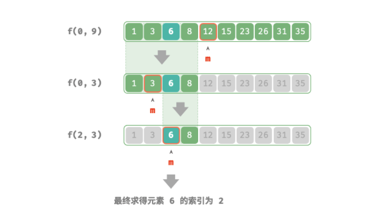
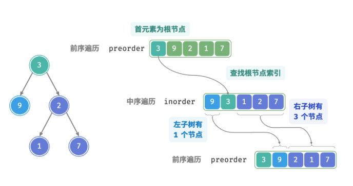

# 1. 算法思想

> - 分治是一种常见的算法设计策略，包括分（划分）和治（合并）两个阶段，通常基于递归实现。
> - 判断是否是分治算法问题的依据包括：问题能否分解、子问题是否独立、子问题能否合并。
> - 归并排序是分治策略的典型应用，其递归地将数组划分为等长的两个子数组，直到只剩一个元素时开始逐层合并，从而完成排序。
> - 引入分治策略往往可以提升算法效率。一方面，分治策略减少了操作数量；另一方面，分治后有利于系统的并行优化。
> - 分治既可以解决许多算法问题，也广泛应用于数据结构与算法设计中，处处可见其身影。
> - 相较于暴力搜索，自适应搜索效率更高。时间复杂度为 log(N) 的搜索算法通常是基于分治策略实现的。
> - 二分查找是分治策略的另一个典型应用，它不包含将子问题的解进行合并的步骤。我们可以通过递归分治实现二分查找。
> - 在构建二叉树的问题中，构建树（原问题）可以划分为构建左子树和右子树（子问题），这可以通过划分前序遍历和中序遍历的索引区间来实现。
> - 在汉诺塔问题中，一个规模为 的问题可以划分为两个规模为 的子问题和一个规模为 的子问题。按顺序解决这三个子问题后，原问题随之得到解决。

# 2 算法适用场景

> - 二分查询， 树的遍历
>
> - 一个问题是否适合使用分治解决，通常可以参考以下几个判断依据。
>
>   1. **问题可以分解**：原问题可以分解成规模更小、类似的子问题，以及能够以相同方式递归地进行划分。
>   2. **子问题是独立的**：子问题之间没有重叠，互不依赖，可以独立解决。
>   3. **子问题的解可以合并**：原问题的解通过合并子问题的解得来。
>
>   显然，归并排序满足以上三个判断依据。
>
>   1. **问题可以分解**：递归地将数组（原问题）划分为两个子数组（子问题）。
>   2. **子问题是独立的**：每个子数组都可以独立地进行排序（子问题可以独立进行求解）。
>   3. **子问题的解可以合并**：两个有序子数组（子问题的解）可以合并为一个有序数组（原问题的解）。

# 3. 算法模版

## 3.1 递归方式实现

> - **merge sort** 
>
>   > **分**：递归地将原数组（原问题）划分为两个子数组（子问题），直到子数组只剩一个元素（最小子问题）。
>   >
>   > **治**：从底至顶地将有序的子数组（子问题的解）进行合并，从而得到有序的原数组（原问题的解）。
>   >
>   > 
>   >
>   > ```java
>   > /* 合并左子数组和右子数组 */
>   > void merge(int[] nums, int left, int mid, int right) {
>   >     // 左子数组区间为 [left, mid], 右子数组区间为 [mid+1, right]
>   >     // 创建一个临时数组 tmp ，用于存放合并后的结果
>   >     int[] tmp = new int[right - left + 1];
>   >     // 初始化左子数组和右子数组的起始索引
>   >     int i = left, j = mid + 1, k = 0;
>   >     // 当左右子数组都还有元素时，进行比较并将较小的元素复制到临时数组中
>   >     while (i <= mid && j <= right) {
>   >         if (nums[i] <= nums[j])
>   >             tmp[k++] = nums[i++];
>   >         else
>   >             tmp[k++] = nums[j++];
>   >     }
>   >     // 将左子数组和右子数组的剩余元素复制到临时数组中
>   >     while (i <= mid) {
>   >         tmp[k++] = nums[i++];
>   >     }
>   >     while (j <= right) {
>   >         tmp[k++] = nums[j++];
>   >     }
>   >     // 将临时数组 tmp 中的元素复制回原数组 nums 的对应区间
>   >     for (k = 0; k < tmp.length; k++) {
>   >         nums[left + k] = tmp[k];
>   >     }
>   > }
>   > 
>   > /* 归并排序 */
>   > void mergeSort(int[] nums, int left, int right) {
>   >     // 终止条件
>   >     if (left >= right)
>   >         return; // 当子数组长度为 1 时终止递归
>   >     // 划分阶段
>   >     int mid = left + (right - left) / 2; // 计算中点
>   >     mergeSort(nums, left, mid); // 递归左子数组
>   >     mergeSort(nums, mid + 1, right); // 递归右子数组
>   >     // 合并阶段
>   >     merge(nums, left, mid, right);
>   > }
>   > ```
>
>
> - Binary search
>
>   > 
>   >
>   > ```java
>   > /* 二分查找：问题 f(i, j) */
>   > int dfs(int[] nums, int target, int i, int j) {
>   >     // 若区间为空，代表无目标元素，则返回 -1
>   >     if (i > j) {
>   >         return -1;
>   >     }
>   >     // 计算中点索引 m
>   >     int m = (i + j) / 2;
>   >     if (nums[m] < target) {
>   >         // 递归子问题 f(m+1, j)
>   >         return dfs(nums, target, m + 1, j);
>   >     } else if (nums[m] > target) {
>   >         // 递归子问题 f(i, m-1)
>   >         return dfs(nums, target, i, m - 1);
>   >     } else {
>   >         // 找到目标元素，返回其索引
>   >         return m;
>   >     }
>   > }
>   > 
>   > /* 二分查找 */
>   > int binarySearch(int[] nums, int target) {
>   >     int n = nums.length;
>   >     // 求解问题 f(0, n-1)
>   >     return dfs(nums, target, 0, n - 1);
>   > }
>   > ```
>
> - 构建二叉树问题
>
>   > 给定一棵二叉树的前序遍历 `preorder` 和中序遍历 `inorder` ，请从中构建二叉树，返回二叉树的根节点.
>   >
>   > 
>   >
>   > 原问题定义为从 `preorder` 和 `inorder` 构建二叉树，是一个典型的分治问题。
>   >
>   > - **问题可以分解**：从分治的角度切入，我们可以将原问题划分为两个子问题：构建左子树、构建右子树，加上一步操作：初始化根节点。而对于每棵子树（子问题），我们仍然可以复用以上划分方法，将其划分为更小的子树（子问题），直至达到最小子问题（空子树）时终止。
>   > - **子问题是独立的**：左子树和右子树是相互独立的，它们之间没有交集。在构建左子树时，我们只需关注中序遍历和前序遍历中与左子树对应的部分。右子树同理。
>   > - **子问题的解可以合并**：一旦得到了左子树和右子树（子问题的解），我们就可以将它们链接到根节点上，得到原问题的解。
>   >
>   > 
>   >
>   > 1. 前序遍历的首元素 3 是根节点的值。
>   > 2. 查找根节点 3 在 `inorder` 中的索引，利用该索引可将 `inorder` 划分为 `[ 9 | 3 ｜ 1 2 7 ]` 。
>   > 3. 根据 `inorder` 的划分结果，易得左子树和右子树的节点数量分别为 1 和 3 ，从而可将 `preorder`划分为 `[ 3 | 9 | 2 1 7 ]` 。
>   >
>   > ```java
>   > /* 构建二叉树：分治 */
>   > TreeNode dfs(int[] preorder, Map<Integer, Integer> inorderMap, int i, int l, int r) {
>   >     // 子树区间为空时终止
>   >     if (r - l < 0)
>   >         return null;
>   >     // 初始化根节点
>   >     TreeNode root = new TreeNode(preorder[i]);
>   >     // 查询 m ，从而划分左右子树
>   >     int m = inorderMap.get(preorder[i]);
>   >     // 子问题：构建左子树
>   >     root.left = dfs(preorder, inorderMap, i + 1, l, m - 1);
>   >     // 子问题：构建右子树
>   >     root.right = dfs(preorder, inorderMap, i + 1 + m - l, m + 1, r);
>   >     // 返回根节点
>   >     return root;
>   > }
>   > 
>   > /* 构建二叉树 */
>   > TreeNode buildTree(int[] preorder, int[] inorder) {
>   >     // 初始化哈希表，存储 inorder 元素到索引的映射
>   >     Map<Integer, Integer> inorderMap = new HashMap<>();
>   >     for (int i = 0; i < inorder.length; i++) {
>   >         inorderMap.put(inorder[i], i);
>   >     }
>   >     TreeNode root = dfs(preorder, inorderMap, 0, 0, inorder.length - 1);
>   >     return root;
>   > }
>   > ```
>


# 4. 算法复杂度

> - merge sort
>
>   > - 时间复杂度: O(NlogN)
>   > - 空间复杂度: O(N)
>
> - tree build
>
>   > - 时间复杂度: O(N)
>   > - 空间复杂度: O(N)

