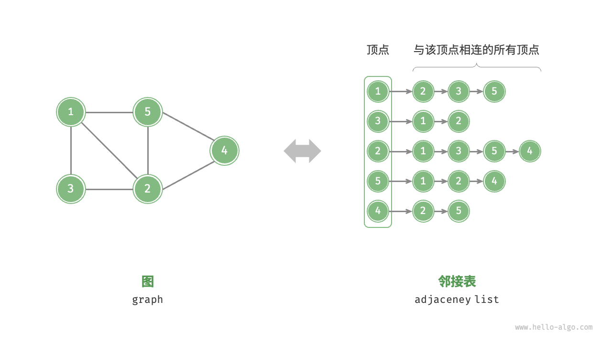

> - 图由顶点和边组成，可以表示为一组顶点和一组边构成的集合。
> - 相较于线性关系（链表）和分治关系（树），网络关系（图）具有更高的自由度，因而更为复杂。
> - 有向图的边具有方向性，连通图中的任意顶点均可达，有权图的每条边都包含权重变量。
> - 邻接矩阵利用矩阵来表示图，每一行（列）代表一个顶点，矩阵元素代表边，用 或 表示两个顶点之间有边或无边。邻接矩阵在增删查改操作上效率很高，但空间占用较多。
> - 邻接表使用多个链表来表示图，第 个链表对应顶点 ，其中存储了该顶点的所有邻接顶点。邻接表相对于邻接矩阵更加节省空间，但由于需要遍历链表来查找边，因此时间效率较低。
> - 当邻接表中的链表过长时，可以将其转换为红黑树或哈希表，从而提升查询效率。
> - 从算法思想的角度分析，邻接矩阵体现了“以空间换时间”，邻接表体现了“以时间换空间”。
> - 图可用于建模各类现实系统，如社交网络、地铁线路等。
> - 树是图的一种特例，树的遍历也是图的遍历的一种特例。
> - 图的广度优先遍历是一种由近及远、层层扩张的搜索方式，通常借助队列实现。
> - 图的深度优先遍历是一种优先走到底、无路可走时再回溯的搜索方式，常基于递归来实现。
>
> **Q**：路径的定义是顶点序列还是边序列？
>
> 维基百科上不同语言版本的定义不一致：英文版是“路径是一个边序列”，而中文版是“路径是一个顶点序列”。以下是英文版原文：In graph theory, a path in a graph is a finite or infinite sequence of edges which joins a sequence of vertices.
>
> 在本文中，路径被视为一个边序列，而不是一个顶点序列。这是因为两个顶点之间可能存在多条边连接，此时每条边都对应一条路径。
>
> **Q**：非连通图中是否会有无法遍历到的点？
>
> 在非连通图中，从某个顶点出发，至少有一个顶点无法到达。遍历非连通图需要设置多个起点，以遍历到图的所有连通分量。
>
> **Q**：在邻接表中，“与该顶点相连的所有顶点”的顶点顺序是否有要求？
>
> 可以是任意顺序。但在实际应用中，可能需要按照指定规则来排序，比如按照顶点添加的次序，或者按照顶点值大小的顺序等，这样有助于快速查找“带有某种极值”的顶点。

# 1. 图

图（graph）是一种非线性数据结构，由**顶点**（vertex）和**边**（edge）组成。我们可以将图 $G$ 抽象地表示为一组顶点 $V$ 和一组边 $E$ 的集合。以下示例展示了一个包含 5 个顶点和 7 条边的图。 

$$
\begin{aligned}
V & = \{ 1, 2, 3, 4, 5 \} \newline
E & = \{ (1,2), (1,3), (1,5), (2,3), (2,4), (2,5), (4,5) \} \newline
G & = \{ V, E \} \newline
\end{aligned}
$$

如果将顶点看作节点，将边看作连接各个节点的引用（指针），我们就可以将图看作一种从链表拓展而来的数据结构。如下图所示，**相较于线性关系（链表）和分治关系（树），网络关系（图）的自由度更高**，因而更为复杂。


## 1.1 图的常见类型与术语

根据边是否具有方向，可分为**无向图**（undirected graph）和**有向图**（directed graph），如下图所示。 

- 在无向图中，边表示两顶点之间的“双向”连接关系，例如微信或 QQ 中的“好友关系”。
- 在有向图中，边具有方向性，即 $A \rightarrow B$ 和 $A \leftarrow B$ 两个方向的边是相互独立的，例如微博或抖音上的“关注”与“被关注”关系。


根据所有顶点是否连通，可分为**连通图**（connected graph）和**非连通图**（disconnected graph），如下图所示。

- 对于连通图，从某个顶点出发，可以到达其余任意顶点。
- 对于非连通图，从某个顶点出发，至少有一个顶点无法到达。


我们还可以为边添加“权重”变量，从而得到如下图所示的**有权图**（weighted graph）。例如在《王者荣耀》等手游中，系统会根据共同游戏时间来计算玩家之间的“亲密度”，这种亲密度网络就可以用有权图来表示。


图数据结构包含以下常用术语。

- 邻接（adjacency）：当两顶点之间存在边相连时，称这两顶点“邻接”。在上图中，顶点 1 的邻接顶点为顶点 2、3、5。
- 路径（path）：从顶点 A 到顶点 B 经过的边构成的序列被称为从 A 到 B 的“路径”。在上图中，边序列 1-5-2-4 是顶点 1 到顶点 4 的一条路径。
- 度（degree）：一个顶点拥有的边数。对于有向图，入度（in-degree）表示有多少条边指向该顶点，出度（out-degree）表示有多少条边从该顶点指出。

## 1.2 图的表示

图的常用表示方式包括“邻接矩阵”和“邻接表”。以下使用无向图进行举例。

### 1.2.1 邻接矩阵

设图的顶点数量为 $n$ ，邻接矩阵（adjacency matrix）使用一个 $n \times n$ 大小的矩阵来表示图，每一行（列）代表一个顶点，矩阵元素代表边，用 $1$ 或 $0$ 表示两个顶点之间是否存在边。

如下图所示，设邻接矩阵为 $M$、顶点列表为 $V$ ，那么矩阵元素 $M[i, j] = 1$ 表示顶点 $V[i]$ 到顶点 $V[j]$ 之间存在边，反之 $M[i, j] = 0$ 表示两顶点之间无边。


邻接矩阵具有以下特性。

- 顶点不能与自身相连，因此邻接矩阵主对角线元素没有意义。
- 对于无向图，两个方向的边等价，此时邻接矩阵关于主对角线对称。
- 将邻接矩阵的元素从 $1$ 和 $0$ 替换为权重，则可表示有权图。

使用邻接矩阵表示图时，我们可以直接访问矩阵元素以获取边，因此增删查改操作的效率很高，时间复杂度均为 $O(1)$ 。然而，矩阵的空间复杂度为 $O(n^2)$ ，内存占用较多。

### 1.2.2 邻接表

邻接表（adjacency list）使用 $n$ 个链表来表示图，链表节点表示顶点。第 $i$ 个链表对应顶点 $i$ ，其中存储了该顶点的所有邻接顶点（与该顶点相连的顶点）。下图展示了一个使用邻接表存储的图的示例。



邻接表仅存储实际存在的边，而边的总数通常远小于 $n^2$ ，因此它更加节省空间。然而，在邻接表中需要通过遍历链表来查找边，因此其时间效率不如邻接矩阵。

观察上图，**邻接表结构与哈希表中的“链式地址”非常相似，因此我们也可以采用类似的方法来优化效率**。比如当链表较长时，可以将链表转化为 AVL 树或红黑树，从而将时间效率从 $O(n)$ 优化至 $O(\log n)$ ；还可以把链表转换为哈希表，从而将时间复杂度降至 $O(1)$ 。

## 1.3 图的常见应用

如下表所示，许多现实系统可以用图来建模，相应的问题也可以约化为图计算问题。

<p align="center"> 表 <id> &nbsp; 现实生活中常见的图 </p>

|          | 顶点 | 边                   | 图计算问题   |
| -------- | ---- | -------------------- | ------------ |
| 社交网络 | 用户 | 好友关系             | 潜在好友推荐 |
| 地铁线路 | 站点 | 站点间的连通性       | 最短路线推荐 |
| 太阳系   | 星体 | 星体间的万有引力作用 | 行星轨道计算 |


# 2. 图的基础操作

图的基础操作可分为对“边”的操作和对“顶点”的操作。在“邻接矩阵”和“邻接表”两种表示方法下，实现方式有所不同。

## 2.1 基于邻接矩阵的实现

给定一个顶点数量为 $n$ 的无向图，则各种操作的实现方式如下图所示。

- **添加或删除边**：直接在邻接矩阵中修改指定的边即可，使用 $O(1)$ 时间。而由于是无向图，因此需要同时更新两个方向的边。
- **添加顶点**：在邻接矩阵的尾部添加一行一列，并全部填 $0$ 即可，使用 $O(n)$ 时间。
- **删除顶点**：在邻接矩阵中删除一行一列。当删除首行首列时达到最差情况，需要将 $(n-1)^2$ 个元素“向左上移动”，从而使用 $O(n^2)$ 时间。
- **初始化**：传入 $n$ 个顶点，初始化长度为 $n$ 的顶点列表 `vertices` ，使用 $O(n)$ 时间；初始化 $n \times n$ 大小的邻接矩阵 `adjMat` ，使用 $O(n^2)$ 时间。
      


以下是基于邻接矩阵表示图的实现代码：

```java
package interview.company.bloomberg;

import java.util.ArrayList;
import java.util.List;

public class GraphAdjMat {
    List<Integer> points; // 顶点列表，元素代表“顶点值”，索引代表“顶点索引”
    List<List<Integer>> adjMat; // 邻接矩阵，行列索引对应“顶点索引”

    /* 构造方法 */
    public GraphAdjMat(int[] points, int[][] edges) {
        this.points = new ArrayList<>();
        this.adjMat = new ArrayList<>();
        // 添加顶点
        for (int val : points) {
            addPoint(val);
        }
        // 添加边
        // 请注意，edges 元素代表顶点索引，即对应 points 元素索引
        for (int[] e : edges) {
            addEdge(e[0], e[1]);
        }
    }

    /* 获取顶点数量 */
    public int size() {
        return points.size();
    }

    /* 添加顶点 */
    public void addPoint(int val) {
        int n = size();
        // 向顶点列表中添加新顶点的值
        points.add(val);
        // 在邻接矩阵中添加一行
        List<Integer> newRow = new ArrayList<>(n);
        for (int j = 0; j < n; j++) {
            newRow.add(0);
        }
        adjMat.add(newRow);
        // 在邻接矩阵中添加一列
        for (List<Integer> row : adjMat) {
            row.add(0);
        }
    }

    /* 删除顶点 */
    public void removePoint(int index) {
        if (index >= size())
            throw new IndexOutOfBoundsException();
        // 在顶点列表中移除索引 index 的顶点
        points.remove(index);
        // 在邻接矩阵中删除索引 index 的行
        adjMat.remove(index);
        // 在邻接矩阵中删除索引 index 的列
        for (List<Integer> row : adjMat) {
            row.remove(index);
        }
    }

    /* 添加边 */
    // 参数 i, j 对应 points 元素索引
    public void addEdge(int i, int j) {
        // 索引越界与相等处理
        if (i < 0 || j < 0 || i >= size() || j >= size() || i == j)
            throw new IndexOutOfBoundsException();
        // 在无向图中，邻接矩阵关于主对角线对称，即满足 (i, j) == (j, i)
        adjMat.get(i).set(j, 1);
        adjMat.get(j).set(i, 1);
    }

    /* 删除边 */
    // 参数 i, j 对应 points 元素索引
    public void removeEdge(int i, int j) {
        // 索引越界与相等处理
        if (i < 0 || j < 0 || i >= size() || j >= size() || i == j)
            throw new IndexOutOfBoundsException();
        adjMat.get(i).set(j, 0);
        adjMat.get(j).set(i, 0);
    }

    /* 打印邻接矩阵 */
    public void print() {
        System.out.print("顶点列表 = ");
        System.out.println(points);
        System.out.println("邻接矩阵 =");
        this.print2DArrayMatrixFormat(adjMat);
    }

    public void print2DArrayMatrixFormat(List<List<Integer>> array) {
        for (List<Integer> row : array) {
            for (int col : row) {
                System.out.print(col + "\t"); // 使用制表符对齐
            }
            System.out.println(); // 换行
        }
    }

    public static void main(String[] args) {
        int[] points = {1, 3, 2, 5, 4};
        int[][] ini = {{0, 1}, {0, 3}, {1, 2}, {2, 3}, {2, 4}, {3, 4}};
        template.GraphAdjMat graph = new template.GraphAdjMat(points, ini);
        graph.print();

    }
}

```

## 2.2 基于邻接表的实现

设无向图的顶点总数为 $n$、边总数为 $m$ ，则可根据下图所示的方法实现各种操作。

- **添加边**：在顶点对应链表的末尾添加边即可，使用 $O(1)$ 时间。因为是无向图，所以需要同时添加两个方向的边。
- **删除边**：在顶点对应链表中查找并删除指定边，使用 $O(m)$ 时间。在无向图中，需要同时删除两个方向的边。
- **添加顶点**：在邻接表中添加一个链表，并将新增顶点作为链表头节点，使用 $O(1)$ 时间。
- **删除顶点**：需遍历整个邻接表，删除包含指定顶点的所有边，使用 $O(n + m)$ 时间。
- **初始化**：在邻接表中创建 $n$ 个顶点和 $2m$ 条边，使用 $O(n + m)$ 时间。
      


以下是邻接表的代码实现。对比上图，实际代码有以下不同。

- 为了方便添加与删除顶点，以及简化代码，我们使用列表（动态数组）来代替链表。
- 使用哈希表来存储邻接表，`key` 为顶点实例，`value` 为该顶点的邻接顶点列表（链表）。

另外，我们在邻接表中使用 `Vertex` 类来表示顶点，这样做的原因是：如果与邻接矩阵一样，用列表索引来区分不同顶点，那么假设要删除索引为 $i$ 的顶点，则需遍历整个邻接表，将所有大于 $i$ 的索引全部减 $1$ ，效率很低。而如果每个顶点都是唯一的 `Vertex` 实例，删除某一顶点之后就无须改动其他顶点了。

```java
package interview.company.bloomberg;

import java.util.ArrayList;
import java.util.HashMap;
import java.util.List;
import java.util.Map;

/* 基于邻接表实现的无向图类 */
public class GraphAdjList {
    // 邻接表，key：顶点，value：该顶点的所有邻接顶点
    Map<Integer, List<Integer>> adjList;

    /* 构造方法 */
    public GraphAdjList(Integer[][] edges) {
        this.adjList = new HashMap<>();
        // 添加所有顶点和边
        for (Integer[] edge : edges) {
            addPoint(edge[0]);
            addPoint(edge[1]);
            addEdge(edge[0], edge[1]);
        }
    }

    /* 获取顶点数量 */
    public int size() {
        return adjList.size();
    }

    /* 添加边 */
    public void addEdge(Integer point1, Integer point2) {
        if (!adjList.containsKey(point1) || !adjList.containsKey(point2) || point1 == point2)
            throw new IllegalArgumentException();
        // 添加边 point1 - point2
        adjList.get(point1).add(point2);
        adjList.get(point2).add(point1);
    }

    /* 删除边 */
    public void removeEdge(Integer point1, Integer point2) {
        if (!adjList.containsKey(point1) || !adjList.containsKey(point2) || point1 == point2)
            throw new IllegalArgumentException();
        // 删除边 point1 - point2
        adjList.get(point1).remove(point2);
        adjList.get(point2).remove(point1);
    }

    /* 添加顶点 */
    public void addPoint(Integer point) {
        if (adjList.containsKey(point))
            return;
        // 在邻接表中添加一个新链表
        adjList.put(point, new ArrayList<>());
    }

    /* 删除顶点 */
    public void removePoint(Integer point) {
        if (!adjList.containsKey(point))
            throw new IllegalArgumentException();
        // 在邻接表中删除顶点 point 对应的链表
        adjList.remove(point);
        // 遍历其他顶点的链表，删除所有包含 point 的边
        for (List<Integer> list : adjList.values()) {
            list.remove(point);
        }
    }

    /* 打印邻接表 */
    public void print() {
        System.out.println("邻接表 =");
        for (Map.Entry<Integer, List<Integer>> pair : adjList.entrySet()) {
            List<Integer> tmp = new ArrayList<>();
            for (Integer vertex : pair.getValue())
                tmp.add(vertex);
            System.out.println(pair.getKey() + ": " + tmp + ",");
        }
    }

    public static void main(String... args) {
        Integer[][] ini = {{1, 5}, {1, 3}, {3, 2}, {2, 5}, {5, 4}, {2, 4}};
        template.GraphAdjList graph = new template.GraphAdjList(ini);
        graph.print();
        /**
         邻接表 =
         1: [5, 3],
         2: [3, 5, 4],
         3: [1, 2],
         4: [5, 2],
         5: [1, 2, 4],
         }
         **/
    }


```

## 2.3 效率对比

设图中共有 $n$ 个顶点和 $m$ 条边，下表对比了邻接矩阵和邻接表的时间效率和空间效率。

<p align="center"> 表 <id> &nbsp; 邻接矩阵与邻接表对比 </p>

|              | 邻接矩阵 | 邻接表（链表） | 邻接表（哈希表） |
| ------------ | -------- | -------------- | ---------------- |
| 判断是否邻接 | $O(1)$   | $O(m)$         | $O(1)$           |
| 添加边       | $O(1)$   | $O(1)$         | $O(1)$           |
| 删除边       | $O(1)$   | $O(m)$         | $O(1)$           |
| 添加顶点     | $O(n)$   | $O(1)$         | $O(1)$           |
| 删除顶点     | $O(n^2)$ | $O(n + m)$     | $O(n)$           |
| 内存空间占用 | $O(n^2)$ | $O(n + m)$     | $O(n + m)$       |

观察上表，似乎邻接表（哈希表）的时间效率与空间效率最优。但实际上，在邻接矩阵中操作边的效率更高，只需一次数组访问或赋值操作即可。综合来看，邻接矩阵体现了“以空间换时间”的原则，而邻接表体现了“以时间换空间”的原则。


# 3. 图的遍历

树代表的是“一对多”的关系，而图则具有更高的自由度，可以表示任意的“多对多”关系。因此，我们可以把树看作图的一种特例。显然，**树的遍历操作也是图的遍历操作的一种特例**。

图和树都需要应用搜索算法来实现遍历操作。图的遍历方式也可分为两种：广度优先遍历和深度优先遍历。

## 3.1 广度优先遍历

**广度优先遍历是一种由近及远的遍历方式，从某个节点出发，始终优先访问距离最近的顶点，并一层层向外扩张**。如下图所示，从左上角顶点出发，首先遍历该顶点的所有邻接顶点，然后遍历下一个顶点的所有邻接顶点，以此类推，直至所有顶点访问完毕。

有两种广度优先遍历方式：

1. 不带层级的遍历

   > 
   >
   > 

2. 带层级的遍历

   > 
   >
   > 

### 3.1.1 算法实现

BFS 通常借助队列来实现，代码如下所示。队列具有“先入先出”的性质，这与 BFS 的“由近及远”的思想异曲同工。

1. 将遍历起始顶点 `startVet` 加入队列，并开启循环。
2. 在循环的每轮迭代中，弹出队首顶点并记录访问，然后将该顶点的所有邻接顶点加入到队列尾部。
3. 循环步骤 `2.` ，直到所有顶点被访问完毕后结束。

为了防止重复遍历顶点，我们需要借助一个哈希集合 `visited` 来记录哪些节点已被访问。

!!! tip

    哈希集合可以看作一个只存储 `key` 而不存储 `value` 的哈希表，它可以在 $O(1)$ 时间复杂度下进行 `key` 的增删查改操作。根据 `key` 的唯一性，哈希集合通常用于数据去重等场景。

```java
/* 广度优先遍历 */
    List<Integer> graphBFS(GraphAdjList graph, Integer startVet) {
        // 顶点遍历序列
        List<Integer> res = new ArrayList<>();
        // 哈希集合，用于记录已被访问过的顶点
        Set<Integer> visited = new HashSet<>();
        visited.add(startVet);
        // 队列用于实现 BFS
        Queue<Integer> que = new LinkedList<>();
        que.offer(startVet);
        // 以顶点 vet 为起点，循环直至访问完所有顶点
        while (!que.isEmpty()) {
            Integer vet = que.poll(); // 队首顶点出队
            res.add(vet);            // 记录访问顶点
            // 遍历该顶点的所有邻接顶点
            for (Integer adjVet : graph.adjList.get(vet)) {
                if (visited.contains(adjVet))
                    continue;        // 跳过已被访问的顶点
                que.offer(adjVet);   // 只入队未访问的顶点
                visited.add(adjVet); // 标记该顶点已被访问
            }
        }
        // 返回顶点遍历序列
        return res; //[0, 1, 3, 2, 4, 6, 5, 7, 8]
    }

    /* 广度优先遍历 */
    List<List<Integer>> graphBFSByLevel(GraphAdjList graph, Integer startVet) {
        // 顶点遍历序列
        List<List<Integer>> res = new ArrayList<>();
        // 哈希集合，用于记录已被访问过的顶点
        Set<Integer> visited = new HashSet<>();
        visited.add(startVet);
        // 队列用于实现 BFS
        Queue<Integer> que = new LinkedList<>();
        que.offer(startVet);
        // 以顶点 vet 为起点，循环直至访问完所有顶点
        while (!que.isEmpty()) {
            int currentSize = que.size();
            List<Integer> currentLevel = new ArrayList<>();
            // 遍历该顶点的所有邻接顶点
            for(int i = 0; i < currentSize; i++){
                int point = que.poll();
                currentLevel.add(point);
                for(Integer adjVet : graph.adjList.get(point)){
                    if(visited.contains(adjVet)) continue;
                    que.offer(adjVet);
                    visited.add(adjVet);
                }

            }
            res.add(currentLevel);
        }
        // 返回顶点遍历序列
        return res;//[[0], [1, 3], [2, 4, 6], [5, 7], [8]]
    }
```

代码相对抽象，建议对照下图来加深理解。
    

!!! question "广度优先遍历的序列是否唯一？"

    不唯一。广度优先遍历只要求按“由近及远”的顺序遍历，**而多个相同距离的顶点的遍历顺序允许被任意打乱**。以上图为例，顶点 $1$、$3$ 的访问顺序可以交换，顶点 $2$、$4$、$6$ 的访问顺序也可以任意交换。

### 3.1.2 复杂度分析

**时间复杂度**：所有顶点都会入队并出队一次，使用 $O(|V|)$ 时间；在遍历邻接顶点的过程中，由于是无向图，因此所有边都会被访问 $2$ 次，使用 $O(2|E|)$ 时间；总体使用 $O(|V| + |E|)$ 时间。

**空间复杂度**：列表 `res` ，哈希集合 `visited` ，队列 `que` 中的顶点数量最多为 $|V|$ ，使用 $O(|V|)$ 空间。

## 3.2 深度优先遍历

**深度优先遍历是一种优先走到底、无路可走再回头的遍历方式**。如下图所示，从左上角顶点出发，访问当前顶点的某个邻接顶点，直到走到尽头时返回，再继续走到尽头并返回，以此类推，直至所有顶点遍历完成。


### 3.2.1 算法实现

这种“走到尽头再返回”的算法范式通常基于递归来实现。与广度优先遍历类似，在深度优先遍历中，我们也需要借助一个哈希集合 `visited` 来记录已被访问的顶点，以避免重复访问顶点。

```java
/* 深度优先遍历辅助函数 */
void dfs(GraphAdjList graph, Set<Vertex> visited, List<Vertex> res, Vertex vet) {
    res.add(vet);     // 记录访问顶点
    visited.add(vet); // 标记该顶点已被访问
    // 遍历该顶点的所有邻接顶点
    for (Vertex adjVet : graph.adjList.get(vet)) {
        if (visited.contains(adjVet))
            continue; // 跳过已被访问的顶点
        // 递归访问邻接顶点
        dfs(graph, visited, res, adjVet);
    }
}

/* 深度优先遍历 */
// 使用邻接表来表示图，以便获取指定顶点的所有邻接顶点
List<Vertex> graphDFS(GraphAdjList graph, Vertex startVet) {
    // 顶点遍历序列
    List<Vertex> res = new ArrayList<>();
    // 哈希集合，用于记录已被访问过的顶点
    Set<Vertex> visited = new HashSet<>();
    dfs(graph, visited, res, startVet);
    return res;
}
```

深度优先遍历的算法流程如下图所示。

- **直虚线代表向下递推**，表示开启了一个新的递归方法来访问新顶点。
- **曲虚线代表向上回溯**，表示此递归方法已经返回，回溯到了开启此方法的位置。

为了加深理解，建议将下图与代码结合起来，在脑中模拟（或者用笔画下来）整个 DFS 过程，包括每个递归方法何时开启、何时返回。
    

!!! question "深度优先遍历的序列是否唯一？"

    与广度优先遍历类似，深度优先遍历序列的顺序也不是唯一的。给定某顶点，先往哪个方向探索都可以，即邻接顶点的顺序可以任意打乱，都是深度优先遍历。
    
    以树的遍历为例，“根 $\rightarrow$ 左 $\rightarrow$ 右”“左 $\rightarrow$ 根 $\rightarrow$ 右”“左 $\rightarrow$ 右 $\rightarrow$ 根”分别对应前序、中序、后序遍历，它们展示了三种遍历优先级，然而这三者都属于深度优先遍历。

### 3.2.2 复杂度分析

**时间复杂度**：所有顶点都会被访问 $1$ 次，使用 $O(|V|)$ 时间；所有边都会被访问 $2$ 次，使用 $O(2|E|)$ 时间；总体使用 $O(|V| + |E|)$ 时间。

**空间复杂度**：列表 `res` ，哈希集合 `visited` 顶点数量最多为 $|V|$ ，递归深度最大为 $|V|$ ，因此使用 $O(|V|)$ 空间。

# 4. 图的最短路径

## 4.1 无权重图(unweighted graph)

在一棵树中，一个结点到另一个结点的路径是唯一的，但在图中，结点之间可能有多条路径，其中哪条路最近呢？这一类问题称为**最短路径问题**。最短路径问题也是 BFS 的典型应用，而且其方法与层序遍历关系密切。

在二叉树中，BFS 可以实现一层一层的遍历。在图中同样如此。从源点出发，BFS 首先遍历到第一层结点，到源点的距离为 1，然后遍历到第二层结点，到源点的距离为 2…… 可以看到，用 BFS 的话，距离源点更近的点会先被遍历到，这样就能找到到某个点的最短路径了。

**小贴士：**
很多同学一看到「最短路径」，就条件反射地想到「[Dijkstra 算法](https://zhida.zhihu.com/search?content_id=118394171&content_type=Article&match_order=1&q=Dijkstra+算法&zhida_source=entity)」。为什么 BFS 遍历也能找到最短路径呢？
这是因为，Dijkstra 算法解决的是**带权最短路径问题**，而我们这里关注的是**无权最短路径问题**。也可以看成每条边的权重都是 1。这样的最短路径问题，用 BFS 求解就行了。
在面试中，你可能更希望写 BFS 而不是 Dijkstra。毕竟，敢保证自己能写对 Dijkstra 算法的人不多。


### 4.1.1 算法实现

**LeetCode 1162. As Far from Land as Possible** 离开陆地的最远距离（Medium）

> 你现在手里有一份大小  为的地图网格`grid`，上面的每个单元格都标记为 0 或者 1，其中 0 代表海洋，1 代表陆地，请你找出一个海洋区域，这个海洋区域到离它最近的陆地区域的距离是最大的。
> 我们这里说的距离是「[曼哈顿距离](https://zhida.zhihu.com/search?content_id=118394171&content_type=Article&match_order=1&q=曼哈顿距离&zhida_source=entity)」。 和 这两个区域之间的距离是 。
> 如果我们的地图上只有陆地或者海洋，请返回 -1。

这道题就是一个在网格结构中求最短路径的问题。同时，它也是一个「岛屿问题」，即用网格中的 1 和 0 表示陆地和海洋，模拟出若干个岛屿。这道题要找的是距离陆地最远的海洋格子。假设网格中只有一个陆地格子，我们可以从这个陆地格子出发做层序遍历，直到所有格子都遍历完。最终遍历了几层，[海洋格子](https://zhida.zhihu.com/search?content_id=118394171&content_type=Article&match_order=2&q=海洋格子&zhida_source=entity)的最远距离就是几


那么有多个陆地格子的时候怎么办呢？一种方法是将每个陆地格子都作为起点做一次层序遍历，但是这样的时间开销太大。

**BFS 完全可以以多个格子同时作为起点**。我们可以把所有的陆地格子同时放入初始队列，然后开始层序遍历.这种遍历方法实际上叫做「**多源 BFS**」。


```java
public int maxDistance(int[][] grid) {
    int N = grid.length;

    Queue<int[]> queue = new ArrayDeque<>();
    // 将所有的陆地格子加入队列
    for (int i = 0; i < N; i++) {
        for (int j = 0; j < N; j++) {
            if (grid[i][j] == 1) {
                queue.add(new int[]{i, j});
            }
        }
    }

    // 如果地图上只有陆地或者海洋，返回 -1
    if (queue.isEmpty() || queue.size() == N * N) {
        return -1;
    }

    int[][] moves = {
        {-1, 0}, {1, 0}, {0, -1}, {0, 1},
    };

    int distance = -1; // 记录当前遍历的层数（距离）
    while (!queue.isEmpty()) {
        distance++;
        int n = queue.size();
        for (int i = 0; i < n; i++) { 
            int[] node = queue.poll();
            int r = node[0];
            int c = node[1];
            for (int[] move : moves) {
                int r2 = r + move[0];
                int c2 = c + move[1];
                if (inArea(grid, r2, c2) && grid[r2][c2] == 0) {
                    grid[r2][c2] = 2;
                    queue.add(new int[]{r2, c2});
                }
            }
        }
    }

    return distance;
}

// 判断坐标 (r, c) 是否在网格中
boolean inArea(int[][] grid, int r, int c) {
    return 0 <= r && r < grid.length 
        && 0 <= c && c < grid[0].length;
}
```

## 4.2权重图(weighted graph)

Dijkstra（迪杰斯特拉）算法解决的问题是：

> 在一个有向图中，求图中一个节点到其他所有节点的最短距离

### 4.2.1 算法实现

通过Dijkstra计算图G中的最短路径时，需要指定起点s(即从顶点s开始计算)。 

此外，引进两个集合S和U。S的作用是记录已求出最短路径的顶点(以及相应的最短路径长度)，而U则是记录还未求出最短路径的顶点(以及该顶点到起点s的距离)。 

初始时，S中只有起点s；U中是除s之外的顶点，并且U中顶点的路径是"起点s到该顶点的路径"。然后，从U中找出路径最短的顶点，并将其加入到S中；接着，更新U中的顶点和顶点对应的路径。 然后，再从U中找出路径最短的顶点，并将其加入到S中；接着，更新U中的顶点和顶点对应的路径。 ... 重复该操作，直到遍历完所有顶点。

图中b标注应该是b(13)


```java
package template;

import javafx.util.Pair;

import java.util.Arrays;
import java.util.PriorityQueue;
/*
 * 题目描述：
 * Dijkstra 算法用于计算 **单源最短路径**，即从 **起点（source）** 到 **图中所有其他顶点的最短路径**。
 * 该算法适用于 **无负权边** 的图，并可使用 **邻接矩阵** 或 **邻接表 + 优先队列（最小堆）** 实现。
 *
 * 输入：
 * - `graph`：邻接矩阵或邻接表，表示图的所有边及其权重。
 * - `source`：起始顶点索引，从该顶点出发计算最短路径。
 *
 * 输出：
 * - `dist[]`：一个数组，其中 `dist[i]` 表示从 `source` 到 `i` 的最短路径长度。
 * - 过程日志：每一步的路径更新情况。
 *
 * 示例：
 * 输入：
 *   graph = graph = {
                {0, 12, 0, 0, 0, 16, 14},//a
                {12, 0, 10, 0, 0, 7, 0},//b
                {0, 10, 0, 3, 5, 6, 0},//c
                {0, 0, 3, 0, 4, 0, 0},//d
                {0, 0, 5, 4, 0, 2, 8},//e
                {16, 7, 6, 0, 2, 0, 9},//f
                {14, 0, 0, 0, 8, 9, 0}//g
        };
 *   source = 3
 * 输出：
 *   dist = [22, 13, 3, 0, 4, 6, 12]
 *   并打印路径更新日志：
 *   current step 0: a: INF ,b: INF ,c: 3 ,d: 0 ,e: 4 ,f: INF ,g: INF ,
 *   current step 1: a: INF ,b: 13 ,c: 3 ,d: 0 ,e: 4 ,f: INF ,g: INF ,
 *   ...
 */

/*
 * 解题思路：
 * Dijkstra 算法是一种 **贪心算法**，用于计算 **单源最短路径**。
 *
 * **方法 1：使用邻接矩阵（O(V²)）**
 * 1️⃣ **初始化**
 * - 创建 `dist[]` 数组，初始值为 `Integer.MAX_VALUE`，表示所有顶点与 `source` 不可达。
 * - `dist[source] = 0`，起点到自身的距离为 `0`。
 * - `visited[]` 数组，记录哪些顶点已经计算了最短路径，初始值均为 `false`。
 *
 * 2️⃣ **迭代 V-1 次，每次选择当前最短的未访问顶点**
 * - 通过 `minDistance()` 找到 `dist[]` 中 **未访问** 且 **最短路径最小** 的顶点 `u`。
 * - 标记 `u` 为已访问。
 * - 遍历 `u` 的所有邻接顶点 `v`：
 *   - 如果 `v` **未访问** 且 `u -> v` 存在边：
 *   - 计算 `source -> v` 的新路径 `dist[v] = min(dist[v], dist[u] + graph[u][v])`。
 *
 * 3️⃣ **终止**
 * - 经过 `V-1` 次迭代后，所有顶点的最短路径已确定，`dist[]` 结果即为最终解。
 * - 输出 `dist[]` 以及每一步的 `current step` 状态。
 *
 * 示例计算：
 * 以 `source = 3 (d)` 作为起点，初始 `dist[]`：
 * ```
 *  d: 0, a: INF, b: INF, c: 3, e: 4, f: INF, g: INF
 * ```
 * 第一步：
 * - 选择 `c (3)`，更新 `c` 的邻居：
 * ```
 *  d: 0, a: INF, b: 13, c: 3, e: 4, f: 9, g: INF
 * ```
 * 第二步：
 * - 选择 `e (4)`，更新 `e` 的邻居：
 * ```
 *  d: 0, a: INF, b: 13, c: 3, e: 4, f: 6, g: 12
 * ```
 * ...
 * 直到所有顶点的最短路径更新完毕，最终 `dist[]`：
 * ```
 *  d: 0, a: 22, b: 13, c: 3, e: 4, f: 6, g: 12
 * ```
 *
 * **方法 2：使用优先队列优化（O((V+E) log V)）**
 * 1️⃣ **初始化**
 * - 使用 `PriorityQueue`（最小堆）维护未访问顶点的最短路径。
 * - `dist[]` 记录 `source` 到各顶点的最短距离，初始值为 `Integer.MAX_VALUE`。
 * - `minHeap` 存储 `{顶点, 最短路径}`，初始时 `{source, 0}` 入队。
 *
 * 2️⃣ **主循环**
 * - 每次取出 `minHeap` 中 `dist` 最小的顶点 `u`，然后更新 `u` 的所有邻接顶点 `v`：
 *   - 计算 `newDist = dist[u] + weight[u][v]`
 *   - 若 `newDist < dist[v]`，则更新 `dist[v]` 并将 `{v, newDist}` 放入 `minHeap`。
 *
 * 3️⃣ **终止**
 * - 直到 `minHeap` 为空时，所有最短路径已确定。
 * - `dist[]` 记录最终结果。
 *
 * 示例：
 * - `minHeap` 维护 `{3, 0} -> {c, 3} -> {e, 4} -> {g, 6} -> {b, 13} -> {f, 12} -> {a, 22}`
 *
 */

/*
 * 时间和空间复杂度分析：
 *
 * **方法 1（邻接矩阵 + 线性查找 `minDistance()`）**
 * - **时间复杂度：** `O(V^2)`
 *   - 查找 `minDistance()` 需要 `O(V)` 遍历 `dist[]`，共执行 `V` 次。
 *   - 更新所有邻接顶点 `O(V)`，总共 `V` 次。
 *   - **总复杂度：O(V^2)**
 * - **空间复杂度：** `O(V^2)`（邻接矩阵存储所有边）。
 *
 * **方法 2（邻接表 + 优先队列 `PriorityQueue`）**
 * - **时间复杂度：** `O((V+E) log V)`
 *   - `PriorityQueue` 插入和删除操作 `O(log V)`。
 *   - `V` 个顶点被 `log V` 访问，每个 `E` 条边更新 `log V` 次。
 *   - **总复杂度：O((V+E) log V)**，适用于 **稀疏图**。
 * - **空间复杂度：** `O(V + E)`
 *   - 需要存储 `V` 个顶点的 `dist[]`，以及 `E` 条边的邻接表。
 *
 * **不同实现方式的时间复杂度对比**
 * |  实现方式   | 时间复杂度 | 适用场景 |
 * |------------|------------|----------|
 * | **邻接矩阵 + 线性查找 `minDistance()`** | `O(V^2)` | 适用于小规模图 |
 * | **邻接表 + 优先队列 `PriorityQueue`** | `O((V+E) log V)` | 适用于大规模稀疏图 |
 *
 * **算法适用场景**
 * - **适用于** 稠密图（`E ≈ V^2`）时 `O(V^2)` 的实现较快，适用于较小的 `V`。
 * - **适用于** 稀疏图（`E ≪ V^2`）时，建议使用 **优先队列优化** 以提升性能。
 */


public class Dijkstra {
    /**
     * 选择当前未访问的顶点中，最短路径值最小的顶点
     * @param dist 存储从源点到各顶点的最短路径长度
     * @param visited 记录哪些顶点已经被访问
     * @return 具有最小距离的未访问顶点索引
     */
    private static int minDistance(int[] dist, boolean[] visited) {
        int min = Integer.MAX_VALUE; // 记录当前最短距离，初始为无穷大
        int minIndex = -1; // 记录最短路径的顶点索引

        // 遍历所有顶点，找到未访问且距离最小的顶点
        for (int i = 0; i < dist.length; i++) {
            if (!visited[i] && dist[i] <= min) {
                min = dist[i]; // 更新最小距离
                minIndex = i; // 记录该顶点索引
            }
        }
        return minIndex;
    }

    /**
     * Solution1: 使用邻接矩阵实现 Dijkstra 算法
     * 计算从源点到所有顶点的最短路径
     * @param graph 邻接矩阵表示的图，graph[i][j] 表示 i 到 j 的边权重
     * @param source 源点索引
     */
    private static void dijkstra(int[][] graph, int source) {
        int numVertices = graph.length; // 顶点个数
        int[] dist = new int[numVertices]; // 存储从源点到各顶点的最短路径值
        boolean[] visited = new boolean[numVertices]; // 记录哪些顶点已经被访问

        Arrays.fill(dist, Integer.MAX_VALUE); // 初始化所有顶点的最短路径为无穷大
        dist[source] = 0; // 源点到自身的距离为 0

        // 计算所有顶点的最短路径
        for (int count = 0; count < numVertices - 1; count++) {
            int u = minDistance(dist, visited); // 选择当前未访问顶点中最短路径值最小的顶点
            visited[u] = true; // 标记该顶点已访问

            // 更新所有邻接顶点的最短路径
            for (int v = 0; v < numVertices; v++) {
                // 只有满足以下条件才进行更新：
                // 1. 该顶点未访问
                // 2. u 到 v 之间存在边（即 graph[u][v] != 0）
                // 3. u 到源点的路径值不是无穷大
                // 4. 通过 u 到达 v 使路径变短
                if (!visited[v] && graph[u][v] != 0 && dist[u] != Integer.MAX_VALUE
                        && dist[u] + graph[u][v] < dist[v]) {
                    dist[v] = dist[u] + graph[u][v]; // 更新最短路径
                }
            }

            // 输出当前步骤的最短路径信息
            System.out.print("current step " + count + ": ");
            for (int i = 0; i < numVertices; i++) {
                System.out.print((char) (i + 'a') + ": " + dist[i] + " ,");
            }
            System.out.println();
        }
    }

    /**
     * Solution2: 使用最小堆（优先队列）优化 Dijkstra 算法
     * 计算从源点到所有顶点的最短路径
     * @param graph 邻接矩阵表示的图
     * @param start 源点索引
     * @return 返回从起点到所有顶点的最短路径数组
     */
    public static int[] dijkstra2(int[][] graph, int start) {
        int numVertices = graph.length; // 图的顶点数量
        int[] dist = new int[numVertices]; // 距离数组
        boolean[] visited = new boolean[numVertices]; // 访问标记数组
        PriorityQueue<Pair<Integer, Integer>> minHeap = new PriorityQueue<>(
                (p1, p2) -> Integer.compare(p1.getValue(), p2.getValue())
        ); // 最小堆（存储顶点及其当前最短路径值）

        // 初始化距离数组
        Arrays.fill(dist, Integer.MAX_VALUE);
        dist[start] = 0; // 起点到自身的距离为 0
        minHeap.add(new Pair<>(start, 0)); // 将起点加入优先队列

        while (!minHeap.isEmpty()) {
            Pair<Integer, Integer> currentNode = minHeap.poll(); // 取出当前最短路径的顶点
            int currentVertex = currentNode.getKey();

            // 如果当前节点已经访问过，则跳过
            if (visited[currentVertex]) {
                continue;
            }
            visited[currentVertex] = true; // 标记该节点为已访问

            // 遍历所有邻接顶点
            for (int neighbor = 0; neighbor < numVertices; neighbor++) {
                if (graph[currentVertex][neighbor] != 0 && !visited[neighbor]) {
                    int newDist = dist[currentVertex] + graph[currentVertex][neighbor];
                    // 如果新路径更短，则更新距离
                    if (newDist < dist[neighbor]) {
                        dist[neighbor] = newDist;
                        minHeap.add(new Pair<>(neighbor, newDist)); // 将更新的节点加入优先队列
                    }
                }
            }

            // 输出当前步骤的最短路径信息
            System.out.print("current step " + minHeap.size() + ": ");
            for (int i = 0; i < dist.length; i++) {
                System.out.print((char) (i + 'a') + ": " + dist[i] + " ,");
            }
            System.out.println();
        }

        return dist; // 返回从起点到各个节点的最短距离
    }

    public static void main(String[] args) {
        // 图的邻接矩阵表示，0 表示没有边
        int[][] graph = {
                {0, 12, 0, 0, 0, 16, 14},//a
                {12, 0, 10, 0, 0, 7, 0},//b
                {0, 10, 0, 3, 5, 6, 0},//c
                {0, 0, 3, 0, 4, 0, 0},//d
                {0, 0, 5, 4, 0, 2, 8},//e
                {16, 7, 6, 0, 2, 0, 9},//f
                {14, 0, 0, 0, 8, 9, 0}//g
        };

        int source = 3; // 以 'd' 作为源点（索引 3）

        // 测试 Solution 1：邻接矩阵实现 Dijkstra
        System.out.println("Dijkstra using adjacency matrix:");
        dijkstra(graph, source);

        // 测试 Solution 2：优先队列实现 Dijkstra
        System.out.println("\nDijkstra using priority queue:");
        dijkstra2(graph, source);
    }
}

```

**时间复杂度**：

> - 方法 1（邻接矩阵 + 线性查找 `minDistance()`）
>
>   > 查找 `minDistance()` 需要 `O(V)` 遍历 `dist[]`，共执行 `V` 次。更新所有邻接顶点 `O(V)`，总共 `V` 次。
>   >
>   > **总复杂度：O(V^2)**
>
>         * 方法 2（邻接表 + 优先队列 `PriorityQueue`）
>         
>   > `PriorityQueue` 插入和删除操作 `O(log V)`。`V` 个顶点被 `log V` 访问，每个 `E` 条边更新 `log V` 次。
>   >
>   > **总复杂度：O((V+E) log V)**，适用于 **稀疏图**。

**空间复杂度**：

> - 方法 1（邻接矩阵 + 线性查找 `minDistance()`）
>
>   > `O(V^2)`（邻接矩阵存储所有边）。
>
>    * 方法 2（邻接表 + 优先队列 `PriorityQueue`）
>
>      > `O(V + E)`需要存储 `V` 个顶点的 `dist[]`，以及 `E` 条边的邻接表。

# 5. 图的搜索

## 5.1 判断路径是否存在

`````java

//Leetcode 1971
// 判断是否存在从 source 到 destination 的路径
public boolean existingPathBFS(int n, int[][] edges, int source, int destination) {
    // 如果 edges 为空或者没有边，直接返回 true（即视为存在路径）
    if (edges == null || edges.length == 0) return true;

    // 用一个 Map 来表示邻接表，key 是节点，value 是与 key 直接相连的节点列表
    Map<Integer, List<Integer>> adj = new HashMap<>();

    // 遍历 edges 数组，构建邻接表
    for (int[] edge : edges) {
        // 对于每条边的第一个节点，添加它的相邻节点
        adj.computeIfAbsent(edge[0], val -> new ArrayList<>()).add(edge[1]);
        // 对于每条边的第二个节点，添加它的相邻节点
        adj.computeIfAbsent(edge[1], val -> new ArrayList<>()).add(edge[0]);
    }

    // 如果 source 节点不在邻接表中，说明无法到达 destination，直接返回 false
    if (!adj.containsKey(source)) return false;

    // 使用队列进行广度优先搜索（BFS）
    Queue<Integer> queue = new LinkedList<>();
    // 使用 Set 来记录访问过的节点，避免重复访问
    Set<Integer> visited = new HashSet<>();

    // 将起始节点 source 入队，并标记为已访问
    queue.offer(source);
    visited.add(source);

    // 开始 BFS
    while (queue.size() != 0) {
        int currentSize = queue.size(); // 当前层的节点数量
        for (int i = 0; i < currentSize; i++) {
            int currentNode = queue.poll(); // 取出当前节点
            if (currentNode == destination) return true;// 如果当前节点是目标节点，返回 true 表示存在路径
            visited.add(currentNode);// 标记当前节点为已访问
            for (int child : adj.get(currentNode)) { // 遍历当前节点的所有相邻节点
                if (visited.contains(child)) continue;  // 如果相邻节点已经访问过，跳过
                // 将未访问的相邻节点加入队列，并标记为已访问
                queue.offer(child);
                visited.add(child);
            }
        }
    }
    // 如果 BFS 结束还未找到 destination，返回 false
    return false;
}

public boolean existingPathDFS(int n, int[][] edges, int source, int destination) {
        // 如果 edges 为空或者没有边，直接返回 true（即视为存在路径）
        if (edges == null || edges.length == 0) return true;

        // 用一个 Map 来表示邻接表，key 是节点，value 是与 key 直接相连的节点列表
        Map<Integer, List<Integer>> adj = new HashMap<>();

        // 遍历 edges 数组，构建邻接表
        for (int[] edge : edges) {
            // 对于每条边的第一个节点，添加它的相邻节点
            adj.computeIfAbsent(edge[0], val -> new ArrayList<>()).add(edge[1]);
            // 对于每条边的第二个节点，添加它的相邻节点
            adj.computeIfAbsent(edge[1], val -> new ArrayList<>()).add(edge[0]);
        }
        Set<Integer> visited = new HashSet<>();
        return dfs(adj, visited, source, destination);

    }
private boolean dfs(
  Map<Integer, List<Integer>> adj, Set<Integer> visited, int currentNode, int desitination){
        if(currentNode == desitination) return true;
        if(!visited.contains(currentNode)){
            for(int child: adj.get(currentNode)){
                visited.add(child);
                return dfs(adj, visited,child, desitination);
            }
        }
        return false;
    }
    

`````

## 5.2 判断路径能否到达

````java
public class FindPathInMatrix {
    //Solution1: DFS
    public static boolean canReachWithDFS(int[][] grid, int[] start, int[] end, int maxCost) {
        int m = grid.length;
        int n = grid[0].length;

        // 若起点或终点不可达，直接返回 false
        if (grid[start[0]][start[1]] == -1 || grid[end[0]][end[1]] == -1) {
            return false;
        }

        // 创建访问标记
        boolean[][] visited = new boolean[m][n];
        // 从起点开始 DFS，当前消耗初始为 0
        return dfs(grid, start[0], start[1], end, maxCost, 0, visited);
    }

    private static boolean dfs(int[][] grid, int row, int col, int[] end,
                               int maxCost, int currentCost, boolean[][] visited) {
        // 如果超出 maxCost，剪枝
        if (currentCost > maxCost) {
            return false;
        }
        // 如果到达终点，且当前 cost <= maxCost
        if (row == end[0] && col == end[1]) {
            return true;
        }

        visited[row][col] = true;

        // 尝试 8 个方向
        for (int[] dir : DIRECTIONS) {
            int newRow = row + dir[0];
            int newCol = col + dir[1];
            // 边界判断、阻塞判断、访问判断
            if (isValid(grid, newRow, newCol) && !visited[newRow][newCol]) {
                // 递归调用，步数 +1
                if (dfs(grid, newRow, newCol, end, maxCost, currentCost + 1, visited)) {
                    return true;
                }
            }
        }

        // 回溯，标记为未访问，便于其他路径尝试
        visited[row][col] = false;
        return false;
    }

    private static boolean isValid(int[][] grid, int r, int c) {
        return r >= 0 && r < grid.length && c >= 0 && c < grid[0].length && grid[r][c] != -1;
    }

    //Solution2:BFS
    // 8 个方向移动：上、下、左、右以及 4 个对角线
    private static final int[][] DIRECTIONS = {
            {-1, 0}, {1, 0}, {0, -1}, {0, 1},
            {-1, -1}, {-1, 1}, {1, -1}, {1, 1}
    };

    public static boolean canReachWithBFS(int[][] grid, int[] start, int[] end, int maxCost) {
        // 行、列数
        int m = grid.length;
        int n = grid[0].length;

        // 边界条件判断
        if (grid[start[0]][start[1]] == -1 || grid[end[0]][end[1]] == -1) {
            return false;
        }

        // 创建一个队列，用于存储 (row, col, distance)
        Queue<int[]> queue = new LinkedList<>();
        queue.offer(new int[]{start[0], start[1], 0});

        // 创建一个 visited 数组，防止重复访问
        boolean[][] visited = new boolean[m][n];
        visited[start[0]][start[1]] = true;

        while (!queue.isEmpty()) {
            int[] current = queue.poll();
            int curRow = current[0];
            int curCol = current[1];
            int curDist = current[2];

            // 如果已经到达终点，并且距离 <= maxCost
            if (curRow == end[0] && curCol == end[1] && curDist <= maxCost) {
                return true;
            }

            // 如果距离已经超过 maxCost，就无需再继续
            if (curDist >= maxCost) {
                continue;
            }

            // 遍历 8 个方向
            for (int[] dir : DIRECTIONS) {
                int newRow = curRow + dir[0];
                int newCol = curCol + dir[1];

                // 判断新坐标是否在有效范围内，且不是 -1，且未访问
                if (newRow >= 0 && newRow < m && newCol >= 0 && newCol < n
                        && grid[newRow][newCol] != -1
                        && !visited[newRow][newCol]) {
                    visited[newRow][newCol] = true;
                    queue.offer(new int[]{newRow, newCol, curDist + 1});
                }
            }
        }

        // BFS 结束后仍未找到符合要求的路径
        return false;
    }


    public static void main(String[] args) {
        int[][] arr = {
                {0, 0, 0, -1, 0},
                {-1, 0, 0, -1, -1},
                {0, 0, 0, -1, 0},
                {-1, 0, 0, 0, 0},
                {0, 0, -1, 0, 0}
        };
        int[] start = {0, 0};
        int[] end = {4, 4};
        int maxCost = 6;

        boolean canReach = canReachWithDFS(arr, start, end, maxCost);
        System.out.println("DFS: " + canReach);

        boolean canReach1 = canReachWithBFS(arr, start, end, maxCost);
        System.out.println("BFS: " + canReach1);
    }

}
````

# 6. 拓扑排序(Topological Order)

DAG（有向无环图）是一种图结构，其中的边有方向，并且不会形成循环。每个节点代表一个任务或数据，而边表示任务之间的依赖关系。由于没有环，DAG 确保了在执行任务时没有依赖于自身的循环。

构建DAG有以下步骤

1. 录入节点信息
2. 确定依赖信息（节点之间的关系）
3. 构建图结构（使用邻接边，邻接矩阵，边集等表示） #todo
4. 根据节点之间的依赖关系，确定节点的执行顺序，可以使用拓扑排序实现。

图的存储结构可以通过前面的文章来了解。下面我们介绍下拓扑排序的实现

## 6.1 BFS Kahn算法

1. 计算每个节点的入度（即指向它的边数）。
2. 将入度为 0 的节点加入队列。
3. 从队列中取出一个节点，将其输出，并减少所有后继节点的入度。
4. 如果某个后继节点的入度变为 0，则将其加入队列。
5. 重复上述步骤直到队列为空。如果输出的节点数等于 DAG 的节点数，则排序成功，否则图中存在循环依赖。
6. 算法在进行拓扑排序时同时检测有向图中是否存在环。如果发现环，则无法进行拓扑排序。


例如：下图所示的有向无环图，采用入度表的方法获取拓扑排序过程。


1. 选择图中入度为0的顶点1，输出顶点1。删除顶点1，并删除以顶点1为尾的边。删除后图为：
   
2. 继续选择入度为0的顶点。现在，图中入度为0的顶点有2和4，这里我们选择顶点2，输出顶点2。删除顶点2，并删除以顶点2为尾的边。删除后图为

​	

3. 选择入度为0的顶点4，输出顶点4.删除顶点4，并删除以顶点4为尾的边。删除后图为：
   
4. 选择入度为0的顶点3，输出顶点3.删除顶点3，并删除以顶点3为尾的边。删除后图为：
   
5. 最后剩余顶点5，输出顶点5，拓扑排序过程结束。最终的输出结果为：
   

```java
package template;
import java.util.*;

//public class TopologicalSort {


    class Edge {
        String start;
        String end;

        public Edge(String start, String end) {
            this.start = start;
            this.end = end;
        }
    }

    public class TopologicalSort {

        // 拓扑排序方法
        private static List<String> topologicalSort(List<Edge> edges) {
            // 存储节点的入度和邻接表
            Map<String, Integer> inDegree = new HashMap<>();
            Map<String, List<String>> graph = new HashMap<>();

            // 初始化图和入度
            for (Edge edge : edges) {
                graph.putIfAbsent(edge.start, new ArrayList<>());
                graph.putIfAbsent(edge.end, new ArrayList<>());
                graph.get(edge.start).add(edge.end);

                inDegree.put(edge.end, inDegree.getOrDefault(edge.end, 0) + 1);
                inDegree.putIfAbsent(edge.start, 0);
            }

            // 入度为 0 的节点加入队列
            Queue<String> queue = new LinkedList<>();
            for (Map.Entry<String, Integer> entry : inDegree.entrySet()) {
                if (entry.getValue() == 0) {
                    queue.offer(entry.getKey());
                }
            }

            // 拓扑排序结果
            List<String> sortedOrder = new ArrayList<>();
            while (!queue.isEmpty()) {
                String node = queue.poll();
                sortedOrder.add(node);

                // 遍历当前节点的后继节点
                if (graph.containsKey(node)) {
                    for (String neighbor : graph.get(node)) {
                        inDegree.put(neighbor, inDegree.get(neighbor) - 1);
                        if (inDegree.get(neighbor) == 0) {
                            queue.offer(neighbor);
                        }
                    }
                }
            }

            // 检查是否存在循环依赖
            if (sortedOrder.size() != inDegree.size()) {
                throw new RuntimeException("图中存在循环依赖，不是一个DAG！");
            }

            return sortedOrder;
        }

        public static void main(String[] args) {
            // 定义边列表
            List<Edge> edges = new ArrayList<>();
            edges.add(new Edge("1", "4"));
            edges.add(new Edge("1", "2"));
            edges.add(new Edge("2", "3"));
            edges.add(new Edge("4", "3"));
            edges.add(new Edge("4", "5"));
            edges.add(new Edge("3", "5"));

            // 打印拓扑排序结果
            List<String> sortedNodes = topologicalSort(edges);
            System.out.println("拓扑排序的节点顺序: " + sortedNodes);
        }
    }

```

复杂度分析

- 该算法的时间复杂度为 O(V + E)，其中 V 是节点数，E 是边数。
- 通过 Kahn 算法，我们可以保证节点按照拓扑顺序输出，即在 DAG 中所有节点按照其依赖关系排序。

## 6.2 DFS 算法

深度优先搜索过程中，当到达出度为0的顶点时，需要进行回退。在执行回退时记录出度为0的顶点，将其入栈。则最终出栈顺序的逆序即为拓扑排序序列。

##### 算法流程

1. 对图执行深度优先搜索。
2. 在执行深度优先搜索时，若某个顶点不能继续前进，即顶点的出度为0，则将此顶点入栈。
3. 最后得到栈中顺序的逆序即为拓扑排序顺序。

实例图解


1. 选择起点为顶点1,，开始执行深度优先搜索。顺序为1->2->3->5。深度优先搜索到达顶点5时，顶点5出度为0。将顶点5入栈。
   
2. 深度优先搜索执行回退，回退至顶点3。此时顶点3的出度为0，将顶点3入栈。

​	

3. 回退至顶点2，顶点2出度为0，顶点2入栈

   ​	


4. 回退至顶点1，顶点1可以前进位置为顶点4，顺序为1->4。
5. 顶点4出度为0，顶点4入栈。
   
6. 回退至顶点1，顶点1出度为0，顶点1入栈
   
7. 栈的逆序为1->4->2->3->5。此顺序为拓扑排序结果。

```java
import java.util.*;

public class TopologicalSortWithCycleDetection {
    private final Map<String, List<String>> graph = new HashMap<>();
    private final Set<String> visited = new HashSet<>();
    private final Set<String> recStack = new HashSet<>(); // 用于检测环
    private final Stack<String> stack = new Stack<>(); // 存储拓扑排序结果

    // 添加边
    public void addEdge(String fromNode, String toNode) {
        graph.computeIfAbsent(fromNode, k -> new ArrayList<>()).add(toNode);
    }

    // 拓扑排序方法
    public List<String> topologicalSort() {
        for (String node : graph.keySet()) {
            if (!visited.contains(node)) {
                if (topologicalSortUtil(node)) {
                    throw new IllegalStateException("图中存在环，无法进行拓扑排序");
                }
            }
        }
        List<String> sortedOrder = new ArrayList<>();
        while (!stack.isEmpty()) {
            sortedOrder.add(stack.pop());
        }
        return sortedOrder;
    }

    // DFS 辅助方法，进行拓扑排序和环检测
    private boolean topologicalSortUtil(String node) {
        visited.add(node);
        recStack.add(node); // 将节点标记为访问中

        for (String neighbor : graph.getOrDefault(node, Collections.emptyList())) {
            if (!visited.contains(neighbor)) {
                if (topologicalSortUtil(neighbor)) {
                    return true; // 如果发现环，返回 true
                }
            } else if (recStack.contains(neighbor)) {
                return true; // 如果邻居在递归栈中，说明存在环
            }
        }

        recStack.remove(node); // 当前节点的所有邻居访问完毕，移出递归栈
        stack.push(node); // 将当前节点推入栈中
        return false; // 无环
    }

    public static void main(String[] args) {
        TopologicalSortWithCycleDetection dag = new TopologicalSortWithCycleDetection();
        dag.addEdge("A", "B");
        dag.addEdge("B", "C");
        dag.addEdge("C", "D");
        // dag.addEdge("D", "A"); // Uncomment this line to create a cycle

        try {
            List<String> sortedOrder = dag.topologicalSort();
            System.out.println("拓扑排序结果: " + sortedOrder);
        } catch (IllegalStateException e) {
            System.out.println(e.getMessage());
        }
    }
}
```

复杂度分析

- **时间复杂度**：O(V + E)，V 是节点数，E 是边数。
- **空间复杂度**：O(V)，用于存储状态和结果栈。

