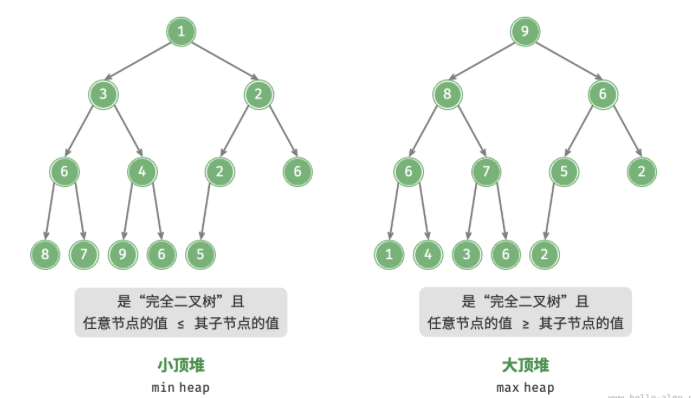
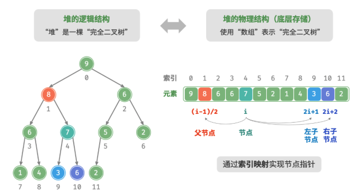
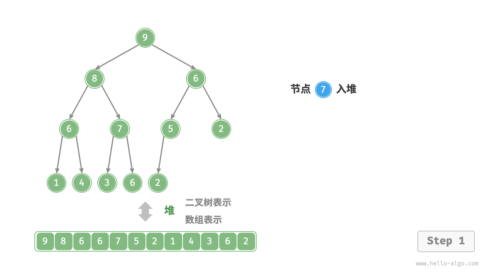
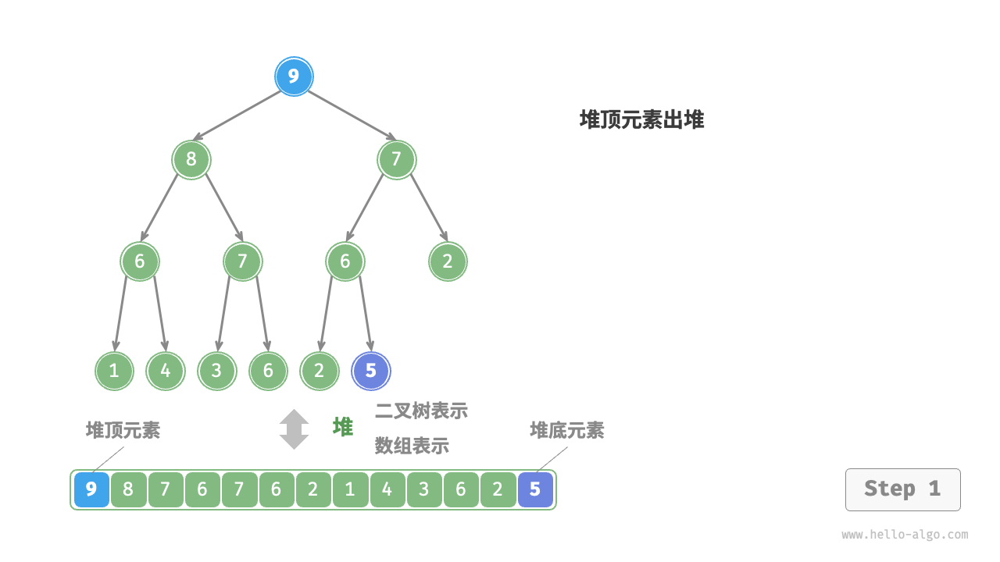
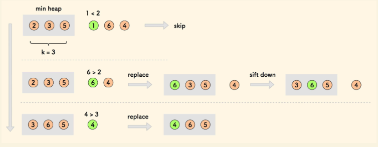

# 1. 算法思想

> - 堆（heap）是一种满足特定条件的完全二叉树，主要可分为两种类型，如图 所示。
>
>   > - 小顶堆（min heap）：任意节点的值 其子节点的值。
>   > - 大顶堆（max heap）：任意节点的值 其子节点的值。
>   >
>   > 
>
> - 堆作为完全二叉树的一个特例，具有以下特性。
>
>   > - 最底层节点靠左填充，其他层的节点都被填满。
>   > - 我们将二叉树的根节点称为“堆顶”，将底层最靠右的节点称为“堆底”。
>   > - 对于大顶堆（小顶堆），堆顶元素（根节点）的值是最大（最小）的。
>   > - **输入 n 个元素并建堆的时间复杂度可以优化至 ，非常高效。**
>
> - 堆的操作
>
>   > 需要指出的是，许多编程语言提供的是优先队列（priority queue），这是一种抽象的数据结构，定义为具有优先级排序的队列。优先队列的定义是具有出队优先级的队列，通常使用堆来实现。
>   >
>   > 实际上，**堆通常用于实现优先队列，大顶堆相当于元素按从大到小的顺序出队的优先队列**。从使用角度来看，我们可以将“优先队列”和“堆”看作等价的数据结构。因此，本书对两者不做特别区分，统一称作“堆”。
>   >
>   > 堆的常用操作见表 8-1 ，方法名需要根据编程语言来确定。
>   >
>   > <p align="center"> 表 <id> &nbsp; 堆的操作效率 </p>
>   >
>   > | 方法名                 | 描述                                                         | 时间复杂度  |
>   > | :--------------------- | :----------------------------------------------------------- | ----------- |
>   > | `add(E e)`             | 成功添加，返回 `true`。若元素为 `null`，则抛出 `NullPointerException` | $O(\log n)$ |
>   > | **`offer(E e)`(常用)** | 成功添加，返回 `true`。若元素为 `null`，则抛出`NullPointerException` | $O(\log n)$ |
>   > | **`poll()`(常用)**     | 堆顶元素出堆。 *Queue*接口方法                               | $O(\log n)$ |
>   > | `remove()`             | 堆顶元素出堆。*Queue*接口方法                                | $O(1)$      |
>   > | `remove(E e)`          | 移除某个元素。*Collection*接口的方法                         |             |
>   > | `peek()`               | 访问堆顶元素（对于大 / 小顶堆分别为最大 / 小值）             | $O(1)$      |
>   > | `size()`               | 获取堆的元素数量                                             | $O(1)$      |
>   > | `.iterator()`          | 返回的元素顺序是内部存储数组的顺序，而**不是按照优先级排序的顺序**，若保证正确，使用poll。 |             |
>   > | `isEmpty()`            | 判断堆是否为空                                               | $O(1)$      |
>   >
>   > ```java
>   > Queue<Integer> pq = new PriorityQueue<>((a, b)->{return b - a; });
>   > pq.offer(1);
>   > pq.offer(2);
>   > pq.offer(3);
>   > ```
>   >
>   > 
>
> - 堆的实现
>
>   > - 堆的存储
>   >
>   >   > “二叉树”章节讲过，完全二叉树非常适合用数组来表示。由于堆正是一种完全二叉树，**因此我们将采用数组来存储堆**。
>   >   >
>   >   > 当使用数组表示二叉树时，元素代表节点值，索引代表节点在二叉树中的位置。**节点指针通过索引映射公式来实现**。
>   >   >
>   >   > 如下图所示，给定索引 $i$ ，其左子节点的索引为 $2i + 1$ ，右子节点的索引为 $2i + 2$ ，父节点的索引为 $(i - 1) / 2$​（向下整除）。当索引越界时，表示空节点或节点不存在。
>   >   >
>   >   > 
>   >   >
>   >   > ```java
>   >   > /* 获取左子节点的索引 */
>   >   > int left(int i) {
>   >   >     return 2 * i + 1;
>   >   > }
>   >   > 
>   >   > /* 获取右子节点的索引 */
>   >   > int right(int i) {
>   >   >     return 2 * i + 2;
>   >   > }
>   >   > 
>   >   > /* 获取父节点的索引 */
>   >   > int parent(int i) {
>   >   >     return (i - 1) / 2; // 向下整除
>   >   > }
>   >   > ```
>   >
>   > - 访问堆顶元素
>   >
>   >   > 堆顶元素即为二叉树的根节点，也就是列表的首个元素：
>   >   > ```java
>   >   > /* 访问堆顶元素 */
>   >   > int peek() {
>   >   >     return maxHeap.get(0);
>   >   > }
>   >   > 
>   >   > ```
>   >
>   > - 元素入堆
>   >
>   >   > 给定元素 `val` ，我们首先将其添加到堆底。添加之后，由于 `val` 可能大于堆中其他元素，堆的成立条件可能已被破坏，**因此需要修复从插入节点到根节点的路径上的各个节点**，这个操作被称为<u>堆化（heapify）</u>。
>   >   >
>   >   > 考虑从入堆节点开始，**从底至顶执行堆化**。如下图所示，我们比较插入节点与其父节点的值，如果插入节点更大，则将它们交换。然后继续执行此操作，从底至顶修复堆中的各个节点，直至越过根节点或遇到无须交换的节点时结束。
>   >   >
>   >   > 
>   >   >
>   >   > ```java
>   >   > /* 元素入堆 */
>   >   > void push(int val) {
>   >   >     // 添加节点
>   >   >     maxHeap.add(val);
>   >   >     // 从底至顶堆化
>   >   >     siftUp(size() - 1);
>   >   > }
>   >   > 
>   >   > /* 从节点 i 开始，从底至顶堆化 */
>   >   > void siftUp(int i) {
>   >   >     while (true) {
>   >   >         // 获取节点 i 的父节点
>   >   >         int p = parent(i);
>   >   >         // 当“越过根节点”或“节点无须修复”时，结束堆化
>   >   >         if (p < 0 || maxHeap.get(i) <= maxHeap.get(p))
>   >   >             break;
>   >   >         // 交换两节点
>   >   >         swap(i, p);
>   >   >         // 循环向上堆化
>   >   >         i = p;
>   >   >     }
>   >   > }
>   >   > ```
>   >   
>   > - 元素出堆
>   >
>   >   > 堆顶元素是二叉树的根节点，即列表首元素。如果我们直接从列表中删除首元素，那么二叉树中所有节点的索引都会发生变化，这将使得后续使用堆化进行修复变得困难。为了尽量减少元素索引的变动，我们采用以下操作步骤。
>   >   >
>   >   > 1. 交换堆顶元素与堆底元素（交换根节点与最右叶节点）。
>   >   > 2. 交换完成后，将堆底从列表中删除（注意，由于已经交换，因此实际上删除的是原来的堆顶元素）。
>   >   > 3. 从根节点开始，**从顶至底执行堆化**。
>   >   >
>   >   > 如图  所示，**“从顶至底堆化”的操作方向与“从底至顶堆化”相反**，我们将根节点的值与其两个子节点的值进行比较，将最大的子节点与根节点交换。然后循环执行此操作，直到越过叶节点或遇到无须交换的节点时结束。
>   >   >
>   >   > 
>   >   >
>   >   > ```java
>   >   > /* 元素出堆 */
>   >   > int pop() {
>   >   >     // 判空处理
>   >   >     if (isEmpty())
>   >   >         throw new IndexOutOfBoundsException();
>   >   >     // 交换根节点与最右叶节点（交换首元素与尾元素）
>   >   >     swap(0, size() - 1);
>   >   >     // 删除节点
>   >   >     int val = maxHeap.remove(size() - 1);
>   >   >     // 从顶至底堆化
>   >   >     siftDown(0);
>   >   >     // 返回堆顶元素
>   >   >     return val;
>   >   > }
>   >   > 
>   >   > /* 从节点 i 开始，从顶至底堆化 */
>   >   > void siftDown(int i) {
>   >   >     while (true) {
>   >   >         // 判断节点 i, l, r 中值最大的节点，记为 ma
>   >   >         int l = left(i), r = right(i), ma = i;
>   >   >         if (l < size() && maxHeap.get(l) > maxHeap.get(ma))
>   >   >             ma = l;
>   >   >         if (r < size() && maxHeap.get(r) > maxHeap.get(ma))
>   >   >             ma = r;
>   >   >         // 若节点 i 最大或索引 l, r 越界，则无须继续堆化，跳出
>   >   >         if (ma == i)
>   >   >             break;
>   >   >         // 交换两节点
>   >   >         swap(i, ma);
>   >   >         // 循环向下堆化
>   >   >         i = ma;
>   >   >     }
>   >   > }
>   >   > ```
>   >


# 2. 算法适用场景

> - 可以解决的问题
>
>   > - TOP k question 
>   > - 找最大值或者最小值（60%）
>   > - 找第 k 大（ pop k 次 复杂度 O(klogn) ）（50%）这是一个经典的算法问题，同时也是一种典型应用，例如选择热度前 10 的新闻作为微博热搜，选取销量前 10 的商品等。
>   > - 要求 logn 时间对数据进行操作（40%）堆通常作为实现优先队列的首选数据结构，其入队和出队操作的时间复杂度均为 $O(\log n)$ ，而建堆操作为 $O(n)$ ，这些操作都非常高效。
>   > - 优先队列**：堆通常作为实现优先队列的首选数据结构，其入队和出队操作的时间复杂度均为 $O(\log n)$ ，而建堆操作为 $O(n)$ ，这些操作都非常高效。
>
> - 不可以解决的问题
>
>   > - 查询比某个数大的最小值/最接近的值（平衡排序二叉树 Balanced BST 才可以解决）
>   > - 找某段区间的最大值最小值（线段树 SegmentTree 可以解决）
>   > - O(n)*O*(*n*) 找第 k 大 (使用快排中的 partition 操作)

# 3. 算法模版

## 3.1 实现

> 
>
> - 通过入堆操作实现 — **建堆方法的时间复杂度为 $O(n \log n)$ **)
>
>   > 在某些情况下，我们希望使用一个列表的所有元素来构建一个堆，这个过程被称为“建堆操作”。
>   >
>   > 我们首先创建一个空堆，然后遍历列表，依次对每个元素执行“入堆操作”，即先将元素添加至堆的尾部，再对该元素执行“从底至顶”堆化。
>   >
>   > 每当一个元素入堆，堆的长度就加一。由于节点是从顶到底依次被添加进二叉树的，因此堆是“自上而下”构建的。
>   >
>   > 设元素数量为 $n$ ，每个元素的入堆操作使用 $O(\log{n})$ 时间，因此**该建堆方法的时间复杂度为 $O(n \log n)$ **。
>
> - 通过遍历堆化实现 — **建堆的时间复杂度为 $O(n)$**  
>
>   > 实际上，我们可以实现一种更为高效的建堆方法，共分为两步。**输入列表并建堆的时间复杂度为 $O(n)$ ，非常高效**。
>   >
>   > 1. 将列表所有元素原封不动地添加到堆中，此时堆的性质尚未得到满足。
>   > 2. 倒序遍历堆（层序遍历的倒序），依次对每个非叶节点执行“从顶至底堆化”。
>   >
>   > **每当堆化一个节点后，以该节点为根节点的子树就形成一个合法的子堆**。而由于是倒序遍历，因此堆是“自下而上”构建的。
>   >
>   > 之所以选择倒序遍历，是因为这样能够保证当前节点之下的子树已经是合法的子堆，这样堆化当前节点才是有效的。
>   >
>   > 值得说明的是，**由于叶节点没有子节点，因此它们天然就是合法的子堆，无须堆化**。如以下代码所示，最后一个非叶节点是最后一个节点的父节点，我们从它开始倒序遍历并执行堆化：
>   >
>   > ```java
>   > /* 构造方法，根据输入列表建堆 */
>   > MaxHeap(List<Integer> nums) {
>   >     // 将列表元素原封不动添加进堆
>   >     maxHeap = new ArrayList<>(nums);
>   >     // 堆化除叶节点以外的其他所有节点
>   >     for (int i = parent(size() - 1); i >= 0; i--) {
>   >         siftDown(i);
>   >     }
>   > }
>   > ```
>   >
>
> - Top K
>
>   > ```java
>   > /* 基于堆查找数组中最大的 k 个元素 */
>   > Queue<Integer> topKHeap(int[] nums, int k) {
>   >   // Custom comparator to sort persons by age in descending order
>   >         Comparator<Integer> ageComparator = new Comparator<Integer>() {
>   >             @Override
>   >             public int compare(Integer p1, Integer p2) {
>   >                 return Integer.compare(p2.age, p1.age); // Descending order
>   >             }
>   >         };
>   >   
>   >   
>   >  // 初始化小顶堆
>   >  Queue<Integer> heap = new PriorityQueue<Integer>((x, y) -> {return y - x;});
>   >  // 将数组的前 k 个元素入堆
>   >  for (int i = 0; i < k; i++) {
>   >      heap.offer(nums[i]);
>   >  }
>   >  // 从第 k+1 个元素开始，保持堆的长度为 k
>   >  for (int i = k; i < nums.length; i++) {
>   >      // 若当前元素大于堆顶元素，则将堆顶元素出堆、当前元素入堆
>   >      if (nums[i] > heap.peek()) {
>   >          heap.poll();
>   >          heap.offer(nums[i]);
>   >      }
>   >  }
>   >  return heap;
>   > }
>   > ```
>   >
>


# 4. 时间复杂度

> - 时间复杂度：O(N * logK )
> - 空间复杂度：O(K)
