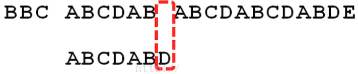
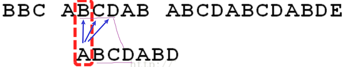
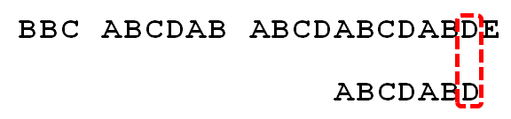
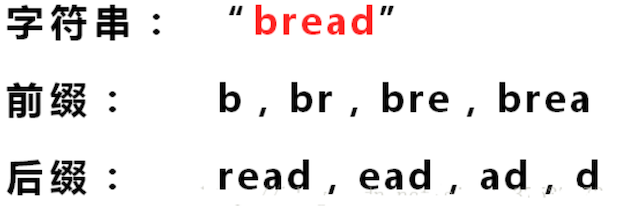

# 1. 算法思想

> KMP 是一个解决 **模式串在文本串中是否出现过**，如果出现过，则最早出现的位置的经典算法。
>
> Knuth-Morris-Pratt **字符串查找算法**，简称 KMP 算法：**常用与在一个文本字符串 s 内查找一个模式串 P 的出现位置**。
>
> 该算法由 Donald Knuth、Vaughan Pratt、James H. Morris 三人于 1977 年联合发表，故取这 3 人的姓氏命名此算法.
>
> KMP 方法利用 **之前判断过的信息**，通过一个 next 数组，保存模式串中前后最长公共子序列的长度，每次回溯时，通过 next 数组找到前面匹配过的位置，省去了大量的计算时间。

# 2 算法适用场景

- 字符串匹配问题

# 3. 算法模版

## 3.1 KMP 思路分析

以下面的字符串来举例：

```java
Str1 = "BBC ABCDAB ABCDABCDABDE"
Str2 = "ABCDABD"
```

1. 都用第 1 个字符进行比较，不符合，关键词（文本串）向后移动一位

   

2. 重复第一步，还是不符合，再后移动

   

3. 一直重复，直到 str1 有一个字符与 str2 的第一个字符匹配为止

   

4. 接着比较字符串和搜索词的下一个字符，还是符合

   

5. 遇到 st1 有一个字符与 str2 对应的字符不符合时

   

6. 这时候：想到的是继续遍历 st1 的下一个字符（也就是暴力匹配）

   

   这时，就出现一个问题：

   

   此时回溯时，A 还会去和 `BCD` 进行比较，而在上一步 ABCDAB 与 ABCDABD，前 6 个都相等，其中 BCD 搜索词的第一个字符 A 不相等，那么这个时候还要用 A 去匹配 `BCD`，这肯定会匹配失败。

   **KMP 算法的想法是：设法利用这个已知信息，不要把「搜索位置」移回已经比较过的位置，继续把它向后移，这样就提高了效率。** 

   那么新的问题就来了：你如何知道 A 与 BCD 不相同，并且只有 BCD 不用比较呢？这个就是 KMP 的核心原理了。

7. KMP 利用 **部分匹配表**，来省略掉刚刚重复的步骤。

   

   上表是这样看的：

   1. ABCD 匹配值 0
   2. ABCDA 匹配值 1
   3. ABCDAB 匹配值 2

   至于如何产生的这个部分匹配表，下面专门讲解，这里你要知道的是，KMP 利用这个 **部分匹配表** 可以省略掉重复的步骤

8. 已知空格与 D 不匹配时，前面 6 个字符 `ABCDAB` 是匹配的。

   

   查表可知：**部分匹配值是 2**，因此按照下面的公司计算出后移的位数：

   ```text
   移动位数 = 已匹配的字符数 - 对应的部分匹配值
    4      =    6		  -   2
   ```

   因此回溯的时候往后移动 4 位，而不是暴力匹配移动的 1 位。

9. 因为空格与 C 不匹配

   

   搜索词还要继续往后移动，这时，已匹配的字符树数为 2 （`AB`），对应的 **部分匹配值** 为 0，所以 `移动位数 = 2 - 0 = 2`，于是将搜索词（文本串）向后移动两位

   

10. 因为空格与 A 不匹配，继续往后移动一位

11. 继续比较，发现D与C 失配，故向右移动的位数为：已匹配的字符数6减去上一位字符B对应的最大长度2，即向右移动6 - 2 = 4 位。

    

12. 经历第5步后，发现匹配成功，过程结束。

    

### 部分匹配表是如何产生的？

看上上述步骤，你现在的疑惑是：这个部分匹配表是如何产生的？下面就来介绍

需要先知道 **前缀 ** 和 **后缀** 是什么



- 前缀：仔细看，它的前缀就是每个字符串的组合，逐渐变长，**但是不包括最后一个字符**

  如果 `bread` 是字符串 `bread` 的前缀，这个不是完全匹配了吗？

- 后缀：同理，不包含第一个

**部分匹配值** 就是 **前缀** 和 **后缀** 的 **最长的共有元素的长度**，下面以 `ABCDABD` 来解说：

| 字符串  | 前缀                              | 后缀                              | 共有元素 | 共有元素长度 |
| ------- | --------------------------------- | --------------------------------- | -------- | ------------ |
| A       | -                                 | -                                 | -        | 0            |
| AB      | A                                 | B                                 | -        | 0            |
| ABC     | `A、AB`                           | `BC、C`                           | -        | 0            |
| ABCD    | `A、AB、ABC`                      | `BCD、CD、D`                      | -        | 0            |
| ABCDA   | `A、AB、ABC、ABCD`                | `BCDA、CDA、DA、A`                | A        | 1            |
| ABCDAB  | `A、AB、ABC、ABCD、ABCDA`         | `BCDAB、CDAB、DAB、AB、B`         | `AB`     | 2            |
| ABCDABD | `A、AB、ABC、ABCD、ABCDA、ABCDAB` | `BCDABD、CDABD、DABD、ABD、BD、D` | -        | 0            |

**部分匹配** 的实质是：有时候，字符串头部和尾部会有重复。

比如：`ABCDAB` 中有两个 `AB` ，那么它的 **部分匹配值** 就是 2 （AB 的长度），搜索词（文本串）移动的时候，第一个移动 4 位（字符串长度 - 部分匹配值），就可以来到第二个 `AB` 的位置，从而跳过了已经匹配过的 BCD。


代码实现：

```java
  /**
     * kmp 部分匹配表生成
     */
    @Test
    public void kmpNextTest() {
        String dest = "A";
        System.out.println("字符串：" + dest);
        System.out.println("的部分匹配表为：" + Arrays.toString(buildKmpNext(dest)));
        System.out.println();
        dest = "AA";
        System.out.println("字符串：" + dest);
        System.out.println("的部分匹配表为：" + Arrays.toString(buildKmpNext(dest)));
        System.out.println();
        dest = "AAA";
        System.out.println("字符串：" + dest);
        System.out.println("的部分匹配表为：" + Arrays.toString(buildKmpNext(dest)));
        System.out.println();
        dest = "AAAB";
        System.out.println("字符串：" + dest);
        System.out.println("的部分匹配表为：" + Arrays.toString(buildKmpNext(dest)));
        System.out.println();
        dest = "ABCDABD";
        System.out.println("字符串：" + dest);
        System.out.println("的部分匹配表为：" + Arrays.toString(buildKmpNext(dest)));
        System.out.println();
    }

    /**
     * 生成此字符串的 部分匹配表
     *
     * @param dest
     */
    public int[] buildKmpNext(String dest) {
        int[] next = new int[dest.length()];
        // 第一个字符的前缀和后缀都没有，所以不会有公共元素，因此必定为 0
        next[0] = 0;
        for (int i = 1, j = 0; i < dest.length(); i++) {
            /*
              ABCDA
              前缀：`A、AB、ABC、ABCD`
              后缀：`BCDA、CDA、DA、A`
              公共元素 A
              部分匹配值：1
             */
            // 当  dest.charAt(i) != dest.charAt(j) 时
            // 需要从 next[j-1] 中获取新的 j
            // 这步骤是 部分匹配表的 核心点
            while (j > 0 && dest.charAt(i) != dest.charAt(j)) {
                j = next[j - 1];
            }
            // 当相等时，表示有一个部分匹配值
            if (dest.charAt(i) == dest.charAt(j)) {
                j++;
            }
            next[i] = j;
        }
        return next;
    }
```


# 4. 算法复杂度

> - 时间复杂度：*O*(*N*)
> - 空间复杂度：O*(*N)

