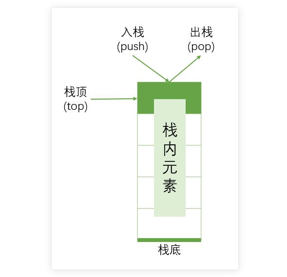
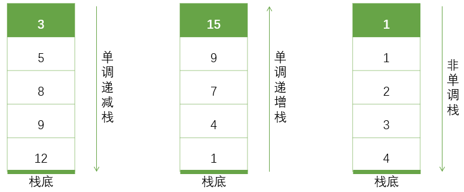
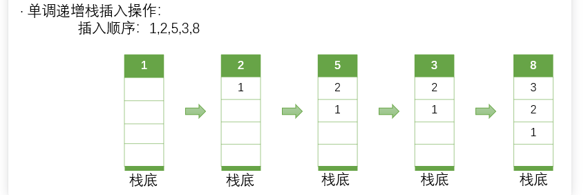
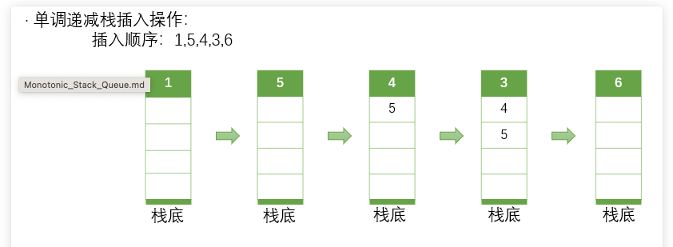
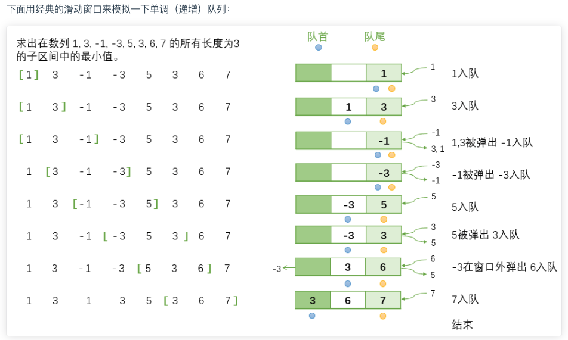
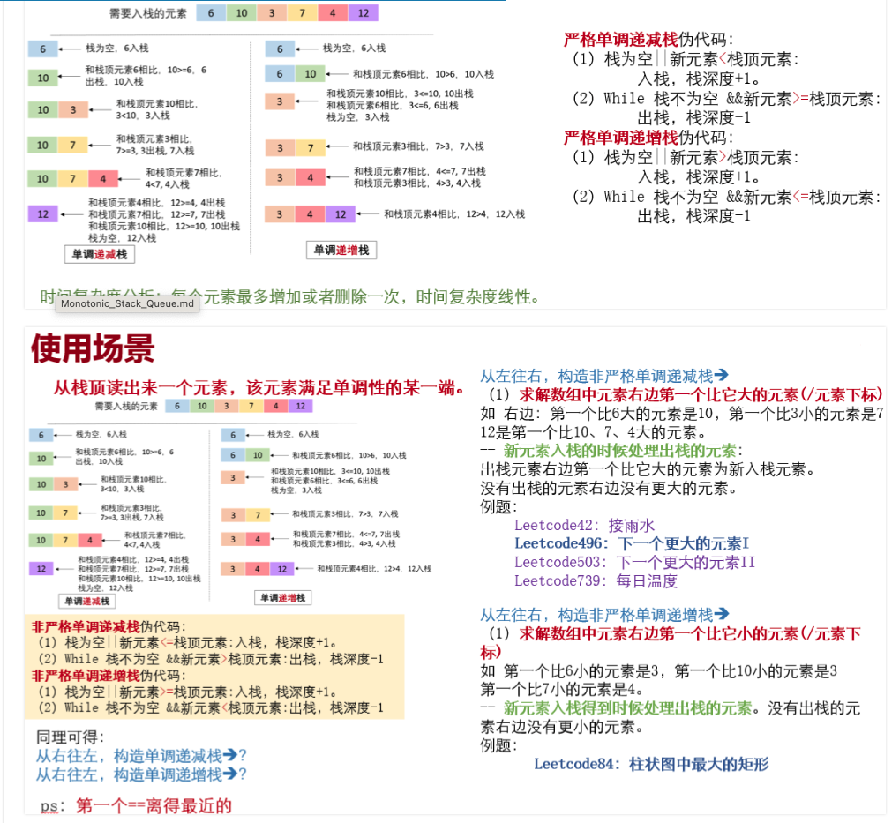

# 1. 算法思想

> - 单调栈是一种特殊的栈，它的特点是栈中的元素始终保持单调有序。通常有两种单调栈，分别是单调递增栈和单调递减栈。
>
>   > 
>   >
>   > 
>   >
>   > - 单调递增栈顾名思义，栈内元素从栈底到栈顶递增有序，即栈顶元素最大，栈底元素最小。而单调递减栈则相反，栈内元素从栈底到栈顶递减有序，即栈顶元素最小，栈底元素最大。这种利用单调栈求解问题的思路通常可以简化算法，提高算法的效率。简单的说，单调栈就是通过维护一个栈，来达到以空间换时间，从而使得时间复杂度从O(n^2)降低到O(n)，大大提高算法效率。
>   >
>   > - **单调递增栈**
>   >   **从左往右遍历——可以找到右边第一个比它小的元素的位置** 
>   >
>   >   **从右往左遍历——可以找到左边第一个比它小的元素的位置** 
>   >
>   >   > 若即将入栈元素为 now ，栈顶元素为 top 。如果 now>top 则直接插入；如果 now≤top 则持续弹出栈顶元素直到第一次 now>top 为止，再加入栈顶元素。
>   >   >
>   >   > 
>   >
>   > - **单调递减栈**
>   >
>   >   **从左往右遍历—可以找到右边第一个比当前元素大的数/数的位置** 
>   >   **从右往左遍历—可以找到左边第一个比当前元素大的数/数的位置** 
>   >
>   >   > 若即将入栈元素为 now ，栈顶元素为 top 。如果 now<top 则直接插入；如果 now≥top 则持续弹出栈顶元素知道第一次 now<top 为止，再加入栈顶元素。
>   >   > 
>   >   > 
>   >
>   > - 非严格单调递增栈和单调递减栈，基于单调递增栈和单调递减栈基础之上，允许栈内元素相等的情况
>
> - 单调队列，就是一个符合单调性质的队列，它同时具有单调的性质以及队列的性质。他在编程中使用频率不高，但却占有至关重要的地位。 并且单调队列并不是严格符合上述队列结构的队列。
>
>   > 
>   >
>   > - **单调递增队列**
>   >
>   >   **从左往右遍历——可以找到每个子区间最小元素** 
>   >
>   >   > 若即将入队元素为 now，队尾元素为 tail，限定合法队列长度 k 。如果 now>tail 则直接入队；否则循环弹出队尾直到第一次出现 now>tail 为止。如果当前的队首元素 front 的时间戳已经不合法，则弹出队首元素。
>   >   >
>   >   > 
>   >
>   > - **单调递减队列**
>   >   **从左往右遍历——可以找到每个子区间最大元素** 
>   >
>   >   > 若即将入队元素为 now，队尾元素为 tail，限定合法队列长度 k 。如果 now<tail 则直接入队；否则循环弹出队尾直到第一次出现 now<tail 为止。如果当前的队首元素 front 的时间戳已经不合法，则弹出队首元素。


# 2. 算法适用场景

> - **单调栈的应用场景**，尤其是在处理一个数列的大小关系上的时候，
>
>   > - 求解某个元素的左边或者右边第一个比它大或者小的元素。
>   >
>   >   > 以求解元素的左边第一个比它小的元素为例，我们可以从左到右遍历数组，将每个元素入栈。在入栈的过程中，我们可以比较栈顶元素与当前元素的大小，如果栈顶元素大于当前元素，则栈顶元素比当前元素的左边第一个比它小的元素。将栈顶元素出栈后，继续比较栈顶元素与当前元素的大小，直到栈为空或者栈顶元素小于当前元素。这样，我们就可以得到当前元素的左边第一个比它小的元素
>   >
>   > - 左右配对（寻找区间，例如：接雨水）
>   >
>   > - 多个区间中的最值（以某个数为最值的最长区间问题）
>
> - **单调对列应用场景**
>
>   > - 滑动窗口问题， 维护区间最值
>   >
>   > - 优化动态规划
>   >
>   >   > 那么考虑动态规划的松弛过程。如果松弛变量 j 有一个固定长度的取值范围，我们可以在这个范围内维护一个单调队列（考虑滑动窗口），而在 O(1) 的时间找到队头元素直接转移即可。这样会在时间上压下来一维，也正是单调队列优化动态规划的意义所在。
>   >   >
>   >   >  而单调队列一般都是优化线性DP，形如 f[i]=max/min(f[j])+val[i] 并且满足 j<i, val[i] 与 f[j] 无关。这时候我们就可以优化 f[j] 。这时候由于我们每次都可以直接找到符合答案的 f[j]，我们只需要枚举一次 i ，而压掉了 j 的一维。
>   >   >
>   >   > 单调队列看起来并不是一个很重要或者很常用的东西。当时往往在需要它的时候，它的确可以派的上大用场。在它优化动态规划的时候，可能只有那么短短的几行，简单的模拟，压掉的却是 n 次的循环。对于DP来说，单调队列也不妨是一种解决问题的思考方式，或者是帮助解决问题的很好的工具。

# 3. 算法模版

## 3.1 单调栈实现

> 
>
> ```java
> //1. stack 可以存储元素也可存index， 推荐存入index
> //2. 可以准备一些比所有值都小/大的值，方便处理所有元素
> package template;
> 
> import java.util.Arrays;
> import java.util.Stack;
> import java.util.Arrays;
> import java.util.Stack;
> 
> public class MonotonicStack {
>     // 1. stack 可以存储元素也可存 index，推荐存入 index
>     // 《单调栈模板方法》
> 
>     /**
>      * 查找每个元素右侧第一个比它大的元素
>      * @param nums 输入数组
>      * @return 返回数组，res[i] 代表 nums[i] 右侧第一个比它大的元素，如果不存在则为 -1
>      */
>     public int[] findRightGreater(int[] nums) {
>         // 结果数组，用于存储右侧第一个比当前元素大的数
>         int[] res = new int[nums.length];
>         // 单调栈，存储数组中的元素
>         Stack<Integer> stack = new Stack<>();
> 
>         // 倒序遍历数组，从右向左遍历
>         for (int i = nums.length - 1; i >= 0; i--) {
>             // 如果当前元素比栈顶元素大，弹出栈顶元素，直到找到比当前元素大的数
>             while (!stack.isEmpty() && nums[i] > stack.peek()) stack.pop();
>             // 记录当前元素右侧的第一个较大元素
>             res[i] = stack.isEmpty() ? -1 : stack.peek();
>             // 当前元素入栈，确保栈中的元素保持单调递减
>             stack.push(nums[i]);
>         }
>         return res;
>     }
> 
>     /**
>      * 查找每个元素右侧第一个比它大的元素 (存索引版本)
>      * @param nums 输入数组
>      * @return 返回数组，res[i] 代表 nums[i] 右侧第一个比它大的元素，如果不存在则为 -1
>      */
>     public int[] findRightGreater2(int[] nums) {
>         // 结果数组
>         int[] res = new int[nums.length];
>         // 单调栈，存储的是数组索引
>         Stack<Integer> stack = new Stack<>();
> 
>         // 正序遍历数组，从左到右遍历
>         for (int i = 0; i < nums.length; i++) {
>             // 当栈不为空且当前元素比栈顶索引对应的元素大，则栈顶索引元素的答案就是当前元素
>             while (!stack.isEmpty() && nums[i] > nums[stack.peek()]) {
>                 res[stack.pop()] = nums[i];
>             }
>             // 所有元素最终都会入栈
>             stack.push(i);
>         }
> 
>         // 遍历完成后，栈中剩余元素说明它们右侧没有更大的元素，填充为 -1
>         while (!stack.isEmpty()) {
>             res[stack.pop()] = -1;
>         }
>         return res;
>     }
> 
>     /**
>      * 查找每个元素左侧第一个比它小的元素
>      * @param nums 输入数组
>      * @return 返回数组，res[i] 代表 nums[i] 左侧第一个比它小的元素，如果不存在则为 -1
>      */
>     public int[] findLeftSmaller(int[] nums) {
>         // 结果数组
>         int[] res = new int[nums.length];
>         // 单调栈，存储的是数组元素
>         Stack<Integer> stack = new Stack<>();
> 
>         // 正序遍历数组，从左向右遍历
>         for (int i = 0; i < nums.length; i++) {
>             // 如果当前元素比栈顶元素小，弹出栈顶元素，直到找到比当前元素小的数
>             while (!stack.isEmpty() && nums[i] <= stack.peek()) {
>                 stack.pop();
>             }
>             // 记录当前元素左侧的第一个较小元素
>             res[i] = stack.isEmpty() ? -1 : stack.peek();
>             // 当前元素入栈，确保栈中的元素保持单调递增
>             stack.push(nums[i]);
>         }
>         return res;
>     }
> 
>     /**
>      * 查找每个元素左侧第一个比它小的元素 (存索引版本)
>      * @param nums 输入数组
>      * @return 返回数组，res[i] 代表 nums[i] 左侧第一个比它小的元素，如果不存在则为 -1
>      */
>     public int[] findLeftSmaller2(int[] nums) {
>         // 结果数组
>         int[] res = new int[nums.length];
>         // 单调栈，存储的是数组索引
>         Stack<Integer> stack = new Stack<>();
> 
>         // 倒序遍历数组，从右向左遍历
>         for (int i = nums.length - 1; i > -1; i--) {
>             // 如果当前元素比栈顶索引对应的元素小，则栈顶索引元素的答案就是当前元素
>             while (!stack.isEmpty() && nums[i] <= nums[stack.peek()]) {
>                 res[stack.pop()] = nums[i];
>             }
>             // 当前索引入栈，确保栈中的索引对应的值保持单调递增
>             stack.push(i);
>         }
> 
>         // 遍历完成后，栈中剩余索引说明它们左侧没有更小的元素，填充为 -1
>         while (!stack.isEmpty()) {
>             res[stack.pop()] = -1;
>         }
> 
>         return res;
>     }
> 
>     public static void main(String[] args) {
>         MonotonicStack mStack = new MonotonicStack();
> 
>         // 测试样例 1
>         int[] nums = {6, 10, 3, 7, 4, 12};
>         System.out.println("findRightGreater: " + Arrays.toString(mStack.findRightGreater(nums)));
>         // 预期输出: [10, 12, 7, 12, 12, -1]
>         System.out.println("findRightGreater2: " +Arrays.toString(mStack.findRightGreater2(nums)));
>         // 预期输出: [10, 12, 7, 12, 12, -1]
> 
>         // 测试样例 2
>         int[] nums1 = {1, 3, 0, 2, 5};
>         System.out.println("findLeftSmaller: " + Arrays.toString(mStack.findLeftSmaller(nums1)));
>         // 预期输出: [-1, 1, -1, 0, 2]
>         System.out.println("findLeftSmaller2: " + Arrays.toString(mStack.findLeftSmaller2(nums1)));
>         // 预期输出: [-1, 1, -1, 0, 2]
>     }
> }
> 
> 
> ```
>

## 3.2 单调队列模版

> ```java
> public int[] maxSlidingWindow(int[] nums, int k) {
>             // 使用双端队列来存储窗口中的元素索引
>             Deque<Integer> dq = new ArrayDeque<>();
>             // 用一个列表来存储结果
>             List<Integer> res = new ArrayList<>();
> 
>             // 初始化双端队列，处理前k个元素
>             for (int i = 0; i < k; i++) {
>                 // 保持双端队列中的元素是递减的
>                 while (!dq.isEmpty() && nums[i] >= nums[dq.peekLast()]) {
>                     dq.pollLast(); // 移除队列末尾的元素
>                 }
>                 dq.offerLast(i); // 将当前元素的索引添加到队列末尾
>             }
>             res.add(nums[dq.peekFirst()]); // 将第一个窗口的最大值添加到结果中
> 
>             // 遍历剩余的元素
>             for (int i = k; i < nums.length; i++) {
>                 // 如果队列头部的索引不在当前窗口中，移除它
>                 if (dq.peekFirst() == i - k) {
>                     dq.pollFirst();
>                 }
>                 // 保持双端队列中的元素是递减的
>                 while (!dq.isEmpty() && nums[i] >= nums[dq.peekLast()]) {
>                     dq.pollLast(); // 移除队列末尾的元素
>                 }
> 
>                 dq.offerLast(i); // 将当前元素的索引添加到队列末尾
>                 res.add(nums[dq.peekFirst()]); // 将当前窗口的最大值添加到结果中
>             }
>             // 将结果列表转换为数组并返回
>             return res.stream().mapToInt(i -> i).toArray();
>         }
> ```


# 4. 时间复杂度

> - 单调栈
>
>   - 时间复杂度：O（N）
>
>   - 空间复杂度：O（N）
>
> - 单调队列
>
>   - 时间复杂度：O（N）
>
>   - 空间复杂度：O（N）
>
>     