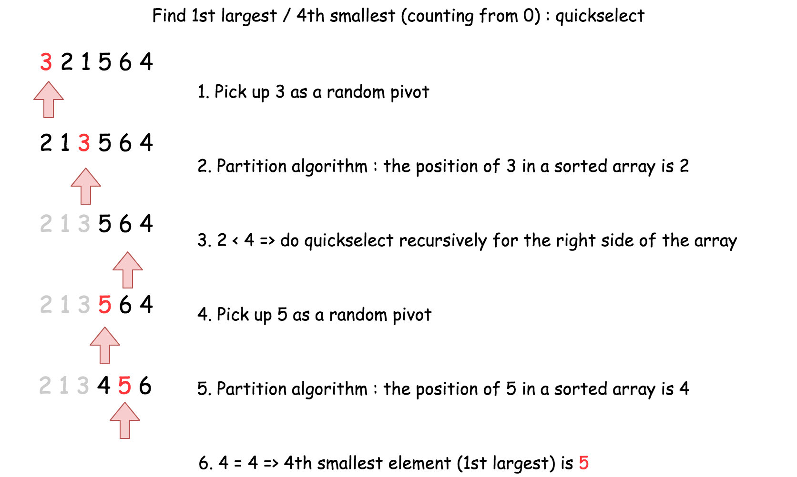
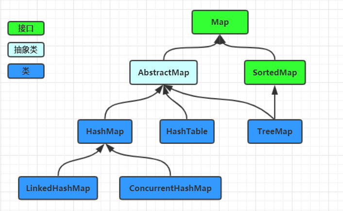

# 1. Quick Selection 算法思想

> - "Quick selection" 的基本思想是使用快速排序算法的分区（partition）过程，通过不断地缩小问题的规模，找到未排序数组中的第 k 小（或第 k 大）的元素。与快速排序不同的是，Quick selection不需要对整个数组进行排序，只关注目标元素所在的部分

# 2. 算法适用场景
> - TOP k question 

# 3. 算法模版

## 3.1 递归方式实现

> 

~~~java
import java.util.Random;
class Solution {
  int [] nums;

  public void swap(int a, int b) {
    int tmp = this.nums[a];
    this.nums[a] = this.nums[b];
    this.nums[b] = tmp;
  }

  public int partition(int left, int right, int pivot_index) {
    int pivot = this.nums[pivot_index];
    // 1. move pivot to end
    swap(pivot_index, right);
    int store_index = left;

// 2. move all smaller elements to the left
for (int i = left; i <= right; i++) {
  if (this.nums[i] < pivot) {
    swap(store_index, i);
    store_index++;
  }
}

// 3. move pivot to its final place
swap(store_index, right);

return store_index;

  }

  public int quickselect(int left, int right, int k_smallest) {
    /*
    Returns the k-th smallest element of list within left..right.
    */

if (left == right) // If the list contains only one element,
  return this.nums[left];  // return that element

// select a random pivot_index
Random random_num = new Random();
int pivot_index = left + random_num.nextInt(right - left); 

pivot_index = partition(left, right, pivot_index);

// the pivot is on (N - k)th smallest position
if (k_smallest == pivot_index)
  return this.nums[k_smallest];
// go left side
else if (k_smallest < pivot_index)
  return quickselect(left, pivot_index - 1, k_smallest);
// go right side
return quickselect(pivot_index + 1, right, k_smallest);

  }

  public int findKthLargest(int[] nums, int k) {
    this.nums = nums;
    int size = nums.length;
    // kth largest is (N - k)th smallest
    return quickselect(0, size - 1, size - k);
  }
}
~~~

# 4. 时间复杂度

> - 时间复杂度：O(N)， worst case O(N^2)
> - 空间复杂度：O(1)

