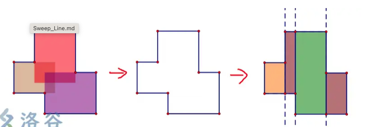
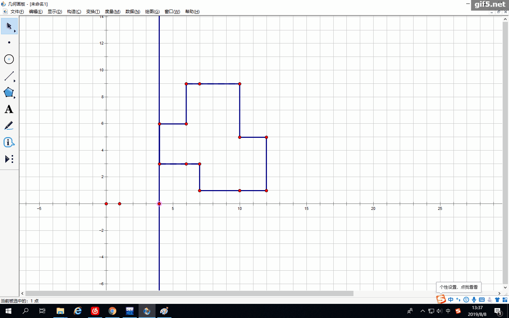
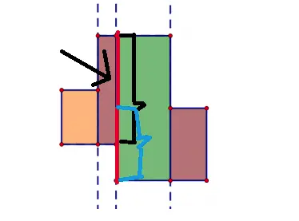
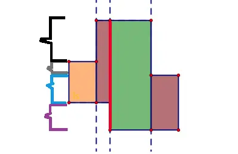
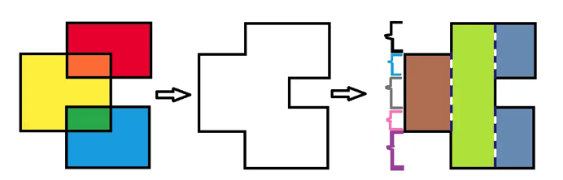
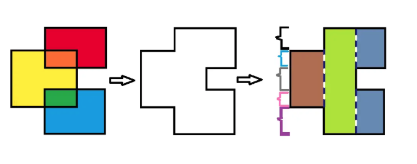

# 1. 算法思想

> - 扫描线算法是一种求**矩形**的**面积并**和**周长并**的好方法。其思想是由一条**假想**的线从图形的下方扫向上方（或者左方扫到右方，都可以），那么通过分析扫描线被图形截得的线段就能获得所要的结果。
> - 可以用于解决时间冲突
> - 例如：求面积
>
>   > 1. 图形转换
>   >
>   >    > 
>   >
>   > 2. 扫描图形，找到各个坐标
>   >
>   >    > 
>   >
>   > 3. 使用线段树进行优化
>   >
>   >    > 1. 为什么使用线段树
>   >    >
>   >    > > 不难发现，我们在从左往右扫时，最难计算的其实就是扫到的那一条线段的长度。因为一条线段**不一定是该矩形的边**，比如这一条红色线段:
>   >    > > 
>   >    > > 这一条线段，其实就是由黑色框起来的这一部分线段(这条线段是一个矩形的边)加上蓝色框起来的线段(这条线段也是一个矩形的边)再减去重合部分。因为这里只有三个图形，所以计算量也不大。但是，要是有更多的矩形像这样子重合，计算量就很大了，很浪费时间的。
>   >    > > 我们可以把黑色框起来的线段加上灰色框起来的线段加上蓝色框起来的线段加上紫色框起来的线段，得出这条红色线段的长度。而这些框起来的地方就是一条线段。那么，类似的,我们可以建立**线段树**，**管理图中所有矩形的y坐标之间的线段**。节点的特征值就是**当前扫描到的线段在管理范围内的总长度**
>   >    >
>   >    >
>   >    > 2. 如何使用线段树
>   >    >
>   >    > > 我们定义t**r[1]所管理的范围就是**从图象最上面的 y到最下面的*y*，也就是管理黑色、灰色、蓝色和紫色框起来的这些线段。tr[1]的特征值c就是**从图象最上面的**y到最下面的y**这个范围中包含被扫到的线段的长度**。
>   >    > > 当扫到第一条线段的时候，只有灰色和蓝色部分才有这一条被扫到的线段的一部分，所以tr[1].c=灰色+蓝色这部分的长度；
>   >    > > 扫到第二条线的时候，tr[1].c=黑色+灰色+蓝色(因为黑色和灰色和蓝色才含有扫描到的线)的长度；
>   >    > > 扫到第三条线的时候，tr[1].c=黑+灰+蓝+紫(都有有扫描到的线的一部分)的长度...
>   >    > > 那么，求这一条被扫到的线段的长度，我们只要用线段树比较基础的**区间求和**就可以了
>   >    >
>   >    >
>   >    > 3. 如何**判断哪些区间包含当前扫到的线段**
>   >    >
>   >    > > 我们可以通过区间求和来计算出扫描线的长度，但是我们要计算哪一部分的线段呢？就像上一幅图，你怎么知道什么时候加的是灰色和蓝色部分，什么时候加的是灰色、蓝色和黑色部分，还有什么时候加的是灰色和蓝色和黑色和紫色部分呢？这个时候，我们要引进**入边**和**出边**此入边出边非图论的入边出边。这里的入边，指的是**一个矩形中第一条被扫到的线段**；而出边，就是**这个矩形第二条，也就是最后一条被扫到的线段**
>   >    > >
>   >    > > 我们可以这样子去理解：扫描到一条入边意味着有一个矩形进入到扫描线扫描的区域里面，那么我们在计算面积的时候当然要加上这一部分；而扫描到一条出边也就意味着有一个矩形已经扫描完了，这个矩形也就不在扫描线扫描的区域以内了，所以这个时候，我们就不再需要这一部分了
>   >    > > 我们设**入边为**1 ，**出边为**−1。每个节点设立一个变量tag，记录这个节点管理的区间是不是有当前扫描到的线段的一部分，判断有没有的依据是节点的tag是否>0。如果>0就说明包含了线段的一部分，=0就是没有包含，**不可能**出现<0的情况
>   >    > > 这样一来，当我遇到一条出边时，就可以与之前一条入边加上的抵消掉。再根据tag的定义，判断这个节点所管理的范围是否包含被扫到的线段，有的话就加上
>   >    > > 我们其实也可以根据个人喜好，可以设**入边为**2,**出边为**−2或者**入边为3，**出边为−3等等，只要入边和出边**互为相反数且入边值** >0 > **出边值的都可以**(也可以入出边互为相反数且入边小于出边，但后面的操作就要修改一下了)
>   >    > >
>   >    > > 那么举一个例子模拟一下算法流程:
>   >    > > `
>   >    > > 假设黑、蓝、灰、粉、紫所框起来的线段都为1，棕色矩形的宽为2，草绿色和灰蓝色矩形宽为1
>   >    > >
>   >    > > 1. 开始模拟扫到**第一条边，是且肯定是入边**。
>   >    > >
>   >    > >    > 那么我们加上这一部分长度，刚好在蓝色、灰色和粉色区域，这三个区域tag都加1
>   >    > >    >
>   >    > >    > 当前各区域tag:
>   >    > >    >
>   >    > >    > ```java
>   >    > >    > 黑=0
>   >    > >    > 蓝=1
>   >    > >    > 灰=1
>   >    > >    > 粉=1
>   >    > >    > 紫=0
>   >    > >    > ```
>   >    > >    >
>   >    > >    > 我们只计算tag大于0的区域的长度。所以
>   >    > >    >
>   >    > >    > ans = ans + ( 蓝色+灰色+粉色) ∗ 棕色矩形的宽 =0+(1+1+1)∗2=6
>   >    > >
>   >    > > 2. 扫到第二条边，也是入边。
>   >    > >
>   >    > >    > 所以黑色和紫色的区域tag加1
>   >    > >    > tag:
>   >    > >    >
>   >    > >    > ```java
>   >    > >    > 黑=1
>   >    > >    > 蓝=1
>   >    > >    > 灰=1
>   >    > >    > 粉=1
>   >    > >    > 紫=1
>   >    > >    > ```
>   >    > >    >
>   >    > >    > 同样计算tag大于0的区域的长度。
>   >    > >    > `ans=ans+ (黑色+蓝色+灰色+粉色+紫色)∗草绿色矩形宽度 =6+(1+1+1+1+1)∗1=11`
>   >    > >
>   >    > > 3. 扫描到第三条边。这是一条**出边**
>   >    > >
>   >    > >    > 但是，这里只有灰色区域才含有这条出边,所以只有灰色区域的tag减1,其它区域的tag不变
>   >    > >    >
>   >    > >    > Tags: 
>   >    > >    >
>   >    > >    > ```java
>   >    > >    > 黑=1
>   >    > >    > 蓝=1
>   >    > >    > 灰=0
>   >    > >    > 粉=1
>   >    > >    > 紫=1
>   >    > >    > ```
>   >    > >    >
>   >    > >    > 现在灰色区域的tag等于0了，我们就不再需要计算灰色区域这一部分的长度，只计算其它区域的。
>   >    > >    >
>   >    > >    > ans=ans + (黑色+蓝色+粉色+紫色)∗灰蓝色矩形宽=11+(1+1+1+1)∗1=15
>   >    >
>
> - 求周长
>
>   > 只要你看懂了面积并，周长并其实是很好理解的
>   >
>   > 由于这里求的是周长而不再是面积了，我们很容易想到**就用面积并的方法从下往上扫一遍，然后从左往右扫一遍，每次扫到线段就用 **ans+=tr[1].c就好了
>   >
>   > 要是这样想的话，你就**错了**！
>   >
>   > 比如这一幅图:
>   >
>   > 
>   >
>   > 还是假设黑、蓝、灰、粉、紫所框起来的线段都为11，棕色矩形的宽为22，草绿色和灰蓝色矩形宽为1
>   >
>   > 我们先从左往右扫。扫到第一条线段，ans=ans+tr[1].c=0+(1+1+1)=3。目前还没有任何问题
>   >
>   > 扫到第二条线段，ans=ans+tr[1].c=3+(1+1+1+1+1)=8?
>   >
>   > ？？？为什么ans会等于8?从左往右扫的话，到第二条线段ans不应该是5吗?怎么回事？
>   >
>   > 发现没有？在扫到第二条边的时候，其它区间的tag*t**a**g*也是>0的，所以我们多计算了一些部分
>   >
>   > 因为当前覆盖和先前覆盖的交集已经计算过，所以要减去，计算出来的结果就是ans要加的是abs(tr[1].c - 上一次的tr[1].c$$)
>   >

# 2. 算法适用场景

> - **扫描线算法一般用在区间问题上**。
>
>   > 比如最经典的[Number of Airplanes in the Sky](http://www.lintcode.com/en/problem/number-of-airplanes-in-the-sky/)，题目给你几个区间分别表示不同航班的起飞和降落时间，问你天上最多同时有几架飞机。那么我们以时间为x轴，飞机数量为y轴，那么扫描线扫过整个区间后即可得到最多的飞机数量。 扫描线算法也经常和heap相结合，比如[Meeting Rooms II](https://leetcode.com/problems/meeting-rooms-ii/#/description)和[The Skyline Problem](https://leetcode.com/problems/the-skyline-problem/#/description)。
>   >
> - 一般被用来解决图形面积，周长等问题，是计算几何中的关键技术之一。

# 3. 算法模版

> 扫描线算法通常要先将所有区间的起始点和结束点分开，然后对所有起始结束点进行排序。排序完成后，从第一个点开始进行扫描，期间要先判断是起始点还是结束点，并进行不同操作，知道所有点扫描结束为止。
>
> 
>
> 这种算法背后的想法是想象一条线（通常是一条垂直线）在平面上扫过或移动，在某些点停止。几何操作仅限于几何对象，无论何时停止，它们都与扫描线相交或紧邻扫描线，并且一旦线穿过所有对象，就可以获得完整的解。
>
> 解题步骤：
>
> 1. 找到入边和出边
> 2. 数据排序
> 3. 扫描排序后的数据，聚合有共性的数据
> 4. 用一个新的数据结构存聚合后的结果

## 3.1 实现

> - 求区间问题
>
>   > 题目给你几个区间分别表示不同航班的起飞和降落时间，问你天上最多同时有几架飞机。那么我们以时间为x轴，飞机数量为y轴，那么扫描线扫过整个区间后即可得到最多的飞机数量。
>   >
>   > 经典扫描线算法：把interval起飞和降落做为event，全部打散，按照时间排列，同时时间相等的，按照降落在前面，起飞在后面进行排序；最后再扫一遍，遇见start，count++，遇见end，count--，然后最后中间出现的最大值，就是题目所求。
>   >
>   > [Meeting Rooms II](https://blog.csdn.net/u013325815/article/details/52502662) 思路：题目跟上面飞机一模一样，代码都是一样的
>   >
>   > ```java
>   > package template;
>   > 
>   > import java.util.*;
>   > 
>   > public class SweepLine {
>   > 
>   >     // 定义一个内部类 Node，用于表示时间点的事件
>   >     private class Node {
>   >         public int time; // 事件发生的时间点
>   >         public int flag; // 标志位，1 表示飞机起飞，-1 表示飞机降落
>   > 
>   >         // 构造函数，初始化时间和标志位
>   >         public Node(int time, int flag) {
>   >             this.time = time;
>   >             this.flag = flag;
>   >         }
>   >     }
>   > 
>   >     /**Solution1
>   >      * 计算某一时刻在空中的最大飞机数
>   >      * @param airplanes 一个二维列表，每个子列表 [start, end] 代表飞机的起飞和降落时间
>   >      * @return 最大同时在空中的飞机数量
>   >      */
>   >     public int countOfAirplanes(List<List<Integer>> airplanes) {
>   >         int count = 0; // 记录当前空中的飞机数量
>   >         List<Node> list = new ArrayList<Node>(); // 存储所有起飞和降落的时间事件
>   > 
>   >         // 遍历所有飞机的起飞和降落时间
>   >         for(List<Integer> interval: airplanes) {
>   >             // 将起飞时间作为一个事件，flag = 1
>   >             list.add(new Node(interval.get(0), 1));
>   >             // 将降落时间作为一个事件，flag = -1
>   >             list.add(new Node(interval.get(1), -1));
>   >         }
>   > 
>   >         // 对所有时间点进行排序：
>   >         // 1. 先按时间从小到大排序
>   >         // 2. 如果时间相同，则按照 flag 升序排序（-1 先于 1），保证同一时刻先降落再起飞
>   >         Collections.sort(list, (a, b) -> a.time != b.time ? a.time - b.time : a.flag - b.flag);
>   > 
>   >         int maxplane = 0; // 记录历史最大同时在空中的飞机数
>   > 
>   >         // 遍历所有事件
>   >         for(int i = 0; i < list.size(); i++) {
>   >             Node node = list.get(i);
>   > 
>   >             // 如果是起飞事件，空中的飞机数 +1
>   >           	// 如果是降落事件，空中的飞机数 -1
>   >             count += node.flag
>   >             // 更新最大同时在空中的飞机数
>   >             maxplane = Math.max(maxplane, count);
>   >         }
>   > 
>   >         return maxplane;
>   >     }
>   > 
>   >     //Solution2
>   >     public int minMeetingRooms(int[][] intervals) {
>   > 
>   >         // 检查基本情况。如果没有会议，返回 0
>   >         if (intervals.length == 0) {
>   >             return 0;
>   >         }
>   > 
>   >         // 最小堆
>   >         PriorityQueue<Integer> allocator =
>   >                 new PriorityQueue<Integer>(
>   >                         intervals.length,
>   >                         new Comparator<Integer>() {
>   >                             // 自定义比较器，比较两个整数，用于最小堆
>   >                             public int compare(Integer a, Integer b) {
>   >                                 return a - b;
>   >                             }
>   >                         });
>   > //            PriorityQueue<Integer> allocator =
>   > //                    new PriorityQueue<>((a, b) -> a - b);
>   > 
>   >         // 按照开始时间对会议进行排序
>   >         Arrays.sort(
>   >                 intervals,
>   >                 new Comparator<int[]>() {
>   >                     // 自定义比较器，按照会议的开始时间进行比较
>   >                     public int compare(final int[] a, final int[] b) {
>   >                         return a[0] - b[0];
>   >                     }
>   >                 });
>   > 
>   >         // 添加第一个会议的结束时间到堆中
>   >         allocator.add(intervals[0][1]);
>   > 
>   >         // 遍历剩余的会议
>   >         for (int i = 1; i < intervals.length; i++) {
>   > 
>   >             // 如果最早空闲的房间空闲了，则将该房间分配给这个会议。
>   >             if (intervals[i][0] >= allocator.peek()) {
>   >                 allocator.poll();
>   >             }
>   > 
>   >             // 如果需要分配一个新的房间，则将结束时间添加到堆中，
>   >             // 如果分配了旧的房间，则更新该房间的结束时间后再添加到堆中。
>   >             allocator.add(intervals[i][1]);
>   >         }
>   > 
>   >         // 堆的大小告诉我们需要多少个房间来容纳所有的会议。
>   >         return allocator.size();}
>   > 
>   >     // 主函数，添加测试用例
>   >     public static void main(String[] args) {
>   >         SweepLine sl = new SweepLine();
>   > 
>   >         // 测试用例，包含多个飞机的起飞和降落时间
>   >         List<List<Integer>> airplanes = new ArrayList<>();
>   >         airplanes.add(Arrays.asList(1, 10));
>   >         airplanes.add(Arrays.asList(2, 3));
>   >         airplanes.add(Arrays.asList(5, 8));
>   >         airplanes.add(Arrays.asList(4, 7));
>   > 
>   >         // 计算最大同时在空中的飞机数量并打印结果
>   >         int result = sl.countOfAirplanes(airplanes);
>   >         System.out.println("最大同时在空中的飞机数: " + result); // 预期输出: 3
>   >     }
>   > }
>   > 
>   > ```
>   >
>   > 

# 4. 时间复杂度

> - 时间复杂度：
>   > - 其实并没有一个标准的时间复杂度，不同问题时间复杂度可能也不同，因为一般要对所有区间端点进行排序，所以时间复杂度通常为O(nlogn)
>   >
> - 空间复杂度：O(N)
