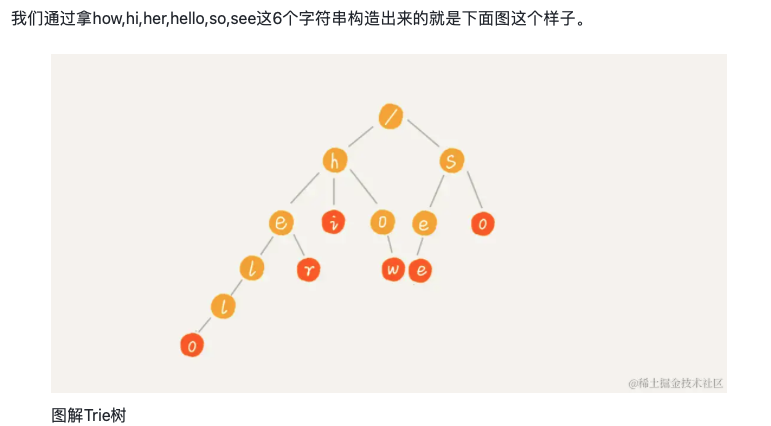

# 1. 算法思想

> - 在[计算机科学](https://link.juejin.cn/?target=https%3A%2F%2Fzh.wikipedia.org%2Fwiki%2F%E8%AE%A1%E7%AE%97%E6%9C%BA%E7%A7%91%E5%AD%A6)中，**trie**，又称**前缀树**或**字典树**，是一种有序[树](https://link.juejin.cn/?target=https%3A%2F%2Fzh.wikipedia.org%2Fwiki%2F%E6%A0%91_(%E6%95%B0%E6%8D%AE%E7%BB%93%E6%9E%84))，用于保存[关联数组](https://link.juejin.cn/?target=https%3A%2F%2Fzh.wikipedia.org%2Fwiki%2F%E5%85%B3%E8%81%94%E6%95%B0%E7%BB%84)，其中的键通常是[字符串](https://link.juejin.cn/?target=https%3A%2F%2Fzh.wikipedia.org%2Fwiki%2F%E5%AD%97%E7%AC%A6%E4%B8%B2)。与[二叉查找树](https://link.juejin.cn/?target=https%3A%2F%2Fzh.wikipedia.org%2Fwiki%2F%E4%BA%8C%E5%8F%89%E6%9F%A5%E6%89%BE%E6%A0%91)不同，键不是直接保存在节点中，而是由节点在树中的位置决定。一个节点的所有子孙都有相同的[前缀](https://link.juejin.cn/?target=https%3A%2F%2Fzh.wikipedia.org%2Fwiki%2F%E5%89%8D%E7%BC%80)，也就是这个节点对应的字符串，而根节点对应[空字符串](https://link.juejin.cn/?target=https%3A%2F%2Fzh.wikipedia.org%2Fwiki%2F%E7%A9%BA%E5%AD%97%E7%AC%A6%E4%B8%B2)。一般情况下，不是所有的节点都有对应的值，只有叶子节点和部分内部节点所对应的键才有相关的值。


# 2. 算法适用场景

> - 可以解决的问题
>
>   > - 需要查询包含某个前缀的单词 / 字符串是否存在
>   > - 字符矩阵中找单词的问题
>

# 3. 算法模版

## 3.1 实现

> 
>
> ```java
> public class Trie {
> 
>     private Node root; // 根节点
> 
>     // 定义前缀树的节点
>     private class Node {
>         private Node[] dict; // 使用数组存储子节点，每个节点代表一个字母
>         private boolean isWord; // 标记当前节点是否为单词的结尾
> 
>         // 构造函数，初始化子节点数组和单词标记
>         public Node() {
>             dict = new Node[26]; // 数组长度为26，对应字母 a-z
>             this.isWord = false;
>         }
>     }
> 
>     /**
>      * 初始化 Trie（前缀树）。
>      */
>     public Trie() {
>         root = new Node(); // 初始化根节点
>     }
> 
>     /**
>      * 插入一个单词到 Trie 中。
>      */
>     public void insert(String word) {
>         int len = word.length(); // 单词长度
>         Node curNode = root; // 从根节点开始
>         for (int i = 0; i < len; i++) {
>             char curChar = word.charAt(i); // 当前字符
>             Node next = curNode.dict[curChar - 'a']; // 根据字符找到对应子节点
>             if (next == null) {
>                 // 如果当前字符对应的子节点不存在，则创建新的节点
>                 curNode.dict[curChar - 'a'] = new Node();
>             }
>             curNode = curNode.dict[curChar - 'a']; // 进入下一个节点
>         }
>         if (!curNode.isWord) {
>             // 如果当前节点之前不是单词结尾，标记为单词结尾
>             curNode.isWord = true;
>         }
>     }
> 
>     /**
>      * 判断单词是否存在于 Trie 中。
>      */
>     public boolean search(String word) {
>         int len = word.length(); // 单词长度
>         Node curNode = root; // 从根节点开始
> 
>         for (int i = 0; i < len; i++) {
>             char curC = word.charAt(i); // 当前字符
>             Node next = curNode.dict[curC - 'a']; // 根据字符找到对应子节点
>             if (next == null) {
>                 // 如果子节点不存在，返回 false
>                 return false;
>             } else {
>                 curNode = next; // 进入下一个节点
>             }
>         }
>         return curNode.isWord; // 判断当前节点是否为单词结尾
>     }
> 
>     /**
>      * 判断是否存在以指定前缀开头的单词。
>      */
>     public boolean startsWith(String prefix) {
>         int len = prefix.length(); // 前缀长度
>         Node curNode = root; // 从根节点开始
>         for (int i = 0; i < len; i++) {
>             char curC = prefix.charAt(i); // 当前字符
>             Node next = curNode.dict[curC - 'a']; // 根据字符找到对应子节点
>             if (next == null) {
>                 // 如果子节点不存在，返回 false
>                 return false;
>             } else {
>                 curNode = next; // 进入下一个节点
>             }
>         }
>         return true; // 如果遍历完整个前缀，返回 true
>     }
> 
>     /**
>      * 判断是否存在匹配正则表达式 `.` 的单词。
>      * '.' 表示可以匹配任何一个字符。
>      */
>     public boolean regExSearch(String word) {
>         return match(word, root, 0); // 调用递归函数进行匹配
>     }
> 
>     private boolean match(String word, Node node, int start) {
>         if (start == word.length()) {
>             return node.isWord; // 如果到达单词末尾，检查是否为单词结尾
>         }
>         char alpha = word.charAt(start);
>         if (alpha == '.') {
>             // 如果当前字符为 '.'，遍历所有可能的子节点
>             for (int i = 0; i < 26; i++) {
>                 if (node.dict[i] != null && match(word, node.dict[i], start + 1)) {
>                     return true;
>                 }
>             }
>             return false; // 如果所有子节点都不匹配，返回 false
>         } else {
>             // 普通字符处理
>             if (node.dict[alpha - 'a'] == null) {
>                 return false; // 如果子节点不存在，返回 false
>             }
>             return match(word, node.dict[alpha - 'a'], start + 1); // 递归匹配下一个字符
>         }
>     }
> 
>     public static void main(String[] args) {
>         Trie trie = new Trie(); // 创建 Trie 对象
>         trie.insert("helloworld"); // 插入单词 "helloworld"
>         trie.insert("bad");        // 插入单词 "bad"
>         trie.insert("dag");        // 插入单词 "dag"
>         trie.insert("mad");        // 插入单词 "mad"
> 
>         // 测试是否存在以 "hello" 开头的单词
>         boolean startsWith = trie.startsWith("hello");
>         System.out.println(startsWith); // 输出 true
> 
>         // 测试是否存在单词 "helloworld"
>         boolean search1 = trie.search("helloworld");
>         System.out.println(search1); // 输出 true
> 
>         // 测试是否存在单词 "hello"
>         boolean search2 = trie.search("hello");
>         System.out.println(search2); // 输出 false
> 
>         // 测试正则表达式匹配
>         boolean search3 = trie.regExSearch(".ad");
>         System.out.println(search3); // 输出 true (匹配 "bad", "mad")
> 
>         boolean search4 = trie.regExSearch("b..");
>         System.out.println(search4); // 输出 true (匹配 "bad")
> 
>         boolean search5 = trie.regExSearch(".elloworl.");
>         System.out.println(search5); // 输出 true (匹配 "helloworld")
>     }
> }
> 
> ```
>

# 4. 时间复杂度

> - 时间复杂度：
>   - 假设所有字符串长度之和为 `n`，构建字典树的时间复杂度为 `O(n)`
>   - 假设要查找的字符串长度为 `k`，查找的时间复杂度为 `O(k)`
> - 空间复杂度：O(N* L) N 是单词书、L 是单词长度