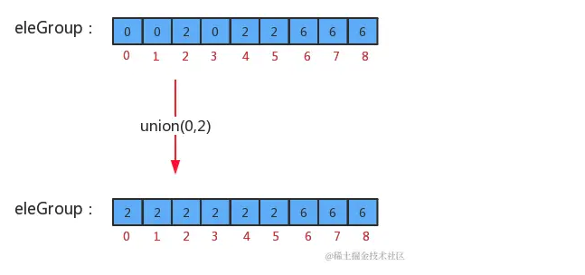
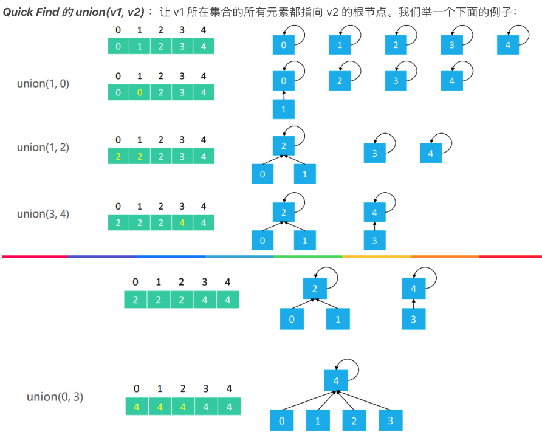

# 1. 算法思想

> - 并查集是一种树型的数据结构 ，并查集可以高效地进行如下操作：
>
>   > - 查询元素p和元素q**是否属于同一组**
>   > - 合并元素p和元素q所在的组
>   >
>   > 
>
>   
>
> - 查集也是一种树型结构，但这棵树跟我们之前讲的二叉树、红黑树、B树等都不一样，这种树的要求比较简单：
>
>   - 每个元素都唯一的对应一个结点；
>   - 每一组数据中的多个元素都在同一颗树中；
>   - 一个组中的数据对应的树和另外一个组中的数据对应的树之间没有任何联系；
>   - 元素在树中并**没有子父级关系**的硬性要求；

# 2 算法适用场景

> - 动态连通性的判断，且不需要给出具体路径。
>- 基础知识：如果数据不是实时变化，本类问题可以用BFS或者DFS的方式遍历，如果数据实时变化（data stream）则并查集每次的时间复杂度可以视为O（1）；需要牢记合并与查找两个操作的模板
> - 如果我们并查集存储的每一个整数表示的是一个大型计算机网络中的计算机，则我们就可以通过`connected(int p, int q)`来检测，该网络中的某两台计算机之间是否连通？如果连通，则他们之间可以通信，如果不连通，则不能通信，此时我们又可以调用`union(int p, int q)`使得p和q之间连通，这样两台计算机之间就可以通信了。
>

# 3. 算法模版

## 3.1 `Quick-Find` 算法

> 1. 设计思路
>
>    > `UnionFindTree(int n)`：初始化并查集，以整数标识(0, n-1)个结点
>    >
>    > `public int count()`：获取当前并查集中的数据有多少个分组
>    >
>    > `public boolean connected(int p, int q)`：判断并查集中元素p和元素q是否在同一分组中
>    >
>    > `public int find(int p)`：元素p所在分组的标识符
>    >
>    > `public void union(int p, int q)`：把p元素所在分组和q元素所在分组合并
>    >
>    > `private int[] eleAndGroup`：记录结点元素和该元素的父结点
>    >
>    > `private int count`：记录并查集中数据的分组个数
>
> 2. 方法实现思路
>
>    > - UnionFind(int n)构造方法实现思路
>    >
>    >   > 1. 初始情况下，每个元素都在一个独立的分组中，所以，初始情况下，并查集中的数据默认分为n个组；
>    >   > 2. 初始化数组`eleAndGroup`；
>    >   > 3. 把`eleAndGroup`数组的**索引看做是每个结点存储的元素**，把`eleAndGroup`数组**每个索引处的值看做是该结点所在的分组**，那么初始化情况下，i索引处存储的值就是i 
>    >   >
>    >   > 
>    >   >
>    >   > 
>    >
>    > - `union(int p, int q)`合并方法实现思路
>    >
>    >   > 1. 如果p和q已经在同一个分组中，则无需合并
>    >   > 2. 如果p和q不在同一个分组，则只需要将p元素所在组的所有的元素的组标识符修改为q元素所在组的标识符即可
>    >   > 3. 分组数量-1
>    >   >
>    >   > 
>    >   >
>    >   > 
>    >
>    > - `find(int p)`返回p在网络中的标识符（值，也就是对应集合）
>    >
>    > - `connected(int p, int q)`判断p 和 q 两个节点是否相连
>
> 3. 代码
>
> ```java
> public class UnionFind {
> 
>     // 记录结点元素和该元素所在分组的标识
>     private final int[] eleAndGroup;
> 
>     //记录并查集中数据的分组个数
>     private int count;
> 
>     public UnionFind(int n) {
>         // 初始化分组的数量，默认情况下，有n个分组
>         count = n;
>         // 初始化eleAndGroup数组
>         eleAndGroup = new int[n];
>         // 初始化eleAndGroup中的元素及其所在的组的标识符，
>       	//让eleAndGroup数组的索引作为并查集的每个节点的元素，
>       	//并且让每个索引处的值就是该索引（该元素所在的组的标识符）
>         for (int i = 0; i < eleAndGroup.length; i++) {
>             eleAndGroup[i] = i;
>         }
>     }
> 
>     // 获取当前并查集中的数据有多少个分组
>     public int count() {
>         return count;
>     }
> 
>     //判断并查集中元素p和元素q是否在同一分组中
>     public boolean connected(int p, int q) {
>         return find(p) == find(q);
>     }
> 
>     //元素p所在分组的标识符
>     public int find(int p) {
>         return eleAndGroup[p];
>     }
> 
>     //把p元素所在分组和q元素所在分组合并
>     public void union(int p, int q) {
>         // 判断p和q是否在同一分组，直接结束方法
>         if (connected(p, q)) {
>             return;
>         }
>         // 找到p所在分组的标识符
>         var pGroup = find(p);
>         // 找到q所在分组的标识符
>         var qGroup = find(q);
>         // 合并组：将p元素所在组的所有的元素的组标识符修改为q元素所在组的标识符
>         for (int i = 0; i < eleAndGroup.length; i++) {
>             if (pGroup == eleAndGroup[i]) {
>                 eleAndGroup[i] = qGroup;
>             }
>         }
>         count--;
>     }
> 
> ```

## 3.2 `Quick-Union`算法

> 一般像计算机这样网络型的数据，我们要求网络中的每两个数据之间都是相连通的，也就是说，我们需要调用很多次`union`方法，使得网络中所有数据相连，其实我们很容易可以得出，如果要让网络中的数据都相连，则我们至少要调用`N-1`次`union`方法才可以，但由于我们的`union`方法中使用for循环遍历了所有的元素，所以很明显，我们之前实现的合并算法的时间复杂度是`O(N^2)`，如果要解决大规模问题，它是不合适的，所以我们需要对算法进行优化.
>
> 1. 为了提升`union`算法的性能，我们需要重新设计`find`方法和`union`方法的实现。此时我们先需要对我们的之前数据结构中的`eleAndGourp`数组的含义进行重新设定：
>
>    > 1. 我们仍然让`eleAndGroup`数组的索引作为某个结点的元素；
>    > 2. `eleAndGroup[i]`的值不再是当前结点所在的分组标识，而是该结点的父结点；
>    >
>    > 
>
> 2. `find(int p)`查询方法实现思路
>
>    > 1. 判断当前元素p的父结点`eleAndGroup[p]`是不是自己，如果是自己则证明已经是根结点了；
>    > 2. 如果当前元素p的父结点不是自己，则让`p = eleAndGroup[p]`，继续找父结点的父结点，直到找到根结点为止；
>    >
>    > 
>
> 3. `union(int p, int q)`合并方法实现
>
>    > 1. 找到p元素所在树的根结点
>    > 2. 找到q元素所在树的根结点
>    > 3. 如果p和q已经在同一个树中，则无需合并；
>    > 4. 如果p和q不在同一个分组，则只需要将p元素所在树根结点的父结点设置为q元素的根结点即可；
>    > 5. 分组数量-1
>    >
>    > 
>    >
>    > 
>
> 4. 代码
>
>    > ```java
>    > public class UnionFindTree {
>    > 
>    >     //记录结点元素和该元素的父结点
>    >     private final int[] eleAndGroup;
>    > 
>    >     // 记录并查集中数据的分组个数
>    >     private int count;
>    > 
>    >     public UnionFindTree(int n) {
>    >         // 初始化分组的数量，默认情况下，有n个分组
>    >         count = n;
>    >         // 初始化eleAndGroup数组
>    >         eleAndGroup = new int[n];
>    >         // 初始化eleAndGroup中的元素及其所在的组的标识符，
>    >         //让eleAndGroup数组的索引作为并查集的每个节点的元素，
>    >         //并且让每个索引处的值就是该索引（该元素所在的组的标识符）
>    >         for (int i = 0; i < eleAndGroup.length; i++) {
>    >             eleAndGroup[i] = i;
>    >         }
>    >     }
>    > 
>    >     // 获取当前并查集中的数据有多少个分组
>    >     public int count() {
>    >         return count;
>    >     }
>    > 
>    >     //判断并查集中元素p和元素q是否在同一分组中
>    >     public boolean connected(int p, int q) {
>    >         return find(p) == find(q);
>    >     }
>    > 
>    >     //元素p所在分组的标识符
>    >     public int find(int p) {
>    >         while (true) {
>    >             if (p == eleAndGroup[p]) {
>    >                 return p;
>    >             }
>    >             p = eleAndGroup[p];
>    >         }
>    >     }
>    > 
>    >     // 把p元素所在分组和q元素所在分组合并
>    >     public void union(int p, int q) {
>    >         // 找到p元素和q元素所在组对应的树的根节点
>    >         int pRoot = find(p);
>    >         int qRoot = find(q);
>    > 
>    >         if (pRoot == qRoot) {
>    >             return;
>    >         }
>    > 
>    >         // 让p所在树的根节点的父节点为q所在树的根节点
>    >         eleAndGroup[pRoot] = qRoot;
>    >         count--;
>    >     }
>    > }
>    > 
>    > ```

## 3.3 `Quick-Union`之基于Size优化

> 我们优化后的算法`union`，如果要把并查集中所有的数据连通，仍然至少要调用`N-1`次`union`方法，但是，我们发现`union`方法中已经没有了`for`循环，所以`union`算法的时间复杂度由`O(N^2)`变为了`O(N)`。但是这个算法仍然有问题，因为我们之前不仅修改了`union`算法，还修改了`find`算法。我们修改前的`find`算法的时间复杂度在任何情况下都为`O(1)`，但修改后的`find`算法在最坏情况下是`O(N)`， 在`union`方法中调用了`find`方法，所以在最坏情况下`union`算法的时间复杂度仍然为`O(N^2)`。
>
> 
>
> `UnionFindTree`中最坏情况下`union`算法的时间复杂度为`O(N^2)`，其最主要的问题在于最坏情况下，树的深度和数组的大小一样，如果我们能够通过一些算法让合并时，**生成的树的深度尽可能的小**，就可以优化`find`方法。
>
> 之前我们在`union`算法中，合并树的时候将任意的一棵树连接到了另外一棵树，这种合并方法是比较暴力的，**如果我们把并查集中每一棵树的大小记录下来，然后在每次合并树的时候，把较小的树连接到较大的树上，就可以减小树的深度**。
>
> 
>
> 
>
> 只要我们保证每次合并，都能把小树合并到大树上，就能够压缩合并后新树的路径，这样就能提高`find`方法的效率。
>
> 为了完成这个需求，我们**需要另外一个数组来记录存储每个根结点对应的树中元素的个数，并且需要一些代码调整数组中的值**。
>
> ```java
> public class UnionFindTreeWeighted {
> 
>     //记录结点元素和该元素的父结点
>     private final int[] eleAndGroup;
> 
>     //存储每个根结点对应的树中元素的个数
>     private final int[] sz;
> 
>     // 记录并查集中数据的分组个数
>     private int count;
> 
>     public UnionFindTreeWeighted(int n) {
>         // 初始化分组的数量，默认情况下，有n个分组
>         this.count = n;
>         // 初始化eleAndGroup数组
>         this.eleAndGroup = new int[n];
>         // 初始化eleAndGroup中的元素及其所在的组的标识符，
>       	//让eleAndGroup数组的索引作为并查集的每个节点的元素，
>       	//并且让每个索引处的值就是该索引（该元素所在的组的标识符）
>         for (int i = 0; i < eleAndGroup.length; i++) {
>             this.eleAndGroup[i] = i;
>         }
> 
>         this.sz = new int[n];
>         Arrays.fill(this.sz, 1);
>     }
> 
>     // 获取当前并查集中的数据有多少个分组
>     public int count() {
>         return count;
>     }
> 
>     //判断并查集中元素p和元素q是否在同一分组中
>     public boolean connected(int p, int q) {
>         return find(p) == find(q);
>     }
> 
>     // 元素p所在分组的标识符
>     public int find(int p) {
>         while (true) {
>             if (p == eleAndGroup[p]) {
>                 return p;
>             }
> 
>             p = eleAndGroup[p];
>         }
>     }
> 
>     /**
>      * 把p元素所在分组和q元素所在分组合并
>      */
>     public void union(int p, int q) {
>         // 找到p元素和q元素所在组对应的树的根节点
>         int pRoot = find(p);
>         int qRoot = find(q);
> 
>         if (pRoot == qRoot) {
>             return;
>         }
> 
>         // 判断pRoot对应的树大，还是qRoot对应的树大，最终需要吧较小的树合并到较大的树中
>         if (sz[pRoot] < sz[qRoot]) {
>             eleAndGroup[pRoot] = qRoot;
>             sz[qRoot] += sz[pRoot];
>         } else {
>             eleAndGroup[qRoot] = pRoot;
>             sz[pRoot] += sz[qRoot];
>         }
>         count--;
>     }
> }
> ```

## 3.4 `Quick-Union`之基于rank优化

> 合并后集合层数唯一会变的情况，就是**两个集合的层数一模一样时**。假设两个集合都只有一个元素，那么这两个集合的层数都为一层，层数相同时，此时谁的根节点的父亲节点指向另一个根节点都无所谓了，但是这样合并后的集合层数要比原来多了一层，其中rank可以理解为树高。
>
> 
>
> `````java
> public class UnionFindTreeWeighted {
> 
>     //记录结点元素和该元素的父结点
>     private final int[] eleAndGroup;
> 
>     //存储每个根结点对应的树中元素的个数
>     private final int[] ranks;
> 
>     // 记录并查集中数据的分组个数
>     private int count;
> 
>     public UnionFindTreeWeighted(int n) {
>         // 初始化分组的数量，默认情况下，有n个分组
>         this.count = n;
>         // 初始化eleAndGroup数组
>         this.eleAndGroup = new int[n];
>         // 初始化eleAndGroup中的元素及其所在的组的标识符，
>       	//让eleAndGroup数组的索引作为并查集的每个节点的元素，
>       	//并且让每个索引处的值就是该索引（该元素所在的组的标识符）
>         for (int i = 0; i < eleAndGroup.length; i++) {
>             this.eleAndGroup[i] = i;
>         }
> 
>         this.sz = new int[n];
>         Arrays.fill(this.ranks, 1);
>     }
> 
>     // 获取当前并查集中的数据有多少个分组
>     public int count() {
>         return count;
>     }
> 
>     //判断并查集中元素p和元素q是否在同一分组中
>     public boolean connected(int p, int q) {
>         return find(p) == find(q);
>     }
> 
>     // 元素p所在分组的标识符
>     public int find(int p) {
>         while (true) {
>             if (p == eleAndGroup[p]) {
>                 return p;
>             }
> 
>             p = eleAndGroup[p];
>         }
>     }
> 
>     /**
>      * 把p元素所在分组和q元素所在分组合并
>      */
>     public void union(int p, int q) {
>         // 找到p元素和q元素所在组对应的树的根节点
>         int pRoot = find(p);
>         int qRoot = find(q);
> 
>         if (pRoot == qRoot) {
>             return;
>         }
> 
>         // 判断pRoot对应的树高，还是qRoot对应的树高，最终需要吧矮的树合并到高的的树中
>         if (ranks[pRoot] < ranks[qRoot]) {
>             eleAndGroup[pRoot] = qRoot;
>         else if (ranks[pRoot] > ranks[qRoot]){
>              eleAndGroup[qRoot] = pRoot;  
>         
>         } else {
>             eleAndGroup[pRoot] = qRoot;
>             rank[pRoot] += 1;
>         }
>     }
> }
> `````
>
> 

# 4. 算法复杂度

> - 时间复杂度
>
>   > 
>
> - 空间复杂度: O(N)

