# 1. 2023-20-01
> 收到bbg offer好几周了，在此回馈地里。

时间线记不太清了，大体如下：
1. 九月中旬通过学校cf投递了简历（楼主在九月初也用另外的邮箱海投了简历）

2. 九月下旬收到recruiter邮件，说简历正在under consideration。等了几天没消息，楼主便email recruiter询问。于是马上收到第一轮phone invite，时间在10月初。

3. Phone (10月初)： 一个小时phone，一个在bbg工作了很多年的天竺面试官。面试官不苟言笑，让我一度以为凶多吉少。参考地里的经验，大概简单问了自己的兴趣以外就开始做题。第一题应该属于easy-medium，给定起点和终点，找到有向图上的所有路径。后来还有个follow-up，但是当时时间还剩半小时，楼主只是口述了思路，并没有写。后面半个小时是刷题网 药耳陆的变体, 是我见过最长的hard题。幸好楼主半个月前做过，基本做到了bug free做出来了。最后基本没时间了，简单问了一个问题就匆匆结束了。面试完成后楼主并无把我，尤其是第一个题目的follow-up只是说了下。bbg效率很高，第二天上午马上收到预约下一轮，email告知要预留3-4个小时。

4. VO(十月底)：
   广告

4.1 (VO1):  两个年轻面试官。也是简单问了下why bbg和challenging project，马上进入coding。第一个题是 伞久撕， 第二题是 沏久。这一轮比较容易，基本做好clarification，确认一些条件， 然后讲思路，跑case就行了。这一轮比较快，提前了5分钟结束大概。然后primary interviewer当场告知一个小时后下一轮。
4.2 (VO2): 一个资深的白人大叔，一个不修边幅的小哥。这一轮的两个题目都不在刷题网上。第一轮小哥的题目是他自创的，只要把题目理解清楚了大概是easy。第二轮大叔的题是gas station那个的变体，也是楼主整个面试不确定的题目，一开始遇到些困难，后来在大叔的提示下换了种方法草草结束。最后大叔也告知楼主半小时后hr面。
4.3 (HR): 此轮只有半小时，都是简单的bq和一些假设性问题，没有遇到需要STAR回答的。面试结束的时候，反问hr啥时候知道结果。hr说会安排final EM面。

5. Final (十一月初)
   EM final: 白人大叔，之前在其他金融公司也干过。基本就是各种常见bq，还有围绕实习的问题展开。最后20分钟反问了三个问题结束。

被ghost了大概快一个月，后面忍不住email最初的recruiter问了下，被告知另一个recruiter会联系我offer call。

虽然拿了offer，但是综合各方面信息看，开花堡的面试和offer很玄学。很多简历很强的朋友被简历挂或者vo挂，也不乏很多人final挂。所以可能运气成分还是最大吧。

# 2  2023-10 Senior Software Engineer - Market Oversight
> 背景： 博士毕业5年 5年计算机视觉相关工作经验

职位： Senior Software Engineer - Market Oversight
流程： 09.11网上海投 -》16.11 hr面试 -》08.12 视频面试 （面完觉得不挂不科学）

面试经历：
1. 聊项目： 额 只有机器学习相关项目 感觉跟面试官是鸡同鸭讲
   广告

2. 写代码： 题目： 设计一个sequecer类 输入id和content， 按照id顺序输出， 假设id不连续就暂时缓存， Example： [1, "aaa"], [2, "bbb"] [4, "ddd"], [3, "ccc"] etc，
   输出  aaa
   bbb
   ccc ddd
   代码其实很简单 中间穿插问了unordered_map, map, stack的插入查找复杂度。
   followup Q： 如果missing id一直不出现该怎么办？（buffer size, timeout, curr_id - missing_id > some_threshold， etc）

人生中第一次面developer的职位 一点经验没有，重在参与
面试最后对着小姐姐一顿彩虹屁：你是老夫面试多年遇到的最好的面试官 整个面试流程是最smooth的一次 感谢你非常有用的建议 祝你有个愉快的周末

# 3  2023-12 开花堡 bquant quant dev 一面
> 刚面了一轮，收到了virtualonsite 的邀请。攒个人品分享一下面试经历，面试官迟到了一会，但是整体面试都比较和谐，很多时间抠简历的细节，最后问了幺林额酒，改了提下场景但基本一样。

# 4 2023-12-07
> 新鲜出炉，刷题网幺珥遛。面试体验一般，白人大哥除了开始介绍业务之外就没说什么话，除了回答我的问题，非必要不开口，中途还离开了一会。

# 5  2023-12-07 bloomberg phone screen
> 算pascal三角形的的第n行第k列的值。就是(n k) ，但是不让用这个解法。面的一般，等跪

# 6  2023-11-16 Bloomberg 11月SWE实习面经
> 第一轮30分钟BQ面试，照着简历一个个问，做了什么经验，为什么选Bloomberg
第二轮Technical Interview, 面试题目leetcode其中一题，还详细地问了project做了什么，有什么challenge
> 79. Word Search, 有一个board有所有字母，找出单词是否能在board里面连出来
    然后我就被拒绝了，加油吧，小伙伴们
# 7  2023-11-16 BQL组
> coding 1: 打印最深层次括号里的字符串。 没见过。
> 
>  
> 
>我的思路是找到最深层次的括号，然后标记下位置。然后再倒序查找，找到字符串。
>明显不是他想要的。不过也写了。
>然后说太麻烦，要求只loop一遍。
>Coding 2: 三八零
> 
> 
> 
> follow up: 三八一。
我觉得这货绝对有大病。我用的就是经典的map<String, List<Integer>> 结构。他不满意，说这样不行。不能达到O(1). 然后我说我们可以用PriorityQueue.
还是不满意。说是要存一个index 然后每次能很精准的找到位置，就达到O(1)
问题是你找到index 删除index 的值不占时间的呀。神经病嘛。 这是给的解，自己看吧。
明显感觉就是他从知道我不会BQL 就不想让我过。然后各种找茬。
尼码 又不是我要去的。 猎头推的。 关键是description里没写必须要会呀。 只说了有java, python这种经典语言的经验。

# 8
> 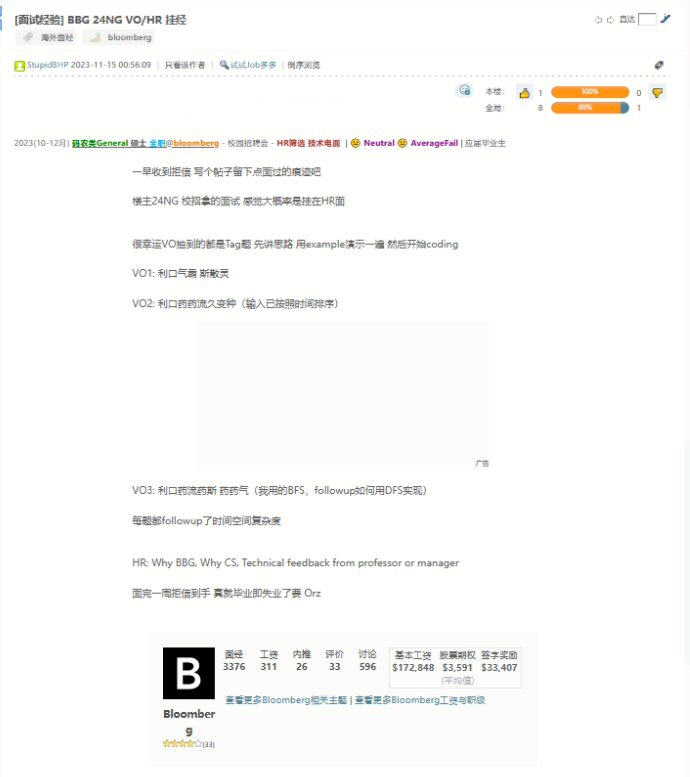

# 9
> 

# 10
> 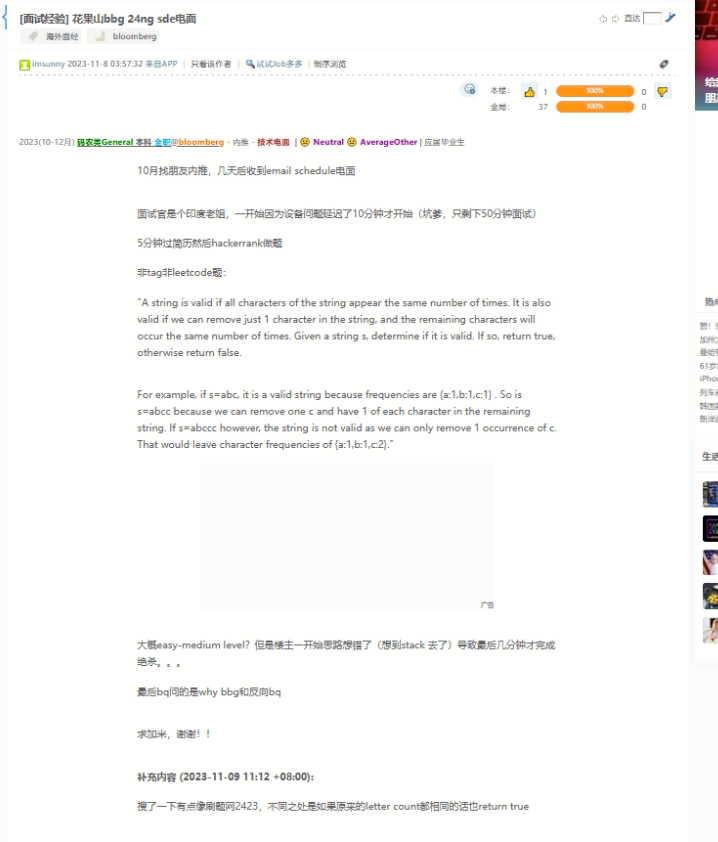

# 11
> 

# 12
> 

# 13
> 
> sweep line

# 14
> 

# 15
> 

# 16
> 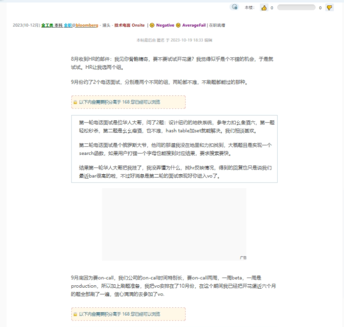
> 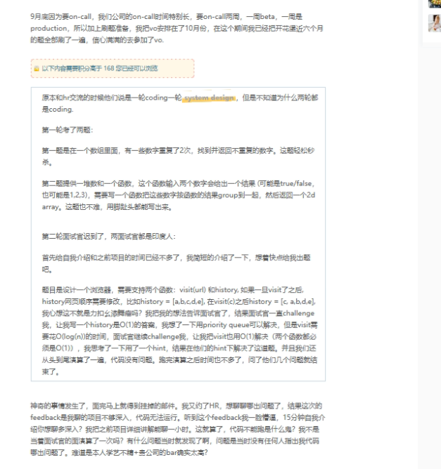

# 17
> 

# 18
> 

# 19
> 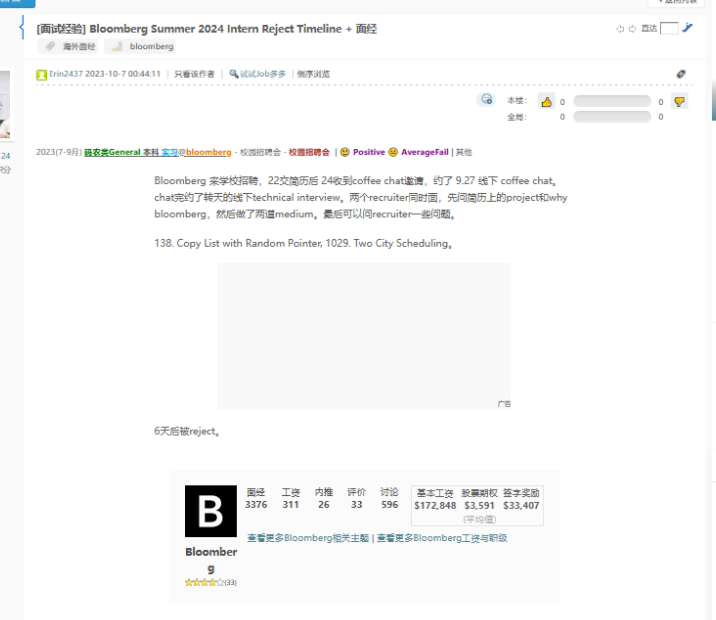

# 20
> 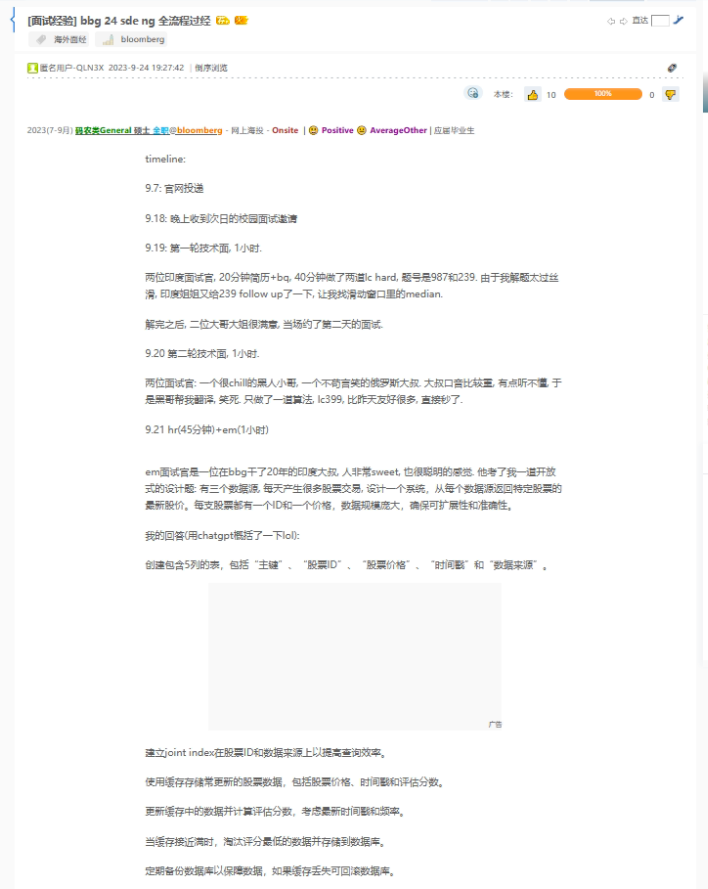
> 

# 21
> 

# 22
> 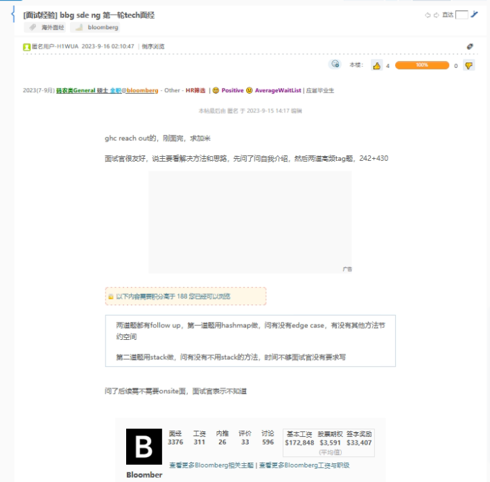
> 
> Leetcode 253

# 23
> 
> 

# 24
> 
> 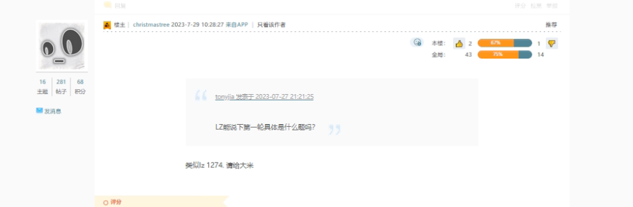

# 25
> 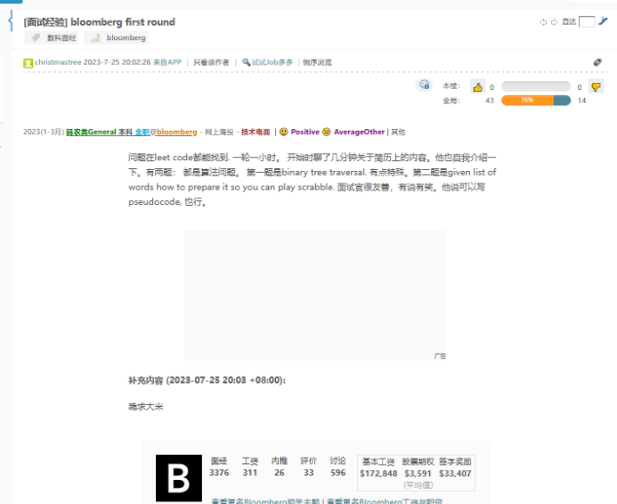

# 26
> 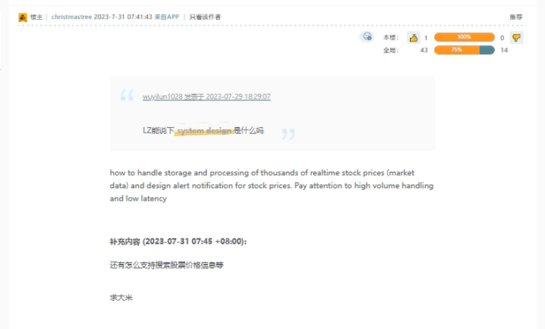
> 

# 27
> 

# 28
> 

# 29
> 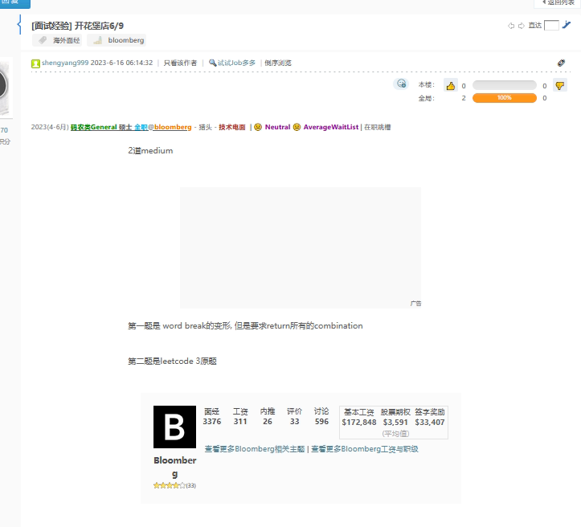

# 30
> 
> lc739?

# 31
> 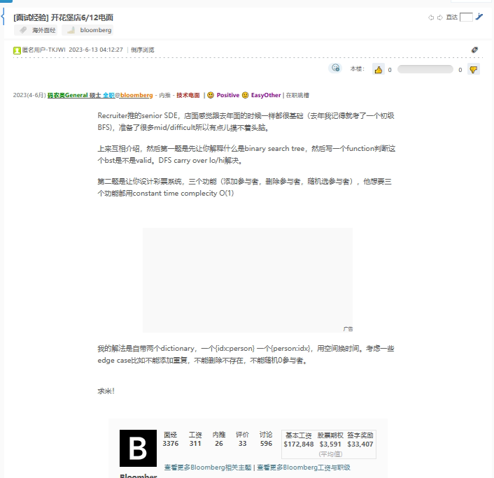

# 32
> 
>  
>  world break II

# 33
> 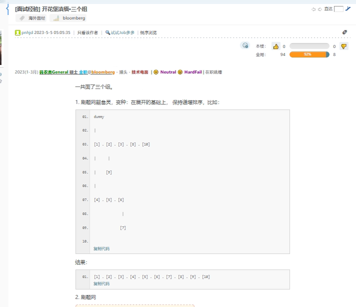
> 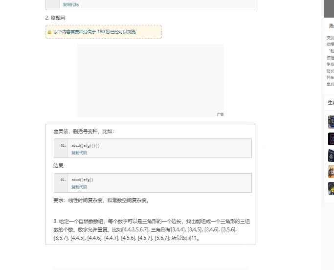
> 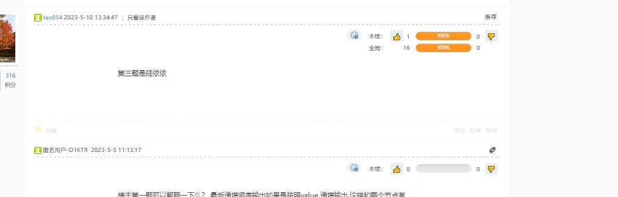

# 34
> 

# 35
> 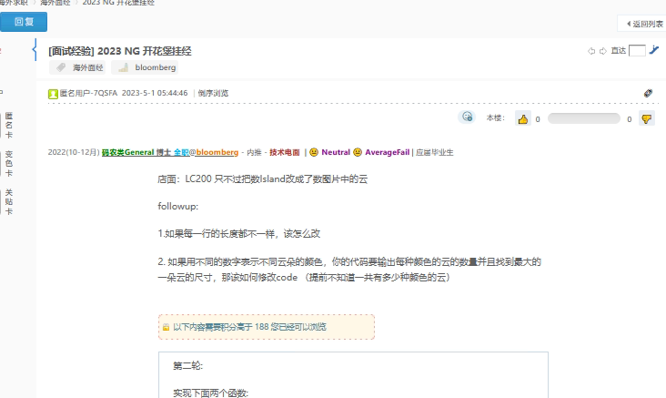
> 

# 36
> 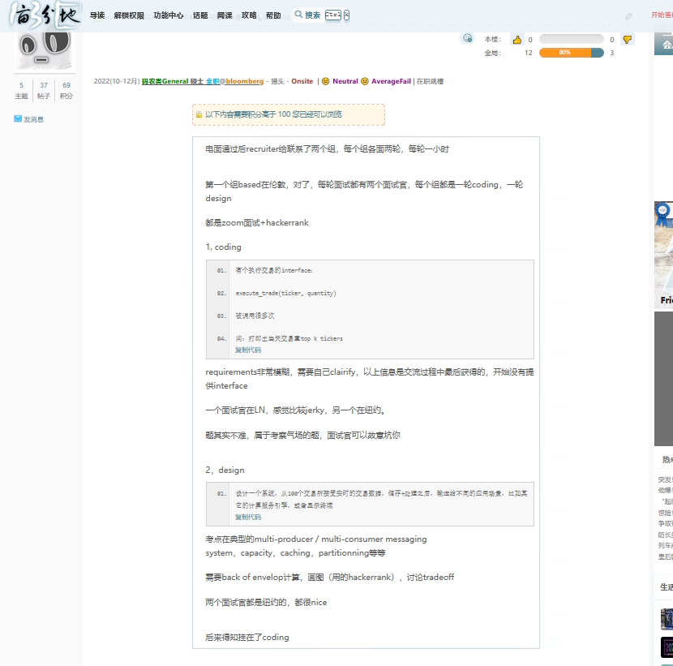
> 

# 37
> 

# 38
> 

# 39
> 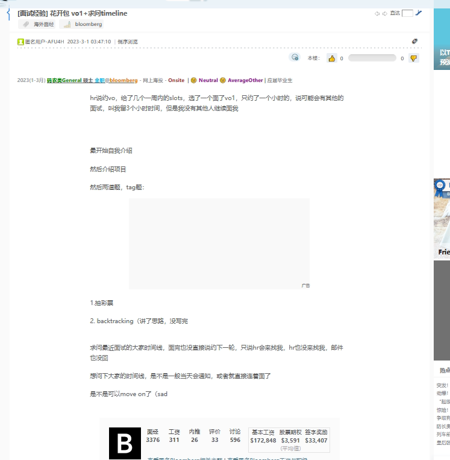
> 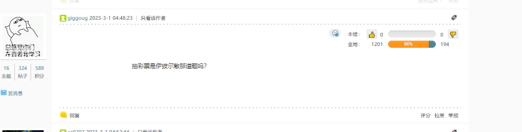

# 40
> 

# 41
> 
> 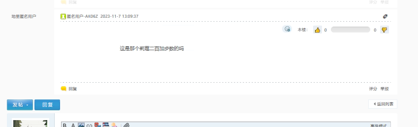

# 42
> 

# 43
> 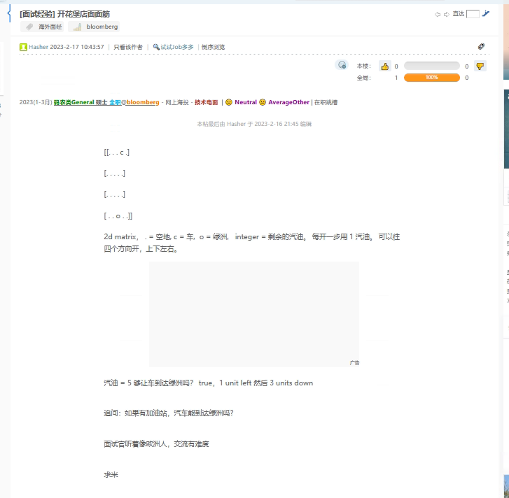

# 44
> 

# 45
> 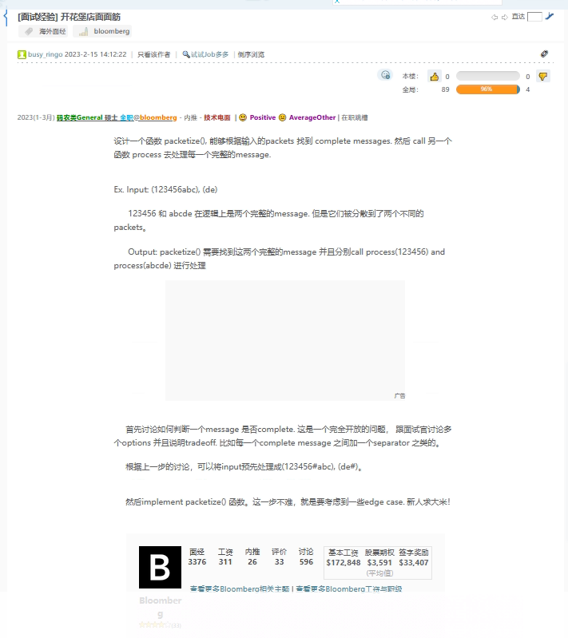

# 46
> LC 146

# 47
> 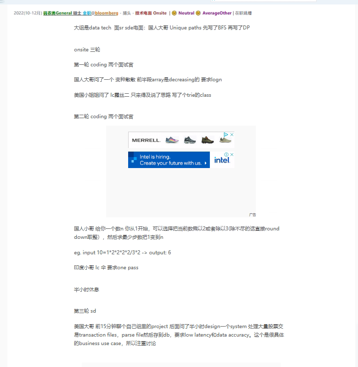

# 48
> 
> 

# 49
> 

# 50
> 

# 51
> 

# 52
> 

# 53
> 