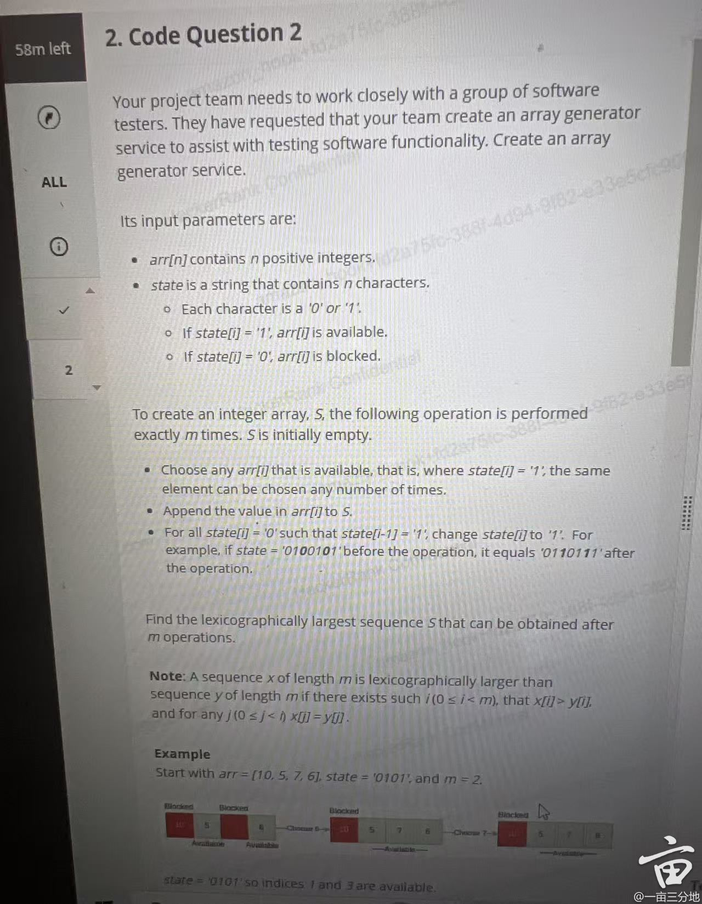

#### 1. Amazon financial optimization tool manage coins


```java
/**
 * 题目描述：
 * 在 Amazon 的财务优化工具中，用户管理一系列不同面额的硬币。该过程涉及系统地交换硬币以减少总数。
 * 具体规则如下：
 * 1. 计算每种面额的硬币数量，并写入列表。
 * 2. 从列表中移除数量少于 2 的面额。
 * 3. 如果列表非空，找到最小的面额 x。
 * 4. 在数组中找到面额为 x 的最左两个硬币，它们的位置分别是 i 和 j（基于 1 的索引）。
 * 5. 用一个新的面额 y = 2 * x 取代这两个硬币，并放置在 j 的位置（基于 1 的索引）。
 * 6. 重复上述步骤直到所有面额的硬币都少于 2。
 * 
 * 目标：
 * 给定一个 1-based 数组 coins[]，表示每个硬币的面额，求最终的硬币序列。
 */
/**
 * 详细解题思路（每一步举例解释）
 * 1. 统计硬币的面额数量
 *    例如，输入 `[3, 4, 1, 2, 2, 1, 1]`（1-based 索引），统计得：
 *    ```
 *    1: [3, 6, 7] (基于 1 的索引)
 *    2: [4, 5]
 *    3: [1]
 *    4: [2]
 *    ```
 *    其中 `1` 出现了 3 次，`2` 出现了 2 次，`3` 和 `4` 只出现了一次。
 * 
 * 2. 移除数量少于 2 的面额
 *    `3` 和 `4` 只出现了一次，移除它们后，我们得到：
 *    ```
 *    1: [3, 6, 7]
 *    2: [4, 5]
 *    ```
 *    最小的面额是 `1`。
 * 
 * 3. 合并两个最小的面额
 *    选择 `1`，它的索引是 `[3, 6, 7]`，选择最左边的两个索引 `3` 和 `6`。
 *    计算 `y = 2 * 1 = 2`，替换索引 `6` 的 `1`，删除索引 `3` 的 `1`，新的数组为：
 *    ```
 *    [3, 4, 2, 2, 2, 1]
 *    ```
 * 
 * 4. 重复合并
 *    统计频率：
 *    ```
 *    1: [6]
 *    2: [3, 4, 5]
 *    3: [1]
 *    4: [2]
 *    ```
 *    选择最小面额 `2`，合并索引 `[3, 4]` 的 `2`，新的数组为：
 *    ```
 *    [3, 4, 4, 2, 1]
 *    ```
 *    统计频率：
 *    ```
 *    1: [5]
 *    2: [4]
 *    3: [1]
 *    4: [2, 3]
 *    ```
 *    选择 `4`，合并索引 `[2, 3]`，新的数组：
 *    ```
 *    [3, 8, 2, 1]
 *    ```
 *    终止循环，因为所有面额的硬币都少于 2。
 */

/**
 * 时间和空间复杂度分析
 * 1. 时间复杂度
 *    - 每次合并都会减少一个硬币，总共 `n` 个硬币，因此最多执行 `O(n)` 次合并操作。
 *    - 每次合并需要计算频率，使用 `TreeMap` 存储面额，插入/删除操作为 `O(log n)`，所以总复杂度：
 *      ```
 *      O(n log n)
 *      ```
 * 
 * 2. 空间复杂度
 *    - 需要额外的 `TreeMap` 和 `ArrayList` 来存储面额和索引，最坏情况下需要 `O(n)` 的空间。
 *      ```
 *      O(n)
 *      ```
 */
import java.util.*;

public class AmazonCoinOptimization {
   

    public static List<Integer> optimizeCoins(int[] coins) {
        List<Integer> coinList = new ArrayList<>();
        for (int coin : coins) {
            coinList.add(coin);
        }

        while (true) {
            // 1. 计算每种面额的数量
            Map<Integer, List<Integer>> positionMap = new TreeMap<>();
            for (int i = 0; i < coinList.size(); i++) {
                positionMap.computeIfAbsent(coinList.get(i), k -> new ArrayList<>()).add(i + 1); // 1-based index
            }

            // 2. 过滤掉数量少于 2 的面额
            int minValue = -1;
            for (Map.Entry<Integer, List<Integer>> entry : positionMap.entrySet()) {
                if (entry.getValue().size() >= 2) {
                    minValue = entry.getKey();
                    break;
                }
            }

            // 如果没有符合条件的面额，停止
            if (minValue == -1) break;

            // 3. 选择最左边的两个相同面额的位置
            List<Integer> positions = positionMap.get(minValue);
            int firstIndex = positions.get(0) - 1; // 转换回 0-based 索引
            int secondIndex = positions.get(1) - 1;

            // 4. 计算新的面额 y = 2 * x
            int newValue = 2 * minValue;

            // 5. 删除这两个硬币，并在 secondIndex 位置放入新硬币
            coinList.remove(firstIndex); // 先移除前面的元素
            coinList.remove(secondIndex - 1); // 由于前一个元素删除，索引要向前偏移
            coinList.add(secondIndex - 1, newValue); // 在 secondIndex-1 位置插入新硬币
        }

        return coinList;
    }

    public static void main(String[] args) {
        

        int[] coins = {3, 4, 1, 2, 2, 1, 1}; // 1-based index
        List<Integer> result = optimizeCoins(coins);
        System.out.println("最终硬币序列：" + result); // 预期输出：[3, 8, 2, 1]
      
    }
}

```

#### 2. project team works with software test



#### 3. first unique character

给定一个只包含小写英文字母的字符串，返回第一个唯一字符的索引，使用1-based索引。
例如：s = "statistics" 唯一字符是  a 和 c，其中 a 最先出现，按照1-based索引，它位于第3个位置。

#### 4. find overlap time

第二题：
给定一组时间区间 [start, end]，合并并返回所有重叠的区间，结果需按照起始时间升序排序。
例如：intervals = [[7, 7], [2, 3], [6, 11], [1, 2]] 答案为：[[1, 3], [6, 11]]

#### 5. amazon SQS optimize the message queue


