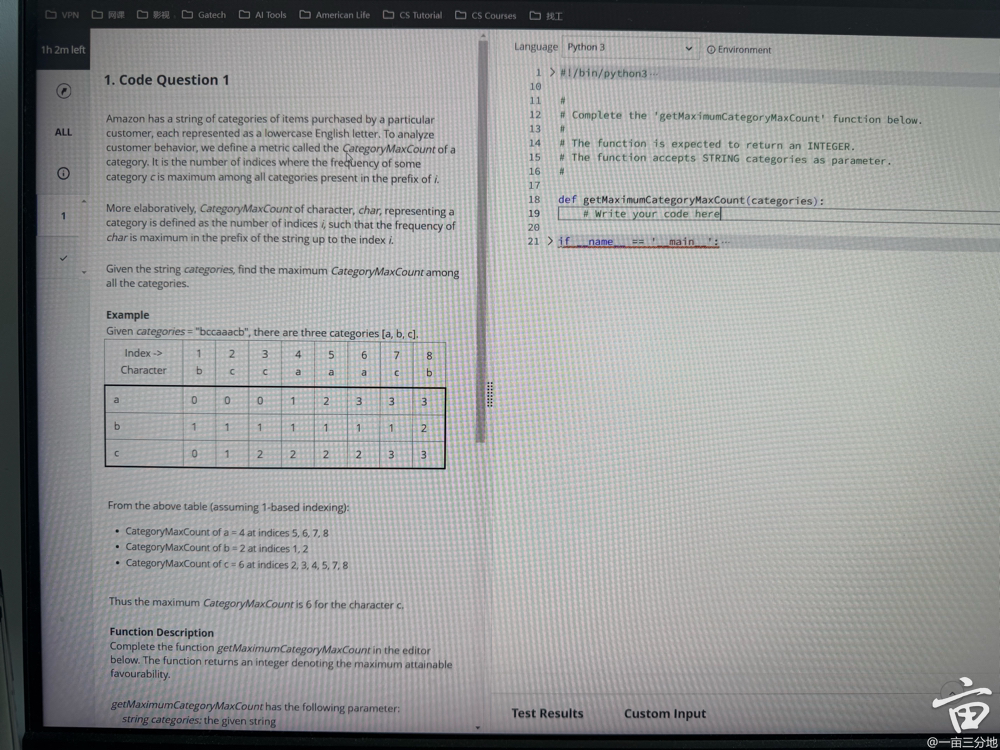
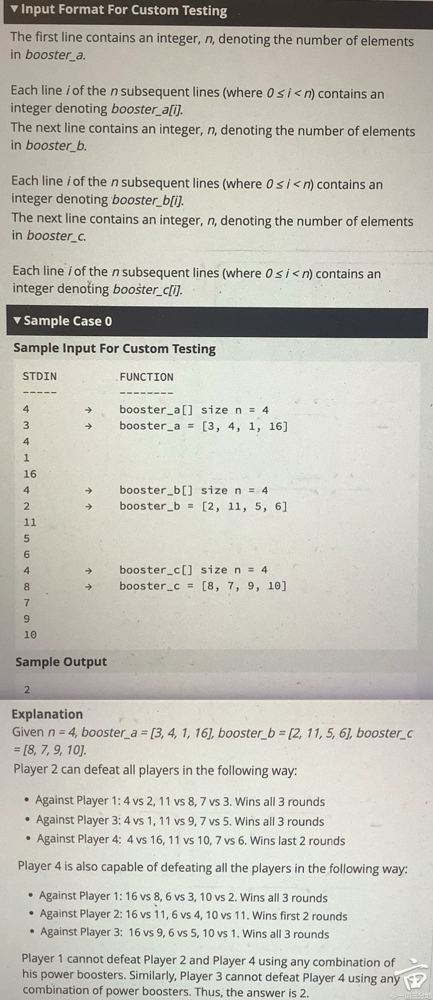
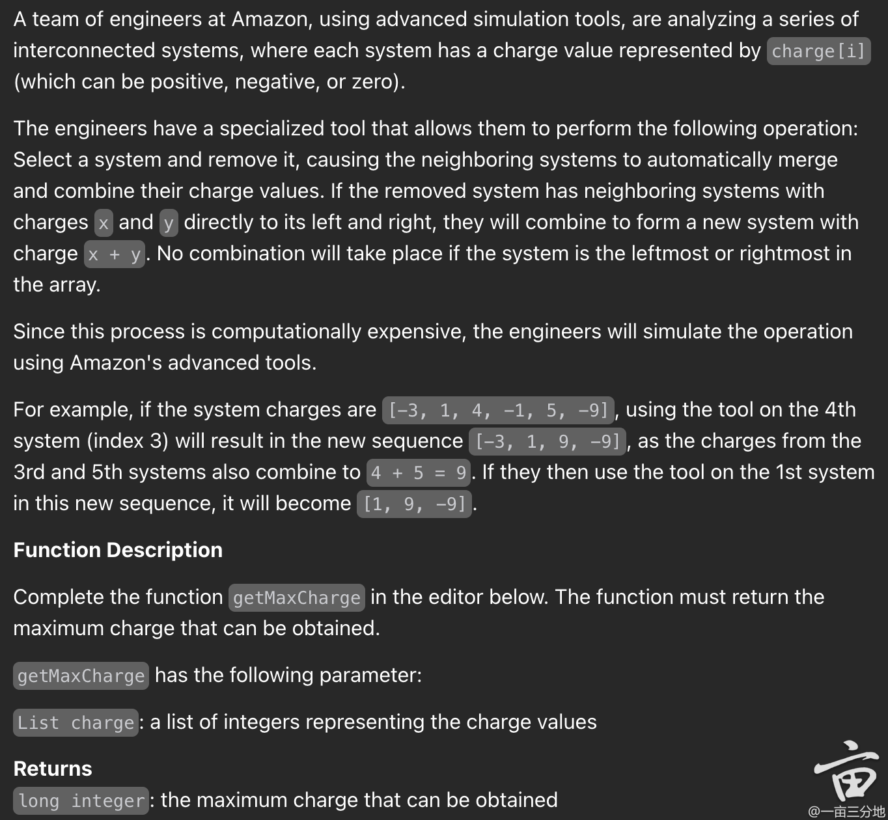
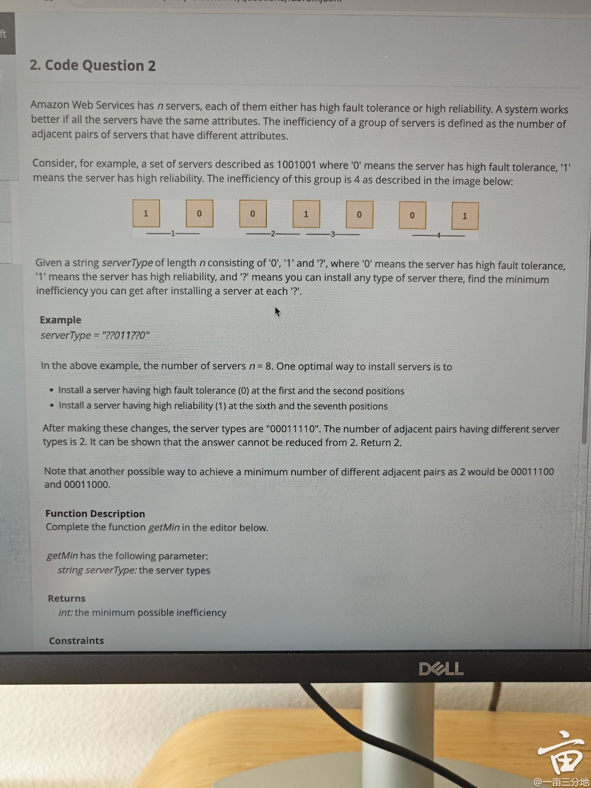
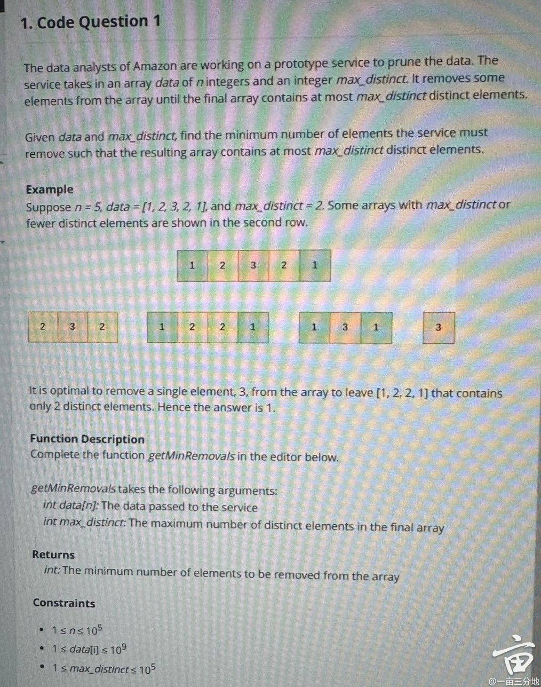
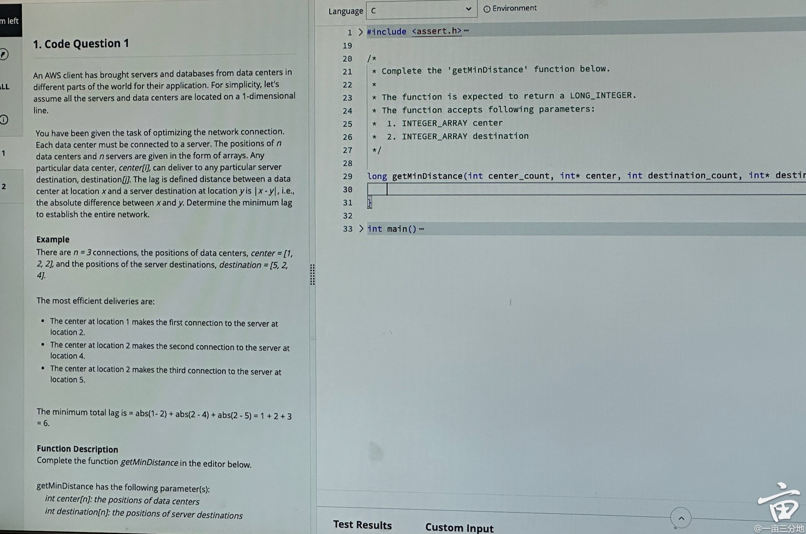
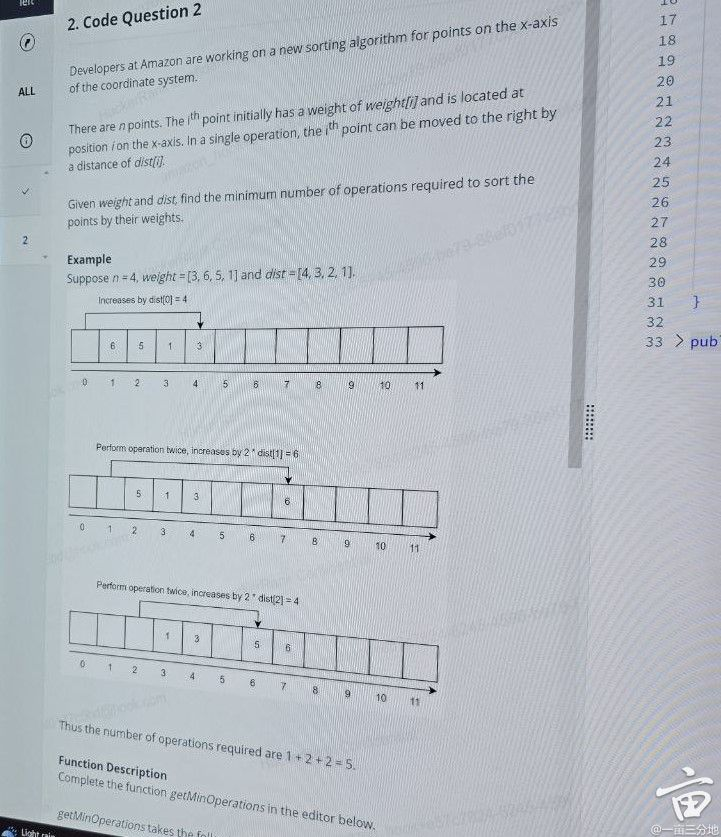
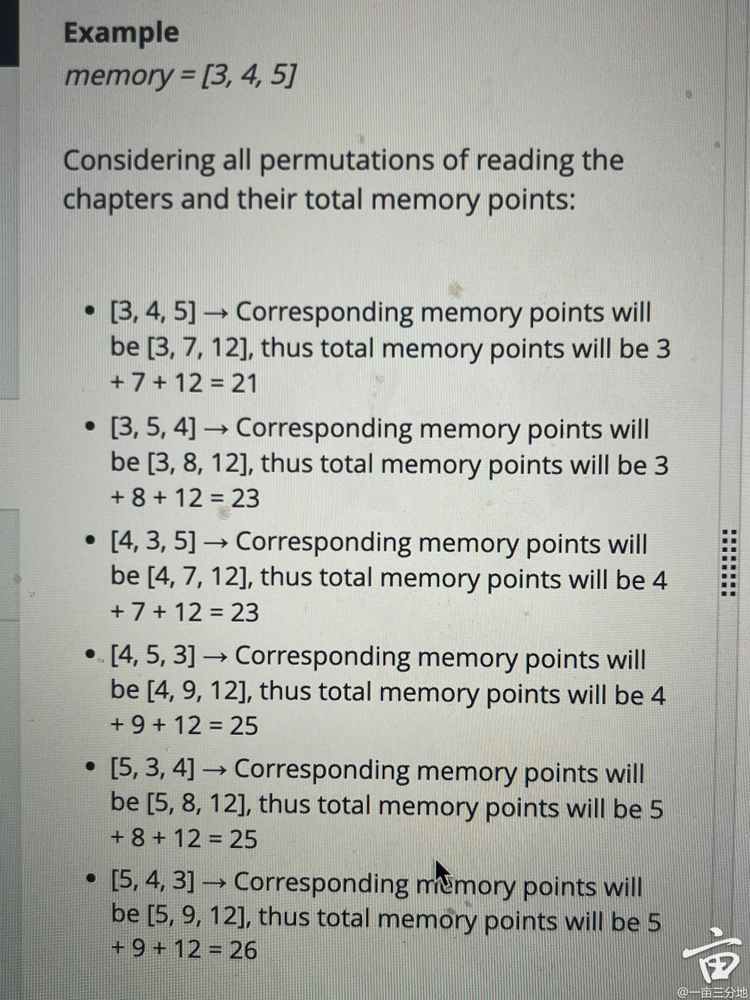
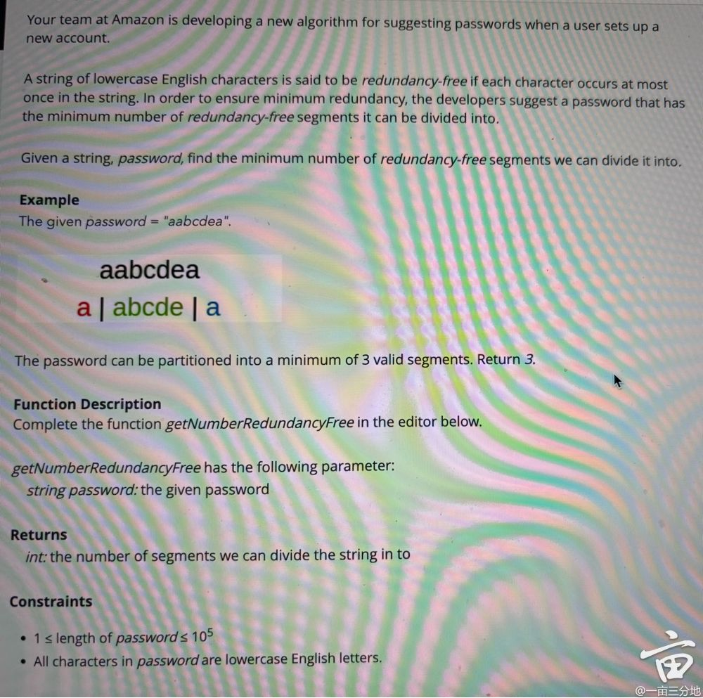
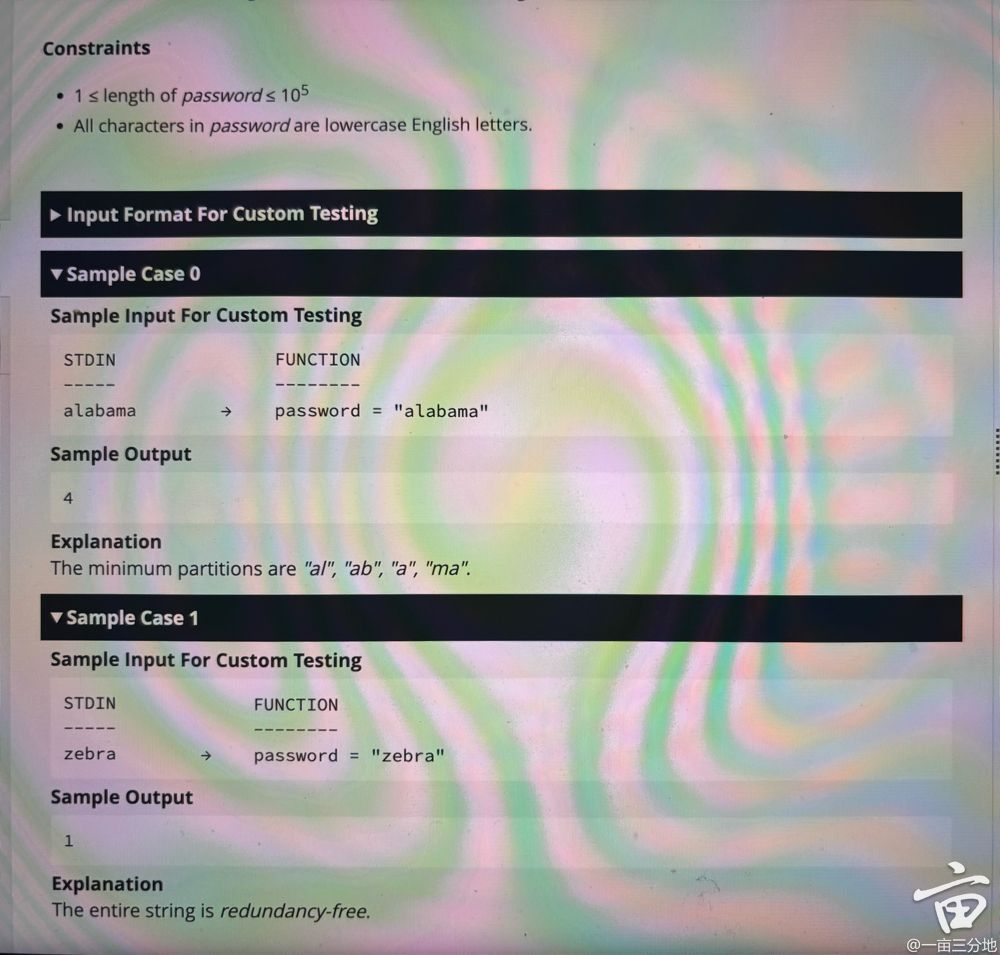

#### 1. getFinalValue


```java
/**
 * 题目描述：
 * 在 Amazon 的财务优化工具中，用户管理一系列不同面额的硬币。该过程涉及系统地交换硬币以减少总数。
 * 具体规则如下：
 * 1. 计算每种面额的硬币数量，并写入列表。
 * 2. 从列表中移除数量少于 2 的面额。
 * 3. 如果列表非空，找到最小的面额 x。
 * 4. 在数组中找到面额为 x 的最左两个硬币，它们的位置分别是 i 和 j（基于 1 的索引）。
 * 5. 用一个新的面额 y = 2 * x 取代这两个硬币，并放置在 j 的位置（基于 1 的索引）。
 * 6. 重复上述步骤直到所有面额的硬币都少于 2。
 * 
 * 目标：
 * 给定一个 1-based 数组 coins[]，表示每个硬币的面额，求最终的硬币序列。
 */
/**
 * 详细解题思路（每一步举例解释）
 * 1. 统计硬币的面额数量
 *    例如，输入 `[3, 4, 1, 2, 2, 1, 1]`（1-based 索引），统计得：
 *    ```
 *    1: [3, 6, 7] (基于 1 的索引)
 *    2: [4, 5]
 *    3: [1]
 *    4: [2]
 *    ```
 *    其中 `1` 出现了 3 次，`2` 出现了 2 次，`3` 和 `4` 只出现了一次。
 * 
 * 2. 移除数量少于 2 的面额
 *    `3` 和 `4` 只出现了一次，移除它们后，我们得到：
 *    ```
 *    1: [3, 6, 7]
 *    2: [4, 5]
 *    ```
 *    最小的面额是 `1`。
 * 
 * 3. 合并两个最小的面额
 *    选择 `1`，它的索引是 `[3, 6, 7]`，选择最左边的两个索引 `3` 和 `6`。
 *    计算 `y = 2 * 1 = 2`，替换索引 `6` 的 `1`，删除索引 `3` 的 `1`，新的数组为：
 *    ```
 *    [3, 4, 2, 2, 2, 1]
 *    ```
 * 
 * 4. 重复合并
 *    统计频率：
 *    ```
 *    1: [6]
 *    2: [3, 4, 5]
 *    3: [1]
 *    4: [2]
 *    ```
 *    选择最小面额 `2`，合并索引 `[3, 4]` 的 `2`，新的数组为：
 *    ```
 *    [3, 4, 4, 2, 1]
 *    ```
 *    统计频率：
 *    ```
 *    1: [5]
 *    2: [4]
 *    3: [1]
 *    4: [2, 3]
 *    ```
 *    选择 `4`，合并索引 `[2, 3]`，新的数组：
 *    ```
 *    [3, 8, 2, 1]
 *    ```
 *    终止循环，因为所有面额的硬币都少于 2。
 */

/**
 * 时间和空间复杂度分析
 * 1. 时间复杂度
 *    - 每次合并都会减少一个硬币，总共 `n` 个硬币，因此最多执行 `O(n)` 次合并操作。
 *    - 每次合并需要计算频率，使用 `TreeMap` 存储面额，插入/删除操作为 `O(log n)`，所以总复杂度：
 *      ```
 *      O(n log n)
 *      ```
 * 
 * 2. 空间复杂度
 *    - 需要额外的 `TreeMap` 和 `ArrayList` 来存储面额和索引，最坏情况下需要 `O(n)` 的空间。
 *      ```
 *      O(n)
 *      ```
 */
import java.util.*;

public class AmazonCoinOptimization {
   

    public static List<Integer> optimizeCoins(int[] coins) {
        List<Integer> coinList = new ArrayList<>();
        for (int coin : coins) {
            coinList.add(coin);
        }

        while (true) {
            // 1. 计算每种面额的数量
            Map<Integer, List<Integer>> positionMap = new TreeMap<>();
            for (int i = 0; i < coinList.size(); i++) {
                positionMap.computeIfAbsent(coinList.get(i), k -> new ArrayList<>()).add(i + 1); // 1-based index
            }

            // 2. 过滤掉数量少于 2 的面额
            int minValue = -1;
            for (Map.Entry<Integer, List<Integer>> entry : positionMap.entrySet()) {
                if (entry.getValue().size() >= 2) {
                    minValue = entry.getKey();
                    break;
                }
            }

            // 如果没有符合条件的面额，停止
            if (minValue == -1) break;

            // 3. 选择最左边的两个相同面额的位置
            List<Integer> positions = positionMap.get(minValue);
            int firstIndex = positions.get(0) - 1; // 转换回 0-based 索引
            int secondIndex = positions.get(1) - 1;

            // 4. 计算新的面额 y = 2 * x
            int newValue = 2 * minValue;

            // 5. 删除这两个硬币，并在 secondIndex 位置放入新硬币
            coinList.remove(firstIndex); // 先移除前面的元素
            coinList.remove(secondIndex - 1); // 由于前一个元素删除，索引要向前偏移
            coinList.add(secondIndex - 1, newValue); // 在 secondIndex-1 位置插入新硬币
        }

        return coinList;
    }

    public static void main(String[] args) {
        

        int[] coins = {3, 4, 1, 2, 2, 1, 1}; // 1-based index
        List<Integer> result = optimizeCoins(coins);
        System.out.println("最终硬币序列：" + result); // 预期输出：[3, 8, 2, 1]
      
    }
}

```

#### 2. 最低生命值

第一题找最低生命值。每轮收到攻击，可以选择一轮使用armor

#### 3. 单调栈，907的变种

第二题单调栈，907的变种。暴力解过不了时间限制


#### 4. project team work closed with software testers. need array generator.


#### 5. find first unique char index

给定一个只包含小写英文字母的字符串，返回第一个唯一字符的索引，使用1-based索引。
例如：s = "statistics" 唯一字符是  a 和 c，其中 a 最先出现，按照1-based索引，它位于第3个位置

#### 6. findOverlappingTime
给定一组时间区间 [start, end]，合并并返回所有重叠的区间，结果需按照起始时间升序排序。
例如：intervals = [[7, 7], [2, 3], [6, 11], [1, 2]] 答案为：[[1, 3], [6, 11]]

```java
package interview.company.amazon;

import java.util.*;

/**
 题目描述：

 亚马逊仓库的一位供应链经理正在查看卡车到达和离开仓库的日志。请帮助他们完成以下挑战：给定一组时间区间 [start, end]，合并并返回重叠的区间，按起始时间升序排序。

 函数描述：

 请完成函数 findOverlappingTimes，该函数具有以下参数：

 int intervals[n][2]：时间区间的集合
 返回值：

 int[n][2]：合并后的区间，按起始时间排序

 示例 1：

 输入：intervals = [[7, 7], [2, 3], [6, 11], [1, 2]] 输出：[[1, 3], [6, 11]] 解释： 区间 [1, 2] 与 [2, 3] 合并为 [1, 3]，而 [7, 7] 与 [6, 11] 合并为 [6, 11]。没有更多的重叠区间。答案是 [[1, 3], [6, 11]]。

 约束条件：

 1 ≤ n ≤ 10^5
 1 ≤ intervals[i][0] ≤ 10^9
 intervals[i][0] ≤ intervals[i][1] 对于所有 i
 解题思路：

 排序区间：
 首先，根据每个区间的起始时间对所有区间进行排序。
 例如，给定区间 [[7, 7], [2, 3], [6, 11], [1, 2]]，排序后得到 [[1, 2], [2, 3], [6, 11], [7, 7]]。
 合并区间：
 初始化一个空的结果列表 mergedIntervals。
 遍历排序后的区间列表，对于每个区间：
 如果 mergedIntervals 为空，或者当前区间的起始时间大于 mergedIntervals 中最后一个区间的结束时间，表示没有重叠，直接将当前区间添加到 mergedIntervals 中。
 否则，表示有重叠，需要合并区间。将 mergedIntervals 中最后一个区间的结束时间更新为当前区间结束时间和最后一个区间结束时间的最大值。
 例如，处理排序后的区间 [[1, 2], [2, 3], [6, 11], [7, 7]] 时：
 开始时，mergedIntervals 为空，添加 [1, 2]。
 下一个区间 [2, 3] 的起始时间等于 mergedIntervals 中最后一个区间 [1, 2] 的结束时间，表示有重叠，合并为 [1, 3]。
 继续处理 [6, 11]，没有重叠，直接添加到 mergedIntervals。
 最后处理 [7, 7]，与 [6, 11] 有重叠，合并为 [6, 11]。
 返回结果：
 最终，mergedIntervals 包含所有合并后的区间，即 [[1, 3], [6, 11]]。
 时间复杂度：

 排序步骤的时间复杂度为 O(n log n)，其中 n 是区间的数量。
 合并区间的遍历操作时间复杂度为 O(n)。
 因此，总的时间复杂度为 O(n log n)。
 空间复杂度：

 由于需要存储排序后的区间列表和合并后的结果列表，空间复杂度为 O(n)。
 */

public class AmazonOa {

        public static int[][] findOverlappingTImes(int[][] intervals) {
            Arrays.sort(intervals, (a, b) -> Integer.compare(a[0], b[0]));
            LinkedList<int[]> merged = new LinkedList<>();
            for (int[] interval : intervals) {
                // if the list of merged intervals is empty or if the current
                // interval does not overlap with the previous, simply append it.
                if (merged.isEmpty() || merged.getLast()[1] < interval[0]) {
                    merged.add(interval);
                }
                // otherwise, there is overlap, so we merge the current and previous
                // intervals.
                else {
                    merged.getLast()[1] = Math.max(merged.getLast()[1], interval[1]);
                }
            }
            return merged.toArray(new int[merged.size()][]);
        }


        public static void main(String[] args) {
            int[][] intervals = {{7, 7}, {2, 3}, {6, 11}, {1, 2}};
            System.out.println(findOverlappingTImes(intervals)); // Expected Output[[1, 3], [6, 11]]

        }


}

```


#### 7. getMaximumEvents


~~~java

import java.util.*;

public class AmazonOa {
    /**
     * 题目描述：
     * 在 Amazon SQS 中，优化消息队列算法。给定 `n` 个事件，每个事件的负载大小 `payload[i]`。
     * 目标是选择一个子集 `optimizedPayload` 并重新排列，使其满足以下条件：
     * 1. `optimizedPayload` 的前部分是严格递增序列。
     * 2. `optimizedPayload` 的中间部分是严格递减序列。
     * 3. `optimizedPayload` 的末尾部分是严格递增序列。
     * 4. 目标是使 `optimizedPayload` 的长度尽可能大。
     *
     * 例如：
     * 输入：
     * n = 9
     * payload = [1, 3, 5, 4, 2, 6, 8, 7, 9]
     *
     * 输出：
     * 9
     *
     * 解释：
     * 最优的 `optimizedPayload` 为 [1, 3, 5, 4, 2, 6, 7, 8, 9]，满足 "递增-递减-递增" 结构。
     *
     *
     * 解题思路：
     * 1️⃣ **统计每个元素的出现频率**
     * - 使用 `HashMap` 统计 `payload` 中每个数值的出现次数。
     * - 例如，对于 `payload = [5, 5, 2, 1, 3, 4, 5]`，统计得到：
     *   ```
     *   1 -> 1 次
     *   2 -> 1 次
     *   3 -> 1 次
     *   4 -> 1 次
     *   5 -> 3 次
     *   ```
     *
     * 2️⃣ **确定最小值 (`minValue`) 和最大值 (`maxValue`)**
     * - 遍历 `payload` 找到 `minValue = 1` 和 `maxValue = 5`。
     *
     * 3️⃣ **计算 `minValue` 和 `maxValue` 的贡献**
     * - `minValue` 最多出现 2 次：`Math.min(freq[minValue], 2)`。
     * - `maxValue` 最多出现 2 次：`Math.min(freq[maxValue], 2)`。
     * - 例如，`1` 只出现 1 次，所以贡献 `1`；`5` 出现 3 次，但最多取 2 次，所以贡献 `2`。
     * - 当前 `ans = 1 + 2 = 3`。
     *
     * 4️⃣ **计算中间值的贡献**
     * - 遍历所有不等于 `minValue` 和 `maxValue` 的数值，每个最多出现 3 次。
     * - 例如，对于 `2, 3, 4`，每个最多 3 次，但实际出现 1 次，所以 `ans += 3`。
     * - 最终 `ans = 3 + 3 = 6`。
     *
     * 5️⃣ **返回 `optimizedPayload` 的最大长度**
     * - `optimizedPayload` 是根据 `freq` 计算得出的，满足 "递增-递减-递增" 结构，确保最长可能长度。
     *
     *
     * 时间和空间复杂度分析：
     * ✅ **时间复杂度**：
     * - **统计频率**：遍历 `payload` 一次，`O(n)`。
     * - **计算 `minValue` 和 `maxValue`**：遍历 `freq` 一次，`O(n)`。
     * - **计算中间值贡献**：再次遍历 `freq`，`O(n)`。
     * - **总复杂度**：`O(n)`，适用于大规模数据（`n ≤ 2×10^5`）。
     *
     * ✅ **空间复杂度**：
     * - **哈希表存储频率**：最多 `O(n)`。
     * - **总空间复杂度**：`O(n)`。
     *
     * 结论：
     * - 该算法通过 **统计数值频率 + 限制最大出现次数** 来满足 "递增-递减-递增" 结构，最终求出最长可能子序列的长度。
     * - 由于其 **时间复杂度 `O(n)`**，适用于 **大规模数据**，且不会超时。
     */

    public static int getMaximumEvents(int[] payload) {
        // 创建一个哈希表 `freq` 来存储每个元素的出现次数
        Map<Integer, Integer> freq = new HashMap<>();
        int ans = 0; // 存储最终的最长子序列长度
        int minValue = Integer.MAX_VALUE; // 记录 payload 中的最小值
        int maxValue = Integer.MIN_VALUE; // 记录 payload 中的最大值

        // 遍历 `payload` 统计频率，并找到最小值和最大值
        for (int elem : payload) {
            freq.put(elem, freq.getOrDefault(elem, 0) + 1); // 统计 `elem` 出现的次数
            minValue = Math.min(minValue, elem); // 更新最小值
            maxValue = Math.max(maxValue, elem); // 更新最大值
        }

        // 计算 `minValue` 的贡献，最多允许出现 2 次
        ans += Math.min(freq.get(minValue), 2);

        // 计算 `maxValue` 的贡献，最多允许出现 2 次
        ans += Math.min(freq.get(maxValue), 2);

        // 遍历 `freq` 计算所有中间值的贡献
        for (Map.Entry<Integer, Integer> entry : freq.entrySet()) {
            if (entry.getKey() != minValue && entry.getKey() != maxValue) { // 只处理非最小值和最大值的元素
                ans += Math.min(entry.getValue(), 3); // 每个中间元素最多出现 3 次
            }
        }

        return ans; // 返回最终的最长子序列长度
    }

    public static void main(String[] args) {
        // 测试案例 1：包含多个相同元素
        int[] payload1 = {5, 5, 2, 1, 3, 4, 5};
        int result1 = getMaximumEvents(payload1);
        System.out.println("最大可能的 optimizedPayload 长度：" + result1); // 预期输出：6

        // 测试案例 2：完整的递增-递减-递增模式
        int[] payload2 = {1, 3, 5, 4, 2, 6, 8, 7, 9};
        int result2 = getMaximumEvents(payload2);
        System.out.println("最大可能的 optimizedPayload 长度：" + result2); // 预期输出：9

        // 测试案例 3：只有两个不同的元素
        int[] payload3 = {4, 4, 4, 4, 2, 2, 2};
        int result3 = getMaximumEvents(payload3);
        System.out.println("最大可能的 optimizedPayload 长度：" + result3); // 预期输出：4

        // 测试案例 4：完全升序数组
        int[] payload4 = {1, 2, 3, 4, 5, 6, 7, 8, 9};
        int result4 = getMaximumEvents(payload4);
        System.out.println("最大可能的 optimizedPayload 长度：" + result4); // 预期输出：9

        // 测试案例 5：完全降序数组
        int[] payload5 = {9, 8, 7, 6, 5, 4, 3, 2, 1};
        int result5 = getMaximumEvents(payload5);
        System.out.println("最大可能的 optimizedPayload 长度：" + result5); // 预期输出：9

        // 测试案例 6：随机分布的数字
        int[] payload6 = {10, 20, 10, 30, 40, 30, 20, 10, 50};
        int result6 = getMaximumEvents(payload6);
        System.out.println("最大可能的 optimizedPayload 长度：" + result6); // 预期输出：9
    }
}


~~~


#### 8. find minimum sum
第一个是给出两个数组，分别取出一个元素，将其差的绝对值相加，找到最小的和。使用贪心完成。

#### 9. 求两个人的取得数的和的差

第二个是两个人比赛，从数组A中拿到目前最大的数，最后求两个人的取得数的和的差。

#### 10. Generate Lexicographically Smallest String

Developers at Amazon are working on a test generation utility for one of their new products.


Currently, the utility generates only speical strings. A string is special of there are no matching adajecnt characters. Given a string of length n,
generate a special string of length n that is lexicographically greater than s. If multiple such special strings are possible, then return the lexicographically smallest string among them.


Notes:

1. Special String: A string is special if there are no two adjacent characters that are the same.
2. Lexicographical Order: This is a generalization of the way words are alphabetically ordered in dictionaries. For example, "abc" is lexicographically smallest than "abd" because "c" comes before "d" in the alphabet.


A string a is lexicographically smaller than a string b if and only if one of the following holds:

1. a is a prefix of, but a is not equal to b. For example, "abc" is smaller than "abcd"
2. in the first position where a and b differ, the character in a comes before the character in b in the alphabet. For example, "abc" is smaller than "abd" because 'c'  comes before "d"


Important Considerations:

1. If the character is "z", it is the last character in the alphabet and cannot be increased further. The string should not wrap around to "a" after "z"
2. The output string must not have any adjacent characters that are the same.


Example 1:
Input s = "abccde" Sample Output "abcdab"
Explanation: some of the special strings that are lexicographically greater than s are "abcdde", "abcdab", "abcdbc"

Example 2:
Input s = "zzab" Sample Output -1
Explanation: There is no specially string of length 4 that is lexicographically greater than s.

```java
package interview.company.amazon;

import java.util.*;


 /**
 * 题目描述：
 * 给定一个长度为 `n` 的字符串 `s`，目标是找到一个特殊字符串 `t`：
 * 1. `t` 必须与 `s` 具有相同的长度。
 * 2. `t` 需要在字典序上 **严格大于** `s`。
 * 3. `t` 必须是 **特殊字符串**，即相邻字符不能相同。
 * 4. `t` 应该是 **字典序最小的满足上述条件的字符串**。
 * 5. 如果不存在这样的 `t`，返回 `"-1"`。
 *
 * **示例：**
 * ```
 * 输入: "abccde"
 * 输出: "abcdab"
 * ```
 * 解释：
 * - "abcdde"、"abcdab"、"abcdbc" 都是比 "abccde" 大的特殊字符串。
 * - "abcdab" 在这些选项中是字典序最小的，因此返回 "abcdab"。
 *
 * ```
 * 输入: "zzab"
 * 输出: "-1"
 * ```
 * 解释：
 * - "zzab" 已经接近最大值，无法找到符合条件的 `t`。
 *
 * ---
 *
 * **解题思路：**
 * 1. **特殊情况处理**
 *    - 如果 `s` 长度为 `1`：
 *      - 若 `s` 为 `"z"`，无法找到更大的字符串，返回 `"-1"`。
 *      - 否则，将字符增加 1 并返回。
 * 2. **遍历字符串并构建递增序列**
 *    - 逐个字符加入栈，保持递增顺序。
 *    - 遇到重复字符时，停止并进入下一个步骤。
 * 3. **找到下一个合法字符**
 *    - 通过 `nextCharacter` 方法找到下一个合法字符，该字符需要比当前 `s` 大且仍满足特殊字符串的定义。
 * 4. **构建最终的特殊字符串**
 *    - 使用 `Stack` 反向构造新字符串 `t`。
 *    - 在构造过程中确保相邻字符不同。
 *    - 若长度不够，使用最小的可行字符填充（通常是 `'a'` 或 `'b'`）。
 * 5. **返回结果**
 *    - 若 `s` 不能调整为合法的 `t`，返回 `"-1"`。
 *    - 否则，返回构造出的 `t`。
 *
 * ---
 *
 * **时间复杂度分析：**
 * - **遍历 `s` 构造栈**：O(n)
 * - **寻找下一个可行字符**：O(1)（最多检查 `z` 和 `y`）
 * - **构造最终字符串**：O(n)
 * - **总体时间复杂度：** O(n)
 *
 * **空间复杂度分析：**
 * - 需要使用 `Stack<Character>` 存储字符串，最坏情况下存储整个 `s`，即 **O(n)**。
 */


import java.util.Stack;

public class Solution {
         public String getSpecialString(String input) {
             // 如果输入字符串为空，直接返回
             if (input.length() == 0) return input;

             // 使用栈来存储字符，以便在需要时修改字符串
             Stack<Character> stack = new Stack<>();

             // 将输入字符串转换为字符数组，方便修改
             char[] inputArray = input.toCharArray();

             // 处理长度为 1 的特殊情况
             if (inputArray.length == 1) {
                 // 如果字符是 'z'，无法再变大，返回 "-1"
                 if (inputArray[0] == 'z') return "-1";
                 else {
                     // 否则，将字符加 1 并返回
                     inputArray[0] = (char) (inputArray[0] + 1);
                     return String.valueOf(inputArray);
                 }
             }

             // 遍历输入字符串，构建栈
             for (int i = 0; i < inputArray.length; i++) {
                 // 如果栈非空，且当前字符与栈顶字符相同，停止遍历
                 if (!stack.isEmpty() && stack.peek() == inputArray[i]) {
                     stack.push(inputArray[i]);
                     break;
                 }
                 // 将字符压入栈
                 stack.push(inputArray[i]);
             }

             // 计算并返回下一个符合条件的特殊字符串
             return getLexicographicalNextString(stack, inputArray.length);
         }

         // 计算下一个合法的字符，确保不会产生相邻相同字符
         private char nextCharacter(char c, char prev) {
             // 如果 `prev` 刚好是 `c+1`，则跳过该字符，返回 `prev + 1`
             if (prev == (char) (c + 1)) {
                 return (char) (1 + prev);
             }
             // 否则，返回 `c + 1`
             return (char) (1 + c);
         }

         // 计算字典序下一个特殊字符串
         private String getLexicographicalNextString(Stack<Character> stack, int n) {
             // 取出栈顶元素，表示当前的最后一个字符
             char lastChar = stack.pop();

             // 处理 `z` 或 `y` 连续出现的情况，找到可以修改的位置
             while (!stack.isEmpty() && (lastChar == 'z' || (lastChar == 'y' && stack.peek() == 'z'))) {
                 lastChar = stack.pop();
             }

             // 如果所有字符都是 'z'，无法找到更大的特殊字符串，返回 "-1"
             if (lastChar == 'z') return "-1";

             // 计算下一个合法字符并压入栈
             stack.push(nextCharacter(lastChar, stack.peek()));

             // 构造最终的字符串
             StringBuilder sb = new StringBuilder();
             while (!stack.isEmpty()) {
                 sb.append(stack.pop());
             }

             // 由于栈是从右到左构造的，所以需要反转字符串
             sb.reverse();

             // 若字符串长度不足 `n`，填充合适的字符
             while (sb.length() < n) {
                 // 若当前字符串末尾字符大于 'a'，则填充 'a'
                 if (sb.charAt(sb.length() - 1) > 'a') {
                     sb.append('a');
                 }
                 // 否则，填充 'b'
                 else {
                     sb.append('b');
                 }
             }

             // 返回最终构造的字符串
             return sb.toString();
         }

         public static void main(String[] args) {
             Solution obj = new Solution();

             // 测试用例
             System.out.println("abcd -> " + obj.getSpecialString("abcd")); // 预期输出
             System.out.println("aacd -> " + obj.getSpecialString("aacd")); // 预期输出
             System.out.println("abbscd -> " + obj.getSpecialString("abbscd")); // 预期输出
             System.out.println("aaaa -> " + obj.getSpecialString("aaaa")); // 预期输出
             System.out.println("zzabb -> " + obj.getSpecialString("zzabb")); // 预期输出
             System.out.println("abczz -> " + obj.getSpecialString("abczz")); // 预期输出
             System.out.println("abcc -> " + obj.getSpecialString("abcc")); // 预期输出
             System.out.println("abccss -> " + obj.getSpecialString("abccss")); // 预期输出
             System.out.println("zyx -> " + obj.getSpecialString("zyx")); // 预期输出
             System.out.println("abbd -> " + obj.getSpecialString("abbd")); // 预期输出
             System.out.println("abccdeaaa -> " + obj.getSpecialString("abccdeaaa")); // 预期输出
             System.out.println("zyxwvutstuvwxyz -> " + obj.getSpecialString("zyxwvutstuvwxyz")); // 预期输出
             System.out.println("zyz -> " + obj.getSpecialString("zyz")); // 预期输出
             System.out.println("zyxz -> " + obj.getSpecialString("zyxz")); // 预期输出
             System.out.println("zyzyzyz -> " + obj.getSpecialString("zyzyzyz")); // 预期输出
         }
     }


```


#### 11. Array Sorting with Q Moves

For an unordered array，from 1 to n, each number apperas exactly once. Check if it is possible to sort it in q moves. (moves means swap)

#### 13. Linked-List Segment Structure


AWS has several processors for executing processes scheduled on its server.


In order to maintain logical independence, a process is divided into segments. Each segment has two chracteristics:
the segment size (1 <= segment size <= 10^9), and a pointer to the next segment so that the sequential order of execution
is maintained within a process. Hence, this structure can be visualized as a linked list.


Given the segment structure of a process as a linked list, find the longest sub-list which has the segement sizes in non-increasing
order. A sub-list of length 1 is always a valid sub-list. If there are multiple sublist of maximum length, return the sub-list
which occurs earliest.


Note:

1. A sub-list is obtained by removiung some nodes from the head and some nodes from the tail of the linked list.
2. Solve the problem in constant extra space.


Example:
There are n=5 sgements with their segments sizes [2,5,4,4,5].
The longest non-increasing sublist has 3 nodes: 5->4->4
A reference to the head of the 3 nodes singly-linked list is returned.

Function Description
Complete the function locateLongestList


Prameters:
SinglyLinkedListNode* head

Returns
SinglyLinkedListNode*: refer to the segment

#### 14. Amazon Music is working on harmonizing their music playlist.


In their playlist system, each song is represented by a binary string music, where '0' and '1' denote two different types of music, say TypeA and TypeB. An "alternating music string" is one where no two adjacent songs are of the same type. For example, "1", "0", "10", "01", "101" are alternating music strings.


As a developer at Amazon, the task is to determine the longest alternating substring that can be created from the music string by performing at most k operations.


Note:

1. A binary string is a sequence of "0" and "1" characters.
2. A string A is a substring of a string B if A can be obtained from B by deleting several (possibly, zero or all) characters from the beginning and several (possibly, zero or all) chracters from the end.

Example
music = "1001"
k = 1


By flipping the third chracter, the string becomes music = "1011". The longest alternating music string in this modified string is "101", which spans from the 0th index to the 2nd index and has a length of 3. With only oen operation, it is not possible to obtain a longer alternating binary subtring. Thus, the answer is 3.

Function Description
Complete the function getMaximumAlternatingMusic.


getMaximumAlternatingMusic has the following parameters:

1. string music: a string of characters 0 and 1.
2. int k: the number of operations allowed.

#### 15. amazon on text gereration utility for new products


#### 16. getMinErrors(done)


```java
/**
 * 题目描述：
 * Amazon 数据库使用二进制字符串（仅包含字符 '0' 和 '1'）存储数据。
 * 由于某些内部错误，某些字符变成了 '!'，但我们不知道它们应该是 '0' 还是 '1'。
 *
 * **错误计算规则**：
 * - 任何子序列 "01" 或 "10" 都会导致错误：
 *   - 每次出现 "01" 会导致 `x` 个错误。
 *   - 每次出现 "10" 会导致 `y` 个错误。
 *
 * **任务**：
 * - 可以将 '!' 替换为 '0' 或 '1'，需要找到最优的替换方式，使得总错误数最小。
 * - 由于答案可能很大，最终结果需要对 `10^9+7` 取模。
 *
 * **示例**：
 * 输入：
 *   errorString = "101!1", x = 2, y = 3
 *
 * 可能的替换方案：
 *   1️⃣ `!` 替换为 '0'，得到 "10110"：
 *      - '01' 子序列出现 3 次，错误数：3 * x = 6。
 *      - '10' 子序列出现 3 次，错误数：3 * y = 9。
 *      - 总错误数 = 6 + 9 = 15。
 *   2️⃣ `!` 替换为 '1'，得到 "10111"：
 *      - '01' 子序列出现 3 次，错误数：3 * x = 6。
 *      - '10' 子序列出现 1 次，错误数：1 * y = 3。
 *      - 总错误数 = 6 + 3 = 9。
 *
 * 输出：
 *   最小错误数 `min(9, 15) % (10^9+7) = 9`。
 *
 *
 * 详细解题思路：
 * 1️⃣ **遍历字符串，计算 "01" 和 "10" 初始出现的次数**
 * - 设 `count01` 统计 "01" 的出现次数，`count10` 统计 "10" 的出现次数。
 * - 遍历字符串：
 *   - 遇到 "0" 时，增加 `count10`（因为之前的 "1" 可以和当前 "0" 形成 "10"）。
 *   - 遇到 "1" 时，增加 `count01`（因为之前的 "0" 可以和当前 "1" 形成 "01"）。
 *
 * 示例：
 * 输入："101!1"
 * 初始：
 *   - '01' 出现 2 次（索引 1, 4）。
 *   - '10' 出现 2 次（索引 0, 3）。
 *
 * 2️⃣ **遍历字符串，处理 '!'，计算两种可能情况**
 * - 方案 1：假设所有 '!' 替换为 '0'，计算总错误数：
 *   - 遇到 '!' 时：
 *     - 如果左侧是 '1'，则 `count10` 增加（形成新的 "10"）。
 *     - 如果右侧是 '1'，则 `count01` 增加（形成新的 "01"）。
 * - 方案 2：假设所有 '!' 替换为 '1'，计算总错误数：
 *   - 遇到 '!' 时：
 *     - 如果左侧是 '0'，则 `count01` 增加（形成新的 "01"）。
 *     - 如果右侧是 '0'，则 `count10` 增加（形成新的 "10"）。
 *
 * 3️⃣ **比较两种情况，选取最小错误数**
 * - `errorsWith0 = count01 * x + count10 * y`
 * - `errorsWith1 = count01 * x + count10 * y`
 * - 取 `min(errorsWith0, errorsWith1) % (10^9+7)`
 *
 *
 * 时间和空间复杂度：
 * ✅ **时间复杂度**
 * - 遍历字符串 `O(n)` 计算 "01" 和 "10" 的出现次数。
 * - 遍历字符串 `O(n)` 处理 '!' 并计算错误数。
 * - **总时间复杂度 `O(n)`**，适用于大规模数据（`n ≤ 2×10^5`）。
 *
 * ✅ **空间复杂度**
 * - 仅使用常量变量（`O(1)`）。
 * - **总空间复杂度 `O(1)`**，适用于大规模数据。
 */

public class AmazonOa {
    public int getMinErrors(String errorString, int x, int y) {
        int mod = (int) (1e9 + 7); // 取模值，防止结果溢出
        int a1 = 0, b1 = 0; // a1 记录 0 的数量，b1 记录 1 的数量（当 '!' 替换为 '0'）
        int m1 = 0, n1 = 0; // m1 记录 "01" 子序列的数量，n1 记录 "10" 子序列的数量
        int a2 = 0, b2 = 0; // a2 记录 0 的数量，b2 记录 1 的数量（当 '!' 替换为 '1'）
        int m2 = 0, n2 = 0; // m2 记录 "01" 子序列的数量，n2 记录 "10" 子序列的数量

        // 遍历字符串，计算 "01" 和 "10" 的出现次数
        for (char c : errorString.toCharArray()) {
            if (c == '0') {
                a1++; // 递增 a1，表示当前字符是 '0'
                a2++; // 递增 a2，表示当前字符是 '0'
                n1 += b1; // 统计 "10" 子序列的数量（所有之前的 '1' 均可与当前 '0' 形成 "10"）
                n2 += b2;
            } else if (c == '1') {
                b1++; // 递增 b1，表示当前字符是 '1'
                b2++; // 递增 b2，表示当前字符是 '1'
                m1 += a1; // 统计 "01" 子序列的数量（所有之前的 '0' 均可与当前 '1' 形成 "01"）
                m2 += a2;
            } else { // 处理 '!'（未知字符）
                a1++; // 假设 '!' 替换为 '0'，增加 a1 计数
                n1 += b1; // 统计 "10" 子序列数量（'!' 替换为 '0' 可能导致更多 "10" ）
                b2++; // 假设 '!' 替换为 '1'，增加 b2 计数
                m2 += a2; // 统计 "01" 子序列数量（'!' 替换为 '1' 可能导致更多 "01" ）
            }
        }

        // 计算两种情况的错误数，并返回最小值
        return Math.min(module(m1, n1, x, y, mod), module(m2, n2, x, y, mod));
    }

    // 计算错误数，并对 mod 取模
    private int module(int a, int b, int x, int y, int mod) {
        return (int)((1L * a * x) % mod + (1L * b * y) % mod) % mod;
    }

    public static void main(String[] args) {
        AmazonOa solution = new AmazonOa();

        // 测试示例
        String errorString1 = "101!1";
        int x1 = 2, y1 = 3;
        System.out.println("最小错误数：" + solution.getMinErrors(errorString1, x1, y1)); // 预期输出：9

    }
}
```


#### 17.  双链表

很离谱，题目一大串，其实就是考 双链表，纯纯数据结构问题，没有算法，一遍过；

#### 18. maximizeEfficiencyScore

At Amazon, a user owns a unique tool called the "Parentheses Perfection Kit." This kit contains different types of parentheses, each with a specific efficiency rating. The goal is to create a balanced sequence of parentheses by adding zero or more parentheses from the kit to maximize the sequence's total EfficiencyScore. The EfficiencyScore of a sequence is the sum of the efficiency ratings of the parentheses used from the kit.

A sequence is considered balanced if it has an equal number of opening `(` and closing `)` parentheses, with each opening parenthesis properly matched with a closing one in the correct order (i.e., circular balance). For instance, sequences like `()`, `(())`, and `(()())` are balanced, while sequences like `)`, `()(`, and `())( ` are not.

You are given an initial parentheses sequence represented by the string `s`, along with a Parentheses Perfection Kit containing different types of parentheses in the form of the string `kitParentheses` and their respective efficiency ratings in the `efficiencyRatings` array (both of size `m`). The EfficiencyScore of the original string `s` is initially 0. You can use any number of unused parentheses from the kit to create the final sequence, as long as the final sequence remains balanced.

The task is to determine the maximum possible EfficiencyScore that can be achieved for the resulting balanced sequence.

It is guaranteed that the sequence can be made balanced by adding zero or more parentheses from the kit.

**Function Description**

Complete the function `maximizeEfficiencyScore` in the editor.

`maximizeEfficiencyScore` has the following parameters:

1. 1. `String s`: the initial parentheses sequence
2. 2. `String kitParentheses`: the parentheses available in the kit
3. 3. `int[] efficiencyRatings`: the efficiency ratings of the parentheses in the kit


**Returns**

`int`: the maximum possible EfficiencyScore

Example 1:

```
Input:  s = ")((", kitParentheses = ")(()))", efficiencyRatings = [3, 4, 2, -4, -1, -3]
Output: 6 
Explanation:

🐒
      
```

```java
/**
 * 题目描述：
 * 在 Amazon，有一个工具 "Parentheses Perfection Kit"，包含不同类型的括号，每种括号都有一个特定的 `EfficiencyScore`。
 * 目标是通过添加零个或多个括号，使给定的括号序列 `s` **变成平衡的括号序列**，并最大化 `EfficiencyScore`。
 *
 * **括号平衡规则：**
 * - 需要 **相同数量的左括号 `'('` 和右括号 `')'`**。
 * - 括号必须按照正确的顺序匹配，例如 `"()"`、`"(())"` 和 `"(()())"` 是平衡的，而 `")("` 和 `"(()"` 不是。
 *
 * **输入**
 * - `s`（字符串）：初始的括号序列，可能是不平衡的。
 * - `kitParentheses`（字符串）：可用的括号类型，表示可用的括号字符。
 * - `efficiencyRatings`（整数数组）：每个括号的 `EfficiencyScore`，与 `kitParentheses` 一一对应。
 *
 * **输出**
 * - 返回通过添加括号使 `s` 平衡后的 **最大 EfficiencyScore**。
 *
 * **示例**
 * 输入：
 * ```
 * s = ")(("
 * kitParentheses = ")(()))"
 * efficiencyRatings = [3, 4, 2, -4, -1, -3]
 * ```
 * 输出：
 * ```
 * 6
 * ```
 * 解释：
 * - `s = ")(("` 需要 `1` 个 `'('` 和 `2` 个 `')'` 来平衡。
 * - `kitParentheses` 中选择 `')'`（得分 4）和 `')'`（得分 2），总得分 `6`。
 *
 *
 * 详细解题思路：
 * 1️⃣ **计算 `s` 需要的左括号 `leftParenNeeded` 和右括号 `rightParenNeeded`**
 * - 遍历 `s` 统计不匹配的括号：
 *   - 遇到 `'('`，压入栈。
 *   - 遇到 `')'`：
 *     - 若栈为空，说明 `')'` 没有匹配的 `'('`，`leftParenNeeded++`。
 *     - 若栈不为空，弹出栈顶 `'('`，表示匹配成功。
 * - 遍历结束后，栈中剩余的 `'('` 需要补充 `')'`，计入 `rightParenNeeded`。
 *
 * **示例**
 * ```
 * s = ")(("
 * 处理过程：
 * ')' 导致 `leftParenNeeded++`
 * '(' 入栈
 * '(' 入栈
 * 栈中剩余 2 个 '('，所以 `rightParenNeeded = 2`
 * 结果：`leftParenNeeded = 1, rightParenNeeded = 2`
 * ```
 *
 *
 * 2️⃣ **存储 `efficiencyRatings` 并排序**
 * - 将 `efficiencyRatings` 存入二维数组，保留索引。
 * - 按照 `efficiencyRatings` **从大到小排序**，确保优先选择得分最高的括号。
 *
 * **示例**
 * ```
 * kitParentheses = ")(()))"
 * efficiencyRatings = [3, 4, 2, -4, -1, -3]
 * 按得分排序：
 * 最高得分优先： [(4, ')'), (3, '('), (2, ')'), (-1, ')'), (-3, ')'), (-4, '(')]
 * ```
 *
 *
 * 3️⃣ **贪心策略填充括号**
 * - 遍历排序后的 `efficiencyRatings`：
 *   - 如果括号是 `'('` 且 `leftParenNeeded > 0`，添加该括号，减少 `leftParenNeeded`，增加 `EfficiencyScore`。
 *   - 如果括号是 `')'` 且 `rightParenNeeded > 0`，添加该括号，减少 `rightParenNeeded`，增加 `EfficiencyScore`。
 *
 * **示例**
 * ```
 * 需求：leftParenNeeded = 1, rightParenNeeded = 2
 * 选择：')' (4), ')' (2), '(' (3)
 * 最终得分：4 + 2 = 6
 * ```
 *
 *
 * 时间和空间复杂度：
 * ✅ **时间复杂度**
 * - 遍历 `s` 计算 `leftParenNeeded` 和 `rightParenNeeded` → `O(n)`
 * - 复制并排序 `efficiencyRatings` → `O(m log m)`
 * - 遍历 `efficiencyRatings` 进行括号匹配 → `O(m)`
 * - **总时间复杂度：`O(n + m log m)`**（`n` 为 `s` 长度，`m` 为 `kitParentheses` 长度）
 *
 * ✅ **空间复杂度**
 * - 使用 `Stack` 计算 `leftParenNeeded` 和 `rightParenNeeded`，最坏情况下 `O(n)`
 * - 存储 `ratings` 需要 `O(m)`
 * - **总空间复杂度：`O(n + m)`**
 */
import java.util.*;

public class AmazonOa {

    public int maximizeEfficiencyScore(String s, String kitParentheses, int[] efficiencyRatings) {
        // 使用栈 (Stack) 来计算需要补充的括号数量，以便使字符串 s 变成平衡的括号序列
        Stack<Integer> stk = new Stack<>();
        int leftParenNeeded = 0;  // 需要补充的 '(' 数量
        int rightParenNeeded = 0; // 需要补充的 ')' 数量

        // 遍历 s 计算未匹配的括号数
        for (int i = 0; i < s.length(); i++) {
            if (s.charAt(i) == '(') { 
                stk.push(1); // 遇到 '(' 入栈
            } else { 
                if (stk.empty()) { 
                    leftParenNeeded++; // 若栈为空，说明需要补充一个 '('
                } else { 
                    stk.pop(); // 栈不为空，说明当前 ')' 可以匹配栈顶 '('，直接出栈
                }
            }
        }
        
        // 遍历结束后，栈中剩余的 '(' 需要补充相应数量的 ')'
        while (!stk.empty()) {
            stk.pop();
            rightParenNeeded++;
        }

        // 创建一个二维数组 `ratings` 存储每个括号的评分及其原始索引
        int[][] ratings = new int[efficiencyRatings.length][2];
        for (int i = 0; i < ratings.length; i++) {
            ratings[i][0] = efficiencyRatings[i]; // 存储评分
            ratings[i][1] = i; // 存储索引
        }

        // 按照 `efficiencyRatings` 从大到小排序，确保优先使用评分最高的括号
        Arrays.sort(ratings, (a, b) -> Integer.compare(b[0], a[0]));

        int maxScore = 0; // 记录最大效率得分

        // 遍历排序后的 `ratings`，贪心地选取高分括号进行补充
        for (int i = 0; i < ratings.length; i++) {
            int index = ratings[i][1]; // 获取当前括号的原始索引
            if (kitParentheses.charAt(index) == '(' && leftParenNeeded > 0) { 
                maxScore += ratings[i][0]; // 若需要 '('，添加并减少需求数量
                leftParenNeeded--;
            } else if (kitParentheses.charAt(index) == ')' && rightParenNeeded > 0) { 
                maxScore += ratings[i][0]; // 若需要 ')'，添加并减少需求数量
                rightParenNeeded--;
            }
        }

        return maxScore; // 返回最大可能的 EfficiencyScore
    }

    public static void main(String[] args) {
        AmazonOa solution = new AmazonOa();

        // 测试示例 1
        String s1 = ")((";
        String kitParentheses1 = ")(()))";
        int[] efficiencyRatings1 = {3, 4, 2, -4, -1, -3};
        System.out.println("最大 EfficiencyScore：" + solution.maximizeEfficiencyScore(s1, kitParentheses1, efficiencyRatings1)); 
        // 预期输出：6

        // 测试示例 2
        String s2 = "(()";
        String kitParentheses2 = "()";
        int[] efficiencyRatings2 = {5, 10};
        System.out.println("最大 EfficiencyScore：" + solution.maximizeEfficiencyScore(s2, kitParentheses2, efficiencyRatings2)); 
        // 预期输出：10

        // 测试示例 3
        String s3 = "))(";
        String kitParentheses3 = "()())(";
        int[] efficiencyRatings3 = {3, 2, 1, 5, 4, 6};
        System.out.println("最大 EfficiencyScore：" + solution.maximizeEfficiencyScore(s3, kitParentheses3, efficiencyRatings3)); 
        // 预期输出：15
    }
}

```


#### 19. GetMaximumCategoryMaxCount




```java
/**
 * 题目描述：
 * 在 Amazon 的购物系统中，每个顾客购买的商品类别被存储为一个字符串，其中每个字符代表一个类别。
 * 为了分析客户行为，我们定义了一个度量指标 `CategoryMaxCount`。
 *
 * **定义：**
 * - `CategoryMaxCount(char)` 表示：
 *   - 在字符串 `categories` 的前缀中（从索引 `1` 到 `i`），
 *   - 该类别 `char` 具有 **最高频率** 的索引 `i` 的个数。
 * - 目标是找到所有类别的 `CategoryMaxCount` 中的最大值。
 *
 * **示例**
 * 输入：
 * ```
 * categories = "bccaaacb"
 * ```
 * 计算 `CategoryMaxCount`：
 * - `a` 在索引 `[4,5,6,7,8]` 处频率最高，`CategoryMaxCount(a) = 4`
 * - `b` 在索引 `[1,2]` 处频率最高，`CategoryMaxCount(b) = 2`
 * - `c` 在索引 `[2,3,4,5,7,8]` 处频率最高，`CategoryMaxCount(c) = 6`
 *
 * 输出：
 * ```
 * 6
 * ```
 * 因为 `CategoryMaxCount(c) = 6` 是所有类别中最大的。
 *
 *
 * 详细解题思路：
 * 1️⃣ **初始化数据结构**
 * - 使用 `HashMap<Character, Integer>` 记录每个类别的出现次数。
 * - 维护 `CategoryMaxCount` 统计每个类别在前缀中的最大值索引数量。
 *
 * 2️⃣ **遍历字符串 `categories`**
 * - 维护当前前缀中每个类别的 **出现频率**。
 * - 计算当前前缀的 **最高频率**。
 * - 记录哪些类别达到了当前最高频率，并更新 `CategoryMaxCount`。
 *
 * **示例**
 * ```
 * categories = "bccaaacb"
 * 逐步计算：
 *
 * i = 1, categories[1] = 'b', maxFreq = 1, CategoryMaxCount(b) = 1
 * i = 2, categories[2] = 'c', maxFreq = 1, CategoryMaxCount(b) = 2, CategoryMaxCount(c) = 1
 * i = 3, categories[3] = 'c', maxFreq = 2, CategoryMaxCount(c) = 2
 * i = 4, categories[4] = 'a', maxFreq = 2, CategoryMaxCount(c) = 3, CategoryMaxCount(a) = 1
 * i = 5, categories[5] = 'a', maxFreq = 2, CategoryMaxCount(c) = 4, CategoryMaxCount(a) = 2
 * i = 6, categories[6] = 'a', maxFreq = 3, CategoryMaxCount(a) = 3
 * i = 7, categories[7] = 'c', maxFreq = 3, CategoryMaxCount(a) = 4, CategoryMaxCount(c) = 5
 * i = 8, categories[8] = 'b', maxFreq = 3, CategoryMaxCount(a) = 4, CategoryMaxCount(c) = 6
 * ```
 *
 * 3️⃣ **遍历 `CategoryMaxCount` 取最大值**
 * - 遍历 `CategoryMaxCount`，找到最大的 `CategoryMaxCount` 作为最终结果。
 *
 *
 * 时间和空间复杂度：
 * ✅ **时间复杂度**
 * - 遍历字符串 `O(n)`
 * - 遍历 `CategoryMaxCount` 计算最大值 `O(1)`
 * - **总时间复杂度 `O(n)`**
 *
 * ✅ **空间复杂度**
 * - 需要 `O(26) = O(1)` 存储 `HashMap`，常数级别的空间。
 * - **总空间复杂度 `O(1)`**
 */

import java.util.*;

public class AmazonOa {
    public static int getMaximumCategoryMaxCount(String categories) {
        Map<Character, Integer> freqMap = new HashMap<>(); // 存储每个类别的出现频率
        Map<Character, Integer> maxCountMap = new HashMap<>(); // 记录每个类别的最大 `CategoryMaxCount`
        int maxFreq = 0; // 记录当前最大出现频率
        Set<Character> maxFreqChars = new HashSet<>(); // 记录当前达到最大频率的类别
        int maxCategoryMaxCount = 0; // 记录最大 `CategoryMaxCount`

        for (int i = 0; i < categories.length(); i++) {
            char currentChar = categories.charAt(i);
            freqMap.put(currentChar, freqMap.getOrDefault(currentChar, 0) + 1);
            int currentFreq = freqMap.get(currentChar);

            // 更新最大出现频率和当前最高类别集合
            if (currentFreq > maxFreq) {
                maxFreq = currentFreq;
                maxFreqChars.clear();
                maxFreqChars.add(currentChar);
            } else if (currentFreq == maxFreq) {
                maxFreqChars.add(currentChar);
            }

            // 统计 `CategoryMaxCount`
            for (char c : maxFreqChars) {
                maxCountMap.put(c, maxCountMap.getOrDefault(c, 0) + 1);
                maxCategoryMaxCount = Math.max(maxCategoryMaxCount, maxCountMap.get(c));
            }
        }
        return maxCategoryMaxCount;
    }

    public static void main(String[] args) {
        // 测试案例 1
        String categories1 = "bccaaacb";
        System.out.println("最大 CategoryMaxCount: " + getMaximumCategoryMaxCount(categories1));
        // 预期输出：6

        // 测试案例 2
        String categories2 = "aaaabbc";
        System.out.println("最大 CategoryMaxCount: " + getMaximumCategoryMaxCount(categories2));
        // 预期输出：4

        // 测试案例 3
        String categories3 = "abcabcabc";
        System.out.println("最大 CategoryMaxCount: " + getMaximumCategoryMaxCount(categories3));
        // 预期输出：3

        // 测试案例 4
        String categories4 = "zzzzzzz";
        System.out.println("最大 CategoryMaxCount: " + getMaximumCategoryMaxCount(categories4));
        // 预期输出：7
    }
}
```


#### 20. getOutlierValue 


```java
/**
 * 题目描述：
 * AWS 提供了一个用于检测异常值 (Outlier) 的系统。
 * 给定一个包含 `n` 个整数的数组 `arr`，其中有 `n-2` 个是正常数字，其余 2 个是异常值。
 * - 如果某个数既不在 `arr` 原始数字中，也不等于 `n-2` 个数的和，则它是异常值 (Outlier)。
 * - 需要找到两个潜在的 Outlier，并返回其中的最大值。
 *
 * **示例**
 * 输入：
 * ```
 * n = 6
 * arr = [4, 1, 3, 16, 2, 10]
 * ```
 * 
 * 计算：
 * 1️⃣ 假设移除 `16`：
 * - 剩余数组 `[4, 1, 3, 2, 10]` 之和为 `4 + 1 + 3 + 2 + 10 = 10`
 * - 16 既不在原数组中，也不等于 `10`，所以 `16` 是一个潜在异常值。
 * 
 * 2️⃣ 假设移除 `4`：
 * - 剩余数组 `[1, 3, 16, 2, 10]` 之和为 `1 + 3 + 16 + 2 + 10 = 32`
 * - 4 既不在原数组中，也不等于 `32`，所以 `4` 也是一个潜在异常值。
 *
 * 输出：
 * ```
 * Outlier = max(16, 4) = 16
 * ```
 *
 *
 * 详细解题思路：
 * 1️⃣ **排序数组**
 * - `Arrays.sort(arr)` 使数组变为递增顺序。
 * 
 * 2️⃣ **计算 `prefixSum` 和 `suffixSum`**
 * - `prefixSum[i]` 记录从 `0` 到 `i-1` 位置的前缀和。
 * - `suffixSum[i]` 记录从 `i+1` 到 `n-1` 位置的后缀和。
 *
 * 3️⃣ **检查最大元素 `arr[n-1]` 是否为一个 Outlier**
 * - 计算 `prefixSum[n-1] - arr[n-2]`，如果等于 `arr[n-2]`，则 `arr[n-1]` 是 Outlier。
 * 
 * 4️⃣ **遍历数组寻找 Outlier**
 * - 遍历 `arr[i]` 并计算 `sum = prefixSum[i] + suffixSum[i]`
 * - 如果 `sum == arr[n-1]`，则 `arr[i]` 是一个 Outlier，更新 `sol`。
 * 
 *
 * 时间和空间复杂度：
 * ✅ **时间复杂度**
 * - `Arrays.sort(arr)` 排序数组 `O(n log n)`
 * - 构造 `prefixSum` 和 `suffixSum` 需要 `O(n)`
 * - 遍历数组寻找 Outlier 需要 `O(n)`
 * - **总时间复杂度 `O(n log n)`**
 *
 * ✅ **空间复杂度**
 * - `prefixSum` 和 `suffixSum` 需要 `O(n)` 额外存储。
 * - **总空间复杂度 `O(n)`**
 */

import java.util.*;

public class AmazonOa {
    public int getOutlierValue(int[] arr) {
        int n = arr.length;
        Arrays.sort(arr); // 对数组进行排序
        int[] prefixSum = new int[n];
        int[] suffixSum = new int[n];

        // 计算前缀和数组
        prefixSum[0] = 0;
        for (int i = 1; i < n; i++) {
            prefixSum[i] = prefixSum[i - 1] + arr[i - 1];
        }

        // 计算后缀和数组
        suffixSum[n - 2] = 0;
        for (int i = n - 3; i >= 0; i--) {
            suffixSum[i] = suffixSum[i + 1] + arr[i + 1];
        }

        // 处理特殊情况：检查最大元素 arr[n-1] 是否是一个 Outlier
        if (prefixSum[n - 1] - arr[n - 2] == arr[n - 2]) {
            return arr[n - 1];
        }

        int sol = 0; // 存储最终的 Outlier
        for (int i = n - 2; i >= 0; i--) {
            int sum = prefixSum[i] + suffixSum[i];
            if (sum == arr[n - 1]) {
                sol = arr[i];
                break;
            }
        }
        return sol;
    }

    public static void main(String[] args) {
        AmazonOa solution = new AmazonOa();

        // 测试案例 1
        int[] arr1 = {4, 1, 3, 16, 2, 10};
        System.out.println("Outlier Value: " + solution.getOutlierValue(arr1)); // 预期输出：16

        // 测试案例 2
        int[] arr2 = {7, 2, 5, 20, 8, 14};
        System.out.println("Outlier Value: " + solution.getOutlierValue(arr2)); // 预期输出：20

        // 测试案例 3
        int[] arr3 = {12, 6, 15, 3, 9, 24};
        System.out.println("Outlier Value: " + solution.getOutlierValue(arr3)); // 预期输出：24

        // 测试案例 4
        int[] arr4 = {11, 3, 8, 27, 5, 14};
        System.out.println("Outlier Value: " + solution.getOutlierValue(arr4)); // 预期输出：27
    }
}

```


> Amazon get max throughput
> Calculate max quality score
> Check similar passwords
> Find longest regret
> Find max value
>
> Find minimum dist
> Find minimum ln efficiency
> Find obfuscate message
> Find password strength
> Get data dependence sum
> Get final locations
> Get max charge
> Get max sum arr
> Get min removals
> Get outlier value
> Get pairs count
> Get relative ratings
> Get score difference
> Get stable periods count
> Get success value
> Maximize efficiency score
> Maximize total memory points
> Max total amount
> Max transfer rate
> Min days to deliver parcels
> Similar text substring count

#### 21 给一个链表，需要从链表的两端开始向中间移动，求两端和的最大值。
Amazon sellers sometimes provide a link to documentation about a product they are offering.
Documentation is usually large, so it is broken into an even number of volumes for download.
Each volume:
• is stored in a node instance as a
SinglyLinkedListNode

• has a page count stored in data
• has a pointer to the next volume stored in next
A.customer will read the first and last volumes each day, removing the volumes from the list after reading them.
Given a reference to the head of a singly-linked list, calculate the maximum number of pages read on any day.

#### 22. amazon security analysis task  

an Amazon security analysis task, two passwords have been generated, but they may differ in length. One password is generated by a customer, and the other by an internal system.
The customer wants to determine how many secured variations of the passwords exist modulo
109 + 7.
A secured variation of the passwords is defined as a subsequence of customer's password which is lexicographically greater than system generated password.
Formally:
• Person A has a password s (the customer's password).
• Person B has a password t (the system-generated password).
The task is to count how many subsequences of password s are lexicographically greater than password t. Since the answer can be large, return the result modulo (%) 109 + 7. More specifically, if result represents the required number of subsequences, then return the remainder when result is divided by 109+7.
但最后也给了phone interview

#### 23. find max value
https://www.fastprep.io/problems/amazon-find-max-value

```java
/**
 * 题目描述：
 * Amazon 开发人员正在研究一个工具来压缩 n x n 矩阵 `data`，压缩比由数组 `factor` 表示。
 * 目标是 **在以下约束下，选取 `x` 个元素，使它们的总和最大**：
 * 1. 在每一行 `i` (0 ≤ i < n)，最多可以选择 `factor[i]` 个元素。
 * 2. 需要 **恰好** 选择 `x` 个元素，如果无法做到，则返回 `-1`。
 *
 * **示例**
 * 输入：
 * ```
 * factor = [1, 2, 1]
 * data = [[1, 2, 3], 
 *         [4, 5, 6], 
 *         [7, 8, 9]]
 * x = 2
 * ```
 * 计算：
 * - 每行最多选择 `factor[i]` 个元素：
 *   - **第 0 行**: 选 `3`（factor[0] = 1）
 *   - **第 1 行**: 选 `5, 6`（factor[1] = 2）
 *   - **第 2 行**: 选 `9`（factor[2] = 1）
 * - 由于 `x = 2`，最佳选择是 `6` (第 1 行) 和 `9` (第 2 行)，总和 = **15**。
 * 
 *
 * 详细解题思路：
 * 1️⃣ **对每一行的数据进行排序，选取前 `factor[i]` 大的元素**
 * - **遍历每一行 `data[i]`**，排序后选取最多 `factor[i]` 个最大值，存入候选池 `priorityQueue`。
 * - **优先队列 (PriorityQueue)** 维护 `x` 个最大的候选数，最终计算最大和。
 *
 * **示例**
 * ```
 * 初始矩阵：
 * [[1, 2, 3], 
 *  [4, 5, 6], 
 *  [7, 8, 9]]
 * factor = [1, 2, 1], x = 2
 * 
 * 处理：
 * 第 0 行：排序 -> [3, 2, 1]，选最大 `1` 个 -> [3]
 * 第 1 行：排序 -> [6, 5, 4]，选最大 `2` 个 -> [6, 5]
 * 第 2 行：排序 -> [9, 8, 7]，选最大 `1` 个 -> [9]
 *
 * 候选池（未排序）：[3, 6, 5, 9]
 * 选出最大的 `x = 2` 个：`9, 6`，最大和 = **15**。
 * ```
 *
 *
 * 2️⃣ **如果选出的候选数不足 `x`，返回 -1**
 * - 如果 `sumQueue.size() < x`，说明无法选出 `x` 个元素，返回 `-1`。
 *
 *
 * 时间和空间复杂度：
 * ✅ **时间复杂度**
 * - 遍历每行 `O(n)`
 * - 排序每行 `O(n log n)`
 * - 维护优先队列 `O(n log x)`
 * - **总时间复杂度 `O(n log n + n log x)`**
 *
 * ✅ **空间复杂度**
 * - 需要 `O(n)` 额外空间存储候选池
 * - **总空间复杂度 `O(n)`**
 */

import java.util.*;

public class AmazonOa {
    public static long findMaxValue(int[] factor, int[][] data, int x) {
        int n = data.length;
        PriorityQueue<Integer> sumQueue = new PriorityQueue<>(); // 小顶堆，存储 `x` 个最大元素
        
        for (int i = 0; i < n; i++) {
            Arrays.sort(data[i]); // 每行排序，从小到大
            int limit = factor[i]; // 该行最多可选的元素数
            for (int j = n - 1; j >= n - limit; j--) { // 选取 `factor[i]` 个最大值
                sumQueue.offer(data[i][j]); // 添加到堆中
                if (sumQueue.size() > x) {
                    sumQueue.poll(); // 超过 `x` 个元素时，移除最小的元素
                }
            }
        }

        if (sumQueue.size() < x) return -1; // 如果无法选 `x` 个元素，返回 -1
        
        long maxSum = 0;
        while (!sumQueue.isEmpty()) {
            maxSum += sumQueue.poll(); // 计算最大和
        }
        return maxSum;
    }

    public static void main(String[] args) {
        // 测试案例 1
        int[] factor1 = {1, 2, 1};
        int[][] data1 = {{1, 2, 3}, {4, 5, 6}, {7, 8, 9}};
        int x1 = 2;
        System.out.println("最大和：" + findMaxValue(factor1, data1, x1)); // 预期输出：15

        // 测试案例 2
        int[] factor2 = {2, 2, 2};
        int[][] data2 = {{10, 20, 30}, {40, 50, 60}, {70, 80, 90}};
        int x2 = 4;
        System.out.println("最大和：" + findMaxValue(factor2, data2, x2)); // 预期输出：270 (90+80+60+40)

        // 测试案例 3
        int[] factor3 = {1, 1, 1};
        int[][] data3 = {{5, 6, 7}, {1, 2, 3}, {9, 8, 7}};
        int x3 = 5;
        System.out.println("最大和：" + findMaxValue(factor3, data3, x3)); // 预期输出：-1 (无法选 5 个数)

        // 测试案例 4
        int[] factor4 = {3, 3, 3};
        int[][] data4 = {{2, 4, 6}, {3, 5, 7}, {8, 10, 12}};
        int x4 = 6;
        System.out.println("最大和：" + findMaxValue(factor4, data4, x4)); // 预期输出：45 (12+10+8+7+6+5)
    }
}

```


#### 24. amazon get relative ratings

https://www.fastprep.io/problems/amazon-get-relative-ratings

```java
/**
 * 题目描述：
 * 在 Amazon 的招聘过程中，每个候选人都有一个 `skill`（技能值）和一个 `rating`（评分）。
 * 目标是计算 **相对评分**，即每个候选人的评分总和，基于 **技能最接近的 `k` 个候选人**。
 *
 * **输入**
 * - `skill[]` (int)：技能数组，每个玩家的技能值。
 * - `rating[]` (int)：评分数组，每个玩家的评分值。
 * - `k` (int)：指定选取 `k` 个最接近技能的玩家。
 *
 * **输出**
 * - `long[]`：返回一个数组，其中 `result[i]` 表示对于第 `i` 个玩家，其相对评分的和。
 *
 *
 * 详细解题思路：
 * 1️⃣ **存储技能、评分和原始索引**
 * - 使用 `int[][] arr` 数组存储：
 *   - `arr[i][0] = skill[i]`（技能值）
 *   - `arr[i][1] = rating[i]`（评分值）
 *   - `arr[i][2] = i`（原始索引）
 *
 * 2️⃣ **按技能值 `skill` 升序排序**
 * - 这样可以保证 `k` 个最近技能的玩家连续排列在数组中。
 *
 * 3️⃣ **使用 `PriorityQueue` 维护 `k` 个最低评分**
 * - **`pq (min heap)`** 存储 `k` 个最低评分，以便快速计算相对评分之和。
 * - 遍历 `arr`：
 *   - **前 `k` 个元素** 直接加入 `pq` 并累加 `curSum`。
 *   - **从第 `k+1` 个元素开始**：
 *     - 添加当前元素评分 `arr[i][1]`
 *     - 移除 `pq` 中评分最小的一个，保持 `k` 个最高评分
 *
 * 4️⃣ **恢复原始索引**
 * - 由于 `arr` 被排序，需要将 `ans[i]` 按原始索引重新映射到 `result`。
 *
 *
 * 时间和空间复杂度：
 * ✅ **时间复杂度**
 * - **排序 `O(N log N)`**
 * - **遍历数组 `O(N log k)`**（维护 `k` 个评分的最小堆）
 * - **总时间复杂度 `O(N log N + N log k)`**
 *
 * ✅ **空间复杂度**
 * - 额外数组存储 `arr[][]` -> `O(N)`
 * - `PriorityQueue` 大小 `k` -> `O(k)`
 * - 结果数组 `O(N)`
 * - **总空间复杂度 `O(N + k)`**
 */

import java.util.*;

public class AmazonOa {
    public long[] getRelativeRatings(int[] skill, int[] rating, int k) {
        int N = skill.length;
        int[][] arr = new int[N][3];

        // 1️⃣ 存储技能、评分和原始索引
        for (int i = 0; i < N; i++) {
            arr[i][0] = skill[i]; // 技能值
            arr[i][1] = rating[i]; // 评分值
            arr[i][2] = i; // 原始索引
        }

        // 2️⃣ 按技能值升序排序
        Arrays.sort(arr, (o1, o2) -> o1[0] - o2[0]);

        // 3️⃣ 维护 `k` 个最低评分的最小堆
        PriorityQueue<Integer> pq = new PriorityQueue<>((a, b) -> a - b);
        int curSum = 0;
        long[] ans = new long[N];

        // 初始化前 `k` 个元素
        for (int i = 0; i < k; i++) {
            ans[i] = curSum;
            pq.add(arr[i][1]);
            curSum += arr[i][1];
        }

        // 处理剩余的元素
        for (int i = k; i < N; i++) {
            ans[i] = curSum;
            pq.add(arr[i][1]);
            curSum = curSum + arr[i][1] - pq.poll(); // 移除评分最小的
        }

        // 4️⃣ 重新映射回原始索引
        long[] result = new long[N];
        for (int i = 0; i < N; i++) {
            result[arr[i][2]] = ans[i];
        }

        return result;
    }

    public static void main(String[] args) {
        AmazonOa solution = new AmazonOa();

        // 测试案例 1
        int[] skill1 = {1, 7, 5};
        int[] rating1 = {0, 0, 1};
        int k1 = 1;
        System.out.println("Relative Ratings: " + Arrays.toString(solution.getRelativeRatings(skill1, rating1, k1)));
        // 预期输出：[0, 1, 0]

        // 测试案例 2
        int[] skill2 = {4, 3, 8, 6};
        int[] rating2 = {1, 2, 3, 4};
        int k2 = 2;
        System.out.println("Relative Ratings: " + Arrays.toString(solution.getRelativeRatings(skill2, rating2, k2)));
        // 预期输出：[1, 2, 4, 3]

        // 测试案例 3
        int[] skill3 = {10, 20, 30, 40, 50};
        int[] rating3 = {5, 10, 15, 20, 25};
        int k3 = 3;
        System.out.println("Relative Ratings: " + Arrays.toString(solution.getRelativeRatings(skill3, rating3, k3)));
        // 预期输出：[0, 5, 15, 30, 45]
    }
}

```


#### 25. amazon games multi-player tournament on platform




#### 26 happy coin collection

第一题我之前没见过，是一个happy coin collection的题目。就是说有N个硬币，如果head都在tail前面，那它就是happy collection。如果全T或者全H也是happy collection。比如"HHHHTT"和“TTTTTT”就都是个happy collection。题目是给你一个只含H和T的string，问minimum flip to make it a happy collection。比如给定“HHHHTH”，那就return 1。
我是从前到后和从后到前遍历两边string，从前到后算T变H要变多少次，从后到前算H变T要变多少次，flips[i] = flipH[i] + flipT[i] 最后返回min(flips) 就好了

```java
package leetcode.question.dp;
/**
 *@Question:  926. Flip String to Monotone Increasing
 *@Difculty:  2 [1->Easy, 2->Medium, 3->Hard]
 *@Frequency: 19.62%
 *@Time  Complexity: O(N)
 *@Space Complexity: O(1)
 */

/**
 * 题目描述：
 * ----------------------
 * 给定一个仅包含字符 '0' 和 '1' 的二进制字符串 `s`，要求通过最少的翻转次数，使得 `s` 变为 **单调递增的字符串**。
 * - **单调递增字符串** 指的是 **任意位置的 '1' 都不能出现在 '0' 之前**，即字符串形态必须是 `000...111`。
 * - **允许的操作**：翻转任意一个字符，即 '0' -> '1' 或 '1' -> '0'。
 * - 目标是求 **最小翻转次数**。
 *
 * 示例：
 * 1. **输入**: `s = "00110"`
 *    - 可能的翻转方式：
 *      - 翻转 `s[2]`（索引从 0 开始）得到 `"00010"`（翻转次数 = 1）
 *      - 翻转 `s[3]` 也可以达到相同效果
 *    - **输出**: `1`
 *
 * 2. **输入**: `s = "010110"`
 *    - 可能的翻转方式：
 *      - 翻转 `s[1]` 和 `s[3]`，变成 `"000111"`（翻转次数 = 2）
 *    - **输出**: `2`
 *
 * 3. **输入**: `s = "00011000"`
 *    - 可能的翻转方式：
 *      - 翻转 `s[4]` 和 `s[5]`，变成 `"00000000"`（翻转次数 = 2）
 *    - **输出**: `2`
 *
 * ----------------------
 *
 * 解题思路：
 * ----------------------
 * **方法 1：双指针（前缀+后缀统计）**
 * 1. **计算所有 `0` 的数量**：假设最优策略是将所有 `0` 翻转为 `1`，初始化 `m = 所有 '0' 的个数`。
 * 2. **遍历字符串**：
 *    - 遇到 `'0'`：减少 `m`，表示少翻转一个 `0`（因为它本身就应该是 `0`）。
 *    - 遇到 `'1'`：增加 `m`，表示必须翻转这个 `1` 以保持单调递增。
 * 3. **最终 `m` 的最小值就是最优解**。
 *
 * **方法 2：动态规划**
 * 1. 维护 `ans`（最小翻转次数）和 `num`（前面 `1` 的个数）。
 * 2. 遍历字符串：
 *    - 如果 `s[i] == '0'`，说明有两种选择：
 *      - 直接翻转 `0` -> `1`，保持前面 `1` 的数量不变。
 *      - 让 `1` 继续保持单调递增，并翻转前面的 `1` 使其变为 `0`。
 *    - 取两种情况的最小值更新 `ans`。
 * 3. 如果 `s[i] == '1'`，则直接增加 `num` 计数（意味着 `1` 需要维持单调性）。
 *
 * **示例分析**
 * 输入：`s = "00110"`
 * - `ans = 0, num = 0`
 * - 遍历 `s`：
 *   - `s[0] = '0'` -> `ans = min(num=0, ans+1=1) = 0`
 *   - `s[1] = '0'` -> `ans = min(num=0, ans+1=1) = 0`
 *   - `s[2] = '1'` -> `num = 1`
 *   - `s[3] = '1'` -> `num = 2`
 *   - `s[4] = '0'` -> `ans = min(num=2, ans+1=1) = 1`
 * - **输出**: `1`
 *
 * ----------------------
 *
 * 时间和空间复杂度：
 * ----------------------
 * **方法 1：双指针**
 * - **时间复杂度：O(N)** （两次遍历计算 `m` 和 `ans`）
 * - **空间复杂度：O(1)** （只使用额外的整数变量）
 *
 * **方法 2：动态规划**
 * - **时间复杂度：O(N)** （单次遍历字符串）
 * - **空间复杂度：O(1)** （只存储 `ans` 和 `num`）
 *
 */


public class LeetCode_926_FlipStringToMonotoneIncreasing{

    //leetcode submit region begin(Prohibit modification and deletion)
    class Solution {
        // Solution1: Two Pointer（双指针）
        // 该方法通过遍历字符串两次来计算最小的翻转次数，使字符串变成单调递增的形式
        public int minFlipsMonoIncr(String s) {
            int m = 0; // 记录字符串中 '0' 的总个数
            for (int i = 0; i < s.length(); ++i) {
                if (s.charAt(i) == '0') {
                    ++m; // 统计 '0' 的总个数
                }
            }
            int ans = m; // 初始化最小翻转次数为所有 '0' 的个数（假设全部翻转为 '1'）
            for (int i = 0; i < s.length(); ++i) {
                if (s.charAt(i) == '0') {
                    ans = Math.min(ans, --m); // 遇到 '0'，减少 m，并更新最小翻转次数
                } else {
                    ++m; // 遇到 '1'，增加 m（表示翻转 '1' 为 '0' 的需求）
                }
            }
            return ans;
        }

        // Solution2: Dynamic Programming（动态规划）
        // 该方法使用动态规划来计算最小翻转次数，使字符串变成单调递增的形式
        public int minFlipsMonoIncr2(String s) {
            int ans = 0; // 记录最小翻转次数
            int num = 0; // 记录当前位置之前 '1' 的个数（不翻转的 '1' 的计数）
            for (int i = 0; i < s.length(); ++i) {
                if (s.charAt(i) == '0') {
                    // 如果当前字符是 '0'，有两种选择：
                    // 1. 继续维持当前翻转次数 ans
                    // 2. 翻转当前 '0'，因此 ans + 1
                    ans = Math.min(num, ans + 1);
                } else {
                    // 当前字符是 '1'，我们不需要翻转，但 '1' 的个数需要增加
                    ++num;
                }
            }
            return ans;
        }
    }
    //leetcode submit region end(Prohibit modification and deletion)


    public static void main(String[] args) {
        Solution solution = new LeetCode_926_FlipStringToMonotoneIncreasing().new Solution();

        // 测试样例
        String s1 = "00110";
        System.out.println("Input: " + s1);
        System.out.println("Two Pointer Solution Output: " + solution.minFlipsMonoIncr(s1)); // 预期输出: 1
        System.out.println("DP Solution Output: " + solution.minFlipsMonoIncr2(s1)); // 预期输出: 1

        String s2 = "010110";
        System.out.println("Input: " + s2);
        System.out.println("Two Pointer Solution Output: " + solution.minFlipsMonoIncr(s2)); // 预期输出: 2
        System.out.println("DP Solution Output: " + solution.minFlipsMonoIncr2(s2)); // 预期输出: 2

        String s3 = "00011000";
        System.out.println("Input: " + s3);
        System.out.println("Two Pointer Solution Output: " + solution.minFlipsMonoIncr(s3)); // 预期输出: 2
        System.out.println("DP Solution Output: " + solution.minFlipsMonoIncr2(s3)); // 预期输出: 2
    }
}

```


#### 27 maximumCharge(done)

Select a system and remove it, causing the neighboring systems to automatically merge and combine their charge values.
If the removed system has neighboring systems with charges x and y directly to its left and right, they will combine to form a new system with charge x + y. No combination will take place if the system is the leftmost or rightmost in the array.
Since this process is computationally expensive, the engineers will simulate the operation using Amazon's advanced tools.
For example, if the system charges are [-3, 1, 4, -1, 5, -9], using the tool on the 4th system (index 3) will result in the new sequence [-3, 1, 9, -9], as the charges from the 3rd and 5th systems combine to 4 + 5 = 9. If they then use the tool on the 1st system in this new sequence, it will become [1, 9, -9].
The engineers will continue performing these operations until only one system remains.
Given an array charge of size n, find the maximum possible charge of the remaining system after performing these operations.


Example
n = 5
charge = [-2, 4, 3, -2, 1]
One way the engineers can remove the system charges is as follows:
Index of the charge
removed(0-indexed)
New state of charges [4, 3, -2, 1]
[4, 3, -2, 1] - > [4, 4]
[4, 4] -> [4]

```java
package interview.company.amazon;

/**
 * 题目描述：
 * 在 Amazon 系统中，有一系列带电的系统，每个系统都有一个 `charge` 值。
 * 每次可以移除一个系统：
 * - 如果它的左侧和右侧都有系统，则它们的 `charge` 值会相加，合并为一个新的系统。
 * - 如果它是最左或最右的系统，则只移除，不进行合并。
 * - 这个过程持续进行，直到只剩下一个系统。
 *
 * **目标**：
 * 计算在所有可能的移除顺序中，**最终剩下的系统的最大 charge**。
 *
 * **示例**
 * ```
 * 输入：
 * charge = [-2, 4, 3, -2, 1]
 *
 * 可能的移除方式：
 * 1. 移除 `-2` -> [4, 3, -2, 1]
 * 2. 合并 `3 + -2 = 1` -> [4, 1, 1]
 * 3. 移除 `1` -> [4, 2]
 * 4. 合并 `4 + 2 = 6`
 *
 * 输出：
 * 最大 charge = `6`
 * ```
 *
 * 详细解题思路：
 * 1️⃣ **递归 + 记忆化搜索 (DFS + Memoization)**
 * - 递归地尝试移除 `charge[i]` 并计算剩余数组的最大可能值。
 * - 若 `charge[i]` 具有左右邻居，则它们合并 `charge[i-1] + charge[i+1]` 并替换原来的值。
 * - 由于 `charge` 变化方式多样，使用 **哈希映射 (Map) 进行记忆化**，避免重复计算。
 *
 * **示例**
 * ```
 * 初始：[-3, 1, 4, -1, 5, -9]
 * 选择移除 `-1`：
 * -> [-3, 1, 9, -9] (4 和 5 合并)
 * 选择移除 `-3`：
 * -> [1, 9, -9]
 * 选择移除 `-9`：
 * -> [1, 9]
 * 选择移除 `1`：
 * -> [10] ✅
 * ```
 *
 * 2️⃣ **时间和空间复杂度**
 * - 递归的子问题数量为 `O(2^n)`，但由于使用 **哈希映射进行剪枝**，复杂度大大降低。
 * - 由于哈希表存储的状态数为 `O(n!)`，但剪枝后实际远小于此值，实际接近 `O(2^n)`。
 * - **时间复杂度 `O(2^n)`，但优化后远低于 `O(n!)`**。
 * - **空间复杂度 `O(n^2)`（用于存储递归路径）**。
 */

import java.util.*;

public class AmazonOa {
    private HashMap<String, Long> memo = new HashMap<>();

    public long getMaxCharge(List<Integer> charge) {
        // 递归终止条件：只有一个元素时返回
        if (charge.size() == 1) {
            return charge.get(0);
        }

        // 计算当前列表的哈希作为状态
        String hashKey = charge.toString();
        if (memo.containsKey(hashKey)) {
            return memo.get(hashKey);
        }

        long maxCharge = Long.MIN_VALUE;

        // 尝试移除每个元素
        for (int i = 0; i < charge.size(); i++) {
            List<Integer> newCharge = new ArrayList<>(charge);

            if (i == 0 || i == charge.size() - 1) {
                // 如果是最左或最右的元素，直接移除
                newCharge.remove(i);
            } else {
                // 计算新合并的 charge 值
                int sum = newCharge.get(i - 1) + newCharge.get(i + 1);
                newCharge.remove(i); // 移除当前元素
                newCharge.remove(i); // 移除右侧元素
                newCharge.set(i - 1, sum); // 替换左侧元素
            }

            maxCharge = Math.max(maxCharge, getMaxCharge(newCharge));
        }

        memo.put(hashKey, maxCharge);
        return maxCharge;
    }

    public static void main(String[] args) {
        AmazonOa solution = new AmazonOa();

        // 测试案例 1
        List<Integer> charge1 = Arrays.asList(-2, 4, 3, -2, 1);
        System.out.println("最大 charge：" + solution.getMaxCharge(charge1)); // 预期输出：4

        // 测试案例 2
        List<Integer> charge2 = Arrays.asList(-3, 1, 4, -1, 5, -9);
        System.out.println("最大 charge：" + solution.getMaxCharge(charge2)); // 预期输出：9

        // 测试案例 3
        List<Integer> charge3 = Arrays.asList(2, 5, -10, 5, 9);
        System.out.println("最大 charge：" + solution.getMaxCharge(charge3)); // 预期输出：11
    }
}

```


#### 28.  getViewValue, 🔗

 www.1point3acres.com 第一题

#### 29. getScoreDifference,

 https://www.fastprep.io/problems/amz-get-score-difference

```java
package interview.company.amazon;
/**
 * 题目描述：
 * 给定一个整数数组 `points`，需要按照以下规则计算 **得分差异**：
 * 1. 按 **降序** 排序 `points` 数组。
 * 2. 交替将最大的数分配给两个玩家：
 *    - `ans1`：索引为 **偶数** 的玩家累加分数。
 *    - `ans2`：索引为 **奇数** 的玩家累加分数。
 * 3. 计算最终得分差值 `ans1 - ans2`。
 *
 * **示例**
 * ```
 * 输入：
 * points = [3, 1, 7, 5]
 *
 * 排序后：
 * [7, 5, 3, 1]
 *
 * 计算：
 * - `ans1 = 7 + 3 = 10`（索引 0, 2）
 * - `ans2 = 5 + 1 = 6`（索引 1, 3）
 *
 * 输出：
 * 10 - 6 = 4
 * ```
 *
 * 详细解题思路：
 * 1️⃣ **排序**
 * - 使用 `Arrays.sort(nums, (x, y) -> y.compareTo(x))` **降序排序**。
 *
 * 2️⃣ **遍历数组**
 * - 交替将元素加入 `ans1` 和 `ans2`：
 *   - **索引偶数**：加到 `ans1`。
 *   - **索引奇数**：加到 `ans2`。
 *
 * 3️⃣ **计算最终得分差值**
 * - 返回 `ans1 - ans2`。
 *
 *
 * 时间和空间复杂度：
 * ✅ **时间复杂度**
 * - 排序 `O(n log n)`
 * - 遍历 `O(n)`
 * - **总时间复杂度 `O(n log n)`**
 *
 * ✅ **空间复杂度**
 * - 由于使用 `Integer[]` 进行排序，占用额外 `O(n)` 空间。
 * - **总空间复杂度 `O(n)`**
 */

import java.util.*;

public class AmazonOa {
    public static long getScoreDifference(int[] points) {
        int n = points.length;
        Integer[] nums = new Integer[n];

        // 1️⃣ 复制 `points` 并转换为 `Integer[]`
        for (int i = 0; i < n; ++i) {
            nums[i] = points[i];
        }

        // 2️⃣ 按照降序排序
        Arrays.sort(nums, (x, y) -> y.compareTo(x));

        long ans1 = 0, ans2 = 0;

        // 3️⃣ 交替将元素加入两个分数池
        for (int i = 0; i < n; i++) {
            if (i % 2 == 0) {
                ans1 += nums[i]; // 偶数索引
            } else {
                ans2 += nums[i]; // 奇数索引
            }
        }

        // 4️⃣ 计算最终得分差异
        return ans1 - ans2;
    }

    public static void main(String[] args) {
        // 测试案例 1
        int[] points1 = {3, 1, 7, 5};
        System.out.println("Score Difference: " + getScoreDifference(points1)); // 预期输出：4

        // 测试案例 2
        int[] points2 = {8, 3, 5, 2, 9, 4};
        System.out.println("Score Difference: " + getScoreDifference(points2)); // 预期输出：9

        // 测试案例 3
        int[] points3 = {10, 20, 30, 40, 50, 60};
        System.out.println("Score Difference: " + getScoreDifference(points3)); // 预期输出：30

        // 测试案例 4
        int[] points4 = {1, 2, 3, 4, 5, 6, 7, 8, 9};
        System.out.println("Score Difference: " + getScoreDifference(points4)); // 预期输出：5
    }
}

```

#### 31. findLongestRegex?


```java
package interview.company.amazon;

import java.util.*;

public class AmazonOa {
    public static String findLongestRegex(String x, String y, String z) {
        int n = x.length();
        StringBuilder regex = new StringBuilder();
        String alphabet = "ABCDEFGHIJKLMNOPQRSTUVWXYZ";
        if(x.length() != y.length() || x.length() != z.length() || y.length() != z.length() || x == y || y==z || x==z) return "-1";

        // 构造正则表达式，确保 x 和 y 的字符都能匹配，并严格排除 z 的字符
        for (int i = 0; i < n; i++) {
            TreeSet<Character> possibleChars = new TreeSet<>();
            for (char c : alphabet.toCharArray()) {
                if (c != z.charAt(i)) {  // 严格排除 z[i] 处的字符
                    possibleChars.add(c);
                }
            }
            possibleChars.add(x.charAt(i)); // 确保 x[i] 包含
            possibleChars.add(y.charAt(i)); // 确保 y[i] 包含

            regex.append("[");
            for (char c : possibleChars) {
                regex.append(c);
            }
            regex.append("]");
        }

        String regexStr = regex.toString();

        // 检查 `regexStr` 是否仍然可以匹配 `z`
        if (matchesRegex(z, regexStr)) {
            return "-1"; // 如果 `z` 能匹配 regex，则返回 -1
        }

        return regexStr;
    }

    private static boolean matchesRegex(String str, String regex) {
        return str.matches(regex.replace("[", "").replace("]", ""));
    }

    public static void main(String[] args) {
        // 测试案例 1
        System.out.println("Regex: " + findLongestRegex("AB", "BD", "CD"));
        // 预期输出："[ABDEFGHIJKLMNOPQRSTUVWXYZ][ABCDEFGHIJKLMNOPQRSTUVWXYZ]"

        // 测试案例 2
        System.out.println("Regex: " + findLongestRegex("AERB", "ATRC", "AGCB"));
        // 预期输出：匹配 x 和 y 但不匹配 z

        // 测试案例 3
        System.out.println("Regex: " + findLongestRegex("ABCD", "CODE", "CODE"));
        // 预期输出："-1"
    }
}

```


#### 32. getStablePeriodCount


```java
package interview.company.amazon;

import java.util.*;

/**
 * 亚马逊的财务分析团队密切关注新产品的收入。他们将连续的若干天视为稳定增长期，如果在这段时间内，产品的收入种类不超过 k 种不同的值。
 *
 * 给定一个大小为 n 的数组 revenues，表示新产品在连续 n 天内的收入，以及一个整数 k，确定在这 n 天内的稳定增长期的总数。由于答案可能很大，返回结果对 (10^9 + 7) 取模的值。
 *
 * 函数描述：
 *
 * 请完成函数 getStablePeriodsCount，该函数具有以下参数：
 *
 * int revenues[n]：新产品在 n 天内的收入数组
 * int k：稳定增长期内收入的最大不同值数量
 * 返回值：
 *
 * int：产品在 n 天内的稳定增长期数量，对 (10^9 + 7) 取模。
 *
 * 示例 1：
 *
 * 输入：revenues = [1, 2, 1], k = 1 输出：3 解释： 在此示例中，有 3 个子数组满足最多包含 1 个不同的值：
 *
 * [1]
 * [2]
 * [1] 因此，稳定增长期的数量是 3。
 * 示例 2：
 *
 * 输入：revenues = [2, -3, 2, -3], k = 2 输出：10 解释： 在此示例中，任何长度为 1 或更长的连续子数组都包含不超过 2 个不同的值，因此所有 10 个子数组都代表一个稳定增长期。
 *
 * 约束条件：
 *
 * 1 ≤ n ≤ 10^5
 * 1 ≤ k ≤ n
 * -10^9 ≤ revenues[i] ≤ 10^9
 * 解题思路：
 *
 * 我们可以使用滑动窗口（双指针）和哈希表来解决这个问题。具体步骤如下：
 *
 * 初始化：
 * 使用两个指针 left 和 right，分别表示当前窗口的左右边界，初始时都指向数组的起始位置。
 * 使用一个哈希表 freq 来记录当前窗口内每个收入值的出现次数。
 * 使用变量 count 来记录满足条件的子数组数量，初始值为 0。
 * 定义常量 MOD = 10^9 + 7，用于结果取模。
 * 扩展窗口：
 * 使用 right 指针遍历数组，每次将 revenues[right] 加入当前窗口，并更新 freq。
 * 如果 freq 中的不同收入值数量超过 k，则需要收缩窗口。
 * 收缩窗口：
 * 当不同收入值数量超过 k 时，移动 left 指针，缩小窗口，直到不同收入值数量不超过 k。
 * 在移动 left 时，更新 freq，如果某个收入值的计数减为 0，则从 freq 中移除该值。
 * 计算子数组数量：
 * 每次在调整窗口后，当前窗口内的子数组数量为 right - left + 1，将其加到 count 中，并对 MOD 取模。
 * 返回结果：
 * 最终，返回 count 的值，即为满足条件的稳定增长期的数量。
 * 时间复杂度：
 *
 * 由于每个元素在 left 和 right 指针下最多被访问两次，因此时间复杂度为 O(n)。
 * 空间复杂度：
 *
 * 主要取决于哈希表 freq 的大小，在最坏情况下，freq 中可能包含 k 个不同的收入值，因此空间复杂度为 O(k)。
 */

public class AmazonOa {

        public static int getStablePeriodsCount(int[] revenues, int k) {
            int left = 0, count = 0;
            int MOD = 1_000_000_007;
            int n = revenues.length;
            Map<Integer, Integer> freq = new HashMap<>();

            for (int right = 0; right < n; right++) {
                // Increase the frequency of the current right element
                freq.put(revenues[right], freq.getOrDefault(revenues[right], 0) + 1);

                // Shrink the window if the unique count exceeds k
                while (freq.size() > k) {
                    freq.put(revenues[left], freq.get(revenues[left]) - 1);
                    if (freq.get(revenues[left]) == 0) {
                        freq.remove(revenues[left]);
                    }
                    left++;
                }

                // Count the valid subarrays ending at right
                count = (count + (right - left + 1)) % MOD;
            }

            return count;
        }

        public static void main(String[] args) {
            int[] revenues1 = {1, 2, 1};
            int k1 = 1;
            System.out.println(getStablePeriodsCount(revenues1, k1)); // Expected Output

            int[] revenues2 = {2, -3, 2, -3};
            int k2 = 2;
            System.out.println(getStablePeriodsCount(revenues2, k2)); // Expected Output


        }


}

```


#### 33. getViewValue


```java
package interview.company.amazon;

/**
 * 题目描述：
 * Amazon Prime Video 统计了某个剧集在不同地区的观众数量，并存储在数组 `viewers_count` 中。
 * 该剧集的 "成功值" 定义为：在 `k` 个最高观看数的地区中，这些地区的总观看数之和。
 *
 * 给定一个包含 `n` 个地区观看数的数组 `viewers_count`，以及一个查询数组 `queries`，
 * 其中 `queries[i]` 代表获取前 `k` 个最高观看数地区的总和。
 *
 * **示例：**
 * ```
 * 输入:
 * viewers_count = [2, 5, 6, 3, 5]
 * queries = [2, 3, 5]
 * ```
 * 计算：
 * - 对于 `k = 2`，选取最高的 2 个观看数 [6, 5]，其和为 `11`。
 * - 对于 `k = 3`，选取最高的 3 个观看数 [6, 5, 5]，其和为 `16`。
 * - 对于 `k = 5`，选取所有 5 个观看数 [6, 5, 5, 3, 2]，其和为 `21`。
 * ```
 * 输出:
 * [11, 16, 21]
 * ```
 *
 * ---
 *
 * **解题思路：**
 * 1. **对 `viewers_count` 排序**：
 *    - 为了方便计算前 `k` 个最大值的总和，先将 `viewers_count` **降序排序**。
 * 2. **构建前缀和数组**：
 *    - 计算 `prefixSum[i]`，表示前 `i` 个最大元素的总和，便于快速查找 `k` 个最大值的和。
 * 3. **处理查询 `queries`**：
 *    - 对于每个 `k`，直接返回 `prefixSum[k]`，避免重复计算。
 *
 * ---
 *
 * **时间复杂度分析：**
 * - **排序**：O(n log n)  对 `viewers_count` 进行降序排序。
 * - **前缀和计算**：O(n)  计算 `prefixSum` 数组。
 * - **查询**：O(q)  每次查询都是 O(1)。
 * - **总体复杂度**：O(n log n + n + q) ≈ O(n log n)
 *
 * **空间复杂度分析：**
 * - 需要额外的 `prefixSum` 数组，空间复杂度为 O(n)。
 */


import java.util.Arrays;

public class Solution {
    public int[] getViewValue(int[] viewers_count, int[] queries) {
        int n = viewers_count.length;

        // 1. 对 `viewers_count` 进行降序排序
        Arrays.sort(viewers_count);
        int[] sortedViewers = new int[n];
        for (int i = 0; i < n; i++) {
            sortedViewers[i] = viewers_count[n - 1 - i]; // 逆序存储
        }

        // 2. 计算前缀和数组
        int[] prefixSum = new int[n + 1];
        for (int i = 1; i <= n; i++) {
            prefixSum[i] = prefixSum[i - 1] + sortedViewers[i - 1];
        }

        // 3. 处理查询
        int q = queries.length;
        int[] result = new int[q];
        for (int i = 0; i < q; i++) {
            result[i] = prefixSum[queries[i]]; // 直接查询前 `k` 个最大元素的总和
        }

        return result;
    }

    public static void main(String[] args) {
        Solution sol = new Solution();

        int[] viewers_count = {2, 5, 6, 3, 5};
        int[] queries = {2, 3, 5};

        int[] result = sol.getViewValue(viewers_count, queries);
        System.out.println(Arrays.toString(result)); // 预期输出: [11, 16, 21]
    }
}

```


#### 34. getDataDependenceSum 


```java
/**
 * 题目描述：
 * 亚马逊的数据分析师正在分析时间序列数据，发现某一天的数据可能依赖于某些特定的天数。
 * 如果存在一个正整数 `k`，满足 `floor(n / k) = x`，则 `n` 依赖于 `x`。
 * 其中 `floor(z)` 代表 `z` 的向下取整（即不超过 `z` 的最大整数）。
 *
 * 给定一个正整数 `n`，需要计算所有 `x` 的和，满足：
 * `x = floor(n / k)`，其中 `1 <= k <= n`。
 *
 * ---
 *
 * **示例：**
 * ```
 * 输入: n = 5
 * ```
 * 计算：
 * ```
 * k = 6 -> floor(5 / 6) = 0
 * k = 5 -> floor(5 / 5) = 1
 * k = 2 -> floor(5 / 2) = 2
 * k = 1 -> floor(5 / 1) = 5
 * ```
 * 由于 `k = 3` 和 `k = 4` 没有合法 `x` 值，所以忽略。
 * 最终答案是 `0 + 1 + 2 + 5 = 8`。
 *
 * 输出:
 * ```
 * 8
 * ```
 *
 * ---
 *
 * **解题思路：**
 * 1. **遍历 `k`**：
 *    - 我们遍历 `1` 到 `n` 之间的所有 `k`，计算 `floor(n / k)`。
 * 2. **累加计算**：
 *    - 维护一个变量 `sum`，累加所有 `x = floor(n / k)`。
 * 3. **优化**：
 *    - 由于 `floor(n / k)` 可能会产生重复的值，我们可以使用数学优化方式减少不必要的计算。
 *
 * ---
 *
 * **时间复杂度分析：**
 * - **暴力解法**：O(n)，对于每个 `k`，都计算一次 `floor(n / k)`，时间复杂度 O(n)。
 * - **优化解法**：利用分段计算减少 `k` 的迭代次数，最坏情况下约为 O(√n)。
 *
 * **空间复杂度分析：**
 * - 仅使用了一个变量 `sum`，空间复杂度为 O(1)。
 */

```


#### 37 get pair counts


```java
/**
 * 题目描述：
 * 亚马逊开发人员正在构建一个多进程分析工具，以分析进程的计算强度。
 * 共有 `n` 个进程，每个进程 `i` 需要 `process[i]` 计算资源来完成。
 *
 * **计算相同的标准**：
 * - 如果两个进程的计算资源需求之差 **不超过 `k`**，则认为它们是计算上相同的。
 * - 计算 `(process[i], process[j])` 的绝对差 `|process[i] - process[j]|` 是否小于等于 `k`。
 *
 * **任务**：
 * - 计算并返回满足计算相同条件的进程对的数量。
 *
 * ---
 *
 * **示例：**
 * ```
 * 输入:
 * process = [7, 10, 13, 11], k = 3
 * ```
 * 计算：
 * ```
 * 进程对 (7,10) -> |7 - 10| = 3 ✅ (满足)
 * 进程对 (7,13) -> |7 - 13| = 6 ❌ (不满足)
 * 进程对 (7,11) -> |7 - 11| = 4 ❌ (不满足)
 * 进程对 (10,13) -> |10 - 13| = 3 ✅ (满足)
 * 进程对 (10,11) -> |10 - 11| = 1 ✅ (满足)
 * 进程对 (13,11) -> |13 - 11| = 2 ✅ (满足)
 * ```
 * 结果：
 * ```
 * 计算相同的进程对数为 **4**。
 * ```
 * 输出:
 * ```
 * 4
 * ```
 *
 * ---
 *
 * **解题思路：**
 * 1. **暴力解法 (O(n^2))**：
 *    - 遍历所有可能的进程对 `(i, j)`，计算 `|process[i] - process[j]|` 是否 `<= k`。
 * 2. **排序 + 双指针 (O(n log n))**：
 *    - 先对 `process` 进行升序排序，利用 **滑动窗口** 统计满足 `|process[i] - process[j]| <= k` 的对数。
 *
 * ---
 *
 * **时间复杂度分析：**
 * - **暴力解法**：O(n²) 遍历所有 `(i, j)` 组合，时间复杂度较高。
 * - **排序 + 双指针解法**：O(n log n) (排序) + O(n) (双指针扫描)，总复杂度 **O(n log n)**。
 *
 * **空间复杂度分析：**
 * - 仅使用了几个变量，空间复杂度为 O(1)。
 */

import java.util.Arrays;

public class Solution {
    public long getPairsCount(int[] process, int k) {
        Arrays.sort(process); // Sort the process array
        long count = 0;
        int left = 0, right = 0; // Initialize two pointers to the start of the array

        while (right < process.length) {
            // Find a pair where the difference is within k
            if (process[right] - process[left] <= k) {
                // Instead of incrementing count by (right - left) directly,
                // we increment it when we know a valid pair is found, accounting for all pairs between left and right
                count += right - left; // Count the pairs between the current left and right
                right++; // Expand the window to the right
            } else {
                left++; // Shrink the window from the left
                if (left == right) { // Ensure right is always ahead of left
                    right++;
                }
            }
        }

        return count;
    }

    public static void main(String[] args) {
        Solution sol = new Solution();

        int[] process1 = {7, 10, 13, 11};
        int k1 = 3;
        System.out.println(sol.getPairsCount(process1, k1)); // 预期输出: 4

        int[] process2 = {100, 200, 300, 400};
        int k2 = 250;
        System.out.println(sol.getPairsCount(process2, k2)); // 预期输出: 4
    }
}
```


#### 38. outlier


#### 39. singlelinkedlist
第一题： singlelinkedlist，customer每天会读第一个和最后一个的data， 之后会remove掉第一个和最后一个，要求return那天读的最大值。 比如：3 -> 4-> 5 -> 6, 第一天读： 3 和6， 第二天读 4和5. 最大是9.  要求space complexity， O(1)

#### 40. 求可以得到的最大数组。

第二题： 创建数组，input 有 arr，state和m次数。数组是： [1， 2，3，4， 5], state是01010. 0 是block，1是 available，每次取available任意数，放到return数组里面， 然后state里面的0， 如果前面是1的话，可以变成1，这样重复m次，求可以得到的最大数组。

#### 41. amazon shoppers


#### 42. amazon game lunch rating system for player

> 

#### 43 using advanced simulation tools 




```java
package interview.company.amazon;

/**
 * 题目描述：
 * 亚马逊工程师正在模拟分析一系列相互连接的系统，每个系统有一个充电值 charge[i]（可以为正、负或零）。
 * 他们可以使用一个工具移除某个系统，并使其相邻的系统合并，并将它们的充电值相加，形成一个新的系统。
 * 目标是通过合理地移除系统，使得最终剩下的单个系统的充电值最大化。
 *
 * ---
 *
 * **示例 1:**
 * ```
 * 输入: charge = [-2, 4, 3, -2, 1]
 * ```
 * 操作步骤：
 * ```
 * 1. 移除索引 0 (-2): 形成新状态 [4, 3, -2, 1]
 * 2. 移除索引 2 (3): 形成新状态 [4, -2, 1] -> 合并相邻值 3 + (-2) = 4
 * 3. 移除索引 1 (-2): 形成新状态 [4, 4]
 * 4. 移除索引 1 (4): 形成新状态 [4]
 * ```
 * 结果：
 * ```
 * 输出: 4
 * ```
 *
 * ---
 *
 * **解题思路：**
 * 1. **使用回溯 + 记忆化搜索 (递归 + 动态规划)**
 *    - 由于移除一个元素后，其相邻元素会合并，我们可以使用 **递归** 来模拟所有可能的移除顺序。
 *    - 使用 **记忆化搜索** (`Map<List<Integer>, Long> memo`) 避免重复计算，提升效率。
 *
 * 2. **贪心策略 + 优先队列**
 *    - 由于较大的值合并后更可能导致更大值，我们可以使用 **最大堆**（优先队列）来始终选择合并最大可能的值。
 *
 * ---
 *
 * **时间复杂度分析：**
 * - **最坏情况 (无优化的暴力搜索)：O(n!)**
 * - **使用记忆化搜索 (DP) + 贪心策略：O(n²)**，每一步合并可能最多进行 `n` 次，总体 **O(n²)**。
 *
 * **空间复杂度分析：**
 * - 由于需要存储所有可能的 `charge` 状态，最坏情况下 **O(n²)**。
 */


import java.util.Arrays;
import java.util.List;
import java.util.Stack;

public class Solution {
    public static long getMaxCharge(List<Integer> charge) {
        // Write your code here
        Stack<Integer> st = new Stack<>();
        for (int i : charge) {
            st.push(i);
        }

        // process stack
        while(st.size() > 2) {
            int max = Integer.MIN_VALUE;
            int right = st.pop();
            max = Math.max(right,max);
            int middle = st.pop();
            max = Math.max(max,middle);
            int left = st.pop();
            max = Math.max(max,left);

            if(left + right > max) {
                // merge
                st.push(left+right);
            } else {
                // not merge, remove last one
                if (max == right) {
                    if(!st.isEmpty()) {
                        st.push(st.pop() + middle);
                        st.push(right);
                    } else {
                        st.push(middle);
                        st.push(right);
                    }
                } else {
                    st.push(left);
                    st.push(middle);
                }
            }
        }

        int res = Integer.MIN_VALUE;
        while(!st.isEmpty()){
            res = Math.max(res, st.pop());
        }

        return res;
    }

    public static void main(String[] args) {
        // write your code here
        Integer[] arr = new Integer[]{-2,4,3,-2, 1};
        List<Integer> charge = Arrays.asList(arr);
        System.out.println("max charge: "+getMaxCharge(charge)); //4

        Integer[] arr1 = new Integer[]{-2,4,9,1,-1};
        List<Integer> charge1 = Arrays.asList(arr1);
        System.out.println("max charge: "+getMaxCharge(charge1)); //9

        Integer[] arr2 = new Integer[]{-1, 3, 2};
        List<Integer> charge2 = Arrays.asList(arr2);
        System.out.println("max charge: "+getMaxCharge(charge2)); //3

    }
}

```


#### 44 getMinDistance


#### 45 



#### 46. 
Amazon Delivery Centers dispatch parcels every day. There are n delivery centers, each having parcels[il parcels to be delivered.
On each day, an equal number of parcels are to be dispatched from each delivery center that has at least one parcel remaining.
Find the minimum number of days needed to deliver all the parcels.

Example
parcels = [2, 3, 4, 3, 3]


All parcels can be delivered in a minimum of 3 days.


Function Description
Complete the function minDaysToDeliverParcels in the editor below.
minDays ToDeliverParcels has the following parameters: int parcels[n]: the number of parcels at each center


Returns
parcels
int: the minimum number of days needed to deliver all the


Constraints

• 1 ≤n≤ 10^6
• 0 ≤ parcels[i] ≤ 10^9

Sample Input For Custom Testing
STDIN
parcels[] size, n = 6
parcels = [3, 3, 3, 3, 3, 3]
Sample Output
1
Explanation
Each delivery center can dispatch its 3 parcels on the first day.

```java
class Solution {
        public int minimumOperations(int[] nums) {
        Set<Integer> set = new HashSet<>();
        for (int a: nums)
            if (a > 0)
                set.add(a);
        return set.size();
    }
}
```


#### 47. 

At Amazon, the team at the fulfillment center is responsible for the packaging process. There is an array, item_weights, of n items to pack. The team needs to create a new array, new_arr, by removing exactly n/3 items from item_weights without changing the order of those remaining.
The sum_arr of array new_arris defined as the sum of the weights or elements in the first half of the array minus the sum of the weights in the second half of the array.
Given n items and an array item_weights, find the maximum sum_arr possible.
Example
Given, n = 3, item_weights = [3, 2, 1]
array item_weights                Removing element               array new arr       sum_arr(new_arr)
[3, 2, 1]                                    index 2 (1-based)                [3,1]                      3-1 = 2
[3, 2, 1]                                    index 1 (1-based)                [2,1]                      2 - 1 = 1
[3, 2, 1]                                    index 3 (1-based)                [3,2]                      3 - 2 = 1

sum_arr = 2, which is the maximum score possible for array new_arr.
Function Description
Complete the function getMaxSumarr in the editor below.
getMaxSumarr has the following parameters: int item_weights[n]: item weights
Returns
int: the maximum possible sum_arr
Constraints
• 3 ≤ N≤10^5
• -10^4 ≤ item_ weights[i] ≤ 10^4
• n is divisible by 3


Sample Input For Custom Testing
STDIN
FUNCTION
n = 6
item_weights [] = [1, 3, 4, 7, 5, 2]


Sample Output
4

Explanation
Given n = 6, item_weights=[1, 3, 4, 7, 5, 2], remove the elements 1, 3 to leave
new_arr=[4, 7, 5, 2], hence the sum will be (4+7)-(5+2) = 4.

```java
package interview.company.amazon;

/**
 * 题目描述：
 * 在 Amazon 的物流中心，团队需要对物品进行包装。给定一个数组 `item_weights`，其中包含 `n` 个物品的重量。
 * 他们需要删除 **n/3** 个物品，确保剩余物品的顺序不变，并计算新的数组 `new_arr` 的 `sum_arr` 值：
 * `sum_arr = 前半部分的总和 - 后半部分的总和`
 *
 * 任务：
 * 计算能够获得的最大 `sum_arr` 值。
 *
 * 示例：
 * 输入：
 *   n = 6
 *   item_weights = [1, 3, 4, 7, 5, 2]
 *
 * 可能的 `new_arr`：
 * - 删除 {1, 3} -> new_arr = [4, 7, 5, 2] -> sum_arr = (4+7) - (5+2) = 4
 *
 * 输出：
 *   4
 */

/**
 * 解题思路：
 * 1. **定义两个部分：**
 *    - 我们需要移除 **n/3** 个元素，剩余数组长度为 `2k`（其中 `k = n/3`）。
 *    - `new_arr` 被分为 **前半部分 k 个元素** 和 **后半部分 k 个元素**。
 *
 * 2. **使用优先队列计算最大 `k` 元素和 (leftSums)**
 *    - 遍历 `item_weights`，维护一个 **小顶堆**，保证前 `i` 个元素中最大的 `k` 个元素的总和。
 *    - `leftSums[i]` 存储 **从 `0` 到 `i-1` 选择 `k` 个最大元素的总和**。
 *
 * 3. **使用优先队列计算最小 `k` 元素和 (rightSums)**
 *    - 反向遍历 `item_weights`，维护一个 **大顶堆**，保证后 `i` 个元素中最小的 `k` 个元素的总和。
 *    - `rightSums[i]` 存储 **从 `i` 到 `n-1` 选择 `k` 个最小元素的总和**。
 *
 * 4. **找到 `leftSums[i] - rightSums[i]` 的最大值**
 *    - 遍历 `k ≤ i ≤ 2k`，确保 `new_arr` 的两部分长度相等，计算 `sum_arr` 最大值。
 *
 * **示例解释：**
 * ```
 *   item_weights = [1, 3, 4, 7, 5, 2], k = 2
 *   可能的 `new_arr` 组合：
 *   - 删除 [1, 3] => new_arr = [4, 7, 5, 2] => sum_arr = (4+7) - (5+2) = 4 (最大)
 *   - 删除 [3, 4] => new_arr = [1, 7, 5, 2] => sum_arr = (1+7) - (5+2) = 1
 * ```

 * 时间 & 空间复杂度：
 * - **时间复杂度：** O(n log k) = O(n log (n/3)) ≈ **O(n log n)**
 *   - 遍历数组 O(n)
 *   - 堆操作 O(n log k)
 *   - 计算最大值 O(n)
 * - **空间复杂度：** O(n)
 *   - `leftSums` 和 `rightSums` 需要 O(n)
 *   - 额外的堆存储 O(k)
 */

import java.util.*;

public class Solution {
    public int getMaxSumArr(int[] item_weights) {
        int n = item_weights.length;
        int k = n / 3;  // 要移除的元素数量

        // 1) 计算 leftSums：前 i 个元素里，选 k 个最大元素的和
        long[] leftSums = new long[n + 1];
        PriorityQueue<Integer> minHeap = new PriorityQueue<>(); // 小顶堆
        long currentSum = 0;

        for (int i = 0; i < n; i++) {
            minHeap.offer(item_weights[i]);
            currentSum += item_weights[i];

            if (minHeap.size() > k) {
                currentSum -= minHeap.poll();  // 移除最小元素
            }
            leftSums[i + 1] = (minHeap.size() == k) ? currentSum : Long.MIN_VALUE;
        }

        // 2) 计算 rightSums：后 i 个元素里，选 k 个最小元素的和
        long[] rightSums = new long[n + 1];
        PriorityQueue<Integer> maxHeap = new PriorityQueue<>(Collections.reverseOrder()); // 大顶堆
        currentSum = 0;

        for (int i = n - 1; i >= 0; i--) {
            maxHeap.offer(item_weights[i]);
            currentSum += item_weights[i];

            if (maxHeap.size() > k) {
                currentSum -= maxHeap.poll();  // 移除最大元素
            }
            rightSums[i] = (maxHeap.size() == k) ? currentSum : Long.MAX_VALUE;
        }

        // 3) 遍历 k ≤ i ≤ 2k，求最大 (leftSums[i] - rightSums[i])
        long answer = Long.MIN_VALUE;
        for (int i = k; i <= 2 * k; i++) {
            if (leftSums[i] != Long.MIN_VALUE && rightSums[i] != Long.MAX_VALUE) {
                answer = Math.max(answer, leftSums[i] - rightSums[i]);
            }
        }

        return (int) answer;
    }

    public static void main(String[] args) {
        Solution sol = new Solution();
        int[] test1 = {1, 3, 4, 7, 5, 2};
        System.out.println("最大 sum_arr: " + sol.getMaxSumArr(test1)); // 预期输出: 4

        int[] test2 = {3, 2, 1};
        System.out.println("最大 sum_arr: " + sol.getMaxSumArr(test2)); // 2
    }
}

```


#### 48

Get Data Dependence Sum

#### 49 

Find Longest Regex

#### 50. 

> 遇到一模一样两道题算是easy to medium 加上写comment 大概10分钟搞定。
> 🔗 www.1point3acres.com
>
> work style部分参考LP16条军规，尽量前后一致。
>
> 等待VO next step 许愿🙏 求加米

#### 51

🔗 www.1point3acres.com

#### 52. 


🔗 www.1point3acres.com
后面是software engineer work simulation，这个可能是看个人选择，但是尽量贴着16条lp选：ownership，think big！

#### 53. getMinRemoval(done)

第一题：https://www.fastprep.io/problems/amazon-get-min-removal

```java
public int getminRemoval(int[] catalogue, int k) {
  int min = 0;
        HashMap<Integer, Integer> map = new HashMap<>();
        Comparator<Integer> comparator = new Comparator<>(){
            @Override
            public int compare(Integer i1, Integer i2){
                return map.get(i1) - map.get(i2);
            }
        };
        PriorityQueue<Integer> pq = new PriorityQueue<>(comparator);

        for(int cat: catalogue){
            map.put(cat, map.getOrDefault(cat, 0)+1);
        }

        for(int key: map.keySet()){
            pq.add(key);
        }

        while (pq.size() != k) {
            int polled = pq.poll();
            min += map.get(polled);
        }

        return min;
}
```


#### 54 getMaxSkillSum(done)

第二题：https://www.fastprep.io/problems/amazon-get-max-skill-sum

```java
/**
 * 题目描述：
 * 亚马逊的一位经理正在管理一个由 n 名员工组成的团队，员工的 ID 编号从 0 到 n-1。
 * 一些员工是市场营销专家，另一些是开发人员。第 i 个员工的技能水平由 skill[i] 表示。
 * 如果 expertise[i] 为 0，则该员工是市场营销专家；如果 expertise[i] 为 1，则该员工是开发人员。
 * 经理希望选择一个由 ID 连续的员工组成的团队，即 [i, i + 1, i + 2, ..., j]，使得团队中市场营销专家和开发人员的数量相等，
 * 并且技能总和最大化。
 * 
 * 给定两个数组，skill 和 expertise，求在上述条件下可以形成的团队的最大可能技能总和。
 * 
 * 注意：
 * - 总是可以形成一个由零个员工组成的团队，其总技能为零。
 * - 连续元素集是指每个元素都与下一个元素相邻，没有间隙。集合中的每个元素都直接位于前一个元素之后。
 */

/**
 * 解题思路：
 * 1. **前缀和与哈希表：**
 *    - 我们使用一个变量 `balance` 来表示开发人员和市场营销专家的数量差异。
 *      - 如果 `expertise[i]` 是开发人员（值为 1），则增加 `balance`。
 *      - 如果 `expertise[i]` 是市场营销专家（值为 0），则减少 `balance`。
 *    - 同时，维护一个 `currentSkillSum` 来记录当前的技能总和。
 *    - 使用一个哈希表 `balanceMap` 来存储每个 `balance` 值第一次出现的索引和对应的技能总和。
 *    - 当一个特定的 `balance` 值再次出现时，表示在这两个索引之间，开发人员和市场营销专家的数量相等。
 *    - 计算这段子数组的技能总和，并更新最大值。
 * 
 * 2. **算法步骤：**
 *    - 初始化 `balanceMap`，将 `balance` 为 0 的情况映射到索引 -1 和技能总和 0。
 *    - 遍历数组：
 *      - 更新 `balance` 和 `currentSkillSum`。
 *      - 如果当前 `balance` 已在 `balanceMap` 中：
 *        - 计算当前索引与之前索引之间的技能总和。
 *        - 更新最大技能总和。
 *      - 如果当前 `balance` 未在 `balanceMap` 中：
 *        - 将当前索引和技能总和存入 `balanceMap`。
 * 
 * **示例解释：**
 * ```
 * expertise = [0, 0, 0, 1]
 * skill = [10, 2, 3, 4]
 * 
 * 计算过程：
 * - i = 0: balance = -1, currentSkillSum = 10
 * - i = 1: balance = -2, currentSkillSum = 12
 * - i = 2: balance = -3, currentSkillSum = 15
 * - i = 3: balance = -2, currentSkillSum = 19
 * 
 * 当 balance = -2 再次出现时，子数组 [2, 3] 的技能总和为 7，更新最大技能总和为 7。
 * ```
 * 
 * 3. **时间和空间复杂度：**
 *    - **时间复杂度：** O(n)，其中 n 是员工数量。我们只需遍历一次数组。
 *    - **空间复杂度：** O(n)，用于存储哈希表 `balanceMap`。
 */

import java.util.HashMap;
import java.util.Map;

public class Solution {
    public long getMaxSkillSum(int[] expertise, int[] skill) {
        int n = expertise.length;
        Map<Integer, Integer> balanceMap = new HashMap<>();
        balanceMap.put(0, -1); // 初始平衡值为 0，索引为 -1
        int balance = 0;
        long currentSkillSum = 0;
        long maxSkillSum = 0;
        long[] prefixSkillSum = new long[n + 1];

        for (int i = 0; i < n; i++) {
            // 更新平衡值
            if (expertise[i] == 1) {
                balance++;
            } else {
                balance--;
            }

            // 更新前缀技能总和
            currentSkillSum += skill[i];
            prefixSkillSum[i + 1] = currentSkillSum;

            // 检查当前平衡值是否已存在于哈希表中
            if (balanceMap.containsKey(balance)) {
                int prevIndex = balanceMap.get(balance);
                long subarraySkillSum = prefixSkillSum[i + 1] - prefixSkillSum[prevIndex + 1];
                maxSkillSum = Math.max(maxSkillSum, subarraySkillSum);
            } else {
                // 存储当前平衡值及其对应的索引
                balanceMap.put(balance, i);
            }
        }

        return maxSkillSum;
    }

    public static void main(String[] args) {
        Solution solution = new Solution();
        int[] expertise = {0, 0, 0, 1};
        int[] skill = {10, 2, 3, 4};
        System.out.println(solution.getMaxSkillSum(expertise, skill)); // 输出：7
    }
}

```


#### 55 data ayalysts are working on prototype service to prune the data


> 
>

#### 56. 


#### 57
将传输盒按一定规则进行排序。每个盒子由一个唯一标识符和一组版本信息组成，版本信息可以是字母或数字。要求是将旧版本的盒子（包含字母的版本信息）先进行排序，再保持新版本盒子的原始顺序。
处理字符串 然后sort

#### 58. 
给出航线最大航行距离distance以及两个列表，元素为[id, local_distance]一个列表代表去程另一个代表回程，找到所有总距离不超过distance的ID对
排序 双指针


#### 59. 

> 
>

#### 60

> 
>
> 

#### 61

> https://www.fastprep.io/problems/amazon-get-max-sum-arr

#### 62. 


> https://www.fastprep.io/problems/amazon-find-password-strength
>
> 就这两道题，求加米

#### 63


> 

#### 64 

发两道之前做过的OA，看看能不能换点积分准备面试：
给一个字符串，看能不能拆分成两回文串，可以最多去掉一个字母

这道自己手搓了个循环拆分两个字符串，然后用回文串的那个算法判断一下，没超时，但是有case没过
还有就是01组成的字符串，然后再给两个数值代表每一种错误的值，求最小error

#### 65

第二道是dp做出来的，之前看过地里还是哪的思路，我自己没准备太多dp题，没见过估计就挂了

> https://www.fastprep.io/problems/amazon-get-min-errors

#### 67 

> 
>
> 
>
> 
>

#### 68 


> 
>
> 
>
> 

#### 69. reduceGift


```java
/**
 * 题目描述：
 * 亚马逊团队正在进行新年促销活动。他们有一个价格列表 `prices[]`，
 * 需要确保任意 `k` 个连续商品的总价格不超过 `threshold`。
 * 他们可以移除一些商品，以最小化移除的数量，使得所有 `k` 个连续商品的总和符合要求。
 *
 * 任务：
 * 计算最少需要移除多少个商品，以满足所有 `k` 个连续商品的价格总和不超过 `threshold`。
 *
 * 示例：
 * 输入：
 * prices = [3, 2, 1, 4, 6, 5]
 * k = 3
 * threshold = 14
 *
 * 计算：
 * - 计算所有 `k=3` 的连续子数组的和：
 *   [3, 2, 1] -> 6
 *   [2, 1, 4] -> 7
 *   [1, 4, 6] -> 11
 *   [4, 6, 5] -> 15 (超出 threshold)
 * - 需要移除 `6` 以满足要求。
 *
 * 输出：
 * 1 （需要移除 1 个元素）
 */

/**
 * 解题思路：
 * 1. **滑动窗口 + 最大堆**
 *    - 维护一个大小为 `k` 的滑动窗口，并计算当前窗口的和 `windowSum`。
 *    - 采用 **最大堆 (MaxHeap)** 记录窗口中的最大元素，以便在超出 `threshold` 时快速移除最大元素。
 *    
 * 2. **遍历 `prices[]`**
 *    - 计算 `k` 长度的窗口的总和 `windowSum`。
 *    - 如果 `windowSum > threshold`：
 *      - **移除最大值**（通过 `PriorityQueue` 最大堆）。
 *      - 计数 `removals++`。
 *    - 向右滑动窗口，移除左侧元素。
 *    
 * 3. **示例解释**
 *    - `prices = [3, 2, 1, 4, 6, 5]`，`k = 3`，`threshold = 14`
 *    - 计算 `k=3` 的窗口和：
 *      - `[3, 2, 1]` -> 6 ✅
 *      - `[2, 1, 4]` -> 7 ✅
 *      - `[1, 4, 6]` -> 11 ✅
 *      - `[4, 6, 5]` -> 15 ❌ (超过 `14`，需移除 `6`)
 *      - 只需移除 `6`，最终返回 `1`
 */

/**
 * 时间 & 空间复杂度分析：
 * - **时间复杂度：O(n log k)**
 *   - 计算 `k` 个窗口和需要 `O(n)`
 *   - 使用 **最大堆** 进行移除操作 `O(log k)`
 *   - 总复杂度 `O(n log k)`
 *
 * - **空间复杂度：O(k)**
 *   - 需要一个 **最大堆** 维护 `k` 个元素
 */
import java.util.PriorityQueue;

public class AmazonReduceGifts {
    public static int reduceGifts(int[] prices, int k, int threshold) {
        int n = prices.length;
        int removals = 0; // Track the minimum removals

        // Use sliding window to track k-elements sum
        int windowSum = 0;
        PriorityQueue<Integer> maxHeap = new PriorityQueue<>((a, b) -> b - a); // MaxHeap to remove max elements

        for (int i = 0; i < n; i++) {
            windowSum += prices[i]; // Add current element to sum
            maxHeap.offer(prices[i]); // Add to heap

            // Once we have k elements, check if they exceed threshold
            if (i >= k - 1) {
                if (windowSum > threshold) {
                    removals++; // Increase removal count
                    windowSum -= maxHeap.poll(); // Remove max element from sum
                }

                // Slide the window: Remove leftmost element
                windowSum -= prices[i - k + 1];
                maxHeap.remove(prices[i - k + 1]); // Remove from heap
            }
        }
        return removals;
    }

    public static void main(String[] args) {
        int[] prices = {3, 2, 1, 4, 6, 5};
        int k = 3;
        int threshold = 14;
        System.out.println(reduceGifts(prices, k, threshold)); // Expected output: 1
    }
}

```


#### 70 


> 
>
> 
>
> 
>
> 

#### 71 

> 
>
> 

#### 72 
Amazon stores its data on different servers at different locations. From time to time, due to several factors, Amazon needs to move its data from one location to another. This challenge involves keeping track of the locations of Amazon's data and reporting them at the end of the year.

> At the start of the year, Amazon's data was located at n different locations. Over the course of the year, Amazon's data was moved from one server to another m times. Precisely, in the iᵗʰ operation, the data was moved from movedFrom[i] to movedTo[i].
> Find the locations of the data after all m moving operations. Return the locations in ascending order.
>
> Note:
>
> It is guaranteed that for any movement of data:
> There is data at movedFrom[i].
> There is no data at movedTo[i].
> Example
> locations = [1, 7, 6, 8]
> movedFrom = [1, 7, 2]
> movedTo = [2, 9, 5]
>
> Explanation
> Data begins at locations listed in locations. Over the course of the year, the data was moved three times. Data was first moved from movedFrom[0] to movedTo[0], from 1 to 2. Next, data was moved from 7 to 9, and finally, from location 2 to 5.
>
> In the end, the locations where data is present are [5, 6, 8, 9] in ascending order.
>
> Function Description
> Complete the function getFinalLocations in the editor below.
>
> The function is expected to return an INTEGER_ARRAY.
> The function accepts the following parameters:
>
> INTEGER_ARRAY locations
> INTEGER_ARRAY movedFrom
> INTEGER_ARRAY movedTo

#### 73


You are in the Amazon's Cloud Infrastructure Team, and you are working on a project to optimize how data flows through its network of storage servers.

> You are given with n storage servers, and the throughput capacity of each server is given in an integer array named throughput.
>
> There are pipelineCount data pipelines that need to be connected to two storage servers, one as the primary connection and the other as the backup. Each data pipeline must choose a unique pair of servers for its connections.
>
> The transferRate for each data pipeline is defined as the sum of the throughput of its primary and backup servers.
>
> Given an integer array throughput and an integer pipelineCount, find the maximum total transferRate that can be obtained by optimally choosing unique pairs of connections for each data pipeline.
>
> Note:
>
> A pair of servers (x, y) is said to be unique if no other pipeline has selected the same pair. However, the pairs (y, x) and (x, y) are treated as different connections.
> It is also possible to select the same server for primary and backup connections, which means that (x, x) is a valid pair for the connection.
> Example
> throughput = [4, 2, 5]
> pipelineCount = 4
>
> The data pipelines can select their connection among the following 9 possible server pairs:
> [1, 1], [1, 2], [1, 3], [2, 2], [2, 3], [3, 1], [3, 2], [3, 3]
> (Assuming 1-based indexing of throughput array).
>
> However, each data pipeline must select a unique pair of servers.
>
> To achieve the maximum total transferRate, the data pipelines can optimally choose the pairs
> [3, 3], [1, 3], [3, 1], [1, 1]
> to obtain the maximum sum of
> transferRate = (5 + 5) + (5 + 4) + (4 + 5) + (4 + 4) = 36.
>
> Function Description
> Complete the function maxTransferRate in the editor below.
>
> maxTransferRate has the following parameters:
>
> int throughput[n]: array of throughput provided by each server instance.
> int pipelineCount: the number of data pipelines that need to be connected.
> Returns
>
> long: the maximum total transfer rate.

#### 74 


> 
>

#### 75


> 

#### 76

第一题是经典括号，🔗 leetcode.com

#### 77


第二题是 special string： a special string s , which no two adjacent characters are same, generate smallest lexicographical string which is larger than s.🔗 leetcode.com
地里往前翻翻基本都可以找到题目原始的截图

> 
>
> 有的面经还不够米看，发面经顺便求点米看别的面经。

#### 78


> 第一题自己有bug，题里面constraints写了不会是空字符串 (>=1)，结果有一半的test main函数 python 遇到 EOF的bug, 我改了main函数让其可以接收空字符串，bug没了但test还是没过。
> 于是我在自己的函数里加了比较两个字符串长度是否相等，就过了。但constraints里明明写了这两个字符串长度是相等的而且大于1。
>
> bug是main函数中接收input时候遇到的，所以理论上不改main函数不可能解决这个bug。
> 期间我还换了java重新写了一遍，同样遇到空字符串的bug。具体题目就先不透露了，本身不难。
>

#### 79


🔗 www.1point3acres.com

> 后面work stimulant，场景是新的，没见过。之前有准备，自认为应该不会答得反人类到被拒的程度。

#### 80 

第一题是类似刘巴林外面再套一层partition的逻辑，还算可以。

#### 81 

> 第二题是给一个字符船，求同样长度下字典序更大的最小字符串，且相邻的字符都不同。（是不是听着就很绕）
> 字符串只包含字母，a最小，z最大。如果没有符合条件的字符串，返回-1
> 简单举例：给你“abbcd"应该返回"abcab"。
> 其实后来仔细想想也可以把逻辑理顺，临场有时间压力的情况下越写越着急，越着急越乱。还是要仔细省题想清楚逻辑了再写，不然写着写着就忘了一开始的思路。

#### 82 

> 🔗 www.1point3acres.com
>

#### 83


> 
>
> 

#### 84 


> 
>
> 
>
> 
>

#### 85

> 第二题：https://www.fastprep.io/problems/amazon-get-outlier-value
> 有些难度，两题AC
> Your Software Engineering Work Style，类似下面这种，没显示多少道题

#### 86


> 
>

#### 87 


> 
>
> 。

#### 88

> Coding
> 第一题
> Problem Statement
> Imagine you're a seller on Amazon, specializing in eco-friendly products. Each of your items is rated by customers based on its quality and environmental impact.
>
> The overall qualityScore of your products is determined by the maxium possible sum of consecutive ratings.
>
> To improve the qualityScore of yourproducts and attract more customers, you are given with an interger impactFactor and the following two strategies:
> Amplify Ratings: Select a contiguous segment of ratings and amplify them by multiplying each rating in that range by impactFactor.
> Adjust Ratings: Select a contiguous segment of ratings and adjust them by dividing each rating in that range by impactFactor
>
> Your task is to determine the maximum possible qualityScore for your eco-friendly products after applying exactly one of these strategies.
>
> Note: When applying the second strategy i.e., Adjust Ratings; For dividing positive ratings,
> use the floor value of the division result and for dividing negative ratings, use the ceiling value of the division result,
>
> Example: Given ratings = [4, -5, 5, -7, 1], and impactFactor = 2.
> If we choose to apply the second strategy with segment [2, 5](Assuming 1-based indexing) then, modified ratings: [4, ceil(-5 / 2), floor(S / 2), ceil(-7 / 2), floor(1 / 2)] = [4, -2, 2, -3, 0].
> Note that the ceil(-7/ 2) = -3 and floor(5 / 2) = 2,
>
> Given an array of ratings of size n and an integer impactFactor, determine the maximum possible qualityScore i.e., maximum possible sum of consecutive ratings by optimally selecting exactly one of the strategies to modify the ratings.
>
> Example
> Input:
> n = 5
> ratings = [5, -3, -3, 2, 4]
> impactFactor = 3
> Let's try both the strategies with different contiguous ranges to get the maximum qualityScore:
> Strategy  Segment(1-based indexing)  Modified Ratings   qualityScore
> 1 [1, 1] [5*2, -3, -3, 2, 4] = [10,-3,-3, 2, 4] 10
> 2 [2, 3] [5, ceil(-3/2), ceil(-3/2), 2, 4] = [5,-1,-1, 2, 4]    9
> 1 [4, 5] [5, -3, -3, 2*2, 4*2] = [5,-3,-3, 4, 8]    12
> If we perform the first strategy on the subsegment [4, 5] (1-based indexing), we get the ratings = [5, -3, -3, 4, 8] with a qualityScore of 12, which is the maximum qualityScore.
> Hence, the answer is 12.
>
> Function Description
> Complete the function calculateMaxQualityScore in the editor below
> calculateMaxQualityScore has the following parameters:
> int impactFactor: the value used in the strategies to amplify or adjust ratings.
> int ratings[n]; an array representing the ratings of eco-friendly products
>
> Returns
> long: the maximum possible qualityScore of your eco-friendly products after applying
> exactity one of the strategies.
>
> Constraints
> 1 <= n <= 2* 10^5
> 1 <= impactfactor <= 10^4
> -10^5 < ratings[ij <= 10^5
>
> 这道题很迷 题目给的example里面数字就有错  example input显示 impactFactor = 3
> 但是到了example 表格里impactFactor = 2 来计算的
> 做了很久还是有2/3的test case超时 看看地里有没有大佬有思路的

#### 89 

> 第二题是原题 https://www.fastprep.io/problems/amazon-find-smallest-appealing
>
> 


