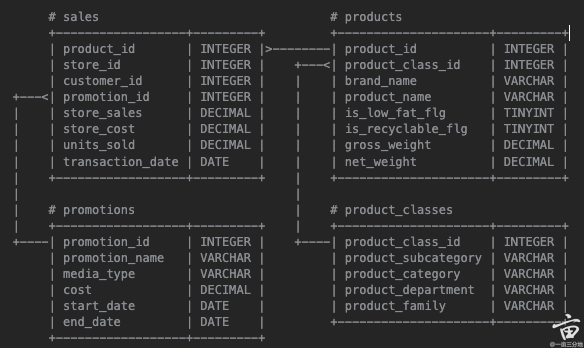

1. Sql book Solution

   > SQL：
   >
   > Table: `books`
   >
   > | Column                     | Type     | Description                |
   > | -------------------------- | -------- | -------------------------- |
   > | **book_id**          | INT (PK) | Primary key                |
   > | **title**            | VARCHAR  | Book title                 |
   > | **author_id**        | INT (FK) | Foreign key to `authors` |
   > | **publication_date** | DATE     | Date of publication        |
   > | **category**         | VARCHAR  | Book category              |
   > | **price**            | DOUBLE   | Book price                 |
   >
   > Table: `authors`
   >
   > | Column                | Type     | Description         |
   > | --------------------- | -------- | ------------------- |
   > | **author_id**   | INT (PK) | Primary key         |
   > | **first_name**  | VARCHAR  | Author's first name |
   > | **last_name**   | VARCHAR  | Author's last name  |
   > | **birthday**    | DATE     | Author's birth date |
   > | **website_url** | VARCHAR  | Author's website    |
   >
   > Table: `transactions`
   >
   > | Column                     | Type     | Description                        |
   > | -------------------------- | -------- | ---------------------------------- |
   > | **transaction_id**   | INT (PK) | Primary key                        |
   > | **book_id**          | INT (FK) | Foreign key to `books`           |
   > | **customer_id**      | INT (FK) | Foreign key to `customers`       |
   > | **payment_amount**   | DOUBLE   | Total payment amount               |
   > | **book_count**       | INT      | Number of books in the transaction |
   > | **tax_rate**         | DOUBLE   | Applicable tax rate                |
   > | **discount_rate**    | DOUBLE   | Discount rate applied              |
   > | **transaction_date** | DATE     | Date of the transaction            |
   > | **payment_type**     | VARCHAR  | Payment method (e.g., credit card) |
   >
   > Table: `customers`
   >
   > | Column                             | Type     | Description                              |
   > | ---------------------------------- | -------- | ---------------------------------------- |
   > | **customer_id**              | INT (PK) | Primary key                              |
   > | **first_name**               | VARCHAR  | Customer's first name                    |
   > | **last_name**                | VARCHAR  | Customer's last name                     |
   > | **registration_date**        | DATE     | Date of registration                     |
   > | **interested_in_categories** | VARCHAR  | Categories the customer is interested in |
   > | **is_rewards_member**        | BOOLEAN  | Whether the customer is a rewards member |
   > | **invited_by_customer_id**   | INT (FK) | Referring customer ID (if any)           |
   >
   > ```sql
   > -- Active: 1735699303502@@127.0.0.1@3306@meta
   > 
   > -- 1. Different payment type total sales (Top 3 by sales value)
   > select payment_type,
   > sum(payment_amount) as total_sales
   > from transactions
   > group by payment_type
   > ORDER BY total_sales DESC
   > limit 3
   > 
   > -- 2. Customers who purchased books from the same author with at least two categories and their total sales
   > 
   > SELECT
   >     c.customer_id,
   >     c.first_name,
   >     c.last_name,
   >     SUM(t.payment_amount) AS total_sales
   > FROM
   >     customers c
   >     JOIN transactions t ON c.customer_id = t.customer_id
   >     JOIN books b ON t.book_id = b.book_id
   >     JOIN authors a ON b.author_id = a.author_id
   > WHERE
   >     c.customer_id IN (
   >         SELECT
   >             t_inner.customer_id
   >         FROM
   >             transactions t_inner
   >             JOIN books b_inner ON t_inner.book_id = b_inner.book_id
   >         GROUP BY
   >             t_inner.customer_id,
   >             b_inner.author_id
   >         HAVING
   >             COUNT(DISTINCT b_inner.category) >= 2
   >     )
   > GROUP BY
   >     c.customer_id,
   >     c.first_name,
   >     c.last_name
   > ORDER BY
   >     total_sales DESC;
   > 
   > 
   > -- 3. Rank customers by the sales of those they invited
   > -- 有一个customers是被别人invite来的， 找top 3 invite别人的customer（top 指的是交易额）
   > 
   > select c.invited_by_customer_id as customer_id, sum(t.payment_amount) as total_sales
   > from customers c
   > inner join transactions t on c.customer_id = t.customer_id
   > where c.invited_by_customer_id is not null
   > group by c.invited_by_customer_id
   > 
   > 
   > -- 4. Total and unique books purchased by each customer
   > SELECT
   >     c.customer_id,
   >     c.first_name,
   >     c.last_name,
   >     SUM(t.book_count) AS total_books_purchased,
   >     COUNT(DISTINCT t.book_id) AS unique_books_purchased
   > FROM
   >     customers c
   >     inner JOIN transactions t ON c.customer_id = t.customer_id
   > GROUP BY
   >     c.customer_id,
   >     c.first_name,
   >     c.last_name
   > ORDER BY
   >     total_books_purchased DESC;
   > 
   > -- 5. Authors with URLs starting with "https//" but no sales
   > 
   > select a.author_id
   > from authors a
   > left join books b on a.author_id = b.author_id
   > left join transactions t on b.book_id = t.book_id
   > where a.website_url LIKE 'https://%'
   > and transaction_id is null;
   > 
   > -- 6. Top unique customers who made purchases this and the previous month
   > select MONTH(transaction_date), MONTH(CURRENT_DATE())
   > from transactions t1
   > inner join transactions t2 on t1.customer_id = t2.customer_id
   > 
   > WHERE MONTH(transaction_date) = MONTH(CURRENT_DATE())
   > 
   > -- 7. Authors who wrote more than 3 books, ordered by book count
   > select author_id,
   > count(book_id) as books_count
   > from books
   > GROUP BY author_id
   > having count(author_id) > 3
   > ORDER BY count(book_id) desc
   > 
   > -- 8. Percentage of customers who made a purchase on their registration date
   > 
   > SELECT
   >     ROUND(
   >         (COUNT(DISTINCT CASE 
   >             WHEN t.transaction_date = c.registration_date THEN c.customer_id 
   >         END) * 100.0) / COUNT(*) , 
   >         2
   >     ) AS percentage_customers_purchased_on_registration
   > FROM
   >     customers c
   >     LEFT JOIN transactions t ON c.customer_id = t.customer_id;
   > 
   > 
   > -- 9. Total books purchased by customers on their first and last purchase day (for customers with more than 1 purchase day and >3 books in total)
   > select customer_id, max(transaction_date) as last_day, min(transaction_date) as first_day
   > from transactions
   > GROUP BY customer_id
   > HAVING count(DISTINCT transaction_date) >= 1 and count(DISTINCT book_id) >= 1
   > 
   > -- 10. Percentage of customers who never purchased books from their interested categories
   > 
   > select subs(interested_in_categories, ',') from customers
   > select *
   > sum(case when c.customer_id = t.customer_id and t.book_id = t.book_id and b.category in STRING_TO_ARRAY())
   > from customers c
   > left join transactions t on c.customer_id = t.customer_id
   > left join books b on b.book_id = t.book_id
   > 
   > 
   > 
   > -- Get the sum and distinct count of the particular payment type.
   > select payment_type, sum(payment_amount), COUNT(1)
   > from transactions
   > GROUP BY payment_type
   > 
   > 
   > ```
   > fd
   >
   
2. SQL product solution

   > 
   >
   > ```sql
   > -- 1. What percentage of products are both low-fat and recyclable?
   > SELECT 
   >     100.0 * SUM(CASE WHEN is_low_fat_flg = 1 
   >                      AND is_recyclable_flg = 1 
   >                      THEN 1 ELSE 0 END) 
   >     / COUNT(*) AS pct_low_fat_and_recyclable
   > FROM products;
   > 
   > -- 2. What are the top five single-channel media types based on promotional spending?
   > SELECT
   >     media_type,
   >     SUM(cost) AS total_spending
   > FROM promotions
   > -- 只保留单一媒体类型的促销记录
   > WHERE media_type NOT LIKE '%,%'
   > GROUP BY media_type
   > ORDER BY total_spending DESC
   > LIMIT 5;
   > 
   > 
   > -- 3. For sales with valid promotions, what percentage of transactions occur on the first or last day of the campaign?
   > SELECT
   >     100.0 * SUM(
   >         CASE 
   >             WHEN s.transaction_date = p.start_date 
   >                  OR s.transaction_date = p.end_date 
   >             THEN 1 
   >             ELSE 0 
   >         END
   >     ) / COUNT(*) AS pct_first_or_last_day
   > FROM sales AS s
   > JOIN promotions AS p
   >     ON s.promotion_id = p.promotion_id
   > -- 仅保留"有效"促销范围内的销售
   > WHERE s.transaction_date BETWEEN p.start_date AND p.end_date;
   > 
   > -- 4. Show total units sold for each product family and the ratio of promoted to non-promoted sales,sorted by total units sold.
   > SELECT
   >     pc.product_family,
   >     SUM(s.units_sold) AS total_units_sold,
   >     -- 促销销量
   >     SUM(CASE WHEN s.promotion_id IS NOT NULL THEN s.units_sold ELSE 0 END) 
   >         AS promoted_units_sold,
   >     -- 非促销销量
   >     SUM(CASE WHEN s.promotion_id IS NULL THEN s.units_sold ELSE 0 END) 
   >         AS non_promoted_units_sold,
   >     -- 比值 = 促销销量 / 非促销销量
   >     CASE 
   >         WHEN SUM(CASE WHEN s.promotion_id IS NULL THEN s.units_sold ELSE 0 END) = 0 
   >              THEN NULL
   >         ELSE 
   >             1.0 * SUM(CASE WHEN s.promotion_id IS NOT NULL THEN s.units_sold ELSE 0 END) 
   >             / SUM(CASE WHEN s.promotion_id IS NULL THEN s.units_sold ELSE 0 END)
   >     END AS ratio_promoted_to_non_promoted
   > FROM sales AS s
   > JOIN products AS p
   >     ON s.product_id = p.product_id
   > JOIN product_classes AS pc
   >     ON p.product_class_id = pc.product_class_id
   > GROUP BY pc.product_family
   > ORDER BY total_units_sold DESC;
   > 
   > ```
   >
   > 
