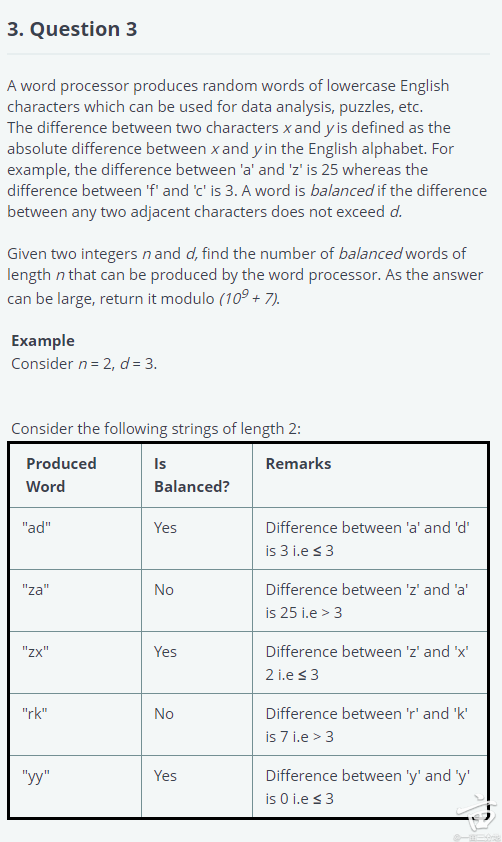

1. 2023(1-3月) DataEng 本科 全职@point72 - 网上海投 - 技术电面  | 😃 Positive 🙂 EasyPass | 应届毕业生

   > Senior Data Engineer 岗位. OA 是在hackerrank 有三道题， 有些题没有提供stdin/stdout 所以要自己写, 别忘温习了。
   >
   > 1. 
   >
   >    > 
   >    >
   >    > ```java
   >    > //DFA
   >    > /**
   >    > 
   >    > ```
   >    >
   >    > 
   >
   > 2. 
   >
   >    > 
   >
   > 3. 
   >
   >    > 注意第三题需要考虑时间复杂度。我一开始写的解法需要把所有input都排序，结果在最后一个test case上一直time out。后来想出来一个时间复杂度比较低的解法，不过时间不够没有写完。‍‍‌‌‌‍‌‍‌‌‍‍‌‌‍‍‍‍‌‌。。Submit三天以后收到拒信
   >    >
   >    > 

2. 2023(1-3月) 码农类General 硕士 全职@point72 - 网上海投 - 在线笔试  | 😐 Neutral 😐 AverageOther | 在职跳槽

   > 投递的date engineer岗位，之前看地里的面经准备的题目是一个也没考
   >
   > 1. 
   >
   >    > 
   >
   > 2. 
   >
   >    > 
   >
   > 3. 问题3: union两个表，也很简单

3. 2023(1-3月) DataEng 硕士 全职@point72 - 校园招聘会 - 在线笔试  | 😐 Neutral 😐 AveragePass | 应届毕业生

   > Position: Data Engineer
   > Dept: Market Intelligence
   >
   > 1. 
   >
   >    > 
   >    >
   >    > 
   >    >
   >    > 
   >
   > 2. 
   >
   >    > 
   >
   > 3. 
   >
   >    > 注意第三题需要考虑时间复杂度。我一开始写的解法需要把所有input都排序，结果在最后一个test case上一直time out。后来想出来一个时间复杂度比较低的解法，不过时间不够没有写完。‍‍‌‌‌‍‌‍‌‌‍‍‌‌‍‍‍‍‌‌。。Submit三天以后收到拒信

4. 2022(4-6月) 金工类 硕士 全职@point72 - Other - 在线笔试  | 😐 Neutral 😐 AverageFail | 应届毕业生

   > Point72 Software Engineer OA
   >
   > 1. 
   >
   >    > 请用binary search找到barindex
   >    >  。
   >
   > 2. 
   >
   >    > 
   >
   > 3. 
   >
   >    > 

5. 2022(4-6月) 金工类 博士 全职@point72 - 网上海投 - 其他  | 🙁 Negative 😣 HardFail | 应届毕业生

   > 1. [870. Advantage Shuffle](https://leetcode.com/problems/advantage-shuffle/)
   > 2. https://leetcode.com/discuss/interview-question/1389344/interview-question-nearest-neighboring-city（对应的职位是CIO PCA组的quant developer. OA共两道题，100min.）

6. 2022(1-3月) 码农类General 硕士 全职@point72 - 内推 - HR筛选  | 😃 Positive 😐 AveragePass | 应届毕业生

   > team：
   > 所在的是Coo下，market intelligence，下Ds de
   >
   > 工作内容：
   > team是Use data to get health of the company， data包括Big, small, referenced, structured；
   > Eg. Traffic in disneyand， Energy , telecom； build pipeline; Detect Anamoly; Warehouse; Provide data to Portfolio traders; in Excel, api, sql
   > Cloud aws spark python
   > Data bricks
   > Data warehousing
   > C shapring for API
   > Sql -> s3 data lake
   > Sql analytics databricks, Lake house
   > Credit card, receipt
   >
   > timeline：
   > 第一轮- 两周后 - 第二轮 - 两周后- 第三轮
   >
   > 面试内容
   > 第一轮
   >
   > 两个白人大哥 一共一小时
   > 主要是问了各种sql 概念，web application 概念， java及数据结构（因为我是写java的
   >
   >
   > 第二轮
   > 两个华人大哥 一人一小时
   > 面试1:
   > Kafka concepts
   > One situation case
   > schema design： design table schema of product info, sales, product info
   >
   > 2 Coding : Sql, Python requests with data structure
   >
   > 面试2:
   > 概念：
   > Graph data base
   > Knowledge graph
   > Spark and python
   > 编程：
   > 关于    ")()(())("的计算问题。要当场跑。
   > sql题 rank（） partition
   >
   > 第三轮：
   > 一国人 一印度
   > 面试一：
   >
   > sql：
   > traffic表格计算 top 3 days & location names with most daily foot traffic for each state 还有几个问题
   > rank() partition() group by
   > LC:
   > Longest Increasing Subsequence
   >
   > 面试二：
   > sql:
   > profit 表格，计算Year of increase of last ‍‍‌‌‌‍‌‍‌‌‍‍‌‌‍‍‍‍‌‌year
   > LC:
   > Find distinct pair of sum of target in a list with a target value
   > [1,3,4,6,7,8,3,4,5] 找到加起来是target value的所有pair 不重复

7. 2023(1-3月) DataEng 硕士 全职@point72 - 校园招聘会 - 在线笔试  | 😐 Neutral 😐 AveragePass | 应届毕业生

   > Position: Data Engineer
   > Dept: Market Intelligence
   > Questions #: 3
   >
   > Question #1: DFA
   > Question #2: Frequency Sort
   > Question #3: Calculate the percentile

8. 2022(4-6月) DataEng 硕士 全职@point72 - 猎头 - 在线笔试  | 😐 Neutral 😣 HardFail | 在职跳槽

   > Point72 Marketing Ingelligence Data Engineer hacker rank
   >
   > 1. 
   >
   >    > 
   >    >
   >    > 第三题是frequency sort，这道题也要求用stdin, stdout
   >
   > 2. 
   >
   >    > 第二题 是这篇面经里的 Price Percentile Cutoffs
   >    > 规定要用stdin, stdout
   >    > 80th percentile那一问不能用numpy pandas  我这题的代码应该是对的，但是running timeout。。。如果大家有更‍‍‌‌‌‍‌‍‌‌‍‍‌‌‍‍‍‍‌‌好的解法 欢迎讨论

9. 2020(1-3月) 码农类General 硕士 全职@point72 - 内推 - Onsite 视频面试  | Fail | 应届毕业生

   > 面的rotational program，流程是hr面、一面和二面，没有onsite
   > 一面是国人大哥问的蠡筘523，用sliding window
   > 二面是三轮skype
   >
   > 第一轮是亚裔小姐姐，迟到早退考两道brain teaser，一道是estimate NYC yellow cabs，二道是25匹马，每轮可以赛5匹，最少多少轮可以选出前三
   > 第二轮印度老姐，迟到早退打哈欠，问一道spiral matrix，我说可以用recursive和iterative，iterative更好因为空间复杂度低所以想implement这个，她问为什么，我说因为call stack她仿佛不懂什么是call stack？然后用嘴code才说到第一行就打断我说可以了。我还以为她还要问第二道题，结果啥都没有直提前10分钟结束
   > 第三轮V哥，迟到，态度特别差，问了queue vs linkedlist，map vs set，reader from socket快还是write file to database快，design pattern
   >
   > 第二天收到拒信说想招technically stronger candi‍‍‌‌‌‍‌‍‌‌‍‍‌‌‍‍‍‍‌‌date，我都不知道这之前的面试啥时候考了technical question。Point72的tech感觉已经被烙印填满了，去了日子也不好过。真诚建议大家不要去浪费时间

10. 2019(10-12月) 金工类 硕士 全职@point72 - 校园招聘会 - 在线笔试  | Other | 应届毕业生

    > 刚刚做完来分享一下新鲜的面筋
    > 我做的是data services hiring test，60min2道题没有sql，我遇到的题似乎之前的面筋里都没有出现过
    >
    > 1. 给一个integer n 找出它的所有因数并按从小到大排列，然后输出它的第p个因数
    >   这题很简单但是对时间复杂度要求比较高，我写出了一个O(n^0.5)才通过了所有的sample
    > 2. 背景好像是和信息安全相关的，我也不是学这个的完全没咋看懂，但其实那些信息完全可以忽略，核心内容就是给你一个int list（乱序，可以重复），对其中每个数，找出这个list里面有多少个数能被它整除（这个叫degree of divisibility ），算出max degree of divisibility。其‍‍‌‌‌‍‌‍‌‌‍‍‌‌‍‍‍‍‌‌实这题也挺简单的 ，就是我太辣鸡只写出了O(n^2)然后就3个sample没过

11. 2020(10-12月) DataEng 硕士 全职@point72 - 网上海投 - HR筛选 技术电面 Onsite 在线笔试  | Pass | 应届毕业生

    > 1. 这个岗位是web scraping方向的。在网上投递后先收到一个网测，60分钟4道题，3Python 1SQL，和地里之前的面经的一样，难度不大。
    >   网测后我是发邮件和HR说做完了，HR才说move to next process，有同学说自己都做对了但是就没消息了，所以估计要定时催HR。
    >
    > 2. HR Phone Screening，随便问一些东西，工作时间和意愿之类的
    >
    > 3. Tech Phone Interview，data组里的印度小哥面，题目有：
    >
    >    3:15分时针和分针的角度；
    >        get和post的区别；
    >        一道概率题，抛硬币，正面得1块，反面结束游戏，问愿意给多少钱来玩；
    >        给一个购物网站，每天记录它的一些信息，你如何根据这些信息得到一些有用结论。
    >
    > 4. 4. 一个Project，五天内做完，给出一个购物网站，screen一些商品信息。Hint：商店的定位要通过cookies来做。
    >
    > 5. Project提交一周过后onsite。3个小时，6个人不间断面试。大多数的是behaviour，只有一个data science问的比较难。

