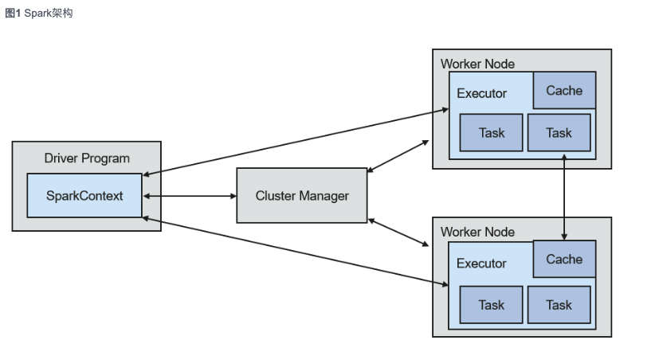
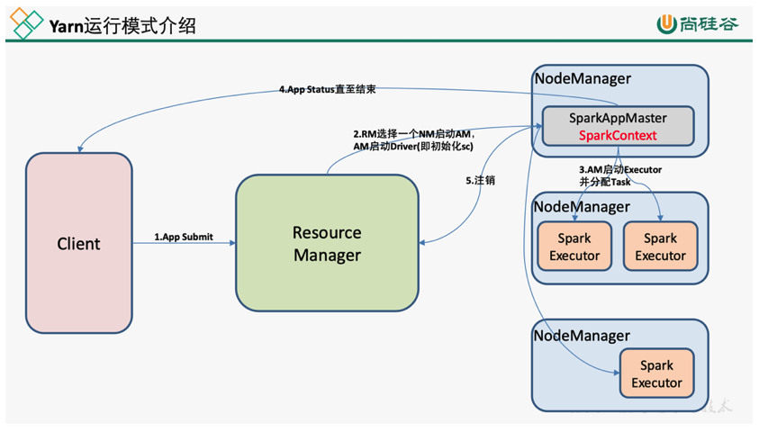
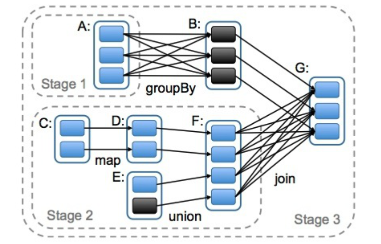
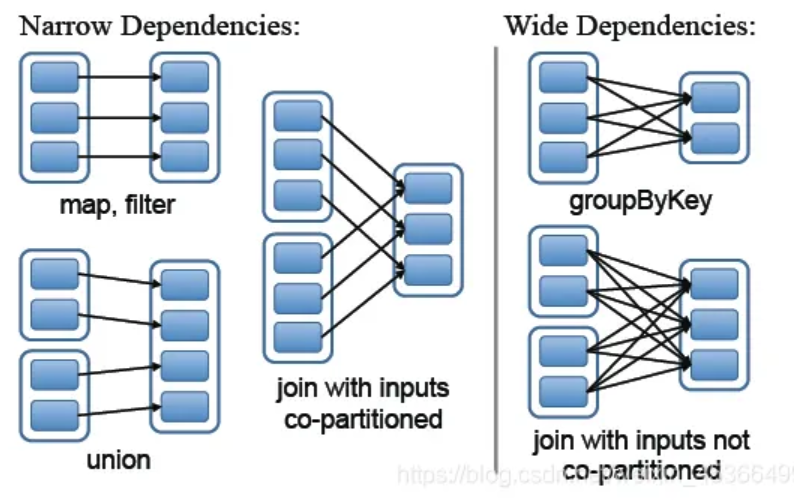
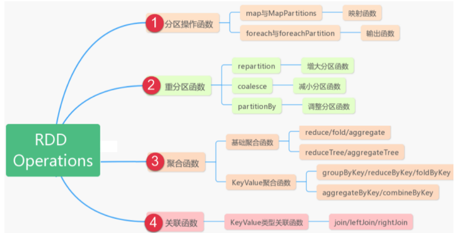
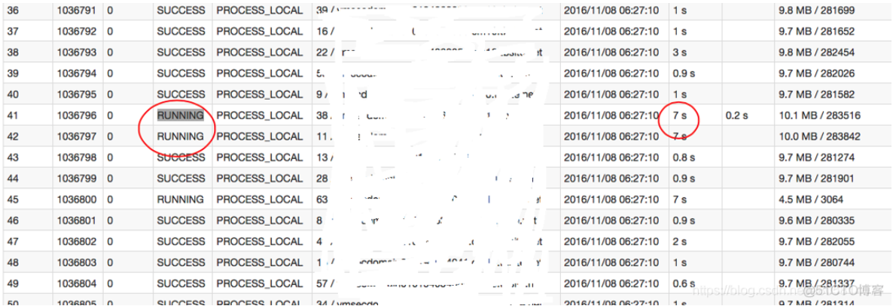
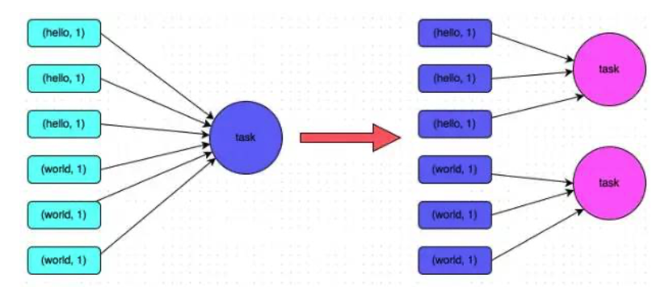
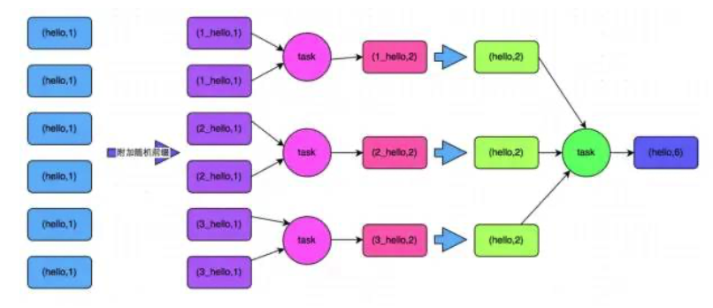

## 1. Spark

### 1.1 Spark 基本概念

> 1. 简介
>
>    > [Spark](https://spark.apache.org/docs/latest/)是基于内存的分布式计算框架。在迭代计算的场景下，数据处理过程中的数据可以存储在内存中，提供了比MapReduce高10到100倍的计算能力。Spark可以使用HDFS作为底层存储，使用户能够快速地从MapReduce切换到Spark计算平台上去。Spark提供一站式数据分析能力，包括小批量流式处理、离线批处理、SQL查询、数据挖掘等，用户可以在同一个应用中无缝结合使用这些能力。Spark的开源新特性请参考[Spark开源新特性](https://doc.hcs.huawei.com/zh-cn/productdesc/mrs/mrs_08_007106.html)。
>    >
>    > Spark的特点如下：
>    >
>    > - 通过分布式内存计算和DAG（无回路有向图）执行引擎提升数据处理能力，比MapReduce性能高10倍到100倍。
>    > - 提供多种语言开发接口（Scala/Java/Python），并且提供几十种高度抽象算子，可以很方便构建分布式的数据处理应用。
>    > - 结合[SQL](https://spark.apache.org/sql/)、[Streaming](https://spark.apache.org/streaming/)等形成数据处理栈，提供一站式数据处理能力。
>    > - 支持契合Hadoop生态环境，Spark应用可以运行在Standalone、Mesos或者YARN上，能够接入HDFS、HBase、Hive等多种数据源，支持MapReduce程序平滑转接。
>    >
>    > 
>    >
>    > | **模块**        | **说明**                                                     |
>    > | :-------------- | :----------------------------------------------------------- |
>    > | Cluster Manager | 集群管理器，管理集群中的资源。Spark支持多种集群管理器，Spark自带的Standalone集群管理器、Mesos或YARN。Spark集群默认采用YARN模式。 |
>    > | Application     | Spark应用，由一个Driver Program和多个Executor组成。          |
>    > | Deploy Mode     | 部署模式，分为cluster和client模式。cluster模式下，Driver会在集群内的节点运行；而在client模式下，Driver在客户端运行（集群外）。 |
>    > | Driver          | Spark的驱动器是执行开发程序中的main方法的进程。它负责开发人员编写的用来创建SparkContext、创建RDD，以及进行RDD的转化操作和行动操作代码的执行。 |
>    > | Executor        | 在Work Node上启动的进程，用来执行Task，管理并处理应用中使用到的数据。一个Spark应用一般包含多个Executor，每个Executor接收Driver的命令，并执行一到多个Task。 |
>    > | Worker Node     | 集群中负责启动并管理Executor以及资源的节点。                 |
>    > | Job             | 一个Action算子（比如collect算子）对应一个Job，由并行计算的多个Task组成。 |
>    > | Stage           | 每个Job由多个Stage组成，每个Stage是一个Task集合，由DAG分割而成。 |
>    > | Task            | 承载业务逻辑的运算单元，是Spark平台上可执行的最小工作单元。一个应用根据执行计划以及计算量分为多个Task。 |
>
> 2. 原理
>
>    > Spark的应用运行架构，运行流程如下所示：
>    >
>    > 1. 应用程序（Application）是作为一个进程的集合运行在集群上的，由Driver进行协调。
>    > 2. 在运行一个应用时，Driver会去连接集群管理器（Standalone、Mesos、YARN）申请运行Executor资源，并启动ExecutorBackend。然后由集群管理器在不同的应用之间调度资源。Driver同时会启动应用程序DAG调度、Stage划分、Task生成。
>    > 3. 然后Spark会把应用的代码（传递给[SparkContext](https://spark.apache.org/docs/1.3.1/api/scala/index.html#org.apache.spark.SparkContext)的JAR或者Python定义的代码）发送到Executor上。
>    > 4. 所有的Task执行完成后，用户的应用程序运行结束。
>    >
>    > 
>    >
>    > Spark on YARN有两种部署模式：
>    >
>    > - YARN-Cluster模式下，Spark的Driver会运行在YARN集群内的ApplicationMaster进程中，ApplicationMaster已经启动之后，提交任务的客户端退出也不会影响任务的运行。
>    > - YRAN-Client模式下，Driver启动在客户端进程内，ApplicationMaster进程只用来向YARN集群申请资源。
>
> 3. RDD概述
>
>    > RDD（Resilient Distributed Dataset）叫做分布式数据集，是Spark中最基本的数据抽象。代码中是一个抽象类，它代表一个不可变、可分区、里面的元素可并行计算的集合。
>    >
>    > RDD表示只读的分区的数据集，对RDD进行改动，只能通过RDD的转换操作，由一个RDD得到一个新的RDD，新的RDD包含了从其他RDD衍生所必需的信息。RDDs之间存在依赖，RDD的执行是按照血缘关系延时计算的。如果血缘关系较长，可以通过持久化RDD来切断血缘关系。
>    >
>    > 1. 一组分区（Partition），即数据集的基本组成单位;
>    > 2. 一个计算每个分区的函数;
>    > 3. RDD之间的依赖关系;
>    > 4. 一个Partitioner，即RDD的分片函数;
>    > 5. 一个列表，存储存取每个Partition的优先位置（preferred location）。
>    >
>    > Transformation 和 Action
>    >
>    > RDD的操作算子包括两类，一类叫做transformations，它是用来将RDD进行转化，构建RDD的血缘关系；另一类叫做actions，它是用来触发RDD的计算，得到RDD的相关计算结果或者将RDD保存的文件系统中。
>    >
>    > RDD中的所有转换都是延迟加载的，也就是说，它们并不会直接计算结果。相反的，它们只是记住这些应用到基础数据集（例如一个文件）上的转换动作。只有当发生一个要求返回结果给Driver的动作时，这些转换才会真正运行。这种设计让Spark更加有效率地运行。
>
> 4. **DAG**
>
>    > DAG(Directed Acyclic Graph)叫做有向无环图，原始的RDD通过一系列的转换就就形成了DAG，根据RDD之间的依赖关系的不同将DAG划分成不同的Stage，对于窄依赖，partition的转换处理在Stage中完成计算。对于宽依赖，由于有Shuffle的存在，只能在parent RDD处理完成后，才能开始接下来的计算，因此**宽依赖是划分****Stage****的依据**。
>    >
>    > 
>
> 5. **Lineage** 
>
>    > **RDD的血缘关系天然地可以实现容错，当RDD的某个分区数据失败或丢失，可以通过血缘关系重建。** 
>    >
>    > 是指 RDD 的血统（即其计算过程的依赖关系）。它描述了一个 RDD 是如何从其他 RDD 通过一系列转换操作派生出来的。
>    >
>    > 区分宽窄依赖，我们主要从父RDD的Partition流向来看：流向单个RDD就是窄依赖，流向多个RDD就是宽依赖。
>    >
>    > 窄依赖（narrow dependency）：父RDD的分区最多只会被子RDD的一个分区使用
>    >
>    > 宽依赖（wide dependency）：父RDD的一个分区会被子RDD的多个分区使用
>    >
>    > 
>    >
>    > **血统图（Lineage Graph）**：
>    >
>    > - 血统图是一个有向无环图（DAG），表示 RDD 之间的依赖关系。每个 RDD 记录了它是通过哪些转换操作从上一个 RDD 派生出来的。
>    >
>    > **容错性**：
>    >
>    > - Spark 利用血统信息实现容错。当一个分区的数据丢失时，Spark 可以根据血统图重新计算丢失的分区，而不需要重新计算整个 RDD。这种机制避免了数据复制带来的开销。
>    >
>    > **懒执行（Lazy Evaluation）**：
>    >
>    > - Spark 的 RDD 转换操作是懒执行的，只有在遇到行动操作（如 `collect`、`count`）时，Spark 才会触发实际计算。血统图帮助 Spark 在执行行动操作时，能够有效地计算出需要的数据。
>
> 6. **任务划分**
>
>    > 1）Application：初始化一个SparkContext即生成一个Application
>    >
>    > 2）Job：一个Action算子就会生成一个Job
>    >
>    > 3）Stage：根据RDD之间的依赖关系的不同将Job划分成不同的Stage，遇到一个宽依赖则划分一个Stage
>    >
>    > 4）Task：Stage是一个TaskSet，将Stage划分的结果发送到不同的Executor执行即为一个Task。
>    >
>    > **注意：Application->Job->Stage-> Task每一层都是1对n的关系。** 
>
> 7. **缓存 和 checkpoint** 
>
>    > 1. 缓存
>    >
>    >    > 如果在应用程序中多次使用同一个RDD，可以将该RDD缓存起来，该RDD只有在第一次计算的时候会根据血缘关系得到分区的数据，在后续其他地方用到该RDD的时候，**会直接从缓存处取而不用再根据血缘关系计算**，这样就加速后期的重用。 
>    >    >
>    >    > RDD通过persist方法或cache方法可以将前面的计算结果缓存，默认情况下 persist() 会把数据以序列化的形式缓存在 JVM 的堆空间中。 **但是并不是这两个方法被调用时立即缓存，而是触发后面的action时，该RDD将会被缓存在计算节点的内存中，并供后面重用。**
>    >    >
>    >    > 通过查看源码发现cache最终也是调用了persist方法，默认的存储级别都是仅在内存存储一份，Spark的存储级别还有好多种，存储级别在object StorageLevel中定义的。
>    >
>    > 2. checkpoint
>    >
>    >    > 虽然RDD的血缘关系天然地可以实现容错，当RDD的某个分区数据失败或丢失，可以通过血缘关系重建。但是对于长时间迭代型应用来说，随着迭代的进行，RDDs之间的血缘关系会越来越长，一旦在后续迭代过程中出错，则需要通过非常长的血缘关系去重建，势必影响性能。为此，RDD支持checkpoint将数据保存到持久化的存储中，这样就可以切断之前的血缘关系，因为checkpoint后的RDD不需要知道它的父RDDs了，它可以从checkpoint处拿到数据。对RDD进行checkpoint操作并不会马上被执行，必须执行Action操作才能触发。
>
> 8. **Dataframe**
>
>    > DataFrame也是懒执行的。性能上比RDD要高，主要原因：
>    > 优化的执行计划：查询计划通过Spark catalyst optimiser进行优化。逻辑查询计划优化就是一个利用基于关系代数的等价变换，将高成本的操作替换为低成本操作的过程。
>
> 9. Spark Sesseion
>
>    > 在老的版本中，SparkSQL提供两种SQL查询起始点：一个叫SQLContext，用于Spark自己提供的SQL查询；一个叫HiveContext，用于连接Hive的查询。
>    >
>    > SparkSession是Spark最新的SQL查询起始点，实质上是SQLContext和HiveContext的组合，所以在SQLContext和HiveContext上可用的API在SparkSession上同样是可以使用的。SparkSession内部封装了sparkContext，所以计算实际上是由sparkContext完成的。
>    >
>    > 如果需要RDD与DF或DS之间操作，需要引入 “import spark.implicits._”   **【spark不是包名，而是sparkSession对象名称】**  

### 1.2  Spark 基本语法

> 1. 语法
>
>    > ```bash
>    > spark-submit \
>    > ###基本参数
>    >   --class org.apache.spark.examples.SparkPi #: 指定应用程序的主类（对于 Java/Scala 程序）。
>    >   --master yarn #指定集群管理器，可以是 local、yarn、mesos 或 k8s。
>    >   --deploy-mode cluster #client(默认)模式在本地机器运行驱动程序，cluster(推荐)模式在节点上运行驱动程序。
>    >   --name SparkPiExample # 为应用程序指定一个名称。
>    >   --jars example.jar #指定其他需要的依赖 JAR 文件，逗号分隔的 jar 文件列表，这些 jar 文件将添加到应用程												序的 CLASSPATH 中。
>    >   --application-jar app.jar # 指定主应用程序的 JAR 文件，即包含应用程序主类的 JAR 文件。包含依赖. 这个												URL在集群中全局可见。 比如hdfs:// 共享存储系统， 如果是 file:// path， 那么所有的											节点的path都包含同样的jar
>    >   --packages com.databricks:spark-avro_2.12:3.0.1 # 逗号分隔的 Maven 坐标列表，用于依赖包的下载。
>    >   --exclude-package com.databricks:spark-avro_2.12:3.0.1 # 逗号分隔的要排除的 Maven 坐标列表。
>    >   --repositories # 逗号分隔的额外 Maven 仓库列表，用于下载依赖包。
>    >   --py-files example.py #逗号分隔的 .zip、.egg 或 .py dependencies文件，将添加到PYTHONPATH中（用于														Python应用）。这些文件会被分发到每个执行器。
>    >   --files example.txt # 逗号分隔的文件列表，这些文件将上传到集群节点上。
>    >   
>    >  ###运行时参数，以 key=value 形式指定的 Spark 配置属性。
>    >   --conf spark.shuffle.service.enabled=true #启用外部 Shuffle 服务
>    >   --conf spark.dynamicAllocation.minExecutors=2 #动态分配的最小执行器数
>    >   --conf spark.default.parallelism=100 #默认并行度设置。
>    >   --conf spark.eventLog.dir=hdfs://namenode:8020/spark-logs #指定事件日志的存储目录。
>    >   
>    >   
>    >  ###资源分配参数
>    >   --driver-memory 4g # 为 driver 节点分配的内存大小。
>    >   --driver-cores 2 # 分配给 driver 节点的 CPU 核数（仅适用于 YARN 和 Kubernetes）。
>    >   --executor-memory 4g # 为每个 executor 节点分配的内存大小。
>    >   --executor-cores 2 # 为每个 executor 分配的 CPU 核数。
>    >   --num-executors 3 # 启动的 executor 数量（仅适用于 YARN 和 Kubernetes）。
>    >   
>    >   ###YARN 特定参数
>    >    --archives *.zip#env #在 YARN 容器中解压缩的档案文件。
>    >    --principal <principal> # 提交应用程序的用户 principal（用于 Kerberos）。
>    >    --keytab <keytab> #用户的 keytab 文件（用于 Kerberos）。
>    >    
>    >   ###Kubernetes 特定参数
>    >    --kubernetes-namespace <namespace> #指定 Kubernetes 命名空间。
>    >    --kubernetes-service-account <account> #指定 Kubernetes 服务帐户。
>    >    --kubernetes-container-image <image> #指定运行 Spark 应用程序的 Docker 镜像。
>    >    --kubernetes-executor-request-cores <num># 指定 executor 的 CPU 请求数。
>    >    --kubernetes-executor-limit-cores <num> # 指定 executor 的 CPU 限制。
>    >    
>    > ```
>
> 2. 实例
>
>    > - Java application
>    >
>    >   > ```bash
>    >   > # Java 应用程序名为 MySparkApp，主类为 com.example.MySparkApp，并且需要一些额外 jar 包和配置参数
>    >   > spark-submit \
>    >   >   --class com.example.MySparkApp \
>    >   >   --master yarn \
>    >   >   --deploy-mode cluster \
>    >   >   --name MySparkAppExample \
>    >   >   --jars /path/to/extra1.jar,/path/to/extra2.jar \
>    >   >   --files /path/to/config.xml,/path/to/another-config.properties \
>    >   >   --conf spark.eventLog.enabled=true \
>    >   >   --conf spark.eventLog.dir=hdfs://namenode:8020/spark-logs \
>    >   >   --conf spark.driver.memory=4g \
>    >   >   --conf spark.executor.memory=4g \
>    >   >   --conf spark.executor.cores=2 \
>    >   >   --conf spark.executor.instances=5 \
>    >   >   --conf spark.dynamicAllocation.enabled=true \
>    >   >   --conf spark.dynamicAllocation.minExecutors=2 \
>    >   >   --conf spark.dynamicAllocation.maxExecutors=10 \
>    >   >   --conf spark.sql.shuffle.partitions=200 \
>    >   >   /path/to/my-spark-app.jar \
>    >   >   arg1 arg2 arg3
>    >   > 
>    >   > ```
>    >
>    > - Python application
>    >
>    >   > ```bash
>    >   > # Python 应用程序名为 my_spark_app.py，并且需要一些额外的 Python 文件和配置参数。
>    >   > spark-submit \
>    >   >   --master yarn \
>    >   >   --deploy-mode cluster \
>    >   >   --name MySparkPythonApp \
>    >   >   --py-files /path/to/dependency1.py,/path/to/dependency2.zip \
>    >   >   --files /path/to/config.json,/path/to/another-config.yaml \
>    >   >   --conf spark.eventLog.enabled=true \
>    >   >   --conf spark.eventLog.dir=hdfs://namenode:8020/spark-logs \
>    >   >   --conf spark.driver.memory=4g \
>    >   >   --conf spark.executor.memory=4g \
>    >   >   --conf spark.executor.cores=2 \
>    >   >   --conf spark.executor.instances=5 \
>    >   >   --conf spark.dynamicAllocation.enabled=true \
>    >   >   --conf spark.dynamicAllocation.minExecutors=2 \
>    >   >   --conf spark.dynamicAllocation.maxExecutors=10 \
>    >   >   --conf spark.sql.shuffle.partitions=200 \
>    >   >   /path/to/my_spark_app.py \
>    >   >   arg1 arg2 arg3
>    >   > ```

### 1.3 Spark 常用function

> 1. 创建DF
>
>    > ```python
>    > from pyspark.sql import SparkSession
>    > import pyspark.sql.functions as F
>    > 
>    > spark = SparkSession.builder.appName("example").getOrCreate()
>    > 
>    > data = [("Alice", 34), ("Bob", 45), ("Catherine", 29)]
>    > columns = ["Name", "Age"]
>    > 
>    > df = spark.createDataFrame(data, columns)
>    > df.show()
>    > ```
>
> 2. DF 方法增删改查
>
>    > ```python
>    > ###选择和过滤数据
>    > df.select("Name").show()                    # 选择列
>    > df.filter(df["Age"] > 30).show()            # 过滤数据
>    > df.groupBy("Age").count().show()            # 分组统计
>    > 
>    > ###添加，删除
>    > df = df.withColumn("AgePlusOne", F.col("Age") + 1) # 添加新队列， 或者替换现有队列
>    > df = df.withColumn("IsAdult", when(col("Age") >= 18, True).otherwise(False)) # 依据条件更改
>    > df = df.drop("AgePlusOne") # 删除列
>    > df.dropna() #使用 dropna 删除任何包含空值的行
>    > df.dropna(subset=["age"]).show() #删除指定列包含空值的行
>    > 
>    > ###SQL 查询
>    > df.createOrReplaceTempView("people")
>    > sqlDF = spark.sql("SELECT * FROM people WHERE Age > 30")
>    > sqlDF.show()
>    > ```
>
> 3. Pyspark.sql.functions
>
>    > - **`col`**: 选择列
>    > - **`lit`**: 创建常量列
>    > - **`concat`**: 字符串拼接
>    > - **`substring`**: 字符串截取
>    > - **`when`**: 条件判断
>    > - **`count`**: 计数
>    > - **`sum`**: 求和
>    > - **`avg`**: 求平均值
>    > - **`max`**: 求最大值
>    > - **`min`**: 求最小值
>    > - **`stddev`**: 计算标准差
>
> 4. Pyspark 存储
>
>    > ```py
>    > #保存为 CSV
>    > df.write.option("header", "true").option("delimiter", ",").csv("/path/to/output/csv")
>    > 
>    > #保存为 Parquet
>    > df.write \
>    >   .mode("overwrite") \
>    >   .option("compression", "snappy") \
>    >   .partitionBy("Age") \
>    >   .parquet("/path/to/save/parquet")
>    > 
>    > #保存到数据库
>    > df.write \
>    >   .format("jdbc") \
>    >   .option("url", "jdbc:mysql://localhost:3306/testdb") \
>    >   .option("dbtable", "people") \
>    >   .option("user", "root") \
>    >   .option("password", "password") \
>    >   .save()
>    > ```
>
> 5. Spark Hive
>
>    > ```sql
>    > # 创建Hive table
>    > CREATE TABLE IF NOT EXISTS example_table (
>    >     name STRING,
>    >     age INT,
>    >     city STRING
>    > )
>    > COMMENT 'This is my table'
>    > PARTITIONED BY (city STRING)
>    > STORED AS PARQUET; # STORED AS ORC
>    > 
>    > # 查看表列表
>    > SHOW CREATE TABLE my_table;
>    > ```
>
> 6. Pyspark RDD
>
>    > 
>    >
>    > ```python
>    > # 创建一个 RDD 使用 map 转换操作，计算每个元素的平方
>    > rdd = sc.parallelize([1, 2, 3, 4, 5])
>    > squared_rdd = rdd.map(lambda x: x * x)
>    > print(squared_rdd.collect())# 输出: [1, 4, 9, 16, 25]
>    > 
>    > # 创建一个包含单词的 RDD  使用 flatMap 将每行文本拆分为单词
>    > words_rdd = sc.parallelize(["Hello World", "PySpark Example"])
>    > words = words_rdd.flatMap(lambda line: line.split())
>    > print(words.collect())# 输出: ['Hello', 'World', 'PySpark', 'Example']
>    > 
>    > # 创建一个 RDD 使用 filter 转换操作，过滤出偶数元素
>    > rdd = sc.parallelize([1, 2, 3, 4, 5])
>    > even_rdd = rdd.filter(lambda x: x % 2 == 0)
>    > print(even_rdd.collect())# 输出: [2, 4]
>    > 
>    > # 创建一个包含键值对的 RDD 使用 reduceByKey 进行求和操作 适用于简单的局部合并操作，
>    > rdd = sc.parallelize([(1, 2), (1, 4), (2, 1), (2, 3), (2, 5)])
>    > sum_counts = rdd.reduceByKey(lambda x, y: x + y)
>    > print(sum_counts.collect())# 输出: [(1, 6), (2, 9)]
>    > 
>    > # 创建一个包含键值对的 RDD 使用 aggregateByKey 进行求和操作，适合于复杂的聚合逻辑。。
>    > rdd = sc.parallelize([(1, 2), (1, 4), (2, 1), (2, 3), (2, 5)])
>    > sum_counts = rdd.aggregateByKey(0, lambda x, y: x + y, lambda x, y: x + y)
>    > print(sum_counts.collect())# 输出: [(1, 6), (2, 9)]
>    > 
>    > # aggregateByKey：更灵活，可以指定初始值和两个不同类型的聚合函数
>    > 
>    > # 创建一个包含整数的 RDD，并指定初始分区数为 2, 使用 repartition 将 RDD 重新分区为 4 个分区
>    > rdd = sc.parallelize(range(10), 2)
>    > rdd_repartitioned = rdd.repartition(4)
>    > print("# of partitions after repartitioning:", rdd_repartitioned.getNumPartitions())# 输出: 4
>    > 
>    > 
>    > ```

### 1.4 Spark function 调优

> 1. 避免创建重复的RDD，尽可能复用同一个RDD
>
>    > - 尽量复用同一份数据。比如多次读可以persist, 级别（SER，MEM，DISK，_N）；如果input太大，persist可能得不偿失
>    >
>    > - 但是如果rdd的lineage太长，最好checkpoint下来，避免长重建
>    > - 如果有RDD复用，尤其是该RDD需要花费比较长的时间，建议对该RDD做cache，若该RDD每个partition需要消耗很多内存，**建议开启Kryo序列化机制(据说可节省2到5倍空间)**,若还是有比较大的内存开销，可将storage_level设置为MEMORY_AND_DISK_SER
>
> 2. 尽量避免使用shuffle类算子，
>
>    > - 因为shuffle操作是spark中最消耗性能的地方，reduceByKey、join、distinct、repartition等算子都会触发shuffle操作，尽量使用map类的非shuffle算子
>    >
>    > - shuffle算子如distinct（实际调用reduceByKey）、reduceByKey、aggregateByKey、sortByKey、groupByKey、join、cogroup、repartition等，入参中会有一个并行度参数numPartitions
>    > - shuffle过程中，各个节点上的相同key都会先写入本地磁盘文件中，然后其他节点需要通过网络传输拉取各个节点上的磁盘文件中的相同key
>
> 3. 使用map-side预聚合的shuffle操作
>
>    > **用aggregateByKey和reduceByKey替代groupByKey,因为前两个是预聚合操作**，会在每个节点本地对相同的key做聚合，等其他节点拉取所有节点上相同的key时，会大大减少磁盘IO以及网络开销。
>    >
>    > **difference between ReduceByKey and groupByKey** 
>    >
>    > > 1. reduceByKey：按照key进行聚合，在shuffle之前有combine（预聚合）操作，返回结果是RDD[k,v].
>    > > 2. groupByKey：按照key进行分组，直接进行shuffle。
>    > >    用aggregateByKey和reduceByKey替代groupByKey,因为前两个是预聚合操作，会在每个节点本地对相同的key做聚合，等其他节点拉取所有节点上相同的key时，会大大减少磁盘IO以及网络开销。
>
> 4. 使用高性能的算子
>
>    > - mapPartitions操作替代普通map
>    >
>    >   > 1. map()：每次处理一条数据。
>    >   > 2. mapPartition()：每次处理一个分区的数据，这个分区的数据处理完后，原RDD中分区的数据才能释放，可能导致OOM。
>    >   > 3. 开发指导：当内存空间较大的时候建议使用mapPartition()，以提高处理效率。
>    >
>    > - foreachPartitions替代foreach
>    >
>    > - 一边进行重分区的shuffle操作，一边进行排序。如果需要在repartition重分区之后还要进行排序，可直接使用repartitionAndSortWithinPartitions，比分解操作效率高，因为它可以一边shuffle一边排序
>    >
>    > - filter操作之后进行coalesce操作，可以减少RDD的partition数量
>    >
>    > - spark中的Group/join/XXXByKey等操作，都可以指定partition的个数，不需要额外使用repartition和partitionBy函数
>
> 5. Broadcast广播
>
>    > - 广播大变量，广播变量是executor内所有task共享的，避免了每个task自己维护一个变量，OOM
>    > - 若需要Broadcast一个大的对象到远端作为字典查询，可使用多executor-cores，大executor-memory。若将该占用内存较大的对象存储到外部系统，executor-cores=1， executor-memory=m(默认值2g),可以正常运行，那么当大字典占用空间为size(g)时，executor-memory为2*size，executor-cores=size/m(向上取整)
>    > - 如果对象太大无法BroadCast到远端，且需求是根据大的RDD中的key去索引小RDD中的key，可使用zipPartitions以hash join的方式实现，具体原理参考下一节的shuffle过程
>
> 6. RDD 
>
>    > - repartition适用于RDD[V], partitionBy适用于RDD[K, V]
>    >- 多个RDD进行union操作时，避免使用rdd.union(rdd).union(rdd).union(rdd)这种多重union，rdd.union只适合2个RDD合并，合并多个时采用SparkContext.union(Array(RDD))，避免union嵌套层数太多，导致的调用链路太长，耗时太久，且容易引发StackOverFlow
>    > - 如果2个RDD做join，其中一个数据量很小，可以采用Broadcast Join，将小的RDD数据collect到driver内存中，将其BroadCast到另外以RDD中，其他场景想优化后面会讲
>    > - 2个RDD做笛卡尔积时，把小的RDD作为参数传入，如BigRDD.certesian(smallRDD)
>    
> 7. **Shuffle**
>
>    > 1. spark中的shuffle操作功能：将分布在集群中多个节点上的同一个key，拉取到同一个节点上，进行聚合或join操作，类似洗牌的操作。这些分布在各个存储节点上的数据重新打乱然后汇聚到不同节点的过程就是shuffle过程。 
>   >
>    > 2.  哪些操作中包含shuffle操作
>    >
>    >    > RDD的特性是不可变的带分区的记录集合，Spark提供了Transformation和Action两种操作RDD的方式。Transformation是生成新的RDD，包括map, flatMap, filter, union, sample, join, groupByKey, cogroup, ReduceByKey, cros, sortByKey, mapValues等；Action只是返回一个结果，包括collect，reduce，count，save，lookupKey等
>    >
>    > 3. Spark所有的算子操作中是否使用shuffle过程要看计算后对应多少分区
>    >
>    >    > - 若一个操作执行过程中，结果RDD的每个分区只依赖上一个RDD的同一个分区，即属于窄依赖，如map、filter、union等操作，这种情况是不需要进行shuffle的，同时还可以按照pipeline的方式，把一个分区上的多个操作放在同一个Task中进行.
>    >    >
>    >    > - 若结果RDD的每个分区需要依赖上一个RDD的全部分区，即属于宽依赖，如repartition相关操作（repartition，coalesce）、*ByKey操作（groupByKey，ReduceByKey，combineByKey、aggregateByKey等）、join相关操作（cogroup，join）、distinct操作，这种依赖是需要进行shuffle操作的
> 
> 8. 优化数据结构
>
>    > - 原始类型(Int, Long)
>   > - 字符串，每个字符串内部都有一个字符数组以及长度等额外信息
>    > - 对象，每个Java对象都有对象头、引用等额外的信息，因此比较占用内存空间
>    > - 集合类型，比如HashMap、LinkedList等，因为集合类型内部通常会使用一些内部类来封装集合元素，比如Map.Entry
>    > - 尽量使用`字符串`替代`对象`，使用`原始类型`（比如Int、Long）替代`字符串`，使用`数组`替代`集合类型`，这样尽可能地减少内存占用，从而降低GC频率，提升性能
> 
> 9. **difference between colapse and repartition**
>
>       > 1. colapse 作用：缩减分区数，用于大数据集过滤后，提高小数据集的执行效率。
>   > 2. repartition 作用：根据分区数，重新通过网络随机洗牌所有数据。
>    > 3. coalesce重新分区，可以选择是否进行shuffle过程。由参数shuffle: Boolean = false/true决定。
>   > 4. repartition实际上是调用的coalesce，默认是进行shuffle的。
> 
> 10. UDF
> 
>     > ```python
>    > //需要注意的是受Scala limit 22限制，自定义UDF最多接受22个参数，不过正常情况下完全够用了
>     > val ds = Seq((1, "foo"), (2, "bar")).toDF("id", "text")
>    > val toUpperCase = functions.udf((s: String) => s.toUpperCase)
>     > ds.withColumn("text", toUpperCase('text)).show()
>     > 
>     > // 注册可以在sql语句中使用的UDF
>     > spark.udf.register("to_uppercase", (s: String) => s.toUpperCase())
>     > // 创建一张表
>     > Seq((1, "foo"), (2, "bar")).toDF("id", "text").createOrReplaceTempView("t_foo")
>     > spark.sql("select id, to_uppercase(text) from t_foo").show()
>     > ```
> 
> 11. What is Hadoop?
> 
>     > Apache Hadoop is an open source framework that is used to efficiently store and process large datasets ranging in size from gigabytes to petabytes of data. Instead of using one large computer to store and process the data, Hadoop allows clustering multiple computers to analyze massive datasets in parallel more quickly.

### 1.5 Spark 配置调优

> 1. 当开启了动态资源分配（spark.dynamicAllocation.enabled）
>
>    > num-executor选项将不再兼容，如果设置了num-executor，那么动态资源分配将被关闭。在Spark独立部署的集群中，你只需要在worker启动前设置 spark.shuffle.server.enabled 为true即可。
>    >
>    > spark.dynamicAllocation.enabled true  # 开启动态资源分配
>    > spark.dynamicAllocation.minExecutors 1  # 每个Application最小分配的executor数
>    > spark.dynamicAllocation.maxExecutors 30  # 每个Application最大并发分配的executor数
>    > spark.dynamicAllocation.schedulerBacklogTimeout 1s # 任务待时间（超时便申请新资源)默认60秒
>    > spark.dynamicAllocation.sustainedSchedulerBacklogTimeout 5s #  再次请求等待时间，默认60秒
>    > spark.dynamicAllocation.executorIdleTimeout # executor闲置时间（超过释放资源）默认600秒
>
> 2. Spark 计算 executor and memory
>
>    > 硬件资源： 6 节点，每个节点16 cores, 64 GB 内存
>    >
>    > - core的个数
>    >
>    >   > 决定一个executor能够并发任务的个数。所以通常认为，一个executor越多的并发任务能够得到更好的性能，但有研究显示一个应用并发任务超过5，导致更差的性能。所以core的个数暂设置为5个。5个core是表明executor并发任务的能力，并不是说一个系统有多少个core，即使我们一个CPU有32个core，也设置5个core不变。
>    >
>    > - executor个数，
>    >
>    >   > 一个executor分配 5 core,一个node有15 core，从而我们计算一个node上会有3 executor（15 / 5），然后通过每个node的executor个数得到整个任务可以分配的executors个数。
>    >   > 我们有6个节点，每个节点3个executor，6 × 3 = 18个executors，额外预留1个executor给AM，最终要配置17个executors。
>    >   > 最后spark-submit启动脚本中配置 –num-executors = 17
>    >
>    > - memory
>    >
>    >   > 配置每个executor的内存，一个node，3 executor， 63G内存可用，所以每个executor可配置内存为63 / 3 = 21G
>
> 3. Executor, Core 之间关系
>
>    >     1)	**每个节点可以起一个或多个Executor**。 
>    >     2)	每个Executor由若干core组成，每个Executor的每个core一次只能执行一个Task。
>    >     3)	每个Task执行的结果就是生成了目标RDD的一个partiton。
>    >          注意: 这里的core是虚拟的core而不是机器的物理CPU核，可以理解为就是Executor的一个工作线程。而 Task被执行的并发度 = Executor数目 * 每个Executor核数。
>
> 4. Partition，Task之间关系
>
>    >     1)	对于数据读入阶段，例如sc.textFile，输入文件被划分为多少InputSplit就会需要多少初始Task。
>    >     2)	在Map阶段partition数目保持不变。
>    >     3)	在Reduce阶段，RDD的聚合会触发shuffle操作，聚合后的RDD的partition数目跟具体操作有关，例如repartition操作会聚合成指定分区数，还有一些算子是可配置的。
>    >     4)	RDD在计算的时候，每个分区都会起一个task，所以rdd的分区数目决定了总的的task数目。申请的计算节点、（Executor）数目和每个计算节点核数，决定了你同一时刻可以并行执行的task。
>    >          比如的RDD有100个分区，那么计算的时候就会生成100个task，你的资源配置为10个计算节点，每个两2个核，同一时刻可以并行的task数目为20，计算这个RDD就需要5个轮次。如果计算资源不变，你有101个task的话，就需要6个轮次，在最后一轮中，只有一个task在执行，其余核都在空转。如果资源不变，你的RDD只有2个分区，那么同一时刻只有2个task运行，其余18个核空转，造成资源浪费。这就是在spark调优中，增大RDD分区数目，增大任务并行度的做法。
>
> 5. 运行流程
>
>    > 1. client向YARN的ResourceManager/RM申请启动ApplicationMaster/AM（单个应用程序/作业的资源管理和任务监控）
>    > 2. RM收到请求后，在集群中选择一个NodeManager，为该应用程序分配第一个Container，spark在此启动其AM，其中AM进行SparkContext/SC/Driver初始化启动并创建RDD Object、DAGScheduler、TASKScheduler
>    > 3. SC根据RDD的依赖关系构建DAG图，并将DAG提交给DAGScheduler解析为**stage**。Stages以TaskSet的形式提交给TaskScheduler，TaskScheduler维护所有TaskSet，当Executor向Driver发送心跳时，TaskScheduler会根据其资源剩余情况分配相应的Task，另外TaskScheduler还维护着所有Task的运行状态，重试失败了的Task
>    > 4. AM向RM申请container资源，资源到位后便与NodeManager通信，要求它在获得的Container中(executor)启动CoarseGrainedExecutorBackend，CoarseGrainedExecutorBackend启动后会向AM中的SC注册并申请Task
>    > 5. AM中的SC分配Task给CoarseGrainedExecutorBackend/executor执行，CoarseGrainedExecutorBackend运行Task并向AM汇报运行的状态和进度，以便让AM随时掌握各个task的运行状态，从而可以在任务失败时重新启动任务或者推测执行
>    > 6. 应用程序运行完成后，AM向RM申请注销并关闭自己
>
> 6. 数据倾斜**Data Skew**调优
>
>    > 数据倾斜，英文data skew，就是由于数据分布不均匀，造成的数据以及任务计算时间有差异，绝大多数task任务执行很快结束，个别task任务执行非常缓慢，如果在mr中接触过的就应该知道，dataskew的现象就是程序长时间停留在99%的阶段，但是不结束。 数据倾斜只会发生在shuffle过程
>    >
>    > - 表现形式。
>    >
>    >   > - 突然OOM（out of memory）
>    >   >
>    >   >   > 正常运行的作业，突然某一天OOM，分析原因，是由于key的分布不均匀造成的。
>    >   >
>    >   > - 个别task运行很慢,绝大多数task任务执行很快结束，个别task任务执行非常缓慢。
>    >   >
>    >   >   > 一个spark程序执行时间是由最慢的task所决定的。这也是数据倾斜中最常见的现象。
>    >   >   > 
>    >   >
>    >   > 
>    >
>    > - 解决思路：
>    >
>    >   > 1. 提高shuffle操作的并行度
>    >   >
>    >   >    > 让每个task处理比原来更少的数据（之前可能task会%parNum分到2个key），但是如果单key倾斜，方法失效
>    >   >    > 
>    >   >
>    >   > 2. 两阶段聚合（局部聚合+全局聚合）
>    >   >
>    >   >    > - 附加随机前缀 -> 局部聚合 -> 去除随机前缀 -> 全局聚合
>    >   >    > - 适用于聚合类shuffle（计算sum，count），但是对于join类shuffle不适用
>    >   >    >
>    >   >    > 
>    >   >
>    >   > 3. 将reduce join转为map join
>    >   >
>    >   >    > - 适用于join类shuffle，因为shuffle变成map操作了
>    >   >    > - 只适用于一个大表和一个小表，将小表广播，并不适合两个都是大表
>    >   >

### 1.5 Spark 流程

> 1. Spark 执行流程
>
>    > 对RDD的操作分为**transformation**和**action**两类， **真正的作业提交运行发生在action之后**，调用action之后会将对原始输入数据的所有transformation操作封装成作业并向集群提交运行。这个过程大致可以如下描述：
>    >
>    > 1. 由DAGScheduler对RDD之间的依赖性进行分析，通过DAG来分析各个RDD之间的转换依赖关系
>    >
>    > 2. 根据DAGScheduler分析得到的RDD依赖关系将Job划分成多个stage
>    >
>    > 3. 每个stage会生成一个TaskSet并提交给TaskScheduler，调度权转交给TaskScheduler，由它负责分发task到worker执行
>
> 2. Stage
>
>    > **RDD在执行action操作时，会触发Job的提交**，Spark会根据RDD的DAG图，将Job划分成多个阶段，每个阶段称为一个Stage。
>    >
>    > Stage分为两种：Shuffle Map Stage和Result Stage。
>    >
>    > - Shuffle Map Stage：Shuffle Map Stage阶段的task结果被输入到其他Stage。
>    >
>    > - Result Stage：Result Stage阶段的task结果直接是job的结果，也就是说包含最后一个RDD的Stage就是Result Stage。
>    >
>    > Shuffle Map Stage中的Task称为ShuffleMapTask，Result Stage中的Task称为ResultTask。

Stage and lineage

> > - **Stage** 是 Spark 执行过程中的一个计算阶段。一个 Spark 作业（job）通常会被划分为多个阶段，每个阶段由一组并行的任务（task）组成，这些任务在不同的数据分区上执行相同的计算。
>>
> >   > - **划分阶段的依据**：
> >   >   - **Spark 会根据宽依赖（wide dependency）将作业划分为多个阶段**。
> >   >   
> >   >     > 宽依赖是指一个 RDD 的多个分区依赖于上一个 RDD 的多个分区，例如 `groupByKey` 和 `reduceByKey` 等操作。
> >   >     >
> >   >     > 窄依赖（narrow dependency）是指一个 RDD 的每个分区只依赖于上一个 RDD 的一个分区，例如 `map` 和 `filter` 等操作。
> >   >   
> >   > - **执行顺序**：
>>   >   - 每个阶段的任务会被提交给集群中的各个节点并行执行。一个阶段完成后，生成的中间数据将被保存，然后开始下一个阶段的计算。
> >   >   
>>   > - **DAG（Directed Acyclic Graph）调度器**：
> >   >   - Spark 使用一个 DAG 调度器来管理和调度阶段。DAG 调度器根据作业的逻辑执行计划，将其转换为一系列的阶段和任务，并确保这些阶段按顺序执行。
> >
> > - > - 

## 2. SQL


    <1> 
    SELECT OrderID, Quantity,
    CASE
        WHEN Quantity > 30 THEN 'The quantity is greater than 30'
        WHEN Quantity = 30 THEN 'The quantity is 30'
        ELSE 'The quantity is under 30'
    END AS QuantityText
    FROM OrderDetails;
    
    <2>
    select
    max(case when columnname = 'FirstName' then value end) Firstname,
    max(case when columnname = 'Amount' then value end) Amount,
    max(case when columnname = 'PostalCode' then value end) PostalCode,
    max(case when columnname = 'LastName' then value end) LastName,
    max(case when columnname = 'AccountNumber' then value end) AccountNumber
    from yourtable
    
    <3>
    select coalesce(fieldname, '123') as fieldname 
    from tablename 

### 

​        