## 1. Kafka

### 1.  what is Kafka

> Apache Kafka is an open-source distributed streaming system used for stream processing, real-time data pipelines, and data integration at scale.
>
> 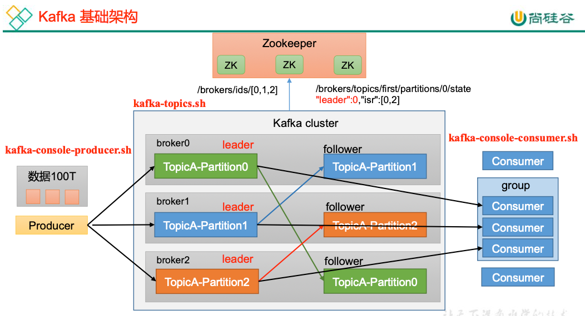

### 2. Kafka producer

> 在消息发送的过程中，涉及到了两个线程——**main** 线程和 **Sender** 线程。在 main 线程中创建了一个双端队列 **RecordAccumulator**。main 线程将消息发送给 RecordAccumulator，Sender 线程不断从RecordAccumulator 中拉取消息发送到Kafka Broker。
>
> 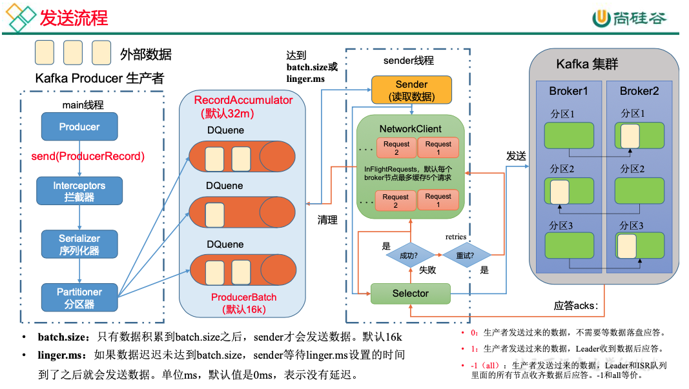
>
> **异步发送,带回调函数（可不带）：**回调函数会在 producer 收到 ack 时调用，为异步调用，该方法有两个参数，分别是元数据信息（RecordMetadata）和异常信息（Exception） ，如果 Exception 为 null，说明消息发送成功，如果Exception 不为null，说明消息发送失败
>
> ```java
> for (int i = 0; i < 500; i++) {
>  kafkaProducer.send(new ProducerRecord<>("first", "atguigu" + i), new Callback() {
>      @Override
>      public void onCompletion(RecordMetadata metadata, Exception exception) {
>          if (exception == null){
>              System.out.println("主题： "+metadata.topic() + " 分区： "+ metadata.partition());
>          }
>      }
>  });
>  Thread.sleep(2);
> }
> ```
>
> **同步发送： **在异步发送的基础上，再调用一下 get()方法即可
>
> ```java
> // 2 发送数据
> for (int i = 0; i < 5; i++) {
>  kafkaProducer.send(new ProducerRecord<>("first","atguigu"+i)).get();
> }
> ```

### 3. Partition for producer

> （1）便于合理使用存储资源，每个Partition在一个Broker上存储，可以把海量的数据按照分区存储在多台Broker上。合理控制分区的任务，可以实现负载均衡的效果。
>
> （2）提高并行度，生产者可以以分区为单位发送数据；消费者可以以分区为单位进行消费数据。
>
> 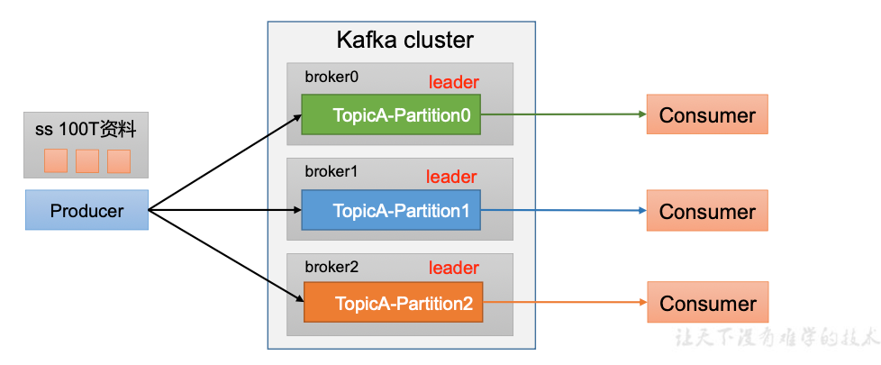
>
> 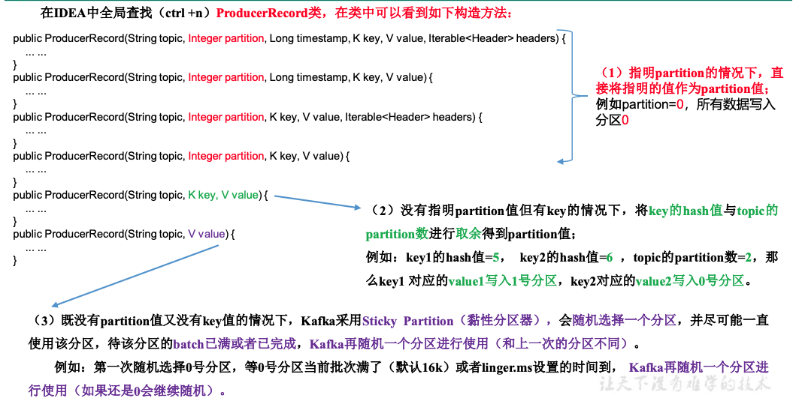

### 4. How to improve the througput of producer

> 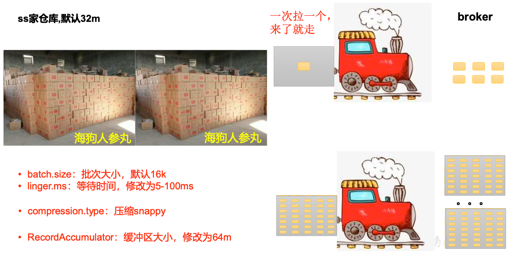

### 5. How to improve the data reliality of producer

> 1. **ACK 应答级别**
>
>    在生产环境，**acks=0**很少使用；**acks=1**，一般用于传输普通日志，允许丢个别数据；**acks=-1**，一般用于传输和钱相关的数据
>
>    对可靠性要求比较高的场景。
>
> 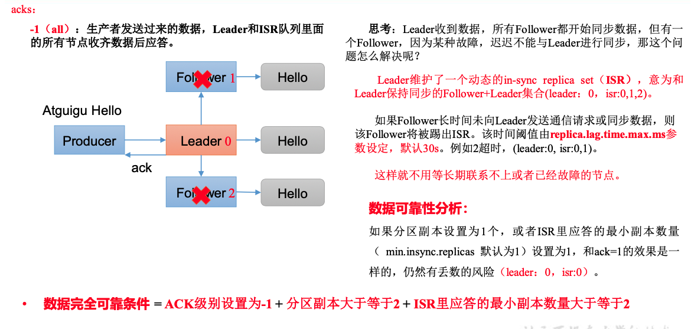
>
> 2. **数据去重1： 幂等性**
>
>    幂等性就是指Producer不论向Broker发送多少次重复数据，Broker端都只会持久化一条，保证了不重复。
>
>    精确一次（**Exactly Once**）**=** 幂等性**+** 至少一次（**ack=-1 +** 分区副本数**>=2 + ISR**最小副本数量**>=2**）。
>
>    重复数据的判断标准：具有<PID, Partition, SeqNumber>相同主键的消息提交时，Broker只会持久化一条。其中PID是Kafka每次重启都会分配一个新的；Partition 表示分区号；Sequence Number是单调自增的。所以幂等性只能保证的是在单分区单会话内不重复。开启参数**enable.idempotence** 默认为true，false 关闭。
>
>    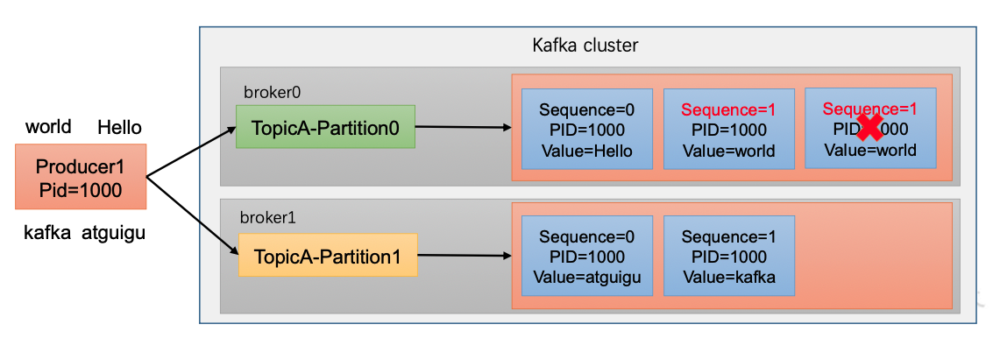
>
> 3. **数据去重2: 开启事物**
>
>    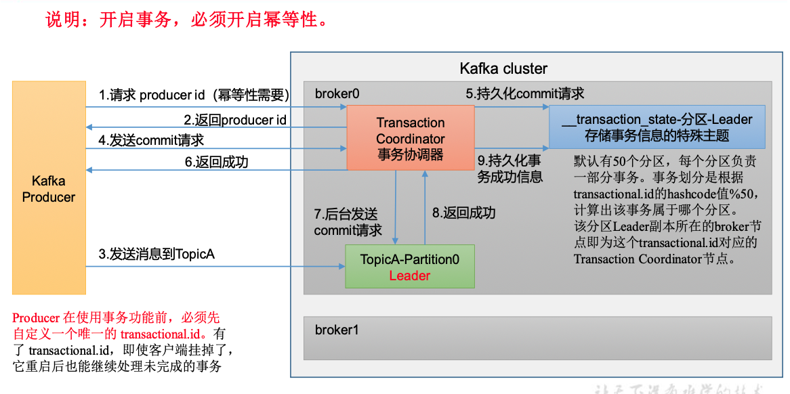
>
> 4. **保证数据有序**
>
>    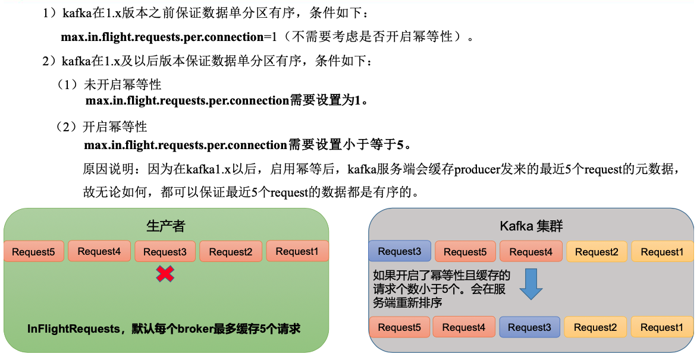

### 6. Kafka Broker

> 1. 工作流程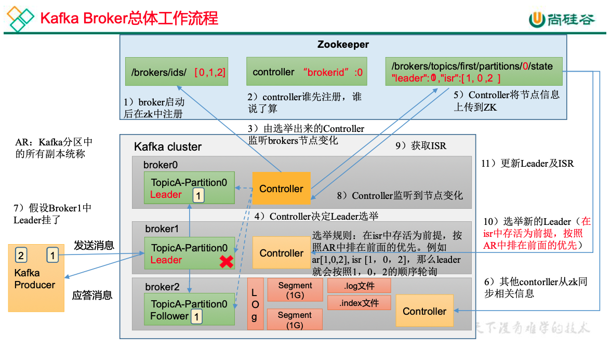
>
> 2. Follower故障处理细节
>    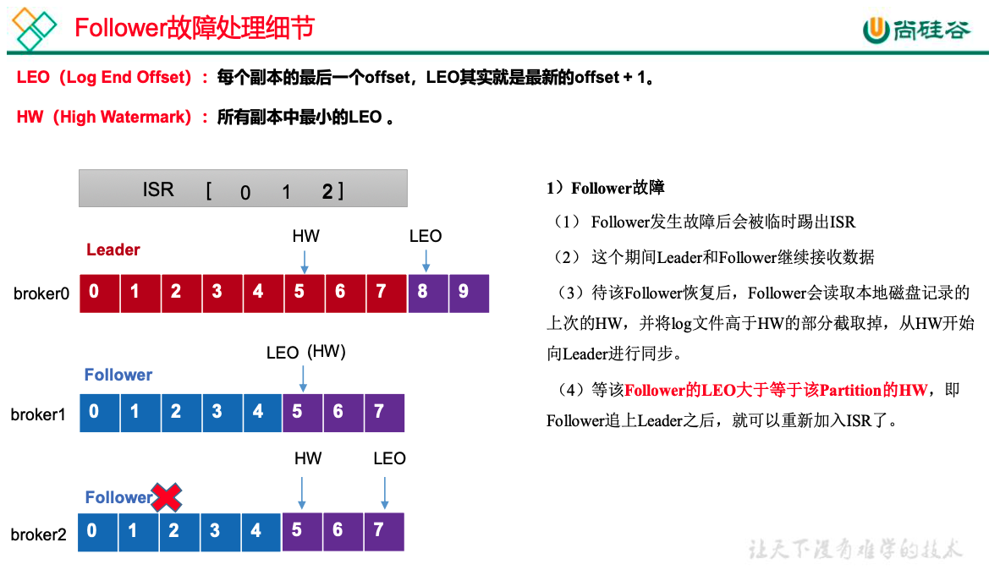
>
> 3. Leader故障处理细节
>    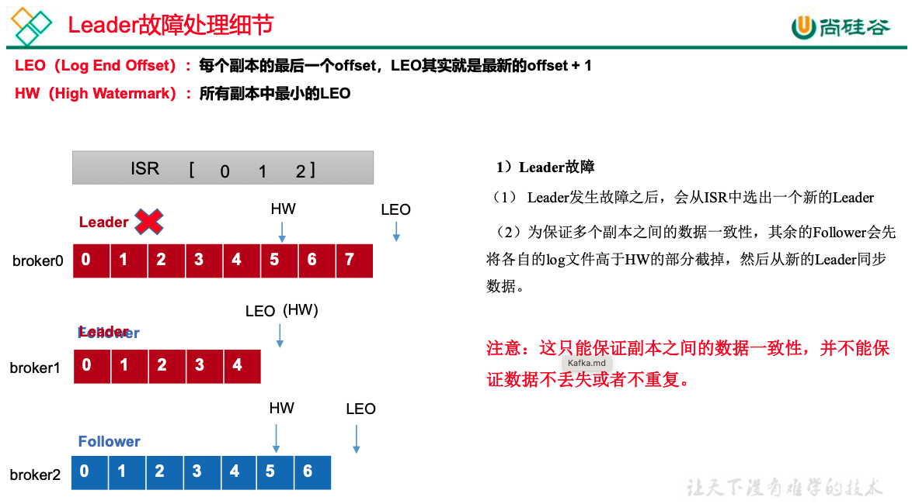
>
> 4. 文件存储机制
>
>    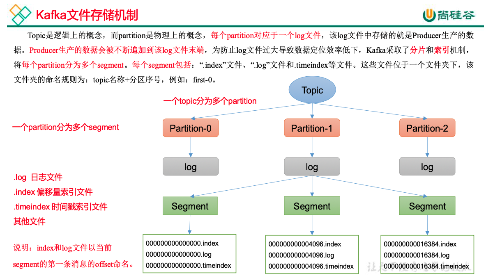
>
> 5. 页缓存 + 零拷贝技术
>
>    **零拷贝**：Kafka的数据加工处理操作交由Kafka生产者和Kafka消费者处理。Kafka Broker应用层不关心存储的数据，所以就不用走应用层，传输效率高。
>
>    **PageCache**页缓存：Kafka重度依赖底层操作系统提供的PageCache功能。当上层有写操作时，操作系统只是将数据写入
>
>    PageCache。当读操作发生时，先从PageCache中查找，如果找不到，再去磁盘中读取。实际上PageCache是把尽可能多的空闲内存都当做了磁盘缓存来使用。

### 7. Kafka consumer

> 1. 工作流程
>
>    Consumer Group（CG）：消费者组，由多个consumer组成。形成一个消费者组的条件，是所有消费者的groupid相同。
>
>    • 消费者组内每个消费者负责消费不同分区的数据，一个分区只能由一个组内消费者消费。
>
>    • 消费者组之间互不影响。所有的消费者都属于某个消费者组，即消费者组是逻辑上的一个订阅者。
>
>    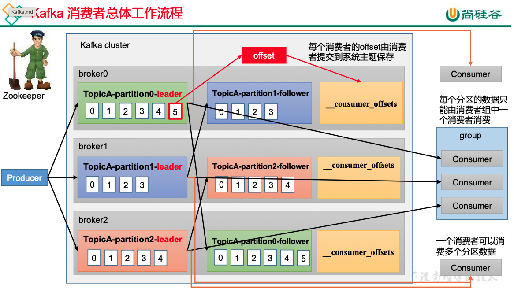
>
> 2. 消费者组初始化流程
>
>    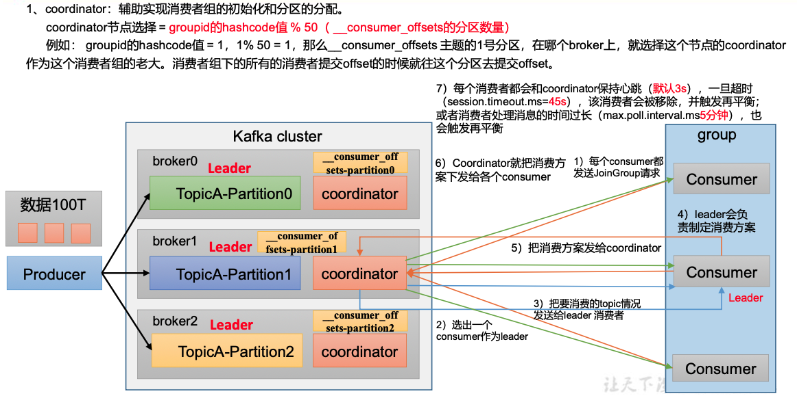
>
>    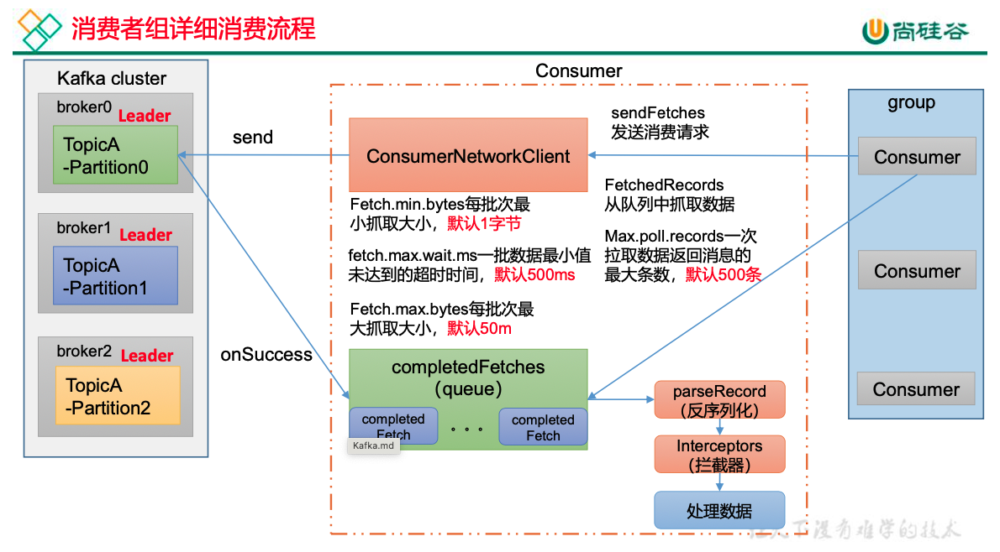

### 8. Kafka consumer分区策略以及再平衡

> 1. 一个consumer group中有多个consumer组成，一个 topic有多个partition组成，现在的问题是，到底由哪个consumer来消费哪个partition的数据。
>
> 2. Kafka有四种主流的分区分配策略： Range、RoundRobin、Sticky、CooperativeSticky。可以通过配置参数partition.assignment.strategy，修改分区的分配策略。**默认策略是Range + CooperativeSticky**。Kafka可以同时使用多个分区分配策略。
>
>    1. **Range** 分区策略
>
>       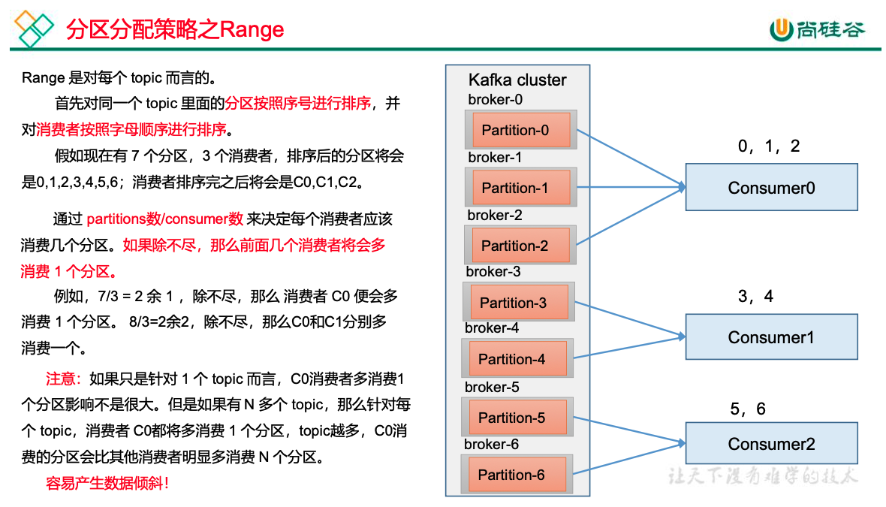
>
>    2. **RoundRobin** 分区策略
>
>       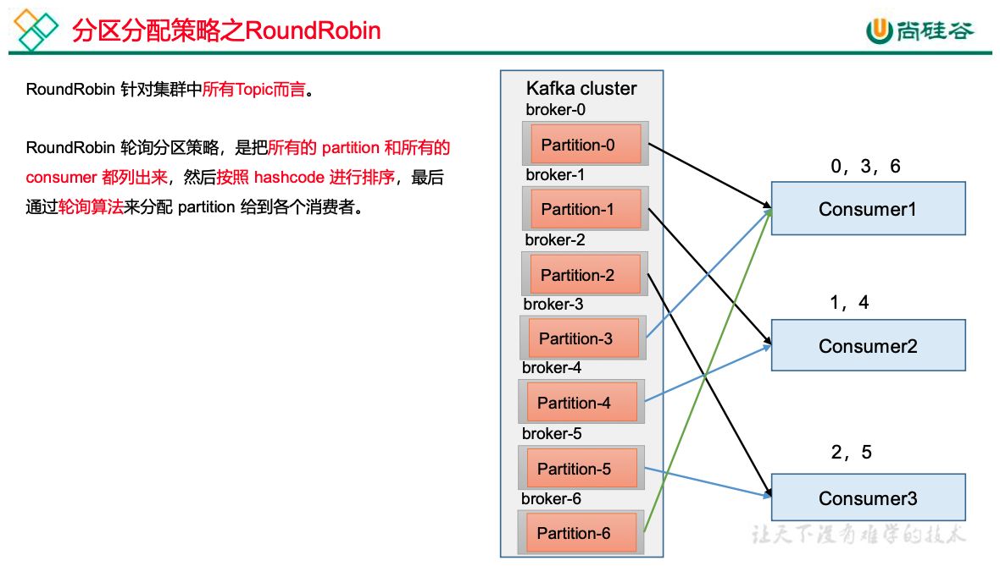
>
>    3. **Sticky**
>
>       粘性分区定义：可以理解为分配的结果带有“粘性的”。即在执行一次新的分配之前，考虑上一次分配的结果，尽量少的调整分配的变动，可以节省大量的开销。在出现同一消费者组内消费者出现问题的时候，会尽量保持原有分配的分区不变化。

### 9. Cousumer offset

> 从0.9版本开始，consumer默认将offset保存在Kafka一个内置的topic中，该topic为__consumer_offsets. __consumer_offsets 主题里面采用 key 和 value 的方式存储数据。key 是 group.id+topic+分区号，value 就是当前 offset 的值。每隔一段时间，kafka 内部会对这个 topic 进行compact，也就是每个group.id+topic+分区号就保留最新数据。
>
> 1. 为了使我们能够专注于自己的业务逻辑，Kafka提供了自动提交offset的功能。自动提交offset的相关参数：
>
>    **enable.auto.commit**：是否开启自动提交offset功能，默认是true
>
>     **auto.commit.interval.ms**：自动提交offset的时间间隔，默认是5s
>
> 2. 手动提交offset
>
>    手动提交offset的方法有两种：分别是commitSync（同步提交）和commitAsync（异步提交）。两者的相同点是，都会将本次提交的一批数据最高的偏移量提交；不同点是，同步提交阻塞当前线程，一直到提交成功，并且会自动失败重试（由不可控因素导致，也会出现提交失败）；而异步提交则没有失败重试机制，故有可能提交失败。
>
>    1. 同步提交**offset**由于同步提交 offset 有失败重试机制，故更加可靠，但是由于一直等待提交结果，提交的效率比较低。
>    2. 异步提交**offset**虽然同步提交 offset 更可靠一些，但是由于其会阻塞当前线程，直到提交成功。因此吞吐量会受到很大的影响。因此更多的情况下，会选用异步提交 offset 的方式
>
> 指定 **Offset** 消费：
>
> 1. auto.offset.reset = earliest | latest | none 默认是latest。当 Kafka 中没有初始偏移量（消费者组第一次消费）或服务器上不再存在当前偏移量时（例如该数据已被删除）
>
>    （1）earliest：自动将偏移量重置为最早的偏移量，--from-beginning。
>
>    （2）latest（默认值） ：自动将偏移量重置为最新偏移量
>
>    （3）none：如果未找到消费者组的先前偏移量，则向消费者抛出异常。
>
>    （4）任意指定offset 位移开始消费
>
> 指定**时间**消费：
>
> ​	在生产环境中，会遇到最近消费的几个小时数据异常，想重新按照时间消费。
>
> 漏消费和重复消费（使用**消费者事务**解决）：
>
> ​	重复消费：已经消费了数据，但是 offset 没提交。
>
> ​	漏消费：先提交offset 后消费，有可能会造成数据的漏消费。
>
> ​	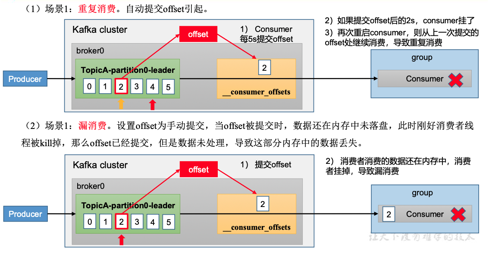
>
> 

### 10. how to improve the speed of comsuming data

> 1）如果是Kafka消费能力不足，可以考虑增加Topic的分区数，并且同时提升消费组的消费者数量，消费者数= 分区数（缺一不可）
>
> 2）如果是下游的数据处理不及时：提高每批次拉取的数量。批次拉取数据过少（拉取数据/处理时间 < 生产速度），使处理的数据小于生产的数据，也会造成数据积压。
>
> `fetch.max.bytes`
>
> `max.poll.records`

### 11. Kafka 总体调优

> 1. 如何提升吞吐量
>
>    > 1. 提升生产吞吐量
>    >
>    >    > （1）buffer.memory：发送消息的缓冲区大小，默认值是32m，可以增加到64m。
>    >    >
>    >    > （2） batch.size：默认是 16k。如果batch 设置太小，会导致频繁网络请求，吞吐量下降；如果batch 太大，会导致一条消息需要等待很久才能被发送出去，增加网络延时。
>    >    >
>    >    > （3）linger.ms，这个值默认是 0，意思就是消息必须立即被发送。一般设置一个 5-100毫秒。如果linger.ms 设置的太小，会导致频繁网络请求，吞吐量下降；如果 linger.ms 太长，会导致一条消息需要等待很久才能被发送出去，增加网络延时。
>    >    >
>    >    > （4）compression.type：默认是 none，不压缩，但是也可以使用 lz4 压缩，效率还是不错的，压缩之后可以减小数据量，提升吞吐量，但是会加大 producer 端的CPU 开销。
>    >
>    > 2. 增加分区
>    >
>    > 3. 消费者提高吞吐量
>    >
>    >    > （1）调整fetch.max.bytes 大小，默认是50m。
>    >    >
>    >    > （2）调整max.poll.records 大小，默认是500 条。
>    >
>    > 4. 增加下游消费者处理能力
>
> 2. 数据精准一次
>
>    > 1）生产者角度
>    >
>    > acks 设置为-1 （acks=-1）。
>    >
>    > 幂等性（enable.idempotence = true） + 事务 。
>    >
>    > 2）broker 服务端角度
>    >
>    > 分区副本大于等于 2 （--replication-factor 2）。
>    >
>    > ISR 里应答的最小副本数量大于等于 2 （min.insync.replicas = 2）。
>    >
>    > **3**）消费者
>    >
>    > 事务 + 手动提交 offset （enable.auto.commit = false）。
>    >
>    > 消费者输出的目的地必须支持事务（MySQL、Kafka）。
>
> 3.  合理设置分区数
>
>     > （1）创建一个只有1 个分区的topic。
>     >
>     > （2）测试这个topic 的producer 吞吐量和consumer 吞吐量。
>     >
>     > （3）假设他们的值分别是 Tp 和Tc，单位可以是MB/s。
>     >
>     > （4）然后假设总的目标吞吐量是 Tt，那么分区数 = Tt / min（Tp，Tc）。
>     >
>     > 例如：producer 吞吐量 = 20m/s；consumer 吞吐量 = 50m/s，期望吞吐量100m/s；
>     >
>     > 分区数 = 100 / 20 = 5 分区
>     >
>     > 分区数一般设置为：3-10 个
>     >
>     > 分区数不是越多越好，也不是越少越好，需要搭建完集群，进行压测，再灵活调整分区
>     >
>     > 个数