## 1. NoSQL

### 1.1 NoSQL definition 

> 1.  NoSQL is an approach to database design that enables the storage and querying of data outside the traditional structures found in relational databases.
>
> 2. 根据定义**结构化数据指的是由二维表结构来逻辑表达和实现的数据，严格遵循数据格式与长度规范，也称作为行数据**，特点为：数据以行为单位，一行数据表示一个实体的信息，每一行数据的属性是相同的。
>
>    因此关系型数据库完美契合结构化数据的特点，关系型数据库也是关系型数据最主要的存储与管理引擎。
>
>    非结构化数据，指的是**数据结构不规则或不完整，没有任何预定义的数据模型，不方便用二维逻辑表来表现的数据**，例如办公文档（Word）、文本、图片、HTML、各类报表、视频音频等。
>
>    介于结构化与非结构化数据之间的数据就是半结构化数据了，它是结构化数据的一种形式，虽然**不符合二维逻辑这种数据模型结构，但是包含相关标记，用来分割语义元素以及对记录和字段进行分层**。常见的半结构化数据有XML和JSON
>
> 3. 适用场景
>
>    > **数据库表 schema 经常变化**
>    > 比如在线商城，维护产品的属性经常要增加字段，这就意味着 ORMapping 层的代码和配置要改，如果该表的数据量过百万，新增字段会带来额外开销（重建索引等）。
>    >
>    > **数据库表字段是复杂数据类型**
>    > 对于复杂数据类型，比如 SQL Sever 提供了可扩展性的支持，像 xml 类型的字段。DB 层对 xml 字段很难建高效索引，应用层又要做从字符流到 dom 的解析转换。NoSQL 以 json 方式存储，提供了原生态的支持，在效率方便远远高于传统关系型数库。
>    >
>    > **高并发数据库请求**
>    > 此类应用常见于 web2.0 的网站，很多应用对于数据一致性要求很低，而关系型数据库的事务以及大表 JOIN 反而成了”性能杀手”。
>    >
>    > **海量数据的分布式存储**
>    > 海量数据的存储如果选用大型商用数据，如 Oracle，那么整个解决方案的成本是非常高的，要花很多钱在软硬件上。NoSQL 分布式存储，可以部署在廉价的硬件上，是一个性价比非常高的解决方案。
>
> 4. **NoSQL 和关系数据库结合**
>
>    **一般把 NoSQL 和关系数据库进行结合使用，各取所长，需要使用关系特性的时候我们使用关系数据库，需要使用 NoSQL 特性的时候我们使用 NoSQL 数据库，各得其所**。NoSQL 数据库是关系数据库在某些方面（性能，扩展）的一个弥补。
>
>    举个简单的例子吧，比如用户评论的存储，评论大概有主键 id、评论的对象 aid、评论内容 content、用户 uid 等字段。我们能确定的是评论内容 content 肯定不会在数据库中用 where content=’’ 查询，评论内容也是一个大文本字段。那么我们可以把主键 id、评论对象 aid、用户 id 存储在数据库，评论内容存储在 NoSQL，这样数据库就节省了存储 content 占用的磁盘空间，从而节省大量 IO，对 content 也更容易做 Cache。另外，**可使用 NoSQL 作为缓存服务器**。MySQL + Memcached 的架构中，Memcached 这类内存缓存服务器缓存的数据大小受限于内存大小，如果用 NoSQL 来代替 Memcached 来缓存数据库的话，就可以不再受限于内存大小。虽然可能有少量的磁盘IO读写，可能比 Memcached 慢一点，但是完全可以用来缓存数据库的查询操作。

### 1.2 NoSQL vs SQL

> SQL 
>
> 1. Advantages（优点）
>
>    > * table is easy to understand.
>    > * 数据一致性（Data consistence），支持ACID
>    > * 复杂查询
>
> 2. Disadvantages（缺点）
>
>    > - **高并发下IO压力大**, 数据按行存储，即使只针对其中某一列进行运算，也会将整行数据从存储设备中读入内存，导致IO高
>    > - **为维护索引付出的代价大**, 为了提供丰富的查询能力，通常热点表都会有多个二级索引，一旦有了二级索引，数据的新增必然伴随着所有二级索引的新增，数据的更新也必然伴随着所有二级索引的更新，
>    > - **维护数据一致性付出的代价大**, 对于并发控制，其核心思想就是加锁，无论是乐观锁还是悲观锁，只要提供的隔离级别越高，那么读写性能必然越差
>    > - **水平扩张（scalability）差，表结构扩张不方便**
>    > - **全文搜索功能弱** 例如like "%中国真伟大%"，只能搜索到"2019年中国真伟大，爱祖国"，无法搜索到"中国真是太伟大了"这样的文本。
>
> NoSQL
>
> 1. Advantages（优点）
>    - **读写性能**：无需经过 SQL 层的解析，读写性能很高。主要例子有Redis，由于其逻辑简单，而且纯内存操作，使得其性能非常出色，单节点每秒可以处理超过10万次读写操作；
>    - **简单的扩展**：基于键值对，数据没有耦合性，容易扩展。典型例子是 Cassandra，由于其架构是类似于经典的 P2P，所以能通过轻松地添加新的节点来扩展这个集群；
>    - **存储格式多**：支持key-value形式、文档形式、图片形式，而关系型数据库则只支持基础类型；
>    - **低廉的成本**：这是大多数分布式数据库共有的特点，因为主要都是开源软件，没有昂贵的License成本
> 2. Disadvantages（缺点）
>    - **支持的特性不够丰富**：现有产品所提供的功能都比较有限，大多数 NoSQL 数据库都不支持事务，也不像 MS SQL Server 和 Oracle 那样能提供各种附加功能，比如 BI 和报表等

### 1.3. NoSQL 类型

> 1. **KV型NoSql（代表----Redis）**
>
> > KV型NoSql顾名思义就是以键值对形式存储的非关系型数据库。Redis、MemCache是其中的代表，Redis又是KV型NoSql中应用最广泛的NoSql，KV型数据库以Redis为例，最大的优点我总结下来就两点：
> >
> > - 数据基于内存，读写效率高
> > - KV型数据，时间复杂度为O(1)，查询速度快
> >
> > 因此，KV型NoSql最大的优点就是**高性能**，利用Redis自带的BenchMark做基准测试，TPS可达到10万的级别，性能非常强劲。同样的Redis也有所有KV型NoSql都有的比较明显的缺点：
> >
> > - 只能根据K查V，无法根据V查K
> > - 查询方式单一，只有KV的方式，不支持条件查询，多条件查询唯一的做法就是数据冗余，但这会极大的浪费存储空间
> > - 内存是有限的，无法支持海量数据存储
> > - 同样的，由于KV型NoSql的存储是基于内存的，会有丢失数据的风险
> >
> > 综上所述，KV型NoSql最合适的场景就是**缓存**的场景：
> >
> > - 读远多于写
> > - 读取能力强
> > - 没有持久化的需求，可以容忍数据丢失，反正丢了再查询一把写入就是了
> >
> > 例如根据用户id查询用户信息，每次根据用户id去缓存中查询一把，查到数据直接返回，查不到去关系型数据库里面根据id查询一把数据写到缓存中去。
>
> 2. **搜索型NoSql（代表----ElasticSearch）**
>
> > 传统关系型数据库主要通过索引来达到快速查询的目的，但是在全文搜索的场景下，索引是无能为力的，**搜索型NoSql的诞生正是为了解决关系型数据库全文搜索能力较弱的问题**，ElasticSearch是搜索型NoSql的代表产品。全文搜索的原理是**倒排索引**。
> >
> > 搜索型数据库还有一种特别重要的应用场景。我们可以想，一旦对数据库做了分库分表后，原来可以在单表中做的聚合操作、统计操作是否统统失效？例如我把订单表分16个库，1024张表，那么订单数据就散落在1024张表中，我想要统计昨天浙江省单笔成交金额最高的订单是哪笔如何做？我想要把昨天的所有订单按照时间排序分页展示如何做？**这就是搜索型NoSql的另一大作用了，我们可以把分表之后的数据统一打在搜索型NoSql中，利用搜索型NoSql的搜索与聚合能力完成对全量数据的查询**
> >
> > 优点为：
> >
> > - 支持分词场景、全文搜索，这是区别于关系型数据库最大特点
> > - 支持条件查询，支持聚合操作，类似关系型数据库的Group By，但是功能更加强大，适合做数据分析
> > - 数据写文件无丢失风险，在集群环境下可以方便横向扩展，可承载PB级别的数据
> > - 高可用，自动发现新的或者失败的节点，重组和重新平衡数据，确保数据是安全和可访问的
> >
> > 缺点：
> >
> > - 性能全靠内存来顶，也是使用的时候最需要注意的点，非常吃硬件资源、吃内存，大数据量下64G + SSD基本是标配，算得上是数据库中的爱马仕了。ElasticSearch内存用在什么地方，大概有如下这些：
> >   - Indexing Buffer----ElasticSearch基于Luence，Lucene的倒排索引是先在内存里生成，然后定期以Segment File的方式刷磁盘的，每个Segment File实际就是一个完整的倒排索引
> >   - Segment Memory----倒排索引前面说过是基于关键字的，Lucene在4.0后会将所有关键字以FST这种数据结构的方式将所有关键字在启动的时候全量加载到内存，加快查询速度，官方建议至少留系统一半内存给Lucene
> >   - 各类缓存----Filter Cache、Field Cache、Indexing Cache等，用于提升查询分析性能，例如Filter Cache用于缓存使用过的Filter的结果集
> >   - Cluter State Buffer----ElasticSearch被设计为每个Node都可以响应用户请求，因此每个Node的内存中都包含有一份集群状态的拷贝，一个规模很大的集群这个状态信息可能会非常大
> > - 读写之间有延迟，写入的数据差不多1s样子会被读取到，这也正常，写入的时候自动加入这么多索引肯定影响性能
> > - 数据结构灵活性不高，ElasticSearch这个东西，字段一旦建立就没法修改类型了，只能把整个表删了再重建
>
> 3. **列式NoSql（代表----HBase，Cassandra）**
>
> > 列式NoSql是基于列式存储的，那么什么是列式存储呢，列式NoSql和关系型数据库一样都有主键的概念，区别在于关系型数据库是按照行组织的数据：
> >
> > 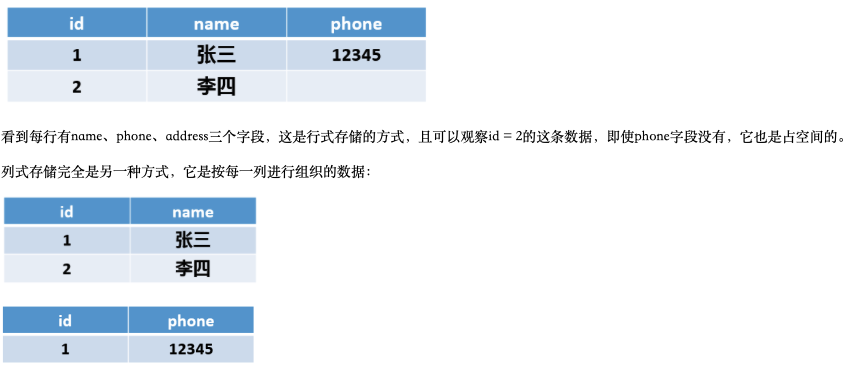
> >
> > 优点：
> >
> > > - 查询时只有指定的列会被读取，不会读取所有列
> > >
> > > - 存储上节约空间，Null值不会被存储，一列中有时候会有很多重复数据（尤其是枚举数据，性别、状态等），这类数据可压缩，行式数据库压缩率通常在3:1到5:1之间， 列试一般在8:1 到 30:1左右
> > >
> > >   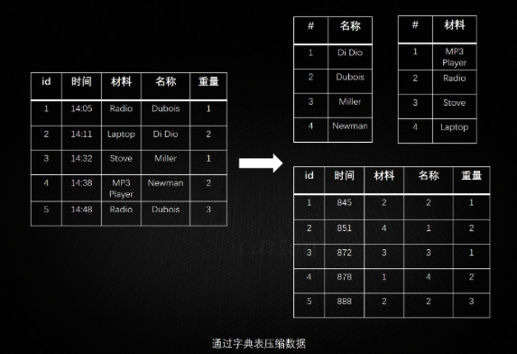
> > >
> > > - 列数据被组织到一起，一次磁盘IO可以将一列数据一次性读取到内存中
> > >
> > > - 海量数据无限存储，PB级别数据随便存，底层基于HDFS（Hadoop文件系统），数据持久化
> > >
> > > - 读写性能好，只要没有滥用造成数据热点，读写基本随便玩
> > >
> > > - 横向扩展在关系型数据库及非关系型数据库中都是最方便的之一，只需要添加新机器就可以实现数据容量的线性增长，且可用在廉价服务器上，节省成本
> > >
> > > - 本身没有单点故障，可用性高
> > >
> > > - 可存储结构化或者半结构化的数据
> > >
> > > - 列数理论上无限，HBase本身只对列族数量有要求，建议1~3个
> >
> > 缺点：
> >
> > > - HBase是Hadoop生态的一部分，因此它本身是一款比较重的产品，依赖很多Hadoop组件，运维还是有点复杂的
> > > - KV式，不支持条件查询，或者说条件查询非常非常弱吧，HBase在Scan扫描一批数据的情况下还是提供了前缀匹配这种API的，条件查询除非定义多个RowKey做数据冗余
> > > - 不支持分页查询，因为统计不了数据总数
>
> 4. **文档型NoSql（代表----MongoDB）**
>
> > 对于MongDB，我们只要理解成一个Free-Schema的关系型数据库就完事了，它的优缺点比较一目了然，优点：
> >
> > - 没有预定义的字段，扩展字段容易
> > - 相较于关系型数据库，读写性能优越，命中二级索引的查询不会比关系型数据库慢，对于非索引字段的查询则是全面胜出
> >
> > 缺点在于：
> >
> > - 不支持事务操作，虽然Mongodb4.0之后宣称支持事务，但是效果待观测
> > - 多表之间的关联查询不支持（虽然有嵌入文档的方式），join查询还是需要多次操作
> > - 空间占用较大，这个是MongDB的设计问题，空间预分配机制 + 删除数据后空间不释放，只有用db.repairDatabase()去修复才能释放
> > - 目前没发现MongoDB有关系型数据库例如MySql的Navicat这种成熟的运维工具

## 2. Cassandra

### 2.1 Cassandra 介绍

> **1. 特点：**
>
> - 弹性可扩展性– Cassandra具有高度可扩展性；它允许添加更多硬件，以根据需求容纳更多客户和更多数据。
> - 始终在线-Cassandra没有单点故障，并且可以连续用于无法承受故障的关键业务应用程序。
> - 快速的线性规模性能-Cassandra具有线性可扩展性，即，随着集群中节点数量的增加，它可以提高吞吐量。因此，它保持了快速的响应时间。
> - 灵活的数据存储-Cassandra可容纳所有可能的数据格式，包括：结构化，半结构化和非结构化。它可以根据需要动态适应对数据结构的更改。
> - 轻松进行数据分发-Cassandra通过在多个数据中心之间复制数据，提供了在所需位置分发数据的灵活性。
> - 事务支持-Cassandra支持原子性，一致性，隔离性和持久性（ACID）等属性。
> - 快速写入-Cassandra旨在在廉价的商品硬件上运行。它执行快速的写入，并且可以存储数百TB的数据，而不会牺牲读取效率。
>   - 数据写入操作密集
>   - 数据修改操作很少
>   - 通过主键查询
>   - 需要对数据进行分区存储
>
> **2. 适用场景：**
>
> - 存储日志型数据
> - 类似物联网的海量数据
> - 对数据进行跟踪
>
> **3. 一致性哈希** 
>
> 一致性哈希是Cassandra搭建集群的基础，一致性哈希可以降低分布式系统中，数据重新分布的影响。
>
> 在Cassandra中，每个表有Primary Key外，还有一个叫做Partition Key，Partition Key列的Value会通过Cassandra一致性算法得出一个哈希值，这个哈希值将决定这行数据该放到哪个节点上。
>
> 每个节点拥有一段数字区间，这个区间的含义是：如果某行记录的Partition Key的哈希值落在这个区间范围之内，那么该行记录就该被存储到这个节点上。
>
> 如果简单的使用哈希值，可能会引起数据分布不均匀的问题，为了解决这个问题，一致性哈希提出虚拟节点的概念，简单的理解就是：将某个节点根据一个映射算法，映射出若干个虚拟子节点出来，再把这些节点分布在哈希环上面，保存数据时，如果通过一致性哈希计算落到某个虚拟子节点上，这条记录就会被存在这个虚拟子节点的母节点上。
>
> Token：在Cassandra，每个节点都对应一个token，相当于hash环中的一个节点地址。在Cassandra的配置文件中有一项配置叫做:**num_tokens**，这个配置项可以控制一个节点映射出来的虚拟节点的个数。
>
> Range：在Cassandra中，每一个节点负责处理hash环的一段数据，范围是从上一个节点的Token到本节点Token，这就是Range
>
> 在健康的集群中，可以通过自带的工具nodetool查看集群的哈希环具体情况，命令为:**nodetool ring**。
>
> 这里我们使用cassandra官方文档中一张图来说明
>
> [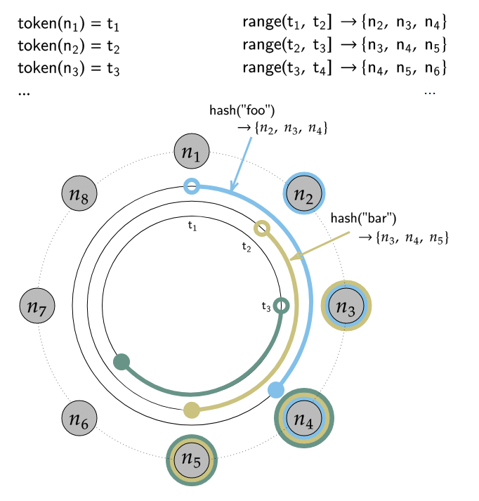](https://github.com/ZhiyongJing/techs/blob/master/大数据技术栈/数据存储/cassandra入门与实战/assets/1593432222.png)
>
> ### Gossip内部通信协议
>
> 
>
> Cassandra使用Gossip的协议维护集群的状态，这是个端对端的通信协议。通过Gossip，每个节点都能知道集群中包含哪些节点，以及这些节点的状态，
>
> Gossip进程每秒运行一次，与最多3个其他节点交换信息，这样所有节点可很快了解集群中的其他节点信息。

### 2.2 Cassandra 术语

> **data目录**:用于存储真正的数据文件，即后面将要讲到的SSTable文件。如果服务器有多个磁盘，可以指定多个目录，每一个目录都在不同的磁盘中。这样Cassandra就可以利用更多的硬盘空间。在data目录下，Cassandra 会将每一个 Keyspace 中的数据存储在不同的文件目录下，并且 Keyspace 文件 目录的名称与 Keyspace 名称相同。假设有两个 Keyspace，分别为 ks1 和 ks2，但在 data目录下，将看到3个不同的目录：ks1，ks2和 system。其中 ks1 和 ks2 用于存储系统定义的两个 Keyspace 的数据，另外一个 system 目录是 Cassandra 系统默认的一个 Keyspace，叫做 system，它用来存储 Cassandra 系统的相关元数据信息以及 HINT 数据信息。
>
> **commitlog目录**: 用于存储未写人SSTable中的数据，每次Cassandra系统中有数据写入，都会先将数据记录在该日志文件中，以保证Cassandra在任何情况下宕机都不会丢失数据。如果服务器有足够多的磁盘，可以将本目录设置在一个与data目录和cache目录不同的磁盘中，以提升读写性能。
>
> **cache目录**: 用于存储系统中的缓存数据。可以在cassandra. yaml文件中定义Column Family的属性中定义与缓存相关的信息，如缓存数据的大小(对应配置文件中的keys_cached和rOws_ cached)、 持久化缓存数据的时间间隔(对应配置文件中的row cache_save_ period in. seconds 和key. cache save period in seconds)等。当Cassandra系统重启的时候，会从该目录下加载缓存数据。如果服务器有足够多的磁盘空间，可以将本目录设置在一个与data目录和commitlog目录不同的磁盘中，以提升读写性能。
>
> **Cluster：**Cassandra数据库分布在多台计算机上。最外层的容器称为cluster。为了进行故障处理，每个节点都包含一个副本，如果发生故障，则由副本负责。 Cassandra以环形格式将节点排列在cluster中，并为其分配数据。
>
> **Keyspace：**Keyspace是Cassandra中数据的最外层容器。相当于数据库，我们创建一个键空间就是创建了一个数据库。Cassandra中Keyspace的基本属性是 -
>
> - **Replication factor** − 集群中将接收相同数据副本的计算机数。
> - **Replica placement strategy** − 将副本放置在环中的策略。我们有诸如简单策略（机架感知策略），旧网络拓扑策略（机架感知策略）和网络拓扑策略（数据中心共享策略）之类的策略。
> - **Column families** − Keyspace是一个或多个Column family的容器。Column family又是行集合的容器。每行包含有序的列。Column family代表数据的结构。每个Keyspace至少有一个Column family，通常有许多Column family。
>
> **Column Family：**是用于有序收集行的容器。每行又是列的有序集合。2种类型
>
> - 静态column family(static column family)：字段名是固定的，比较适合对于这些column都有预定义的元数据
> - 动态column family(dynamic column family)：字段名是应用程序计算出来并且提供的，所以column family只能定义这些字段的类型，无法不可以指定这些字段的名字和值，这些名字和值是由应用程序插入某字段才得出的。
>
> Cassandra Column Family具有以下属性 - 
>
> - **keys_cached** − 它代表每个SSTable保持缓存的位置数。
>
> - **rows_cached** − 它代表其全部内容将被缓存在内存中的行数。
>
> - **preload_row_cache** − 它指定是否要预填充行缓存。
>
>   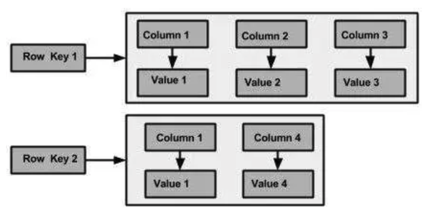
>
> **Row key：**ColumnFamily 中的每一行都用Row Key（行键）来标识，这个相当于关系数据库表中的主键，并且总是被索引的。
>
> **主键：**Cassandra可以使用**PRIMARY KEY** 关键字创建主键，主键分为2种
>
> - Single column Primary Key，如果 Primary Key 由一列组成，那么称为 Single column Primary Key
> - Composite Primary Key，如果由多列组成，那么这种情况称为 Compound Primary Key 或 Composite Primary Key
>
> **Cassandra key(索引)种类：**
>
> - **Primary Key** 主键， 是用来获取某一行的数据， 可以是Single column Primary Key， 或者Composite Primary Key
>
>   以下情况不要使用pk:
>
>   - 这列的值很多的情况下，因为你相当于查询了一个很多条记录，得到一个很小的结果。
>   - 表中有couter类型的列
>   - 频繁更新和删除的列
>   - 在一个很大的分区中去查询一条记录的时候（也就是不指定分区主键的查询）
>
> - **Composite/Compound Key** 复合key, Primary Key 由多列组成
>
> - **Partition Key** 分区Key, 在组合主键的情况下(上面的例子)，第一部分称作Partition Key（key_one就是partition key），第二部分是CLUSTERING KEY（key_two, Cassandra会对Partition key 做一个hash计算，并自己决定将这一条记录放在哪个节点。
>
>   如果 Partition key 由多个字段组成，称之为 Composite Partition key
>
>   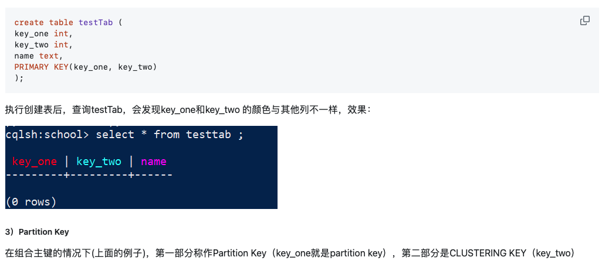
>
> - **Clustering Key** 决定同一个分区内相同 Partition Key 数据的排序，默认为升序，可以在建表语句里面手动设置排序的方式
>
> **Column：**列是Cassandra的基本数据结构，具有三个值，即键或列名，值和时间戳。下面给出的是列的结构。
> 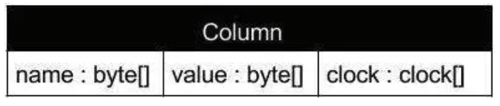
>
> **SuperColumn：**超级列是特殊列，因此，它也是一个键值对。但是超级列存储子列的映射。通常，Column Family存储在磁盘上的单个文件中。因此，为了优化性能，将可能要查询的列保持在同一Column Family中很重要，在此超级列可能会有所帮助。
>
> 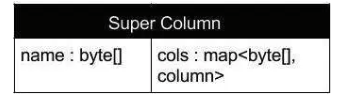
>
> - **Index:** Cassandra之中的索引的实现相对MySQL的索引来说就要简单粗暴很多了。Cassandra自动新创建了一张表格，同时将原始表格之中的索引字段作为新索引表的Primary Key！并且存储的值为原始数据的Primary Key.
> - 查询时使用索引Cassandra对查询时使用索引有一定的要求，具体如下：
>
> > - **Primary Key 只能用 = 号查询**
> > - **第二主键 支持= > < >= <=**
> > - **索引列 只支持 = 号**
> > - 非索引非主键字段过滤**可以使用ALLOW FILTERING**

### 2.3 Cassandra 语法

> ```cassandra
> -- 1. 创建keyspace(数据库)
> Create keyspace [KeyspaceName] with replicaton={'class':[strategy name],'replication_factor': [No of replications on different nodes]};
> CREATE KEYSPACE school WITH replication = {'class':'SimpleStrategy', 'replication_factor' : 3};
> use school;
> 
> -- 2. 修改keyspace
> ALTER KEYSPACE <identifier> WITH <properties>
> 
> -- 3.创建table表 with primary key
> CREATE TABLE student(
>    id int PRIMARY KEY,  --key(键)，可以由1个或多个column组合而成。
>    name text,  
>    age int,  
>    gender tinyint,  
>    address text ,
>    interest set<text>,
>    phone list<text>,
>    education map<text, text>
> );
> 
> -- 4. 创建表with Composite Primary Key
> create table testTab (
>   key_part_one int,
>   key_part_two int,
>   key_clust_one int,
>   key_clust_two int,
>   key_clust_three uuid,
>   name text,
> PRIMARY KEY((key_part_one,key_part_two), key_clust_one, key_clust_two, key_clust_three)
> );
> 
> -- 5. 修改表
> ALTER TABLE student ADD[Drop] email text;
> 
> --6. 创建索引
> CREATE INDEX sname ON student (name);
> 
> -- 7. 添加数据， 可以设置ttl, 到时间自动删除
> INSERT INTO student (id,address,age,gender,name,interest, phone,education) VALUES (1030,'朝阳路30号',20,1,'Cary',{'运动', '游戏'},['020-7777888','139876667556'],{'小学' :'第30小学','中学':'第30中学'}) USING TTL 60;
> 
> -- 8. 更新数据
> UPDATE student set gender = 1 where student_id= 1012; --更新普通数据
> UPDATE student SET interest = interest + {'游戏'} WHERE student_id = 1012; -- 更新set  数据
> UPDATE student SET interest = interest - {'电影'} WHERE student_id = 1012; -- 从set删除数据
> UPDATE student SET phone = ['020-66666666', '13666666666'] WHERE student_id = 1012; --更新list数据
> UPDATE student SET education=
> 	{'中学': '城市第五中学', '小学': '城市第五小学'} WHERE student_id = 1012;--更新map数据
> ```

### 2.4 Cassandra 数据存储

> Cassandra写数据时，首先会将请求写入Commit Log以确保数据不会丢失，然后再写入内存中的Memtable，超过内存容量后再将内存中的数据刷到磁盘的SSTable，并定期异步对SSTable做数据合并(Compaction)以减少数据读取时的查询时间。因为写入操作只涉及到顺序写入和内存操作，因此有非常高的写入性能。而进行读操作时，Cassandra支持像LevelDB一样的实现机制，数据分层存储，将热点数据放在Memtable和相对小的SSTable中，所以能实现较高的读性能
>
> Cassandra的数据包括在内存中的和磁盘中的数据，这些数据主要分为三种：
>
> > CommitLog：主要记录客户端提交过来的数据以及操作。这种数据被持久化到磁盘中，方便数据没有被持久化到磁盘时可以用来恢复。
> >
> > Memtable：用户写的数据在内存中的形式，它的对象结构在后面详细介绍。其实还有另外一种形式是BinaryMemtable 这个格式目前 Cassandra 并没有使用，这里不再介绍了。
> >
> > SSTable：数据被持久化到磁盘，又分为 Data、Index 和 Filter 三种数据格式。
>
> **CommitLog 数据格式** 
>
> Cassandra在写数据之前，需要先记录日志，保证Cassandra在任何情况下宕机都不会丢失数据，这就是CommitLog日志。要写入的数据按照一定格式组成 byte 组数，写到 IO 缓冲区中定时的被刷到磁盘中持久化。**Commitlog是server级别的**。每个Commitlog文件的大小是固定的，称之为一个CommitlogSegment。
>
> 当一个Commitlog文件写满以后，会新建一个的文件。当旧的Commitlog文件不再需要时，会自动清除。
>
> **Memtable 内存中数据结构** 
>
> 数据写入的第二个阶段，MemTable是一种内存结构，当数据量达到块大小时，将批量flush到磁盘上，存储为SSTable。优势在于将随机IO写变成顺序IO写，降低大量的写操作对于存储系统的压力。每一个columnfamily对应一个memtable。也就是每一张表对应一个。用户写的数据在内存中的形式，
>
> **SSTable 数据格式** 
>
> SSTable是Read Only的，且一般情况下，一个ColumnFamily会对应多个SSTable，当用户检索数据时，Cassandra使用了Bloom Filter，即通过多个hash函数将key映射到一个位图中，来快速判断这个key属于哪个SSTable。
>
> 为了减少大量SSTable带来的开销，Cassandra会定期进行compaction，简单的说，compaction就是将同一个ColumnFamily的多个SSTable合并成一个SSTable。
>
> 在Cassandra中，compaction主要完成的任务是：
>
> 1） 垃圾回收： cassandra并不直接删除数据，因此磁盘空间会消耗得越来越多，compaction 会把标记为删除的数据真正删除；
>
> 2） 合并SSTable：compaction 将多个 SSTable 合并为一个（合并的文件包括索引文件，数据文件，bloom filter文件），以提高读操作的效率；
>
> 3） 生成 MerkleTree：在合并的过程中会生成关于这个ColumnFamily中数据的 MerkleTree，用于与其他存储节点对比以及修复数据。

## 3. Redis

### 3.1 Redis 缓存失效（cache invalidation）问题

> 1. 缓存穿透（cache penetration）
>
>    缓存穿透是指查询一个一定不存在的数据，由于缓存是不命中，将去查询数据库，但是数 据库也无此记录，我们没有将这次查询的 null 写入缓存，这将导致这个不存在的数据每次 请求都要到存储层去查询，失去了缓存的意义。在流量大时，可能 DB 就挂掉了，要是有人利用不存在的 key 频繁攻击我们的应用，这就是漏洞。
>
>    **解决方式**: 
>
>    1. 缓存空结果、并且设置短的过期时间。
>    2. 对于请求失败次数进行记录，超过一定次数后，将该数据加入黑名单
>
> 2. 缓存雪崩 （cache avalanche）
>
>    缓存雪崩是指在我们设置缓存时采用了相同的过期时间，导致缓存在某一时刻同时失 效，请求全部转发到 DB，DB 瞬时压力过重雪崩。
>
>    **解决方式**: 原有的失效时间基础上增加一个随机值，比如 1-5 分钟随机，这样每一个缓存的过期时间的 重复率就会降低，就很难引发集体失效的事件。
>
> 3. 缓存击穿（hotspot invalid）
>
>    对于一些设置了过期时间的 key，如果这些 key 可能会在某些时间点被超高并发地访问， 是一种非常“热点”的数据。这个时候，需要考虑一个问题:如果这个 key 在大量请求同时进来前正好失效，那么所 有对这个 key 的数据查询都落到 db，我们称为缓存击穿。
>
>    **解决方式**：
>
>    1. **加锁**：在缓存数据过期时可以使用锁机制，避免多个请求同时命中数据库。
>    2. **缓存预热**：在缓存数据过期前，可以使用缓存预热的方法将数据提前加载到缓存中，从而避免缓存数据过期时大量请求数据库。
>    3. **热点数据不过期**：热点数据过期时间设置为不过期，后台定时去异步刷新缓存。

### 3.2. 缓存数据一致性（data consistency）问题

> 1. 问题1: 双写
>
>    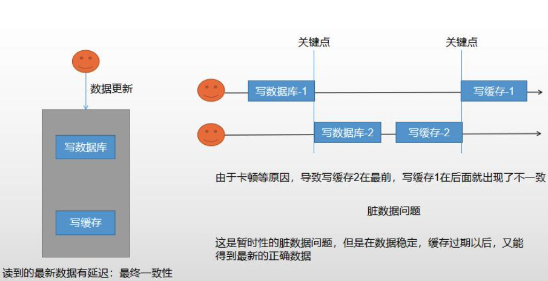
>
> 2. 问题2: 缓存一致性失效
>
>    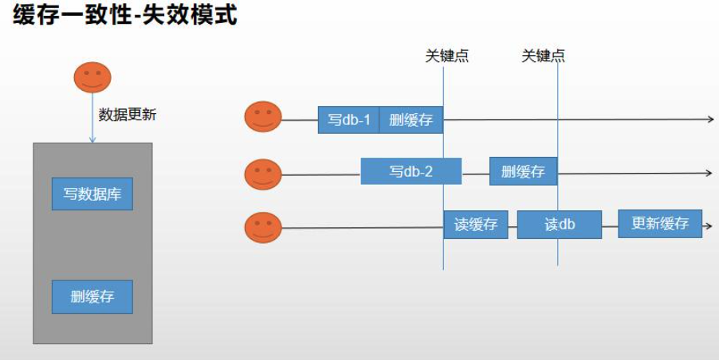
>
> **解决办法：**
>
> 1. -分布式读写锁
> 2. Canna， 更新DB， 发布消息，redis 收到更改

### 3.3 Spring Cache

>1. Cache 接口为缓存的组件规范定义，包含缓存的各种操作集合; Cache 接口下 Spring 提供了各种 xxxCache 的实现;如 RedisCache，EhCacheCache , ConcurrentMapCache 等;
>
>2. 每次调用需要缓存功能的方法时，Spring会检查检查指定参数的指定的目标方法是否已 经被调用过;如果有就直接从缓存中获取方法调用后的结果，如果没有就调用方法并缓 存结果后返回给用户。下次调用直接从缓存中获取.
>
>3. 
>     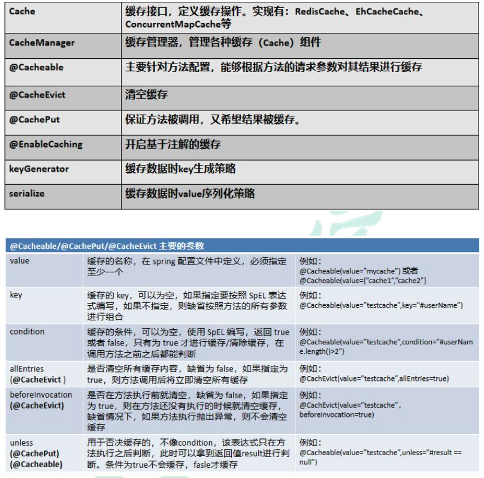
>


## 4 Elasticsearch

### 4.1 1. 全文搜索术语

> 1. **Index(索引)** 
>
>    动词，相当于 MySQL 中的 insert;  
>
>    名词，相当于 MySQL 中的 Database
>
> 2. **Type(类型)** 
>
>    在 Index(索引)中，可以定义一个或多个类型。 类似于 MySQL 中的 Table;每一种类型的数据放在一起;
>
> 3. **Document(文档)** 
>
>    保存在某个索引(Index)下，某种类型(Type)的一个数据(Document)，文档是 JSON 格 式的，Document 就像是 MySQL 中的某个 Table 里面的内容;
>
> 4. **Inverted index(倒排索引机制)**
>
>    记录每个词条出现在哪个Document， 以及在文档中的位置， 可以根据词条快速地位到包含这个词的文档以及位置。
>
>    > 倒排索引创建索引的流程：
>    >
>    > 1） 首先把所有的[原始数据](https://www.zhihu.com/search?q=原始数据&search_source=Entity&hybrid_search_source=Entity&hybrid_search_extra={"sourceType"%3A"answer"%2C"sourceId"%3A254503794})进行编号，形成文档列表
>    >
>    > 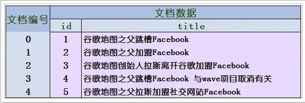
>    >
>    > 2） 把文档数据进行分词，得到很多的词条，以词条为索引。保存包含这些词条的文档的编号信息。
>    >
>    > 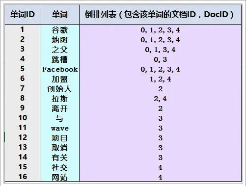
>    >
>    > 搜索的过程：
>    >
>    > 当用户输入任意的词条时，首先对用户输入的数据进行分词，得到用户要搜索的所有词条，然后拿着这些词条去倒排索引列表中进行匹配。找到这些词条就能找到包含这些词条的所有文档的编号。

