# 1. Simple Factory

## 1.1 简单工厂模式使用案例

有一种抽象产品——汽车（Car），同时有多种具体的子类产品，如BenzCar，BMWCar，LandRoverCar。类图如下
[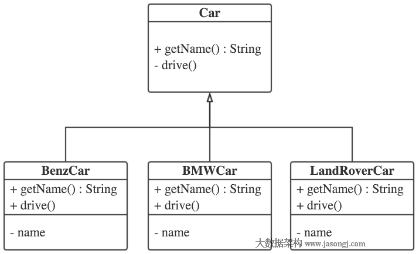](http://www.jasongj.com/img/designpattern/simplefactory/product.png)

作为司机，如果要开其中一种车，比如BenzCar，最直接的做法是直接创建BenzCar的实例，并执行其drive方法，如下

```java
public class Driver1 {

  public static void main(String[] args) {
    BenzCar car = new BenzCar();
    car.drive();
  }

}
```

此时如果要改为开Land Rover，则需要修改代码，创建Land Rover的实例并执行其drive方法。这也就意味着任何时候需要换一辆车开的时候，都必须修改客户端代码。一种稍微好点的方法是，通过读取配置文件，获取需要开的车，然后创建相应的实例并由父类Car的引用指向它，利用多态执行不同车的drive方法。如下

```
public class Driver2 {
  private static final Logger LOG = LoggerFactory.getLogger(Driver2.class);
  public static void main(String[] args) throws ConfigurationException {
    XMLConfiguration config = new XMLConfiguration("car.xml");
    String name = config.getString("driver2.name");
    Car car;

    switch (name) {
    case "Land Rover":
      car = new LandRoverCar();
      break;
    case "BMW":
      car = new BMWCar();
      break;
    case "Benz":
      car = new BenzCar();
      break;
    default:
      car = null;
      break;
    }
    LOG.info("Created car name is {}", name);
    car.drive();
  }
}
```

对于Car的使用方而言，只需要通过参数即可指定所需要Car的各类并得到其实例，同时无论使用哪种Car，都不需要修改后续对Car的操作。至此，简单工厂模式的原型已经形成。如果把上述的逻辑判断封装到一个专门的类的静态方法中，则实现了简单工厂模式。工厂代码如下

```java
public class CarFactory1 {
  
  private static final Logger LOG = LoggerFactory.getLogger(CarFactory1.class);

  public static Car newCar() {
    Car car = null;
    String name = null;
    try {
      XMLConfiguration config = new XMLConfiguration("car.xml");
      name = config.getString("factory1.name");
    } catch (ConfigurationException ex) {
      LOG.error("parse xml configuration file failed", ex);
    }
    switch (name) {
    case "Land Rover":
      car = new LandRoverCar();
      break;
    case "BMW":
      car = new BMWCar();
      break;
    case "Benz":
      car = new BenzCar();
      break;
    default:
      car = null;
      break;
    }
    LOG.info("Created car name is {}", name);
    return car;
  }
}
```

调用方代码如下

```java
package com.jasongj.client;

import com.jasongj.factory.CarFactory1;
import com.jasongj.product.Car;

public class Driver3 {

  public static void main(String[] args) {
    Car car = CarFactory1.newCar();
    car.drive();
  }

}
```


与Driver2相比，所有的判断逻辑都封装在工厂(CarFactory1)当中，Driver3不再需要关心Car的实例化，实现了对象的创建和使用的隔离。当然，简单工厂模式并不要求一定要读配置文件来决定实例化哪个类，可以把参数作为工厂静态方法的参数传入。

## 1.2 简单工厂模式进阶

### 使用反射实现扩展性

从Driver2和CarFactory1的实现中可以看到，当有新的车加入时，需要更新Driver2和CarFactory1的代码也实现对新车的支持。这就违反了`开闭原则`（Open-Close Principle）。可以利用反射（Reflection）解决该问题。

```java
public class CarFactory2 {
  
  private static final Logger LOG = LoggerFactory.getLogger(CarFactory2.class);

  public static Car newCar() {
    Car car = null;
    String name = null;
    try {
      XMLConfiguration config = new XMLConfiguration("car.xml");
      name = config.getString("factory2.class");
    } catch (ConfigurationException ex) {
      LOG.error("Parsing xml configuration file failed", ex);
    }
    
    try {
      car = (Car)Class.forName(name).newInstance();
      LOG.info("Created car class name is {}", name);
    } catch (InstantiationException | IllegalAccessException | ClassNotFoundException e) {
      LOG.error("Instantiate car {} failed", name);
    }
    return car;
  }

}
```

从上面代码中可以看到，之后如果需要引入新的Car，只需要在配置文件中指定该Car的完整类名（包括package名），CarFactory2即可通过反射将其实例化。实现了对扩展的开放，同时保证了对修改的关闭。熟悉Spring的读者应该会想到Spring IoC的实现。

### 注解让简单工厂模式不简单

上例中使用反射做到了对扩展开放，对修改关闭。但有些时候，使用类的全名不太方便，使用别名会更合适。例如Spring中每个Bean都会有个ID，引用Bean时也会通过ID去引用。像Apache Nifi这样的数据流工具，在流程上使用了职责链模式，而对于单个Processor的创建则使用了工厂，对于用户自定义的Processor并不需要通过代码去注册，而是使用注解（为了更方便理解下面这段代码，请先阅读笔者另外一篇文章[《Java系列（一）Annotation（注解）》](http://www.jasongj.com/2016/01/17/Java1_注解Annotation/)）。

下面就继续在上文案例的基础上使用注解升级简单工厂模式。

```java
public class CarFactory3 {

  private static final Logger LOG = LoggerFactory.getLogger(CarFactory3.class);

  private static Map<String, Class> allCars;

  static {
    Reflections reflections = new Reflections("com.jasongj.product");
    Set<Class<?>> annotatedClasses = reflections.getTypesAnnotatedWith(Vehicle.class);
    allCars = new ConcurrentHashMap<String, Class>();
    for (Class<?> classObject : annotatedClasses) {
      Vehicle vehicle = (Vehicle) classObject.getAnnotation(Vehicle.class);
      allCars.put(vehicle.type(), classObject);
    }
    allCars = Collections.unmodifiableMap(allCars);
  }

  public static Car newCar() {
    Car car = null;
    String type = null;
    try {
      XMLConfiguration config = new XMLConfiguration("car.xml");
      type = config.getString("factory3.type");
      LOG.info("car type is {}", type);
    } catch (ConfigurationException ex) {
      LOG.error("Parsing xml configuration file failed", ex);
    }

    if (allCars.containsKey(type)) {
      LOG.info("created car type is {}", type);
      try {
        car = (Car) allCars.get(type).newInstance();
      } catch (InstantiationException | IllegalAccessException ex) {
        LOG.error("Instantiate car failed", ex);
      }
    } else {
      LOG.error("specified car type {} does not exist", type);
    }
    return car;
  }

}
```


从上面代码中可以看到，该工厂会扫描所有被Vehicle注解的Car（每种Car都在注解中声明了自己的type，可作为该种Car的别名）然后建立起Car别名与具体Car的Class原映射。此时工厂的静态方法即可根据目标别名实例化对应的Car。

本文所有代码都可从[作者GitHub](https://github.com/habren/JavaDesignPattern/tree/master/SimpleFactoryPattern/src/main)下载.

## 1.3 简单工厂模式详解

### 简单工厂模式定义

简单工厂模式（Simple Factory Pattern）又叫静态工厂方法模式（Static FactoryMethod Pattern）。专门定义一个类（如上文中的CarFactory1、CarFactory2、CarFactory3）来负责创建其它类的实例，由它来决定实例化哪个具体类，从而避免了在客户端代码中显式指定，实现了解耦。该类由于可以创建同一抽象类（或接口）下的不同子类对象，就像一个工厂一样，因此被称为工厂类。

### 简单工厂模式类图

简单工厂模式类图如下所示
[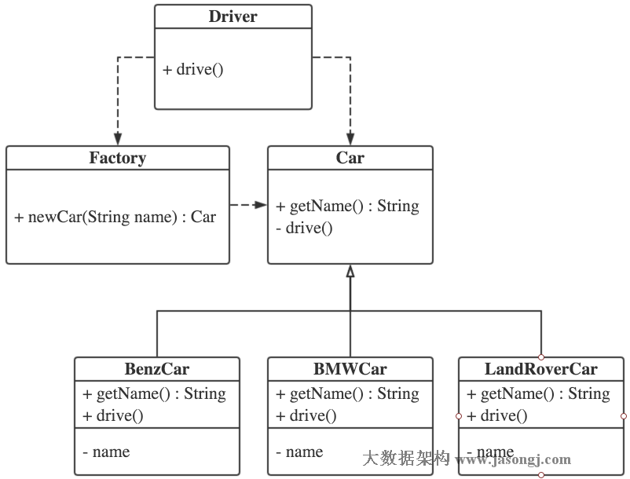](http://www.jasongj.com/img/designpattern/simplefactory/simple_factory.png)

### 简单工厂模式角色划分

- 工厂角色（如上文中的CarFactory1/2/3）：这是简单工厂模式的核心，由它负责创建所有的类的内部逻辑。当然工厂类必须能够被外界调用，创建所需要的产品对象。一般而言，工厂类提供一个静态方法，外部程序通过该方法创建所需对象。
- 抽象产品角色(如上文中的Car)：简单工厂模式所创建的是所有对象的父类。注意，这里的父类可以是接口也可以是抽象类，它负责描述所创建实例共有的公共接口。
- 具体产品角色（如上文中的BMWCar，BenzCar，LandRoverCar）：简单工厂所创建的具体实例对象，这些具体的产品往往都拥有共同的父类。

### 简单工厂模式优点

- 工厂类是整个简单工厂模式的关键所在。它包含必要的判断逻辑，能够根据外界给定的信息（配置，或者参数），决定究竟应该创建哪个具体类的对象。用户在使用时可以直接根据工厂类去创建所需的实例，而无需了解这些对象是如何创建以及如何组织的。有利于整个软件体系结构的优化。
- 通过引入配置文件和反射，可以在不修改任何客户端代码的情况下更换和增加新的具体产品类，在一定程度上提高了系统的灵活性（如CarFactory2）。
- 客户端无须知道所创建的具体产品类的类名，只需要知道具体产品类所对应的参数即可，对于一些复杂的类名，通过简单工厂模式可以减少使用者的记忆量（如CarFactory3）。

### 简单工厂模式缺点

- 由于工厂类集中了所有实例的创建逻辑，这就直接导致一旦这个工厂出了问题，所有的客户端都会受到牵连。
- 由于简单工厂模式的产品是基于一个共同的抽象类或者接口，这样一来，产品的种类增加的时候，即有不同的产品接口或者抽象类的时候，工厂类就需要判断何时创建何种接口的产品，这就和创建何种种类的产品相互混淆在了一起，违背了单一职责原则，导致系统丧失灵活性和可维护性。
- 正如上文提到的，一般情况下（如CarFactory1），简单工厂模式违背了“开放-关闭原则”，因为当我们新增加一个产品的时候必须修改工厂类，相应的工厂类就需要重新编译一遍。但这一点可以利用反射（CarFactory3在本质上也是利用反射）在一定程度上解决（如CarFactory2）。
- 使用反射可以使简单工厂在一定条件下满足“开放-关闭原则”，但这仅限于产品类的构造及初始化相同的场景。对于各产品实例化或者初始化不同的场景，很难利用反射满足“开放-关闭”原则。
- 简单工厂模式由于使用了静态工厂方法，造成工厂角色无法形成基于继承的等级结构。这一点笔者持保留态度，因为继承不是目的，如果没有这样的需求，这一点完全不算缺点，例如JDBC的DriverManager。

## 1.4 简单工厂模式与OOP原则

### 已遵循的原则

- 依赖倒置原则
- 迪米特法则
- 里氏替换原则
- 接口隔离原则

### 未遵循的原则

- 开闭原则（如上文所述，利用配置文件+反射或者注解可以避免这一点）
- 单一职责原则（工厂类即要负责逻辑判断又要负责实例创建）

## 1.5 简单工厂模式在JDK中的典型应用

简单工厂模式在JDK中最典型的应用要数JDBC了。可以把关系型数据库认为是一种抽象产品，各厂商提供的具体关系型数据库（MySQL，PostgreSQL，Oracle）则是具体产品。DriverManager是工厂类。应用程序通过JDBC接口使用关系型数据库时，并不需要关心具体使用的是哪种数据库，而直接使用DriverManager的静态方法去得到该数据库的Connection。

```java
package com.jasongj.client;

import java.sql.Connection;
import java.sql.DriverManager;
import java.sql.PreparedStatement;
import java.sql.SQLException;

import org.slf4j.Logger;
import org.slf4j.LoggerFactory;

public class JDBC {
  
  private static final Logger LOG = LoggerFactory.getLogger(JDBC.class);

  public static void main(String[] args) {
    Connection conn = null;
    try {
      Class.forName("org.apache.hive.jdbc.HiveDriver");
      conn = DriverManager.getConnection("jdbc:hive2://127.0.0.1:10000/default");
      PreparedStatement ps = conn.prepareStatement("select count(*) from test.test");
      ps.execute();
    } catch (SQLException ex) {
      LOG.warn("Execute query failed", ex);
    } catch(ClassNotFoundException e) {
      LOG.warn("Load Hive driver failed", e);
    } finally {
      if(conn != null ){
        try {
          conn.close();
        } catch (SQLException e) {
          // NO-OPT
        }
      }
    }
  }
}
```

# 2. Factory Method

## 2.1 工厂方法模式解决的问题

上文《[简单工厂模式不简单](http://www.jasongj.com/design_pattern/simple_factory/)》中提到，简单工厂模式有如下缺点，而工厂方法模式可以解决这些问题

- 由于工厂类集中了所有实例的创建逻辑，这就直接导致一旦这个工厂出了问题，所有的客户端都会受到牵连。
- 由于简单工厂模式的产品是基于一个共同的抽象类或者接口，这样一来，产品的种类增加的时候，即有不同的产品接口或者抽象类的时候，工厂类就需要判断何时创建何种接口的产品，这就和创建何种种类的产品相互混淆在了一起，违背了单一职责原则，导致系统丧失灵活性和可维护性。
- 简单工厂模式违背了“开放-关闭原则”，因为当我们新增加一个产品的时候必须修改工厂类，相应的工厂类就需要重新编译一遍。
- 简单工厂模式由于使用了静态工厂方法，造成工厂角色无法形成基于继承的等级结构。

## 2.2 工厂方法模式

### 2.2.1工厂方法模式介绍

工厂方法模式（Factory Method Pattern）又称为工厂模式，也叫多态工厂模式或者虚拟构造器模式。在工厂方法模式中，工厂父类定义创建产品对象的公共接口，具体的工厂子类负责创建具体的产品对象。每一个工厂子类负责创建一种具体产品。

### 2.2.2工厂方法模式类图

工厂模式类图如下 (点击可查看大图)
[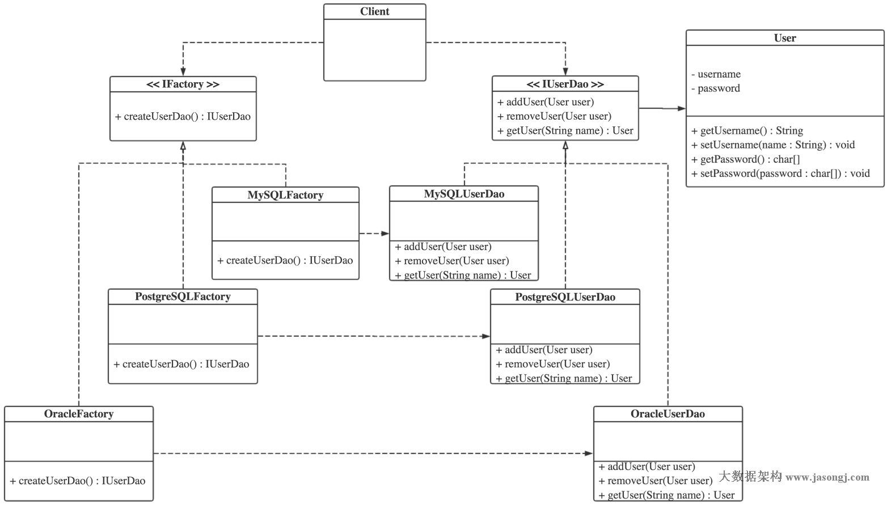](http://www.jasongj.com/img/designpattern/factorymethod/factory_method.png)

### 2.2.3工厂方法模式角色划分

- 抽象产品（或者产品接口），如上图中IUserDao
- 具体产品，如上图中的MySQLUserDao，PostgreSQLUserDao和OracleUserDao
- 抽象工厂（或者工厂接口），如IFactory
- 具体工厂，如MySQLFactory，PostgreSQLFactory和OracleFactory

### 2.2.4工厂方法模式使用方式

如简单工厂模式直接使用静态工厂方法创建产品对象不同，在工厂方法，客户端通过实例化具体的工厂类，并调用其创建实例接口创建具体产品类的实例。根据依赖倒置原则，具体工厂类的实例由工厂接口引用（客户端依赖于抽象工厂而非具体工厂），具体产品的实例由产品接口引用（客户端和工厂依赖于抽象产品而非具体产品）。具体调用代码如下

```
package com.jasongj.client;

import com.jasongj.dao.IUserDao;
import com.jasongj.factory.IDaoFactory;
import com.jasongj.factory.MySQLDaoFactory;

public class Client {

  public static void main(String[] args) {
    IDaoFactory factory = new MySQLDaoFactory();
    IUserDao userDao = factory.createUserDao();
    userDao.getUser("admin");

  }

}
```


### 2.2.5工厂方法模式示例代码

本文所述工厂方法模式示例代码可从[作者Github](https://github.com/habren/JavaDesignPattern/tree/master/FactoryMethodPattern/src/main)下载

### 2.2.6 工厂方法模式优点

- 因为每个具体工厂类只负责创建产品，没有简单工厂中的逻辑判断，因此符合单一职责原则。
- 与简单工厂模式不同，工厂方法并不使用静态工厂方法，可以形成基于继承的等级结构。
- 新增一种产品时，只需要增加相应的具体产品类和相应的工厂子类即可，相比于简单工厂模式需要修改判断逻辑而言，工厂方法模式更符合开-闭原则。

### 2.2.7工厂方法模式缺点

- 添加新产品时，除了增加新产品类外，还要提供与之对应的具体工厂类，系统类的个数将成对增加，在一定程度上增加了系统的复杂度，有更多的类需要编译和运行，会给系统带来一些额外的开销。
- 虽然保证了工厂方法内的对修改关闭，但对于使用工厂方法的类，如果要换用另外一种产品，仍然需要修改实例化的具体工厂。
- 一个具体工厂只能创建一种具体产品

## 2.3 简单工厂模式与OOP原则

### 2.3.1 已遵循的原则

- 依赖倒置原则
- 迪米特法则
- 里氏替换原则
- 接口隔离原则
- 单一职责原则（每个工厂只负责创建自己的具体产品，没有简单工厂中的逻辑判断）
- 开闭原则（增加新的产品，不像简单工厂那样需要修改已有的工厂，而只需增加相应的具体工厂类）

### 2.3.2未遵循的原则

- 开闭原则（虽然工厂对修改关闭了，但更换产品时，客户代码还是需要修改）

  

# 3. Abstract Factory

## 3.1 抽象工厂模式解决的问题

上文《[工厂方法模式](http://www.jasongj.com/design_pattern/factory_method/)》中提到，在工厂方法模式中一种工厂只能创建一种具体产品。而在抽象工厂模式中一种具体工厂可以创建多个种类的具体产品。

## 3.2抽象工厂模式

### 3.2.1 抽象工厂模式介绍

抽象工厂模式（Factory Method Pattern）中，抽象工厂提供一系列创建多个抽象产品的接口，而具体的工厂负责实现具体的产品实例。抽象工厂模式与工厂方法模式最大的区别在于抽象工厂中每个工厂可以创建多个种类的产品。

### 3.2.2抽象工厂模式类图

抽象工厂模式类图如下 （点击可查看大图）
[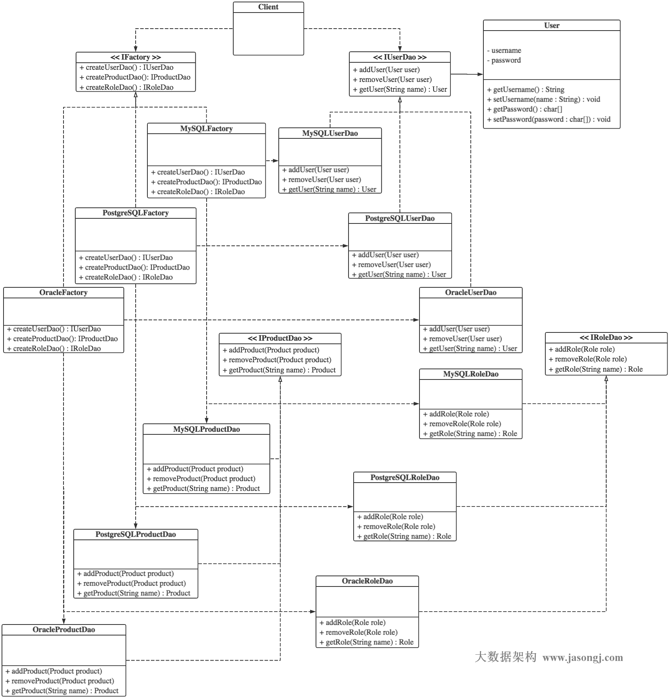](http://www.jasongj.com/img/designpattern/abstractfactory/abstract_factory.png)

### 3.2.3抽象工厂模式角色划分

- 抽象产品（或者产品接口），如上文类图中的IUserDao，IRoleDao，IProductDao
- 具体产品，如PostgreSQLProductDao
- 抽象工厂（或者工厂接口），如IFactory
- 具体工厂，如果MySQLFactory
- 产品族，如Oracle产品族，包含OracleUserDao，OracleRoleDao，OracleProductDao

### 3.2.4抽象工厂模式使用方式

与工厂方法模式类似，在创建具体产品时，客户端通过实例化具体的工厂类，并调用其创建目标产品的方法创建具体产品类的实例。根据依赖倒置原则，具体工厂类的实例由工厂接口引用，具体产品的实例由产品接口引用。具体调用代码如下

```
package com.jasongj.client;

import com.jasongj.bean.Product;
import com.jasongj.bean.User;
import com.jasongj.dao.role.IRoleDao;
import com.jasongj.dao.user.IUserDao;
import com.jasongj.dao.user.product.IProductDao;
import com.jasongj.factory.IDaoFactory;
import com.jasongj.factory.MySQLDaoFactory;

public class Client {

  public static void main(String[] args) {
    IDaoFactory factory = new MySQLDaoFactory();

    IUserDao userDao = factory.createUserDao();
    User user = new User();
    user.setUsername("demo");
    user.setPassword("demo".toCharArray());
    userDao.addUser(user);

    IRoleDao roleDao = factory.createRoleDao();
    roleDao.getRole("admin");

    IProductDao productDao = factory.createProductDao();
    Product product = new Product();
    productDao.removeProduct(product);

  }

}
```


### 3.2.5抽象工厂模式案例解析

本文所述抽象工厂模式示例代码可从[作者Github](https://github.com/habren/JavaDesignPattern/tree/master/AbstractFactoryPattern/src/main)下载

上例是J2EE开发中常用的DAO（Data Access Object），操作对象（如User和Role，对应于数据库中表的记录）需要对应的DAO类。

在实际项目开发中，经常会碰到要求使用其它类型的数据库，而不希望过多修改已有代码。因此，需要为每种DAO创建一个DAO接口（如IUserDao，IRoleDao和IProductDao），同时为不同数据库实现相应的具体类。

调用方依赖于DAO接口而非具体实现（依赖倒置原则），因此切换数据库时，调用方代码无需修改。

这些具体的DAO实现类往往不由调用方实例化，从而实现具体DAO的使用方与DAO的构建解耦。实际上，这些DAO类一般由对应的具体工厂类构建。调用方不依赖于具体工厂而是依赖于抽象工厂（依赖倒置原则，又是依赖倒置原则）。

每种具体工厂都能创建多种产品，由同一种工厂创建的产品属于同一产品族。例如PostgreSQLUserDao，PostgreSQLRoleDao和PostgreSQLProductDao都属于PostgreSQL这一产品族。

切换数据库即是切换产品族，只需要切换具体的工厂类。如上文示例代码中，客户端使用的MySQL，如果要换用Oracle，只需将MySQLDaoFactory换成OracleDaoFactory即可。

### 3.2.6抽象工厂模式优点

- 因为每个具体工厂类只负责创建产品，没有简单工厂中的逻辑判断，因此符合单一职责原则。
- 与简单工厂模式不同，抽象工厂并不使用静态工厂方法，可以形成基于继承的等级结构。
- 新增一个产品族（如上文类图中的MySQLUserDao，MySQLRoleDao，MySQLProductDao）时，只需要增加相应的具体产品和对应的具体工厂类即可。相比于简单工厂模式需要修改判断逻辑而言，抽象工厂模式更符合开-闭原则。

### 3.2.7抽象工厂模式缺点

- 新增产品种类（如上文类图中的UserDao，RoleDao，ProductDao）时，需要修改工厂接口（或者抽象工厂）及所有具体工厂，此时不符合开-闭原则。抽象工厂模式对于新的产品族符合开-闭原则而对于新的产品种类不符合开-闭原则，这一特性也被称为开-闭原则的倾斜性。

## 3.3抽象工厂模式与OOP原则

### 3.3.1已遵循的原则

- 依赖倒置原则（工厂构建产品的方法均返回产品接口而非具体产品，从而使客户端依赖于产品抽象而非具体）
- 迪米特法则
- 里氏替换原则
- 接口隔离原则
- 单一职责原则（每个工厂只负责创建自己的具体产品族，没有简单工厂中的逻辑判断）
- 开闭原则（增加新的产品族，不像简单工厂那样需要修改已有的工厂，而只需增加相应的具体工厂类）

### 3.3.2未遵循的原则

- 开闭原则（虽然对新增产品族符合开-闭原则，但对新增产品种类不符合开-闭原则）

# 4. Observer
## 4.1 观察者模式介绍

### 4.1.1 观察者模式定义

观察者模式又叫发布-订阅模式，它定义了一种一对多的依赖关系，多个观察者对象可同时监听某一主题对象，当该主题对象状态发生变化时，相应的所有观察者对象都可收到通知。

### 4.1.2观察者模式类图

观察者模式类图如下（点击可查看大图）
[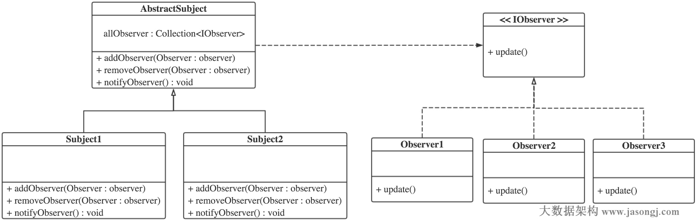](http://www.jasongj.com/img/designpattern/observer/observer.png)

### 4.1.3观察者模式角色划分

- 主题，抽象类或接口，如上面类图中的AbstractSubject
- 具体主题，如上面类图中的Subject1，Subject2
- 观察者，如上面类图中的IObserver
- 具体观察者，如上面类图中的Observer1，Observer2，Observer3

## 4.2 观察者模式实例

### 4.2.1 实例介绍

猎头或者HR往往会有很多职位信息，求职者可以在猎头或者HR那里注册，当猎头或者HR有新的岗位信息时，即会通知这些注册过的求职者。这是一个典型的观察者模式使用场景。

### 4.2.2 实例类图

观察者模式实例类图如下（点击可查看大图）
[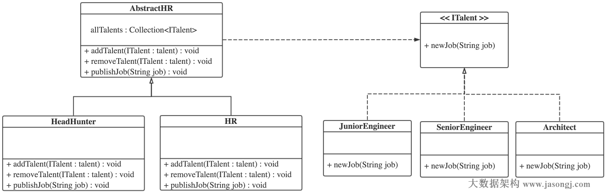](http://www.jasongj.com/img/designpattern/observer/observer_example.png)

### 4.2.3 实例解析

本例代码可从作者[Github](https://github.com/habren/JavaDesignPattern/tree/master/ObserverPattern/src/main)下载

观察者接口（或抽象观察者，如本例中的ITalent）需要定义回调接口，如下

```
package com.jasongj.observer;

public interface ITalent {

  void newJob(String job);

}
```


具体观察者（如本例中的JuniorEngineer，SeniorEngineer，Architect）在回调接口中实现其对事件的响应方法，如

```
package com.jasongj.observer;

import org.slf4j.Logger;
import org.slf4j.LoggerFactory;

public class Architect implements ITalent {
  
  private static final Logger LOG = LoggerFactory.getLogger(Architect.class);

  @Override
  public void newJob(String job) {
    LOG.info("Architect get new position {}", job);
  }

}
```


抽象主题类（如本例中的AbstractHR）定义通知观察者接口，并实现增加观察者和删除观察者方法（这两个方法可被子类共用，所以放在抽象类中实现），如

```
package com.jasongj.subject;

import java.util.ArrayList;
import java.util.Collection;

import com.jasongj.observer.ITalent;

public abstract class AbstractHR {

  protected Collection<ITalent> allTalents = new ArrayList<ITalent>();

  public abstract void publishJob(String job);

  public void addTalent(ITalent talent) {
    allTalents.add(talent);
  }

  public void removeTalent(ITalent talent) {
    allTalents.remove(talent);
  }

}
```


具体主题类（如本例中的HeadHunter）只需实现通知观察者接口，在该方法中通知所有注册的具体观察者。代码如下

```
package com.jasongj.subject;

public class HeadHunter extends AbstractHR {

  @Override
  public void publishJob(String job) {
    allTalents.forEach(talent -> talent.newJob(job));
  }

}
```


当主题类有更新（如本例中猎头有新的招聘岗位）时，调用其通知接口即可将其状态（岗位）通知给所有观察者（求职者）

```
package com.jasongj.client;

import com.jasongj.observer.Architect;
import com.jasongj.observer.ITalent;
import com.jasongj.observer.JuniorEngineer;
import com.jasongj.observer.SeniorEngineer;
import com.jasongj.subject.HeadHunter;
import com.jasongj.subject.AbstractHR;

public class Client1 {

  public static void main(String[] args) {
    ITalent juniorEngineer = new JuniorEngineer();
    ITalent seniorEngineer = new SeniorEngineer();
    ITalent architect = new Architect();
    
    AbstractHR subject = new HeadHunter();
    subject.addTalent(juniorEngineer);
    subject.addTalent(seniorEngineer);
    subject.addTalent(architect);

    subject.publishJob("Top 500 big data position");
  }

}
```

## 4.3 观察者模式优缺点

### 4.3.1 观察者模式优点

- 抽象主题只依赖于抽象观察者
- 观察者模式支持广播通信
- 观察者模式使信息产生层和响应层分离

### 4.3.2 观察者模式缺点

- 如一个主题被大量观察者注册，则通知所有观察者会花费较高代价
- 如果某些观察者的响应方法被阻塞，整个通知过程即被阻塞，其它观察者不能及时被通知

## 4.4 观察者模式与OOP原则

### 4.4.1 已遵循的原则

- 依赖倒置原则（主题类依赖于抽象观察者而非具体观察者）
- 迪米特法则
- 里氏替换原则
- 接口隔离原则
- 单一职责原则
- 开闭原则

### 4.4.2未遵循的原则

- NA


# 5. Composite

## 5.1 组合模式介绍

### 5.1.1 组合模式定义

组合模式（Composite Pattern）将对象组合成树形结构以表示“部分-整体”的层次结构。组合模式使得用户可以使用一致的方法操作单个对象和组合对象。

### 5.1.2 组合模式类图

组合模式类图如下
[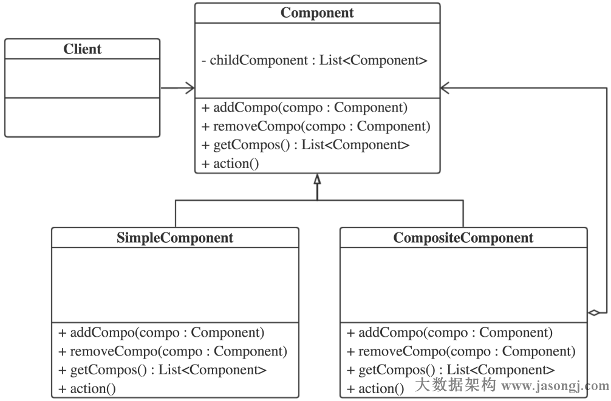](http://www.jasongj.com/img/designpattern/composite/composite.png)

### 5.1.3 组合模式角色划分

- 抽象组件，如上图中的Component
- 简单组件，如上图中的SimpleComponent
- 复合组件，如上图中的CompositeComponent

## 5.2 组合模式实例

### 5.2.1 实例介绍

对于一家大型公司，每当公司高层有重要事项需要通知到总部每个部门以及分公司的各个部门时，并不希望逐一通知，而只希望通过总部各部门及分公司，再由分公司通知其所有部门。这样，对于总公司而言，不需要关心通知的是总部的部门还是分公司。

### 5.2.2 实例类图

组合模式实例类图如下（点击可查看大图）
[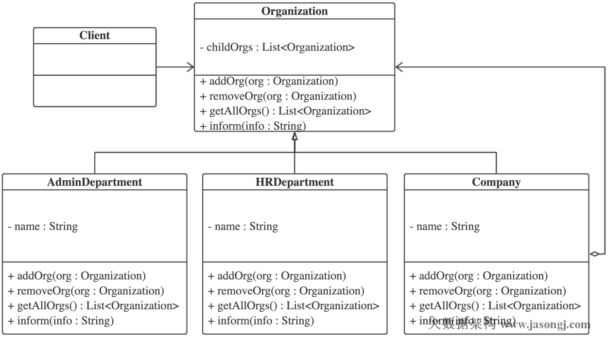](http://www.jasongj.com/img/designpattern/composite/composite_example.png)

### 5.2.3 实例解析

本例代码可从作者[Github](https://github.com/habren/JavaDesignPattern/tree/master/CompositePattern/src/main)下载

### 5.2.4 抽象组件

抽象组件定义了组件的通知接口，并实现了增删子组件及获取所有子组件的方法。同时重写了`hashCode`和`equales`方法（至于原因，请读者自行思考。如有疑问，请在评论区留言）。

```
package com.jasongj.organization;

import java.util.ArrayList;
import java.util.List;

public abstract class Organization {

  private List<Organization> childOrgs = new ArrayList<Organization>();

  private String name;

  public Organization(String name) {
    this.name = name;
  }

  public String getName() {
    return name;
  }

  public void addOrg(Organization org) {
    childOrgs.add(org);
  }

  public void removeOrg(Organization org) {
    childOrgs.remove(org);
  }

  public List<Organization> getAllOrgs() {
    return childOrgs;
  }

  public abstract void inform(String info);

  @Override
  public int hashCode(){
    return this.name.hashCode();
  }
  
  @Override
  public boolean equals(Object org){
    if(!(org instanceof Organization)) {
      return false;
    }
    return this.name.equals(((Organization) org).name);
  }

}
```


### 5.2.5 简单组件（部门）

简单组件在通知方法中只负责对接收到消息作出响应。

```
package com.jasongj.organization;

import org.slf4j.Logger;
import org.slf4j.LoggerFactory;

public class Department extends Organization{
  
  public Department(String name) {
    super(name);
  }

  private static Logger LOGGER = LoggerFactory.getLogger(Department.class);
  
  public void inform(String info){
    LOGGER.info("{}-{}", info, getName());
  }

}
```


#### 5.2.5.1复合组件（公司）

复合组件在自身对消息作出响应后，还须通知其下所有子组件

```
package com.jasongj.organization;

import java.util.List;

import org.slf4j.Logger;
import org.slf4j.LoggerFactory;

public class Company extends Organization{
  
  private static Logger LOGGER = LoggerFactory.getLogger(Company.class);
  
  public Company(String name) {
    super(name);
  }

  public void inform(String info){
    LOGGER.info("{}-{}", info, getName());
    List<Organization> allOrgs = getAllOrgs();
    allOrgs.forEach(org -> org.inform(info+"-"));
  }

}
```


## 5.3 组合模式优缺点

### 5.3.1 组合模式优点

- 高层模块调用简单。组合模式中，用户不用关心到底是处理简单组件还是复合组件，可以按照统一的接口处理。不必判断组件类型，更不用为不同类型组件分开处理。
- 组合模式可以很容易的增加新的组件。若要增加一个简单组件或复合组件，只须找到它的父节点即可，非常容易扩展，符合“开放-关闭”原则。

### 5.3.2 组合模式缺点

- 无法限制组合组件中的子组件类型。在需要检测组件类型时，不能依靠编译期的类型约束来实现，必须在运行期间动态检测。

## 5.4 组合模式与OOP原则

### 5.4.1 已遵循的原则

- 依赖倒置原则（复合类型不依赖于任何具体的组件而依赖于抽象组件）
- 迪米特法则
- 里氏替换原则
- 接口隔离原则
- 单一职责原则
- 开闭原则

### 5.4.2 未遵循的原则
- NA

# 6. Proxy Decorator

## 6.1 模式介绍

- **代理模式**（Proxy Pattern），为其它对象提供一种代理以控制对这个对象的访问。
- **装饰模式**（Decorator Pattern），动态地给一个对象添加一些额外的职责。

从语意上讲，代理模式的目标是控制对被代理对象的访问，而装饰模式是给原对象增加额外功能。

## 6.2 类图

代理模式类图如下
[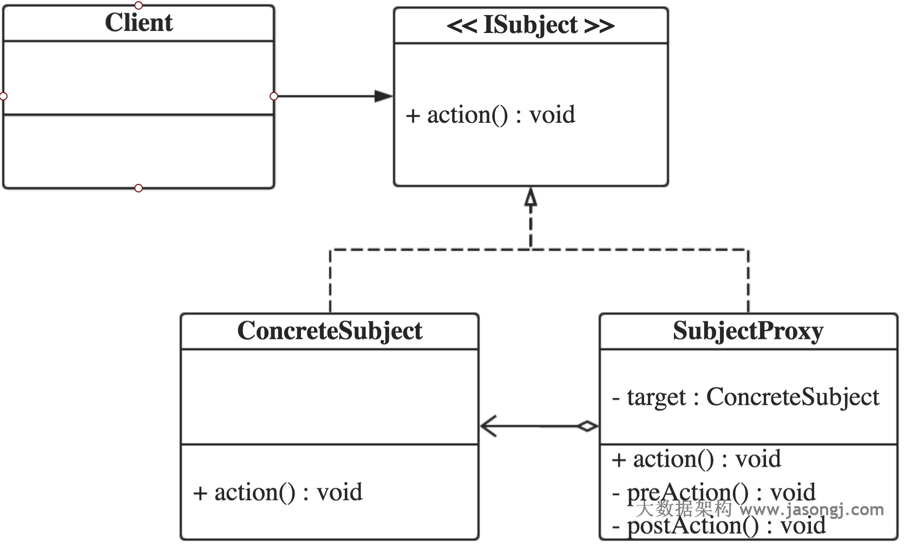](http://www.jasongj.com/img/designpattern/proxydecorator/ProxyPattern.png)

装饰模式类图如下
[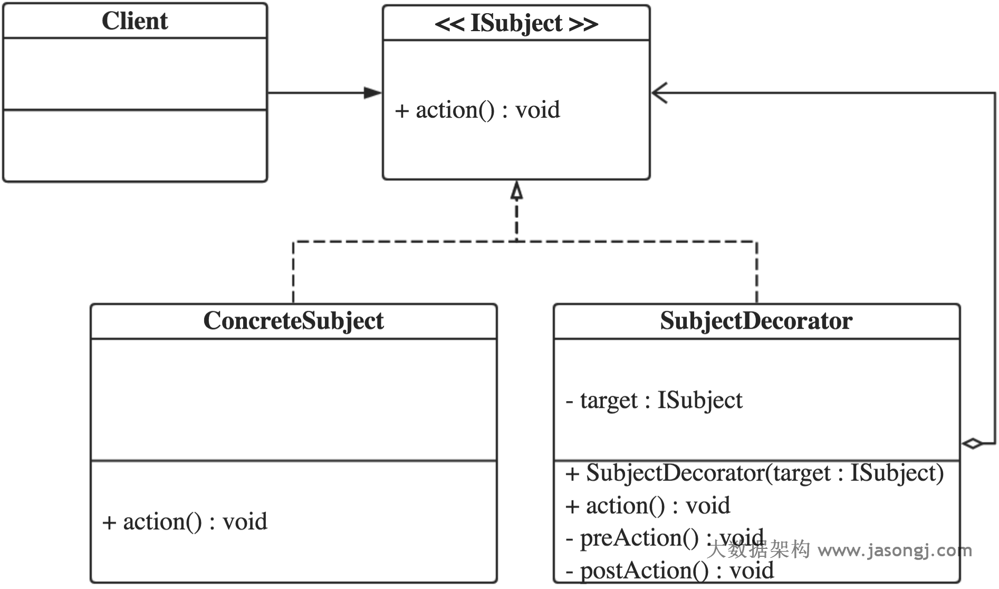](http://www.jasongj.com/img/designpattern/proxydecorator/DecoratorPattern.png)

从上图可以看到，代理模式和装饰模式的类图非常类似。下面结合具体的代码讲解两者的不同。

## 6.3 代码解析

本文所有代码均可从[作者Github](https://github.com/habren/JavaDesignPattern/tree/master/ProxyAndDecoratorPattern/src/main)下载

### 6.3.1 相同部分

代理模式和装饰模式都包含ISubject和ConcreteSubject，并且这两种模式中这两个Component的实现没有任何区别。

ISubject代码如下

```
package com.jasongj.subject;

public interface ISubject {

  void action();

}
```


ConcreteSubject代码如下

```
package com.jasongj.subject;

import org.slf4j.Logger;
import org.slf4j.LoggerFactory;


public class ConcreteSubject implements ISubject {

  private static final Logger LOG = LoggerFactory.getLogger(ConcreteSubject.class);

  @Override
  public void action() {
    LOG.info("ConcreteSubject action()");
  }

}
```


### 6.3.2 代理类和使用方式

代理类实现方式如下

```
package com.jasongj.proxy;

import org.slf4j.Logger;
import org.slf4j.LoggerFactory;
import java.util.Random;

import com.jasongj.subject.ConcreteSubject;
import com.jasongj.subject.ISubject;

public class ProxySubject implements ISubject {

  private static final Logger LOG = LoggerFactory.getLogger(ProxySubject.class);

  private ISubject subject;

  public ProxySubject() {
    subject = new ConcreteSubject();
  }

  @Override
  public void action() {
    preAction();
    if((new Random()).nextBoolean()){
      subject.action();
    } else {
      LOG.info("Permission denied");
    }
    postAction();
  }

  private void preAction() {
    LOG.info("ProxySubject.preAction()");
  }

  private void postAction() {
    LOG.info("ProxySubject.postAction()");
  }

}
```


从上述代码中可以看到，被代理对象由代理对象在编译时确定，并且代理对象可能限制对被代理对象的访问。

代理模式使用方式如下

```
package com.jasongj.client;

import com.jasongj.proxy.ProxySubject;
import com.jasongj.subject.ISubject;

public class StaticProxyClient {

  public static void main(String[] args) {
    ISubject subject = new ProxySubject();
    subject.action();
  }

}
```


从上述代码中可以看到，调用方直接调用代理而不需要直接操作被代理对象甚至都不需要知道被代理对象的存在。同时，代理类可代理的具体被代理类是确定的，如本例中ProxySubject只可代理ConcreteSubject。

### 6.3.3 装饰类和使用方式

装饰类实现方式如下

```
package com.jasongj.decorator;

import org.slf4j.Logger;
import org.slf4j.LoggerFactory;

import com.jasongj.subject.ISubject;

public class SubjectPreDecorator implements ISubject {

  private static final Logger LOG = LoggerFactory.getLogger(SubjectPreDecorator.class);

  private ISubject subject;

  public SubjectPreDecorator(ISubject subject) {
    this.subject = subject;
  }

  @Override
  public void action() {
    preAction();
    subject.action();
  }

  private void preAction() {
    LOG.info("SubjectPreDecorator.preAction()");
  }

}
```


```
package com.jasongj.decorator;

import org.slf4j.Logger;
import org.slf4j.LoggerFactory;

import com.jasongj.subject.ISubject;

public class SubjectPostDecorator implements ISubject {

  private static final Logger LOG = LoggerFactory.getLogger(SubjectPostDecorator.class);

  private ISubject subject;

  public SubjectPostDecorator(ISubject subject) {
    this.subject = subject;
  }

  @Override
  public void action() {
    subject.action();
    postAction();
  }

  private void postAction() {
    LOG.info("SubjectPostDecorator.preAction()");
  }

}
```

装饰模式使用方法如下

```
package com.jasongj.client;

import com.jasongj.decorator.SubjectPostDecorator;
import com.jasongj.decorator.SubjectPreDecorator;
import com.jasongj.subject.ConcreteSubject;
import com.jasongj.subject.ISubject;

public class DecoratorClient {

  public static void main(String[] args) {
    ISubject subject = new ConcreteSubject();
    ISubject preDecorator = new SubjectPreDecorator(subject);
    ISubject postDecorator = new SubjectPostDecorator(preDecorator);
    postDecorator.action();
  }

}
```


从上述代码中可以看出，装饰类可装饰的类并不固定，并且被装饰对象是在使用时通过组合确定。如本例中SubjectPreDecorator装饰ConcreteSubject，而SubjectPostDecorator装饰SubjectPreDecorator。并且被装饰对象由调用方实例化后通过构造方法（或者setter）指定。

装饰模式的本质是***动态组合\***。动态是手段，组合是目的。每个装饰类可以只负责添加一项额外功能，然后通过组合为被装饰类添加复杂功能。由于每个装饰类的职责比较简单单一，增加了这些装饰类的可重用性，同时也更符合单一职责原则。

## 6.4 总结

- 从语意上讲，代理模式是为控制对被代理对象的访问，而装饰模式是为了增加被装饰对象的功能
- 代理类所能代理的类完全由代理类确定，装饰类装饰的对象需要根据实际使用时客户端的组合来确定
- 被代理对象由代理对象创建，客户端甚至不需要知道被代理类的存在；被装饰对象由客户端创建并传给装饰对象

[**
技术世界**](http://www.jasongj.com/)

- [ 首页](http://www.jasongj.com/)
-  
- [ Kafka](http://www.jasongj.com/tags/Kafka/)
-  
- [ Spark](http://www.jasongj.com/tags/Spark/)
-  
- [ 大数据](http://www.jasongj.com/tags/big-data/)
-  
- [ 机器学习](http://www.jasongj.com/tags/machine-learning/)
-  
- [ SQL](http://www.jasongj.com/tags/SQL/)
-  
- [ Java](http://www.jasongj.com/tags/Java/)
-  
- [ 设计模式](http://www.jasongj.com/tags/Design-Pattern/)

## Java设计模式（七） Spring AOP JDK动态代理 vs. Cglib

 发表于 2016-05-02 | 更新于 2017-02-17 | 分类于 [设计模式 ](http://www.jasongj.com/categories/设计模式/)， [Design Pattern ](http://www.jasongj.com/categories/设计模式/Design-Pattern/)| [评论次数 0 ](http://www.jasongj.com/design_pattern/dynamic_proxy_cglib/#comments)| 阅读次数 | 字数 7,815

Spring的AOP有JDK动态代理和cglib两种实现方式。JDK动态代理要求被代理对象实现接口；cglib通过动态继承实现，因此不能代理被final修饰的类；JDK动态代理生成代理对象速度比cglib快；cglib生成的代理对象比JDK动态代理生成的代理对象执行效率高。

> 原创文章，转载请务必将下面这段话置于文章开头处（保留超链接）。
> 本文转发自[**技术世界**](http://www.jasongj.com/)，[原文链接](http://www.jasongj.com/design_pattern/dynamic_proxy_cglib/)　http://www.jasongj.com/design_pattern/dynamic_proxy_cglib/

# 7. Dynamic Proxy
## 7.1 静态代理 VS. 动态代理

静态代理，是指程序运行前就已经存在了代理类的字节码文件，代理类和被代理类的关系在运行前就已经确定。

上一篇文章《[Java设计模式（六） 代理模式 VS. 装饰模式](http://www.jasongj.com/design_pattern/proxy_decorator/)》所讲的代理为静态代理。如上文所讲，一个静态代理类只代理一个具体类。如果需要对实现了同一接口的不同具体类作代理，静态代理需要为每一个具体类创建相应的代理类。

动态代理类的字节码是在程序运行期间动态生成，所以不存在代理类的字节码文件。代理类和被代理类的关系是在程序运行时确定的。

## 7.2 JDK动态代理

JDK从1.3开始引入动态代理。可通过`java.lang.reflect.Proxy`类的静态方法`Proxy.newProxyInstance`动态创建代理类和实例。并且由它动态创建出来的代理类都是Proxy类的子类。

### 7.2.1 定义代理行为

代理类往往会在代理对象业务逻辑前后增加一些功能性的行为，如使用事务或者打印日志。本文把这些行为称之为***代理行为\***。

使用JDK动态代理，需要创建一个实现`java.lang.reflect.InvocationHandler`接口的类，并在该类中定义代理行为。

```
package com.jasongj.proxy.jdkproxy;

import java.lang.reflect.InvocationHandler;
import java.lang.reflect.Method;

import org.slf4j.Logger;
import org.slf4j.LoggerFactory;

public class SubjectProxyHandler implements InvocationHandler {

  private static final Logger LOG = LoggerFactory.getLogger(SubjectProxyHandler.class);

  private Object target;
  
  @SuppressWarnings("rawtypes")
  public SubjectProxyHandler(Class clazz) {
    try {
      this.target = clazz.newInstance();
    } catch (InstantiationException | IllegalAccessException ex) {
      LOG.error("Create proxy for {} failed", clazz.getName());
    }
  }

  @Override
  public Object invoke(Object proxy, Method method, Object[] args) throws Throwable {
    preAction();
    Object result = method.invoke(target, args);
    postAction();
    LOG.info("Proxy class name {}", proxy.getClass().getName());
    return result;
  }

  private void preAction() {
    LOG.info("SubjectProxyHandler.preAction()");
  }

  private void postAction() {
    LOG.info("SubjectProxyHandler.postAction()");
  }

}
```

从上述代码中可以看到，被代理对象的类对象作为参数传给了构造方法，原因如下

- 如上文所述，动态代理可以代理多种类，而且具体代理哪种类并非台静态代理那样编译时确定，而是在运行时指定
- 之所以不传被代理类的实例而是传类对象，是为了与上文《[Java设计模式（六） 代理模式 VS. 装饰模式](http://www.jasongj.com/design_pattern/proxy_decorator/)》吻合——被代理对象不由客户端创建而由代理创建，客户端甚至都不需要知道被代理对象的存在。具体传被代理类的实例还是传类对象，并无严格规定
- 一些讲JDK动态代理的例子会专门使用一个public方法去接收该参数。但笔者个人认为最好不要在具体类中实现未出现在接口定义中的public方法

注意，SubjectProxyHandler定义的是代理行为而非代理类本身。实际上代理类及其实例是在运行时通过反射动态创建出来的。

### 7.2.2  JDK动态代理使用方式

代理行为定义好后，先实例化SubjectProxyHandler（在构造方法中指明被代理类），然后通过Proxy.newProxyInstance动态创建代理类的实例。

```
package com.jasongj.client;

import java.lang.reflect.InvocationHandler;
import java.lang.reflect.Proxy;

import com.jasongj.proxy.jdkproxy.SubjectProxyHandler;
import com.jasongj.subject.ConcreteSubject;
import com.jasongj.subject.ISubject;

public class JDKDynamicProxyClient {

  public static void main(String[] args) {
    InvocationHandler handler = new SubjectProxyHandler(ConcreteSubject.class);
    ISubject proxy =
        (ISubject) Proxy.newProxyInstance(JDKDynamicProxyClient.class.getClassLoader(),
            new Class[] {ISubject.class}, handler);
    proxy.action();
  }

}
```


从上述代码中也可以看到，Proxy.newProxyInstance的第二个参数是类对象数组，也就意味着被代理对象可以实现多个接口。

运行结果如下

```
SubjectProxyHandler.preAction()
ConcreteSubject action()
SubjectProxyHandler.postAction()
Proxy class name com.sun.proxy.$Proxy18
```


从上述结果可以看到，定义的代理行为顺利的加入到了执行逻辑中。同时，最后一行日志说明了代理类的类名是`com.sun.proxy.$Proxy18`，验证了上文的论点——SubjectProxyHandler定义的是代理行为而非代理类本身，代理类及其实例是在运行时通过反射动态创建出来的。

### 7.2.3 生成的动态代理类

Proxy.newProxyInstance是通过静态方法`ProxyGenerator.generateProxyClass`动态生成代理类的字节码的。为了观察创建出来的代理类的结构，本文手工调用该方法，得到了代理类的字节码，并将之输出到了class文件中。

```
byte[] classFile = ProxyGenerator.generateProxyClass("$Proxy18", ConcreteSubject.class.getInterfaces());
```

使用反编译工具可以得到代理类的代码

```
import com.jasongj.subject.ISubject;
import java.lang.reflect.InvocationHandler;
import java.lang.reflect.Method;
import java.lang.reflect.Proxy;
import java.lang.reflect.UndeclaredThrowableException;

public final class $Proxy18 extends Proxy implements ISubject {
  private static Method m1;
  private static Method m2;
  private static Method m0;
  private static Method m3;

  public $Proxy18(InvocationHandler paramInvocationHandler) {
    super(paramInvocationHandler);
  }

  public final boolean equals(Object paramObject) {
    try {
      return ((Boolean) this.h.invoke(this, m1, new Object[] {paramObject})).booleanValue();
    } catch (Error | RuntimeException localError) {
      throw localError;
    } catch (Throwable localThrowable) {
      throw new UndeclaredThrowableException(localThrowable);
    }
  }

  public final String toString() {
    try {
      return (String) this.h.invoke(this, m2, null);
    } catch (Error | RuntimeException localError) {
      throw localError;
    } catch (Throwable localThrowable) {
      throw new UndeclaredThrowableException(localThrowable);
    }
  }

  public final int hashCode() {
    try {
      return ((Integer) this.h.invoke(this, m0, null)).intValue();
    } catch (Error | RuntimeException localError) {
      throw localError;
    } catch (Throwable localThrowable) {
      throw new UndeclaredThrowableException(localThrowable);
    }
  }

  public final void action() {
    try {
      this.h.invoke(this, m3, null);
      return;
    } catch (Error | RuntimeException localError) {
      throw localError;
    } catch (Throwable localThrowable) {
      throw new UndeclaredThrowableException(localThrowable);
    }
  }

  static {
    try {
      m1 = Class.forName("java.lang.Object").getMethod("equals",
          new Class[] {Class.forName("java.lang.Object")});
      m2 = Class.forName("java.lang.Object").getMethod("toString", new Class[0]);
      m0 = Class.forName("java.lang.Object").getMethod("hashCode", new Class[0]);
      m3 = Class.forName("com.jasongj.subject.ISubject").getMethod("action", new Class[0]);
    } catch (NoSuchMethodException localNoSuchMethodException) {
      throw new NoSuchMethodError(localNoSuchMethodException.getMessage());
    } catch (ClassNotFoundException localClassNotFoundException) {
      throw new NoClassDefFoundError(localClassNotFoundException.getMessage());
    }
  }
}
```


从该类的声明中可以看到，继承了Proxy类，并实现了ISubject接口。验证了上文中的论点——所有生成的动态代理类都是Proxy类的子类。同时也解释了为什么JDK动态代理只能代理实现了接口的类——Java不支持多继承，代理类已经继承了Proxy类，无法再继承其它类。

同时，代理类重写了hashCode，toString和equals这三个从Object继承下来的接口，通过InvocationHandler的invoke方法去实现。除此之外，该代理类还实现了ISubject接口的action方法，也是通过InvocationHandler的invoke方法去实现。这就解释了示例代码中代理行为是怎样被调用的。

前文提到，被代理类可以实现多个接口。从代理类代码中可以看到，代理类是通过InvocationHandler的invoke方法去实现代理接口的。所以当被代理对象实现了多个接口并且希望对不同接口实施不同的代理行为时，应该在SubjectProxyHandler类，也即代理行为定义类中，通过判断方法名，实现不同的代理行为。

## 7.3 cglib

### 7.3.1  cglib介绍

cglib是一个强大的高性能代码生成库，它的底层是通过使用一个小而快的字节码处理框架ASM（Java字节码操控框架）来转换字节码并生成新的类。

### 7.3.2 cglib方法拦截器

使用cglib实现动态代理，需要在MethodInterceptor实现类中定义代理行为。

```
package com.jasongj.proxy.cglibproxy;

import java.lang.reflect.Method;

import org.slf4j.Logger;
import org.slf4j.LoggerFactory;

import net.sf.cglib.proxy.MethodInterceptor;
import net.sf.cglib.proxy.MethodProxy;

public class SubjectInterceptor implements MethodInterceptor {

  private static final Logger LOG = LoggerFactory.getLogger(SubjectInterceptor.class);

  @Override
  public Object intercept(Object obj, Method method, Object[] args, MethodProxy proxy)
      throws Throwable {
    preAction();
    Object result = proxy.invokeSuper(obj, args);
    postAction();
    return result;
  }

  private void preAction() {
    LOG.info("SubjectProxyHandler.preAction()");
  }

  private void postAction() {
    LOG.info("SubjectProxyHandler.postAction()");
  }

}
```


代理行为在intercept方法中定义，同时通过getInstance方法（该方法名可以自定义）获取动态代理的实例，并且可以通过向该方法传入类对象指定被代理对象的类型。

### 7.3.3 cglib使用方式

```
package com.jasongj.client;

import com.jasongj.proxy.cglibproxy.SubjectInterceptor;
import com.jasongj.subject.ConcreteSubject;
import com.jasongj.subject.ISubject;

import net.sf.cglib.proxy.Enhancer;
import net.sf.cglib.proxy.MethodInterceptor;

public class CgLibProxyClient {

  public static void main(String[] args) {
    MethodInterceptor methodInterceptor = new SubjectInterceptor();
    Enhancer enhancer = new Enhancer();
    enhancer.setSuperclass(ConcreteSubject.class);
    enhancer.setCallback(methodInterceptor);
    ISubject subject = (ISubject)enhancer.create();
    subject.action();
  }

}
```

## 7.4 性能测试

分别使用JDK动态代理创建代理对象1亿次，并分别执行代理对象方法10亿次，代码如下

```
package com.jasongj.client;

import java.io.IOException;
import java.lang.reflect.InvocationHandler;
import java.lang.reflect.Proxy;

import org.slf4j.Logger;
import org.slf4j.LoggerFactory;

import com.jasongj.proxy.cglibproxy.SubjectInterceptor;
import com.jasongj.proxy.jdkproxy.SubjectProxyHandler;
import com.jasongj.subject.ConcreteSubject;
import com.jasongj.subject.ISubject;

import net.sf.cglib.proxy.Enhancer;
import net.sf.cglib.proxy.MethodInterceptor;

public class DynamicProxyPerfClient {

  private static final Logger LOG = LoggerFactory.getLogger(DynamicProxyPerfClient.class);
  private static int creation = 100000000;
  private static int execution = 1000000000;

  public static void main(String[] args) throws IOException {
    testJDKDynamicCreation();
    testJDKDynamicExecution();
    testCglibCreation();
    testCglibExecution();
  }

  private static void testJDKDynamicCreation() {
    long start = System.currentTimeMillis();
    for (int i = 0; i < creation; i++) {
      InvocationHandler handler = new SubjectProxyHandler(ConcreteSubject.class);
      Proxy.newProxyInstance(DynamicProxyPerfClient.class.getClassLoader(),
          new Class[] {ISubject.class}, handler);
    }
    long stop = System.currentTimeMillis();
    LOG.info("JDK creation time : {} ms", stop - start);
  }

  private static void testJDKDynamicExecution() {
    long start = System.currentTimeMillis();
    InvocationHandler handler = new SubjectProxyHandler(ConcreteSubject.class);
    ISubject subject =
        (ISubject) Proxy.newProxyInstance(DynamicProxyPerfClient.class.getClassLoader(),
            new Class[] {ISubject.class}, handler);
    for (int i = 0; i < execution; i++) {
      subject.action();
    }
    long stop = System.currentTimeMillis();
    LOG.info("JDK execution time : {} ms", stop - start);
  }

  private static void testCglibCreation() {
    long start = System.currentTimeMillis();
    for (int i = 0; i < creation; i++) {
      MethodInterceptor methodInterceptor = new SubjectInterceptor();
      Enhancer enhancer = new Enhancer();
      enhancer.setSuperclass(ConcreteSubject.class);
      enhancer.setCallback(methodInterceptor);
      enhancer.create();
    }
    long stop = System.currentTimeMillis();
    LOG.info("cglib creation time : {} ms", stop - start);
  }

  private static void testCglibExecution() {
    MethodInterceptor methodInterceptor = new SubjectInterceptor();
    Enhancer enhancer = new Enhancer();
    enhancer.setSuperclass(ConcreteSubject.class);
    enhancer.setCallback(methodInterceptor);
    ISubject subject = (ISubject) enhancer.create();
    long start = System.currentTimeMillis();
    for (int i = 0; i < execution; i++) {
      subject.action();
    }
    long stop = System.currentTimeMillis();
    LOG.info("cglib execution time : {} ms", stop - start);
  }

}
```


结果如下

```
JDK creation time : 9924 ms
JDK execution time : 3472 ms
cglib creation time : 16108 ms
cglib execution time : 6309 ms
```


该性能测试表明，JDK动态代理创建代理对象速度是cglib的约1.6倍，并且JDK创建出的代理对象执行速度是cglib代理对象执行速度的约1.8倍

## 7.5 JDK动态代理与cglib对比

- 字节码创建方式：JDK动态代理通过JVM实现代理类字节码的创建，cglib通过ASM创建字节码
- 对被代理对象的要求：JDK动态代理要求被代理对象实现接口，cglib要求被代理对象未被final修饰
- 代理对象创建速度：JDK动态代理创建代理对象速度比cglib快
- 代理对象执行速度：JDK动态代理代理对象执行速度比cglib快

[**
技术世界**](http://www.jasongj.com/)

- [ 首页](http://www.jasongj.com/)
-  
- [ Kafka](http://www.jasongj.com/tags/Kafka/)
-  
- [ Spark](http://www.jasongj.com/tags/Spark/)
-  
- [ 大数据](http://www.jasongj.com/tags/big-data/)
-  
- [ 机器学习](http://www.jasongj.com/tags/machine-learning/)
-  
- [ SQL](http://www.jasongj.com/tags/SQL/)
-  
- [ Java](http://www.jasongj.com/tags/Java/)
-  
- [ 设计模式](http://www.jasongj.com/tags/Design-Pattern/)

# 8. Adapter

## 8.1 适配器模式介绍

### 8.1.1 适配器模式定义

适配器模式（Adapter Pattern），将一个类的接口转换成客户希望的另外一个接口。适配器模式使得原本由于接口不兼容而不能一起工作的那些类可以一起工作。

### 8.1.2 适配器模式类图

适配器模式类图如下
[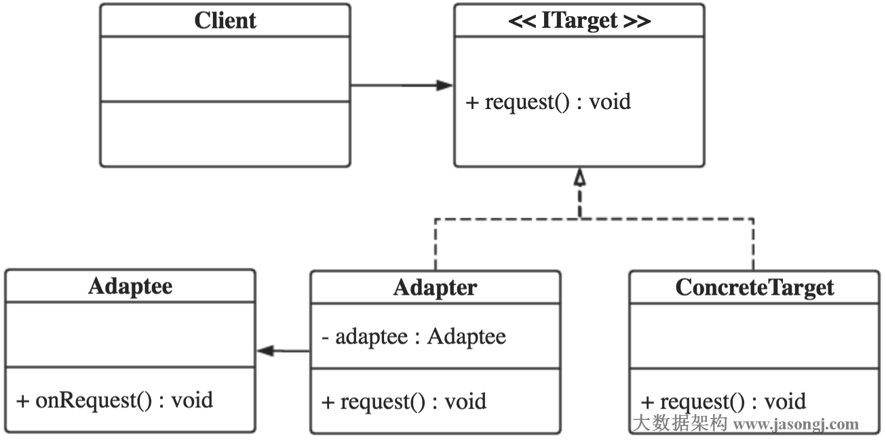](http://www.jasongj.com/img/designpattern/adapter/Adapter.png)

### 8.1.3 适配器模式角色划分

- 目标接口，如上图中的ITarget
- 具体目标实现，如ConcreteTarget
- 适配器，Adapter
- 待适配类，Adaptee

### 8.1.4  实例解析

本文代码可从作者[Github](https://github.com/habren/JavaDesignPattern/tree/master/AdapterPattern/src/main)下载

目标接口

```
package com.jasongj.target;

public interface ITarget {

  void request();

}
```


目标接口实现

```
package com.jasongj.target;

import org.slf4j.Logger;
import org.slf4j.LoggerFactory;


public class ConcreteTarget implements ITarget {

  private static Logger LOG = LoggerFactory.getLogger(ConcreteTarget.class);

  @Override
  public void request() {
    LOG.info("ConcreteTarget.request()");
  }

}
```


待适配类，其接口名为onRequest，而非目标接口request

```
package com.jasongj.adaptee;

import org.slf4j.Logger;
import org.slf4j.LoggerFactory;

import com.jasongj.target.ConcreteTarget;

public class Adaptee {

  private static Logger LOGGER = LoggerFactory.getLogger(ConcreteTarget.class);

  public void onRequest() {
    LOGGER.info("Adaptee.onRequest()");
  }

}
```


适配器类

```
package com.jasongj.target;

import org.slf4j.Logger;
import org.slf4j.LoggerFactory;

import com.jasongj.adaptee.Adaptee;

public class Adapter implements ITarget {

  private static Logger LOG = LoggerFactory.getLogger(Adapter.class);

  private Adaptee adaptee = new Adaptee();

  @Override
  public void request() {
    LOG.info("Adapter.request");
    adaptee.onRequest();
  }

}
```


从上面代码可看出，适配器类实际上是目标接口的类，因为持有待适配类的实例，所以可以在适配器类的目标接口被调用时，调用待适配对象的接口，而客户端并不需要知道二者接口的不同。通过这种方式，客户端可以使用统一的接口使用不同接口的类。

```
package com.jasongj.client;

import com.jasongj.target.Adapter;
import com.jasongj.target.ConcreteTarget;
import com.jasongj.target.ITarget;

public class AdapterClient {

  public static void main(String[] args) {
    ITarget adapter = new Adapter();
    adapter.request();

    ITarget target = new ConcreteTarget();
    target.request();
  }

}
```

## 8.2 适配器模式适用场景

- 调用双方接口不一致且都不容易修改时，可以使用适配器模式使得原本由于接口不兼容而不能一起工作的那些类可以一起工作
- 多个组件功能类似，但接口不统一且可能会经常切换时，可使用适配器模式，使得客户端可以以统一的接口使用它们

## 8.3 适配器模式优缺点

### 8.3.1 适配器模式优点

- 客户端可以以统一的方式使用ConcreteTarget和Adaptee
- 适配器负责适配过程，而不需要修改待适配类，其它直接依赖于待适配类的调用方不受适配过程的影响
- 可以为不同的目标接口实现不同的适配器，而不需要修改待适配类，符合开放-关闭原则

## 8.4 适配器模式与OOP原则

### 8.4.1 已遵循的原则

- 依赖倒置原则
- 迪米特法则
- 里氏替换原则
- 接口隔离原则
- 单一职责原则
- 开闭原则

### 8.4.2 未遵循的原则

- NA

# 9. Bridge

当一种事物可在多种维度变化（如两个维度，每个维度三种可能）时，如果为每一种可能创建一个子类，则每增加一个维度上的可能需要增加多个类，这会造成类爆炸（3*3=9）。若使用桥接模式，使用类聚合，而非继承，将可缓解类爆炸，并增强可扩展性。

## 9.1 桥接模式定义

桥接模式（Bridge Pattern），将抽象部分与它的实现部分分离，使它们都可以独立地变化。更容易理解的表述是：实现系统可从多种维度分类，桥接模式将各维度抽象出来，各维度独立变化，之后可通过聚合，将各维度组合起来，减少了各维度间的耦合。

## 9.2 例讲桥接模式

### 9.2.1 不必要的继承导致类爆炸

汽车可按品牌分（本例中只考虑BMT，BenZ，Land Rover），也可按手动档、自动档、手自一体来分。如果对于每一种车都实现一个具体类，则一共要实现3*3=9个类。

使用继承方式的类图如下
[](http://www.jasongj.com/img/designpattern/bridge/BridgeInherit.png)

从上图可以看到，对于每种组合都需要创建一个具体类，如果有N个维度，每个维度有M种变化，则需要MN个具体类，类非常多，并且非常多的重复功能。

如果某一维度，如Transmission多一种可能，比如手自一体档（AMT），则需要增加3个类，BMWAMT，BenZAMT，LandRoverAMT。

### 9.2.2 桥接模式类图

桥接模式类图如下
[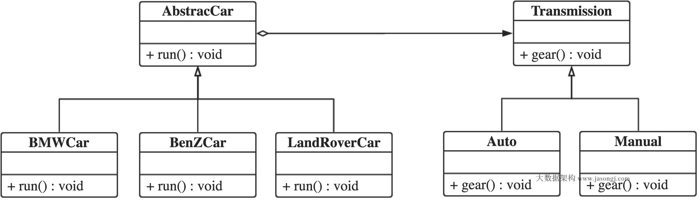](http://www.jasongj.com/img/designpattern/bridge/Bridge.png)

从上图可知，当把每个维度拆分开来，只需要M*N个类，并且由于每个维度独立变化，基本不会出现重复代码。

此时如果增加手自一体档，只需要增加一个AMT类即可

### 9.2.3 桥接模式实例解析

本文代码可从作者[Github](https://github.com/habren/JavaDesignPattern/tree/master/BridgePattern/src/main)下载

抽象车

```
package com.jasongj.brand;

import com.jasongj.transmission.Transmission;

public abstract class AbstractCar {

  protected Transmission gear;
  
  public abstract void run();
  
  public void setTransmission(Transmission gear) {
    this.gear = gear;
  }
  
}
```


按品牌分，BMW牌车

```
package com.jasongj.brand;

import org.slf4j.Logger;
import org.slf4j.LoggerFactory;

public class BMWCar extends AbstractCar{

  private static final Logger LOG = LoggerFactory.getLogger(BMWCar.class);
  
  @Override
  public void run() {
    gear.gear();
    LOG.info("BMW is running");
  };

}
```


BenZCar

```
package com.jasongj.brand;

import org.slf4j.Logger;
import org.slf4j.LoggerFactory;

public class BenZCar extends AbstractCar{

  private static final Logger LOG = LoggerFactory.getLogger(BenZCar.class);
  
  @Override
  public void run() {
    gear.gear();
    LOG.info("BenZCar is running");
  };

}
```


LandRoverCar

```
package com.jasongj.brand;

import org.slf4j.Logger;
import org.slf4j.LoggerFactory;

public class LandRoverCar extends AbstractCar{

  private static final Logger LOG = LoggerFactory.getLogger(LandRoverCar.class);
  
  @Override
  public void run() {
    gear.gear();
    LOG.info("LandRoverCar is running");
  };

}
```


抽象变速器

```
package com.jasongj.transmission;

public abstract class Transmission{

  public abstract void gear();

}
```


手动档

```
package com.jasongj.transmission;

import org.slf4j.Logger;
import org.slf4j.LoggerFactory;

public class Manual extends Transmission {

  private static final Logger LOG = LoggerFactory.getLogger(Manual.class);

  @Override
  public void gear() {
    LOG.info("Manual transmission");
  }
}
```


自动档

```
package com.jasongj.transmission;

import org.slf4j.Logger;
import org.slf4j.LoggerFactory;

public class Auto extends Transmission {

  private static final Logger LOG = LoggerFactory.getLogger(Auto.class);

  @Override
  public void gear() {
    LOG.info("Auto transmission");
  }
}
```


有了变速器和品牌两个维度各自的实现后，可以通过聚合，实现不同品牌不同变速器的车，如下

```
package com.jasongj.client;

import com.jasongj.brand.AbstractCar;
import com.jasongj.brand.BMWCar;
import com.jasongj.brand.BenZCar;
import com.jasongj.transmission.Auto;
import com.jasongj.transmission.Manual;
import com.jasongj.transmission.Transmission;

public class BridgeClient {

  public static void main(String[] args) {
    Transmission auto = new Auto();
    AbstractCar bmw = new BMWCar();
    bmw.setTransmission(auto);
    bmw.run();
    

    Transmission manual = new Manual();
    AbstractCar benz = new BenZCar();
    benz.setTransmission(manual);
    benz.run();
  }

}
```


## 9.3 桥接模式与OOP原则

### 9.3.1 已遵循的原则

- 依赖倒置原则
- 迪米特法则
- 里氏替换原则
- 接口隔离原则
- 单一职责原则
- 开闭原则

### 9.3.2 未遵循的原则

- NA

# 10. Single

## 10.1 为何需要单例模式

对于系统中的某些类来说，只有一个实例很重要，例如，一个系统只能有一个窗口管理器或文件系统；一个系统只能有一个计时工具或ID（序号）生成器。

## 10.2 单例模式设计要点

- 保证该类只有一个实例。将该类的构造方法定义为私有方法，这样其他处的代码就无法通过调用该类的构造方法来实例化该类的对象
- 提供一个该实例的访问点。一般由该类自己负责创建实例，并提供一个静态方法作为该实例的访问点

## 10.3 饿汉 vs. 懒汉

- 饿汉 声明实例引用时即实例化
- 懒汉 静态方法第一次被调用前不实例化，也即懒加载。对于创建实例代价大，且不定会使用时，使用懒加载模式可以减少开销

## 10.4 实现单例模式的九种方法

### 10.4.1 线程不安全的懒汉 - 多线程不可用

```
package com.jasongj.singleton1;

public class Singleton {

  private static Singleton INSTANCE;

  private Singleton() {};

  public static Singleton getInstance() {
    if (INSTANCE == null) {
      INSTANCE = new Singleton();
    }
    return INSTANCE;
  }

}
```

- 优点：达到了Lazy Loading的效果
- 缺点：只有在单线程下能保证只有一个实例，多线程下有创建多个实例的风险

### 10.4.2 同步方法下的懒汉 - 可用，不推荐

```
package com.jasongj.singleton2;

public class Singleton {

  private static Singleton INSTANCE;

  private Singleton() {};

  public static synchronized Singleton getInstance() {
    if (INSTANCE == null) {
      INSTANCE = new Singleton();
    }
    return INSTANCE;
  }
}
```

- 优点：线程安全，可确保正常使用下（不考虑通过反射调用私有构造方法）只有一个实例
- 缺点：每次获取实例都需要申请锁，开销大，效率低

### 10.4.3 同步代码块下的懒汉 - 不可用

```
package com.jasongj.singleton3;

public class Singleton {

  private static Singleton INSTANCE;

  private Singleton() {};

  public static Singleton getInstance() {
    if (INSTANCE == null) {
      synchronized (Singleton.class) {
        INSTANCE = new Singleton();
      }
    }
    return INSTANCE;
  }
}
```

- 优点：不需要在每次调用时加锁，效率比上一个高
- 缺点：虽然使用了`synchronized`，但本质上是线程不安全的。

### 10.4.4 双重检查（Double Check）下的懒汉 - 推荐

```
package com.jasongj.singleton4;

public class Singleton {

  private static volatile Singleton INSTANCE;

  private Singleton() {};

  public static Singleton getInstance() {
    if (INSTANCE == null) {
      synchronized(Singleton.class){
        if(INSTANCE == null) {
          INSTANCE = new Singleton();
        }
      }
    }
    return INSTANCE;
  }

}
```

- 优点：使用了双重检查，避免了线程不安全，同时也避免了不必要的锁开销。
- 缺点：NA

注：

- 但是这里的`synchronized`已经保证了`INSTANCE`写操作对其它线程读操作的可见性。具体原理请参考《[Java进阶（二）当我们说线程安全时，到底在说什么](http://www.jasongj.com/java/thread_safe/#synchronized_visibility)》
- 使用`volatile`关键字的目的不是保证可见性（`synchronized`已经保证了可见性），而是为了保证顺序性。具体来说，`INSTANCE = new Singleton()`不是原子操作，实际上被拆分为了三步：1) 分配内存；2) 初始化对象；3) 将INSTANCE指向分配的对象内存地址。 如果没有`volatile`，可能会发生指令重排，使得INSTANCE先指向内存地址，而对象尚未初始化，其它线程直接使用INSTANCE引用进行对象操作时出错。详细原理可参见《[双重检查锁定与延迟初始化](http://www.infoq.com/cn/articles/double-checked-locking-with-delay-initialization)》

### 10.4.5 静态常量 饿汉 - 推荐

```
package com.jasongj.singleton6;

public class Singleton {

  private static final Singleton INSTANCE = new Singleton();

  private Singleton() {};

  public static Singleton getInstance() {
    return INSTANCE;
  }

}
```

- 优点：实现简单，无线程同步问题
- 缺点：在类装载时完成实例化。若该实例一直未被使用，则会造成资源浪费

### 10.4.6 静态代码块 饿汉 可用

```
package com.jasongj.singleton7;

public class Singleton {

  private static Singleton INSTANCE;
  
  static{
    INSTANCE = new Singleton();
  }

  private Singleton() {};

  public static Singleton getInstance() {
    return INSTANCE;
  }

}
```

- 优点：无线程同步问题
- 缺点：类装载时创建实例，无Lazy Loading。实例一直未被使用时，会浪费资源

### 10.4.7 静态内部类 推荐

```
package com.jasongj.singleton8;

public class Singleton {

  private Singleton() {};

  public static Singleton getInstance() {
    return InnerClass.INSTANCE;
  }
  
  private static class InnerClass {
    private static final Singleton INSTANCE = new Singleton();
  }

}
```

- 优点：无线程同步问题，实现了懒加载（Lazy Loading）。因为只有调用`getInstance`时才会装载内部类，才会创建实例。同时因为使用内部类时，先调用内部类的线程会获得类初始化锁，从而保证内部类的初始化（包括实例化它所引用的外部类对象）线程安全。即使内部类创建外部类的实例`Singleton INSTANCE = new Singleton()`发生指令重排也不会引起[双重检查（Double-Check）下的懒汉](http://www.jasongj.com/design_pattern/singleton/#双重检查（Double-Check）下的懒汉-推荐)模式中提到的问题，因此无须使用`volatile`关键字。
- 缺点：NA

### 10.4.8 枚举 强烈推荐

```
package com.jasongj.singleton9;

public enum Singleton {

  INSTANCE;
  
  public void whatSoEverMethod() { }

  // 该方法非必须，只是为了保证与其它方案一样使用静态方法得到实例
  public static Singleton getInstance() {
    return INSTANCE;
  }

}
```

- 优点：枚举本身是线程安全的，且能防止通过反射和反序列化创建多实例。
- 缺点：使用的是枚举，而非类。 　　

# 11. Flyweight

## 11.1 享元模式介绍

### 11.1.1 享元模式适用场景

面向对象技术可以很好的解决一些灵活性或可扩展性问题，但在很多情况下需要在系统中增加类和对象的个数。当对象数量太多时，将导致对象创建及垃圾回收的代价过高，造成性能下降等问题。享元模式通过共享相同或者相似的细粒度对象解决了这一类问题。

### 11.1.2 享元模式定义

享元模式（Flyweight Pattern），又称轻量级模式（这也是其英文名为FlyWeight的原因），通过共享技术有效地实现了大量细粒度对象的复用。

### 11.1.3 享元模式类图

享元模式类图如下
[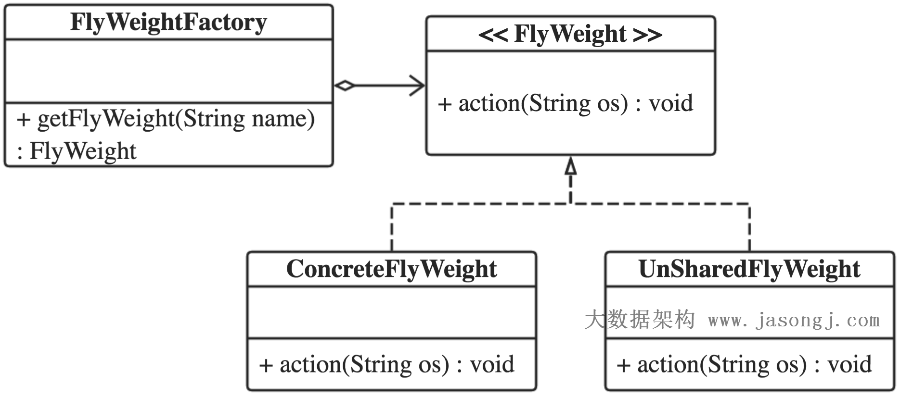](http://www.jasongj.com/img/designpattern/flyweight/FlyWeight.png)

### 11.1.4 享元模式角色划分

- ***FlyWeight\*** 享元接口或者（抽象享元类），定义共享接口
- ***ConcreteFlyWeight\*** 具体享元类，该类实例将实现共享
- ***UnSharedConcreteFlyWeight\*** 非共享享元实现类
- ***FlyWeightFactory\*** 享元工厂类，控制实例的创建和共享

### 11.1.5 内部状态 vs. 外部状态

- ***内部状态\***是存储在享元对象内部，一般在构造时确定或通过setter设置，并且不会随环境改变而改变的状态，因此内部状态可以共享。
- ***外部状态\***是随环境改变而改变、不可以共享的状态。外部状态在需要使用时通过客户端传入享元对象。外部状态必须由客户端保存。

## 11.2 享元模式实例解析

本文代码可从[作者Github](https://github.com/habren/JavaDesignPattern/tree/master/FlyweightPattern/src/main)下载

享元接口，定义共享接口

```
package com.jasongj.flyweight;

public interface FlyWeight {

  void action(String externalState);

}
```


具体享元类，实现享元接口。该类的对象将被复用

```
package com.jasongj.flyweight;

import org.slf4j.Logger;
import org.slf4j.LoggerFactory;

public class ConcreteFlyWeight implements FlyWeight {

  private static final Logger LOG = LoggerFactory.getLogger(ConcreteFlyWeight.class);

  private String name;

  public ConcreteFlyWeight(String name) {
    this.name = name;
  }

  @Override
  public void action(String externalState) {
    LOG.info("name = {}, outerState = {}", this.name, externalState);
  }

}
```


享元模式中，最关键的享元工厂。它将维护已创建的享元实例，并通过实例标记（一般用内部状态）去索引对应的实例。当目标对象未创建时，享元工厂负责创建实例并将其加入标记-对象映射。当目标对象已创建时，享元工厂直接返回已有实例，实现对象的复用。

```
package com.jasongj.factory;

import java.util.concurrent.ConcurrentHashMap;

import org.slf4j.Logger;
import org.slf4j.LoggerFactory;

import com.jasongj.flyweight.ConcreteFlyWeight;
import com.jasongj.flyweight.FlyWeight;

public class FlyWeightFactory {

  private static final Logger LOG = LoggerFactory.getLogger(FlyWeightFactory.class);

  private static ConcurrentHashMap<String, FlyWeight> allFlyWeight = new ConcurrentHashMap<String, FlyWeight>();

  public static FlyWeight getFlyWeight(String name) {
    if (allFlyWeight.get(name) == null) {
      synchronized (allFlyWeight) {
        if (allFlyWeight.get(name) == null) {
          LOG.info("Instance of name = {} does not exist, creating it");
          FlyWeight flyWeight = new ConcreteFlyWeight(name);
          LOG.info("Instance of name = {} created");
          allFlyWeight.put(name, flyWeight);
        }
      }
    }
    return allFlyWeight.get(name);
  }

}
```


从上面代码中可以看到，享元模式中对象的复用完全依靠享元工厂。同时本例中实现了对象创建的懒加载。并且为了保证线程安全及效率，本文使用了双重检查（Double Check）。

本例中，`name`可以认为是内部状态，在构造时确定。`externalState`属于外部状态，由客户端在调用时传入。

## 11.3 享元模式分析

### 11.3.1 享元模式优点

- 享元模式的外部状态相对独立，使得对象可以在不同的环境中被复用（共享对象可以适应不同的外部环境）
- 享元模式可共享相同或相似的细粒度对象，从而减少了内存消耗，同时降低了对象创建与垃圾回收的开销

### 11.3.2 享元模式缺点

- 外部状态由客户端保存，共享对象读取外部状态的开销可能比较大
- 享元模式要求将内部状态与外部状态分离，这使得程序的逻辑复杂化，同时也增加了状态维护成本

## 11.4 享元模式已（未）遵循的OOP原则

### 11.4.1 已遵循的OOP原则

- 依赖倒置原则
- 迪米特法则
- 里氏替换原则
- 接口隔离原则
- 单一职责原则
- 开闭原则

### 11.4.5 未遵循的OOP原则

- NA


# 12. Strategy
## 12.1 策略模式介绍

## 12.1.1 策略模式定义

策略模式（Strategy Pattern），将各种算法封装到具体的类中，作为一个抽象策略类的子类，使得它们可以互换。客户端可以自行决定使用哪种算法。

### 12.1.2 策略模式类图

策略模式类图如下
[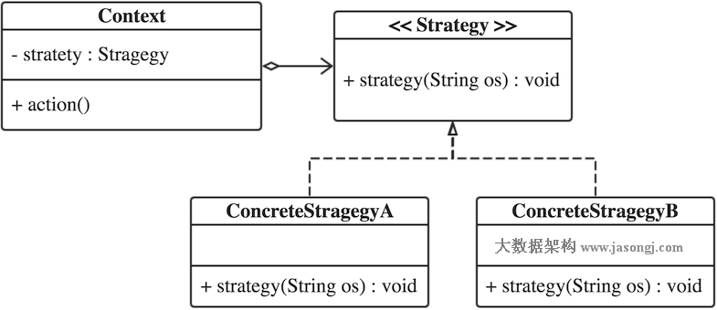](http://www.jasongj.com/img/designpattern/strategy/Strategy.png)

### 12.1.3 策略模式角色划分

- ***Strategy\*** 策略接口或者（抽象策略类），定义策略执行接口
- ***ConcreteStrategy\*** 具体策略类
- ***Context\*** 上下文类，持有具体策略类的实例，并负责调用相关的算法

## 12.2 策略模式实例解析

本文代码可从[作者Github](https://github.com/habren/JavaDesignPattern/tree/master/StrategyPattern/src/main)下载

### 12.2.1 典型策略模式实现

策略接口，定义策略执行接口

```
package com.jasongj.strategy;

public interface Strategy {

  void strategy(String input);

}
```


具体策略类，实现策略接口，提供具体算法

```
package com.jasongj.strategy;

import org.slf4j.Logger;
import org.slf4j.LoggerFactory;

@com.jasongj.annotation.Strategy(name="StrategyA")
public class ConcreteStrategyA implements Strategy {

  private static final Logger LOG = LoggerFactory.getLogger(ConcreteStrategyB.class);

  @Override
  public void strategy(String input) {
    LOG.info("Strategy A for input : {}", input);
  }

}
```


```
package com.jasongj.strategy;

import org.slf4j.Logger;
import org.slf4j.LoggerFactory;

@com.jasongj.annotation.Strategy(name="StrategyB")
public class ConcreteStrategyB implements Strategy {

  private static final Logger LOG = LoggerFactory.getLogger(ConcreteStrategyB.class);

  @Override
  public void strategy(String input) {
    LOG.info("Strategy B for input : {}", input);
  }

}
```

Context类，持有具体策略类的实例，负责调用具体算法

```
package com.jasongj.context;

import com.jasongj.strategy.Strategy;

public class SimpleContext {

  private Strategy strategy;
  
  public SimpleContext(Strategy strategy) {
    this.strategy = strategy;
  }
  
  public void action(String input) {
    strategy.strategy(input);
  }
  
}
```


客户端可以实例化具体策略类，并传给Context类，通过Context统一调用具体算法

```
package com.jasongj.client;

import com.jasongj.context.SimpleContext;
import com.jasongj.strategy.ConcreteStrategyA;
import com.jasongj.strategy.Strategy;

public class SimpleClient {

  public static void main(String[] args) {
    Strategy strategy = new ConcreteStrategyA();
    SimpleContext context = new SimpleContext(strategy);
    context.action("Hellow, world");
  }

}
```


### 12.2.2 使用Annotation和简单工厂模式增强策略模式

上面的实现中，客户端需要显示决定具体使用何种策略，并且一旦需要换用其它策略，需要修改客户端的代码。解决这个问题，一个比较好的方式是使用简单工厂，使得客户端都不需要知道策略类的实例化过程，甚至都不需要具体哪种策略被使用。

如《[Java设计模式（一） 简单工厂模式不简单](http://www.jasongj.com/design_pattern/simple_factory/)》所述，简单工厂的实现方式比较多，可以结合《[Java系列（一）Annotation（注解）](http://www.jasongj.com/2016/01/17/Java1_注解Annotation)》中介绍的Annotation方法。

使用Annotation和简单工厂模式的Context类如下

```
package com.jasongj.context;

import java.util.Collections;
import java.util.Map;
import java.util.Set;
import java.util.concurrent.ConcurrentHashMap;

import org.apache.commons.configuration.ConfigurationException;
import org.apache.commons.configuration.XMLConfiguration;
import org.reflections.Reflections;
import org.slf4j.Logger;
import org.slf4j.LoggerFactory;

import com.jasongj.strategy.Strategy;

public class SimpleFactoryContext {

  private static final Logger LOG = LoggerFactory.getLogger(SimpleFactoryContext.class);
  private static Map<String, Class> allStrategies;

  static {
    Reflections reflections = new Reflections("com.jasongj.strategy");
    Set<Class<?>> annotatedClasses =
        reflections.getTypesAnnotatedWith(com.jasongj.annotation.Strategy.class);
    allStrategies = new ConcurrentHashMap<String, Class>();
    for (Class<?> classObject : annotatedClasses) {
      com.jasongj.annotation.Strategy strategy = (com.jasongj.annotation.Strategy) classObject
          .getAnnotation(com.jasongj.annotation.Strategy.class);
      allStrategies.put(strategy.name(), classObject);
    }
    allStrategies = Collections.unmodifiableMap(allStrategies);
  }

  private Strategy strategy;

  public SimpleFactoryContext() {
    String name = null;
    try {
      XMLConfiguration config = new XMLConfiguration("strategy.xml");
      name = config.getString("strategy.name");
      LOG.info("strategy name is {}", name);
    } catch (ConfigurationException ex) {
      LOG.error("Parsing xml configuration file failed", ex);
    }

    if (allStrategies.containsKey(name)) {
      LOG.info("Created strategy name is {}", name);
      try {
        strategy = (Strategy) allStrategies.get(name).newInstance();
      } catch (InstantiationException | IllegalAccessException ex) {
        LOG.error("Instantiate Strategy failed", ex);
      }
    } else {
      LOG.error("Specified Strategy name {} does not exist", name);
    }

  }

  public void action(String input) {
    strategy.strategy(input);
  }

}
```


从上面的实现可以看出，虽然并没有单独创建一个简单工厂类，但它已经融入了简单工厂模式的设计思想和实现方法。

客户端调用方式如下

```
package com.jasongj.client;

import com.jasongj.context.SimpleFactoryContext;

public class SimpleFactoryClient {

  public static void main(String[] args) {
    SimpleFactoryContext context = new SimpleFactoryContext();
    context.action("Hellow, world");
  }

}
```


从上面代码可以看出，引入简单工厂模式后，客户端不再需要直接实例化具体的策略类，也不需要判断应该使用何种策略，可以方便应对策略的切换。

## 12.3 策略模式分析

### 12.3.1 策略模式优点

- 策略模式提供了对“开闭原则”的完美支持，用户可以在不修改原有系统的基础上选择算法（策略），并且可以灵活地增加新的算法（策略）。
- 策略模式通过Context类提供了管理具体策略类（算法族）的办法。
- 结合简单工厂模式和Annotation，策略模式可以方便的在不修改客户端代码的前提下切换算法（策略）。

### 12.3.2 策略模式缺点

- 传统的策略模式实现方式中，客户端必须知道所有的具体策略类，并须自行显示决定使用哪一个策略类。但通过本文介绍的通过和Annotation和简单工厂模式结合，可以有效避免该问题
- 如果使用不当，策略模式可能创建很多具体策略类的实例，但可以通过使用上文《[Java设计模式（十一） 享元模式](http://www.jasongj.com/design_pattern/flyweight/)》介绍的享元模式有效减少对象的数量。

## 12.4 策略模式已（未）遵循的OOP原则

### 12.4.1 已遵循的OOP原则

- 依赖倒置原则
- 迪米特法则
- 里氏替换原则
- 接口隔离原则
- 单一职责原则
- 开闭原则

### 12.4.2 未遵循的OOP原则

- NA

