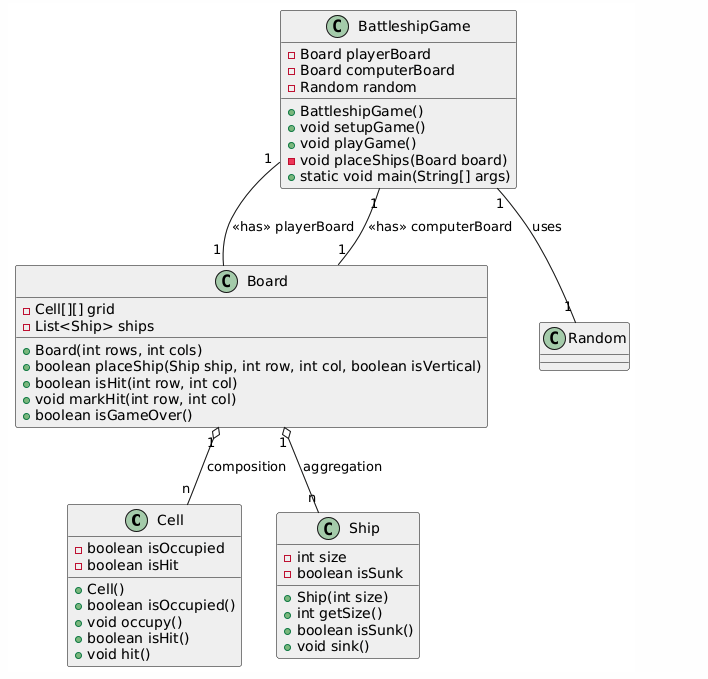
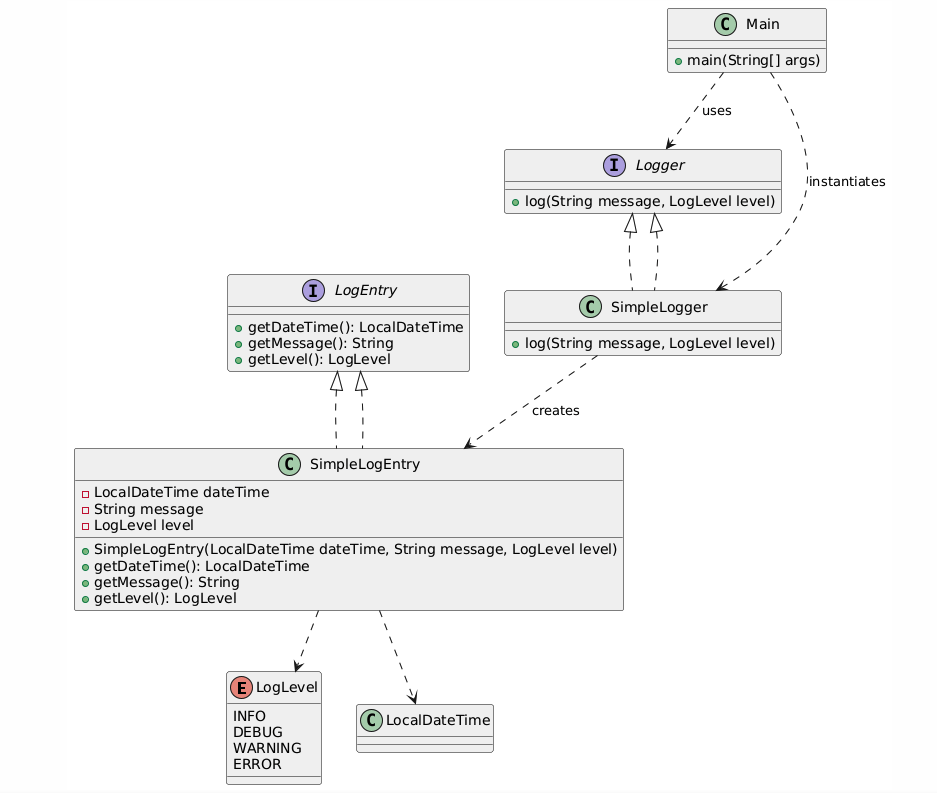

### 1. Design stackoverflow

### 2. Design UNIX FIND

> Implemnet linux find command as an api ,the api willl support finding files that has given size requirements and a file with a certain format like xml…
>
> 1. find all file >5mb
> 2. find all xml
>    Assume file class
>    {
>    get name()
>    directorylistfile()
>    getFile()
>    create a library flexible that is flexible
>    Design clases,interfaces.
>
> `````java
> import java.io.File;
> import java.util.ArrayList;
> import java.util.List;
> 
> // ***********************
> // FileFilter 接口
> // ***********************
> /**
>  * 文件过滤器接口，定义了筛选文件的标准。
>  * 任何实现该接口的类都可以根据不同条件筛选文件。
>  */
> interface FileFilter {
>     /**
>      * 根据特定条件筛选文件。
>      * @param directory 要搜索的目录
>      * @return 符合条件的文件列表
>      */
>     List<File> filter(File directory);
> }
> 
> // ***********************
> // SizeFilter 类 (基于文件大小筛选文件)
> // ***********************
> /**
>  * 基于文件大小筛选文件的过滤器。
>  * 该类会递归遍历目录，找到大于指定大小的所有文件。
>  */
> class SizeFilter implements FileFilter {
>     private long sizeInBytes; // 文件大小的阈值 (单位: 字节)
> 
>     /**
>      * 构造方法，指定文件大小的最小值。
>      * @param sizeInBytes 需要筛选的文件最小大小（字节）
>      */
>     public SizeFilter(long sizeInBytes) {
>         this.sizeInBytes = sizeInBytes;
>     }
> 
>     /**
>      * 递归遍历目录，筛选出大于指定大小的文件。
>      * @param directory 需要搜索的目录
>      * @return 符合大小条件的文件列表
>      */
>     @Override
>     public List<File> filter(File directory) {
>         List<File> resultFiles = new ArrayList<>();
>         File[] files = directory.listFiles(); // 获取目录下的所有文件和子目录
> 
>         if (files != null) {
>             for (File file : files) {
>                 if (file.isFile() && file.length() > sizeInBytes) {
>                     // 如果是文件，并且大小超过指定阈值，则加入结果列表
>                     resultFiles.add(file);
>                 } else if (file.isDirectory()) {
>                     // 如果是目录，则递归搜索
>                     resultFiles.addAll(filter(file));
>                 }
>             }
>         }
>         return resultFiles;
>     }
> }
> 
> // ***********************
> // FormatFilter 类 (基于文件格式筛选文件)
> // ***********************
> /**
>  * 基于文件格式（扩展名）筛选文件的过滤器。
>  * 该类会递归遍历目录，找到所有指定格式的文件（如 .xml）。
>  */
> class FormatFilter implements FileFilter {
>     private String format; // 需要查找的文件扩展名，例如 ".xml"
> 
>     /**
>      * 构造方法，指定文件格式（扩展名）。
>      * @param format 文件扩展名（例如：".xml"）
>      */
>     public FormatFilter(String format) {
>         this.format = format;
>     }
> 
>     /**
>      * 递归遍历目录，筛选出指定格式的文件。
>      * @param directory 需要搜索的目录
>      * @return 符合格式条件的文件列表
>      */
>     @Override
>     public List<File> filter(File directory) {
>         List<File> resultFiles = new ArrayList<>();
>         File[] files = directory.listFiles(); // 获取目录下的所有文件和子目录
> 
>         if (files != null) {
>             for (File file : files) {
>                 if (file.isFile() && file.getName().endsWith(format)) {
>                     // 如果是文件，并且后缀名匹配，则加入结果列表
>                     resultFiles.add(file);
>                 } else if (file.isDirectory()) {
>                     // 如果是目录，则递归搜索
>                     resultFiles.addAll(filter(file));
>                 }
>             }
>         }
>         return resultFiles;
>     }
> }
> 
> // ***********************
> // FindCommandAPI 类 (文件查找命令接口)
> // ***********************
> /**
>  * 该类提供了一种通用的方式来执行文件查找任务。
>  * 通过不同的 FileFilter 实现类，可以灵活地按不同条件查找文件。
>  */
> public class FindCommandAPI {
>     
>     /**
>      * 在指定目录下执行查找操作。
>      * @param directory 需要搜索的目录
>      * @param filter 筛选条件（FileFilter 实现）
>      * @return 符合条件的文件列表
>      */
>     public List<File> findFiles(File directory, FileFilter filter) {
>         return filter.filter(directory);
>     }
> 
>     /**
>      * 测试主方法，展示如何使用不同的过滤器来查找文件。
>      */
>     public static void main(String[] args) {
>         // 指定搜索目录 (修改为你本机的有效目录)
>         File searchDirectory = new File("C:/Users/YourUsername/Documents");
> 
>         // 创建查找 API
>         FindCommandAPI findAPI = new FindCommandAPI();
> 
>         // 查找所有大于 5MB 的文件
>         FileFilter sizeFilter = new SizeFilter(5 * 1024 * 1024); // 5MB = 5 * 1024 * 1024 bytes
>         List<File> largeFiles = findAPI.findFiles(searchDirectory, sizeFilter);
>         System.out.println("大于 5MB 的文件:");
>         for (File file : largeFiles) {
>             System.out.println(file.getAbsolutePath());
>         }
> 
>         // 查找所有 XML 文件
>         FileFilter xmlFilter = new FormatFilter(".xml");
>         List<File> xmlFiles = findAPI.findFiles(searchDirectory, xmlFilter);
>         System.out.println("\n所有 XML 文件:");
>         for (File file : xmlFiles) {
>             System.out.println(file.getAbsolutePath());
>         }
>     }
> }
> 
> `````

### 3. Design Pizza

> 
>
> ~~~java
> import java.util.List;
> import java.util.ArrayList;
> 
> // ***********************
> // BaseType 枚举 (披萨的底部类型)
> // ***********************
> /**
>  * 表示披萨的底部类型，包括软、适中和硬，每种类型都有对应的基础价格。
>  */
> public enum BaseType {
>     SOFT(1.0),
>     MEDIUM(2.0),
>     HARD(3.0);
> 
>     private double price; // 底部价格
> 
>     private BaseType(double price) {
>         this.price = price;
>     }
> 
>     /**
>      * 获取底部的价格
>      */
>     public double getPrice() {
>         return price;
>     }
> }
> 
> // ***********************
> // Topping 枚举 (披萨的配料)
> // ***********************
> /**
>  * 披萨的配料，包括肉类和蔬菜，每种配料都有价格和折扣。
>  */
> public enum Topping {
>     MEAT(2.0, 0.8),  // 肉类，原价 2.0，折扣 0.8
>     VEGGIE(1.0, 0.9); // 蔬菜，原价 1.0，折扣 0.9
> 
>     private double price;     // 配料原价
>     private double discount;  // 配料折扣
> 
>     private Topping(double price, double discount) {
>         this.price = price;
>         this.discount = discount;
>     }
> 
>     /**
>      * 获取折扣后的配料价格
>      */
>     public double getPrice() {
>         return price * discount; // 应用折扣后返回价格
>     }
> }
> 
> // ***********************
> // Customer 类 (顾客信息)
> // ***********************
> /**
>  * 代表点餐的顾客
>  */
> public class Customer {
>     String name;
> 
>     public Customer(String name) {
>         this.name = name;
>     }
> 
>     public String getName() {
>         return name;
>     }
> }
> 
> // ***********************
> // Pizza 类 (披萨)
> // ***********************
> /**
>  * 代表一个披萨，包含底部类型、配料和大小，能够计算自身价格。
>  */
> public class Pizza {
>     private BaseType base;     // 底部类型
>     private List<Topping> toppings; // 配料列表
>     private int size;          // 披萨大小 (1 - 小, 2 - 中, 3 - 大)
> 
>     public Pizza(BaseType base, List<Topping> toppings, int size) {
>         this.base = base;
>         this.toppings = toppings;
>         this.size = size;
>     }
> 
>     /**
>      * 计算披萨的价格
>      */
>     public Double getPrice() {
>         double totalPrice = base.getPrice(); // 先加上底部价格
> 
>         for (Topping topping : toppings) {
>             totalPrice += topping.getPrice(); // 逐个添加配料的价格
>         }
> 
>         // 根据披萨大小调整价格
>         totalPrice *= size;
> 
>         return totalPrice;
>     }
> }
> 
> // ***********************
> // Order 类 (订单)
> // ***********************
> /**
>  * 代表一个订单，包含多个披萨，能够计算总价格。
>  */
> public class Order {
>     private List<Pizza> pizzas; // 订单中的披萨列表
>     private Customer customer; // 关联的顾客
> 
>     public Order(Customer customer) {
>         this.pizzas = new ArrayList<>();
>         this.customer = customer;
>     }
> 
>     /**
>      * 添加披萨到订单
>      */
>     public void addPizza(Pizza pizza) {
>         pizzas.add(pizza);
>     }
> 
>     /**
>      * 计算订单总价格
>      */
>     public Double calculateTotalPrice() {
>         double totalPrice = 0.0;
>         for (Pizza pizza : pizzas) {
>             totalPrice += pizza.getPrice();
>         }
>         return totalPrice;
>     }
> 
>     public Customer getCustomer() {
>         return customer;
>     }
> 
>     public List<Pizza> getPizzas() {
>         return pizzas;
>     }
> }
> 
> // ***********************
> // Payment 接口 (支付方式)
> // ***********************
> /**
>  * 支付接口，所有支付方式必须实现 pay 方法。
>  */
> public interface Payment {
>     void pay(double amount);
> }
> 
> // ***********************
> // PayType 枚举 (支付方式类型)
> // ***********************
> /**
>  * 支付方式枚举，支持现金支付和信用卡支付。
>  */
> public enum PayType {
>     CASH,
>     CREDIT_CARD
> }
> 
> // ***********************
> // CashPayment 类 (现金支付)
> // ***********************
> /**
>  * 现金支付实现
>  */
> class CashPayment implements Payment {
>     @Override
>     public void pay(double amount) {
>         System.out.println("使用现金支付: $" + amount);
>     }
> }
> 
> // ***********************
> // CreditCardPayment 类 (信用卡支付)
> // ***********************
> /**
>  * 信用卡支付实现
>  */
> class CreditCardPayment implements Payment {
>     @Override
>     public void pay(double amount) {
>         System.out.println("使用信用卡支付: $" + amount);
>     }
> }
> 
> // ***********************
> // PizzaSystem 类 (披萨订购系统)
> // ***********************
> /**
>  * 代表整个披萨订购系统，管理订单并处理支付。
>  */
> public class PizzaSystem {
>     private List<Order> orders; // 所有订单列表
> 
>     public PizzaSystem() {
>         this.orders = new ArrayList<>();
>     }
> 
>     /**
>      * 计算所有订单的总金额
>      */
>     public Double calculateTotalRevenue() {
>         double totalRevenue = 0.0;
>         for (Order order : orders) {
>             totalRevenue += order.calculateTotalPrice();
>         }
>         return totalRevenue;
>     }
> 
>     /**
>      * 处理订单支付
>      */
>     public void makePayment(Order order, PayType payType) {
>         double amount = order.calculateTotalPrice();
>         Payment payment;
> 
>         if (payType == PayType.CASH) {
>             payment = new CashPayment();
>         } else {
>             payment = new CreditCardPayment();
>         }
> 
>         payment.pay(amount);
>         orders.add(order);
>         System.out.println("订单支付成功，顾客：" + order.getCustomer().getName() + "，总金额: $" + amount);
>     }
> }
> 
> // ***********************
> // Main 测试类
> // ***********************
> /**
>  * 主方法，演示如何使用披萨订购系统
>  */
> public class Main {
>     public static void main(String[] args) {
>         // 创建披萨订单系统
>         PizzaSystem pizzaSystem = new PizzaSystem();
> 
>         // 创建顾客
>         Customer customer = new Customer("张三");
> 
>         // 创建披萨
>         List<Topping> toppings1 = new ArrayList<>();
>         toppings1.add(Topping.MEAT);
>         toppings1.add(Topping.VEGGIE);
> 
>         Pizza pizza1 = new Pizza(BaseType.MEDIUM, toppings1, 2); // 2 代表中等大小
> 
>         // 创建订单并添加披萨
>         Order order = new Order(customer);
>         order.addPizza(pizza1);
> 
>         // 计算并显示订单价格
>         System.out.println("订单总金额: $" + order.calculateTotalPrice());
> 
>         // 处理支付 (选择现金支付)
>         pizzaSystem.makePayment(order, PayType.CASH);
> 
>         // 计算系统总收入
>         System.out.println("系统总收入: $" + pizzaSystem.calculateTotalRevenue());
>     }
> }
> 
> ~~~

### 4. Design Parking Lot

> 
>
> ```java
> import java.util.List;
> 
> interface Vehicle {
>     int getSize();
>     float getHourlyRate();
> }
> 
> class Car implements Vehicle {
>     int size = 2;
>     @Override
>     public int getSize() {
>         return size;
>     }
>     
>     @Override
>     public float getHourlyRate() {
>         // Set a default hourly rate for cars
>         return 10.0f; // Example rate: $10 per hour
>     }
> }
> 
> class Motorcycle implements Vehicle {
>   	int size = 1;
>     @Override
>     public int getSize() {
>         return size;
>     }
>     
>     @Override
>     public float getHourlyRate() {
>         // Set a default hourly rate for motorcycles
>         return 5.0f; // Example rate: $5 per hour
>     }
> }
> 
> class Bus implements Vehicle {
>     int size = 3;
>     @Override
>     public int getSize() {
>         return size;
>     }
>     
>     @Override
>     public float getHourlyRate() {
>         // Set a default hourly rate for buses
>         return 20.0f; // Example rate: $20 per hour
>     }
> }
> 
> class ParkingLot {
>     private List<Level> levels;
>    // private float hourlyRate;
> 
>     public ParkingLot(List<Level> levels, float hourlyRate) {
>         this.levels = levels;
>         this.hourlyRate = hourlyRate;
>     }
> 
>     public int getAvailableCount() {
>         int availableCount = 0;
>         for (Level level : levels) {
>             availableCount += level.getAvailableCount();
>         }
>         return availableCount;
>     }
> 
>     public List<Spot> findSpotsForVehicle(Vehicle v) {
>         for (Level level : levels) {
>             List<Spot> spots = level.findSpotsForVehicle(v);
>             if (spots != null && !spots.isEmpty()) {
>                 return spots;
>             }
>         }
>         return null;
>     }
> 
>     public Ticket parkVehicle(Vehicle v) {
>         List<Spot> spots = findSpotsForVehicle(v);
>         if (spots == null || spots.isEmpty()) {
>             throw new ParkingLotFullException("No available spots for vehicle");
>         }
>         Ticket ticket = new Ticket(v, spots);
>         return ticket;
>     }
> 
>     public void clearSpot(Ticket t) {
>         // Implementation to clear spot based on ticket
>     }
> 
>     public float calculatePrice(Ticket t) {
>         // Implementation to calculate price based on ticket and hourly rate
>         return 0.0f;
>     }
> }
> 
> class Spot {
>     private boolean available;
>     private Level level;
> 
>     public boolean isAvailable() {
>         return available;
>     }
> 
>     public void takeSpot() {
>         available = false;
>     }
> 
>     public void leaveSpot() {
>         available = true;
>     }
> }
> 
> class Ticket {
>     private Vehicle vehicle;
>     private List<Spot> spots;
>     private Time startTime;
>   	int level;
>   	int spotId;
> 
>     public Ticket(Vehicle vehicle, int level, int spotId) {
>         this.level = level;
>       	this. spotId = spotId;
>         this.spots = spots;
>         this.startTime = Time.now(); // Assuming Time class exists
>     }
> }
> 
> class Level {
>     private List<Row> rows;
>     private int availableCount;
> 
>     public int getAvailableCount() {
>         return availableCount;
>     }
> }
> 
> class ParkingLotFullException extends RuntimeException {
>     public ParkingLotFullException(String message) {
>         super(message);
>     }
> }
> 
> class InvalidTicketException extends RuntimeException {
>     public InvalidTicketException(String message) {
>         super(message);
>     }
> }
> 
> class Row {
>     private List<Spot> spots;
> }
> 
> ```
>
> 
>
> 

### 5. Design Elevator

> 
>
> ```java
> package template;
> 
> import java.util.*;
> 
> /**
>  * 电梯方向枚举
>  */
> enum Direction {
>     Up, Down
> }
> 
> /**
>  * 电梯状态枚举
>  */
> enum Status {
>     Up, Down, Idle
> }
> 
> /**
>  * 自定义异常 - 无效的外部请求
>  */
> class InvalidExternalRequestException extends Exception {
>     public InvalidExternalRequestException(String message) {
>         super(message);
>     }
> }
> 
> /**
>  * 自定义异常 - 超重异常
>  */
> class OverWeightException extends Exception {
>     public OverWeightException(String message) {
>         super(message);
>     }
> }
> 
> /**
>  * 请求基类，包含目标楼层
>  */
> abstract class Request {
>     protected int level;
> 
>     public Request(int level) {
>         this.level = level;
>     }
> 
>     public int getLevel() {
>         return level;
>     }
> }
> 
> /**
>  * 内部请求（由电梯内部按钮触发）
>  */
> class InternalRequest extends Request {
>     public InternalRequest(int level) {
>         super(level);
>     }
> }
> 
> /**
>  * 外部请求（由电梯外部的上下按钮触发）
>  */
> class ExternalRequest extends Request {
>     private Direction direction;
> 
>     public ExternalRequest(int level, Direction direction) {
>         super(level);
>         this.direction = direction;
>     }
> 
>     public Direction getDirection() {
>         return direction;
>     }
> }
> 
> /**
>  * 电梯按钮
>  */
> class ElevatorButton {
>     private int level;
> 
>     public ElevatorButton(int level) {
>         this.level = level;
>     }
> 
>     /**
>      * 按下按钮，生成内部请求
>      */
>     public InternalRequest pressButton() {
>         return new InternalRequest(level);
>     }
> }
> 
> /**
>  * 电梯类
>  */
> class Elevator {
>     private List<ElevatorButton> buttons;
>     private List<Integer> upStops;
>     private List<Integer> downStops;
>     private int currentLevel;
>     private Status status;
>     private boolean gateOpen;
>     private float weightLimit;
>     private float currentWeight;
> 
>     public Elevator(float weightLimit) {
>         this.buttons = new ArrayList<>(20);
>         this.upStops = new ArrayList<>();
>         this.downStops = new ArrayList<>();
>         this.currentLevel = 0;
>         this.status = Status.Idle;
>         this.gateOpen = false;
>         this.weightLimit = weightLimit;
>         this.currentWeight = 0;
>     }
> 
>     /**
>      * 处理外部请求
>      */
>     public void handleExternalRequest(ExternalRequest r) throws InvalidExternalRequestException {
>         if (r.getLevel() < 0) {
>             throw new InvalidExternalRequestException("无效的外部请求楼层");
>         }
> 
>         if (r.getDirection() == Direction.Up) {
>             upStops.add(r.getLevel());
>         } else {
>             downStops.add(r.getLevel());
>         }
>     }
> 
>     /**
>      * 处理内部请求
>      */
>     public void handleInternalRequest(InternalRequest r) {
>         if (r.getLevel() > currentLevel) {
>             upStops.add(r.getLevel());
>         } else {
>             downStops.add(r.getLevel());
>         }
>     }
> 
>     /**
>      * 打开电梯门
>      */
>     public void openGate() {
>         gateOpen = true;
>     }
> 
>     /**
>      * 关闭电梯门
>      */
>     public void closeGate() {
>         gateOpen = false;
>     }
> 
>     /**
>      * 获取当前电梯重量
>      */
>     public float getCurrentWeight() {
>         return currentWeight;
>     }
> 
>     /**
>      * 检查请求是否有效（如超重）
>      */
>     public boolean isRequestValid(InternalRequest r) throws OverWeightException {
>         if (currentWeight > weightLimit) {
>             throw new OverWeightException("超重警告");
>         }
>         return true;
>     }
> }
> 
> /**
>  * 电梯管理系统
>  */
> class ElevatorSystem {
>     private List<Elevator> elevators;
> 
>     public ElevatorSystem() {
>         this.elevators = new ArrayList<>();
>     }
> 
>     /**
>      * 处理外部请求
>      */
>     public void handleRequest(ExternalRequest r) {
>         if (elevators.isEmpty()) {
>             System.out.println("没有可用的电梯");
>             return;
>         }
>         // 简单策略：分配给第一个可用电梯
>         try {
>             elevators.get(0).handleExternalRequest(r);
>         } catch (InvalidExternalRequestException e) {
>             System.out.println(e.getMessage());
>         }
>     }
> 
>     /**
>      * 添加电梯到系统
>      */
>     public void addElevator(Elevator elevator) {
>         elevators.add(elevator);
>     }
> }
> 
> /**
>  * 测试主函数
>  */
> public class ElevatorSystemTest {
>     public static void main(String[] args) {
>         ElevatorSystem system = new ElevatorSystem();
>         Elevator elevator1 = new Elevator(1000); // 设定最大承重为1000kg
>         system.addElevator(elevator1);
> 
>         try {
>             // 生成外部请求
>             ExternalRequest externalRequest = new ExternalRequest(5, Direction.Up);
>             system.handleRequest(externalRequest);
> 
>             // 生成内部请求
>             InternalRequest internalRequest = new InternalRequest(10);
>             elevator1.handleInternalRequest(internalRequest);
> 
>             // 开关门测试
>             elevator1.openGate();
>             System.out.println("电梯门已打开");
>             elevator1.closeGate();
>             System.out.println("电梯门已关闭");
> 
>             // 处理超重请求
>             if (elevator1.isRequestValid(internalRequest)) {
>                 System.out.println("请求有效，可以执行");
>             }
> 
>         } catch (OverWeightException e) {
>             System.out.println(e.getMessage());
>         }
>     }
> }
> 
> ```
>
> 

### 6. Design Restaurant with Reservation

> 设计一个餐厅的预定系统. 需要自己给出class interface和具体的implementation. 需要支持添加和取消预订,预订时长可变以及不能有预定冲突.
>
> 
>
> ```java
> import java.time.LocalDateTime;
> import java.util.*;
> 
> // ***********************
> // TimePeriod 类 (表示预订时间段)
> // ***********************
> /**
>  * 预订的时间段，包含起始时间和结束时间
>  */
> class TimePeriod {
>     private LocalDateTime start;
>     private LocalDateTime end;
> 
>     public TimePeriod(LocalDateTime start, LocalDateTime end) {
>         if (start.isAfter(end)) {
>             throw new IllegalArgumentException("开始时间不能晚于结束时间");
>         }
>         this.start = start;
>         this.end = end;
>     }
> 
>     public LocalDateTime getStart() {
>         return start;
>     }
> 
>     public LocalDateTime getEnd() {
>         return end;
>     }
> 
>     /**
>      * 检查两个时间段是否冲突（重叠）
>      */
>     public boolean isOverlapping(TimePeriod other) {
>         return !(this.end.isBefore(other.start) || this.start.isAfter(other.end));
>     }
> }
> 
> // ***********************
> // Table 类 (餐厅的桌子)
> // ***********************
> /**
>  * 表示餐厅的桌子，包含可用状态和容纳人数
>  */
> class Table {
>     private boolean available;
>     private int capacity;
> 
>     public Table(int capacity) {
>         this.capacity = capacity;
>         this.available = true; // 默认可用
>     }
> 
>     public boolean isAvailable() {
>         return available;
>     }
> 
>     public void markUnavailable() {
>         available = false;
>     }
> 
>     public void markAvailable() {
>         available = true;
>     }
> 
>     public int getCapacity() {
>         return capacity;
>     }
> }
> 
> // ***********************
> // Party 类 (顾客团队)
> // ***********************
> /**
>  * 代表一组顾客，用于匹配餐桌
>  */
> class Party {
>     private int capacity;
> 
>     public Party(int capacity) {
>         this.capacity = capacity;
>     }
> 
>     public int getCapacity() {
>         return capacity;
>     }
> }
> 
> // ***********************
> // Meal 类 (餐点)
> // ***********************
> /**
>  * 代表一个餐点，包含价格信息
>  */
> class Meal {
>     private float price;
> 
>     public Meal(float price) {
>         this.price = price;
>     }
> 
>     public float getPrice() {
>         return price;
>     }
> }
> 
> // ***********************
> // Order 类 (订单)
> // ***********************
> /**
>  * 代表一个订单，包含餐点、餐桌和顾客团队
>  */
> class Order {
>     private List<Meal> meals;
>     private Table table;
>     private Party party;
> 
>     public Order(List<Meal> meals, Table table, Party party) {
>         this.meals = meals;
>         this.table = table;
>         this.party = party;
>     }
> 
>     public float getPrice() {
>         float total = 0;
>         for (Meal meal : meals) {
>             total += meal.getPrice();
>         }
>         return total;
>     }
> }
> 
> // ***********************
> // Reservation 类 (预订)
> // ***********************
> /**
>  * 代表一个预订，包含预订的桌子和时间段
>  */
> class Reservation {
>     private Table table;
>     private TimePeriod timePeriod;
> 
>     public Reservation(Table table, TimePeriod timePeriod) {
>         this.table = table;
>         this.timePeriod = timePeriod;
>     }
> 
>     public Table getTable() {
>         return table;
>     }
> 
>     public TimePeriod getTimePeriod() {
>         return timePeriod;
>     }
> }
> 
> // ***********************
> // 自定义异常 (NoTableException & NoTableForReservationException)
> // ***********************
> /**
>  * 当找不到合适的桌子时抛出此异常
>  */
> class NoTableException extends Exception {
>     public NoTableException(String message) {
>         super(message);
>     }
> }
> 
> /**
>  * 当找不到适合预订的桌子时抛出此异常
>  */
> class NoTableForReservationException extends Exception {
>     public NoTableForReservationException(String message) {
>         super(message);
>     }
> }
> 
> // ***********************
> // Restaurant 类 (餐厅管理)
> // ***********************
> /**
>  * 代表餐厅，管理桌子、菜单、订单和预订
>  */
> class Restaurant {
>     private List<Table> tables;
>     private List<Meal> menu;
>     private Map<Table, List<Order>> orders;
>     private Map<Table, List<TimePeriod>> reservations;
> 
>     public Restaurant(List<Table> tables, List<Meal> menu) {
>         this.tables = tables;
>         this.menu = menu;
>         this.orders = new HashMap<>();
>         this.reservations = new HashMap<>();
>     }
> 
>     /**
>      * 查找可用的桌子
>      */
>     public Table findTable(Party party) throws NoTableException {
>         for (Table table : tables) {
>             if (table.isAvailable() && table.getCapacity() >= party.getCapacity()) {
>                 table.markUnavailable(); // 标记为不可用
>                 return table;
>             }
>         }
>         throw new NoTableException("没有合适的空桌");
>     }
> 
>     /**
>      * 预订桌子
>      */
>     public Reservation findTableForReservation(TimePeriod timePeriod) throws NoTableForReservationException {
>         for (Table table : tables) {
>             List<TimePeriod> existingReservations = reservations.getOrDefault(table, new ArrayList<>());
>             boolean hasConflict = false;
> 
>             for (TimePeriod existing : existingReservations) {
>                 if (existing.isOverlapping(timePeriod)) {
>                     hasConflict = true;
>                     break;
>                 }
>             }
> 
>             if (!hasConflict) {
>                 Reservation reservation = new Reservation(table, timePeriod);
>                 existingReservations.add(timePeriod);
>                 reservations.put(table, existingReservations);
>                 return reservation;
>             }
>         }
>         throw new NoTableForReservationException("没有可用的桌子进行预订");
>     }
> 
>     /**
>      * 确认预订
>      */
>     public void confirmReservation(Reservation reservation) {
>         Table table = reservation.getTable();
>         table.markUnavailable();
>         System.out.println("预订成功：" + table + " 在 " + reservation.getTimePeriod().getStart() + " 到 " + reservation.getTimePeriod().getEnd());
>     }
> 
>     /**
>      * 取消预订
>      */
>     public void cancelReservation(Reservation reservation) {
>         Table table = reservation.getTable();
>         List<TimePeriod> tableReservations = reservations.get(table);
> 
>         if (tableReservations != null) {
>             tableReservations.remove(reservation.getTimePeriod());
>             if (tableReservations.isEmpty()) {
>                 reservations.remove(table);
>             }
>             table.markAvailable();
>             System.out.println("预订已取消：" + table);
>         }
>     }
> 
>     /**
>      * 记录订单
>      */
>     public void takeOrder(Order order) {
>         Table table = order.table;
>         orders.computeIfAbsent(table, k -> new ArrayList<>()).add(order);
>     }
> 
>     /**
>      * 结账订单
>      */
>     public void checkout(Order order) {
>         Table table = order.table;
>         if (orders.containsKey(table)) {
>             orders.get(table).remove(order);
>             if (orders.get(table).isEmpty()) {
>                 orders.remove(table);
>             }
>             table.markAvailable();
>             System.out.println("订单结账成功，总金额：" + order.getPrice());
>         }
>     }
> }
> 
> // ***********************
> // 测试代码 (Main 类)
> // ***********************
> /**
>  * 测试餐厅管理功能
>  */
> public class Main {
>     public static void main(String[] args) {
>         List<Table> tables = Arrays.asList(new Table(4), new Table(6), new Table(2));
>         List<Meal> menu = Arrays.asList(new Meal(10.0f), new Meal(15.0f));
> 
>         Restaurant restaurant = new Restaurant(tables, menu);
> 
>         try {
>             // 预订桌子
>             TimePeriod timePeriod = new TimePeriod(LocalDateTime.now(), LocalDateTime.now().plusHours(2));
>             Reservation reservation = restaurant.findTableForReservation(timePeriod);
>             restaurant.confirmReservation(reservation);
> 
>             // 取消预订
>             restaurant.cancelReservation(reservation);
>         } catch (NoTableForReservationException e) {
>             System.err.println(e.getMessage());
>         }
>     }
> }
> 
> ```

### 7. Design Hotel with Reservation

> 

### 8. Design VendingMachine

> 

### 9. Design Coffee Maker

> 

### 10. Design Kindle

> 
>
> ```java
> package template;
> 
> 
> import java.io.File;
> import java.util.ArrayList;
> import java.util.List;
> 
> /**
>  * 书籍格式枚举
>  */
> enum Format {
>     PDF, EPUB, MOBI
> }
> 
> /**
>  * 书籍类，包含格式信息
>  */
> class Book {
>     private Format format;
> 
>     public Book(Format format) {
>         this.format = format;
>     }
> 
>     public Format getFormat() {
>         return format;
>     }
> }
> 
> /**
>  * 自定义异常 - 上传书籍失败
>  */
> class UploadBookException extends Exception {
>     public UploadBookException(String message) {
>         super(message);
>     }
> }
> 
> /**
>  * 自定义异常 - 下载书籍失败
>  */
> class DownloadBookException extends Exception {
>     public DownloadBookException(String message) {
>         super(message);
>     }
> }
> 
> /**
>  * 读者工厂接口
>  */
> interface ReaderFactory {
>     File toUTF8(Book book);
>     void separatePage(File file);
>     void display(File file);
> }
> 
> /**
>  * PDF 读者工厂
>  */
> class PDFReaderFactory implements ReaderFactory {
>     @Override
>     public File toUTF8(Book book) {
>         System.out.println("将 PDF 书籍转换为 UTF-8 格式");
>         return new File("converted_pdf.txt");
>     }
> 
>     @Override
>     public void separatePage(File file) {
>         System.out.println("对 PDF 进行分页处理");
>     }
> 
>     @Override
>     public void display(File file) {
>         System.out.println("显示 PDF 书籍内容");
>     }
> }
> 
> /**
>  * 中文 PDF 读者
>  */
> class ChinesePDFReader extends PDFReaderFactory {
>     @Override
>     public void display(File file) {
>         System.out.println("以中文格式显示 PDF 书籍内容");
>     }
> }
> 
> /**
>  * 英文 PDF 读者
>  */
> class EnglishPDFReader extends PDFReaderFactory {
>     @Override
>     public void display(File file) {
>         System.out.println("以英文格式显示 PDF 书籍内容");
>     }
> }
> 
> /**
>  * MOBI 读者工厂
>  */
> class MOBIReaderFactory implements ReaderFactory {
>     @Override
>     public File toUTF8(Book book) {
>         System.out.println("将 MOBI 书籍转换为 UTF-8 格式");
>         return new File("converted_mobi.txt");
>     }
> 
>     @Override
>     public void separatePage(File file) {
>         System.out.println("对 MOBI 进行分页处理");
>     }
> 
>     @Override
>     public void display(File file) {
>         System.out.println("显示 MOBI 书籍内容");
>     }
> }
> 
> /**
>  * EPUB 读者工厂
>  */
> class EPUBReaderFactory implements ReaderFactory {
>     @Override
>     public File toUTF8(Book book) {
>         System.out.println("将 EPUB 书籍转换为 UTF-8 格式");
>         return new File("converted_epub.txt");
>     }
> 
>     @Override
>     public void separatePage(File file) {
>         System.out.println("对 EPUB 进行分页处理");
>     }
> 
>     @Override
>     public void display(File file) {
>         System.out.println("显示 EPUB 书籍内容");
>     }
> }
> 
> /**
>  * Kindle 设备
>  */
> class Kindle {
>     private List<Book> library;
>     private ReaderFactory factory;
> 
>     public Kindle() {
>         this.library = new ArrayList<>();
>     }
> 
>     /**
>      * 上传书籍
>      */
>     public void uploadBook(File file) throws UploadBookException {
>         System.out.println("上传书籍：" + file.getName());
>         // 这里假设文件格式
>         Format format = determineFormat(file);
>         if (format == null) {
>             throw new UploadBookException("不支持的书籍格式");
>         }
>         library.add(new Book(format));
>     }
> 
>     /**
>      * 下载书籍
>      */
>     public void downloadBook(Book book) throws DownloadBookException {
>         if (!library.contains(book)) {
>             throw new DownloadBookException("书籍不存在，无法下载");
>         }
>         System.out.println("下载书籍：" + book.getFormat());
>     }
> 
>     /**
>      * 读取书籍
>      */
>     public void read(Book book) {
>         if (!library.contains(book)) {
>             System.out.println("书籍不存在");
>             return;
>         }
>         selectReaderFactory(book);
>         File convertedFile = factory.toUTF8(book);
>         factory.display(convertedFile);
>     }
> 
>     /**
>      * 删除书籍
>      */
>     public void remove(Book book) {
>         library.remove(book);
>         System.out.println("书籍已删除：" + book.getFormat());
>     }
> 
>     /**
>      * 选择合适的 ReaderFactory
>      */
>     private void selectReaderFactory(Book book) {
>         switch (book.getFormat()) {
>             case PDF:
>                 this.factory = new PDFReaderFactory();
>                 break;
>             case MOBI:
>                 this.factory = new MOBIReaderFactory();
>                 break;
>             case EPUB:
>                 this.factory = new EPUBReaderFactory();
>                 break;
>             default:
>                 throw new IllegalArgumentException("不支持的格式");
>         }
>     }
> 
>     /**
>      * 简单模拟从文件推断格式
>      */
>     private Format determineFormat(File file) {
>         String fileName = file.getName().toLowerCase();
>         if (fileName.endsWith(".pdf")) return Format.PDF;
>         if (fileName.endsWith(".mobi")) return Format.MOBI;
>         if (fileName.endsWith(".epub")) return Format.EPUB;
>         return null;
>     }
> }
> 
> /**
>  * 测试主函数
>  */
> public class KindleTest {
>     public static void main(String[] args) {
>         Kindle kindle = new Kindle();
> 
>         try {
>             // 上传书籍
>             File pdfFile = new File("book.pdf");
>             kindle.uploadBook(pdfFile);
> 
>             File mobiFile = new File("book.mobi");
>             kindle.uploadBook(mobiFile);
> 
>             // 读取 PDF 书籍
>             Book pdfBook = new Book(Format.PDF);
>             kindle.read(pdfBook);
> 
>             // 读取 MOBI 书籍
>             Book mobiBook = new Book(Format.MOBI);
>             kindle.read(mobiBook);
> 
>             // 下载 MOBI 书籍
>             kindle.downloadBook(mobiBook);
> 
>             // 删除 PDF 书籍
>             kindle.remove(pdfBook);
> 
>         } catch (UploadBookException | DownloadBookException e) {
>             System.out.println("错误：" + e.getMessage());
>         }
>     }
> }
> 
> 
> ```
>
> 

### 11. Design Tic Tac Toe

> \- 玩家 - 规则 - 胜负 - 积分
>
> 对于本题:X always takes the first move 
>
> 棋牌类游戏的三种状态
>
> - Initialization (摆盘，洗牌...)
> - Play (下棋，出牌...)
> - Win/Lose check (胜负结算) + Tie (流局)
>
> Check if X win / Check if O win / Check if board full
>
> 
> ```java
> public class TicTacToe {
>     private Board board;
>     private char currentMove;
> 
>     public TicTacToe() {
>         board = new Board();
>         currentMove = 'X'; // X starts the game
>     }
> 
>     public void makeMove(int row, int col) {
>         board.makeMove(row, col, currentMove);
>         if (board.checkWin()) {
>             System.out.println("Player " + currentMove + " wins!");
>         } else if (board.isBoardFull()) {
>             System.out.println("It's a draw!");
>         } else {
>             changePlayer();
>         }
>     }
> 
>     private void changePlayer() {
>         currentMove = (currentMove == 'X') ? 'O' : 'X';
>     }
> }
> 
> public class Board {
>     private char[][] board;
> 
>     public Board() {
>         board = new char[3][3];
>     }
> 
>     public void makeMove(int row, int col, char currentMove) {
>         if (board[row][col] == '\0') {
>             board[row][col] = currentMove;
>         } else {
>             System.out.println("Invalid move. Cell already occupied.");
>         }
>     }
> 
>     public boolean checkWin() {
>         // Check rows
>         for (int i = 0; i < 3; i++) {
>             if (board[i][0] == board[i][1] && board[i][1] == board[i][2] && board[i][0] != '\0') {
>                 return true;
>             }
>         }
>         // Check columns
>         for (int j = 0; j < 3; j++) {
>             if (board[0][j] == board[1][j] && board[1][j] == board[2][j] && board[0][j] != '\0') {
>                 return true;
>             }
>         }
>         // Check diagonals
>         if ((board[0][0] == board[1][1] && board[1][1] == board[2][2] && board[0][0] != '\0') ||
>                 (board[0][2] == board[1][1] && board[1][1] == board[2][0] && board[0][2] != '\0')) {
>             return true;
>         }
>         return false;
>     }
> 
>     public boolean isBoardFull() {
>         for (int i = 0; i < 3; i++) {
>             for (int j = 0; j < 3; j++) {
>                 if (board[i][j] == '\0') {
>                     return false;
>                 }
>             }
>         }
>         return true;
>     }
> }
> 
> ```

### 12. Design BattleShip

> 
>
> ```java
> import java.util.ArrayList;
> import java.util.List;
> import java.util.Random;
> import java.util.Scanner;
> 
> // Represents a cell on the game board
> class Cell {
>  private boolean isOccupied;
>  private boolean isHit;
> 
>  public Cell() {
>      this.isOccupied = false;
>      this.isHit = false;
>  }
> 
>  public boolean isOccupied() {
>      return isOccupied;
>  }
> 
>  public void occupy() {
>      this.isOccupied = true;
>  }
> 
>  public boolean isHit() {
>      return isHit;
>  }
> 
>  public void hit() {
>      this.isHit = true;
>  }
> }
> 
> // Represents a ship in the game
> class Ship {
>  private int size;
>  private boolean isSunk;
> 
>  public Ship(int size) {
>      this.size = size;
>      this.isSunk = false;
>  }
> 
>  public int getSize() {
>      return size;
>  }
> 
>  public boolean isSunk() {
>      return isSunk;
>  }
> 
>  public void sink() {
>      this.isSunk = true;
>  }
> }
> 
> // Represents the game board
> class Board {
>  private Cell[][] grid;
>  private List<Ship> ships;
> 
>  public Board(int rows, int cols) {
>      this.grid = new Cell[rows][cols];
>      this.ships = new ArrayList<>();
> 
>      for (int i = 0; i < rows; i++) {
>          for (int j = 0; j < cols; j++) {
>              this.grid[i][j] = new Cell();
>          }
>      }
>  }
> 
>  public boolean placeShip(Ship ship, int row, int col, boolean isVertical) {
>      int size = ship.getSize();
>      int endRow = isVertical ? row + size - 1 : row;
>      int endCol = isVertical ? col : col + size - 1;
> 
>      if (endRow >= grid.length || endCol >= grid[0].length) {
>          return false;
>      }
> 
>      for (int i = row; i <= endRow; i++) {
>          for (int j = col; j <= endCol; j++) {
>              if (grid[i][j].isOccupied()) {
>                  return false;
>              }
>          }
>      }
> 
>      for (int i = row; i <= endRow; i++) {
>          for (int j = col; j <= endCol; j++) {
>              grid[i][j].occupy();
>          }
>      }
> 
>      ships.add(ship);
>      return true;
>  }
> 
>  public boolean isHit(int row, int col) {
>      return grid[row][col].isOccupied() && !grid[row][col].isHit();
>  }
> 
>  public void markHit(int row, int col) {
>      grid[row][col].hit();
>  }
> 
>  public boolean isGameOver() {
>      for (Ship ship : ships) {
>          if (!ship.isSunk()) {
>              return false;
>          }
>      }
>      return true;
>  }
> }
> 
> // Represents the Battleship game
> public class BattleshipGame {
>  private Board playerBoard;
>  private Board computerBoard;
>  private Random random;
> 
>  public BattleshipGame() {
>      this.playerBoard = new Board(10, 10);
>      this.computerBoard = new Board(10, 10);
>      this.random = new Random();
>  }
> 
>  public void setupGame() {
>      // Place ships on player and computer boards
>      placeShips(playerBoard);
>      placeShips(computerBoard);
>  }
> 
>  private void placeShips(Board board) {
>      // Place ships randomly on the board for now
>      for (int i = 0; i < 5; i++) {
>          int row = random.nextInt(10);
>          int col = random.nextInt(10);
>          boolean isVertical = random.nextBoolean();
>          Ship ship = new Ship(3); // All ships have size 3 for simplicity
>          board.placeShip(ship, row, col, isVertical);
>      }
>  }
> 
>  public void playGame() {
>      Scanner scanner = new Scanner(System.in);
> 
>      while (!playerBoard.isGameOver() && !computerBoard.isGameOver()) {
>          System.out.println("Your turn:");
>          int row = scanner.nextInt();
>          int col = scanner.nextInt();
>          if (computerBoard.isHit(row, col)) {
>              computerBoard.markHit(row, col);
>              System.out.println("Hit!");
>          } else {
>              System.out.println("Miss!");
>          }
> 
>          // Computer's turn
>          int compRow = random.nextInt(10);
>          int compCol = random.nextInt(10);
>          if (playerBoard.isHit(compRow, compCol)) {
>              playerBoard.markHit(compRow, compCol);
>              System.out.println("Computer hit your ship!");
>          } else {
>              System.out.println("Computer missed!");
>          }
>      }
> 
>      if (playerBoard.isGameOver()) {
>          System.out.println("Congratulations! You win!");
>      } else {
>          System.out.println("Computer wins! Better luck next time!");
>      }
> 
>      scanner.close();
>  }
> 
>  public static void main(String[] args) {
>      BattleshipGame game = new BattleshipGame();
>      game.setupGame();
>      game.playGame();
>  }
> }
> ```
>

### 13. Disign Log Interface

> 
>
> ```java
> import java.time.LocalDateTime;
> 
> // Enum for log levels
> enum LogLevel {
>  INFO,
>  DEBUG,
>  WARNING,
>  ERROR
> }
> 
> // Interface for a log entry
> interface LogEntry {
>  LocalDateTime getDateTime();
>  String getMessage();
>  LogLevel getLevel();
> }
> 
> // Implementation of LogEntry interface
> class SimpleLogEntry implements LogEntry {
>  private LocalDateTime dateTime;
>  private String message;
>  private LogLevel level;
> 
>  public SimpleLogEntry(LocalDateTime dateTime, String message, LogLevel level) {
>      this.dateTime = dateTime;
>      this.message = message;
>      this.level = level;
>  }
> 
>  @Override
>  public LocalDateTime getDateTime() {
>      return dateTime;
>  }
> 
>  @Override
>  public String getMessage() {
>      return message;
>  }
> 
>  @Override
>  public LogLevel getLevel() {
>      return level;
>  }
> }
> 
> // Interface for a logger
> interface Logger {
>  void log(String message, LogLevel level);
> }
> 
> // Implementation of Logger interface
> class SimpleLogger implements Logger {
>  @Override
>  public void log(String message, LogLevel level) {
>      LocalDateTime dateTime = LocalDateTime.now();
>      LogEntry entry = new SimpleLogEntry(dateTime, message, level);
>      // Implement logging logic here (e.g., writing to a file, printing to console)
>      System.out.println(entry.getDateTime() + " [" + entry.getLevel() + "] " + entry.getMessage());
>  }
> }
> 
> // Example usage
> public class Main {
>  public static void main(String[] args) {
>      Logger logger = new SimpleLogger();
>      logger.log("This is an info message", LogLevel.INFO);
>      logger.log("This is a debug message", LogLevel.DEBUG);
>      logger.log("This is a warning message", LogLevel.WARNING);
>      logger.log("This is an error message", LogLevel.ERROR);
>  }
> }
> ```

### 14. Design CheckOut Service

> OOP: Design a checkout service with given classes [coupon, payment, product] with list requirements. 
>
> 1. An order has at least a product, at most a coupon. 
> 2. With different payment method as giftcard and payment giftcard, make sure giftcard can not purchase giftcard. 
> 3. follow up: Discuss if we only have one coupon left but 5 people try to apply the coupon
>
> ```java
> import java.util.List;
> 
> // ***********************
> // Coupon Class
> // ***********************
> 
> /**
>  * 表示优惠券，包含优惠券编码、折扣金额和有效状态。
>  */
> public class Coupon {
>     private String code;
>     private double discountAmount;
>     private boolean valid;
> 
>     public Coupon(String code, double discountAmount) {
>         this.code = code;
>         this.discountAmount = discountAmount;
>         this.valid = true;
>     }
> 
>     public String getCode() {
>         return code;
>     }
> 
>     public double getDiscountAmount() {
>         return discountAmount;
>     }
> 
>     public boolean isValid() {
>         return valid;
>     }
> 
>     public void setValid(boolean valid) {
>         this.valid = valid;
>     }
> }
> 
> // ***********************
> // Payment Interface
> // ***********************
> 
> /**
>  * 支付接口，定义了处理支付的方法。
>  */
> public interface Payment {
>     void processPayment(double amount);
> }
> 
> // ***********************
> // Product Class
> // ***********************
> 
> /**
>  * 表示产品，包含产品名称、单价、购买数量和是否为礼品卡标识。
>  */
> public class Product {
>     private String name;
>     private double price;
>     private int quantity;
>     private boolean isGiftCard; // true 表示该产品为礼品卡
> 
>     /**
>      * @param name       产品名称
>      * @param price      单价
>      * @param quantity   购买数量
>      * @param isGiftCard 是否为礼品卡
>      */
>     public Product(String name, double price, int quantity, boolean isGiftCard) {
>         this.name = name;
>         this.price = price;
>         this.quantity = quantity;
>         this.isGiftCard = isGiftCard;
>     }
> 
>     public String getName() {
>         return name;
>     }
> 
>     public double getPrice() {
>         return price;
>     }
> 
>     public int getQuantity() {
>         return quantity;
>     }
> 
>     public boolean isGiftCard() {
>         return isGiftCard;
>     }
> }
> 
> // ***********************
> // Order Class
> // ***********************
> 
> /**
>  * 表示订单，订单必须包含至少一个产品，且最多包含一个优惠券。
>  */
> public class Order {
>     private List<Product> products;
>     private Coupon coupon;
> 
>     /**
>      * 构造订单，必须传入至少一个产品
>      *
>      * @param products 产品列表
>      */
>     public Order(List<Product> products) {
>         if (products == null || products.isEmpty()) {
>             throw new IllegalArgumentException("An order must have at least one product");
>         }
>         this.products = products;
>     }
> 
>     /**
>      * 应用优惠券到订单上
>      *
>      * @param coupon 优惠券
>      */
>     public void applyCoupon(Coupon coupon) {
>         if (this.coupon != null) {
>             throw new IllegalStateException("An order can have at most one coupon");
>         }
>         this.coupon = coupon;
>     }
> 
>     /**
>      * 计算订单总金额，考虑每个产品的数量和可能的优惠券折扣
>      *
>      * @return 总金额
>      */
>     public double calculateTotalPrice() {
>         double totalPrice = products.stream()
>                 .mapToDouble(product -> product.getPrice() * product.getQuantity())
>                 .sum();
>         if (coupon != null && coupon.isValid()) {
>             totalPrice -= coupon.getDiscountAmount();
>         }
>         return totalPrice;
>     }
> 
>     public List<Product> getProducts() {
>         return products;
>     }
> }
> 
> // ***********************
> // GiftCardPayment Class
> // ***********************
> 
> /**
>  * 礼品卡支付实现，注意礼品卡支付不能用于购买礼品卡产品
>  */
> public class GiftCardPayment implements Payment {
>     private String giftCardNumber;
>     private double balance;
> 
>     public GiftCardPayment(String giftCardNumber, double balance) {
>         this.giftCardNumber = giftCardNumber;
>         this.balance = balance;
>     }
> 
>     @Override
>     public void processPayment(double amount) {
>         if (amount <= 0) {
>             throw new IllegalArgumentException("Invalid payment amount for gift card");
>         }
>         if (balance < amount) {
>             throw new IllegalArgumentException("Gift card balance is insufficient");
>         }
>         // 扣除余额并完成支付
>         balance -= amount;
>         System.out.println("GiftCardPayment: Processed payment of " + amount
>                 + ". Remaining balance: " + balance);
>     }
> }
> 
> // ***********************
> // CreditCardPayment Class (示例)
> // ***********************
> 
> /**
>  * 信用卡支付实现，不受礼品卡支付限制。
>  */
> public class CreditCardPayment implements Payment {
>     private String cardNumber;
> 
>     public CreditCardPayment(String cardNumber) {
>         this.cardNumber = cardNumber;
>     }
> 
>     @Override
>     public void processPayment(double amount) {
>         if (amount <= 0) {
>             throw new IllegalArgumentException("Invalid payment amount");
>         }
>         // 这里可以实现具体的信用卡支付逻辑
>         System.out.println("CreditCardPayment: Processed payment of " + amount + " using card " + cardNumber);
>     }
> }
> 
> // ***********************
> // Checkout Class
> // ***********************
> 
> /**
>  * 结账服务，处理订单支付前的验证逻辑。
>  */
> public class Checkout {
>     /**
>      * 处理支付请求
>      *
>      * @param payment 支付方式
>      * @param order   订单
>      */
>     public void processPayment(Payment payment, Order order) {
>         // 如果支付方式是礼品卡支付，则不能用于购买礼品卡产品
>         if (payment instanceof GiftCardPayment) {
>             for (Product product : order.getProducts()) {
>                 if (product.isGiftCard()) {
>                     throw new IllegalArgumentException("Cannot purchase gift card using gift card payment.");
>                 }
>             }
>         }
>         // 计算订单金额并进行支付
>         double amount = order.calculateTotalPrice();
>         payment.processPayment(amount);
>         System.out.println("Payment processed successfully. Total amount: " + amount);
>     }
> }
> 
> ```

### 15. Design Battery Display

> There are a wide variety of Alexa devices
> 1. Alexa devices that only have a speaker (Echo Dot, Echo Flex, https://www.amazon.com/dp/B07FZ8S74R)
> 2. Alexa devices that only have a screen/display (Alexa enabled Microwave or AC, https://www.amazon.com/dp/B07894S727)
> 3. Alexa devices that have both, speaker and screen (Echo Show, Echo Spot, https://www.amazon.com/dp/B08KJN3333).
> 4. Alexa devices that have neither a speaker, nor a screen (Echo Input, Echo link, https://www.amazon.com/dp/B0798DVZCY).
> 5. Alexa devices that have a speaker, but can be connected to a display (FireTV cube, https://www.amazon.com/dp/B08XMDNVX6).
>
> Also,
> 1. Some Alexa devices that have batteries (Fire Tablets, Echo Tap, Echo Buds, https://www.amazon.com/dp/B085WTYQ4X)
> 2. Others that do not have batteries (Echo Dot, Echo Show).
>
> Design a set of classes that will report the current battery/power status to the user.
> Depending on the hardware, the response may need to be spoken, or displayed on a screen, or both.
> Also, depending on whether there is a battery or not, the status message will differ.
> For example, if the device is a Tablet which has a battery, a speaker, and a display, and currently
> it happens to be plugged in and recharging (let's say at 75%), then your code should return the following:
>      {
>          "say": "Current battery level is 75% and charging",
>          "display": "Current battery level is 75% and charging"
>      }
>
> Whereas if the device is an Echo Dot, which has a speaker but no battery and no screen,
> then your code should only return:
>      {
>          "say": "Currently plugged into wall power"
>      }
>
> and should NOT attempt to display anything (since there is no screen).
>
> ```java
> // Abstract class representing all Alexa devices
> abstract class AlexaDevice {
>     private Battery battery;
>     private boolean charging;
>   
>     public boolean isCharging() {
>         return charging;
>     }
>   
>   	public void setCharging() {
>         charging = true;
>     }
>   
> 
>     public AlexaDevice(Battery battery) {
>         this.battery = battery;
>     }
> 
>     abstract String getBatteryStatus();
> 
>     public Battery getBattery() {
>         return battery;
>     }
> 
>     public void setBattery(Battery battery) {
>         this.battery = battery;
>     }
> }
> 
> // Subclasses for different types of Alexa devices
> class SpeakerOnlyDevice extends AlexaDevice {
>     public SpeakerOnlyDevice(Battery battery) {
>         super(battery);
>     }
> 
>     @Override
>     String getBatteryStatus() {
>         return "Currently plugged into wall power";
>     }
> }
> 
> class ScreenOnlyDevice extends AlexaDevice {
>     public ScreenOnlyDevice(Battery battery) {
>         super(battery);
>     }
> 
>     @Override
>     String getBatteryStatus() {
>        // return "No battery status available";
>     }
> }
> 
> class SpeakerAndScreenDevice extends AlexaDevice {
>     public SpeakerAndScreenDevice(Battery battery) {
>         super(battery);
>     }
> 
>     @Override
>     String getBatteryStatus() {
>         //return "No battery status available";
>     }
> }
> 
> class NoSpeakerNoScreenDevice extends AlexaDevice {
>     public NoSpeakerNoScreenDevice(Battery battery) {
>         super(battery);
>     }
> 
>     @Override
>     String getBatteryStatus() {
>         return "No battery status available";
>     }
> }
> 
> // Class representing the battery status
> class Battery {
>     private int level;
> 
>     public Battery(int level, boolean charging) {
>         this.level = level;
>         this.charging = charging;
>     }
> 
>     public int getLevel() {
>         return level;
>     }
> 
> }
> 
> public class BatteryDisplay {
>   public show(AlexaDevice alexaDevice){
>     alexaDevice.display()
>     
>   }
> }
> 
> ```

### 16. Design Purchase System

> Build a purchase system: 
> class Purchase 
> class Item 
> class PaymentInstrument
>
>  Rules/Constraints: PaymentInstrument must be 'CreditCard' or 'GiftCertificate' There must be at least one item in shopping cart If total cost > 100, paymentInstrument must be 'creditCard' 
> follow up: How would you validate your changes, do you have to mannually some happy cases in order to test others?
>
> ```java
> import java.util.ArrayList;
> import java.util.List;
> 
> public class ShoppingCart {
>     private List<Item> items;
> 
>     public ShoppingCart() {
>         this.items = new ArrayList<>();
>     }
> 
>     public void addItem(Item item) {
>         items.add(item);
>     }
> 
>     public void removeItem(Item item) {
>         items.remove(item);
>     }
> 
>     public List<Item> getItems() {
>         return items;
>     }
> 
>     public double getTotalCost() {
>         double totalCost = 0;
>         for (Item item : items) {
>             totalCost += item.getPrice();
>         }
>         return totalCost;
>     }
> }
> 
> public class Purchase {
>     private ShoppingCart shoppingCart;
>     private PaymentInstrument paymentInstrument;
> 
>     public Purchase(ShoppingCart shoppingCart, PaymentInstrument paymentInstrument) {
>         if (shoppingCart == null || shoppingCart.getItems().isEmpty()) {
>             throw new IllegalArgumentException("There must be at least one item in the shopping cart");
>         }
>         if (!isValidPaymentInstrument(paymentInstrument)) {
>             throw new IllegalArgumentException("Invalid payment instrument");
>         }
>         this.shoppingCart = shoppingCart;
>         this.paymentInstrument = paymentInstrument;
>         if (shoppingCart.getTotalCost() > 100 && paymentInstrument != PaymentInstrument.CREDIT_CARD) {
>             throw new IllegalArgumentException("Payment instrument must be 'CreditCard' for purchases over $100");
>         }
>     }
> 
>     private boolean isValidPaymentInstrument(PaymentInstrument paymentInstrument) {
>         return paymentInstrument == PaymentInstrument.CREDIT_CARD ||
>                paymentInstrument == PaymentInstrument.GIFT_CERTIFICATE;
>     }
> 
>     public double getTotalCost() {
>         return shoppingCart.getTotalCost();
>     }
> 
>     public PaymentInstrument getPaymentInstrument() {
>         return paymentInstrument;
>     }
> }
> 
> public class Item {
>     private String name;
>     private double price;
> 
>     public Item(String name, double price) {
>         this.name = name;
>         this.price = price;
>     }
> 
>     public String getName() {
>         return name;
>     }
> 
>     public double getPrice() {
>         return price;
>     }
> }
> 
> public interface PaymentInstrument {
>     void processPayment(double amount);
> }
> 
> public class CreditCardPayment implements PaymentInstrument {
>     @Override
>     public void processPayment(double amount) {
>         // Process credit card payment logic
>     }
> }
> 
> public class GiftCertificatePayment implements PaymentInstrument {
>     @Override
>     public void processPayment(double amount) {
>         // Process gift certificate payment logic
>     }
> }
> 
> ```

### 17. Design Amazon Lock

> amazon lock 但是这个lock 是三维的 有长宽高 然后就在在一个pick up location 里面 给出一个package 三维 然后找出这个match 这个package 的 lock 
>
> ```java
> import java.util.ArrayList;
> import java.util.List;
> 
> public class AmazonLock {
>     private double length;
>     private double width;
>     private double height;
>     private boolean available;
> 
>     public AmazonLock(double length, double width, double height) {
>         this.length = length;
>         this.width = width;
>         this.height = height;
>         this.available = true;
>     }
> 
>     public double getLength() {
>         return length;
>     }
> 
>     public double getWidth() {
>         return width;
>     }
> 
>     public double getHeight() {
>         return height;
>     }
> 
>     public boolean isAvailable() {
>         return available;
>     }
> 
>     public void setAvailable(boolean available) {
>         this.available = available;
>     }
> }
> 
> public class Package {
>     private double length;
>     private double width;
>     private double height;
> 
>     public Package(double length, double width, double height) {
>         this.length = length;
>         this.width = width;
>         this.height = height;
>     }
> 
>     public double getLength() {
>         return length;
>     }
> 
>     public double getWidth() {
>         return width;
>     }
> 
>     public double getHeight() {
>         return height;
>     }
> }
> 
> public class PickupService {
>     private List<AmazonLock> availableLocks;
> 
>     public PickupService() {
>         this.availableLocks = new ArrayList<>();
>     }
> 
>     public void addLock(AmazonLock lock) {
>         availableLocks.add(lock);
>     }
> 
>     public AmazonLock findMatchingLock(Package pkg) {
>         double packageLength = pkg.getLength();
>         double packageWidth = pkg.getWidth();
>         double packageHeight = pkg.getHeight();
>         
>         for (AmazonLock lock : availableLocks) {
>             if (lock.isAvailable() && lock.getLength() >= packageLength &&
>                 lock.getWidth() >= packageWidth && lock.getHeight() >= packageHeight) {
>                 return lock;
>             }
>         }
>         return null;
>     }
> }
> 
> ```

### 18. Design Card Game

> 一个OOD，卡牌游戏，模拟一个deck，可以就当成斗地主的那种牌来看，有3种花色，3种图样，3种数字，排列组合，比如说红色方块3，黑色圆圈1，每一种组合只有一张。       N个玩家，每人可以拿3张，只要手上的三张牌符合下面任意一个条件就算赢：               
>
> 1.  完全不相同: 红色方块3，黑色圆圈1, 蓝色三角形2
> 2. 花色，图样，数字有且只有一种是完全一样：红色方块3，红色圆圈1, 红色三角形2，都是红色   
>
> 就是实现这个deck，可以洗牌，可以发牌，可以检测一个玩家的手牌能否赢。然后就是一堆发散的问题，比如说有哪些Corner case需要处理，有哪些地方可以scale up等等
>
> ```java
> import java.util.*;
> 
> /**
>  * 代表一张卡牌，每张卡牌由三部分组成：
>  * 1. 颜色 (`color`)
>  * 2. 图案 (`pattern`)
>  * 3. 数字 (`number`)
>  */
> class Card {
>     private final String color;
>     private final String pattern;
>     private final int number;
> 
>     public Card(String color, String pattern, int number) {
>         this.color = color;
>         this.pattern = pattern;
>         this.number = number;
>     }
> 
>     public String getColor() {
>         return color;
>     }
> 
>     public String getPattern() {
>         return pattern;
>     }
> 
>     public int getNumber() {
>         return number;
>     }
> 
>     @Override
>     public String toString() {
>         return color + " " + pattern + " " + number;
>     }
> }
> 
> /**
>  * 代表一副牌 (Deck)，包含所有 3×3×3=27 张卡牌
>  */
> class Deck {
>     private final List<Card> cards;
> 
>     public Deck() {
>         cards = new ArrayList<>();
>         String[] colors = {"Red", "Black", "Blue"};
>         String[] patterns = {"Diamond", "Circle", "Triangle"};
>         int[] numbers = {1, 2, 3};
> 
>         // 生成所有可能的卡牌组合
>         for (String color : colors) {
>             for (String pattern : patterns) {
>                 for (int number : numbers) {
>                     cards.add(new Card(color, pattern, number));
>                 }
>             }
>         }
>     }
> 
>     /**
>      * 洗牌 (Fisher-Yates Shuffle)
>      */
>     public void shuffle() {
>         Random random = new Random();
>         for (int i = cards.size() - 1; i > 0; i--) {
>             int j = random.nextInt(i + 1);
>             Collections.swap(cards, i, j);
>         }
>     }
> 
>     /**
>      * 发牌，返回 `n` 张卡牌
>      */
>     public List<Card> deal(int n) {
>         if (cards.size() < n) {
>             throw new IllegalStateException("牌堆中剩余的卡牌不足！");
>         }
>         List<Card> dealtCards = new ArrayList<>();
>         for (int i = 0; i < n; i++) {
>             dealtCards.add(cards.remove(cards.size() - 1));
>         }
>         return dealtCards;
>     }
> }
> 
> /**
>  * 代表一个玩家，每位玩家有：
>  * - `name` 名字
>  * - `hand` 手牌（最多 3 张）
>  */
> class Player {
>     private final String name;
>     private final List<Card> hand;
> 
>     public Player(String name) {
>         this.name = name;
>         this.hand = new ArrayList<>();
>     }
> 
>     /**
>      * 玩家抽取 3 张牌
>      */
>     public void drawCards(List<Card> cards) {
>         if (cards.size() != 3) {
>             throw new IllegalArgumentException("玩家必须抽取 3 张牌！");
>         }
>         hand.addAll(cards);
>     }
> 
>     /**
>      * 检查玩家是否获胜
>      */
>     public boolean hasWinningHand() {
>         if (hand.size() != 3) {
>             return false;
>         }
> 
>         // 使用 HashSet 存储 3 张牌的不同属性
>         Set<String> colors = new HashSet<>();
>         Set<String> patterns = new HashSet<>();
>         Set<Integer> numbers = new HashSet<>();
> 
>         for (Card card : hand) {
>             colors.add(card.getColor());
>             patterns.add(card.getPattern());
>             numbers.add(card.getNumber());
>         }
> 
>         // 胜利条件：
>         return (colors.size() == 3 && patterns.size() == 3 && numbers.size() == 3) ||  // 三张牌完全不同
>                (colors.size() == 1 && patterns.size() == 3 && numbers.size() == 3) ||  // 只有颜色相同
>                (colors.size() == 3 && patterns.size() == 1 && numbers.size() == 3) ||  // 只有图案相同
>                (colors.size() == 3 && patterns.size() == 3 && numbers.size() == 1);   // 只有数字相同
>     }
> 
>     public String getName() {
>         return name;
>     }
> 
>     public List<Card> getHand() {
>         return hand;
>     }
> 
>     @Override
>     public String toString() {
>         return name + " 的手牌: " + hand;
>     }
> }
> 
> /**
>  * 游戏类，负责：
>  * - 组织游戏
>  * - 洗牌 & 发牌
>  * - 评估胜利玩家
>  */
> class Game {
>     private final Deck deck;
>     private final List<Player> players;
> 
>     public Game(List<String> playerNames) {
>         deck = new Deck();
>         players = new ArrayList<>();
> 
>         // 创建玩家
>         for (String name : playerNames) {
>             players.add(new Player(name));
>         }
>     }
> 
>     /**
>      * 开始游戏：
>      * 1. 洗牌
>      * 2. 每个玩家抽取 3 张牌
>      */
>     public void startGame() {
>         deck.shuffle();
>         for (Player player : players) {
>             player.drawCards(deck.deal(3));
>         }
>     }
> 
>     /**
>      * 检查赢家
>      */
>     public List<Player> checkWinners() {
>         List<Player> winners = new ArrayList<>();
>         for (Player player : players) {
>             if (player.hasWinningHand()) {
>                 winners.add(player);
>             }
>         }
>         return winners;
>     }
> 
>     /**
>      * 显示所有玩家的手牌
>      */
>     public void displayPlayers() {
>         for (Player player : players) {
>             System.out.println(player);
>         }
>     }
> 
>     public List<Player> getPlayers() {
>         return players;
>     }
> }
> 
> /**
>  * 主程序
>  */
> public class Main {
>     public static void main(String[] args) {
>         List<String> playerNames = List.of("Alice", "Bob", "Charlie");
> 
>         // 创建游戏
>         Game game = new Game(playerNames);
>         game.startGame();
> 
>         // 显示玩家手牌
>         System.out.println("玩家手牌：");
>         game.displayPlayers();
> 
>         // 检查赢家
>         List<Player> winners = game.checkWinners();
>         if (!winners.isEmpty()) {
>             System.out.println("\n赢家：");
>             for (Player winner : winners) {
>                 System.out.println(winner.getName() + " 获胜，手牌：" + winner.getHand());
>             }
>         } else {
>             System.out.println("\n本轮无赢家！");
>         }
>     }
> }
> 
> ```

### 19. Design on-call system

> ood on‍‍‌‌‌‍‌‍‌‌‍‍‌‌‍‍‍‍‌‌call system。员工有primary有secondary有最后一级，问怎么assign ticket和transfer ticket
>
> 设计一个On-Call系统时，需要考虑以下几个关键功能和组件：
>
> 1. **员工角色和优先级**：
>    - 每个员工可以是`Primary`（主责任人）或`Secondary`（次责任人）。
>    - 当主责任人不可用或未响应时，票据应自动转移给次责任人。
>
> 2. **票据（Ticket）管理**：
>    - 创建票据并分配给员工。
>    - 票据的状态管理（例如：打开、进行中、已解决、关闭）。
>    - 票据的转移功能。
>
> 3. **员工管理**：
>    - 员工信息的维护。
>    - 设置员工的值班状态（On-Call/Off-Call）。
>
> 4. **通知和提醒**：
>    - 主责任人未响应时的提醒和转移通知。
>
> 以下是一个基本的类设计方案：
>
> 类和接口
>
> > 1. **Ticket**:
> >    - 属性: `id`, `title`, `description`, `status`, `assignedEmployee`
> >    - 方法: `assignTo(Employee employee)`, `transferTo(Employee employee)`
> >
> > 2. **Employee**:
> >    - 属性: `id`, `name`, `role`（Primary/Secondary）, `onCallStatus`
> >    - 方法: `setOnCallStatus(boolean status)`, `isOnCall()`
> >
> > 3. **TicketManager**:
> >    - 属性: `List<Ticket> tickets`, `List<Employee> employees`
> >    - 方法: `createTicket(String title, String description)`, `assignTicket(int ticketId, int employeeId)`, `transferTicket(int ticketId, int newEmployeeId)`, `getTicket(int ticketId)`
> >
> > 4. **NotificationService**:
> >    - 方法: `notify(Employee employee, String message)`
>
> 这个设计中，`TicketManager` 管理票据的创建、分配和转移，`NotificationService` 负责通知员工。通过这个设计，可以灵活地实现不同的功能，例如票据的自动转移、员工的值班状态管理等。
>
> ```java
> enum Role {
>     PRIMARY, SECONDARY
> }
> 
> enum TicketStatus {
>     OPEN, IN_PROGRESS, RESOLVED, CLOSED
> }
> 
> class Employee {
>     private int id;
>     private String name;
>     private Role role;
>     private boolean onCallStatus;
> 
>     public Employee(int id, String name, Role role) {
>         this.id = id;
>         this.name = name;
>         this.role = role;
>         this.onCallStatus = false;
>     }
> 
>     public int getId() {
>         return id;
>     }
> 
>     public String getName() {
>         return name;
>     }
> 
>     public Role getRole() {
>         return role;
>     }
> 
>     public void setOnCallStatus(boolean status) {
>         this.onCallStatus = status;
>     }
> 
>     public boolean isOnCall() {
>         return onCallStatus;
>     }
> }
> 
> class Ticket {
>     private int id;
>     private String title;
>     private String description;
>     private TicketStatus status;
>     private Employee assignedEmployee;
> 
>     public Ticket(int id, String title, String description) {
>         this.id = id;
>         this.title = title;
>         this.description = description;
>         this.status = TicketStatus.OPEN;
>     }
> 
>     public void assignTo(Employee employee) {
>         this.assignedEmployee = employee;
>     }
> 
>     public void transferTo(Employee newEmployee) {
>         this.assignedEmployee = newEmployee;
>     }
> 
>     public Employee getAssignedEmployee() {
>         return assignedEmployee;
>     }
> 
>     public TicketStatus getStatus() {
>         return status;
>     }
> 
>     public void setStatus(TicketStatus status) {
>         this.status = status;
>     }
> }
> 
> class TicketManager {
>     private List<Ticket> tickets = new ArrayList<>();
>     private List<Employee> employees = new ArrayList<>();
> 
>     public Ticket createTicket(String title, String description) {
>         int id = tickets.size() + 1;
>         Ticket ticket = new Ticket(id, title, description);
>         tickets.add(ticket);
>         return ticket;
>     }
> 
>     public void addEmployee(Employee employee) {
>         employees.add(employee);
>     }
> 
>     public void assignTicket(int ticketId, int employeeId) {
>         Ticket ticket = getTicket(ticketId);
>         Employee employee = getEmployee(employeeId);
>         if (ticket != null && employee != null) {
>             ticket.assignTo(employee);
>         }
>     }
> 
>     public void transferTicket(int ticketId, int newEmployeeId) {
>         Ticket ticket = getTicket(ticketId);
>         Employee newEmployee = getEmployee(newEmployeeId);
>         if (ticket != null && newEmployee != null) {
>             ticket.transferTo(newEmployee);
>         }
>     }
> 
>     public Ticket getTicket(int ticketId) {
>         for (Ticket ticket : tickets) {
>             if (ticket.getId() == ticketId) {
>                 return ticket;
>             }
>         }
>         return null;
>     }
> 
>     private Employee getEmployee(int employeeId) {
>         for (Employee employee : employees) {
>             if (employee.getId() == employeeId) {
>                 return employee;
>             }
>         }
>         return null;
>     }
> }
> 
> class NotificationService {
>     public void notify(Employee employee, String message) {
>         // Send notification to the employee
>         System.out.println("Notification to " + employee.getName() + ": " + message);
>     }
> }
> 
> public class OnCallSystem {
>     public static void main(String[] args) {
>         TicketManager ticketManager = new TicketManager();
> 
>         // 创建员工
>         Employee alice = new Employee(1, "Alice", Role.PRIMARY);
>         Employee bob = new Employee(2, "Bob", Role.SECONDARY);
> 
>         // 添加员工到系统
>         ticketManager.addEmployee(alice);
>         ticketManager.addEmployee(bob);
> 
>         // 创建并分配票据
>         Ticket ticket1 = ticketManager.createTicket("Server Down", "The server is down.");
>         ticketManager.assignTicket(ticket1.getId(), alice.getId());
> 
>         // 转移票据
>         ticketManager.transferTicket(ticket1.getId(), bob.getId());
> 
>         // 通知系统（示例）
>         NotificationService notificationService = new NotificationService();
>         notificationService.notify(alice, "You have been assigned a new ticket.");
>     }
> }
> ```
>

### 20. Design pet store

> 设计一个宠物店系统，其中顾客可以预约宠物服务，并且店员有各自的可用时间，涉及到面向对象设计（OOD）时，通常会使用面向对象的原则和设计模式来实现。以下是一个简单的设计示例，包含接口、类和Java代码。
>
> ### 1. 设计考虑
>
> **面向对象设计（OOD）的原则**:
> 1. **单一职责原则 (SRP)**: 每个类应该只有一个职责。
> 2. **开放-封闭原则 (OCP)**: 软件实体应该对扩展开放，对修改封闭。
> 3. **里氏替换原则 (LSP)**: 子类对象应该能够替换掉父类对象。
> 4. **接口隔离原则 (ISP)**: 不应该强迫客户依赖于他们不使用的方法。
> 5. **依赖倒置原则 (DIP)**: 高层模块不应该依赖于低层模块，二者都应该依赖于抽象。
>
> **设计模式**:
> - **策略模式**: 处理不同类型的服务预约。
> - **工厂模式**: 创建不同类型的宠物服务。
> - **观察者模式**: 处理店员的可用时间变化。
>
> ### 2. 类和接口设计
>
> - **接口**:
>   - `Service`：定义宠物服务。
>   - `Availability`：定义店员的可用时间。
>   - `Scheduler`：处理预约。
>
> - **类**:
>   - `PetService`：实现`Service`接口。
>   - `Employee`：实现`Availability`接口。
>   - `Appointment`：表示一个预约。
>   - `PetStore`：管理宠物服务和店员，处理预约。
>
> ### 3. Java代码示例
>
> ```java
> import java.util.ArrayList;
> import java.util.List;
> 
> // 服务接口
> interface Service {
>     String getServiceName();
>     double getPrice();
> }
> 
> // 店员可用时间接口
> interface Availability {
>     boolean isAvailable(String timeSlot);
> }
> 
> // 预约接口
> interface Scheduler {
>     boolean bookAppointment(Employee employee, Service service, String timeSlot);
> }
> 
> // 实现具体的服务
> class PetGrooming implements Service {
>     private final String serviceName;
>     private final double price;
> 
>     public PetGrooming(String serviceName, double price) {
>         this.serviceName = serviceName;
>         this.price = price;
>     }
> 
>     @Override
>     public String getServiceName() {
>         return serviceName;
>     }
> 
>     @Override
>     public double getPrice() {
>         return price;
>     }
> }
> 
> // 实现具体的店员
> class Employee implements Availability {
>     private final String name;
>     private final List<String> availableTimeSlots;
> 
>     public Employee(String name, List<String> availableTimeSlots) {
>         this.name = name;
>         this.availableTimeSlots = availableTimeSlots;
>     }
> 
>     @Override
>     public boolean isAvailable(String timeSlot) {
>         return availableTimeSlots.contains(timeSlot);
>     }
> 
>     public String getName() {
>         return name;
>     }
> }
> 
> // 预约类
> class Appointment {
>     private final Employee employee;
>     private final Service service;
>     private final String timeSlot;
> 
>     public Appointment(Employee employee, Service service, String timeSlot) {
>         this.employee = employee;
>         this.service = service;
>         this.timeSlot = timeSlot;
>     }
> 
>     @Override
>     public String toString() {
>         return "Appointment with " + employee.getName() + " for " + service.getServiceName() +
>                " at " + timeSlot + " costing $" + service.getPrice();
>     }
> }
> 
> // 宠物店类
> class PetStore implements Scheduler {
>     private final List<Employee> employees = new ArrayList<>();
>     private final List<Service> services = new ArrayList<>();
>     private final List<Appointment> appointments = new ArrayList<>();
> 
>     public void addEmployee(Employee employee) {
>         employees.add(employee);
>     }
> 
>     public void addService(Service service) {
>         services.add(service);
>     }
> 
>     @Override
>     public boolean bookAppointment(Employee employee, Service service, String timeSlot) {
>         if (employee.isAvailable(timeSlot)) {
>             Appointment appointment = new Appointment(employee, service, timeSlot);
>             appointments.add(appointment);
>             return true;
>         }
>         return false;
>     }
> 
>     public List<Appointment> getAppointments() {
>         return appointments;
>     }
> }
> 
> // 测试示例
> public class Main {
>     public static void main(String[] args) {
>         PetStore petStore = new PetStore();
> 
>         // 创建服务
>         Service grooming = new PetGrooming("Dog Grooming", 50.0);
>         petStore.addService(grooming);
> 
>         // 创建店员
>         List<String> timeSlots = new ArrayList<>();
>         timeSlots.add("10:00 AM");
>         timeSlots.add("2:00 PM");
>         Employee john = new Employee("John", timeSlots);
>         petStore.addEmployee(john);
> 
>         // 预约服务
>         boolean booked = petStore.bookAppointment(john, grooming, "10:00 AM");
>         if (booked) {
>             System.out.println("Appointment booked successfully!");
>         } else {
>             System.out.println("Failed to book appointment.");
>         }
> 
>         // 打印预约
>         for (Appointment appointment : petStore.getAppointments()) {
>             System.out.println(appointment);
>         }
>     }
> }
> ```
>
> ### 4. 解释
>
> - **`Service`** 接口定义了宠物服务的基本属性。
> - **`Availability`** 接口定义了店员的可用时间。
> - **`Scheduler`** 接口用于处理预约逻辑。
> - **`PetGrooming`** 类实现了具体的服务。
> - **`Employee`** 类实现了具体的店员以及其可用时间。
> - **`Appointment`** 类表示一个预约实例。
> - **`PetStore`** 类管理店员和服务，并处理预约。
>
> 这个设计示例展示了如何使用面向对象原则和设计模式来构建一个简单的宠物店预约系统。你可以根据实际需求进一步扩展和优化。

### 21. Design CSV editor

> OOD一个csv，实现update，delete那个csv
>
> ```java
> import java.io.*;
> import java.util.*;
> 
> /**
>  * 自定义异常类，处理 CSV 相关错误
>  */
> class CSVException extends Exception {
>     public CSVException(String message) {
>         super(message);
>     }
> }
> 
> /**
>  * Node - 代表 CSV 的一行数据 (存储于双向链表中)
>  */
> class Node {
>     String[] data; // 存储 CSV 行数据
>     Node prev;
>     Node next;
> 
>     public Node(String[] data) {
>         this.data = data;
>     }
> }
> 
> /**
>  * CSVFile - 管理 CSV 读写、更新、删除
>  */
> class CSVFile {
>     Map<Integer, Node> rowIndexMap; // 存储 行索引 -> 对应 Node
>     private Node head, tail; // 双向链表的头尾
>     private int rowCount; // 当前行数
>     private String filePath; // CSV 文件路径
>     private String[] headers; // CSV 头部（列名）
> 
>     /**
>      * 构造函数，加载 CSV 文件
>      */
>     public CSVFile(String filePath) throws CSVException {
>         this.filePath = filePath;
>         this.rowIndexMap = new HashMap<>();
>         this.rowCount = 0;
>         loadCSV();
>     }
> 
>     /**
>      * 读取 CSV 文件并加载数据
>      */
>     private void loadCSV() throws CSVException {
>         try (BufferedReader br = new BufferedReader(new FileReader(filePath))) {
>             String line;
>             boolean isHeader = true;
> 
>             while ((line = br.readLine()) != null) {
>                 String[] values = line.split(",");
> 
>                 if (isHeader) {
>                     headers = values; // 第一行作为表头
>                     isHeader = false;
>                 } else {
>                     appendRow(values);
>                 }
>             }
>         } catch (IOException e) {
>             throw new CSVException("读取 CSV 文件失败：" + e.getMessage());
>         }
>     }
> 
>     /**
>      * 获取 CSV 表头
>      */
>     public String[] getHeaders() {
>         return headers;
>     }
> 
>     /**
>      * 追加新行到双向链表
>      */
>     private void appendRow(String[] values) {
>         Node newNode = new Node(values);
>         rowIndexMap.put(rowCount, newNode);
> 
>         if (head == null) {
>             head = tail = newNode;
>         } else {
>             tail.next = newNode;
>             newNode.prev = tail;
>             tail = newNode;
>         }
>         rowCount++;
>     }
> 
>     /**
>      * 获取 CSV 数据（遍历链表）
>      */
>     public List<String[]> getData() {
>         List<String[]> result = new ArrayList<>();
>         Node current = head;
>         while (current != null) {
>             result.add(current.data);
>             current = current.next;
>         }
>         return result;
>     }
> 
>     /**
>      * 更新指定行的指定列数据
>      */
>     public void update(int rowIndex, String columnName, String newValue) throws CSVException {
>         if (!rowIndexMap.containsKey(rowIndex)) {
>             throw new CSVException("行索引 " + rowIndex + " 不存在");
>         }
> 
>         int columnIndex = getColumnIndex(columnName);
>         Node node = rowIndexMap.get(rowIndex);
>         node.data[columnIndex] = newValue;
>     }
> 
>     /**
>      * 删除指定行的数据
>      */
>     public void delete(int rowIndex) throws CSVException {
>         if (!rowIndexMap.containsKey(rowIndex)) {
>             throw new CSVException("行索引 " + rowIndex + " 不存在");
>         }
> 
>         Node node = rowIndexMap.get(rowIndex);
>         rowIndexMap.remove(rowIndex);
> 
>         // 维护链表结构
>         if (node.prev != null) {
>             node.prev.next = node.next;
>         } else {
>             head = node.next; // 删除的是头结点
>         }
> 
>         if (node.next != null) {
>             node.next.prev = node.prev;
>         } else {
>             tail = node.prev; // 删除的是尾结点
>         }
> 
>         // 重新建立 rowIndexMap 索引
> 
>     }
> 
> 
> 
>     /**
>      * 根据列名获取索引
>      */
>     private int getColumnIndex(String columnName) throws CSVException {
>         for (int i = 0; i < headers.length; i++) {
>             if (headers[i].equalsIgnoreCase(columnName)) {
>                 return i;
>             }
>         }
>         throw new CSVException("列名 " + columnName + " 不存在");
>     }
> 
>     /**
>      * 保存 CSV 数据到文件
>      */
>     public void saveCSV() throws CSVException {
>         try (BufferedWriter bw = new BufferedWriter(new FileWriter(filePath))) {
>             // 写入表头
>             bw.write(String.join(",", headers));
>             bw.newLine();
> 
>             // 写入数据（遍历链表）
>             Node current = head;
>             while (current != null) {
>                 bw.write(String.join(",", current.data));
>                 bw.newLine();
>                 current = current.next;
>             }
>         } catch (IOException e) {
>             throw new CSVException("保存 CSV 文件失败：" + e.getMessage());
>         }
>     }
> }
> 
> /**
>  * CSVManager - 负责管理 CSV 文件的操作
>  */
> class CSVManager {
>     private CSVFile csvFile;
> 
>     /**
>      * 构造函数
>      */
>     public CSVManager(String filePath) throws CSVException {
>         this.csvFile = new CSVFile(filePath);
>     }
> 
>     /**
>      * 显示 CSV 文件内容
>      */
>     public void displayCSV() {
>         System.out.println("CSV 文件内容：");
>         System.out.println(String.join(", ", csvFile.getHeaders()));
> 
>         for (int rowIndex : csvFile.rowIndexMap.keySet()) {
>             System.out.println(rowIndex + ": " + String.join(", ", csvFile.rowIndexMap.get(rowIndex).data));
>         }
>     }
> 
>     /**
>      * 更新 CSV 数据
>      */
>     public void updateCSV(int rowIndex, String columnName, String newValue) {
>         try {
>             csvFile.update(rowIndex, columnName, newValue);
>             csvFile.saveCSV();
>             System.out.println("更新成功！");
>         } catch (CSVException e) {
>             System.err.println("更新失败：" + e.getMessage());
>         }
>     }
> 
>     /**
>      * 删除 CSV 行数据
>      */
>     public void deleteCSV(int rowIndex) {
>         try {
>             csvFile.delete(rowIndex);
>             csvFile.saveCSV();
>             System.out.println("删除成功！");
>         } catch (CSVException e) {
>             System.err.println("删除失败：" + e.getMessage());
>         }
>     }
> }
> 
> /**
>  * 测试代码 (Main)
>  */
> public class Main {
>     public static void main(String[] args) {
>         try {
>             // 假设 CSV 文件路径
>             String filePath = "data.csv";
> 
>             // 初始化 CSV 管理器
>             CSVManager manager = new CSVManager(filePath);
>             manager.displayCSV(); // 显示初始 CSV 内容
> 
>             // 更新第 1 行的 "Age" 列数据
>             manager.updateCSV(1, "Age", "30");
> 
>             // 删除第 2 行数据
>             manager.deleteCSV(2);
> 
>             // 显示更新后的 CSV
>             manager.displayCSV();
>         } catch (CSVException e) {
>             System.err.println("CSV 处理失败：" + e.getMessage());
>         }
>     }
> }
> 
> ```

### 22. Design shopping cart

> ```java
> import java.util.*;
> 
> /**
>  * Product 类 - 表示商店中的商品
>  */
> class Product {
>     private String productId;
>     private String name;
>     private double price;
> 
>     public Product(String productId, String name, double price) {
>         this.productId = productId;
>         this.name = name;
>         this.price = price;
>     }
> 
>     public String getProductId() {
>         return productId;
>     }
> 
>     public String getName() {
>         return name;
>     }
> 
>     public double getPrice() {
>         return price;
>     }
> }
> 
> /**
>  * Item 类 - 代表购物车中的商品
>  */
> class Item {
>     private Product product;
>     private int quantity;
>     private double price;
> 
>     public Item(Product product, int quantity) {
>         this.product = product;
>         this.quantity = quantity;
>         this.price = product.getPrice();
>     }
> 
>     public Product getProduct() {
>         return product;
>     }
> 
>     public int getQuantity() {
>         return quantity;
>     }
> 
>     public double getPrice() {
>         return price * quantity;
>     }
> 
>     public boolean updateQuantity(int quantity) {
>         if (quantity <= 0) {
>             return false;
>         }
>         this.quantity = quantity;
>         return true;
>     }
> }
> 
> /**
>  * Coupon 类 - 代表折扣优惠券
>  */
> class Coupon {
>     private int couponId;
>     private double discountPercentage; // 例如 10% 折扣，值为 10.0
> 
>     public Coupon(int couponId, double discountPercentage) {
>         this.couponId = couponId;
>         this.discountPercentage = discountPercentage;
>     }
> 
>     public int getCouponId() {
>         return couponId;
>     }
> 
>     public double applyDiscount(double totalAmount) {
>         return totalAmount * (1 - discountPercentage / 100);
>     }
> }
> 
> /**
>  * Order 类 - 代表订单
>  */
> class Order {
>     private List<Item> items;
>     private double totalPrice;
>     private boolean isPaid;
> 
>     public Order(List<Item> items, double totalPrice) {
>         this.items = new ArrayList<>(items);
>         this.totalPrice = totalPrice;
>         this.isPaid = false;
>     }
> 
>     public double getTotalPrice() {
>         return totalPrice;
>     }
> 
>     public boolean pay() {
>         if (isPaid) return false;
>         isPaid = true;
>         System.out.println("订单已支付，总金额: $" + totalPrice);
>         return true;
>     }
> }
> 
> /**
>  * ShoppingCart 类 - 购物车管理
>  */
> class ShoppingCart {
>     private List<Item> items;
>     private double totalPrice;
>     private Coupon appliedCoupon;
> 
>     public ShoppingCart() {
>         this.items = new ArrayList<>();
>         this.totalPrice = 0.0;
>         this.appliedCoupon = null;
>     }
> 
>     /**
>      * 添加商品到购物车
>      */
>     public boolean addItem(Item item) {
>         for (Item it : items) {
>             if (it.getProduct().getProductId().equals(item.getProduct().getProductId())) {
>                 it.updateQuantity(it.getQuantity() + item.getQuantity());
>                 calculateTotalPrice();
>                 return true;
>             }
>         }
>         items.add(item);
>         calculateTotalPrice();
>         return true;
>     }
> 
>     /**
>      * 删除商品
>      */
>     public boolean removeItem(Item item) {
>         Iterator<Item> iterator = items.iterator();
>         while (iterator.hasNext()) {
>             Item it = iterator.next();
>             if (it.getProduct().getProductId().equals(item.getProduct().getProductId())) {
>                 iterator.remove();
>                 calculateTotalPrice();
>                 return true;
>             }
>         }
>         return false;
>     }
> 
>     /**
>      * 更新商品数量
>      */
>     public boolean updateItemQuantity(Item item, int quantity) {
>         for (Item it : items) {
>             if (it.getProduct().getProductId().equals(item.getProduct().getProductId())) {
>                 return it.updateQuantity(quantity);
>             }
>         }
>         return false;
>     }
> 
>     /**
>      * 获取购物车中的所有商品
>      */
>     public List<Item> getItems() {
>         return items;
>     }
> 
>     /**
>      * 计算购物车总价
>      */
>     private void calculateTotalPrice() {
>         totalPrice = 0.0;
>         for (Item item : items) {
>             totalPrice += item.getPrice();
>         }
>         if (appliedCoupon != null) {
>             totalPrice = appliedCoupon.applyDiscount(totalPrice);
>         }
>     }
> 
>     /**
>      * 结账，创建订单
>      */
>     public Order checkout() {
>         if (items.isEmpty()) {
>             System.out.println("购物车为空，无法结账！");
>             return null;
>         }
>         Order order = new Order(items, totalPrice);
>         items.clear();
>         appliedCoupon = null;
>         totalPrice = 0.0;
>         return order;
>     }
> 
>     /**
>      * 应用优惠券
>      */
>     public boolean applyCoupon(Coupon coupon) {
>         if (appliedCoupon != null) {
>             System.out.println("已应用优惠券，无法再次应用！");
>             return false;
>         }
>         this.appliedCoupon = coupon;
>         calculateTotalPrice();
>         return true;
>     }
> }
> 
> /**
>  * Customer 类 - 管理购物车和订单
>  */
> class Customer {
>     private ShoppingCart cart;
>     private Order order;
> 
>     public Customer() {
>         this.cart = new ShoppingCart();
>         this.order = null;
>     }
> 
>     public ShoppingCart getShoppingCart() {
>         return cart;
>     }
> 
>     /**
>      * 添加商品到购物车
>      */
>     public boolean addItemToCart(Item item) {
>         return cart.addItem(item);
>     }
> 
>     /**
>      * 从购物车移除商品
>      */
>     public boolean removeItemFromCart(Item item) {
>         return cart.removeItem(item);
>     }
> 
>     /**
>      * 结账并创建订单
>      */
>     public boolean checkout() {
>         order = cart.checkout();
>         return order != null;
>     }
> 
>     /**
>      * 订单支付
>      */
>     public boolean payForOrder() {
>         if (order == null) {
>             System.out.println("无可支付的订单！");
>             return false;
>         }
>         return order.pay();
>     }
> }
> 
> /**
>  * 测试代码 (Main)
>  */
> public class Main {
>     public static void main(String[] args) {
>         Customer customer = new Customer();
>         ShoppingCart cart = customer.getShoppingCart();
> 
>         // 创建商品
>         Product product1 = new Product("P001", "苹果", 5.0);
>         Product product2 = new Product("P002", "香蕉", 3.0);
> 
>         // 添加商品到购物车
>         customer.addItemToCart(new Item(product1, 2)); // 2 个苹果
>         customer.addItemToCart(new Item(product2, 3)); // 3 个香蕉
>         System.out.println("购物车商品: ");
>         for (Item item : cart.getItems()) {
>             System.out.println(item.getProduct().getName() + " x " + item.getQuantity() + " = $" + item.getPrice());
>         }
> 
>         // 应用优惠券
>         cart.applyCoupon(new Coupon(101, 10)); // 10% 折扣
> 
>         // 结账
>         if (customer.checkout()) {
>             System.out.println("订单创建成功！");
>         }
> 
>         // 支付订单
>         if (customer.payForOrder()) {
>             System.out.println("支付成功！");
>         }
>     }
> }
> 
> ```

### 23. Design find parking lot exit

> Design parking lot, you just finished parking a car, find the closest exit 
>
> class Parking
>
> bool isBlocked; 
>
> bool isExit; 
>
> Parking[] parkingSpots; // 4 directions 
>
> int[] distance; // 4 distances to get to neighbors 
>
> ```java
> import java.util.*;
> 
> /**
>  * Parking 类 - 代表停车场中的一个停车位
>  */
> class Parking {
>     boolean isBlocked;     // 该停车位是否被障碍物占据
>     boolean isExit;        // 该停车位是否是出口
>     Parking[] parkingSpots; // 该停车位四个方向的相邻停车位
>     int[] distance;        // 该停车位到相邻停车位的距离
> 
>     public Parking(boolean isBlocked, boolean isExit) {
>         this.isBlocked = isBlocked;
>         this.isExit = isExit;
>         this.parkingSpots = new Parking[4]; // 上、下、左、右
>         this.distance = new int[4];
>         Arrays.fill(this.distance, Integer.MAX_VALUE); // 默认不可达
>     }
> }
> 
> /**
>  * ParkingLot 类 - 代表整个停车场
>  */
> class ParkingLot {
>     private Parking[][] grid; // 2D 停车场网格
>     private int rows, cols;
> 
>     public ParkingLot(int rows, int cols) {
>         this.rows = rows;
>         this.cols = cols;
>         this.grid = new Parking[rows][cols];
> 
>         // 初始化停车位
>         for (int i = 0; i < rows; i++) {
>             for (int j = 0; j < cols; j++) {
>                 grid[i][j] = new Parking(false, false); // 默认没有障碍物，不是出口
>             }
>         }
> 
>         // 设置邻接关系
>         setupNeighbors();
>     }
> 
>     /**
>      * 设置每个停车位的四个邻居
>      */
>     private void setupNeighbors() {
>         int[][] directions = {{-1, 0}, {1, 0}, {0, -1}, {0, 1}}; // 上、下、左、右
> 
>         for (int i = 0; i < rows; i++) {
>             for (int j = 0; j < cols; j++) {
>                 Parking spot = grid[i][j];
> 
>                 for (int d = 0; d < 4; d++) {
>                     int ni = i + directions[d][0];
>                     int nj = j + directions[d][1];
> 
>                     if (isValid(ni, nj)) {
>                         spot.parkingSpots[d] = grid[ni][nj];
>                         spot.distance[d] = 1; // 默认每个移动步长 1
>                     }
>                 }
>             }
>         }
>     }
> 
>     /**
>      * 判断坐标是否有效
>      */
>     private boolean isValid(int i, int j) {
>         return i >= 0 && i < rows && j >= 0 && j < cols;
>     }
> 
>     /**
>      * 设置障碍物
>      */
>     public void setBlocked(int i, int j) {
>         if (isValid(i, j)) {
>             grid[i][j].isBlocked = true;
>         }
>     }
> 
>     /**
>      * 设置出口
>      */
>     public void setExit(int i, int j) {
>         if (isValid(i, j)) {
>             grid[i][j].isExit = true;
>         }
>     }
> 
>     /**
>      * 查找从当前停车位到最近出口的最短路径 (Dijkstra)
>      */
>     public int findNearestExit(int startRow, int startCol) {
>         if (!isValid(startRow, startCol) || grid[startRow][startCol].isBlocked) {
>             return -1; // 无效起点或起点被障碍物占据
>         }
> 
>         PriorityQueue<int[]> pq = new PriorityQueue<>(Comparator.comparingInt(a -> a[2]));
>         Map<Parking, Integer> distanceMap = new HashMap<>();
>         Set<Parking> visited = new HashSet<>();
> 
>         Parking start = grid[startRow][startCol];
>         pq.offer(new int[]{startRow, startCol, 0});
>         distanceMap.put(start, 0);
> 
>         while (!pq.isEmpty()) {
>             int[] current = pq.poll();
>             int r = current[0], c = current[1], dist = current[2];
>             Parking currentSpot = grid[r][c];
> 
>             if (currentSpot.isExit) {
>                 return dist; // 找到最近出口
>             }
> 
>             if (visited.contains(currentSpot)) {
>                 continue;
>             }
>             visited.add(currentSpot);
> 
>             // 遍历 4 个方向的邻居
>             for (int d = 0; d < 4; d++) {
>                 Parking neighbor = currentSpot.parkingSpots[d];
>                 if (neighbor != null && !neighbor.isBlocked && !visited.contains(neighbor)) {
>                     int newDist = dist + currentSpot.distance[d];
> 
>                     if (!distanceMap.containsKey(neighbor) || newDist < distanceMap.get(neighbor)) {
>                         distanceMap.put(neighbor, newDist);
>                         pq.offer(new int[]{r + (d == 1 ? 1 : (d == 0 ? -1 : 0)),
>                                            c + (d == 3 ? 1 : (d == 2 ? -1 : 0)),
>                                            newDist});
>                     }
>                 }
>             }
>         }
>         return -1; // 没有找到出口
>     }
> 
>     /**
>      * 显示停车场状态
>      */
>     public void printParkingLot() {
>         for (int i = 0; i < rows; i++) {
>             for (int j = 0; j < cols; j++) {
>                 if (grid[i][j].isBlocked) {
>                     System.out.print(" X "); // 障碍物
>                 } else if (grid[i][j].isExit) {
>                     System.out.print(" E "); // 出口
>                 } else {
>                     System.out.print(" . "); // 普通停车位
>                 }
>             }
>             System.out.println();
>         }
>     }
> }
> 
> /**
>  * 测试代码 (Main)
>  */
> public class Main {
>     public static void main(String[] args) {
>         ParkingLot parkingLot = new ParkingLot(5, 5);
> 
>         // 设置障碍物
>         parkingLot.setBlocked(2, 2);
>         parkingLot.setBlocked(3, 2);
> 
>         // 设置出口
>         parkingLot.setExit(0, 4);
>         parkingLot.setExit(4, 0);
> 
>         // 显示停车场状态
>         System.out.println("停车场状态：");
>         parkingLot.printParkingLot();
> 
>         // 查找最近出口
>         int startRow = 3, startCol = 3;
>         int distance = parkingLot.findNearestExit(startRow, startCol);
>         System.out.println("\n从 (" + startRow + "," + startCol + ") 到最近出口的最短路径长度: " + distance);
>     }
> }
> 
> ```

### 24. Design dog playground

> 设计一个dog day care
> 有large dog play ground 和 small dog play ground，20 和30的max limit
> 提供dog id
> implement check in 和 check out
> 需要verify dog age and vaccination（这个是assume 已经存在的function）
>
> ```java
> import java.util.*;
> 
> /**
>  * Dog 类 - 代表狗狗的信息
>  */
> class Dog {
>     private final String id;
>     private final String name;
>     private final int age;
>     private final boolean vaccinated;
> 
>     public Dog(String id, String name, int age, boolean vaccinated) {
>         this.id = id;
>         this.name = name;
>         this.age = age;
>         this.vaccinated = vaccinated;
>     }
> 
>     public String getId() {
>         return id;
>     }
> 
>     public int getAge() {
>         return age;
>     }
> 
>     public boolean isVaccinated() {
>         return vaccinated;
>     }
> 
>     @Override
>     public String toString() {
>         return "Dog{" + "id='" + id + '\'' + ", name='" + name + '\'' + ", age=" + age + ", vaccinated=" + vaccinated + '}';
>     }
> }
> 
> /**
>  * PlayGround 类 - 代表狗狗游乐场 (使用策略模式 Strategy Pattern)
>  */
> interface PlayGround {
>     boolean checkIn(Dog dog);
>     boolean checkOut(Dog dog);
>     boolean hasSpace();
>     int getMaxCapacity();
>     int getCurrentCount();
> }
> 
> /**
>  * 小型犬游乐场
>  */
> class SmallDogPlayGround implements PlayGround {
>     private final int maxCapacity = 30;
>     private final Set<String> dogs;
> 
>     public SmallDogPlayGround() {
>         this.dogs = new HashSet<>();
>     }
> 
>     @Override
>     public boolean checkIn(Dog dog) {
>         if (dog.getAge() < 1 || !dog.isVaccinated() || !hasSpace()) {
>             return false;
>         }
>         dogs.add(dog.getId());
>         System.out.println("Dog " + dog.getId() + " checked into Small Dog Playground.");
>         return true;
>     }
> 
>     @Override
>     public boolean checkOut(Dog dog) {
>         if (dogs.contains(dog.getId())) {
>             dogs.remove(dog.getId());
>             System.out.println("Dog " + dog.getId() + " checked out from Small Dog Playground.");
>             return true;
>         }
>         return false;
>     }
> 
>     @Override
>     public boolean hasSpace() {
>         return dogs.size() < maxCapacity;
>     }
> 
>     @Override
>     public int getMaxCapacity() {
>         return maxCapacity;
>     }
> 
>     @Override
>     public int getCurrentCount() {
>         return dogs.size();
>     }
> }
> 
> /**
>  * 大型犬游乐场
>  */
> class LargeDogPlayGround implements PlayGround {
>     private final int maxCapacity = 20;
>     private final Set<String> dogs;
> 
>     public LargeDogPlayGround() {
>         this.dogs = new HashSet<>();
>     }
> 
>     @Override
>     public boolean checkIn(Dog dog) {
>         if (dog.getAge() < 1 || !dog.isVaccinated() || !hasSpace()) {
>             return false;
>         }
>         dogs.add(dog.getId());
>         System.out.println("Dog " + dog.getId() + " checked into Large Dog Playground.");
>         return true;
>     }
> 
>     @Override
>     public boolean checkOut(Dog dog) {
>         if (dogs.contains(dog.getId())) {
>             dogs.remove(dog.getId());
>             System.out.println("Dog " + dog.getId() + " checked out from Large Dog Playground.");
>             return true;
>         }
>         return false;
>     }
> 
>     @Override
>     public boolean hasSpace() {
>         return dogs.size() < maxCapacity;
>     }
> 
>     @Override
>     public int getMaxCapacity() {
>         return maxCapacity;
>     }
> 
>     @Override
>     public int getCurrentCount() {
>         return dogs.size();
>     }
> }
> 
> /**
>  * DogDayCare 类 - 负责管理整个狗狗日托中心 (使用单例模式 Singleton Pattern)
>  */
> class DogDayCare {
>     private static final DogDayCare INSTANCE = new DogDayCare();
>     private final PlayGround smallDogPlayGround;
>     private final PlayGround largeDogPlayGround;
>     private final Map<String, Dog> dogRegistry; // 存储已登记的狗狗信息
> 
>     private DogDayCare() {
>         this.smallDogPlayGround = new SmallDogPlayGround();
>         this.largeDogPlayGround = new LargeDogPlayGround();
>         this.dogRegistry = new HashMap<>();
>     }
> 
>     public static DogDayCare getInstance() {
>         return INSTANCE;
>     }
> 
>     public void registerDog(Dog dog) {
>         dogRegistry.put(dog.getId(), dog);
>     }
> 
>     public boolean checkInDog(String dogId, boolean isLarge) {
>         Dog dog = dogRegistry.get(dogId);
>         if (dog == null) {
>             System.out.println("Dog ID not found: " + dogId);
>             return false;
>         }
> 
>         if (isLarge) {
>             return largeDogPlayGround.checkIn(dog);
>         } else {
>             return smallDogPlayGround.checkIn(dog);
>         }
>     }
> 
>     public boolean checkOutDog(String dogId, boolean isLarge) {
>         Dog dog = dogRegistry.get(dogId);
>         if (dog == null) {
>             System.out.println("Dog ID not found: " + dogId);
>             return false;
>         }
> 
>         if (isLarge) {
>             return largeDogPlayGround.checkOut(dog);
>         } else {
>             return smallDogPlayGround.checkOut(dog);
>         }
>     }
> 
>     public void displayStatus() {
>         System.out.println("Small Dog Playground: " + smallDogPlayGround.getCurrentCount() + "/" + smallDogPlayGround.getMaxCapacity());
>         System.out.println("Large Dog Playground: " + largeDogPlayGround.getCurrentCount() + "/" + largeDogPlayGround.getMaxCapacity());
>     }
> }
> 
> /**
>  * 测试代码 (Main)
>  */
> public class Main {
>     public static void main(String[] args) {
>         DogDayCare dayCare = DogDayCare.getInstance();
> 
>         // 注册狗狗
>         Dog dog1 = new Dog("D001", "Buddy", 2, true);
>         Dog dog2 = new Dog("D002", "Rocky", 3, true);
>         Dog dog3 = new Dog("D003", "Charlie", 0, true); // 太小，无法登记
>         Dog dog4 = new Dog("D004", "Lucy", 5, false); // 未接种疫苗，无法登记
>         Dog dog5 = new Dog("D005", "Bella", 1, true);
> 
>         dayCare.registerDog(dog1);
>         dayCare.registerDog(dog2);
>         dayCare.registerDog(dog3);
>         dayCare.registerDog(dog4);
>         dayCare.registerDog(dog5);
> 
>         // 尝试 Check-in
>         System.out.println("\nChecking in dogs...");
>         dayCare.checkInDog("D001", true);
>         dayCare.checkInDog("D002", true);
>         dayCare.checkInDog("D003", false);
>         dayCare.checkInDog("D004", false);
>         dayCare.checkInDog("D005", false);
> 
>         // 显示当前游乐场状态
>         System.out.println("\nCurrent Status:");
>         dayCare.displayStatus();
> 
>         // Check-out 部分狗狗
>         System.out.println("\nChecking out dogs...");
>         dayCare.checkOutDog("D001", true);
>         dayCare.checkOutDog("D005", false);
> 
>         // 显示最终状态
>         System.out.println("\nFinal Status:");
>         dayCare.displayStatus();
>     }
> }
> 
> ```

### 25. Design  robot delivery

> 设计机器人送货系统。主class是机器人，辅助class是货物和货车，货车有capacity。追加问如果货物有优先级，然后想像成是stream，你机器人怎么排货物，不能一直排优先度高的不然优先度低的永远发不出去。
>
> ```java
> import java.util.*;
> 
> /**
>  * 货物类 (Cargo) - 代表需要送的货物
>  */
> class Cargo {
>     private String id;      // 货物 ID
>     private double weight;  // 货物重量
>     private int priority;   // 货物优先级 (1-5, 1 最高)
> 
>     public Cargo(String id, double weight, int priority) {
>         this.id = id;
>         this.weight = weight;
>         this.priority = priority;
>     }
> 
>     public double getWeight() {
>         return weight;
>     }
> 
>     public int getPriority() {
>         return priority;
>     }
> 
>     public String getId() {
>         return id;
>     }
> 
>     @Override
>     public String toString() {
>         return "Cargo{" + "id='" + id + '\'' + ", weight=" + weight + ", priority=" + priority + '}';
>     }
> }
> 
> /**
>  * 货车类 (Truck) - 负责运输货物
>  */
> class Truck {
>     private String truckId;  // 货车 ID
>     private double capacity; // 最大承载重量
>     private List<Cargo> cargoList; // 货车上已装载的货物
> 
>     public Truck(String truckId, double capacity) {
>         this.truckId = truckId;
>         this.capacity = capacity;
>         this.cargoList = new ArrayList<>();
>     }
> 
>     /**
>      * 试图装载货物，返回是否成功
>      */
>     public boolean loadCargo(Cargo cargo) {
>         if (getCurrentLoad() + cargo.getWeight() <= capacity) {
>             cargoList.add(cargo);
>             return true;
>         }
>         return false;
>     }
> 
>     /**
>      * 获取当前已装载货物的总重量
>      */
>     public double getCurrentLoad() {
>         return cargoList.stream().mapToDouble(Cargo::getWeight).sum();
>     }
> 
>     /**
>      * 货车是否已满
>      */
>     public boolean isFull() {
>         return getCurrentLoad() >= capacity;
>     }
> 
>     /**
>      * 发货 (清空货车)
>      */
>     public void deliver() {
>         System.out.println("Truck " + truckId + " delivering cargo: " + cargoList);
>         cargoList.clear();
>     }
> }
> 
> /**
>  * 机器人类 (Robot) - 负责取货、装车、发货
>  */
> class Robot {
>     private Queue<Cargo> highPriorityQueue; // 高优先级 (priority 1-2)
>     private Queue<Cargo> lowPriorityQueue;  // 低优先级 (priority 3-5)
>     private Truck truck; // 机器人负责的货车
> 
>     public Robot(Truck truck) {
>         this.truck = truck;
>         this.highPriorityQueue = new PriorityQueue<>(Comparator.comparingInt(Cargo::getPriority));
>         this.lowPriorityQueue = new LinkedList<>();
>     }
> 
>     /**
>      * 机器人接收货物 (按优先级存入不同队列)
>      */
>     public void receiveCargo(Cargo cargo) {
>         if (cargo.getPriority() <= 2) {
>             highPriorityQueue.offer(cargo);
>         } else {
>             lowPriorityQueue.offer(cargo);
>         }
>     }
> 
>     /**
>      * 按比例 (80% 高优先级, 20% 低优先级) 进行装载
>      */
>     public void loadTruck() {
>         while (!truck.isFull()) {
>             // 80% 机会选择高优先级货物
>             if (!highPriorityQueue.isEmpty() && (lowPriorityQueue.isEmpty() || Math.random() < 0.8)) {
>                 Cargo cargo = highPriorityQueue.poll();
>                 if (cargo != null && !truck.loadCargo(cargo)) {
>                     highPriorityQueue.offer(cargo); // 如果装不下，放回队列
>                     break;
>                 }
>             }
>             // 20% 机会选择低优先级货物
>             else if (!lowPriorityQueue.isEmpty()) {
>                 Cargo cargo = lowPriorityQueue.poll();
>                 if (cargo != null && !truck.loadCargo(cargo)) {
>                     lowPriorityQueue.offer(cargo);
>                     break;
>                 }
>             }
>         }
>     }
> 
>     /**
>      * 机器人执行发货
>      */
>     public void dispatch() {
>         if (!truck.isFull()) {
>             System.out.println("Truck 未装满，但定期发货...");
>         }
>         truck.deliver();
>     }
> }
> 
> /**
>  * 测试代码 (Main)
>  */
> public class Main {
>     public static void main(String[] args) {
>         // 创建货车 (最大承载量 100)
>         Truck truck = new Truck("T001", 100);
> 
>         // 创建机器人
>         Robot robot = new Robot(truck);
> 
>         // 模拟不断接收货物
>         for (int i = 1; i <= 20; i++) {
>             int priority = (int) (Math.random() * 5) + 1; // 1-5 随机优先级
>             double weight = Math.random() * 20 + 5; // 5kg - 25kg
>             robot.receiveCargo(new Cargo("C" + i, weight, priority));
>         }
> 
>         // 机器人装载货车
>         System.out.println("开始装车...");
>         robot.loadTruck();
> 
>         // 机器人发货
>         System.out.println("\n发货...");
>         robot.dispatch();
>     }
> }
> 
> ```
>
> 

### 26. Design task scheduler

> **面向对象设计 (OOD)** 和 **设计模式** 来实现 **任务调度器 (Task Scheduler)**，包含：
>
> 1. **任务 (`Task`)**：任务有 `ID`、`优先级`、`执行时间` 和 `执行方法`。
> 2. **任务调度器 (`Scheduler`)**：管理任务队列，按**优先级**或**时间**调度任务。
> 3. **任务执行 (`TaskExecutor`)**：使用 **工厂模式 (Factory Pattern)** 生成不同类型的执行器，支持 **异步执行 (线程池)**。
>
> ```java
> import java.util.concurrent.*;
> import java.util.concurrent.atomic.AtomicInteger;
> 
> /**
>  * 任务类 - 代表一个可调度的任务
>  */
> class Task implements Comparable<Task> {
>     private static final AtomicInteger ID_GENERATOR = new AtomicInteger(1);
>     private final int id;
>     private final int priority;  // 任务优先级 (1-5, 1最高)
>     private final long executeTime; // 任务执行时间 (毫秒)
>     private final Runnable action;  // 任务执行的方法
> 
>     public Task(int priority, long executeTime, Runnable action) {
>         this.id = ID_GENERATOR.getAndIncrement();
>         this.priority = priority;
>         this.executeTime = executeTime;
>         this.action = action;
>     }
> 
>     public int getId() {
>         return id;
>     }
> 
>     public int getPriority() {
>         return priority;
>     }
> 
>     public long getExecuteTime() {
>         return executeTime;
>     }
> 
>     public void execute() {
>         action.run();
>     }
> 
>     @Override
>     public int compareTo(Task other) {
>         return Integer.compare(this.priority, other.priority);
>     }
> 
>     @Override
>     public String toString() {
>         return "Task{" + "id=" + id + ", priority=" + priority + ", executeTime=" + executeTime + '}';
>     }
> }
> 
> /**
>  * 单例模式 - 任务调度器
>  */
> class TaskScheduler {
>     private static final TaskScheduler INSTANCE = new TaskScheduler();
>     private final PriorityBlockingQueue<Task> taskQueue;
>     private final ScheduledExecutorService executor;
> 
>     private TaskScheduler() {
>         this.taskQueue = new PriorityBlockingQueue<>();
>         this.executor = Executors.newScheduledThreadPool(5); // 线程池
>     }
> 
>     public static TaskScheduler getInstance() {
>         return INSTANCE;
>     }
> 
>     public void submitTask(Task task) {
>         taskQueue.offer(task);
>         System.out.println("Task submitted: " + task);
>     }
> 
>     public void startScheduler() {
>         Runnable scheduleTask = () -> {
>             while (true) {
>                 try {
>                     Task task = taskQueue.take();
>                     long delay = task.getExecuteTime() - System.currentTimeMillis();
>                     if (delay > 0) {
>                         Thread.sleep(delay);
>                     }
>                     System.out.println("Executing task: " + task);
>                     task.execute();
>                 } catch (InterruptedException e) {
>                     Thread.currentThread().interrupt();
>                     break;
>                 }
>             }
>         };
>         executor.execute(scheduleTask);
>     }
> 
>     public void stopScheduler() {
>         executor.shutdown();
>     }
> }
> 
> /**
>  * 任务执行器接口 (Strategy Pattern)
>  */
> interface TaskExecutor {
>     void execute(Task task);
> }
> 
> /**
>  * 标准任务执行器
>  */
> class StandardTaskExecutor implements TaskExecutor {
>     @Override
>     public void execute(Task task) {
>         System.out.println("Standard Execution: " + task);
>         task.execute();
>     }
> }
> 
> /**
>  * 异步任务执行器
>  */
> class AsyncTaskExecutor implements TaskExecutor {
>     private final ExecutorService executorService = Executors.newCachedThreadPool();
> 
>     @Override
>     public void execute(Task task) {
>         executorService.execute(() -> {
>             System.out.println("Async Execution: " + task);
>             task.execute();
>         });
>     }
> }
> 
> /**
>  * 任务执行器工厂 (Factory Pattern)
>  */
> class TaskExecutorFactory {
>     public static TaskExecutor getExecutor(boolean isAsync) {
>         return isAsync ? new AsyncTaskExecutor() : new StandardTaskExecutor();
>     }
> }
> 
> /**
>  * 主程序
>  */
> public class Main {
>     public static void main(String[] args) throws InterruptedException {
>         TaskScheduler scheduler = TaskScheduler.getInstance();
> 
>         Task task1 = new Task(1, System.currentTimeMillis() + 2000, () -> System.out.println("🚀 任务 1 执行完成"));
>         Task task2 = new Task(3, System.currentTimeMillis() + 1000, () -> System.out.println("🔥 任务 2 执行完成"));
>         Task task3 = new Task(2, System.currentTimeMillis() + 3000, () -> System.out.println("🎯 任务 3 执行完成"));
> 
>         scheduler.submitTask(task1);
>         scheduler.submitTask(task2);
>         scheduler.submitTask(task3);
> 
>         scheduler.startScheduler();
> 
>         Thread.sleep(5000);
>         scheduler.stopScheduler();
>     }
> }
> 
> ```
>
> 


