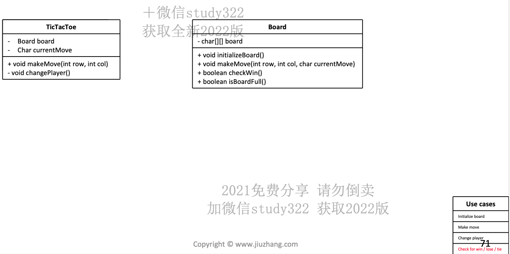

### 1. Design stackoverflow

### 2. Design UNIX FIND

> Implemnet linux find command as an api ,the api willl support finding files that has given size requirements and a file with a certain format like xml…
>
> 1. find all file >5mb
> 2. find all xml
>    Assume file class
>    {
>    get name()
>    directorylistfile()
>    getFile()
>    create a library flexible that is flexible
>    Design clases,interfaces.
>
> `````java
> import java.io.File;
> import java.util.ArrayList;
> import java.util.List;
> 
> // Interface to represent a filter for finding files
> interface FileFilter {
>     List<File> filter(File directory);
> }
> 
> // Class to find files based on size requirements
> class SizeFilter implements FileFilter {
>     private long sizeInBytes;
> 
>     public SizeFilter(long sizeInBytes) {
>         this.sizeInBytes = sizeInBytes;
>     }
> 
>     @Override
>     public List<File> filter(File directory) {
>         List<File> resultFiles = new ArrayList<>();
>         File[] files = directory.listFiles();
> 
>         if (files != null) {
>             for (File file : files) {
>                 if (file.isFile() && file.length() > sizeInBytes) {
>                     resultFiles.add(file);
>                 } else if (file.isDirectory()) {
>                     resultFiles.addAll(filter(file));
>                 }
>             }
>         }
>         return resultFiles;
>     }
> }
> 
> // Class to find files with a certain format
> class FormatFilter implements FileFilter {
>     private String format;
> 
>     public FormatFilter(String format) {
>         this.format = format;
>     }
> 
>     @Override
>     public List<File> filter(File directory) {
>         List<File> resultFiles = new ArrayList<>();
>         File[] files = directory.listFiles();
> 
>         if (files != null) {
>             for (File file : files) {
>                 if (file.isFile() && file.getName().endsWith(format)) {
>                     resultFiles.add(file);
>                 } else if (file.isDirectory()) {
>                     resultFiles.addAll(filter(file));
>                 }
>             }
>         }
>         return resultFiles;
>     }
> }
> 
> // Class representing the API for the find command
> public class FindCommandAPI {
>     // Method to find files based on a given filter
>     public List<File> findFiles(File directory, FileFilter filter) {
>         return filter.filter(directory);
>     }
> }
> `````

### 3. Design Pizza

> 
>
> ~~~java
> import java.util.List;
> import java.util.ArrayList;
> 
> public enum BaseType {
>     SOFT(1),
>     MEDIUM(2),
>     HARD(3);
> 
>     private double price;
> 
>     private BaseType(double price) {
>         this.price = price;
>     }
> 
>     public double getPrice() {
>         return price;
>     }
> }
> 
> public enum Topping {
>     MEAT(2, 0.8), // Discounted price for meat topping
>     VEGGIE(1, 0.9); // Discounted price for veggie topping
> 
>     private double price;
>     private double discount; // Discount factor for the topping
> 
>     private Topping(double price, double discount) {
>         this.price = price;
>         this.discount = discount;
>     }
> 
>     public double getPrice() {
>         return price * discount; // Apply discount to the original price
>     }
> }
> 
> public class Customer {
>     String name;
> }
> 
> public class Pizza {
>     Double price;
>     BaseType base;
>     List<Topping> toppings;
>     int size; // Size of the pizza (1 for small, 2 for medium, 3 for large)
> 
>     public Double getPrice() {
>         double totalPrice = base.getPrice(); // Add base price
> 
>         for (Topping topping : toppings) {
>             totalPrice += topping.getPrice(); // Add price of each topping
>         }
> 
>         // Adjust price based on pizza size
>         totalPrice *= size;
> 
>         return totalPrice;
>     }
> }
> 
> public class Order {
>     List<Pizza> pizzas;
>     Double price;
>     Customer customer;
> 
>     public Order() {
>         pizzas = new ArrayList<>();
>     }
> 
>     public void addPizza(Pizza pizza) {
>         pizzas.add(pizza);
>     }
> 
>     public Double calculateTotalPrice() {
>         double totalPrice = 0.0;
>         for (Pizza pizza : pizzas) {
>             totalPrice += pizza.getPrice();
>         }
>         return totalPrice;
>     }
> }
> 
> public interface Payment {
>     void pay();
> }
> 
> public enum PayType {
>     CASH,
>     CREDIT_CARD
> }
> 
> public class PizzaSystem {
>     List<Order> orders;
> 
>     public Double calculateTotalPrice() {
>         double totalPrice = 0.0;
>         for (Order order : orders) {
>             totalPrice += order.calculateTotalPrice();
>         }
>         return totalPrice;
>     }
> 
>     public void makePayment(Order order, PayType payType) {
>         // Logic to make payment
>     }
> }
> 
> ~~~

### 4. Design Parking Lot

> 
>
> ```java
> import java.util.List;
> 
> interface Vehicle {
>     int getSize();
>     float getHourlyRate();
> }
> 
> class Car implements Vehicle {
>     int size = 2;
>     @Override
>     public int getSize() {
>         return size;
>     }
>     
>     @Override
>     public float getHourlyRate() {
>         // Set a default hourly rate for cars
>         return 10.0f; // Example rate: $10 per hour
>     }
> }
> 
> class Motorcycle implements Vehicle {
>   	int size = 1;
>     @Override
>     public int getSize() {
>         return size;
>     }
>     
>     @Override
>     public float getHourlyRate() {
>         // Set a default hourly rate for motorcycles
>         return 5.0f; // Example rate: $5 per hour
>     }
> }
> 
> class Bus implements Vehicle {
>     int size = 3;
>     @Override
>     public int getSize() {
>         return size;
>     }
>     
>     @Override
>     public float getHourlyRate() {
>         // Set a default hourly rate for buses
>         return 20.0f; // Example rate: $20 per hour
>     }
> }
> 
> class ParkingLot {
>     private List<Level> levels;
>    // private float hourlyRate;
> 
>     public ParkingLot(List<Level> levels, float hourlyRate) {
>         this.levels = levels;
>         this.hourlyRate = hourlyRate;
>     }
> 
>     public int getAvailableCount() {
>         int availableCount = 0;
>         for (Level level : levels) {
>             availableCount += level.getAvailableCount();
>         }
>         return availableCount;
>     }
> 
>     public List<Spot> findSpotsForVehicle(Vehicle v) {
>         for (Level level : levels) {
>             List<Spot> spots = level.findSpotsForVehicle(v);
>             if (spots != null && !spots.isEmpty()) {
>                 return spots;
>             }
>         }
>         return null;
>     }
> 
>     public Ticket parkVehicle(Vehicle v) {
>         List<Spot> spots = findSpotsForVehicle(v);
>         if (spots == null || spots.isEmpty()) {
>             throw new ParkingLotFullException("No available spots for vehicle");
>         }
>         Ticket ticket = new Ticket(v, spots);
>         return ticket;
>     }
> 
>     public void clearSpot(Ticket t) {
>         // Implementation to clear spot based on ticket
>     }
> 
>     public float calculatePrice(Ticket t) {
>         // Implementation to calculate price based on ticket and hourly rate
>         return 0.0f;
>     }
> }
> 
> class Spot {
>     private boolean available;
>     private Level level;
> 
>     public boolean isAvailable() {
>         return available;
>     }
> 
>     public void takeSpot() {
>         available = false;
>     }
> 
>     public void leaveSpot() {
>         available = true;
>     }
> }
> 
> class Ticket {
>     private Vehicle vehicle;
>     private List<Spot> spots;
>     private Time startTime;
>   	int level;
>   	int spotId;
> 
>     public Ticket(Vehicle vehicle, int level, int spotId) {
>         this.level = level;
>       	this. spotId = spotId;
>         this.spots = spots;
>         this.startTime = Time.now(); // Assuming Time class exists
>     }
> }
> 
> class Level {
>     private List<Row> rows;
>     private int availableCount;
> 
>     public int getAvailableCount() {
>         return availableCount;
>     }
> }
> 
> class ParkingLotFullException extends RuntimeException {
>     public ParkingLotFullException(String message) {
>         super(message);
>     }
> }
> 
> class InvalidTicketException extends RuntimeException {
>     public InvalidTicketException(String message) {
>         super(message);
>     }
> }
> 
> class Row {
>     private List<Spot> spots;
> }
> 
> ```
>
> 
>
> 

### 5. Design Elevator

> 
>
> 

### 6. Design Restaurant with Reservation

> 

### 7. Design Hotel with Reservation

> 

### 8. Design VendingMachine

> 

### 9. Design Coffee Maker

> 

### 10. Design Kindle

> 

### 11. Design Tic Tac Toe

> \- 玩家 - 规则 - 胜负 - 积分
>
> 对于本题:X always takes the first move 
>
> 棋牌类游戏的三种状态
>
> - Initialization (摆盘，洗牌...)
> - Play (下棋，出牌...)
> - Win/Lose check (胜负结算) + Tie (流局)
>
> Check if X win / Check if O win / Check if board full
>
> 
> ```java
> public class TicTacToe {
>     private Board board;
>     private char currentMove;
> 
>     public TicTacToe() {
>         board = new Board();
>         currentMove = 'X'; // X starts the game
>     }
> 
>     public void makeMove(int row, int col) {
>         board.makeMove(row, col, currentMove);
>         if (board.checkWin()) {
>             System.out.println("Player " + currentMove + " wins!");
>         } else if (board.isBoardFull()) {
>             System.out.println("It's a draw!");
>         } else {
>             changePlayer();
>         }
>     }
> 
>     private void changePlayer() {
>         currentMove = (currentMove == 'X') ? 'O' : 'X';
>     }
> }
> 
> public class Board {
>     private char[][] board;
> 
>     public Board() {
>         board = new char[3][3];
>     }
> 
>     public void makeMove(int row, int col, char currentMove) {
>         if (board[row][col] == '\0') {
>             board[row][col] = currentMove;
>         } else {
>             System.out.println("Invalid move. Cell already occupied.");
>         }
>     }
> 
>     public boolean checkWin() {
>         // Check rows
>         for (int i = 0; i < 3; i++) {
>             if (board[i][0] == board[i][1] && board[i][1] == board[i][2] && board[i][0] != '\0') {
>                 return true;
>             }
>         }
>         // Check columns
>         for (int j = 0; j < 3; j++) {
>             if (board[0][j] == board[1][j] && board[1][j] == board[2][j] && board[0][j] != '\0') {
>                 return true;
>             }
>         }
>         // Check diagonals
>         if ((board[0][0] == board[1][1] && board[1][1] == board[2][2] && board[0][0] != '\0') ||
>                 (board[0][2] == board[1][1] && board[1][1] == board[2][0] && board[0][2] != '\0')) {
>             return true;
>         }
>         return false;
>     }
> 
>     public boolean isBoardFull() {
>         for (int i = 0; i < 3; i++) {
>             for (int j = 0; j < 3; j++) {
>                 if (board[i][j] == '\0') {
>                     return false;
>                 }
>             }
>         }
>         return true;
>     }
> }
> 
> ```

### 12. Design BattleShip

> ```java
> import java.util.ArrayList;
> import java.util.List;
> import java.util.Random;
> import java.util.Scanner;
> 
> // Represents a cell on the game board
> class Cell {
>     private boolean isOccupied;
>     private boolean isHit;
> 
>     public Cell() {
>         this.isOccupied = false;
>         this.isHit = false;
>     }
> 
>     public boolean isOccupied() {
>         return isOccupied;
>     }
> 
>     public void occupy() {
>         this.isOccupied = true;
>     }
> 
>     public boolean isHit() {
>         return isHit;
>     }
> 
>     public void hit() {
>         this.isHit = true;
>     }
> }
> 
> // Represents a ship in the game
> class Ship {
>     private int size;
>     private boolean isSunk;
> 
>     public Ship(int size) {
>         this.size = size;
>         this.isSunk = false;
>     }
> 
>     public int getSize() {
>         return size;
>     }
> 
>     public boolean isSunk() {
>         return isSunk;
>     }
> 
>     public void sink() {
>         this.isSunk = true;
>     }
> }
> 
> // Represents the game board
> class Board {
>     private Cell[][] grid;
>     private List<Ship> ships;
> 
>     public Board(int rows, int cols) {
>         this.grid = new Cell[rows][cols];
>         this.ships = new ArrayList<>();
> 
>         for (int i = 0; i < rows; i++) {
>             for (int j = 0; j < cols; j++) {
>                 this.grid[i][j] = new Cell();
>             }
>         }
>     }
> 
>     public boolean placeShip(Ship ship, int row, int col, boolean isVertical) {
>         int size = ship.getSize();
>         int endRow = isVertical ? row + size - 1 : row;
>         int endCol = isVertical ? col : col + size - 1;
> 
>         if (endRow >= grid.length || endCol >= grid[0].length) {
>             return false;
>         }
> 
>         for (int i = row; i <= endRow; i++) {
>             for (int j = col; j <= endCol; j++) {
>                 if (grid[i][j].isOccupied()) {
>                     return false;
>                 }
>             }
>         }
> 
>         for (int i = row; i <= endRow; i++) {
>             for (int j = col; j <= endCol; j++) {
>                 grid[i][j].occupy();
>             }
>         }
> 
>         ships.add(ship);
>         return true;
>     }
> 
>     public boolean isHit(int row, int col) {
>         return grid[row][col].isOccupied() && !grid[row][col].isHit();
>     }
> 
>     public void markHit(int row, int col) {
>         grid[row][col].hit();
>     }
> 
>     public boolean isGameOver() {
>         for (Ship ship : ships) {
>             if (!ship.isSunk()) {
>                 return false;
>             }
>         }
>         return true;
>     }
> }
> 
> // Represents the Battleship game
> public class BattleshipGame {
>     private Board playerBoard;
>     private Board computerBoard;
>     private Random random;
> 
>     public BattleshipGame() {
>         this.playerBoard = new Board(10, 10);
>         this.computerBoard = new Board(10, 10);
>         this.random = new Random();
>     }
> 
>     public void setupGame() {
>         // Place ships on player and computer boards
>         placeShips(playerBoard);
>         placeShips(computerBoard);
>     }
> 
>     private void placeShips(Board board) {
>         // Place ships randomly on the board for now
>         for (int i = 0; i < 5; i++) {
>             int row = random.nextInt(10);
>             int col = random.nextInt(10);
>             boolean isVertical = random.nextBoolean();
>             Ship ship = new Ship(3); // All ships have size 3 for simplicity
>             board.placeShip(ship, row, col, isVertical);
>         }
>     }
> 
>     public void playGame() {
>         Scanner scanner = new Scanner(System.in);
> 
>         while (!playerBoard.isGameOver() && !computerBoard.isGameOver()) {
>             System.out.println("Your turn:");
>             int row = scanner.nextInt();
>             int col = scanner.nextInt();
>             if (computerBoard.isHit(row, col)) {
>                 computerBoard.markHit(row, col);
>                 System.out.println("Hit!");
>             } else {
>                 System.out.println("Miss!");
>             }
> 
>             // Computer's turn
>             int compRow = random.nextInt(10);
>             int compCol = random.nextInt(10);
>             if (playerBoard.isHit(compRow, compCol)) {
>                 playerBoard.markHit(compRow, compCol);
>                 System.out.println("Computer hit your ship!");
>             } else {
>                 System.out.println("Computer missed!");
>             }
>         }
> 
>         if (playerBoard.isGameOver()) {
>             System.out.println("Congratulations! You win!");
>         } else {
>             System.out.println("Computer wins! Better luck next time!");
>         }
> 
>         scanner.close();
>     }
> 
>     public static void main(String[] args) {
>         BattleshipGame game = new BattleshipGame();
>         game.setupGame();
>         game.playGame();
>     }
> }
> ```
>

### 13. Disign Log Interface

> ```java
> import java.time.LocalDateTime;
> 
> // Enum for log levels
> enum LogLevel {
>     INFO,
>     DEBUG,
>     WARNING,
>     ERROR
> }
> 
> // Interface for a log entry
> interface LogEntry {
>     LocalDateTime getDateTime();
>     String getMessage();
>     LogLevel getLevel();
> }
> 
> // Implementation of LogEntry interface
> class SimpleLogEntry implements LogEntry {
>     private LocalDateTime dateTime;
>     private String message;
>     private LogLevel level;
> 
>     public SimpleLogEntry(LocalDateTime dateTime, String message, LogLevel level) {
>         this.dateTime = dateTime;
>         this.message = message;
>         this.level = level;
>     }
> 
>     @Override
>     public LocalDateTime getDateTime() {
>         return dateTime;
>     }
> 
>     @Override
>     public String getMessage() {
>         return message;
>     }
> 
>     @Override
>     public LogLevel getLevel() {
>         return level;
>     }
> }
> 
> // Interface for a logger
> interface Logger {
>     void log(String message, LogLevel level);
> }
> 
> // Implementation of Logger interface
> class SimpleLogger implements Logger {
>     @Override
>     public void log(String message, LogLevel level) {
>         LocalDateTime dateTime = LocalDateTime.now();
>         LogEntry entry = new SimpleLogEntry(dateTime, message, level);
>         // Implement logging logic here (e.g., writing to a file, printing to console)
>         System.out.println(entry.getDateTime() + " [" + entry.getLevel() + "] " + entry.getMessage());
>     }
> }
> 
> // Example usage
> public class Main {
>     public static void main(String[] args) {
>         Logger logger = new SimpleLogger();
>         logger.log("This is an info message", LogLevel.INFO);
>         logger.log("This is a debug message", LogLevel.DEBUG);
>         logger.log("This is a warning message", LogLevel.WARNING);
>         logger.log("This is an error message", LogLevel.ERROR);
>     }
> }
> ```

### 14. Design CheckOut Service

> OOP: Design a checkout service with given classes [coupon, payment, product] with list requirements. 
>
> 1. An order has at least a product, at most a coupon. 
> 2. With different payment method as giftcard and payment giftcard, make sure giftcard can not purchase giftcard. 
> 3. follow up: Discuss if we only have one coupon left but 5 people try to apply the coupon
>
> ```java
> import java.util.List;
> 
> public class Coupon {
>     private String code;
>     private double discountAmount;
>     private boolean valid;
> 
>     public Coupon(String code, double discountAmount) {
>         this.code = code;
>         this.discountAmount = discountAmount;
>         this.valid = true;
>     }
> 
>     public String getCode() {
>         return code;
>     }
> 
>     public double getDiscountAmount() {
>         return discountAmount;
>     }
> 
>     public boolean isValid() {
>         return valid;
>     }
> 
>     public void setValid(boolean valid) {
>         this.valid = valid;
>     }
> }
> 
> public interface Payment {
>     void processPayment(double amount);
> }
> 
> public class Product {
>     private String name;
>     private double price;
>     private int quantity;
> 
>     public Product(String name, double price, int quantity) {
>         this.name = name;
>         this.price = price;
>         this.quantity = quantity;
>     }
> 
>     public String getName() {
>         return name;
>     }
> 
>     public double getPrice() {
>         return price;
>     }
> 
>     public int getQuantity() {
>         return quantity;
>     }
> }
> 
> public class Order {
>     private List<Product> products;
>     private Coupon coupon;
>     private Payment payment;
> 
>     public Order(List<Product> products) {
>         if (products.isEmpty()) {
>             throw new IllegalArgumentException("An order must have at least one product");
>         }
>         this.products = products;
>     }
> 
>     public void applyCoupon(Coupon coupon) {
>         if (this.coupon != null) {
>             throw new IllegalStateException("An order can have at most one coupon");
>         }
>         this.coupon = coupon;
>     }
> 
>     public double calculateTotalPrice() {
>         double totalPrice = products.stream()
>           .mapToDouble(product -> product.getPrice() * product.getQuantity()).sum();
>         if (coupon != null && coupon.isValid()) {
>             totalPrice -= coupon.getDiscountAmount();
>         }
>         return totalPrice;
>     }
> 
>     public void processPayment(Payment payment) {
>         this.payment = payment;
>         double totalPrice = calculateTotalPrice();
>         payment.processPayment(totalPrice);
>     }
> }
> 
> public class GiftCardPayment implements Payment {
>     @Override
>     public void processPayment(double amount) {
>         // Logic to process payment using gift card
>         if (amount <= 0) {
>             throw new IllegalArgumentException("Invalid payment amount for gift card");
>         }
>     }
> }
> 
> public class Checkout {
>     public void processPayment(Payment payment, Order order) {
>         if (payment instanceof GiftCardPayment && Order.getProducts().contains("GiftCard")) {
>             throw new IllegalArgumentException("Cannot purchase gift card using gift card.");
>         }
>         payment.processPayment(amount);
>     }
> }
> ```

### 15. Design Battery Display

> There are a wide variety of Alexa devices
> 1. Alexa devices that only have a speaker (Echo Dot, Echo Flex, https://www.amazon.com/dp/B07FZ8S74R)
> 2. Alexa devices that only have a screen/display (Alexa enabled Microwave or AC, https://www.amazon.com/dp/B07894S727)
> 3. Alexa devices that have both, speaker and screen (Echo Show, Echo Spot, https://www.amazon.com/dp/B08KJN3333).
> 4. Alexa devices that have neither a speaker, nor a screen (Echo Input, Echo link, https://www.amazon.com/dp/B0798DVZCY).
> 5. Alexa devices that have a speaker, but can be connected to a display (FireTV cube, https://www.amazon.com/dp/B08XMDNVX6).
>
> Also,
> 1. Some Alexa devices that have batteries (Fire Tablets, Echo Tap, Echo Buds, https://www.amazon.com/dp/B085WTYQ4X)
> 2. Others that do not have batteries (Echo Dot, Echo Show).
>
> Design a set of classes that will report the current battery/power status to the user.
> Depending on the hardware, the response may need to be spoken, or displayed on a screen, or both.
> Also, depending on whether there is a battery or not, the status message will differ.
> For example, if the device is a Tablet which has a battery, a speaker, and a display, and currently
> it happens to be plugged in and recharging (let's say at 75%), then your code should return the following:
>      {
>          "say": "Current battery level is 75% and charging",
>          "display": "Current battery level is 75% and charging"
>      }
>
> Whereas if the device is an Echo Dot, which has a speaker but no battery and no screen,
> then your code should only return:
>      {
>          "say": "Currently plugged into wall power"
>      }
>
> and should NOT attempt to display anything (since there is no screen).
>
> ```java
> // Abstract class representing all Alexa devices
> abstract class AlexaDevice {
>     private Battery battery;
>     private boolean charging;
>   
>     public boolean isCharging() {
>         return charging;
>     }
>   
>   	public void setCharging() {
>         charging = true;
>     }
>   
> 
>     public AlexaDevice(Battery battery) {
>         this.battery = battery;
>     }
> 
>     abstract String getBatteryStatus();
> 
>     public Battery getBattery() {
>         return battery;
>     }
> 
>     public void setBattery(Battery battery) {
>         this.battery = battery;
>     }
> }
> 
> // Subclasses for different types of Alexa devices
> class SpeakerOnlyDevice extends AlexaDevice {
>     public SpeakerOnlyDevice(Battery battery) {
>         super(battery);
>     }
> 
>     @Override
>     String getBatteryStatus() {
>         return "Currently plugged into wall power";
>     }
> }
> 
> class ScreenOnlyDevice extends AlexaDevice {
>     public ScreenOnlyDevice(Battery battery) {
>         super(battery);
>     }
> 
>     @Override
>     String getBatteryStatus() {
>        // return "No battery status available";
>     }
> }
> 
> class SpeakerAndScreenDevice extends AlexaDevice {
>     public SpeakerAndScreenDevice(Battery battery) {
>         super(battery);
>     }
> 
>     @Override
>     String getBatteryStatus() {
>         //return "No battery status available";
>     }
> }
> 
> class NoSpeakerNoScreenDevice extends AlexaDevice {
>     public NoSpeakerNoScreenDevice(Battery battery) {
>         super(battery);
>     }
> 
>     @Override
>     String getBatteryStatus() {
>         return "No battery status available";
>     }
> }
> 
> // Class representing the battery status
> class Battery {
>     private int level;
> 
>     public Battery(int level, boolean charging) {
>         this.level = level;
>         this.charging = charging;
>     }
> 
>     public int getLevel() {
>         return level;
>     }
> 
> }
> 
> public class BatteryDisplay {
>   public show(AlexaDevice alexaDevice){
>     alexaDevice.display()
>     
>   }
> }
> 
> ```

### 16. Design Purchase System

> Build a purchase system: 
> class Purchase 
> class Item 
> class PaymentInstrument
>
>  Rules/Constraints: PaymentInstrument must be 'CreditCard' or 'GiftCertificate' There must be at least one item in shopping cart If total cost > 100, paymentInstrument must be 'creditCard' 
> follow up: How would you validate your changes, do you have to mannually some happy cases in order to test others?
>
> ```java
> import java.util.ArrayList;
> import java.util.List;
> 
> public class ShoppingCart {
>     private List<Item> items;
> 
>     public ShoppingCart() {
>         this.items = new ArrayList<>();
>     }
> 
>     public void addItem(Item item) {
>         items.add(item);
>     }
> 
>     public void removeItem(Item item) {
>         items.remove(item);
>     }
> 
>     public List<Item> getItems() {
>         return items;
>     }
> 
>     public double getTotalCost() {
>         double totalCost = 0;
>         for (Item item : items) {
>             totalCost += item.getPrice();
>         }
>         return totalCost;
>     }
> }
> 
> public class Purchase {
>     private ShoppingCart shoppingCart;
>     private PaymentInstrument paymentInstrument;
> 
>     public Purchase(ShoppingCart shoppingCart, PaymentInstrument paymentInstrument) {
>         if (shoppingCart == null || shoppingCart.getItems().isEmpty()) {
>             throw new IllegalArgumentException("There must be at least one item in the shopping cart");
>         }
>         if (!isValidPaymentInstrument(paymentInstrument)) {
>             throw new IllegalArgumentException("Invalid payment instrument");
>         }
>         this.shoppingCart = shoppingCart;
>         this.paymentInstrument = paymentInstrument;
>         if (shoppingCart.getTotalCost() > 100 && paymentInstrument != PaymentInstrument.CREDIT_CARD) {
>             throw new IllegalArgumentException("Payment instrument must be 'CreditCard' for purchases over $100");
>         }
>     }
> 
>     private boolean isValidPaymentInstrument(PaymentInstrument paymentInstrument) {
>         return paymentInstrument == PaymentInstrument.CREDIT_CARD ||
>                paymentInstrument == PaymentInstrument.GIFT_CERTIFICATE;
>     }
> 
>     public double getTotalCost() {
>         return shoppingCart.getTotalCost();
>     }
> 
>     public PaymentInstrument getPaymentInstrument() {
>         return paymentInstrument;
>     }
> }
> 
> public class Item {
>     private String name;
>     private double price;
> 
>     public Item(String name, double price) {
>         this.name = name;
>         this.price = price;
>     }
> 
>     public String getName() {
>         return name;
>     }
> 
>     public double getPrice() {
>         return price;
>     }
> }
> 
> public interface PaymentInstrument {
>     void processPayment(double amount);
> }
> 
> public class CreditCardPayment implements PaymentInstrument {
>     @Override
>     public void processPayment(double amount) {
>         // Process credit card payment logic
>     }
> }
> 
> public class GiftCertificatePayment implements PaymentInstrument {
>     @Override
>     public void processPayment(double amount) {
>         // Process gift certificate payment logic
>     }
> }
> 
> ```

### 17. Design Amazon Lock

> amazon lock 但是这个lock 是三维的 有长宽高 然后就在在一个pick up location 里面 给出一个package 三维 然后找出这个match 这个package 的 lock 
>
> ```java
> import java.util.ArrayList;
> import java.util.List;
> 
> public class AmazonLock {
>     private double length;
>     private double width;
>     private double height;
>     private boolean available;
> 
>     public AmazonLock(double length, double width, double height) {
>         this.length = length;
>         this.width = width;
>         this.height = height;
>         this.available = true;
>     }
> 
>     public double getLength() {
>         return length;
>     }
> 
>     public double getWidth() {
>         return width;
>     }
> 
>     public double getHeight() {
>         return height;
>     }
> 
>     public boolean isAvailable() {
>         return available;
>     }
> 
>     public void setAvailable(boolean available) {
>         this.available = available;
>     }
> }
> 
> public class Package {
>     private double length;
>     private double width;
>     private double height;
> 
>     public Package(double length, double width, double height) {
>         this.length = length;
>         this.width = width;
>         this.height = height;
>     }
> 
>     public double getLength() {
>         return length;
>     }
> 
>     public double getWidth() {
>         return width;
>     }
> 
>     public double getHeight() {
>         return height;
>     }
> }
> 
> public class PickupService {
>     private List<AmazonLock> availableLocks;
> 
>     public PickupService() {
>         this.availableLocks = new ArrayList<>();
>     }
> 
>     public void addLock(AmazonLock lock) {
>         availableLocks.add(lock);
>     }
> 
>     public AmazonLock findMatchingLock(Package pkg) {
>         double packageLength = pkg.getLength();
>         double packageWidth = pkg.getWidth();
>         double packageHeight = pkg.getHeight();
>         
>         for (AmazonLock lock : availableLocks) {
>             if (lock.isAvailable() && lock.getLength() >= packageLength &&
>                 lock.getWidth() >= packageWidth && lock.getHeight() >= packageHeight) {
>                 return lock;
>             }
>         }
>         return null;
>     }
> }
> 
> ```

### 18. Design Card Game

> 一个OOD，卡牌游戏，模拟一个deck，可以就当成斗地主的那种牌来看，有3种花色，3种图样，3种数字，排列组合，比如说红色方块3，黑色圆圈1，每一种组合只有一张。       N个玩家，每人可以拿3张，只要手上的三张牌符合下面任意一个条件就算赢：               
>
> 1.  完全不相同: 红色方块3，黑色圆圈1, 蓝色三角形2
> 2. 花色，图样，数字有且只有一种是完全一样：红色方块3，红色圆圈1, 红色三角形2，都是红色   
>
> 就是实现这个deck，可以洗牌，可以发牌，可以检测一个玩家的手牌能否赢。然后就是一堆发散的问题，比如说有哪些Corner case需要处理，有哪些地方可以scale up等等
>
> ```java
> import java.util.ArrayList;
> import java.util.HashSet;
> import java.util.List;
> import java.util.Random;
> import java.util.Set;
> 
> class Card {
>     private final String color;
>     private final String pattern;
>     private final int number;
> 
>     public Card(String color, String pattern, int number) {
>         this.color = color;
>         this.pattern = pattern;
>         this.number = number;
>     }
> 
>     @Override
>     public String toString() {
>         return color + " " + pattern + " " + number;
>     }
> }
> 
> class Deck {
>     private final List<Card> cards;
> 
>     public Deck() {
>         cards = new ArrayList<>();
>         String[] colors = {"red", "black", "blue"};
>         String[] patterns = {"diamond", "circle", "triangle"};
>         int[] numbers = {1, 2, 3};
>         for (String color : colors) {
>             for (String pattern : patterns) {
>                 for (int number : numbers) {
>                     cards.add(new Card(color, pattern, number));
>                 }
>             }
>         }
>     }
> 
>     public void shuffle() {
>         Random random = new Random();
>         for (int i = cards.size() - 1; i > 0; i--) {
>             int j = random.nextInt(i + 1);
>             Card temp = cards.get(i);
>             cards.set(i, cards.get(j));
>             cards.set(j, temp);
>         }
>     }
> 
>     public List<Card> deal(int n) {
>         List<Card> dealtCards = new ArrayList<>();
>         for (int i = 0; i < n; i++) {
>             dealtCards.add(cards.remove(cards.size() - 1));
>         }
>         return dealtCards;
>     }
> }
> 
> class Player {
>     private final String name;
>     private List<Card> hand;
> 
>     public Player(String name) {
>         this.name = name;
>         hand = new ArrayList<>();
>     }
> 
>     public void drawCard(Card card) {
>         hand.add(card);
>     }
> 
>     public boolean hasWinningHand() {
>         if (hand.size() != 3) {
>             return false;
>         }
>         Set<String> colors = new HashSet<>();
>         Set<String> patterns = new HashSet<>();
>         Set<Integer> numbers = new HashSet<>();
>         for (Card card : hand) {
>             colors.add(card.color);
>             patterns.add(card.pattern);
>             numbers.add(card.number);
>         }
>         return (colors.size() == 3 && patterns.size() == 3 && numbers.size() == 3) ||
>                (colors.size() == 1 && patterns.size() == 3 && numbers.size() == 3) ||
>                (colors.size() == 3 && patterns.size() == 1 && numbers.size() == 3) ||
>                (colors.size() == 3 && patterns.size() == 3 && numbers.size() == 1);
>     }
> 
>     @Override
>     public String toString() {
>         return name + "'s hand: " + hand;
>     }
> }
> 
> class Game {
>     private final Deck deck;
>     private final List<Player> players;
> 
>     public Game(List<String> playerNames) {
>         deck = new Deck();
>         players = new ArrayList<>();
>         for (String name : playerNames) {
>             players.add(new Player(name));
>         }
>     }
> 
>     public void startGame() {
>         deck.shuffle();
>         for (Player player : players) {
>             player.drawCard(deck.deal(3).get(0));
>         }
>     }
> 
>     public List<Player> checkWinner() {
>         List<Player> winners = new ArrayList<>();
>         for (Player player : players) {
>             if (player.hasWinningHand()) {
>                 winners.add(player);
>             }
>         }
>         return winners;
>     }
> }
> 
> public class Main {
>     public static void main(String[] args) {
>         List<String> playerNames = List.of("Alice", "Bob");
>         Game game = new Game(playerNames);
>         game.startGame();
>         for (Player player : game.players) {
>             System.out.println(player);
>         }
>         List<Player> winners = game.checkWinner();
>         if (!winners.isEmpty()) {
>             for (Player winner : winners) {
>                 System.out.println(winner.name + " wins with " + winner.hand);
>             }
>         } else {
>             System.out.println("No winners this round.");
>         }
>     }
> }
> ```

### 19. Design on-call system

> ood on‍‍‌‌‌‍‌‍‌‌‍‍‌‌‍‍‍‍‌‌call system。员工有primary有secondary有最后一级，问怎么assign ticket和transfer ticket
>
> 设计一个On-Call系统时，需要考虑以下几个关键功能和组件：
>
> 1. **员工角色和优先级**：
>    - 每个员工可以是`Primary`（主责任人）或`Secondary`（次责任人）。
>    - 当主责任人不可用或未响应时，票据应自动转移给次责任人。
>
> 2. **票据（Ticket）管理**：
>    - 创建票据并分配给员工。
>    - 票据的状态管理（例如：打开、进行中、已解决、关闭）。
>    - 票据的转移功能。
>
> 3. **员工管理**：
>    - 员工信息的维护。
>    - 设置员工的值班状态（On-Call/Off-Call）。
>
> 4. **通知和提醒**：
>    - 主责任人未响应时的提醒和转移通知。
>
> 以下是一个基本的类设计方案：
>
> 类和接口
>
> > 1. **Ticket**:
> >    - 属性: `id`, `title`, `description`, `status`, `assignedEmployee`
> >    - 方法: `assignTo(Employee employee)`, `transferTo(Employee employee)`
> >
> > 2. **Employee**:
> >    - 属性: `id`, `name`, `role`（Primary/Secondary）, `onCallStatus`
> >    - 方法: `setOnCallStatus(boolean status)`, `isOnCall()`
> >
> > 3. **TicketManager**:
> >    - 属性: `List<Ticket> tickets`, `List<Employee> employees`
> >    - 方法: `createTicket(String title, String description)`, `assignTicket(int ticketId, int employeeId)`, `transferTicket(int ticketId, int newEmployeeId)`, `getTicket(int ticketId)`
> >
> > 4. **NotificationService**:
> >    - 方法: `notify(Employee employee, String message)`
>
> 这个设计中，`TicketManager` 管理票据的创建、分配和转移，`NotificationService` 负责通知员工。通过这个设计，可以灵活地实现不同的功能，例如票据的自动转移、员工的值班状态管理等。
>
> ```java
> enum Role {
>     PRIMARY, SECONDARY
> }
> 
> enum TicketStatus {
>     OPEN, IN_PROGRESS, RESOLVED, CLOSED
> }
> 
> class Employee {
>     private int id;
>     private String name;
>     private Role role;
>     private boolean onCallStatus;
> 
>     public Employee(int id, String name, Role role) {
>         this.id = id;
>         this.name = name;
>         this.role = role;
>         this.onCallStatus = false;
>     }
> 
>     public int getId() {
>         return id;
>     }
> 
>     public String getName() {
>         return name;
>     }
> 
>     public Role getRole() {
>         return role;
>     }
> 
>     public void setOnCallStatus(boolean status) {
>         this.onCallStatus = status;
>     }
> 
>     public boolean isOnCall() {
>         return onCallStatus;
>     }
> }
> 
> class Ticket {
>     private int id;
>     private String title;
>     private String description;
>     private TicketStatus status;
>     private Employee assignedEmployee;
> 
>     public Ticket(int id, String title, String description) {
>         this.id = id;
>         this.title = title;
>         this.description = description;
>         this.status = TicketStatus.OPEN;
>     }
> 
>     public void assignTo(Employee employee) {
>         this.assignedEmployee = employee;
>     }
> 
>     public void transferTo(Employee newEmployee) {
>         this.assignedEmployee = newEmployee;
>     }
> 
>     public Employee getAssignedEmployee() {
>         return assignedEmployee;
>     }
> 
>     public TicketStatus getStatus() {
>         return status;
>     }
> 
>     public void setStatus(TicketStatus status) {
>         this.status = status;
>     }
> }
> 
> class TicketManager {
>     private List<Ticket> tickets = new ArrayList<>();
>     private List<Employee> employees = new ArrayList<>();
> 
>     public Ticket createTicket(String title, String description) {
>         int id = tickets.size() + 1;
>         Ticket ticket = new Ticket(id, title, description);
>         tickets.add(ticket);
>         return ticket;
>     }
> 
>     public void addEmployee(Employee employee) {
>         employees.add(employee);
>     }
> 
>     public void assignTicket(int ticketId, int employeeId) {
>         Ticket ticket = getTicket(ticketId);
>         Employee employee = getEmployee(employeeId);
>         if (ticket != null && employee != null) {
>             ticket.assignTo(employee);
>         }
>     }
> 
>     public void transferTicket(int ticketId, int newEmployeeId) {
>         Ticket ticket = getTicket(ticketId);
>         Employee newEmployee = getEmployee(newEmployeeId);
>         if (ticket != null && newEmployee != null) {
>             ticket.transferTo(newEmployee);
>         }
>     }
> 
>     public Ticket getTicket(int ticketId) {
>         for (Ticket ticket : tickets) {
>             if (ticket.getId() == ticketId) {
>                 return ticket;
>             }
>         }
>         return null;
>     }
> 
>     private Employee getEmployee(int employeeId) {
>         for (Employee employee : employees) {
>             if (employee.getId() == employeeId) {
>                 return employee;
>             }
>         }
>         return null;
>     }
> }
> 
> class NotificationService {
>     public void notify(Employee employee, String message) {
>         // Send notification to the employee
>         System.out.println("Notification to " + employee.getName() + ": " + message);
>     }
> }
> 
> public class OnCallSystem {
>     public static void main(String[] args) {
>         TicketManager ticketManager = new TicketManager();
> 
>         // 创建员工
>         Employee alice = new Employee(1, "Alice", Role.PRIMARY);
>         Employee bob = new Employee(2, "Bob", Role.SECONDARY);
> 
>         // 添加员工到系统
>         ticketManager.addEmployee(alice);
>         ticketManager.addEmployee(bob);
> 
>         // 创建并分配票据
>         Ticket ticket1 = ticketManager.createTicket("Server Down", "The server is down.");
>         ticketManager.assignTicket(ticket1.getId(), alice.getId());
> 
>         // 转移票据
>         ticketManager.transferTicket(ticket1.getId(), bob.getId());
> 
>         // 通知系统（示例）
>         NotificationService notificationService = new NotificationService();
>         notificationService.notify(alice, "You have been assigned a new ticket.");
>     }
> }
> ```
>

### 20. Design pet store

> 设计一个宠物店系统，其中顾客可以预约宠物服务，并且店员有各自的可用时间，涉及到面向对象设计（OOD）时，通常会使用面向对象的原则和设计模式来实现。以下是一个简单的设计示例，包含接口、类和Java代码。
>
> ### 1. 设计考虑
>
> **面向对象设计（OOD）的原则**:
> 1. **单一职责原则 (SRP)**: 每个类应该只有一个职责。
> 2. **开放-封闭原则 (OCP)**: 软件实体应该对扩展开放，对修改封闭。
> 3. **里氏替换原则 (LSP)**: 子类对象应该能够替换掉父类对象。
> 4. **接口隔离原则 (ISP)**: 不应该强迫客户依赖于他们不使用的方法。
> 5. **依赖倒置原则 (DIP)**: 高层模块不应该依赖于低层模块，二者都应该依赖于抽象。
>
> **设计模式**:
> - **策略模式**: 处理不同类型的服务预约。
> - **工厂模式**: 创建不同类型的宠物服务。
> - **观察者模式**: 处理店员的可用时间变化。
>
> ### 2. 类和接口设计
>
> - **接口**:
>   - `Service`：定义宠物服务。
>   - `Availability`：定义店员的可用时间。
>   - `Scheduler`：处理预约。
>
> - **类**:
>   - `PetService`：实现`Service`接口。
>   - `Employee`：实现`Availability`接口。
>   - `Appointment`：表示一个预约。
>   - `PetStore`：管理宠物服务和店员，处理预约。
>
> ### 3. Java代码示例
>
> ```java
> import java.util.ArrayList;
> import java.util.List;
> 
> // 服务接口
> interface Service {
>     String getServiceName();
>     double getPrice();
> }
> 
> // 店员可用时间接口
> interface Availability {
>     boolean isAvailable(String timeSlot);
> }
> 
> // 预约接口
> interface Scheduler {
>     boolean bookAppointment(Employee employee, Service service, String timeSlot);
> }
> 
> // 实现具体的服务
> class PetGrooming implements Service {
>     private final String serviceName;
>     private final double price;
> 
>     public PetGrooming(String serviceName, double price) {
>         this.serviceName = serviceName;
>         this.price = price;
>     }
> 
>     @Override
>     public String getServiceName() {
>         return serviceName;
>     }
> 
>     @Override
>     public double getPrice() {
>         return price;
>     }
> }
> 
> // 实现具体的店员
> class Employee implements Availability {
>     private final String name;
>     private final List<String> availableTimeSlots;
> 
>     public Employee(String name, List<String> availableTimeSlots) {
>         this.name = name;
>         this.availableTimeSlots = availableTimeSlots;
>     }
> 
>     @Override
>     public boolean isAvailable(String timeSlot) {
>         return availableTimeSlots.contains(timeSlot);
>     }
> 
>     public String getName() {
>         return name;
>     }
> }
> 
> // 预约类
> class Appointment {
>     private final Employee employee;
>     private final Service service;
>     private final String timeSlot;
> 
>     public Appointment(Employee employee, Service service, String timeSlot) {
>         this.employee = employee;
>         this.service = service;
>         this.timeSlot = timeSlot;
>     }
> 
>     @Override
>     public String toString() {
>         return "Appointment with " + employee.getName() + " for " + service.getServiceName() +
>                " at " + timeSlot + " costing $" + service.getPrice();
>     }
> }
> 
> // 宠物店类
> class PetStore implements Scheduler {
>     private final List<Employee> employees = new ArrayList<>();
>     private final List<Service> services = new ArrayList<>();
>     private final List<Appointment> appointments = new ArrayList<>();
> 
>     public void addEmployee(Employee employee) {
>         employees.add(employee);
>     }
> 
>     public void addService(Service service) {
>         services.add(service);
>     }
> 
>     @Override
>     public boolean bookAppointment(Employee employee, Service service, String timeSlot) {
>         if (employee.isAvailable(timeSlot)) {
>             Appointment appointment = new Appointment(employee, service, timeSlot);
>             appointments.add(appointment);
>             return true;
>         }
>         return false;
>     }
> 
>     public List<Appointment> getAppointments() {
>         return appointments;
>     }
> }
> 
> // 测试示例
> public class Main {
>     public static void main(String[] args) {
>         PetStore petStore = new PetStore();
> 
>         // 创建服务
>         Service grooming = new PetGrooming("Dog Grooming", 50.0);
>         petStore.addService(grooming);
> 
>         // 创建店员
>         List<String> timeSlots = new ArrayList<>();
>         timeSlots.add("10:00 AM");
>         timeSlots.add("2:00 PM");
>         Employee john = new Employee("John", timeSlots);
>         petStore.addEmployee(john);
> 
>         // 预约服务
>         boolean booked = petStore.bookAppointment(john, grooming, "10:00 AM");
>         if (booked) {
>             System.out.println("Appointment booked successfully!");
>         } else {
>             System.out.println("Failed to book appointment.");
>         }
> 
>         // 打印预约
>         for (Appointment appointment : petStore.getAppointments()) {
>             System.out.println(appointment);
>         }
>     }
> }
> ```
>
> ### 4. 解释
>
> - **`Service`** 接口定义了宠物服务的基本属性。
> - **`Availability`** 接口定义了店员的可用时间。
> - **`Scheduler`** 接口用于处理预约逻辑。
> - **`PetGrooming`** 类实现了具体的服务。
> - **`Employee`** 类实现了具体的店员以及其可用时间。
> - **`Appointment`** 类表示一个预约实例。
> - **`PetStore`** 类管理店员和服务，并处理预约。
>
> 这个设计示例展示了如何使用面向对象原则和设计模式来构建一个简单的宠物店预约系统。你可以根据实际需求进一步扩展和优化。
