## 1. 系统设计

> 1. **可扩展性**
>
>    >  可扩展，意味着*服务能以加资源的方式成比例地提升性能*：
>   >
>    > Scalability is the property of a system to handle a growing amount of work by adding resources to the system.
>   >
>    > **纵向扩展（Vertical scaling）**
>   >
>    > >  即提升单机配置，对单台机器加内存、处理器、硬盘等硬件资源。投入足够多的预算，就能砸出一台配置豪华的服务器
>   >
>    > **横向扩展（Horizontal scaling)**
>   >
>    > >  即加机器，数量上从一台扩展到多台，多服务器形成拓扑结构。投入足够多的预算，就能拥有一个机房，甚至遍布全球数据中心	
>      >
>    > *加资源也会引入多样性*，一些节点可能比其它节点的处理能力更强大，另一些老旧节点可能弱一些，而系统又必须适应这种异质性（heterogeneity），那么依赖均匀性的算法就会对新节点利用不足，继而产生性能影响
>   
> 2. **延迟与吞吐量**
>   
>    > 延迟（Latency）是指从执行操作到产生结果所需要的时间：其度量单位是时间，例如秒（seconds）、纳秒（nanoseconds），系统时钟周期数（clock periods）
>   >
>    > >  Latency is the time required to perform some action or to produce some result. 
> 
>    > *吞吐量（Throughput）*是指单位时间内所能处理的操作数，或能产生的结果数：
>   >
>    > Throughput is the number of such actions executed or results produced per unit of time.
>   >
>    > 通过单位时间所生产的东西来计量，例如内存带宽（memory bandwidth）用来衡量内存系统的吞吐量，而对于Web系统，
>   >
>    > QPS（Queries Per Second）：用来衡量信息检索系统（如搜索引擎、数据库等）在1秒内的搜索流量
>   >
>    > RPS（Requests Per Second）：请求-响应系统（如Web服务器）每秒所能处理的最大请求数量
>   >
>    > TPS（Transactions Per Second）：广义上指在1秒内所能执行的原子操作数量，狭义上指DBMS在1秒所能执行数量
>
>    同样，由于无法兼具低延迟和高吞吐量，所以权衡之下的原则是：
>
>    > Generally, you should strive for maximal throughput with acceptable latency.
>
>    在确保延迟尚可接受的前提下，转而追求最大的吞吐量
>
> 3. **可用性与一致性**
>
>    > 关于可用性与一致性，有个著名的*CAP定理*：
>    >
>    > > Of three properties of distributed data systems – consistency, availability, partition tolerance – choose two. —— Eric Brewer, CAP theorem, PODC 2000
>   >
>    > 在分布式计算机系统中，一致性、可用性和分区容错性*三者只能择其二（而且分区容错性必选）*：
>   >
>    > - **一致性（Consistency）**：每次读取都能得到最新写入的结果，抑或出错。代表数据在任何时刻、任何分布式节点中所看到的都是符合预期的。基于证明严谨性的考虑，在学术的研究中一致性指的是强一致性（Strong Consistency）或者也叫做线性一致性（Linearizability）。
>    > - **可用性（Availability）**：每个请求都能收到正常响应，但不保证返回的是最新信息。代表系统不间断地提供服务的能力，理解可用性要先理解与其密切相关两个指标：可靠性（Reliability）和可维护性（Serviceability）。可靠性使用平均无故障时间（Mean Time Between Failure，MTBF）来度量；可维护性使用平均可修复时间（Mean Time To Repair，MTTR）来度量。可用性衡量系统可以正常使用的时间与总时间之比，其表征为：A=MTBF/（MTBF+MTTR），即可用性是由可靠性和可维护性计算得出的比例值，譬如 99.9999%可用，即代表平均年故障修复时间为 32 秒。
>   > - **分区容错性（Partition Tolerance）**：即便有一部分由于网络故障down掉了，系统仍能继续运行。
>    >
>   > 因为网络不完全可靠，所以必须保证分区容错性（P必选）。当部分节点出现网络故障时，有2个选择：
>    >
>    > - 取消操作：能确保一致性，但会降低可用性（用户可能收到超时错误），即CP（Consistency and Partition Tolerance），适用于需要原子读写的场景，对数据质量要求很高的场合中。
>    > - 继续操作：保证可用性，但存在一致性风险（返回的信息可能是旧的），即AP（Availability and Partition Tolerance），适用于可接受最终一致性（Eventual consistency）的场景
>   >
>    > 也就是说，在P必须满足的前提下（*网络故障是系统之外的不可控因素，没得选*），只能在C和A之间进行取舍，要么保证一致性（牺牲可用性），要么保证可用性（牺牲一致性）.
>   >
>    > 当然，在中心化系统（例如RDBMS）中，即非分布式系统，不存在网络可靠性的问题，此时C和A能够两全
>
> 4. **一致性模式**
>
>    > 如果同一数据存在多份拷贝，那么就需要考虑如何保证其一致性。而严格的一致性意味着要么读到最新数据，要么出错
>   >
>    > 但并非所有场景下都需要达到这样的一致性要求，所以出现了弱一致性与最终一致性等妥协产物
>   >
>    > **弱一致性**
>   >
>    > 写完之后，不一定能读到
>   >
>    > *弱一致性模式（Weak consistency）*适用于网络电话、视频聊天、实时多人游戏等实时场景，而网络电话断线重连后，不会再收到断线期间的通话内容
>   >
>    > **最终一致性**
>   >
>    > 写完之后，异步复制数据，保证最终能读到
>   >
>    > *最终一致性模式（Eventual consistency）*适用于DNS、email等高可用系统
>   >
>    > **强一致性**
>   >
>    > 写完之后，同步复制数据，立即就能读到
>   >
>    > *强一致性模式（Strong consistency）*适用于文件系统、RDBMS等需要事务机制的场景
>
> 5. 可用性模式
>
>    > 可用性保障方面，主要有两种方式：故障转移与复制
>   >
>    > **故障转移**
>   >
>    > 一个节点down掉之后，迅速用另一个点代替它，以缩减宕机时间。具体的，有两种故障转移模式：
>   >
>    > - 主动-被动（主从故障转移）：只由主动服务器处理流量，在工作的主动服务器与待命的被动服务器之间发送心跳包，如果心跳断了，由被动服务器接管主动服务器的IP地址并恢复服务，宕机时间的长短取决于被动机器是热启动还是冷启动
>    > - 主动-主动（主主故障转移）：两台服务器都处理流量，共同承担负载
>   >
>    > 主动-被动模式下，（切换时）存在数据丢失的风险，而且无论哪种方式，故障转移都会增加硬件资源和复杂度
>   >
>    > **复制**
>   >
>    > 分为主从复制与主主复制，多用于数据库，暂不展开
>

### 1.1 Load Balancing

> 多服务器下的请求调度机制称为负载均衡（Load balancing），调度器（Dispatcher）即负载均衡器（Load balancer）.其主要作用是**根据既定策略（如随机、轮流）将客户端请求分发给各个服务器**。
>
> **根据位置实现思路：** 
>
> 1. **DNS 负载均衡**
>
>    DNS 维护着域名与 IP 地址之间的映射关系，因此可以在这里实现负载均衡策略，将请求指向目标服务器（的 IP 地址），例如：
>
>    - 轮流分发：添加一系列 A 记录，将同一域名指向多个不同的 IP 地址即可，称为[round-robin DNS](https://en.wikipedia.org/wiki/Round-robin_DNS)
>    - 随机分发：采用支持[多值应答路由策略](http://www.ayqy.net/blog/dns/#articleHeader6)的 DNS 服务
>
>    *简单易用，但缺陷也很明显*：
>
>    - 可靠性没有保障：DNS 并不检查服务器的可用性，即便目标服务器 down 掉了或者无法访问了，也返回其 IP 地址
>    - 更新不及时：DNS 的解析结果往往会被层层缓存，记录更新无法立即生效
>
> 2.  **Client客户端负载均衡**
>
>    把服务器 IP 地址选择机制拿到客户端来实现，就叫客户端负载均衡, 由客户端自行选择服务器的 IP 地址（不再通过 DNS 查询）
>
>    比起 DNS 负载均衡，*客户端不存在缓存的问题，而且能够进行更精细的控制*，比如检查服务可用性，并从中选取可用的 IP 地址.
>
> 3. **Transport Layer负载均衡**
>
>    4 层负载均衡基于传输层 信息进行请求分发，包括源/目标 IP 地址，以及数据包头部的端口号，*但不考虑数据包内容*
>
> 4. **Application Layer负载均衡**
>
>    *根据应用层协议信息（如 HTTP 头）以及数据包内容信息进行分发*，包括 URL、数据类型、Cookie 信息等.
>
>    7 层负载均衡可以读取请求和响应内容，所需的计算虽然更多，但不见得比 4 层负载均衡性能更差，因为*拥有更全面的上下文信息，可以在此基础上进行更聪明的全局决策*（比如剔除慢速连接、重定向超时请求），甚至还能对内容进行优化（比如压缩），从而提高性能
>
> **路由分发策略：** 
>
> 1. **基于轮询的分配策略（Round-Robin）** 
>
>    Round-Robin是一种简单高效的策略，我们熟悉的DNS服务，P2P网络均适用这种策略。简单的说Roound-Robin算法就是维护机器列表，当请求过来时，对当前的列表进行轮询，找到下一个可投递的机器进行路由。寻找下个可投递机器的算法可以是简单粗暴**按照index等比例分配**，另一种是按照权重来进行非等比分配，这种方式也叫做**Weighted Round-Robin**，即**加权轮询**。
>
>    **优缺点(Pro and Con)：** 
>
>    1. Round-Robin策略的优点是适用性强，不依赖于客户端的任何信息，完全依靠后端服务器的情况来进行选择。能把客户端请求更合理更均匀地或者按比例的分配到各个后端服务器处理。
>    2. 缺点是同一个客户端的多次请求可能会被分配到不同的后端服务器进行处理，无法满足做会话保持的应用的需求。此外，它并不考虑server的负载情况，因此对负载较高的server压力会持续升高。
>
> 2. **基于Session / Cookie 的分配策略** 
>
>    Nginx还支持其它的负载均衡策略，比如使用`ip hash`。所谓`ip hash`是指每个请求按根据IP hash的结果投递到指定服务器上，所有来自相同IP的请求都会路由到同一个server上。这样每个访客固定访问一个后端服务器，主要用于解决 session 的问题，如购物车类的应用。
>
>    **优缺点(Pro and Con)：**
>
>    1. 这种策略的优点是能较好地把同一个客户端的多次请求分配到同一台服务器处理，避免了轮询无法适用会话保持的需求。
>    2. 缺点是当某个时刻来自某个IP地址的请求特别多，那么将导致某台后端服务器的压力可能非常大，而其他后端服务器却空闲的不均衡情况
>    3. 如果服务器down， session 丢失， 解决办法： 可以把session 存在缓存中
>
> 3. **基于负载(Load)的分配策略**
>
>    如果对于某台Server有些请求占用的时间很长，而Round-Robin并不会感知这种情况，依旧轮询该Server，并将请求投递过去，则该台Server的负载会持续升高。为了解决这个问题，Nginx提供了另一种基于最少链接(**least_conn**)的分配策略。这种策略会让Load Balancer感知每个server的负载情况，并把请求转发给连接数较少的后端，从而达到更好的负载均衡效果。

### 1.2 Caching

> Popular items can skew the distribution, causing bottlenecks. Putting a cache in front of a database can help absorb uneven loads and spikes in traffic.
> [读写分离](http://www.ayqy.net/blog/database-replication/)、[分库分表](http://www.ayqy.net/blog/database-partitioning/)、[反范式化](http://www.ayqy.net/blog/database-denormalization/)、[采用 NoSQL](http://www.ayqy.net/blog/nosql/)……如果这些扩展手段全都上了，数据响应依旧越来越慢，还有什么解决办法吗？
>
> 有，加缓存。*利用缓存层来吸收不均匀的负载和流量高峰*. 理论上，在数据层之前的任意一层加缓存都能够阻挡流量，*减少最终抵达数据库的操作请求*.
>
> **Caching 按缓存所处位置分为 4 种：** 
>
> - **客户端缓存**：包括[HTTP 缓存](http://www.ayqy.net/blog/http缓存/)、浏览器缓存等
>
> - **Web 缓存**：例如[CDN](http://www.ayqy.net/blog/cdn/)、[反向代理服务](http://www.ayqy.net/blog/reverse-proxy/)等
>
>   CDN可以用作静态资源的缓存，也可以用作对非登录用户看到数据的缓存，例如Reddit，假如用户没有登录Reddit，那么他们看到的页面和数据都是相同的，这些数据可以提前计算好并存放到CDN节点上，这样即可提高用户体验，也可以避免对后端系统访问的压力
>
> - **应用层缓存**：例如[Memcached](https://memcached.org/)、[Redis](https://redis.io/)等[键值存储](http://www.ayqy.net/blog/nosql/#articleHeader5)
>
>   Each time a request is made to the service, the node will quickly return local, cached data if it exists. If it is not in the cache,the requesting node will query the data from disk. The cache on one request layer node could also be located
>
>   both in memory (which is very fast) and on the node’s local disk (faster than going to network storage).
>
> - **数据库缓存**：一些数据库提供了内置的缓存支持，比如查询缓存（query cache）
>
> **Caching 按缓存所处扩展性分为 3种：**
>
> - Application Server Cache
>
>   缓存的设计方案有很多种，最简单的是单机缓存，即当请求到来时，服务器查自己的缓存，并返回数据给Client。这种方式适用于业务场景简单，没有大规模请求的应用。但是请求量上来，单台服务器会横向扩展到多台，这种缓存方式就会出现问题，虽然被扩展出来的多台服务器仍可以自己维护自己的缓存，但是同一个用户的请求可能被负载均衡投递到不同的服务器上，会大大增加缓存Miss的概率。解决这个问题，可以使用两种方式，一种是分布式缓存，一种是全局缓存。
>
> - Distributed Cache
>
>   分布式缓存是指多台机器组成一个缓存集群，每台机器只存放一部分缓存数据，这样当查询请求打到某一台机器上时，该台机器如果发现自己没有缓存数据，可以自动在集群中其它server上查找。这种分布式缓存的优点缓存容量可通过加机器的方式进行以水平扩展，缺点是如果某个缓存节点挂了，或者新增加一个节点，可能会导致整个集群的缓存失效。因此，如何设计缓存数据在多个节点上的分配策略就变的至关重要，我们会后面会介绍目前比较流行的一致性哈希算法。
>
> - Global Cache
>
>   全局缓存同样是使用多台机器构成一个集群，不同的是，每台机器上所存放的缓存数据均相同，全局缓存通常由两种设计方式如下图所示。
>
>   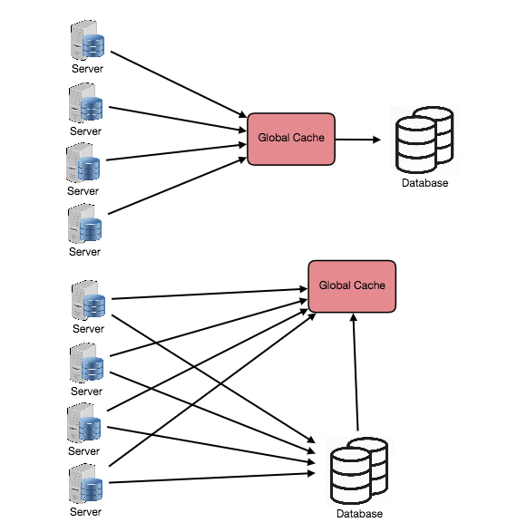
>
>   大部分应用会采用第一种方式，这种方式缓存会自动代理对DB的查询操作，省去了业务的额外调用。但并不是所有场景都适合使用第一种方式，如果缓存中的数据都是大文件，当读缓存miss的时候，缓存会自动从数据库中读取该文件，由于数据较大，读取的耗时会很长，这会导致缓存中pending的查询越来越多。这时如果使用第二种方式，由业务查询DB则会大大降低缓存压力。
>
>   **全局缓存的优点是无状态** ，缓存节点的增删对集群没有太大的影响，缺点是单个节点能承受的数据容量有限，而且节点之间维护数据一致性也很麻烦。
>
> **常见的有两种缓存模式：** 
>
> - Cached Database Queries：缓存原始查库结果
>
>   这种模式的主要缺陷在于难以处理缓存过期，因为数据与`key`（即查询语句）之间并没有明确的关联，*数据发生变化后，很难精确地删掉缓存中的所有相关条目*。试想，一个单元格发生变化，会影响哪些查询语句？
>
>   尽管如此，这仍然是最常用的缓存模式，因为可以做出妥协，比如：
>
>   - 只缓存与查询语句有直接关联的数据，排序、统计、筛选之类的计算结果统统都不存了
>   - 不求精确，把所有可能受影响的缓存条目都删掉
>
> - **Cached Objects** ：缓存应用程序中的数据模型，比如重新组装过的数据集，或者整个数据模型类实例对应用程序而言，数据对象比原始数据更容易管理和维护，因此，*建议缓存数据对象*，而不是原始数据
>
> **Cache Invalidation（缓存失效）：**
>
> - **Cache-aside** 
>
>   预留缓存模式下，缓存与数据库之间没有直接关系（缓存位于一旁，所以叫 Cache-aside），*由应用程序将需要的数据从数据库中读出并填充到缓存中*, 数据请求优先走缓存，未命中缓存时才查库，并把结果缓存起来，所以缓存是按需的（Lazy loading），只有实际访问过的数据才会被缓存起来
>   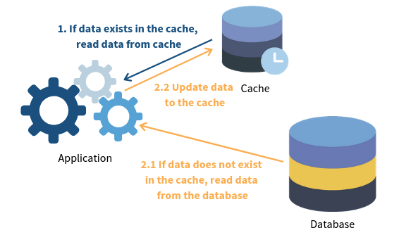
>
>   主要问题在于：
>
>   - 未命中缓存时需要 3 步，延迟不容忽视（对于冷启动可以手动预热）
>   - 缓存可能会变旧（一般通过设置 TTL 来强制更新）
>
> - **Read-through**
>
>   直读模式下，缓存挡在数据库之前，应用程序不与数据库直接交互，而是直接从缓存中读取数据
>
>   未命中缓存时，由缓存负责查库，并自己缓存起来。与预留缓存唯一的区别在于*查库的工作由缓存来完成*，而不是应用程序
>
> - **Write-through**
>
>   类似于直读模式，缓存也挡在数据库之前，数据先写到缓存，再写入数据库。也就是说，*所有写操作必须先经过缓存*
>
>   *一般与**Read-through**缓存相结合*，虽然写操作多过一层缓存（存在额外的延迟），但保证了缓存数据的一致性（避免缓存变旧）。此时，缓存就像数据库的代理，读写都走缓存，缓存再查库或将写操作同步到数据库。但由于每个写入操作在返回成功给客户端之前必须执行两次，这种方案的缺点是写入操作的延迟较高。
>
> - **Write-behind/Write-back** 
>
>   在这种方案下，数据仅被写入缓存，并立即向客户端确认完成。将数据写入永久存储在指定的时间间隔或在特定条件下进行。进而允许批处理以及写操作合并。 这导致对于**写密集型**应用程序的低延迟和高吞吐量，然而，这种速度带来了在发生崩溃或其他不利事件时数据丢失的风险 。
>
>   同样能够与**read - throughout** 缓存结合使用，而且不存在直写式中写操作的性能问题，但仅保证最终一致性
>
> - **Write-around**
>
>   所谓绕写式缓存就是*写操作不经过（绕过）缓存，由应用程序直接写入数据库*，仅缓存读操作。可与预留缓存或直读缓存结合使用. 这可以减少缓存被不会被后续再次读取的写入操作淹没，但缺点是对于最近写入的数据的读取请求将创建“缓存未命中”，必须从较慢的后端存储中读取并经历较高的延迟。
>
> - **Refresh-ahead**
>
>   提前刷新，在缓存过期之前，自动刷新（重新加载）最近访问过的条目。甚至可以通过预加载来减少延迟，但如果预测不准反而会导致性能下降
>
> **缓存eviction policies**
>
> 以下策略可以结合使用，比如LRU + LFU
>
> - LRU（Least Recently Used）：最常用的一种策略，根据程序运行时的局部性原理，在一段时间内，大概率访问相同的数据，所以将最近没有用到的数据剔除出去，比如订机票，一段时间内大概率查询同一路线
> - LFU（Least Frequently Used）：根据使用频率，将最不常用的数据剔除出去，比如输入法大多是根据词频联想的
> - MRU（Most Recently Used）：在有些场景下，需要删掉最近用过的条目，比如已读、不再提醒、不感兴趣等
> - FIFO（First In, First Out）：先进先出，剔除最早访问过的数据
> - LIFO （LAST In, First Out）：后进先出，剔除最新访问过的数据
> - Random Replacement（RR）：在必要时随机选择一个候选项并丢弃它以释放空间。

### 1.3 Sharding/Partitioning

> 数据分区（也称为分片）是一种将大型数据库（DB）分割成许多较小部分的技术。它是将数据库/表拆分到多台机器上以改善应用程序的可管理性、性能、可用性和负载平衡的过程。
>
> **进行数据分片的理由:** 
>
> - 在某个特定的规模点之后，通过添加更多的机器来水平扩展要比通过添加更强大的服务器来垂直增长更便宜和可行. 理论上，Web 应用层也面临同样的问题，却不曾听说过一个 Web 服务庞大到单机无法部署，这是因为*Web 服务在设计之初就会考虑职责划分与解耦*，以便各部分能够独立部署、独立扩展，从 20 年前的 SOA（即面向服务架构，包括[微服务架构（Microservices）](http://www.ayqy.net/blog/微服务架构（microservices）/)等变体）起便是如此
> - 为了提升数据库的处理能力，我们把单库扩展成多库，并通过更新同步机制（即[Replication](http://www.ayqy.net/blog/database-replication/)）来保证多份数据的一致性。如此这般，数据库的扩展难题似乎已经顺利解决了然而，在 Replication 方案下，每个数据库都持有一份完整数据，基于全量数据提供增删改查服务，*单库的性能瓶颈仍然存在*，并将成为限制系统扩展性的关键因素
>
> **优势：** 
>
> - 可扩展性：把单库数据拆分到多库后，系统的可扩展性不再受限于单库性能，数据库层“无限”扩展成为了可能
> - 性能：单库数据量减少，数据操作更快，甚至允许多库并行操作
> - 安全性：可以针对（拆出去的）敏感数据，采取更强的安全控制
> - 灵活性：可以对不同的库（比如按数据重要性）采用不同的监控、备份策略，以缩减成本，提升管理效率。或者对不同类型的数据选用不同的存储服务，比如大型二进制内容放到 blob 存储中，更复杂的数据可以存放在文档数据库中
> - 可用性：把数据分散放到多个篮子里，能够避免单点故障，并且单库故障仅影响一部分数据
>
> **分区种类：** 
>
> - **水平分区（Horizontal partitioning，也叫 Sharding）**： 按行拆分，把不同的行放入不同表中， 也被称为基于范围的分片。
>
>   这种方法的关键问题是，*关键在于如何选取 shard key*（按哪个字段的什么特征来分片），尽可能保证负载被均匀地分散到每一片上。 如果用于分片的值的范围没有被谨慎选择，那么分区方案将导致服务器不平衡。与垂直分区相比，水平分区最大的特点是*schema 保持不变*。
>
>   注意，均匀并不意味着要求每一片的数据量均等，重点是均分流量（有些片可能数据量很大，但访问量却很低）。
>
>   同时还要避免产生“热点”，比如按姓氏首字母对用户信息进行分片实际上是不均匀的，因为有些字母更常见，此时按用户 ID 哈希值来分片可能更均匀些
>
> - **垂直分区（Vertical partitioning）** ：按列拆分，把一些列放到其它表中。
>
>   多用于减少 I/O、降低性能成本，比如，按使用频率把常用字段和不常用的字段分开。
>
>   比起水平分区，垂直分区的关键优势在于*把信息拆的更细，进而允许一些针对性的优化*，比如把不经常变化的数据拆分出来，丢到缓存中，把照片等大型二进制内容拆出去单独存放，或者对部分敏感数据进行针对性的安全控制，另一方面，细粒度的数据划分也能够消除一些并发访问，降低并发访问量。
>
>   这种方法的主要问题是，如果我们的应用程序经历了额外的增长，那么可能需要进一步将特定于功能的数据库分区到各种服务器上（例如，不可能由单个服务器处理1亿4000万用户的10亿张照片的所有元数据查询）。
>
> - 按功能分区（Functional partitioning，有时也叫 Federation）：按业务功能拆分，把业务领域中属于相同界限上下文（Bounded Context）的数据放在一起。 把不相干的数据剔除出去（把紧密相关的数据放到一起），有助于加强数据隔离，提升数据访问性能，比如把客户信息和商品库存信息分开
>
> - **Directory Based Partitioning （基于目录的分区）:** 一种解决**垂直分区** 方案中提到的问题的松散耦合方法是创建一个查找服务，该服务知道您当前的分区方案，并将其从DB访问代码中抽象出来。因此，要找出特定数据实体位于何处，我们查询我们的目录服务器，该服务器保存了每个元组键到其DB服务器的映射。这种松散耦合的方法意味着我们可以执行诸如将服务器添加到DB池中或更改我们的分区方案等任务，而无需影响您的应用程序。
>
> **Partitioning Criteria（分区标准）**
>
> - **Key or Hash-based partitioning:** 
>
>   we apply a hash function to some key attribute of the entity we are storing, that yields the partition number. For example, if we have 100 DB servers and our ID is a numeric value that gets incremented by one, each time a new record is inserted. In this example, the hash function could be ‘ID % 100’, which will give us the server number where we can store/read that record. 这个问题的一个解决方法是使用一致性哈希。
>
> - **List partitioning**： 每个分区被分配了一个值列表，因此每当我们想要插入新记录时，我们将看到哪个分区包含我们的键，然后将其存储在那里。例如，我们可以决定所有居住在冰岛、挪威、瑞典、芬兰或丹麦的用户将存储在北欧国家的一个分区中。
>
> - **Round-robin partitioning**： 轮询策略，可以确保数据分布均匀。对于'n'个分区，'i'元组分配给分区（i mod n）。
>
> - **Composite partitioning:** 我们将任何以上分区方案组合起来设计一个新的方案。例如，先应用**List partitioning**，然后应用**Hash-based partitioning**。一致性哈希可以被视为哈希和列表分区的组合，其中哈希将键空间减小到可以列出的大小。
>
> **分区代价（Problems of Sharding）：** 
>
> - **连表查询慢**： 尽量避免跨分区 join、或者考虑并行查询
> - **Referential integrity （引用完整性）: ** 全表查询慢， 对于需要扫描全量数据的查询操作，即便有并行优化也慢，可以通过垂直分区、按功能分区来定位目标分区，避免全表查询，至于水平分区，可以在应用层维护一张映射表，加快分区定位
> - **不支持事务操作**： 将事务操作交由应用层来处理
> - **Rebalancing**：负载不匀导致分区效果大打折扣：考虑增加监控，并根据分析预测定期调整

### 1.4 Index

> Indexes are well known when it comes to databases; they are used to improve the speed of data retrieval operations on the data store. 
> 索引是一种数据结构，可以被视为指向实际数据所在位置的目录。因此，当我们在表的某一列上创建索引时，我们将该列和指向整行的指针存储在索引中。
>
> In the case of data sets that are many TBs in size but with very small payloads (e.g., 1 KB), indexes are a necessity for optimizing data access.
>
> **设定为主键后数据库会自动建立索引.**
>
> **优点**
>
> - 提高数据检索的效率，降低IO成本
> - 通过创建唯一索引，可以保证数据库表中每一行数据唯一性
> - 对于有依赖关系的子表和父表联合查询时， 可以提高查询速度。
> - 在使用分组和排序子句进行数据查询时，可以显著减少查询中分组和排序的时间
>
> **缺点**
>
> - 创建索引和维护需要消耗时间，并随着数据量累计而增加
> - 索引占据磁盘空间，如果有大量的索引，索引文件就可能比数据文 件更快达到最大文件尺寸
> - 索引提高查询速度，但是会**降低更新表的速度**
>
> 索引实现的算法是**B+tree**
>
> 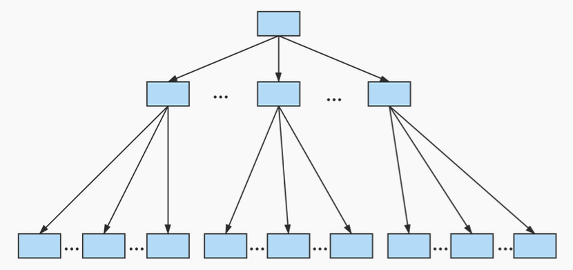
>
> MySQL的索引包括普通索引、唯一性索引、全文索引、单列索引、多列索引和空间索引等。
>
> 索引从 功能逻辑上讲，索引主要有 4 种，分别是普通索引、唯一索引、主键索引、全文索引。 ，
>
> 索引按照作用字段个数 进行划分，分成单列索引和联合索引。
>
> 索引按照物理实现方式，索引可以分为 2 种:聚簇(聚集)和非聚簇(非聚集)索引。我们也把非聚集索引称为二级索引或者辅助索引。
>
> - **聚簇索引（Clustered Index）**
>
>   **特点**
>
>   1. 使用记录主键值的大小进行记录和页的排序，这包括三个方面的含义: 
>
>      - 页内 的记录是按照主键的大小顺序排成一个 单向链表 。
>
>      - 各个存放也是根据页中用户记录的主键大小顺序排成一个 双向链表 。
>
>      - 存放目录项纪录的页 分为不同的层次，在同一层次中的页也是根据页中目录项记录的主键大小顺序排成一个 双向链表 。
>
>   2. B+树的** 叶子节点 存储的是完整的用户记录**。所谓完整的用户记录，就是指这个记录中存储了所有列的值(包括隐藏列)。
>
>   **优点**
>
>   - 数据访问更快 ，因为聚簇索引将索引和数据保存在同一个B+树中，因此从聚簇索引中获取数据比非 聚簇索引更快
>   -  聚簇索引对于主键的 排序查找 和 范围查找 速度非常快 
>   - 按照聚簇索引排列顺序，查询显示一定范围数据的时候，由于数据都是紧密相连，数据库不用从多 个数据块中提取数据，所以 节省了大量的io操作 
>
>   **缺点**
>
>   - 插入速度严重依赖于插入顺序 ，**按照主键的顺序插入是最快的方式，否则将会出现页分裂，严重影 响性能** 。因此，对于InnoDB表，我们一般都会定义一个 **自增的**ID**列为主键**
>   - 更新主键的代价很高 ，因为将会导致被更新的行移动。因此，对于InnoDB表，我们一般定义**主键为 不可更新**
>   - 二级索引访问需要两次索引查找 ，第一次找到主键值，第二次根据主键值找到行数据
>
> - **非聚集索引 （Unclustered Index）**
>
>   独立的索引，只能确定我们要查找记录的主键值，所以如果我们想根 据c2列的值查找到完整的用户记录的话，仍然需要到 聚簇索引 中再查一遍。
>
> 适合创建索引的情况：
>
> - **字段的数值有唯一性的限制**
> - **频繁作为** WHERE **查询条件的字段**， 尤其是在数据量大的情况下，创建普通索引就可以大幅提升数据查询的效率。
> - **经常**GROUPBY**和**ORDERBY**的列**， 如果待排序的列有多 个，那么可以在这些列上建立 组合索引 。
> - **UPDATE、DELETE 的WHERE **条件列**， 如果进行更新的时候，更新的字段是非索引字段，提升的效率会更明显，这是因为非索引字段更 新不需要对索引进行维护。**
> - **经常DISTINCT 字段需要创建索引**
> - **多表** JOIN 连接操作时，创建索引注意事项**
>   - 连接表的数量尽量不要超过 3 张 ，因为每增加一张表就相当于增加了一次嵌套的循环，数量级增长会非常快，严重影响查询的效率。
>   - 其次，对 WHERE 条件创建索引，因为WHERE才是对数据条件的过滤。
>   - **最后， 对用于连接的字段创建索引 ，并且该字段在多张表中的 类型必须一致 。**
> - **区分度高**(**散列性高**)**的列适合作为索引**
> - **使用最频繁的列放到联合索引的左侧**， 由于"最左前缀原则"，可以增加联合索引的使用率。
>
> 不适合创建索引的情况：
>
> - **在**where**中使用不到的字段，不要设置索引**
> - **数据量小的表最好不要使用索引**
> - **有大量重复数据的列上不要建立索引**
> - **避免对经常更新的表创建过多的索引**
> - **不建议用无序的值作为索引**
> - **不要定义冗余或重复的索引**
> -  **删除不再使用或者很少使用的索引**
>
> 索引失效的情况：
>
> - **计算、函数、类型转换**(**自动或手动**)**导致索引失效**
>
> - **类型转换导致索引失效**
>
> - **范围条件右边的列索引失效**
>
>   > 失效：`SELECT SQL_NO_CACHE * FROM student WHERE student.age=30 AND student.classId>20 AND student.name = 'abc' ;`
>   >
>   > 解决办法：范围查询条件放置语句最后
>
> -  **不等于**(!= **或者**<>)**索引失效**
>
> -  **is null**可以使用索引，**is not null**无法使用索引
>
> - like**以通配符**%**开头索引失效**
>
> -  OR **前后存在非索引的列，索引失效**
>
> 

### 1.5 Proxy

> 代理服务可以实现在客户端，或者从客户端到目标服务器中间的任意环节。
>
> 例如，客户端不直接向提供目标资源的 Web 服务发起请求，而是带上目标资源的完整 URL 去请求代理服务：代理服务收到之后，（由代理服务来）请求指定资源并将响应结果转发给客户端。
>
> **优点：** 
>
> - 它接收来自客户端的请求并将其转发到源服务器。通常，代理用于过滤请求、记录请求，有时还会转换请求（添加/删除标头、加密/解密或压缩）。
> - 代理服务器的另一个优点是它的缓存可以为大量请求提供服务。如果多个客户端访问特定资源，代理服务器可以缓存它并为所有客户端提供服务，而无需访问远程服务器
> - 代理在协调多个服务器的请求时也非常有用，并且可以用于从系统范围的角度优化请求流量。例如，我们可以将相同（或类似）的数据访问请求合并为一个请求，然后将单个结果返回给用户；这种方案称为折叠转发（collapsed forwarding）。
> - 代理在高负载情况下特别有用，或者当我们有限的缓存时，因为代理可以将多个请求批处理成一个。
> - 另一种使用代理的好方法是折叠对存储空间靠近的数据的请求（在磁盘上连续）。这种策略将导致请求延迟的降低。例如，假设一堆服务器请求文件的部分：part1、part2、part3等。我们可以设置我们的代理，使其能够识别单个请求的空间局部性，从而将它们折叠成一个请求并读取完整的文件，这将极大地减少从数据源读取的次数。这种方案在对TB级别的数据进行随机访问时请求时间上会有很大的不同。
>
> **Proxy种类** 
>
> - **Forward Proxy**
>   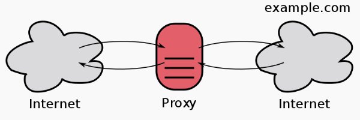
>   *正向代理是对外的，面向外部资源*，用来从网络上获取各种数据。 代客户端发出资源请求，并将响应结果返回给对应的客户端。所以，*正向代理更靠近客户端，与客户端的关系更密切*（跟服务器关系一般，不熟）
>
> - **Reverse Proxy**
>   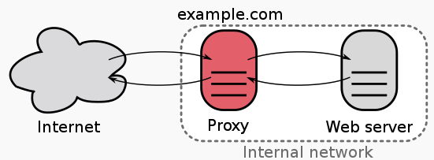
>   反向代理负责把流量根据配置规则重定向到内部服务器，外部请求并不知道内网的存在。*反向代理是对内的，面向内部资源*，用作对私有网络上的服务器进行访问控制和保护的前端。
>
>   区别在于，*正向代理是其关联的客户端与所有服务器联系的中介，而反向代理则是其关联的服务器与所有客户端联系的中介*，也就是说，*正向代理代表客户端，而反向代理代表服务器*。
>
>   作用：
>
>   - 加密/SSL 加速：对于 HTTP 服务，可以通过一层反向代理来实现 SSL 加密， 将 SSL 加密的工作交由配备了 SSL 硬件加速器的反向代理来完成
>   - 负载均衡：将流量负载分发给多个 Web 服务器
>   - 托管/缓存静态内容：将静态内容（比如图片）交由反向代理提供，分担源站负载
>   - 压缩：代理服务器能够对资源内容进行压缩优化，提升加载速度
>   - 安全防护：能够屏蔽源服务器的存在及其特征，结合防火墙抵御常见 Web 攻击
>   - 访问控制：对内容进行监控/过滤，常用于工作场所、学校等

### 1.6 Asynchronous mechanism - Message Queue

> 对于多个任务，一般有 3 种执行策略：
>
> - 串行：一个接一个地同步执行，总耗时为所有任务之和
>
> - 并发(concurrency)：指一个处理器同时处理多个任务， 多 CPU/多核并发执行，总耗时取决于最慢的任务耗时。 并发是逻辑上的同时发生（simultaneous），而并行是物理上的同时发生。指在同一时刻只能有一条指令执行，但多个进程指令被快速的轮换执行，使得在宏观上具有多个进程同时执行的效果，但在微观上并不是同时执行的，只是把时间分成若干段，使多个进程快速交替的执行。
>
> - 并行(parallel)：并行是指多个处理器或者是多核的处理器同时处理多个不同的任务。异步并行执行，总耗时同样取决于最慢的任务耗时。
>
>   当系统有一个以上CPU时,则线程的操作有可能非并发.当一个CPU执行一个线程时,另一个CPU可以执行另一个线程,两个线程互不抢占CPU资源,可以同时进行,这种方式我们称之为并行(Parallel)。
>
> 试想，如果工作量持续增长，串行模式的延迟将会越来越大，而且无法通过加资源来解决，可扩展性无从谈起
>
> 并发模式虽然可以通过加 CPU 来应对更多的工作量（即纵向扩展），但很快就会遭遇瓶颈，要么达到顶配，要么耗光预算，可扩展性也不是很好。
>
> 并行模式下，由于任务能够异步执行，我们可以加任意多 Worker 来分担工作量，可扩展性良好。并且，与并发模式相比，异步处理是**非阻塞**的（无需等待执行结果，单 CPU/单核就足够了），意味着在（Worker）执行任务同时，系统仍然能够轻松响应用户请求。
>
> **除了可扩展性方面的优势外，*异步更多的意义*在于：**
>
> - 可打断/可暂停：允许分片执行，而不必一次做完
> - 可调度：允许更细粒度的时间管理，比如闲时主动执行、甚至离线执行
> - 并行的可能性：异步返回结果，意味着可以交给别人、甚至交给一支军队来做
> - 解耦生产者和消费者：把 Worker 分离出去，使之能够独立扩展，比如只加 Woker 不加 Web Server，类似于[分离 Web 层和应用层](http://www.ayqy.net/blog/service-discovery/#articleHeader1)
>
> 实现上，最常见的异步机制当然是**[消息队列](https://en.wikipedia.org/wiki/Message_queue)** 
>
> 队列被用于有效地管理大规模分布式系统中的请求。在处理负载较小、数据库规模较小的小型系统中，写入操作可能是可以可预测地快速完成的；然而，在更复杂和大规模的系统中，写入操作可能需要花费几乎不确定的长时间。例如，数据可能需要写入不同服务器上的不同位置或索引，或者系统可能简单地处于高负载状态。在这种情况下，个别写入（或任务）可能需要很长时间，实现高性能和可用性需要系统的不同组件以异步方式工作；一个常见的方法就是使用队列。
>
> 消息队列的运作中有 3 个角色，*消息的生产者、消费者以及经纪人（Broker）*：
>
> - 生产者：应用程序往队列里发布任务后，立即告知用户该任务的状态
> - 消费者：Worker 拿到任务并执行，完成之后通知
> - Broker：从队列里取出任务并分发给 Worker，并负责管理任务的完整性，包括失败重试、（根据 Worker 的实际状态）动态调整分发策略等
>
> 当然，实际的消息队列/任务队列的实现更复杂一些，需要考虑各种问题：
>
> - 消息可能会丢失：比如消费者挂了，甚至消息队列挂了
> - 消息可能会重发多次：比如消费者做完忘记发送完成回执（ack）了
> - 可能出现忙闲不均的情况：比如轮流分发的话，有些 Worker 接到的总是重活儿
> - 队列可能会溢出：比如 Worker 太少或太忙，导致消息迅速堆积

### 1.7 Replication 

> > 理论上，有了可靠的负载均衡机制，我们就能将 1 台服务器轻松扩展到 n 台，然而，如果这 n 台机器仍然使用同一数据库的话，很快数据库就会成为系统的性能瓶颈和可靠性瓶颈
>
> 那么，如何提升数据库的处理能力？
>
> 从资源的角度来看，无非两种思路：
>
> - 纵向扩展：提升单机配置（硬盘、内存、CPU 等等），但同样会遭遇单机性能瓶颈
> - 横向扩展：增加机器，数量上从单数据库实例扩展到多实例
>
> 这样看来，似乎只要加几个数据库，共同分担来自应用层的流量就完成了从单库到多库的扩展。
>
> **问题**
>
> - 一致性问题
>
>   数据库与应用服务最大的区别在于，应用服务可以是无状态的（或者可以将共享状态抽离出去，比如放到数据库），而*数据库操作一定是有状态的*，在扩展数据库时必须要考虑数据的一致性
>
>   具体的，一致性分为 3 种，严格程度依次递减：
>
>   - 强一致性（Strong consistency）：写完之后，立即就能读到
>   - 最终一致性（Eventual consistency）：写完之后，保证最终能读到
>   - 弱一致性（Weak consistency）：写完之后，不一定能读到
>
> **Replication**
> 通过复制（写操作）来保证多份数据拷贝的信息一致性。向数据库实例 A 写入数据时，也要把相同的数据写入到实例 B、C、D 等
>
> - **异步复制（Asynchronous replication）**
>
>   可以在写完之后，再告知其它实例更新数据，这种模式，客户端无需等待复制操作完成，不存在额外的性能影响。但问题在于：
>
>   - 有数据丢失风险
>   - 无法保证强一致性，因为存在复制延迟（Replication lag）,*（仅能保证最终一致性）*
>
> - **同步复制（Synchronous replication）**
>
>   生写操作时，立即将操作同步到其它所有实例，复制完成之后才算写完，以确保严格的一致性但*同步复制会影响性能和可用性*:
>
>   - 性能影响：需要等待整个复制过程完成
>   - 可用性影响：只要有一个实例出现故障（网络等原因），整个写操作就会失败
>
>   并且数据库实例数量越多，这两方面的影响越大
>
> - **半同步复制（Semi-synchronous replication）**
>   即要求一部分数据库实例同步复制，其余的异步复制, P.S.[PostgreSQL](https://www.postgresql.org/)支持这种模式
>
> **数据库集群结构种类：**
>
> - 单主结构（Single leader replication）：读写分离
>   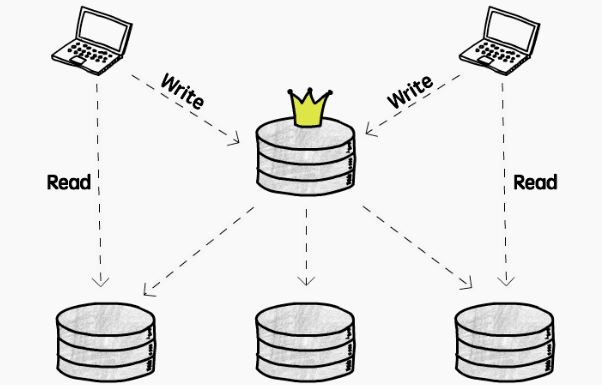
>
>   这种结构下，写操作（增/删/改）只允许发生在主库，由主库将写操作复制到其它所有从库，从库只支持读操作（查）
>
>   由于所有客户端都写同一个库，成功避免了写操作冲突的大麻烦。但要注意的是：
>
>   - 承载写操作压力的仍然是单库：*不适用于写密集（write-intensive）的应用*，但好在大多数应用都是读密集的
>   - 访问主库的延迟问题：主库只有一个，只能放在某个确定的地理位置，意味着在某些区域发起写操作可能要承担较高的延迟
>
>   更糟糕的情况，如果主库 down 掉了，需要立即在从库中选出一个接班人，担起主库的职责，保证这套机制正常运转。另外，如果采用的是异步复制，旧主库恢复之后，尚未复制到其它从库的数据与掉线期间新任主库写入的数据可能会出现冲突，此时通常采用 LWW（last-write-win）策略，直接丢弃旧数据，但同样存在风险：特殊的，*一种有意思的情况是旧主库恢复过来以为自己还是主库*，出现分裂（[Split-brain](https://en.wikipedia.org/wiki/Split-brain_(computing))）， 一旦发现存在多个主库，直接停掉一个
>
> - 多主结构（Multi leader replication）
>
>   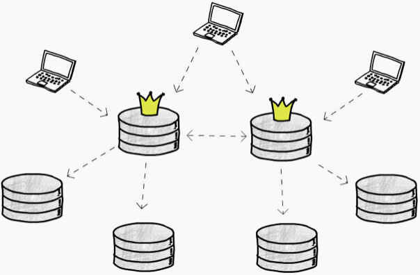
>   由于写操作能够同时发生在（异步复制的）多个库，我们必须考虑*如何解决写入冲突*。一般有 3 种思路：
>
>   - 避免冲突：比如按内容特征分库存储，互不相干，比如对于国内国外两个主库，如果能够保证所有对国内数据的写操作都能落到国内主库上，所有对国外数据的写操作都能落在国外主库上，就不存在冲突了
>   - LWW（last-write-win）策略：给每个写操作带上时间戳，只保留最新版本
>   - 交由用户来解决：记下冲突，应用程序提示给用户，由用户决定保留哪一份
>
>   P.S.有些数据库（如[CouchDB](http://couchdb.apache.org/)）支持将所有冲突值都写下来，并在读取时返回一系列值
>
>   此外，多主结构下的另一个难题是复制 DDL（Data Definition Language），即针对 Schema 的写操作，具体见[DDL replication](https://www.brianstorti.com/replication/#ddl-replication)
>
> - 无主结构（Leaderless replication）
>   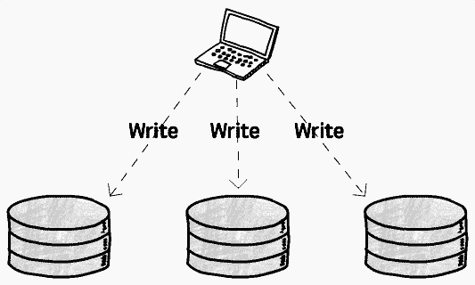
>
> - 当然，还有一种不区分主库的结构，所有库都可读可写
>
>   看起来像是“全主结构”，那么可预见的，写冲突将变得非常普遍，所以我们需要调整策略，避免使之成为“全主结构”：
>
>   - 写：客户端同时向多个数据库写，只要有一些成功了就算写完
>   - 读：客户端同时从多个数据库读，各个库返回数据及其对应的版本号，客户端根据版本号来决定采用哪个
>
>   *没有主库也意味着没有了数据同步机制，读到的旧值无法自动更正*， 所以需要额外的纠错机制，客户端在读到旧值时将新值写回去（称为[Read repair](https://en.wikipedia.org/wiki/Eventual_consistency)），或者由独立的进程专门负责找出旧值并纠正回来
>
>   另一个关键因素是读/写操作的目标库数量，至少几个库写入成功后，至少从几个库成功读取才能保证一定能读到新值？
>
>   如果`w`个库写入成功，接着成功读到了`r`个库的数据，那么必须满足`w + r > 库的总数`
>
> **Replication具体实现**
>
> - **基于语句的复制**：将写操作语句原样发一份给其它库执行
>   按语句复制的问题在于，*并不是所有语句的执行结果都是确定的*，例如`CURRENT_TIME()`、`RANDOM()`，虽然一些数据库会在复制时对这些值进行替换，但仍无法保证触发器，以及用户定义的函数有确定的执行结果。另一方面，还要确保事务操作在所有数据库上的原子性，要么全都完成了，要么全都一点儿没做
> - **日志传送式复制**：也叫物理复制，将数据库日志传递给其它库，从日志恢复出完全一致的数据。例如 PostgreSQL 提供的[Streaming Replication](https://www.postgresql.org/docs/current/warm-standby.html#STREAMING-REPLICATION)
>   日志传送式复制能够保证数据完全一致，但（面向存储引擎的）日志通常无法跨数据库版本使用，因为在不同版本的数据库下，数据的物理存储方式可能会发生变化。并且，*日志传送不适用于多主结构*，因为无法把多份日志合并成一份
> - **基于行的复制**：也叫逻辑复制，传递专门用于复制的日志，按行复制。例如[MySQL](https://dev.mysql.com/)提供的的[Mixed Binary Logging Format](https://dev.mysql.com/doc/refman/8.0/en/binary-log-mixed.html)
>   而基于行的复制是前两种方式的结合，采用一种专门用于复制的日志，不再与存储引擎耦合，因而能够跨数据库版本使用。与按语句复制相比，*按行复制需要记录更多的信息*（比如一个语句影响了 100 行，需要按行都记下）

### 1.7 SQL  and NoSQL

> Most of the NoSQL solutions sacrifice ACID compliance for performance and scalability.
>
> **SQL ** 
>
> 1. Advantages（优点）
>
>    > * table is easy to understand.
>    >
>    > * 数据一致性（Data consistence），支持ACID
>    >
>    > * 复杂查询，适用**读多写少** 
>    >
>    >   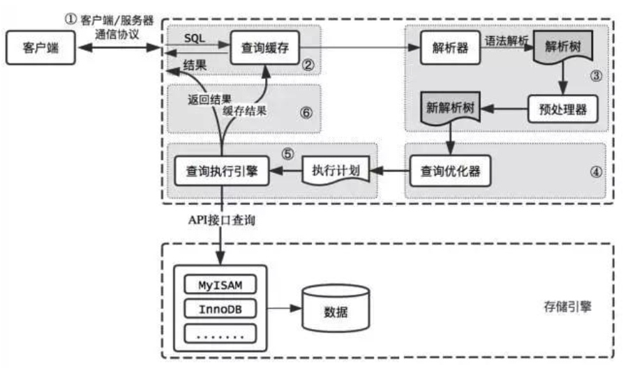
>
> 2. Disadvantages（缺点）
>
>    > - **高并发下IO压力大**, 数据按行存储，即使只针对其中某一列进行运算，也会将整行数据从存储设备中读入内存，导致IO高
>    > - **为维护索引付出的代价大**, 为了提供丰富的查询能力，通常热点表都会有多个二级索引，一旦有了二级索引，数据的新增必然伴随着所有二级索引的新增，数据的更新也必然伴随着所有二级索引的更新，
>    > - **维护数据一致性付出的代价大**, 对于并发控制，其核心思想就是加锁，无论是乐观锁还是悲观锁，只要提供的隔离级别越高，那么读写性能必然越差
>    > - **水平扩张（scalability）差，表结构扩张不方便**
>    > - **全文搜索功能弱** 例如like "%中国真伟大%"，只能搜索到"2019年中国真伟大，爱祖国"，无法搜索到"中国真是太伟大了"这样的文本。
>
> **NoSQL** 
>
> 1. Advantages（优点）
>    - **读写性能**：适用**写多读少， 写多读多**。 无需经过 SQL 层的解析，读写性能很高。主要例子有Redis，由于其逻辑简单，而且纯内存操作，使得其性能非常出色，单节点每秒可以处理超过10万次读写操作；
>    - **简单的扩展**：基于键值对，数据没有耦合性，容易扩展。典型例子是 Cassandra，由于其架构是类似于经典的 P2P，所以能通过轻松地添加新的节点来扩展这个集群；
>    - **存储格式多**：支持key-value形式、文档形式、图片形式，而关系型数据库则只支持基础类型；
>    - **低廉的成本**：这是大多数分布式数据库共有的特点，因为主要都是开源软件，没有昂贵的License成本
> 2. Disadvantages（缺点）
>    - **支持的特性不够丰富**：现有产品所提供的功能都比较有限，大多数 NoSQL 数据库都不支持事务，也不像 MS SQL Server 和 Oracle 那样能提供各种附加功能，比如 BI 和报表等
>
> 3. NoSQL 数据库适用于：
>
> - 快速变化数据，如点击流（click stream）数据或日志数据
> - 写远高于读
> - 写入量巨大
> - 排行榜或评分数据
> - 临时数据，如购物车数据
> - 频繁访问的热点数据
> - 元数据（metadata），以及查找表（lookup tables）
>
> **ACID vs. BASE** 
>
> 不同于关系型数据库中追求的[ACID](https://en.wikipedia.org/wiki/ACID)（事务的 4 大特性）：
>
> - Atomicity（原子性）：一系列操作要么全部成功要么失败全部回滚
>
> - Consistency（一致性）：事务执行前后数据库都必须处于一致性状态（满足既定的所有一致性约束）
>
> - Isolation（隔离性）：并发事务操作的结果状态与按顺序执行一样
>
>   **数据并发问题：**， 按照严重性， 脏写 > 脏读 > 不可重复读 > 幻读， 
>
>   1. **脏写(**Dirty Write**)** ，如果事务Session A 修改了 另一个 未提交 事务Session B 修改过 的数 据，那就意味着发生 脏写， **是绝对不允许的**
>
>   2. **脏读( Dirty read）**，Session A 读取 了已经被 Session B 更新 但未被提交 的字段。之后若  B 回滚 ，A 读取 的内容就是 临时且无效 的。
>   3. **不可重复读(**Non-Repeatable Read**)**，事务Session A 读取 了一个字段，然后 Session B 更新 了该字段。 之后A 再次读取 同一个字段， 值就不同 了。那就意味着发生了不可重复读。
>   4. **幻读(** Phantom **)**， 事务A 从一个表中 读取 了一个字段, 然后 B 在该表中 插入 了一些新的行。 之后Session A 再次读取 同一个表, 就会多出几行。
>
>   **隔离级别：** 按照对数据库并发性能影响，SERIALIZABLE > REPEATABLE READ > READ COMMITTED > READ UNCOMMITTED
>
>   1. READ UNCOMMITTED :读未提交，在该隔离级别，所有事务都可以看到其他未提交事务的执行结 果。不能避免脏读、不可重复读、幻读。
>
>   2. READ COMMITTED :读已提交，它满足了隔离的简单定义:一个事务只能看见已经提交事务所做 的改变。这是大多数数据库系统的默认隔离级别(但不是MySQL默认的)。可以避免脏读，但不可 重复读、幻读问题仍然存在。
>
>   3. REPEATABLE READ :可重复读，事务A在读到一条数据之后，此时事务B对该数据进行了修改并提 交，那么事务A再读该数据，读到的还是原来的内容。可以避免脏读、不可重复读，但幻读问题仍 然存在。这是MySQL的默认隔离级别。
>
>   4. SERIALIZABLE :可串行化，确保事务可以从一个表中读取相同的行。在这个事务持续期间，禁止 其他事务对该表执行插入、更新和删除操作。所有的并发问题都可以避免，但性能十分低下。能避 免脏读、不可重复读和幻读。
>
>      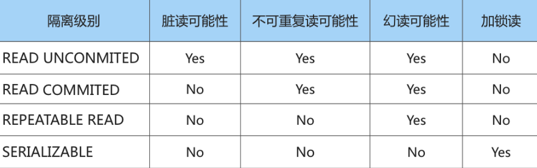
>
>   **并发问题的解决方案**
>
>   - 解决方案1: 读操作利用多版本并发控制( MVCC )，写操作进行 加锁 。普通的SELECT语句在READ COMMITTED和REPEATABLE READ隔离级别下会使用到MVCC， 即读取记录。每次执行SELECT操作时都会生成一 个ReadView，ReadView的存在本身就保证了 事务不可以读取到未提交的事务所做的更改 ，也就 是避免了脏读现象;
>   - 解决方案2: 读、写操作都采用 加锁 的方式。
>   - 小结对比
>     - 采用 MVCC 方式的话， 读-写 操作彼此并不冲突，性能更高 。
>     - 采用 加锁 方式的话， 读-写 操作彼此需要 ，影响性能。一般采用MVCC， 但是业务在某些特殊情况 下，要求必须采用 加锁 的方式执行。
>
> - Durability（持久性）：事务一旦提交，对数据的改变就是永久性的，遭遇故障也不会丢失已提交的结果
>
> NoSQL 在[CAP 的抉择](http://www.ayqy.net/blog/trade-offs-in-system-design/#articleHeader4)中对 C 做了妥协，允许*最终一致性*，即[BASE](https://en.wikipedia.org/wiki/Eventual_consistency)：
>
> - Basically Available（基本可用）：读写操作尽可能保证可用，但不保证任何一致性
> - Soft state（软状态）：由于没有一致性保证，在一段时间后，只是有可能读到最新状态，因为可能还没收敛
> - Eventual consistency（最终一致性）：如果系统运行正常，等待足够长的时间后，最终能够读到最新状态
>
> 也就是说，在分布式环境下，（大多数）NoSQL 数据库仅保证最终一致性，可能无法立即读到最新的数据
>
> 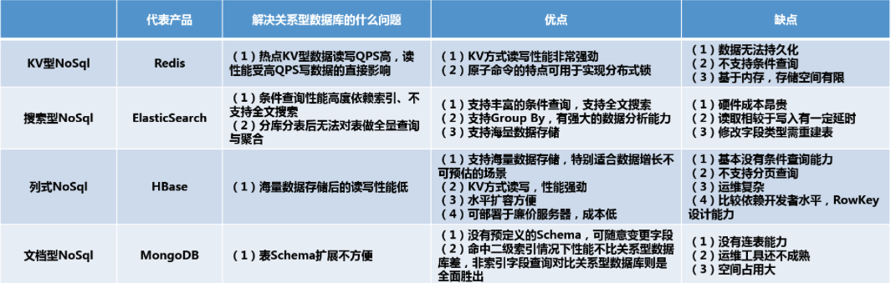
>
> 
>
> **常见NoSQL**
>
> 1. **KV型NoSql（代表----Redis）**
>
> > KV型NoSql顾名思义就是以键值对形式存储的非关系型数据库。Redis、MemCache是其中的代表，Redis又是KV型NoSql中应用最广泛的NoSql，KV型数据库以Redis为例，最大的优点我总结下来就两点：
> >
> > - 数据基于内存，读写效率高
> > - KV型数据，时间复杂度为O(1)，查询速度快
> >
> > 因此，KV型NoSql最大的优点就是**高性能**，利用Redis自带的BenchMark做基准测试，TPS可达到10万的级别，性能非常强劲。同样的Redis也有所有KV型NoSql都有的比较明显的缺点：
> >
> > - 只能根据K查V，无法根据V查K
> > - 查询方式单一，只有KV的方式，不支持条件查询，多条件查询唯一的做法就是数据冗余，但这会极大的浪费存储空间
> > - 内存是有限的，无法支持海量数据存储
> > - 同样的，由于KV型NoSql的存储是基于内存的，会有丢失数据的风险
> >
> > 综上所述，KV型NoSql最合适的场景就是**缓存**的场景：
> >
> > - 读远多于写
> > - 读取能力强
> > - 没有持久化的需求，可以容忍数据丢失，反正丢了再查询一把写入就是了
> >
> > 例如根据用户id查询用户信息，每次根据用户id去缓存中查询一把，查到数据直接返回，查不到去关系型数据库里面根据id查询一把数据写到缓存中去。
>
> 2. **搜索型NoSql（代表----ElasticSearch）**
>
> > 传统关系型数据库主要通过索引来达到快速查询的目的，但是在全文搜索的场景下，索引是无能为力的，**搜索型NoSql的诞生正是为了解决关系型数据库全文搜索能力较弱的问题**，ElasticSearch是搜索型NoSql的代表产品。全文搜索的原理是**倒排索引**。
> >
> > 搜索型数据库还有一种特别重要的应用场景。我们可以想，一旦对数据库做了分库分表后，原来可以在单表中做的聚合操作、统计操作是否统统失效？例如我把订单表分16个库，1024张表，那么订单数据就散落在1024张表中，我想要统计昨天浙江省单笔成交金额最高的订单是哪笔如何做？我想要把昨天的所有订单按照时间排序分页展示如何做？**这就是搜索型NoSql的另一大作用了，我们可以把分表之后的数据统一打在搜索型NoSql中，利用搜索型NoSql的搜索与聚合能力完成对全量数据的查询**
> >
> > 优点为：
> >
> > - 支持分词场景、全文搜索，这是区别于关系型数据库最大特点
> > - 支持条件查询，支持聚合操作，类似关系型数据库的Group By，但是功能更加强大，适合做数据分析
> > - 数据写文件无丢失风险，在集群环境下可以方便横向扩展，可承载PB级别的数据
> > - 高可用，自动发现新的或者失败的节点，重组和重新平衡数据，确保数据是安全和可访问的
> >
> > 缺点：
> >
> > - 性能全靠内存来顶，也是使用的时候最需要注意的点，非常吃硬件资源、吃内存，大数据量下64G + SSD基本是标配，算得上是数据库中的爱马仕了。ElasticSearch内存用在什么地方，大概有如下这些：
> >   - Indexing Buffer----ElasticSearch基于Luence，Lucene的倒排索引是先在内存里生成，然后定期以Segment File的方式刷磁盘的，每个Segment File实际就是一个完整的倒排索引
> >   - Segment Memory----倒排索引前面说过是基于关键字的，Lucene在4.0后会将所有关键字以FST这种数据结构的方式将所有关键字在启动的时候全量加载到内存，加快查询速度，官方建议至少留系统一半内存给Lucene
> >   - 各类缓存----Filter Cache、Field Cache、Indexing Cache等，用于提升查询分析性能，例如Filter Cache用于缓存使用过的Filter的结果集
> >   - Cluter State Buffer----ElasticSearch被设计为每个Node都可以响应用户请求，因此每个Node的内存中都包含有一份集群状态的拷贝，一个规模很大的集群这个状态信息可能会非常大
> > - 读写之间有延迟，写入的数据差不多1s样子会被读取到，这也正常，写入的时候自动加入这么多索引肯定影响性能
> > - 数据结构灵活性不高，ElasticSearch这个东西，字段一旦建立就没法修改类型了，只能把整个表删了再重建
>
> 3. **列式NoSql（代表----HBase，Cassandra）又称为 宽列存储（Wide column store）**
>
> > 列式NoSql是基于列式存储的，那么什么是列式存储呢，列式NoSql和关系型数据库一样都有主键的概念，区别在于关系型数据库是按照行组织的数据：
> >
> > 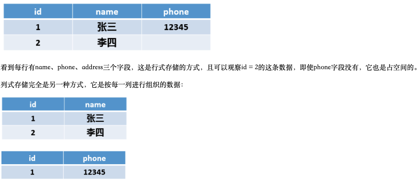
> >
> > 优点：
> >
> > > - 查询时只有指定的列会被读取，不会读取所有列
> > >
> > > - 存储上节约空间，Null值不会被存储，一列中有时候会有很多重复数据（尤其是枚举数据，性别、状态等），这类数据可压缩，行式数据库压缩率通常在3:1到5:1之间， 列试一般在8:1 到 30:1左右
> > >
> > >   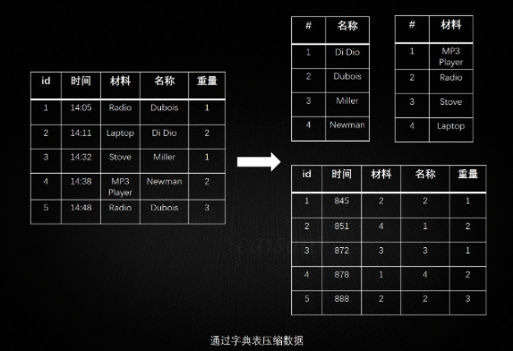
> > >
> > > - 列数据被组织到一起，一次磁盘IO可以将一列数据一次性读取到内存中
> > >
> > > - 海量数据无限存储，PB级别数据随便存，底层基于HDFS（Hadoop文件系统），数据持久化
> > >
> > > - 读写性能好，只要没有滥用造成数据热点，读写基本随便玩
> > >
> > > - 横向扩展在关系型数据库及非关系型数据库中都是最方便的之一，只需要添加新机器就可以实现数据容量的线性增长，且可用在廉价服务器上，节省成本
> > >
> > > - 本身没有单点故障，可用性高
> > >
> > > - 可存储结构化或者半结构化的数据
> > >
> > > - 列数理论上无限，HBase本身只对列族数量有要求，建议1~3个
> >
> > 缺点：
> >
> > > - HBase是Hadoop生态的一部分，因此它本身是一款比较重的产品，依赖很多Hadoop组件，运维还是有点复杂的
> > > - KV式，不支持条件查询，或者说条件查询非常非常弱吧，HBase在Scan扫描一批数据的情况下还是提供了前缀匹配这种API的，条件查询除非定义多个RowKey做数据冗余
> > > - 不支持分页查询，因为统计不了数据总数
>
> 4. **文档型NoSql（代表----MongoDB）**
>
> > 对于MongDB，我们只要理解成一个Free-Schema的关系型数据库就完事了，它的优缺点比较一目了然，优点：
> >
> > - 没有预定义的字段，扩展字段容易
> > - 相较于关系型数据库，读写性能优越，命中二级索引的查询不会比关系型数据库慢，对于非索引字段的查询则是全面胜出
> >
> > 缺点在于：
> >
> > - 不支持事务操作，虽然Mongodb4.0之后宣称支持事务，但是效果待观测
> > - 多表之间的关联查询不支持（虽然有嵌入文档的方式），join查询还是需要多次操作
> > - 空间占用较大，这个是MongDB的设计问题，空间预分配机制 + 删除数据后空间不释放，只有用db.repairDatabase()去修复才能释放
> > - 目前没发现MongoDB有关系型数据库例如MySql的Navicat这种成熟的运维工具
>
> 5. **图库Graph Database（代表----Neo4J）**
>
> > These databases are used to store data whose relations are best represented in a graph.
> >
> > Data is saved in graph structures with nodes (entities), properties (information about the entities) and lines
> >
> > (connections between the entities). Examples of graph database include Neo4J and InfiniteGraph.
> >
> > 数据库用于存储最适合用图表示的数据。数据以图结构保存，包括节点（实体）、属性（有关实体的信息）和边（实体之间的连接）
>
> 

### 1.8 CAP

> 在**分布式计算机系统**中，一致性、可用性和分区容错性*三者只能择其二（而且分区容错性必选）*：
>
> - 一致性（Consistency）：每次读取都能得到最新写入的结果，抑或出错
> - 可用性（Availability）：每个请求都能收到正常响应，但不保证返回的是最新信息
> - 分区容错性（Partition Tolerance）：即便有一部分由于网络故障down掉了，系统仍能继续运行
>
> 因为网络不完全可靠，所以必须保证分区容错性（P必选）。当部分节点出现网络故障时，有2个选择：
>
> - 取消操作：能确保一致性，但会降低可用性（用户可能收到超时错误），即CP（Consistency and Partition Tolerance），适用于需要原子读写的场景
> - 继续操作：保证可用性，但存在一致性风险（返回的信息可能是旧的），即AP（Availability and Partition Tolerance），适用于可接受最终一致性（Eventual consistency）的场景
>
> 也就是说，在P必须满足的前提下（*网络故障是系统之外的不可控因素，没得选*），只能在C和A之间进行取舍，要么保证一致性（牺牲可用性），要么保证可用性（牺牲一致性）.
>
> 当然，在中心化系统（例如RDBMS）中，不存在网络可靠性的问题，此时C和A能够两全

### 1.9 Consistent Hashing

> 分布式哈希表 distributed hash table（DHT）是分布式可扩展系统中使用的基本组件之一。哈希表需要键、值和哈希函数，其中哈希函数将键映射到存储值的位置 。**index = hash_function(key)**
>
> > It allows distributing data across a cluster in such a way that will minimize reorganization when nodes are added or removed.
>
> **普通一致性Hash 算法**
>
> - 将 key 模一个很大的数，比如 360
>
> - 将 360 分配给 n 台机器，每个机器负责一段区间 
>
> - 区间分配信息记录为一张表存在 Web Server 上
>
> - 新加一台机器的时候，在表中选择一个位置插入，匀走相邻两台机器的一部分数据
>
>   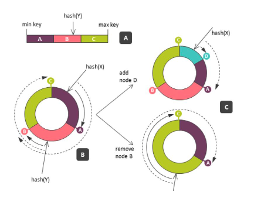
>
> - **缺陷** 
>
>   - 数据分布不均匀，因为算法是“将数据最多的相邻两台机器均匀分为三台”，比如，3台机器变4台机器时，无法做到4台机器均匀分布
>   - 迁移压力大，新机器的数据只从两台老机器上获取导致这两台老机器负载过大
>
> **考虑Load balance 的一致性哈希算法**
>
> - 将整个 Hash 区间看做环， 这个环的大小从 0~359 变为 0~2^64-1， 将机器和数据都看做环上的点
> - 引入 Micro shards / Virtual nodes 的概念， 一台实体机器对应 1000 个 Micro shards / Virtual nodes， 每个 virtual node 对应 Hash 环上的一个点
> - 每新加入一台机器，就在环上随机撒 1000 个点作为 virtual nodes
> -  需要计算某个 key 所在服务器时
>   - 计算该key的hash值——得到0~2^64-1的一个数，对应环上一个点
>   - 顺时针找到第一个virtual node, 该virtual node 所在机器就是该key所在的数据库服务器
> - 新加入一台机器做数据迁移时, 1000 个 virtual nodes 各自向顺时针的一个 virtual node 要数据 

### 1.10 SQL Database Denormalization

> 为了解决数据库层的扩展问题，我们已经讨论了两种方案：
>
> - [Replication](http://www.ayqy.net/blog/database-replication/)：从单库扩展到多库，以承载更多的请求量
> - [Partitioning](http://www.ayqy.net/blog/database-partitioning/)：把单库（表）拆分成多库（表），打破单库的性能瓶颈
>
> 在（多机）多库多表的加持下，激增的请求量、数据量已经不再是难题，然而，除却数据量外，还有一个极其影响单库性能的因素——**数据的组织方式**。关系型数据库，经常需要多表联查才能得到目标信息，关系越复杂，读取性能越差，并最终像数据量一样成为单库性能瓶颈，制约着数据库层的可扩展性。那么，对于关系型数据库，有办法进一步提升数据读取性能吗？
>
> 有，（在一定程度上）改变数据的组织方式，即**反范式化（Denormalization）**
>
> **数据库设计范式化（Database normalization）** 
>
> > 就是按照一系列范式（Normal forms）要求来组织数据模型的过程，目的是减少数据冗余，提高[数据完整性](https://en.wikipedia.org/wiki/Data_integrity#Types_of_integrity_constraints)
>
> 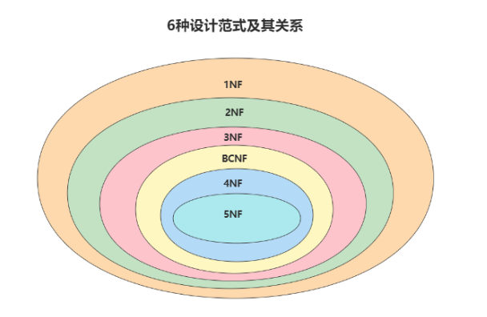
>
> - 1NF：[第一范式（First normal form）](https://en.wikipedia.org/wiki/First_normal_form)，表的每个属性必须具有原子(单个)值， 要求表中每个字段的值都不可再分， 例如：地址可以拆分成更具体的
>
> - 2NF：[第二范式（Second normal form）](https://en.wikipedia.org/wiki/Second_normal_form)在满足 1NF 的基础上，要求所有非主属性都完全依赖于其主键。一张表就是一个独立的对象，一张表只 表达一个意思。对于非主属性来说，并非完全依赖候选键。会产生以下问题：
>
>   - 数据冗余
>
>   - 插入， 删除， 更新异常(相同的信息在多行中重复出现，不相干的信息也凑在同一张表中)
>
>     
>
> - 3NF：[第三范式（Third normal form）](https://en.wikipedia.org/wiki/Third_normal_form)在满足 2NF 的基础上，要求所有非主属性都不传递依赖于任何主键。每个非键属性依赖于键，依赖于 整个键，并且除了键别无他物
>
> **反范式化（Denormalization）常见做法**
>
> > 范式化会导致查询时需要Join操作，当冗余信息有价值或者能 大幅度􏰁高查询效率 的时候，我们才会采取反范式的优化。**P.S.注意**， *反范式化不等于非范式化*（[Unnormalized form](https://en.wikipedia.org/wiki/Unnormalized_form)），反范式化一定发生在满足范式设计的基础之上。前者相当于先遵守所有规则，再进行局部调整，故意打破一些规则，而后者全然不顾规则
> >
> > 通过增加冗余数据或对数据进行分组，*牺牲一部分写入性能，换取更高的读取性能*：
>
> - 存一些派生数据：例如在一对多关系中，把“多”的数量作为“一”的属性存储起来
> - 预先连接（pre-joined）生成汇总表：把需要频繁`join`的表提前`join`好
> - 采用硬编码值：把依赖表中的常量值（或者不经常变化的值）直接硬编码到当前表中，从而避免`join`操作
> - 把详情信息纳入主表中：对于数据量不大的详情表，可以把全部/部分详情信息塞到主表中，以避免`join`操作
>
> **反范式化的缺点**
>
> - 失去了数据完整性保障：打破范式，意味着之前通过范式化解决的更新、插入、删除异常问题又将重新冒出来，也就是说，*冗余数据的一致性要靠 DBA 自己来保证*，而不像索引视图等由 DBMS 来保证
> - 牺牲了写入速度：由于反范式化引入了冗余数据，更新时要修改多处，但大多数场景都是读密集的，写入慢一点问题不大
> - 浪费了存储空间：存储了不必要的冗余数据，自然会浪费一些存储空间，但空间换时间一般是可接受的（毕竟内存、硬盘等资源已经相对廉价了）
>
> **P.S.一般通过约束规则（`constraints`）来保证冗余数据的一致性，但这些规则又会抵消一部分作用** 

### 1.11 Polling vs Long Polling vs WebSocket vs SSE

> 实现即时通讯主要有四种方式，它们分别是轮询、comet、长连接(SSE)、WebSocket。
>
> 它们大体可以分为两类
>
> - 一种是在HTTP基础上实现的，包括短轮询、comet和SSE；
> - 另一种不是在HTTP基础上实现是，即WebSocket。
>   Long Polling(轮询)， 客户端不停的向服务器发送请求以获取最新的数据信息。这里的“不停”其实是有停止的，只是我们人眼无法分辨是否停止，它只是一种快速的停下然后又立即开始连接而已。
>
> **Traditional Polling(轮询)**
>
> > 轮询是绝大多数 AJAX 应用程序使用的标准技术。基本思想是客户端反复轮询（或请求）服务器获取数据。客户端发出请求并等待服务器响应数据，服务器接到请求后马上返回响应信息并关闭连接 。如果没有可用数据，则返回空响应。
> >
> > 优点：后端程序编写比较容易。 
> > 缺点：请求中有大半是无用，浪费带宽和服务器资源。 
> > 实例：适于小型应用
>
> **Long Polling(长轮询，comet第一种实现方式)**
>
> > 客户端向服务器发送Ajax请求，服务器接到请求hold住连接，直到新消息才返回响应信息并关闭连接，客户端处理完响应信息后再向服务器发送新请求。 
> >
> > 优点：在无消息的情况下不会频繁的请求，耗费资源小。 
> > 缺点：服务器hold连接会消耗资源，返回数据顺序无保证，难于管理维护。 
> > 实例：WebQQ、Hi网页版、Facebook IM。
>
> **Http Streaming(长轮询，comet第二种实现方式)**
>
> > Iframe是html标记，这个标记的src属性会保持对指定服务器的长连接请求，服务器端则可以不停地返回数据， 
> >
> > 优点：在无消息的情况下不会频繁的请求，耗费资源小。 
> > 缺点：服务器hold连接会消耗资源，返回数据顺序无保证，难于管理维护。 
> > 实例：WebQQ、Hi网页版、Facebook IM。
>
> **Server-Sent Events (SSEs)(长连接)** 
>
> > 一种已被写入 HTML 5 标准的服务端事件推送技术，它允许客户端和服务端之间建立一个单向通道，以让服务端向客户端单方向持续推送事件消息，SSE 适用于不需要从客户端发送数据，但要通过某些服务器操作进行更新的场景，例如股票行情、共享设施更新、好友状态更新等。所谓SSE，就是浏览器向服务器发送一个HTTP请求，然后服务器不断单向地向浏览器推送“信息”(message)。这种信息在格式上很简单，就是“信息”加上前缀“data: ”，然后以“\n\n”结尾。SSE与WebSocket有相似功能，都是用来建立浏览器与服务器之间的通信渠道。
> >
> > 优点：消息即时到达，不发无用请求；管理起来也相对方便。 
> > 缺点：服务器维护一个长连接会增加开销。 
> > 实例：Gmail聊天
>
> **WebSocket**
>
> > WebSocket提供全双工单个TCP连接上的通信通道。它提供了客户端和服务器之间的持久连接，双方都可以使用该连接随时开始发送数据。客户端通过称为WebSocket握手的过程建立WebSocket连接。如果该过程成功，则服务器和客户端可以随时在两个方向上交换数据。WebSocket协议使客户端和服务器之间的通信具有较低的开销，从而促进了与服务器之间的实时数据传输。通过提供一种标准化的方法，使服务器无需客户端询问即可将内容发送到浏览器，并允许消息在保持连接打开的情况下来回传递。
> >
> > 优点：实现真正的即时通信，而不是伪即时。 
> > 缺点：服务器长期维护长连接需要一定的成本；各个浏览器支持程度不一 ， 实现比较复杂
> > 实例：网络互动游戏。
>
> **Difference between SSEs and WebSocket**
>
> > 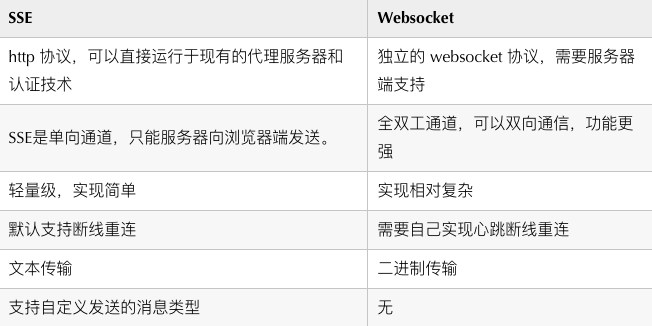
>
> **从兼容性角度考虑，轮询>长轮询>长连接SSE>WebSocket；**
>
> **从性能方面考虑，WebSocket>长连接SSE>长轮询>短轮询。**

## 2. System Design 流程

> 1. **Scenario**， 问面试官基本场景需求
>
>    > 1. **Functional Requirement **
>    >
>    > 2.  **Non-Functional Requirement**
>    >
>    >    > - **可扩展性（Scalability）**: The system should be able to handle a growing number of vending machines and users without significant performance degradation.系统应该能够在需要时水平或垂直扩展，以应对增加的负载。这可以通过采用分布式架构、使用缓存和负载均衡等技术来实现。
>    >    >
>    >    > - **可用性（Availability）**: The system should be highly available to ensure that users can purchase Kindles at any time without downtime.系统应该能够在需要时提供服务，并保持高可用性，以避免用户的不必要等待或中断。这可以通过灾备和容灾机制、监控和自动故障转移等方法来确保系统的可用性。
>    >    >
>    >    > - **性能（Performance）**: The system should be optimized for performance to provide fast response times and a smooth user experience.系统应该能够在合理的时间内（latency）处理大量用户请求（high throughput）并返回响应。这可以通过优化算法、数据库查询和网络通信等方面来提高系统的性能。
>    >    >
>    >    > - **安全性（Security）**: User data, including personal information and payment details, must be protected from unauthorized access and breaches.系统应该能够保护用户数据和系统资源免受未经授权的访问、篡改或破坏。这可以通过身份认证、权限控制、加密和漏洞修复等措施来确保系统的安全性。
>    >    >
>    >    > - **可靠性（Reliability）**：系统应该能够在出现故障或异常情况下继续运行，并保持数据的一致性和完整性。这可以通过采用容错机制、备份和恢复策略来提高系统的可靠性。
>    >    >
>    >    > - **Monitoring and Analytics**: Implement monitoring tools and analytics to track system performance, user behavior, and inventory levels, allowing for informed decision-making and optimization.
>    >    >
>    >    >   
>    >    >
>    >    >   
>    >
>    > 3. **访问量**， 用来计算QPS， **多大需求， 例如：多少用户**
>    >
>    >    > - 24 hours * 3600 seconds = 86400 seconds
>    >    >
>    >    > - 一台 Web Server 约承受量是 1k 的 QPS (考虑到逻辑处理时间以及数据库查询的瓶颈)
>    >    > - 一台 SQL Database 约承受量是 1k 的 QPS(如果 JOIN 和 INDEX query比较多的话，这个值会更小)
>    >    > - 一台 NoSQL Database (Cassandra) 约承受量是 10k 的 QPS
>    >    > - 一台 NoSQL Database (Memcached) 约承受量是 1M 的 QPS
>    >    >
>    >    > **Average Read/Write QPS**
>    >    >
>    >    > **Peak Read/Write QPS**
>
> 2. **Service**,  根据Requirement将大系统拆分为小服务
>
>    > 1. 根据每一个需求添加一个服务
>    > 2. 归并相同的服务
>
> 3. **Storage**
>
>    > **数据库**
>    >
>    > > 1.  SQL or NoSQL
>    > >    - 是否需要支持 Transaction? 
>    > >      - NoSQL不支持Transaction
>    > >    - 存储数据有多大
>    > >      - NoSQL 存储 TB （甚至 PB）级别的数据
>    > >    - 是否需要丰富的 SQL Query, 连表操作?
>    > >      - NoSQL的SQL Query不是太丰富
>    > >      - 也有一些NoSQL的数据库提供简单的SQL Query支持
>    > >    - 是否想偷懒?
>    > >      - 大多数 Web Framework 与 SQL 数据库兼容得很好
>    > >      -  用SQL比用NoSQL少写很多代码
>    > >    - 是否需要自增主键Sequential ID?
>    > >      - SQL 为你提供了 auto-increment 的 自增主键Sequential ID • 也就是1,2,3,4,5 ...
>    > >      - NoSQL的ID并不是 Sequential 的
>    > >    - 对QPS的要求有多高?
>    > >      - NoSQL 的性能更高，不需要解析
>    > >    - 对Scalability的要求有多高?
>    > >      - SQL 需要码农自己写代码来 Scale，做Sharding，Replica 
>    > >      - NoSQL 这些都帮你做了
>    > > 2. Schema, 细化table
>    >
>    > **文件系统** 
>    >
>    > > Local FS or Distributed FS
>    > >
>    > > - Local File System: 支持小数据量，访问快
>    > > - Distributed File System：支持海量数据，常用 HDFS， GFS， S3
>    >
>    > **缓存系统** 
>    >
>    > > 全文搜索（Full-Text Search）: Solr，ElasticSearch,  MySQL(不强大)
>    > >
>    > > 基于内存：  Redis， MemCache
>
> 4. **Scale** 
>
>    > **bottlenecks**：

## 3. 经验分享

### L5 系统设计

> 1. 面试官把题目说出来以后，问问题，搞清楚需求。需求就分两种：functional requirements 和 non-functional requirements。对于functional req，要根据题目适当地问问题，了解需求。对于non-functional req，基本就是在以下的需求里面挑选出合适的：usage pattern（是read heavy还是write heavy），是否需要考虑scalability的问题，是否需要highly available，consistency（strong consistency，还是eventual consistency，是否需要read-your-own-write consistency），latency是否有要求，data durability是否有要求，idempotency（对于付款相关的系统一定强调这个）。以上有那么多non-functional req，我们不可能对于每个问题都把每个需求说一遍，那样太浪费时间。我们应该关注这个系统的重点，比如让你设计monitoring system，那availability就是重中之重，其他的点比如scalability，虽然重要，但不会是考察的重点，可以这时候简单提一下，在面试的后期再回头讲解如何解决这个问题。functional requirements 和 non-functional requirements应该力求在15分钟以内说完。有些点快速略过很重要，有时候你说的不是重点，虽然说了不会扣分，但是会耽误几十秒时间，使得后面没有时间说重点。系统设计面试，时间管理非常重要。
>    在搞清楚需求之后，对于senior面试者，一般都是希望你从这里开始一直主导对话直到结束的。所以我会直接说"okay now let me list a few topics that we wanna cover"，然后直接写下"API design", "capacity estimation", "high-level architecture design"，"database (schema, sql/nosql, sharding, replication)"和"other topics"。这些就是系统设计可能会讨论的大方面，提前写好可以保证你在主导对话的同时记得涵盖所有的点，不然自己一直说，可能一兴奋忘了说重点。列出这些点之后我会说"now let's start with API design, what do you think?"然后面试官就会回答好或者不好，你就可以继续说下去了。这里要注意的是，我们其实只是在假装"drive the conversation"，最后先说哪个再说哪个其实还是面试官决定的，除非在少数情况下面试官没有偏好，告诉你先说哪个都行，那你就可以自己随便挑。注意，如果面试官让你自己挑顺序，你也要按照合理的顺序，或者让自己最舒服的顺序，来最大化自己的收益。下面具体说说买个方面应该怎么应对。
>
> 2. API design。如果这个系统会暴露出一些API，那么一般这是个考察重点。在说这个主题的时候，一般都是对于每个API，定好名字，定好输入是哪些，输出是哪些就行了。有少数情况面试官会问你是用RPC还是Rest API，有的还会问一些Rest API的知识，这些都准备一下就行了。有的情况下设计synchronized API和asynchronized API会有很大不同，那么就要说清楚你选择哪个，以及理由是什么：比如有的时候一个操作需要执行很久，这时候一般选择设计一个async API先立刻返回一个id给caller，让caller拿着id去查询操作的执行情况，而不应该只设计一个sync API让caller一直阻塞在那里。有时候一些API看起来是读东西的，所以不需要任何输入，这时候需要注意，就算不需要任何输入，也需要一个id来识别caller，因为有时候要做rate limiting，这个在面试的时候随便提一下就可以了，真正如何做rate limiting可以放在最后"other topics"里面说。
>
> 3. Capacity estimation。这个简单，grokking里面讲得不错了。一般就是把QPS (read, write)，network bandwidth(upload, download)，disk storage算一下就行了。注意，算QPS和bandwidth的时候，要把average value和peak value都算一下，一般是先算average，然后你可以说假设peak比average高一个数量级。1M/day换算成QPS就是12/s，这个要记住。算disk storage的时候，直接说“假设我们存5年的数据”，因为5年约等于2000天，好算，同时不要忘记存在disk上的数据都有replication，一般直接说"let's assume the replication factor is 3"，然后乘以3就行了。
>
> 4. High-level architecture design。这个就是画图，没啥好说的。建议提前熟悉一下面试要用的画图软件。
>
> 5. Database (schema, sql/nosql, sharding, replication)。一般讨论数据库的时候就是讨论这些点，说schema的时候一般说一下有哪些表，每张表有哪些column，谁是primary key就行了。对于sql/nosql，要根据场景来说，我遇到的只能用sql的场景很少，只能用nosql的场景也不多，一般都是二者都可以，但是我会跟面试官说虽然二者都可以，但我更偏向于nosql，因为这里写操作比较多。但是大家还是要根据具体情况来，比如订票系统，牵扯到多张表的distributed transaction，那么只能是sql，还有购物相关的系统，user-order-item这些东西是天生relational的，那么sql也是更好的选择。我印象中的其他系统就很少遇到那种只能用sql的。对于sharding，一般都有一个"shard by user id"还是"shard by item id"的trade off，如果是user id，那么会有Hotspotting问题（因为有的user特别活跃），如果是item id，虽然可以解决hotspotting问题，但是如果需要读某个user的数据，就需要访问所有的shard。这个trade off对于大多数题目都适用，如果是你在讲database的时候主动提出，会大大加分。
>
> 6. Other topics（cache/how to scale/push vs. pull/monitoring/rate limiting/failure handling/logging）。如果以上所有东西说完还有时间，一般面试官会让你在这里面挑一两个点讲一讲，就挑最拿手的讲就行了。注意，有时候这里面的某个点会是这个系统的重点，那么就应该把这个点放在前面着重讲。
>
> 以上就是我总结出来的套路，但是一定要注意在面试的时候根据面试官风格的不同适当调整。技巧就是每次都先问问面试官是不是ok，比如"let's start with capacity estimation, what do you think?"，有的面试官压根就不希望你做capacity estimation，会告诉你先不要做，后面有时间再做，那么这个技巧就可以帮你节省大量的时间。有时候有的面试官自己有强烈的偏好，会告诉你先画high-level architecture，然后等你画完不给你机会自己说，而是开始问问题，不给你机会drive the conversation。我面了这么多家，各种风格的面试官都遇到过，最后得出来的体会是：这个套路可以应付大多数面试，但是一但发现面试官有自己的偏好，就一定要放弃套路，跟着面试官走，有的面试官完全不需要你来drive conversation，你就让他问问题就好了。有的面试官在你说话的时候绝对不会打断，所以你要不断确认你说的是否合理，不然花很多时间说一些面试官根本不在乎的东西，虽然不扣分，但是浪费了宝贵的时间。对于大多数传统的面试官，根据这个套路就能应付。
>
> 面试技巧固然重要，内功也不能忽视。我在准备阶段主要接触了以下资料：
>
> 1. DDIA：这是我一开始准备就开始看的书，我觉得有条件的应该看两遍，开始的时候看一遍，然后进行一些面试练习之后再看一遍加深印象
> 2. grokking：这是我看完书之后就看的资料。很多人说这个资料不行，但是我觉得这取决于你如何对待它。它的问题在于讲东西的时候有时候没有章法，很多时候没有列出重要的trade off。但是它的价值在于给我们准备了很多常考的例题，每个例题都踩了一些点。如果我们能合理组织它踩的这些点，还是可以应付面试的。最大的价值还是它提供的例题，基本都是面试中常见的题型。
> 3. YouTube上的InfoQ频道：看这个频道里的QCon视频，可以真正了解工业界对某些问题的解法是什么样的。看多了之后会增加你在面试的时候的自信：因为你知道你说的就是工业界常用的解法，绝对不会错。这个建议没事就看看，像看剧一样刷。
> 4. YouTube上Scott Shi的频道：这个频道最大的意义也是给大家提供了一些常见的例题（还有一些不常见的例题）。如果纯看视频里讨论的质量，肯定没有那么高，但是关键在于这些例题以及这些讨论能不能引发你的讨论，你能不能把这些题目自己模拟做一遍。
>
> 如果以上的资料都看完了，后面的重点就是练习面试技巧，我采取的是付费模拟面试的方法，大家可以采取别的方法。重点是一定要实战练习，让自己习惯面试的环境。

### L6 系统设计

> 3年前我准备跳槽的时候，基本在工作中没有积累系统设计的经验（因为不是做infra/backend的），也对系统设计面试毫无了解。当时为了准备系统设计面试，看了很多资料，总结了很多套路（细节都在【跳槽拿了7个senior offer，分享一下经验】这篇文章里），同时花了一千多刀做了付费模拟面试，最后保持了很好的面试成功率。
>
>
> 3年过去了，我这次并没有花很多时间准备系统设计面试，因为知识性的东西我在3年前都学过了，这次只需要复习就行了。对比3年前，我的主要进步在于思维方式的提升。过去3年的工作让我经历了大量系统设计实战，实战确实让我获得了更多系统设计知识，但是我觉得更重要的（也是能让我跨过L6这道坎的）是从实战中获得的思维方式的提升。
>
>
> 因此，这篇文章的中心思想就是：如果想把系统设计面试水平从L5提高到L6，不仅需要知识的积累，更需要思维方式的提升，最后还需要一点面试技巧的加持。延伸出去：思维方式的提升不仅是在系统设计上跨过L6这道坎的重要因素，（我认为）也是在公司内部升6的重要因素。
>
> **系统设计——知识**
>
> 系统设计知识不是这篇文章的重点，大家随便一搜“如何准备系统设计”，基本上出来的文章都讲得很好了。那些文章主要讲了如何学习系统设计的知识，但是对思维方式以及面试技巧的讲解不足。
>
> 关于获取系统设计知识：如果你在工作中能接触到系统设计实战，那么这是很好的学习系统设计知识的机会。但是很多人都没办法在工作中很好地接触系统设计实践，原因有：
> 	* 你可能做的不是backend/infra相关工作。比如你如果在大厂产品组，你的工作难度都在搞清产品需求以及开会对齐上面了,你的目标主要是drive business metric，所以你参与的系统设计的机会不多，而且写代码也主要是写业务逻辑。当然，这里只是举例，不同产品组差别还是很大的。
>
>  * 你可能在维护一个很老的系统，你的主要工作是让系统持续稳定运行，而不是加新功能。
>    你可能在参与开发一个新系统，但是系统复杂度不够（或者复杂的活都给别人干了），导致你只能参与边角料模块的设计。
>
> 以上主要是说，从工作中获取系统设计知识很难。现实中，每个人的工作都包含大量杂活，导致很难有人能有50%以上的工作时间花在“学知识”（比如系统设计实践）之类的事情上。实际上，如果你的工作有30%的时间花在这类事情上，我觉得就已经很难得了。
>
> 但是从工作中习得的系统设计知识也是最宝贵的，因为只有实战经验才能让你内化（internalize）这些知识。从书本上学习的知识，如果不加以练习以及运用，是很容易忘记的。对于没办法从工作中获得很多系统设计知识的人，如果你想准备系统设计面试，以下是我在当前这个时间（2024年3月）推荐的阅读资料（我的推荐不一定适合所有人，请同时也参考别人的文章）：
>
> * 内功：Designing Data-Intensive Applications
>   这本书里的内容基本上你不会在面试中直接用到，但是它讲了很多技术的理论基础。对于理论来说，这本书讲得很浅（很多理论都是一笔带过）。但是对于面试来说，这本书是很偏理论的。
> * 知识以及面试技巧：Alex Xu的ByteByteGo这个网站把系统设计面试所有常见题型都罗列了，并且对知识的讲解到了很细的层面（结合DDIA的阅读，会更好理解这里的知识）。
>   它对思维方式和面试技巧的讲解很浅，但是如果你毫无面试经验，还是可以学到很多的。
>   如果你没有很多时间准备面试，你甚至可以跳过DDIA直接学习这个网站。这样应该足够应付基础的系统设计面试。
>
> **系统设计——思维方式**
>
> 最近我一直在思考，在知识没有增长很多的情况下，是什么让我可以比3年前通过更高一级的系统设计面试，其实原因是很复杂的。我把这些因素抽象出来一个词，叫“思维方式”，因为我找不出其他更好的词了。由于这些因素的复杂性，我没办法很好地用几句话解释“什么是让你能通过L6系统设计面试的思维方式”。下面我会尝试从不同角度解读“思维方式”的意思，看看能不能让大家理解我在说什么。最后我会给出一些例子说明如何使用这些思维方式。如果你写作能力比我好，欢迎你帮我优化一下我的文章。
>
> 1）思维的高度、广度和深度
>
> L6在面试中当然要表现出比L5强的思维高度、广度和深度。在分析问题的时候，能不能后退一步，提炼出问题的核心；在谈到系统核心问题的时候，能不能深挖一层；在做重要决策的时候，能不能尽可能考虑更多的不同方案并且比较他们的优劣，L6在这些方面都应该做得更好。
>
> 2）少做假设，多和面试官确认
>
> 有时候我们会在面试中不自觉地对系统的关键部分做出假设。做假设当然是很重要的，特别是对于不重要的细枝末节，我们可以做出假设然后跳过。但是我们有可能会在关键的系统细节上做出一些错误假设，如果你这样做了并且没有和面试官确认，可能导致严重的后果（比如花大量时间解决了一个错误的问题）。.--
> . From 1point 3acres bbs
> 3）第一性原理思考（First Principle Thinking）
>
> 有时候系统里的细节太多，可能会导致我们的思维被淹没在各种细节里面，导致在全局性的问题上没法做出最好的决策。有时候多问几个简单的问题，比如“我们最终要解决的问题到底是啥”以及“当前的系统到底解决了这个问题没”，可能会有意想不到的效果。
>
> 4）软件工程思维
>
> 除去以上几点，还有一些思维方式，它们来自于人在复杂系统中工作的经验。能在面试中展现这些思维也是L6的一个重要信号。比如：
>
> * 尽量保持系统的简单性：如果你需要在已有系统重引入一个新的服务来完成你的设计，一定要思考“新的服务给系统带来了什么样的复杂度”，“增加的复杂度是否是值得的”，能在面试中合理阐述这些是L6的要求。
> * 考虑系统的扩展性，可维护性和可debug性：系统设计不是一次性的任务，现实中的系统都是需要不断发展的。你在设计系统的时候，能不能考虑到未来可能会增加什么样的需求，从而保持扩展性，以及考虑到工程师在维护和debug方面的难度，从而做出合理取舍，都很重要。
> * 很多问题不是二元的：很多时候我们在比较不同方案优劣的时候，不一定是二者取一。有时候可能是结合二者，有的时候可能是先选一个方案，然后等系统发展了（比如流量上来了）再迁移到另一套方案。能有这种思维方式也是L6的要求。
>
> 以上是我举的例子，软件工程思维肯定不止这些。如果用一句话总结，就是：这些思维方式，展现了你在复杂软件系统中工作的经验以及思考。
>
> **举例**
>
> 下面举几个例子说明如何在面试中展现出这些L6的思维方式。都是我各人的观点，不一定成熟，欢迎探讨。
>
> 例子1：思维的高度.--
>
> 系统设计面试有一类常见题目，我称其为“数数类题目”。一般题目的要求是：
>
> * 有一堆events源源不断流入我们的系统，流量很大
> * 我们需要设计一个系统aggregate这些events，支持用户查询
> * 比如ad click event，需要支持用户的查询例如number of clicks in each minute given an ad_id（ByteByteGo 例题）
>
> 前面的部分（pre-processing, pre-aggregation）不说，我直接开始说最后的部分：数据的存储和查询。一个常见的解法是：用一个数据库存每分钟的每个ad_id的click次数，然后做一个查询服务器，每次用户发查询的需求，就让服务器发请求给数据库，然后还可以讨论是否把数据cache在查询服务器的内存里面。我这里的意思不是这个解法有问题，相反，如果能把这个解法完整讲下来，大概率能过L5（甚至L6）的面试。
>
> 现在我用以上的例子讲解，我觉得可以如何将思维拔高一层：
>
> * 我们这里有两个本质的需求：查询和存储。
> * 查询：需要让用户以低latency查询number of clicks in each minute given an ad_id
> * 存储：数据需要被存在disk这种介质上（不能只存memory）
> * 数据库+cache的方案当然可以满足以上两种需求，但是in-memory KV store+[snapshot+WAL]也有可能满足以上两种需求
> * 如果是in-memory KV store+[snapshot+WAL]的设计，在数据来的时候不需要写数据库，直接插入in-memory KV store，同时在硬盘写入一条write-ahead-log（WAL），每隔一段时间把KV store的snapshot存到硬盘，用snapshot+WAL的方法保证in-memory KV store可以在死机以后可以恢复（这个固定套路在DDIA里面有深入讲解）。用这种方案，在查询的时候不需要另外的cache，因为in-memory KV store本身查询就很快，同时也有跟数据库一样的数据durability。当然，这种方案不具备数据库带来的各种特性（比如range scan），所以要根据具体的题目要求具体讨论。
> * 这里我不是在尝试比较这两个方案的优劣，我是在说明这种思维方式。可能我举的例子不是很好，可能这道题多数情况下就应该是数据库+cache。但是如果每次遇到“存储+查询”的问题你都只能想到“数据库+cache”，这是思维高度和宽度不够的表现，要多“退一步思考”想想我们真正要的是什么。或者我们也可以认为这是利用了“第一性原理”，“存储+查询”就是“存储+查询”，而不要一想到存储就是数据库，一想到查询就是cache。如果一个人在面试中充分理解需求的情况下，能合理比较这两个方案的优劣，我觉得这是L6的signal。
>   . 1point3acres.com
>
> 例子2：保持系统的简单性
>
> 跟上面的问题类似，我们把需求略微改动一下：进入我们系统的是每个用户的分数，需要我们显示的是一个global user ranking table。跟上面问题的核心区别：global ranking table是对所有用户都一样的东西（上面的问题里面，每个人有不同的ad_id）。假设我们选取了数据库+cache的设计，用数据库存用户分数，然后放进cache里面（这里cache是必须的，因为每个人查询的query都一样，如果没有cache，每个人的查询都hit数据库，非常不合理），很自然地我们会有两种更新cache的方法：
>
> * 方法一（pull）：让cache所在的服务器每隔一段时间从数据库里面拉取数据，然后更新cache。
> * 方法二（push）：在数据插入数据库的时候，同时也发送一个备份到cache所在的服务器，这样就不用从数据库里面拉取数据，数据也会更新鲜（因为每隔一段时间拉取，总是有延迟）。
> * 这里我不是在绝对地说两个方法的优劣，我的意思是：方法二有一个很大的劣势，如果不提出来就不能公平地比较两个方法。这个劣势就是：增加了系统复杂性。如果需要某个服务在插入数据库的同时把数据push到cache服务器，需要增加：
>   * Distributed transaction：“插入数据库”和“push到cache服务器”的操作必须同时成功或者失败，那么需要distributed transaction的支持，会给工程师开发增加复杂度。
>   * Dependency：本来这个服务只需要插入数据库，现在它还需要push数据到cache服务器，于是它跟cache服务器有了直接的dependency，增加了系统维护和scaling的难度。
>     Routing：如果你的cache服务器是按user_id sharded的，你还需要一个routing服务来告诉我“哪个user_id在哪个cache服务器”，从而我可以把数据正确地push到对的服务器。
> * 以上讨论的系统复杂度的增加，往往在面试中会被忽略。不仅是这道题，任何的push vs. pull的trade off都或多或少可以这样讨论。比如”Design Leetcode”题目里面，在用户提交了代码之后，到底是让客户端pull来拿代码运行结果，还是让服务器push结果给客户端（如果push结果给客户端，你需要增加一个服务，告诉我“哪个user_id跟哪个服务器连着”）。如果能在面试中合理地讨论某种方案增加的系统复杂性，我觉得是L6的signal。
>
>
> 例子3：问题不是二元的.
>
> 以”Design Leetcode”为例，假设我们采用了数据库的设计，数据库里面有一张表是存储submission的，每一行代表了某个用户对某个题目的一次提交。这张表里面肯定会有一行，需要存储用户提交的代码，很自然地有两种方法：
>
> * 方法一：把代码直接存在数据库。
> * 方法二：代码是一个text file，所以把文件存blob store，然后在数据库中存储一个url指向这个文件。
> * 这个问题不像”Design Instagram”里面那样绝对，因为”Design Instagram”的时候，照片是大概率不能存数据库的，需要存blob store。这也是这个问题有趣的地方，我会这样在面试中讨论：代码算是文件，但是它一般比较小，我觉得我们可以拿用户真实提交的代码做数据分析，如果他们确实都很小，我们可以设置一个limit，保证他们大小不超过某个值，然后全部存数据库。如果我们不得不支持一些大的代码文件，可以只把他们放blob store，其他的依然直接放数据库（hybrid 方法）。或者我们可以先把所有代码存数据库，保证初期开发维护简单（增加blob store会增加系统复杂度），等流量上来以后，数据库disk使用率增长太快，再迁移到blob store。
> * 以上的讨论，我主要坚持了“问题不是二元的”的思维方式：提到数据分析，是展示我知道什么时候做data driven decision；提到hybrid方法，展示了思维的灵活性，不是所有东西都二选一；提到先用简单方法再做migration，展示了软件工程的经验。当你能说到这个层面的时候，最后你给出什么答案也不重要了，这也回到了系统设计面试的目的：考察你的思维能力大过看你最后给出什么答案。
>
>
> 例子4：第一性原理思考
>
> 这里我不举系统设计题目的例子了，我举一个我刚编的例子：假设在你工作中，有个人写了个文档，展示自己优化了某个library，增加了某个系统（比如logging系统）将数据写到磁盘的throughput。一般人会开始看文档里面提到的各种细节，看这个人具体做了哪些优化，将throughput提高了多少倍。如果从第一性原理出发，我们可以这样看待这个问题：
>
> * 本质上你增加了磁盘写入的吞吐量，那么我先问这三个问题：这个磁盘的理论写入吞吐量上限是多少？之前的吞吐量达到了上限的百分之几？优化后达到了百分之几？
> * 这样，如果优化以后依然离上限很远（比如依然只有理论值的10%），你就能带着目的去看那个文档：他关注的优化点是哪些，是不是找到了所有的bottleneck，他有没有意识到他优化以后离理论上限还差很远。如果他不知道理论上限，这个优化的工作很可能是白干了（即使它优化了10倍），因为这人连fundamental metric都没考虑到，可能bottleneck根本不在这个library上。
> * 这个例子就是用第一性原理思考的例子：在大量细节面前，能不能找到根本问题，然后找到最重要的metric。
>
> **对思维方式的总结 **
>
> 通过以上阐述，相信大家可以或多或少知道我所说的“思维方式”指什么。明显可以看出来，这些能力主要从工作中获得，很难通过单纯地看书去学习。这些思维方式不仅可以让你在面试中有L6的表现，同时也能帮助你在现实中升6（有时间我可以写篇文章系统讲讲我理解的L6和L5在工作中的区别），虽然思维方式的提升只是6和5的区别之一。
>
> 无论大家当前是几级，做的工作具体是什么样，在工作中多思考总是能让自己收益的。如果能把以上的各种思维方式在工作中运用自如，L6的面试就不会很难。所以下面我做出一个主观的结论：
>
> * 如果你在工作中是L5，通过学习系统设计面试的知识性内容，可以通过L5的系统设计面试，就像3年前的我那样。但是如果想通过L6的系统设计面试，则要努力提升自己的思维方式。
> * 如果你在工作中是L6，那么大概率你已经基本拥有了L6的思维方式，那么你通过学习知识性的内容，结合自己已有的思维方式和面试技巧的打磨，是可以大概率通过L6的面试的。
> * 当然，真实世界是复杂的，有的人有6的水平却还呆在5，有的人升了6也不一定有很好的思维方式（或者有的职位的6不要求很好的思维方式）。
>
>
> **系统设计——面试技巧**
>
> 在掌握知识和思维方式的前提下，一定不能忽略面试技巧。面试毕竟跟平时的工作环境不一样，它要求你在45分钟（或者1小时）内展现出某个等级（比如L6）的水平，所以对于时间的合理分配是很重要的，这要求你极度抓大放小，准确找出核心的问题并多花时间讨论，同时对于非核心问题，一笔带过或者根本不提。看过ByteByteGo之后可能会有的副作用：它讲的细节太多了，可能让你误以为面试也需要讲得很细节，导致你所有东西都讲得很细，导致时间不够用；同时它对思路讲得不够高屋建瓴，导致你忽视了对思考过程的讲解，导致面试官无法从你的思考过程得到“你是L6”的信号。
>
>
> 我看了很多讲系统设计面试的文章，没有人能把面试技巧写得很好。这非常合理，因为面试技巧确实很难单纯用文字写下来。改进面试技巧最有效的方法就是找厉害的人帮你做模拟面试。
>
> 如果让我用一个词总结系统设计面试技巧，就是：灵活。兵无常势水无常形，系统设计确实有套路，但是过分照搬套路会有负面影响。举个过分照搬套路的例子，就是我自己3年前写的文章：跳槽拿了7个senior offer，分享一下经验。虽然我按照那个套路通过了L5的面试，但是它支撑不了L6的面试，所以我对新手的建议是：先学习套路，然后学习放弃套路。如何在套路和放弃套路之间找到平衡？例子：
>
> * 在面试官给出问题之后，一定要反问面试官问题，把题目的要求弄清楚，这是固定套路。但是具体问什么问题，一定要灵活，要只问当前问题的核心问题，比如让你设计一个monitoring系统，availability就很重要，一定要问，但是对于其他题目，availability往往不是最重要的指标，就尽量不要一开始讨论（除非是面试官主动提出，或者在讨论完其他核心问题后你觉得可以讨论）。
> * 在确定题目的要求之后，到底是先做API Design，High-level Design，Database Design，Back-of-the-envelope Estimation，还是先做其他的，都没有固定套路，应该根据题目找出你认为当前最重要的话题。“找出当前最重要的话题”也是系统设计考察的重要能力，如果一个面试者总是没办法自己独立找到当前最重要的话题，那肯定是过不了L6的面试的。
> * 知道什么时候dive deep，知道什么时候一笔带过。很多面试者喜欢只对自己熟悉的领域dive deep，却对其他领域一笔带过。面试中要尽量对核心领域（对整个设计有重大影响）多讨论，对其他领域少讨论，当然，“能独立找出当前设计的核心领域”也是面试考察的重点。
> * 对系统的failure recovery和scalability很了解。这个是固定套路了。对于大多数题目，当你把该说的都说了以后，总是可以看看这两个话题有没有涵盖：每一个服务，有没有都做到能recover from failure，以及是否scalable。

