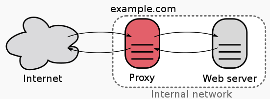
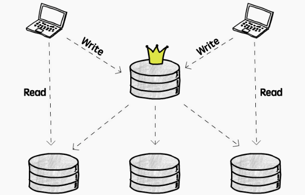
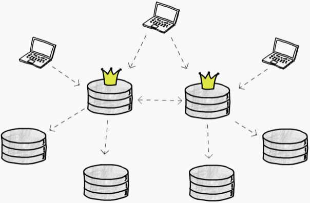
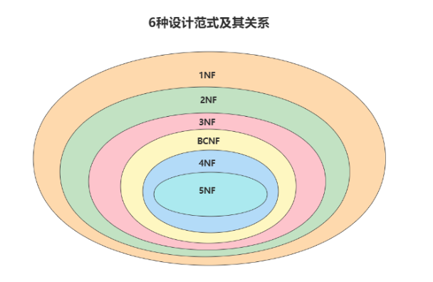

## 1. 系统设计

> 1. **可扩展性**
>
>    >  可扩展，意味着*服务能以加资源的方式成比例地提升性能*：
>   >
>    > Scalability is the property of a system to handle a growing amount of work by adding resources to the system.
>   >
>    > **纵向扩展（Vertical scaling）**
>   >
>    > >  即提升单机配置，对单台机器加内存、处理器、硬盘等硬件资源。投入足够多的预算，就能砸出一台配置豪华的服务器
>   >
>    > **横向扩展（Horizontal scaling)**
>   >
>    > >  即加机器，数量上从一台扩展到多台，多服务器形成拓扑结构。投入足够多的预算，就能拥有一个机房，甚至遍布全球数据中心	
>      >
>    > *加资源也会引入多样性*，一些节点可能比其它节点的处理能力更强大，另一些老旧节点可能弱一些，而系统又必须适应这种异质性（heterogeneity），那么依赖均匀性的算法就会对新节点利用不足，继而产生性能影响
>   
> 2. **延迟与吞吐量**
>   
>    > 延迟（Latency）是指从执行操作到产生结果所需要的时间：其度量单位是时间，例如秒（seconds）、纳秒（nanoseconds），系统时钟周期数（clock periods）
>   >
>    > >  Latency is the time required to perform some action or to produce some result. 
> 
>    > *吞吐量（Throughput）*是指单位时间内所能处理的操作数，或能产生的结果数：
>   >
>    > Throughput is the number of such actions executed or results produced per unit of time.
>   >
>    > 通过单位时间所生产的东西来计量，例如内存带宽（memory bandwidth）用来衡量内存系统的吞吐量，而对于Web系统，
>   >
>    > QPS（Queries Per Second）：用来衡量信息检索系统（如搜索引擎、数据库等）在1秒内的搜索流量
>   >
>    > RPS（Requests Per Second）：请求-响应系统（如Web服务器）每秒所能处理的最大请求数量
>   >
>    > TPS（Transactions Per Second）：广义上指在1秒内所能执行的原子操作数量，狭义上指DBMS在1秒所能执行数量
>
>    同样，由于无法兼具低延迟和高吞吐量，所以权衡之下的原则是：
>
>    > Generally, you should strive for maximal throughput with acceptable latency.
>
>    在确保延迟尚可接受的前提下，转而追求最大的吞吐量
>
> 3. **可用性与一致性**
>
>    > 关于可用性与一致性，有个著名的*CAP定理*：
>    >
>    > > Of three properties of distributed data systems – consistency, availability, partition tolerance – choose two. —— Eric Brewer, CAP theorem, PODC 2000
>   >
>    > 在分布式计算机系统中，一致性、可用性和分区容错性*三者只能择其二（而且分区容错性必选）*：
>   >
>    > - 一致性（Consistency）：每次读取都能得到最新写入的结果，抑或出错
>    > - 可用性（Availability）：每个请求都能收到正常响应，但不保证返回的是最新信息
>   > - 分区容错性（Partition Tolerance）：即便有一部分由于网络故障down掉了，系统仍能继续运行
>    >
>   > 因为网络不完全可靠，所以必须保证分区容错性（P必选）。当部分节点出现网络故障时，有2个选择：
>    >
>    > - 取消操作：能确保一致性，但会降低可用性（用户可能收到超时错误），即CP（Consistency and Partition Tolerance），适用于需要原子读写的场景
>    > - 继续操作：保证可用性，但存在一致性风险（返回的信息可能是旧的），即AP（Availability and Partition Tolerance），适用于可接受最终一致性（Eventual consistency）的场景
>   >
>    > 也就是说，在P必须满足的前提下（*网络故障是系统之外的不可控因素，没得选*），只能在C和A之间进行取舍，要么保证一致性（牺牲可用性），要么保证可用性（牺牲一致性）.
>   >
>    > 当然，在中心化系统（例如RDBMS）中，不存在网络可靠性的问题，此时C和A能够两全
>
> 4. **一致性模式**
>
>    > 如果同一数据存在多份拷贝，那么就需要考虑如何保证其一致性。而严格的一致性意味着要么读到最新数据，要么出错
>   >
>    > 但并非所有场景下都需要达到这样的一致性要求，所以出现了弱一致性与最终一致性等妥协产物
>   >
>    > **弱一致性**
>   >
>    > 写完之后，不一定能读到
>   >
>    > *弱一致性模式（Weak consistency）*适用于网络电话、视频聊天、实时多人游戏等实时场景，而网络电话断线重连后，不会再收到断线期间的通话内容
>   >
>    > **最终一致性**
>   >
>    > 写完之后，异步复制数据，保证最终能读到
>   >
>    > *最终一致性模式（Eventual consistency）*适用于DNS、email等高可用系统
>   >
>    > **强一致性**
>   >
>    > 写完之后，同步复制数据，立即就能读到
>   >
>    > *强一致性模式（Strong consistency）*适用于文件系统、RDBMS等需要事务机制的场景
>
> 5. 可用性模式
>
>    > 可用性保障方面，主要有两种方式：故障转移与复制
>   >
>    > **故障转移**
>   >
>    > 一个节点down掉之后，迅速用另一个点代替它，以缩减宕机时间。具体的，有两种故障转移模式：
>   >
>    > - 主动-被动（主从故障转移）：只由主动服务器处理流量，在工作的主动服务器与待命的被动服务器之间发送心跳包，如果心跳断了，由被动服务器接管主动服务器的IP地址并恢复服务，宕机时间的长短取决于被动机器是热启动还是冷启动
>    > - 主动-主动（主主故障转移）：两台服务器都处理流量，共同承担负载
>   >
>    > 主动-被动模式下，（切换时）存在数据丢失的风险，而且无论哪种方式，故障转移都会增加硬件资源和复杂度
>   >
>    > **复制**
>   >
>    > 分为主从复制与主主复制，多用于数据库，暂不展开
>

### 1.1 Load Balancing

> 多服务器下的请求调度机制称为负载均衡（Load balancing），调度器（Dispatcher）即负载均衡器（Load balancer）.其主要作用是**根据既定策略（如随机、轮流）将客户端请求分发给各个服务器**。
>
> **根据位置实现思路：** 
>
> 1. **DNS 负载均衡**
>
>    DNS 维护着域名与 IP 地址之间的映射关系，因此可以在这里实现负载均衡策略，将请求指向目标服务器（的 IP 地址），例如：
>
>    - 轮流分发：添加一系列 A 记录，将同一域名指向多个不同的 IP 地址即可，称为[round-robin DNS](https://en.wikipedia.org/wiki/Round-robin_DNS)
>    - 随机分发：采用支持[多值应答路由策略](http://www.ayqy.net/blog/dns/#articleHeader6)的 DNS 服务
>
>    *简单易用，但缺陷也很明显*：
>
>    - 可靠性没有保障：DNS 并不检查服务器的可用性，即便目标服务器 down 掉了或者无法访问了，也返回其 IP 地址
>    - 更新不及时：DNS 的解析结果往往会被层层缓存，记录更新无法立即生效
>
> 2.  **Client客户端负载均衡**
>
>    把服务器 IP 地址选择机制拿到客户端来实现，就叫客户端负载均衡, 由客户端自行选择服务器的 IP 地址（不再通过 DNS 查询）
>
>    比起 DNS 负载均衡，*客户端不存在缓存的问题，而且能够进行更精细的控制*，比如检查服务可用性，并从中选取可用的 IP 地址.
>
> 3. **Transport Layer负载均衡**
>
>    4 层负载均衡基于传输层 信息进行请求分发，包括源/目标 IP 地址，以及数据包头部的端口号，*但不考虑数据包内容*
>
> 4. **Application Layer负载均衡**
>
>    *根据应用层协议信息（如 HTTP 头）以及数据包内容信息进行分发*，包括 URL、数据类型、Cookie 信息等.
>
>    7 层负载均衡可以读取请求和响应内容，所需的计算虽然更多，但不见得比 4 层负载均衡性能更差，因为*拥有更全面的上下文信息，可以在此基础上进行更聪明的全局决策*（比如剔除慢速连接、重定向超时请求），甚至还能对内容进行优化（比如压缩），从而提高性能
>
> **路由分发策略：** 
>
> 1. **基于轮询的分配策略（Round-Robin）** 
>
>    Round-Robin是一种简单高效的策略，我们熟悉的DNS服务，P2P网络均适用这种策略。简单的说Roound-Robin算法就是维护机器列表，当请求过来时，对当前的列表进行轮询，找到下一个可投递的机器进行路由。寻找下个可投递机器的算法可以是简单粗暴**按照index等比例分配**，另一种是按照权重来进行非等比分配，这种方式也叫做**Weighted Round-Robin**，即**加权轮询**。
>
>    **优缺点(Pro and Con)：** 
>
>    1. Round-Robin策略的优点是适用性强，不依赖于客户端的任何信息，完全依靠后端服务器的情况来进行选择。能把客户端请求更合理更均匀地或者按比例的分配到各个后端服务器处理。
>    2. 缺点是同一个客户端的多次请求可能会被分配到不同的后端服务器进行处理，无法满足做会话保持的应用的需求。此外，它并不考虑server的负载情况，因此对负载较高的server压力会持续升高。
>
> 2. **基于Session / Cookie 的分配策略** 
>
>    Nginx还支持其它的负载均衡策略，比如使用`ip hash`。所谓`ip hash`是指每个请求按根据IP hash的结果投递到指定服务器上，所有来自相同IP的请求都会路由到同一个server上。这样每个访客固定访问一个后端服务器，主要用于解决 session 的问题，如购物车类的应用。
>
>    **优缺点(Pro and Con)：**
>
>    1. 这种策略的优点是能较好地把同一个客户端的多次请求分配到同一台服务器处理，避免了轮询无法适用会话保持的需求。
>    2. 缺点是当某个时刻来自某个IP地址的请求特别多，那么将导致某台后端服务器的压力可能非常大，而其他后端服务器却空闲的不均衡情况
>    3. 如果服务器down， session 丢失， 解决办法： 可以把session 存在缓存中
>
> 3. **基于负载(Load)的分配策略**
>
>    如果对于某台Server有些请求占用的时间很长，而Round-Robin并不会感知这种情况，依旧轮询该Server，并将请求投递过去，则该台Server的负载会持续升高。为了解决这个问题，Nginx提供了另一种基于最少链接(**least_conn**)的分配策略。这种策略会让Load Balancer感知每个server的负载情况，并把请求转发给连接数较少的后端，从而达到更好的负载均衡效果。

### 1.2 Caching

> Popular items can skew the distribution, causing bottlenecks. Putting a cache in front of a database can help absorb uneven loads and spikes in traffic.
> [读写分离](http://www.ayqy.net/blog/database-replication/)、[分库分表](http://www.ayqy.net/blog/database-partitioning/)、[反范式化](http://www.ayqy.net/blog/database-denormalization/)、[采用 NoSQL](http://www.ayqy.net/blog/nosql/)……如果这些扩展手段全都上了，数据响应依旧越来越慢，还有什么解决办法吗？
>
> 有，加缓存。*利用缓存层来吸收不均匀的负载和流量高峰*. 理论上，在数据层之前的任意一层加缓存都能够阻挡流量，*减少最终抵达数据库的操作请求*.
>
> **Caching 按缓存所处位置分为 4 种：** 
>
> - **客户端缓存**：包括[HTTP 缓存](http://www.ayqy.net/blog/http缓存/)、浏览器缓存等
>
> - **Web 缓存**：例如[CDN](http://www.ayqy.net/blog/cdn/)、[反向代理服务](http://www.ayqy.net/blog/reverse-proxy/)等
>
>   CDN可以用作静态资源的缓存，也可以用作对非登录用户看到数据的缓存，例如Reddit，假如用户没有登录Reddit，那么他们看到的页面和数据都是相同的，这些数据可以提前计算好并存放到CDN节点上，这样即可提高用户体验，也可以避免对后端系统访问的压力
>
> - **应用层缓存**：例如[Memcached](https://memcached.org/)、[Redis](https://redis.io/)等[键值存储](http://www.ayqy.net/blog/nosql/#articleHeader5)
>
>   Each time a request is made to the service, the node will quickly return local, cached data if it exists. If it is not in the cache,the requesting node will query the data from disk. The cache on one request layer node could also be located
>
>   both in memory (which is very fast) and on the node’s local disk (faster than going to network storage).
>
> - **数据库缓存**：一些数据库提供了内置的缓存支持，比如查询缓存（query cache）
>
> **Caching 按缓存所处扩展性分为 3种：**
>
> - Application Server Cache
>
>   缓存的设计方案有很多种，最简单的是单机缓存，即当请求到来时，服务器查自己的缓存，并返回数据给Client。这种方式适用于业务场景简单，没有大规模请求的应用。但是请求量上来，单台服务器会横向扩展到多台，这种缓存方式就会出现问题，虽然被扩展出来的多台服务器仍可以自己维护自己的缓存，但是同一个用户的请求可能被负载均衡投递到不同的服务器上，会大大增加缓存Miss的概率。解决这个问题，可以使用两种方式，一种是分布式缓存，一种是全局缓存。
>
> - Distributed Cache
>
>   分布式缓存是指多台机器组成一个缓存集群，每台机器只存放一部分缓存数据，这样当查询请求打到某一台机器上时，该台机器如果发现自己没有缓存数据，可以自动在集群中其它server上查找。这种分布式缓存的优点缓存容量可通过加机器的方式进行以水平扩展，缺点是如果某个缓存节点挂了，或者新增加一个节点，可能会导致整个集群的缓存失效。因此，如何设计缓存数据在多个节点上的分配策略就变的至关重要，我们会后面会介绍目前比较流行的一致性哈希算法。
>
> - Global Cache
>
>   全局缓存同样是使用多台机器构成一个集群，不同的是，每台机器上所存放的缓存数据均相同，全局缓存通常由两种设计方式如下图所示。
>
>   
>
>   大部分应用会采用第一种方式，这种方式缓存会自动代理对DB的查询操作，省去了业务的额外调用。但并不是所有场景都适合使用第一种方式，如果缓存中的数据都是大文件，当读缓存miss的时候，缓存会自动从数据库中读取该文件，由于数据较大，读取的耗时会很长，这会导致缓存中pending的查询越来越多。这时如果使用第二种方式，由业务查询DB则会大大降低缓存压力。
>
>   **全局缓存的优点是无状态** ，缓存节点的增删对集群没有太大的影响，缺点是单个节点能承受的数据容量有限，而且节点之间维护数据一致性也很麻烦。
>
> **常见的有两种缓存模式：** 
>
> - Cached Database Queries：缓存原始查库结果
>
>   这种模式的主要缺陷在于难以处理缓存过期，因为数据与`key`（即查询语句）之间并没有明确的关联，*数据发生变化后，很难精确地删掉缓存中的所有相关条目*。试想，一个单元格发生变化，会影响哪些查询语句？
>
>   尽管如此，这仍然是最常用的缓存模式，因为可以做出妥协，比如：
>
>   - 只缓存与查询语句有直接关联的数据，排序、统计、筛选之类的计算结果统统都不存了
>   - 不求精确，把所有可能受影响的缓存条目都删掉
>
> - **Cached Objects** ：缓存应用程序中的数据模型，比如重新组装过的数据集，或者整个数据模型类实例对应用程序而言，数据对象比原始数据更容易管理和维护，因此，*建议缓存数据对象*，而不是原始数据
>
> **Cache Invalidation（缓存失效）：**
>
> - **Cache-aside** 
>
>   预留缓存模式下，缓存与数据库之间没有直接关系（缓存位于一旁，所以叫 Cache-aside），*由应用程序将需要的数据从数据库中读出并填充到缓存中*, 数据请求优先走缓存，未命中缓存时才查库，并把结果缓存起来，所以缓存是按需的（Lazy loading），只有实际访问过的数据才会被缓存起来
>   
>
>   主要问题在于：
>
>   - 未命中缓存时需要 3 步，延迟不容忽视（对于冷启动可以手动预热）
>   - 缓存可能会变旧（一般通过设置 TTL 来强制更新）
>
> - **Read-through**
>
>   直读模式下，缓存挡在数据库之前，应用程序不与数据库直接交互，而是直接从缓存中读取数据
>
>   未命中缓存时，由缓存负责查库，并自己缓存起来。与预留缓存唯一的区别在于*查库的工作由缓存来完成*，而不是应用程序
>
> - **Write-through**
>
>   类似于直读模式，缓存也挡在数据库之前，数据先写到缓存，再写入数据库。也就是说，*所有写操作必须先经过缓存*
>
>   *一般与**Read-through**缓存相结合*，虽然写操作多过一层缓存（存在额外的延迟），但保证了缓存数据的一致性（避免缓存变旧）。此时，缓存就像数据库的代理，读写都走缓存，缓存再查库或将写操作同步到数据库。但由于每个写入操作在返回成功给客户端之前必须执行两次，这种方案的缺点是写入操作的延迟较高。
>
> - **Write-behind/Write-back** 
>
>   在这种方案下，数据仅被写入缓存，并立即向客户端确认完成。将数据写入永久存储在指定的时间间隔或在特定条件下进行。进而允许批处理以及写操作合并。 这导致对于**写密集型**应用程序的低延迟和高吞吐量，然而，这种速度带来了在发生崩溃或其他不利事件时数据丢失的风险 。
>
>   同样能够与**read - throughout** 缓存结合使用，而且不存在直写式中写操作的性能问题，但仅保证最终一致性
>
> - **Write-around**
>
>   所谓绕写式缓存就是*写操作不经过（绕过）缓存，由应用程序直接写入数据库*，仅缓存读操作。可与预留缓存或直读缓存结合使用. 这可以减少缓存被不会被后续再次读取的写入操作淹没，但缺点是对于最近写入的数据的读取请求将创建“缓存未命中”，必须从较慢的后端存储中读取并经历较高的延迟。
>
> - **Refresh-ahead**
>
>   提前刷新，在缓存过期之前，自动刷新（重新加载）最近访问过的条目。甚至可以通过预加载来减少延迟，但如果预测不准反而会导致性能下降
>
> **缓存eviction policies**
>
> 以下策略可以结合使用，比如LRU + LFU
>
> - LRU（Least Recently Used）：最常用的一种策略，根据程序运行时的局部性原理，在一段时间内，大概率访问相同的数据，所以将最近没有用到的数据剔除出去，比如订机票，一段时间内大概率查询同一路线
> - LFU（Least Frequently Used）：根据使用频率，将最不常用的数据剔除出去，比如输入法大多是根据词频联想的
> - MRU（Most Recently Used）：在有些场景下，需要删掉最近用过的条目，比如已读、不再提醒、不感兴趣等
> - FIFO（First In, First Out）：先进先出，剔除最早访问过的数据
> - LIFO （LAST In, First Out）：后进先出，剔除最新访问过的数据
> - Random Replacement（RR）：在必要时随机选择一个候选项并丢弃它以释放空间。

### 1.3 Sharding/Partitioning

> 数据分区（也称为分片）是一种将大型数据库（DB）分割成许多较小部分的技术。它是将数据库/表拆分到多台机器上以改善应用程序的可管理性、性能、可用性和负载平衡的过程。
>
> **进行数据分片的理由:** 
>
> - 在某个特定的规模点之后，通过添加更多的机器来水平扩展要比通过添加更强大的服务器来垂直增长更便宜和可行. 理论上，Web 应用层也面临同样的问题，却不曾听说过一个 Web 服务庞大到单机无法部署，这是因为*Web 服务在设计之初就会考虑职责划分与解耦*，以便各部分能够独立部署、独立扩展，从 20 年前的 SOA（即面向服务架构，包括[微服务架构（Microservices）](http://www.ayqy.net/blog/微服务架构（microservices）/)等变体）起便是如此
> - 为了提升数据库的处理能力，我们把单库扩展成多库，并通过更新同步机制（即[Replication](http://www.ayqy.net/blog/database-replication/)）来保证多份数据的一致性。如此这般，数据库的扩展难题似乎已经顺利解决了然而，在 Replication 方案下，每个数据库都持有一份完整数据，基于全量数据提供增删改查服务，*单库的性能瓶颈仍然存在*，并将成为限制系统扩展性的关键因素
>
> **优势：** 
>
> - 可扩展性：把单库数据拆分到多库后，系统的可扩展性不再受限于单库性能，数据库层“无限”扩展成为了可能
> - 性能：单库数据量减少，数据操作更快，甚至允许多库并行操作
> - 安全性：可以针对（拆出去的）敏感数据，采取更强的安全控制
> - 灵活性：可以对不同的库（比如按数据重要性）采用不同的监控、备份策略，以缩减成本，提升管理效率。或者对不同类型的数据选用不同的存储服务，比如大型二进制内容放到 blob 存储中，更复杂的数据可以存放在文档数据库中
> - 可用性：把数据分散放到多个篮子里，能够避免单点故障，并且单库故障仅影响一部分数据
>
> **分区种类：** 
>
> - **水平分区（Horizontal partitioning，也叫 Sharding）**： 按行拆分，把不同的行放入不同表中， 也被称为基于范围的分片。
>
>   这种方法的关键问题是，*关键在于如何选取 shard key*（按哪个字段的什么特征来分片），尽可能保证负载被均匀地分散到每一片上。 如果用于分片的值的范围没有被谨慎选择，那么分区方案将导致服务器不平衡。与垂直分区相比，水平分区最大的特点是*schema 保持不变*。
>
>   注意，均匀并不意味着要求每一片的数据量均等，重点是均分流量（有些片可能数据量很大，但访问量却很低）。
>
>   同时还要避免产生“热点”，比如按姓氏首字母对用户信息进行分片实际上是不均匀的，因为有些字母更常见，此时按用户 ID 哈希值来分片可能更均匀些
>
> - **垂直分区（Vertical partitioning）** ：按列拆分，把一些列放到其它表中。
>
>   多用于减少 I/O、降低性能成本，比如，按使用频率把常用字段和不常用的字段分开。
>
>   比起水平分区，垂直分区的关键优势在于*把信息拆的更细，进而允许一些针对性的优化*，比如把不经常变化的数据拆分出来，丢到缓存中，把照片等大型二进制内容拆出去单独存放，或者对部分敏感数据进行针对性的安全控制，另一方面，细粒度的数据划分也能够消除一些并发访问，降低并发访问量。
>
>   这种方法的主要问题是，如果我们的应用程序经历了额外的增长，那么可能需要进一步将特定于功能的数据库分区到各种服务器上（例如，不可能由单个服务器处理1亿4000万用户的10亿张照片的所有元数据查询）。
>
> - 按功能分区（Functional partitioning，有时也叫 Federation）：按业务功能拆分，把业务领域中属于相同界限上下文（Bounded Context）的数据放在一起。 把不相干的数据剔除出去（把紧密相关的数据放到一起），有助于加强数据隔离，提升数据访问性能，比如把客户信息和商品库存信息分开
>
> - **Directory Based Partitioning （基于目录的分区）:** 一种解决**垂直分区** 方案中提到的问题的松散耦合方法是创建一个查找服务，该服务知道您当前的分区方案，并将其从DB访问代码中抽象出来。因此，要找出特定数据实体位于何处，我们查询我们的目录服务器，该服务器保存了每个元组键到其DB服务器的映射。这种松散耦合的方法意味着我们可以执行诸如将服务器添加到DB池中或更改我们的分区方案等任务，而无需影响您的应用程序。
>
> **Partitioning Criteria（分区标准）**
>
> - **Key or Hash-based partitioning:** 
>
>   we apply a hash function to some key attribute of the entity we are storing, that yields the partition number. For example, if we have 100 DB servers and our ID is a numeric value that gets incremented by one, each time a new record is inserted. In this example, the hash function could be ‘ID % 100’, which will give us the server number where we can store/read that record. 这个问题的一个解决方法是使用一致性哈希。
>
> - **List partitioning**： 每个分区被分配了一个值列表，因此每当我们想要插入新记录时，我们将看到哪个分区包含我们的键，然后将其存储在那里。例如，我们可以决定所有居住在冰岛、挪威、瑞典、芬兰或丹麦的用户将存储在北欧国家的一个分区中。
>
> - **Round-robin partitioning**： 轮询策略，可以确保数据分布均匀。对于'n'个分区，'i'元组分配给分区（i mod n）。
>
> - **Composite partitioning:** 我们将任何以上分区方案组合起来设计一个新的方案。例如，先应用**List partitioning**，然后应用**Hash-based partitioning**。一致性哈希可以被视为哈希和列表分区的组合，其中哈希将键空间减小到可以列出的大小。
>
> **分区代价（Problems of Sharding）：** 
>
> - **连表查询慢**： 尽量避免跨分区 join、或者考虑并行查询
> - **Referential integrity （引用完整性）: ** 全表查询慢， 对于需要扫描全量数据的查询操作，即便有并行优化也慢，可以通过垂直分区、按功能分区来定位目标分区，避免全表查询，至于水平分区，可以在应用层维护一张映射表，加快分区定位
> - **不支持事务操作**： 将事务操作交由应用层来处理
> - **Rebalancing**：负载不匀导致分区效果大打折扣：考虑增加监控，并根据分析预测定期调整

### 1.4 Index

> Indexes are well known when it comes to databases; they are used to improve the speed of data retrieval operations on the data store. 
>
> 索引是一种数据结构，可以被视为指向实际数据所在位置的目录。因此，当我们在表的某一列上创建索引时，我们将该列和指向整行的指针存储在索引中。
>
> In the case of data sets that are many TBs in size but with very small payloads (e.g., 1 KB), indexes are a necessity for optimizing data access.

### 1.5 Proxy

> 代理服务可以实现在客户端，或者从客户端到目标服务器中间的任意环节。
>
> 例如，客户端不直接向提供目标资源的 Web 服务发起请求，而是带上目标资源的完整 URL 去请求代理服务：代理服务收到之后，（由代理服务来）请求指定资源并将响应结果转发给客户端。
>
> **优点：** 
>
> - 它接收来自客户端的请求并将其转发到源服务器。通常，代理用于过滤请求、记录请求，有时还会转换请求（添加/删除标头、加密/解密或压缩）。
> - 代理服务器的另一个优点是它的缓存可以为大量请求提供服务。如果多个客户端访问特定资源，代理服务器可以缓存它并为所有客户端提供服务，而无需访问远程服务器
> - 代理在协调多个服务器的请求时也非常有用，并且可以用于从系统范围的角度优化请求流量。例如，我们可以将相同（或类似）的数据访问请求合并为一个请求，然后将单个结果返回给用户；这种方案称为折叠转发（collapsed forwarding）。
> - 代理在高负载情况下特别有用，或者当我们有限的缓存时，因为代理可以将多个请求批处理成一个。
> - 另一种使用代理的好方法是折叠对存储空间靠近的数据的请求（在磁盘上连续）。这种策略将导致请求延迟的降低。例如，假设一堆服务器请求文件的部分：part1、part2、part3等。我们可以设置我们的代理，使其能够识别单个请求的空间局部性，从而将它们折叠成一个请求并读取完整的文件，这将极大地减少从数据源读取的次数。这种方案在对TB级别的数据进行随机访问时请求时间上会有很大的不同。
>
> **Proxy种类** 
>
> - **Forward Proxy**
>   
>   *正向代理是对外的，面向外部资源*，用来从网络上获取各种数据。 代客户端发出资源请求，并将响应结果返回给对应的客户端。所以，*正向代理更靠近客户端，与客户端的关系更密切*（跟服务器关系一般，不熟）
>
> - **Reverse Proxy**
>   
>   反向代理负责把流量根据配置规则重定向到内部服务器，外部请求并不知道内网的存在。*反向代理是对内的，面向内部资源*，用作对私有网络上的服务器进行访问控制和保护的前端。
>
>   区别在于，*正向代理是其关联的客户端与所有服务器联系的中介，而反向代理则是其关联的服务器与所有客户端联系的中介*，也就是说，*正向代理代表客户端，而反向代理代表服务器*。
>
>   作用：
>
>   - 加密/SSL 加速：对于 HTTP 服务，可以通过一层反向代理来实现 SSL 加密， 将 SSL 加密的工作交由配备了 SSL 硬件加速器的反向代理来完成
>   - 负载均衡：将流量负载分发给多个 Web 服务器
>   - 托管/缓存静态内容：将静态内容（比如图片）交由反向代理提供，分担源站负载
>   - 压缩：代理服务器能够对资源内容进行压缩优化，提升加载速度
>   - 安全防护：能够屏蔽源服务器的存在及其特征，结合防火墙抵御常见 Web 攻击
>   - 访问控制：对内容进行监控/过滤，常用于工作场所、学校等

### 1.6 Asynchronous mechanism - Message Queue

> 对于多个任务，一般有 3 种执行策略：
>
> - 串行：一个接一个地同步执行，总耗时为所有任务之和
>
> - 并发(concurrency)：指一个处理器同时处理多个任务， 多 CPU/多核并发执行，总耗时取决于最慢的任务耗时。 并发是逻辑上的同时发生（simultaneous），而并行是物理上的同时发生。指在同一时刻只能有一条指令执行，但多个进程指令被快速的轮换执行，使得在宏观上具有多个进程同时执行的效果，但在微观上并不是同时执行的，只是把时间分成若干段，使多个进程快速交替的执行。
>
> - 并行(parallel)：并行是指多个处理器或者是多核的处理器同时处理多个不同的任务。异步并行执行，总耗时同样取决于最慢的任务耗时。
>
>   当系统有一个以上CPU时,则线程的操作有可能非并发.当一个CPU执行一个线程时,另一个CPU可以执行另一个线程,两个线程互不抢占CPU资源,可以同时进行,这种方式我们称之为并行(Parallel)。
>
> 试想，如果工作量持续增长，串行模式的延迟将会越来越大，而且无法通过加资源来解决，可扩展性无从谈起
>
> 并发模式虽然可以通过加 CPU 来应对更多的工作量（即纵向扩展），但很快就会遭遇瓶颈，要么达到顶配，要么耗光预算，可扩展性也不是很好。
>
> 并行模式下，由于任务能够异步执行，我们可以加任意多 Worker 来分担工作量，可扩展性良好。并且，与并发模式相比，异步处理是**非阻塞**的（无需等待执行结果，单 CPU/单核就足够了），意味着在（Worker）执行任务同时，系统仍然能够轻松响应用户请求。
>
> **除了可扩展性方面的优势外，*异步更多的意义*在于：**
>
> - 可打断/可暂停：允许分片执行，而不必一次做完
> - 可调度：允许更细粒度的时间管理，比如闲时主动执行、甚至离线执行
> - 并行的可能性：异步返回结果，意味着可以交给别人、甚至交给一支军队来做
> - 解耦生产者和消费者：把 Worker 分离出去，使之能够独立扩展，比如只加 Woker 不加 Web Server，类似于[分离 Web 层和应用层](http://www.ayqy.net/blog/service-discovery/#articleHeader1)
>
> 实现上，最常见的异步机制当然是**[消息队列](https://en.wikipedia.org/wiki/Message_queue)** 
>
> 队列被用于有效地管理大规模分布式系统中的请求。在处理负载较小、数据库规模较小的小型系统中，写入操作可能是可以可预测地快速完成的；然而，在更复杂和大规模的系统中，写入操作可能需要花费几乎不确定的长时间。例如，数据可能需要写入不同服务器上的不同位置或索引，或者系统可能简单地处于高负载状态。在这种情况下，个别写入（或任务）可能需要很长时间，实现高性能和可用性需要系统的不同组件以异步方式工作；一个常见的方法就是使用队列。
>
> 消息队列的运作中有 3 个角色，*消息的生产者、消费者以及经纪人（Broker）*：
>
> - 生产者：应用程序往队列里发布任务后，立即告知用户该任务的状态
> - 消费者：Worker 拿到任务并执行，完成之后通知
> - Broker：从队列里取出任务并分发给 Worker，并负责管理任务的完整性，包括失败重试、（根据 Worker 的实际状态）动态调整分发策略等
>
> 当然，实际的消息队列/任务队列的实现更复杂一些，需要考虑各种问题：
>
> - 消息可能会丢失：比如消费者挂了，甚至消息队列挂了
> - 消息可能会重发多次：比如消费者做完忘记发送完成回执（ack）了
> - 可能出现忙闲不均的情况：比如轮流分发的话，有些 Worker 接到的总是重活儿
> - 队列可能会溢出：比如 Worker 太少或太忙，导致消息迅速堆积

### 1.7 Replication 

> > 理论上，有了可靠的负载均衡机制，我们就能将 1 台服务器轻松扩展到 n 台，然而，如果这 n 台机器仍然使用同一数据库的话，很快数据库就会成为系统的性能瓶颈和可靠性瓶颈
>
> 那么，如何提升数据库的处理能力？
>
> 从资源的角度来看，无非两种思路：
>
> - 纵向扩展：提升单机配置（硬盘、内存、CPU 等等），但同样会遭遇单机性能瓶颈
> - 横向扩展：增加机器，数量上从单数据库实例扩展到多实例
>
> 这样看来，似乎只要加几个数据库，共同分担来自应用层的流量就完成了从单库到多库的扩展。
>
> **问题**
>
> - 一致性问题
>
>   数据库与应用服务最大的区别在于，应用服务可以是无状态的（或者可以将共享状态抽离出去，比如放到数据库），而*数据库操作一定是有状态的*，在扩展数据库时必须要考虑数据的一致性
>
>   具体的，一致性分为 3 种，严格程度依次递减：
>
>   - 强一致性（Strong consistency）：写完之后，立即就能读到
>   - 最终一致性（Eventual consistency）：写完之后，保证最终能读到
>   - 弱一致性（Weak consistency）：写完之后，不一定能读到
>
> **Replication**
> 通过复制（写操作）来保证多份数据拷贝的信息一致性。向数据库实例 A 写入数据时，也要把相同的数据写入到实例 B、C、D 等
>
> - **异步复制（Asynchronous replication）**
>
>   可以在写完之后，再告知其它实例更新数据，这种模式，客户端无需等待复制操作完成，不存在额外的性能影响。但问题在于：
>
>   - 有数据丢失风险
>   - 无法保证强一致性，因为存在复制延迟（Replication lag）,*（仅能保证最终一致性）*
>
> - **同步复制（Synchronous replication）**
>
>   生写操作时，立即将操作同步到其它所有实例，复制完成之后才算写完，以确保严格的一致性但*同步复制会影响性能和可用性*:
>
>   - 性能影响：需要等待整个复制过程完成
>   - 可用性影响：只要有一个实例出现故障（网络等原因），整个写操作就会失败
>
>   并且数据库实例数量越多，这两方面的影响越大
>
> - **半同步复制（Semi-synchronous replication）**
>   即要求一部分数据库实例同步复制，其余的异步复制, P.S.[PostgreSQL](https://www.postgresql.org/)支持这种模式
>
> **数据库集群结构种类：**
>
> - 单主结构（Single leader replication）：读写分离
>   
>
>   这种结构下，写操作（增/删/改）只允许发生在主库，由主库将写操作复制到其它所有从库，从库只支持读操作（查）
>
>   由于所有客户端都写同一个库，成功避免了写操作冲突的大麻烦。但要注意的是：
>
>   - 承载写操作压力的仍然是单库：*不适用于写密集（write-intensive）的应用*，但好在大多数应用都是读密集的
>   - 访问主库的延迟问题：主库只有一个，只能放在某个确定的地理位置，意味着在某些区域发起写操作可能要承担较高的延迟
>
>   更糟糕的情况，如果主库 down 掉了，需要立即在从库中选出一个接班人，担起主库的职责，保证这套机制正常运转。另外，如果采用的是异步复制，旧主库恢复之后，尚未复制到其它从库的数据与掉线期间新任主库写入的数据可能会出现冲突，此时通常采用 LWW（last-write-win）策略，直接丢弃旧数据，但同样存在风险：特殊的，*一种有意思的情况是旧主库恢复过来以为自己还是主库*，出现分裂（[Split-brain](https://en.wikipedia.org/wiki/Split-brain_(computing))）， 一旦发现存在多个主库，直接停掉一个
>
> - 多主结构（Multi leader replication）
>
>   
>   由于写操作能够同时发生在（异步复制的）多个库，我们必须考虑*如何解决写入冲突*。一般有 3 种思路：
>
>   - 避免冲突：比如按内容特征分库存储，互不相干，比如对于国内国外两个主库，如果能够保证所有对国内数据的写操作都能落到国内主库上，所有对国外数据的写操作都能落在国外主库上，就不存在冲突了
>   - LWW（last-write-win）策略：给每个写操作带上时间戳，只保留最新版本
>   - 交由用户来解决：记下冲突，应用程序提示给用户，由用户决定保留哪一份
>
>   P.S.有些数据库（如[CouchDB](http://couchdb.apache.org/)）支持将所有冲突值都写下来，并在读取时返回一系列值
>
>   此外，多主结构下的另一个难题是复制 DDL（Data Definition Language），即针对 Schema 的写操作，具体见[DDL replication](https://www.brianstorti.com/replication/#ddl-replication)
>
> - 无主结构（Leaderless replication）
>   
>
> - 当然，还有一种不区分主库的结构，所有库都可读可写
>
>   看起来像是“全主结构”，那么可预见的，写冲突将变得非常普遍，所以我们需要调整策略，避免使之成为“全主结构”：
>
>   - 写：客户端同时向多个数据库写，只要有一些成功了就算写完
>   - 读：客户端同时从多个数据库读，各个库返回数据及其对应的版本号，客户端根据版本号来决定采用哪个
>
>   *没有主库也意味着没有了数据同步机制，读到的旧值无法自动更正*， 所以需要额外的纠错机制，客户端在读到旧值时将新值写回去（称为[Read repair](https://en.wikipedia.org/wiki/Eventual_consistency)），或者由独立的进程专门负责找出旧值并纠正回来
>
>   另一个关键因素是读/写操作的目标库数量，至少几个库写入成功后，至少从几个库成功读取才能保证一定能读到新值？
>
>   如果`w`个库写入成功，接着成功读到了`r`个库的数据，那么必须满足`w + r > 库的总数`
>
> **Replication具体实现**
>
> - **基于语句的复制**：将写操作语句原样发一份给其它库执行
>   按语句复制的问题在于，*并不是所有语句的执行结果都是确定的*，例如`CURRENT_TIME()`、`RANDOM()`，虽然一些数据库会在复制时对这些值进行替换，但仍无法保证触发器，以及用户定义的函数有确定的执行结果。另一方面，还要确保事务操作在所有数据库上的原子性，要么全都完成了，要么全都一点儿没做
> - **日志传送式复制**：也叫物理复制，将数据库日志传递给其它库，从日志恢复出完全一致的数据。例如 PostgreSQL 提供的[Streaming Replication](https://www.postgresql.org/docs/current/warm-standby.html#STREAMING-REPLICATION)
>   日志传送式复制能够保证数据完全一致，但（面向存储引擎的）日志通常无法跨数据库版本使用，因为在不同版本的数据库下，数据的物理存储方式可能会发生变化。并且，*日志传送不适用于多主结构*，因为无法把多份日志合并成一份
> - **基于行的复制**：也叫逻辑复制，传递专门用于复制的日志，按行复制。例如[MySQL](https://dev.mysql.com/)提供的的[Mixed Binary Logging Format](https://dev.mysql.com/doc/refman/8.0/en/binary-log-mixed.html)
>   而基于行的复制是前两种方式的结合，采用一种专门用于复制的日志，不再与存储引擎耦合，因而能够跨数据库版本使用。与按语句复制相比，*按行复制需要记录更多的信息*（比如一个语句影响了 100 行，需要按行都记下）

### 1.7 SQL  and NoSQL

> Most of the NoSQL solutions sacrifice ACID compliance for performance and scalability.
>
> **SQL ** 
>
> 1. Advantages（优点）
>
>    > * table is easy to understand.
>    > * 数据一致性（Data consistence），支持ACID
>    > * 复杂查询
>
> 2. Disadvantages（缺点）
>
>    > - **高并发下IO压力大**, 数据按行存储，即使只针对其中某一列进行运算，也会将整行数据从存储设备中读入内存，导致IO高
>    > - **为维护索引付出的代价大**, 为了提供丰富的查询能力，通常热点表都会有多个二级索引，一旦有了二级索引，数据的新增必然伴随着所有二级索引的新增，数据的更新也必然伴随着所有二级索引的更新，
>    > - **维护数据一致性付出的代价大**, 对于并发控制，其核心思想就是加锁，无论是乐观锁还是悲观锁，只要提供的隔离级别越高，那么读写性能必然越差
>    > - **水平扩张（scalability）差，表结构扩张不方便**
>    > - **全文搜索功能弱** 例如like "%中国真伟大%"，只能搜索到"2019年中国真伟大，爱祖国"，无法搜索到"中国真是太伟大了"这样的文本。
>
> **NoSQL** 
>
> 1. Advantages（优点）
>    - **读写性能**：无需经过 SQL 层的解析，读写性能很高。主要例子有Redis，由于其逻辑简单，而且纯内存操作，使得其性能非常出色，单节点每秒可以处理超过10万次读写操作；
>    - **简单的扩展**：基于键值对，数据没有耦合性，容易扩展。典型例子是 Cassandra，由于其架构是类似于经典的 P2P，所以能通过轻松地添加新的节点来扩展这个集群；
>    - **存储格式多**：支持key-value形式、文档形式、图片形式，而关系型数据库则只支持基础类型；
>    - **低廉的成本**：这是大多数分布式数据库共有的特点，因为主要都是开源软件，没有昂贵的License成本
> 2. Disadvantages（缺点）
>    - **支持的特性不够丰富**：现有产品所提供的功能都比较有限，大多数 NoSQL 数据库都不支持事务，也不像 MS SQL Server 和 Oracle 那样能提供各种附加功能，比如 BI 和报表等
>
> 3. NoSQL 数据库适用于：
>
> - 快速变化数据，如点击流（click stream）数据或日志数据
> - 写远高于读
> - 写入量巨大
> - 排行榜或评分数据
> - 临时数据，如购物车数据
> - 频繁访问的热点数据
> - 元数据（metadata），以及查找表（lookup tables）
>
> **ACID vs. BASE** 
>
> 不同于关系型数据库中追求的[ACID](https://en.wikipedia.org/wiki/ACID)（事务的 4 大特性）：
>
> - Atomicity（原子性）：一系列操作要么全部成功要么失败全部回滚
> - Consistency（一致性）：事务执行前后数据库都必须处于一致性状态（满足既定的所有一致性约束）
> - Isolation（隔离性）：并发事务操作的结果状态与按顺序执行一样
> - Durability（持久性）：事务一旦提交，对数据的改变就是永久性的，遭遇故障也不会丢失已提交的结果
>
> NoSQL 在[CAP 的抉择](http://www.ayqy.net/blog/trade-offs-in-system-design/#articleHeader4)中对 C 做了妥协，允许*最终一致性*，即[BASE](https://en.wikipedia.org/wiki/Eventual_consistency)：
>
> - Basically Available（基本可用）：读写操作尽可能保证可用，但不保证任何一致性
> - Soft state（软状态）：由于没有一致性保证，在一段时间后，只是有可能读到最新状态，因为可能还没收敛
> - Eventual consistency（最终一致性）：如果系统运行正常，等待足够长的时间后，最终能够读到最新状态
>
> 也就是说，在分布式环境下，（大多数）NoSQL 数据库仅保证最终一致性，可能无法立即读到最新的数据
>
> 
>
> 
>
> **常见NoSQL**
>
> 1. **KV型NoSql（代表----Redis）**
>
> > KV型NoSql顾名思义就是以键值对形式存储的非关系型数据库。Redis、MemCache是其中的代表，Redis又是KV型NoSql中应用最广泛的NoSql，KV型数据库以Redis为例，最大的优点我总结下来就两点：
> >
> > - 数据基于内存，读写效率高
> > - KV型数据，时间复杂度为O(1)，查询速度快
> >
> > 因此，KV型NoSql最大的优点就是**高性能**，利用Redis自带的BenchMark做基准测试，TPS可达到10万的级别，性能非常强劲。同样的Redis也有所有KV型NoSql都有的比较明显的缺点：
> >
> > - 只能根据K查V，无法根据V查K
> > - 查询方式单一，只有KV的方式，不支持条件查询，多条件查询唯一的做法就是数据冗余，但这会极大的浪费存储空间
> > - 内存是有限的，无法支持海量数据存储
> > - 同样的，由于KV型NoSql的存储是基于内存的，会有丢失数据的风险
> >
> > 综上所述，KV型NoSql最合适的场景就是**缓存**的场景：
> >
> > - 读远多于写
> > - 读取能力强
> > - 没有持久化的需求，可以容忍数据丢失，反正丢了再查询一把写入就是了
> >
> > 例如根据用户id查询用户信息，每次根据用户id去缓存中查询一把，查到数据直接返回，查不到去关系型数据库里面根据id查询一把数据写到缓存中去。
>
> 2. **搜索型NoSql（代表----ElasticSearch）**
>
> > 传统关系型数据库主要通过索引来达到快速查询的目的，但是在全文搜索的场景下，索引是无能为力的，**搜索型NoSql的诞生正是为了解决关系型数据库全文搜索能力较弱的问题**，ElasticSearch是搜索型NoSql的代表产品。全文搜索的原理是**倒排索引**。
> >
> > 搜索型数据库还有一种特别重要的应用场景。我们可以想，一旦对数据库做了分库分表后，原来可以在单表中做的聚合操作、统计操作是否统统失效？例如我把订单表分16个库，1024张表，那么订单数据就散落在1024张表中，我想要统计昨天浙江省单笔成交金额最高的订单是哪笔如何做？我想要把昨天的所有订单按照时间排序分页展示如何做？**这就是搜索型NoSql的另一大作用了，我们可以把分表之后的数据统一打在搜索型NoSql中，利用搜索型NoSql的搜索与聚合能力完成对全量数据的查询**
> >
> > 优点为：
> >
> > - 支持分词场景、全文搜索，这是区别于关系型数据库最大特点
> > - 支持条件查询，支持聚合操作，类似关系型数据库的Group By，但是功能更加强大，适合做数据分析
> > - 数据写文件无丢失风险，在集群环境下可以方便横向扩展，可承载PB级别的数据
> > - 高可用，自动发现新的或者失败的节点，重组和重新平衡数据，确保数据是安全和可访问的
> >
> > 缺点：
> >
> > - 性能全靠内存来顶，也是使用的时候最需要注意的点，非常吃硬件资源、吃内存，大数据量下64G + SSD基本是标配，算得上是数据库中的爱马仕了。ElasticSearch内存用在什么地方，大概有如下这些：
> >   - Indexing Buffer----ElasticSearch基于Luence，Lucene的倒排索引是先在内存里生成，然后定期以Segment File的方式刷磁盘的，每个Segment File实际就是一个完整的倒排索引
> >   - Segment Memory----倒排索引前面说过是基于关键字的，Lucene在4.0后会将所有关键字以FST这种数据结构的方式将所有关键字在启动的时候全量加载到内存，加快查询速度，官方建议至少留系统一半内存给Lucene
> >   - 各类缓存----Filter Cache、Field Cache、Indexing Cache等，用于提升查询分析性能，例如Filter Cache用于缓存使用过的Filter的结果集
> >   - Cluter State Buffer----ElasticSearch被设计为每个Node都可以响应用户请求，因此每个Node的内存中都包含有一份集群状态的拷贝，一个规模很大的集群这个状态信息可能会非常大
> > - 读写之间有延迟，写入的数据差不多1s样子会被读取到，这也正常，写入的时候自动加入这么多索引肯定影响性能
> > - 数据结构灵活性不高，ElasticSearch这个东西，字段一旦建立就没法修改类型了，只能把整个表删了再重建
>
> 3. **列式NoSql（代表----HBase，Cassandra）又称为 宽列存储（Wide column store）**
>
> > 列式NoSql是基于列式存储的，那么什么是列式存储呢，列式NoSql和关系型数据库一样都有主键的概念，区别在于关系型数据库是按照行组织的数据：
> >
> > 
> >
> > 优点：
> >
> > > - 查询时只有指定的列会被读取，不会读取所有列
> > >
> > > - 存储上节约空间，Null值不会被存储，一列中有时候会有很多重复数据（尤其是枚举数据，性别、状态等），这类数据可压缩，行式数据库压缩率通常在3:1到5:1之间， 列试一般在8:1 到 30:1左右
> > >
> > >   
> > >
> > > - 列数据被组织到一起，一次磁盘IO可以将一列数据一次性读取到内存中
> > >
> > > - 海量数据无限存储，PB级别数据随便存，底层基于HDFS（Hadoop文件系统），数据持久化
> > >
> > > - 读写性能好，只要没有滥用造成数据热点，读写基本随便玩
> > >
> > > - 横向扩展在关系型数据库及非关系型数据库中都是最方便的之一，只需要添加新机器就可以实现数据容量的线性增长，且可用在廉价服务器上，节省成本
> > >
> > > - 本身没有单点故障，可用性高
> > >
> > > - 可存储结构化或者半结构化的数据
> > >
> > > - 列数理论上无限，HBase本身只对列族数量有要求，建议1~3个
> >
> > 缺点：
> >
> > > - HBase是Hadoop生态的一部分，因此它本身是一款比较重的产品，依赖很多Hadoop组件，运维还是有点复杂的
> > > - KV式，不支持条件查询，或者说条件查询非常非常弱吧，HBase在Scan扫描一批数据的情况下还是提供了前缀匹配这种API的，条件查询除非定义多个RowKey做数据冗余
> > > - 不支持分页查询，因为统计不了数据总数
>
> 4. **文档型NoSql（代表----MongoDB）**
>
> > 对于MongDB，我们只要理解成一个Free-Schema的关系型数据库就完事了，它的优缺点比较一目了然，优点：
> >
> > - 没有预定义的字段，扩展字段容易
> > - 相较于关系型数据库，读写性能优越，命中二级索引的查询不会比关系型数据库慢，对于非索引字段的查询则是全面胜出
> >
> > 缺点在于：
> >
> > - 不支持事务操作，虽然Mongodb4.0之后宣称支持事务，但是效果待观测
> > - 多表之间的关联查询不支持（虽然有嵌入文档的方式），join查询还是需要多次操作
> > - 空间占用较大，这个是MongDB的设计问题，空间预分配机制 + 删除数据后空间不释放，只有用db.repairDatabase()去修复才能释放
> > - 目前没发现MongoDB有关系型数据库例如MySql的Navicat这种成熟的运维工具
>
> 5. **图库Graph Database（代表----Neo4J）**
>
> > These databases are used to store data whose relations are best represented in a graph.
> >
> > Data is saved in graph structures with nodes (entities), properties (information about the entities) and lines
> >
> > (connections between the entities). Examples of graph database include Neo4J and InfiniteGraph.
> >
> > 数据库用于存储最适合用图表示的数据。数据以图结构保存，包括节点（实体）、属性（有关实体的信息）和边（实体之间的连接）
>
> 

### 1.8 CAP

> 在**分布式计算机系统**中，一致性、可用性和分区容错性*三者只能择其二（而且分区容错性必选）*：
>
> - 一致性（Consistency）：每次读取都能得到最新写入的结果，抑或出错
> - 可用性（Availability）：每个请求都能收到正常响应，但不保证返回的是最新信息
> - 分区容错性（Partition Tolerance）：即便有一部分由于网络故障down掉了，系统仍能继续运行
>
> 因为网络不完全可靠，所以必须保证分区容错性（P必选）。当部分节点出现网络故障时，有2个选择：
>
> - 取消操作：能确保一致性，但会降低可用性（用户可能收到超时错误），即CP（Consistency and Partition Tolerance），适用于需要原子读写的场景
> - 继续操作：保证可用性，但存在一致性风险（返回的信息可能是旧的），即AP（Availability and Partition Tolerance），适用于可接受最终一致性（Eventual consistency）的场景
>
> 也就是说，在P必须满足的前提下（*网络故障是系统之外的不可控因素，没得选*），只能在C和A之间进行取舍，要么保证一致性（牺牲可用性），要么保证可用性（牺牲一致性）.
>
> 当然，在中心化系统（例如RDBMS）中，不存在网络可靠性的问题，此时C和A能够两全

### 1.9 Consistent Hashing

> 分布式哈希表 distributed hash table（DHT）是分布式可扩展系统中使用的基本组件之一。哈希表需要键、值和哈希函数，其中哈希函数将键映射到存储值的位置 。**index = hash_function(key)**
>
> > It allows distributing data across a cluster in such a way that will minimize reorganization when nodes are added or removed.
>
> **普通一致性Hash 算法**
>
> - 将 key 模一个很大的数，比如 360
>
> - 将 360 分配给 n 台机器，每个机器负责一段区间 
>
> - 区间分配信息记录为一张表存在 Web Server 上
>
> - 新加一台机器的时候，在表中选择一个位置插入，匀走相邻两台机器的一部分数据
>
>   
>
> - **缺陷** 
>
>   - 数据分布不均匀，因为算法是“将数据最多的相邻两台机器均匀分为三台”，比如，3台机器变4台机器时，无法做到4台机器均匀分布
>   - 迁移压力大，新机器的数据只从两台老机器上获取导致这两台老机器负载过大
>
> **考虑Load balance 的一致性哈希算法**
>
> - 将整个 Hash 区间看做环， 这个环的大小从 0~359 变为 0~2^64-1， 将机器和数据都看做环上的点
> - 引入 Micro shards / Virtual nodes 的概念， 一台实体机器对应 1000 个 Micro shards / Virtual nodes， 每个 virtual node 对应 Hash 环上的一个点
> - 每新加入一台机器，就在环上随机撒 1000 个点作为 virtual nodes
> -  需要计算某个 key 所在服务器时
>   - 计算该key的hash值——得到0~2^64-1的一个数，对应环上一个点
>   - 顺时针找到第一个virtual node, 该virtual node 所在机器就是该key所在的数据库服务器
> - 新加入一台机器做数据迁移时, 1000 个 virtual nodes 各自向顺时针的一个 virtual node 要数据 

### 1.10 SQL Database Denormalization

> 为了解决数据库层的扩展问题，我们已经讨论了两种方案：
>
> - [Replication](http://www.ayqy.net/blog/database-replication/)：从单库扩展到多库，以承载更多的请求量
> - [Partitioning](http://www.ayqy.net/blog/database-partitioning/)：把单库（表）拆分成多库（表），打破单库的性能瓶颈
>
> 在（多机）多库多表的加持下，激增的请求量、数据量已经不再是难题，然而，除却数据量外，还有一个极其影响单库性能的因素——**数据的组织方式**。关系型数据库，经常需要多表联查才能得到目标信息，关系越复杂，读取性能越差，并最终像数据量一样成为单库性能瓶颈，制约着数据库层的可扩展性。那么，对于关系型数据库，有办法进一步提升数据读取性能吗？
>
> 有，（在一定程度上）改变数据的组织方式，即**反范式化（Denormalization）**
>
> **数据库设计范式化（Database normalization）** 
>
> > 就是按照一系列范式（Normal forms）要求来组织数据模型的过程，目的是减少数据冗余，提高[数据完整性](https://en.wikipedia.org/wiki/Data_integrity#Types_of_integrity_constraints)
>
> 
>
> - 1NF：[第一范式（First normal form）](https://en.wikipedia.org/wiki/First_normal_form)，表的每个属性必须具有原子(单个)值， 要求表中每个字段的值都不可再分， 例如：地址可以拆分成更具体的
>
> - 2NF：[第二范式（Second normal form）](https://en.wikipedia.org/wiki/Second_normal_form)在满足 1NF 的基础上，要求所有非主属性都完全依赖于其主键。一张表就是一个独立的对象，一张表只 表达一个意思。对于非主属性来说，并非完全依赖候选键。会产生以下问题：
>
>   - 数据冗余
>
>   - 插入， 删除， 更新异常(相同的信息在多行中重复出现，不相干的信息也凑在同一张表中)
>
>     
>
> - 3NF：[第三范式（Third normal form）](https://en.wikipedia.org/wiki/Third_normal_form)在满足 2NF 的基础上，要求所有非主属性都不传递依赖于任何主键。每个非键属性依赖于键，依赖于 整个键，并且除了键别无他物
>
> **反范式化（Denormalization）常见做法**
>
> > 范式化会导致查询时需要Join操作，当冗余信息有价值或者能 大幅度􏰁高查询效率 的时候，我们才会采取反范式的优化。**P.S.注意**， *反范式化不等于非范式化*（[Unnormalized form](https://en.wikipedia.org/wiki/Unnormalized_form)），反范式化一定发生在满足范式设计的基础之上。前者相当于先遵守所有规则，再进行局部调整，故意打破一些规则，而后者全然不顾规则
> >
> > 通过增加冗余数据或对数据进行分组，*牺牲一部分写入性能，换取更高的读取性能*：
>
> - 存一些派生数据：例如在一对多关系中，把“多”的数量作为“一”的属性存储起来
> - 预先连接（pre-joined）生成汇总表：把需要频繁`join`的表提前`join`好
> - 采用硬编码值：把依赖表中的常量值（或者不经常变化的值）直接硬编码到当前表中，从而避免`join`操作
> - 把详情信息纳入主表中：对于数据量不大的详情表，可以把全部/部分详情信息塞到主表中，以避免`join`操作
>
> **反范式化的缺点**
>
> - 失去了数据完整性保障：打破范式，意味着之前通过范式化解决的更新、插入、删除异常问题又将重新冒出来，也就是说，*冗余数据的一致性要靠 DBA 自己来保证*，而不像索引视图等由 DBMS 来保证
> - 牺牲了写入速度：由于反范式化引入了冗余数据，更新时要修改多处，但大多数场景都是读密集的，写入慢一点问题不大
> - 浪费了存储空间：存储了不必要的冗余数据，自然会浪费一些存储空间，但空间换时间一般是可接受的（毕竟内存、硬盘等资源已经相对廉价了）
>
> **P.S.一般通过约束规则（`constraints`）来保证冗余数据的一致性，但这些规则又会抵消一部分作用** 

### 1.11 Polling vs Long Polling vs WebSocket vs SSE

> 实现即时通讯主要有四种方式，它们分别是轮询、comet、长连接(SSE)、WebSocket。
>
> 它们大体可以分为两类
>
> - 一种是在HTTP基础上实现的，包括短轮询、comet和SSE；
> - 另一种不是在HTTP基础上实现是，即WebSocket。
>   Long Polling(轮询)， 客户端不停的向服务器发送请求以获取最新的数据信息。这里的“不停”其实是有停止的，只是我们人眼无法分辨是否停止，它只是一种快速的停下然后又立即开始连接而已。
>
> **Traditional Polling(轮询)**
>
> > 轮询是绝大多数 AJAX 应用程序使用的标准技术。基本思想是客户端反复轮询（或请求）服务器获取数据。客户端发出请求并等待服务器响应数据，服务器接到请求后马上返回响应信息并关闭连接 。如果没有可用数据，则返回空响应。
> >
> > 优点：后端程序编写比较容易。 
> > 缺点：请求中有大半是无用，浪费带宽和服务器资源。 
> > 实例：适于小型应用
>
> **Long Polling(长轮询，comet第一种实现方式)**
>
> > 客户端向服务器发送Ajax请求，服务器接到请求hold住连接，直到新消息才返回响应信息并关闭连接，客户端处理完响应信息后再向服务器发送新请求。 
> >
> > 优点：在无消息的情况下不会频繁的请求，耗费资源小。 
> > 缺点：服务器hold连接会消耗资源，返回数据顺序无保证，难于管理维护。 
> > 实例：WebQQ、Hi网页版、Facebook IM。
>
> **Http Streaming(长轮询，comet第二种实现方式)**
>
> > Iframe是html标记，这个标记的src属性会保持对指定服务器的长连接请求，服务器端则可以不停地返回数据， 
> >
> > 优点：在无消息的情况下不会频繁的请求，耗费资源小。 
> > 缺点：服务器hold连接会消耗资源，返回数据顺序无保证，难于管理维护。 
> > 实例：WebQQ、Hi网页版、Facebook IM。
>
> **Server-Sent Events (SSEs)(长连接)** 
>
> > 一种已被写入 HTML 5 标准的服务端事件推送技术，它允许客户端和服务端之间建立一个单向通道，以让服务端向客户端单方向持续推送事件消息，SSE 适用于不需要从客户端发送数据，但要通过某些服务器操作进行更新的场景，例如股票行情、共享设施更新、好友状态更新等。所谓SSE，就是浏览器向服务器发送一个HTTP请求，然后服务器不断单向地向浏览器推送“信息”(message)。这种信息在格式上很简单，就是“信息”加上前缀“data: ”，然后以“\n\n”结尾。SSE与WebSocket有相似功能，都是用来建立浏览器与服务器之间的通信渠道。
> >
> > 优点：消息即时到达，不发无用请求；管理起来也相对方便。 
> > 缺点：服务器维护一个长连接会增加开销。 
> > 实例：Gmail聊天
>
> **WebSocket**
>
> > WebSocket提供全双工单个TCP连接上的通信通道。它提供了客户端和服务器之间的持久连接，双方都可以使用该连接随时开始发送数据。客户端通过称为WebSocket握手的过程建立WebSocket连接。如果该过程成功，则服务器和客户端可以随时在两个方向上交换数据。WebSocket协议使客户端和服务器之间的通信具有较低的开销，从而促进了与服务器之间的实时数据传输。通过提供一种标准化的方法，使服务器无需客户端询问即可将内容发送到浏览器，并允许消息在保持连接打开的情况下来回传递。
> >
> > 优点：实现真正的即时通信，而不是伪即时。 
> > 缺点：服务器长期维护长连接需要一定的成本；各个浏览器支持程度不一 ， 实现比较复杂
> > 实例：网络互动游戏。
>
> **Difference between SSEs and WebSocket**
>
> > 
>
> **从兼容性角度考虑，轮询>长轮询>长连接SSE>WebSocket；**
>
> **从性能方面考虑，WebSocket>长连接SSE>长轮询>短轮询。**

