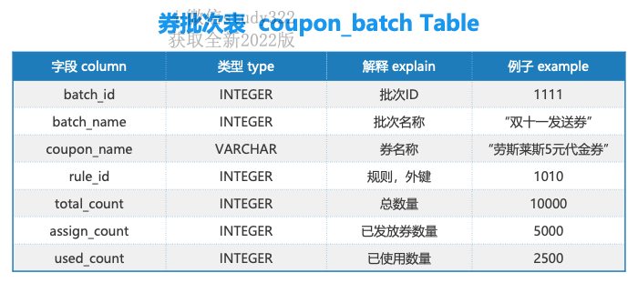
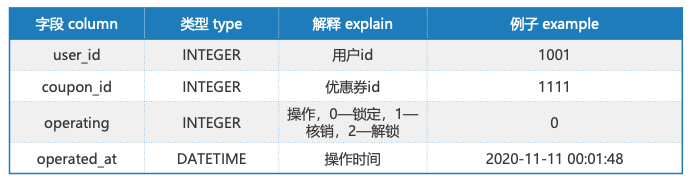
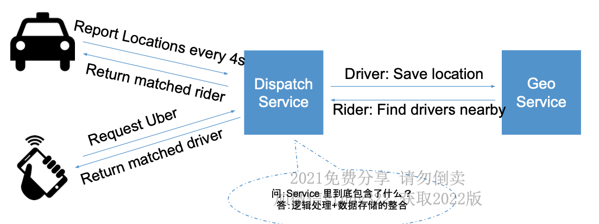

### 1. Tiny URL

> **Functional requirement**:
>
>> - Given a URL, service will generate a unique and shorter url
>> - When user click on the shorter url, our service will return original URL and redirect to the original link
>> - Tiny URL will be expired within a time period
>> - User may be able to customized a short URL
>> - Deleter URL
>>
>
> **Non-Function requeirment:**
>
>> - Availiblity: The system should be high availability, otherwise Tiny URL redirections will be failed
>> - Scalability: System can be horizontally scalable by following CAP theorem
>> - Latency: Redirection should happen in real-tim with mimium latency
>> - Tiny URL should not be predicatable
>> - Read heavy service
>>
>
> **Extended requirement:**
>
>> The service should be accessed through RESTful API.
>>
>> - Based on senario of when, where, how it happens
>> - Based on how easy to implement the service
>>
>
> **Capacity Estimation and Constraints**
>
>> how many users we have?
>> Let’s assuem we have 200M users.  let’s suppose each user will  generate 0.1 URL per day， redirected by 10 URLs/day
>>
>> - Write QPS
>>   - Average: 200,000,000* 0.1 / (24*3600) = 231.4 QPS , Let’s say 300 QPS
>>   - Peak: 300*2 = 600 QPS
>> - Read QPS (100 times of write)
>>   - Average: 30K QPS
>>   - Peak: 60K QPS
>> - Storage(WRITE)
>>   - 500 byte for every url, 200,000,000* 0.1* 0.5 KB= 10,000,000 KB = 10000 MB = 10 GB / DAY
>>   - 10 TB distk can use 3 years, if we store 5 years, we need 20TB including backup
>> - Memory(READ)
>>   - Let’s follow 8/2 rule, means 20% of URLs taking 80% traffic, and we can cache 20% URLs per day
>>   - Every day, we need 200M * 0.5 KB* 10 *0.2 = 200,000,000 KB = 200GB /DAY
>>
>
> **Service:**
>
>> - Functions
>>
>>   - Create Tiny URL
>>     `createURL(APIKey, userId, originalURL, customize_alias = None, expire_data = 5 years)`
>>
>>     API key can prevent abuse, and
>>   - Return original URL
>>
>>     `redirectURL(userId, tinyURL)`
>>   - Delete Tiny URL
>>
>>     `deleteURL(userId, tinyURL)`
>> - RESTful API
>>
>>   - GET /<tiny_url>
>>   - POST /tiny_url
>>     - Payload: {……)
>>     - Return: short url
>>
>> **How do we detect and prevent abuse?**
>> For instance, any service can put us out of business by consuming all our keys in the current design. To prevent abuse, we can limit users through their APIKey, how many URL they can create or access in a certain time.
>>
>
> **Database:**
>
>> - SQL VS NonSQL
>>
>>   > Since we are likely going to store billions of rows and we don’t need to use relationships between objects – a NoSQL key-value store like Dynamo or Cassandra is a better choice, which would also be easier to scale.
>>   >
>> - Schema
>>
>>   - user
>>
>>     > user_id: int PK
>>     >
>>     > user_name: varcher(50)
>>     >
>>     > email: varcher(50)
>>     >
>>   - url
>>
>>     > tiny_url: varchar(20) PK
>>     >
>>     > original_url: varcher(500)
>>     >
>>     > expire_data: datatime
>>     >
>>   - map(no join in nosql server)
>>
>>     > tiny_url: varchar(20) PK
>>     >
>>     > user_id: int
>>     >
>>
>
> **Component Detail Design:**
>
>> 1. Encoding original url to tiny url
>>
>>> - **Option1**: user MD5, and only pick last of first 6 charters
>>>
>>>   - Pro: fast
>>>   - con: hash collisions, can not guartee unique
>>> - **Option2**: Sequential id  + base36 ([a-z ,0-9]) or base62 ([A-Z, a-z, 0-9]), if we add ‘-’ and ‘.’, we can use base64 encoding
>>>
>>>   > **Question1:**
>>>   >
>>>   > We have the following couple of problems with our encoding scheme:
>>>   >
>>>   > 1. If multiple users enter the same URL, they can get the same shortened URL, which is not acceptable?
>>>   > 2. What if parts of the URL are URL-encoded? e.g., http://distributed.php?id=design, and http://distributed.php%3Fid%3Ddesign are identical except for the URL encoding
>>>   >
>>>   > **Solution:**
>>>   >
>>>   > 1. use the Sql DB  auto incretement id feature
>>>   > 2. use the userId append to the input URLs, if user not sign in , might be a problem.
>>>   >
>>> - **Option3: **Generating keys offline(KGS).We can have a standalone Key Generation Service (KGS) that generates random six letter strings beforehand and stores them in a database (let’s call it key-DB). Whenever we want to shorten a URL, we will just take one of the already generated keys and use it. This approach will make things quite simple and fast since we will not be encoding the URL or worrying about duplications or collisions.
>>>
>>>   > **Question1:**
>>>   >
>>>   > Can concurrency cause problems?
>>>   >
>>>   > **Solution:**
>>>   >
>>>   > 1. Two tables, one for not used key, another for used key. If key is ued, moved it; Or, use flag to show key is used or not
>>>   > 2. Cache some unused key in memory, and mark them as used
>>>   > 3. Distributed lock if we have multiple web server
>>>   >
>>>
>>>   > **Question2:****
>>>   >
>>>   > Isn’t KGS the single point of failure?
>>>   >
>>>   > **Solution:**
>>>   >
>>>   > we can have a standby replica of KGS, and whenever the primary server dies, it can take over to generate and provide keys.
>>>   >
>>>
>>>   > **Question3:**
>>>   >
>>>   > user redirection use 301 or 302?
>>>   >
>>>   > **Solution**
>>>   >
>>>   > use 302. 用户第一次访问某个短链接后，如果服务器返回301状态码，则这个用户在后续多次访问统一短链接，浏览器会直接请求跳转地址，而不是短链接地址，这样一来服务器端就无法收到用户的请求。
>>>   >
>>>   > 如果服务器返回302状态码，且告知浏览器不缓存短链接请求，那么用户每次访问短链接，都会先去短链接服务端取回长链接地址，然后在跳转。
>>>   >
>>>   > 1. 从语义上来说，301跳转更为合适，因为是永久跳转，不会每次都访问服务端，还可以减小服务端压力。
>>>   > 2. 但如果使用301跳转，服务端就无法精确搜集用户的访问行为了。
>>>   > 3. 相反302跳转会导致服务端压力增大，但服务端此时就可精确搜集用户的访问行为。基于用户的访问行为，可以做一些分析，得出一些有意思的结论。比如可以根据用户IP地址得出用户区域分布情况，根据User-Agent消息头分析出用户使用不同的操作系统以及浏览器比例等等。
>>>   >
>>>
>>
>
> **Scalability**
>
>> 1. **DB**
>>
>>    - Sharing
>>
>>      - **Range Based Partitioning: **We can store **tiny URLs** in separate partitions based on the first letter of the URL or the hash key. Hence we save all the URLs starting with letter ‘A’ in one partition and those that start with letter ‘B’ into another partition and so on. This approach is called range based partitioning.   **May cause some overload partitions **, need to Monitor it or use consistanc hashing.
>>      - **Hash Function: **In our case, we can take the hash of the ‘key’ or the actual URL to determine the partition to store the file. **May cause some overload partitions **.
>>    - **Replica**
>>
>>      > KGS can have read/write spliting, once write server is done, use read server as master
>>      >
>> 2. **Cache**
>>
>>    > - **Where we use**:
>>    >
>>    >   > Use cache between app server and db, app server and kgs.
>>    >   >
>>    > - **How much we need**
>>    >
>>    >   > As estimated above we need 200GB memory to cache 20% of daily traffic since a modern day server can have 256GB memory, we can easily fit all the cache into one machine, or we can choose to use a couple of smaller servers to store all these hot URLs.
>>    >   >
>>    > - **Cache policy**
>>    >
>>    >   > Read-through
>>    >   > Write-through
>>    >   >
>>    > - **Cache eviction policy**
>>    >
>>    >   > Least Recently Used (LRU) can be a reasonable policy for our system.
>>    >   >
>>    > - **Cache replica**
>>    >
>>    >   > When we can not find url, we will go to the db. database. Whenever this happens, we can update the cache and pass the new entry to all the cache replicas. Each replica can update their cache by adding the new entry. If a replica already has that entry, it can simply ignore it.
>>    >   >
>>    >
>> 3. **Load Balancer (LB)**
>>
>>    > - **Where we use**:
>>    >
>>    >   > 1. Between Clients and Application servers
>>    >   > 2. Between Application Servers and database servers
>>    >   > 3. Between Application Servers and Cache servers
>>    >   >
>>    > - **Distribution strategy**
>>    >
>>    >   > 1. Round-robin
>>    >   > 2. **least_conn**, use this one to avoid case that If a server is overloaded or slow
>>    >   >
>>    >
>>

### 2. Design Youtube

> **Functional requirement: **
>
>> - Upload video
>> - Search video
>> - Watch video
>> - Share video
>> - Generate snapshot
>> - Comment video
>> - Like/Unlike video
>>
>
> **Non-Function requeirment:**
>
>> - Availiblity:
>> - Scalability:
>> - Performance: latency, throughput
>> - Security
>> - Retime suggestion system
>>
>
> **Extended requirement:**
>
> **Capacity Estimation and Constraints**
>
>> how many users we have?
>> 我们有150M的日活跃用户(DAU)，如果用户平均每天观看30个视频，则每秒视频观看数为:
>>
>> - Write QPS **根据经验值上传视频数总是小于观看视频数，**因此假设每上传一个视频，我们就会观看500部视频
>>
>>   - Average: 52083 / 500 = 104 视频/秒
>>   - Peak: 208
>> - Read QPS
>>
>>   - Average: 150,000,000* 30 / (24*3600) = 52083 视频/秒，**即每天视频观看数为45亿**
>>   - Peak: 100K QPS
>> - Storage(WRITE)
>>   假设在平均的情况下，一分钟视频需要50MB的存储空间(视频需要以多种格式存 储)，一秒钟内上传的视频所需的总存储量为
>>
>>   - 520 * 50 = 26000 MB/s = 26 GB/s
>>   - 10 TB distk can use 3 years, if we store 5 years, we need 20TB including backup
>> - Bandwith带宽
>>
>>   - 每秒上传520分钟的视频，并假设每次上传的视频占用的带宽为 166KB/s
>>
>>     520 * 60 * 166 = 5179200 KB/s = 5 G/s
>>
>
> **Service:**
>
>> - User Service
>> - Encode Service
>> - Thumb Service
>> - Video Service
>>
>>   - Upload video
>>
>>     > `uploadVideo(api_dev_key, video_title, vide_description, tags[], category_id, default_language, recording_details, video_contents)`
>>     >
>>     > A successful upload will return HTTP 202 (request accepted), and once the video encoding is completed, the
>>     >
>>     > user is notified through email with a link to access the video.
>>     >
>>   - Search video
>>
>>     > `searchVideo(api_dev_key, search_query, user_location, maximum_videos_to_return, page_token)`
>>     >
>>     > A JSON containing information about the list of video resources matching the search query. Each video
>>     >
>>     > resource will have a video title, a thumbnail, a video creation date and how many views it has.
>>     >
>>
>> **How do we detect and prevent abuse?**
>> For instance, any service can put us out of business by consuming all our keys in the current design. To prevent abuse, we can limit users through their APIKey, how many URL they can create or access in a certain time.
>>
>
> **Stroage:**
>
>> - **Video metadata storage - MySql**
>>
>>   > 1. **Table: video**
>>   > 2. Table: comment
>>   >
>>   >    > - CommentID
>>   >    > - VideoID
>>   >    > - UserID
>>   >    > - Comment
>>   >    > - TimeOfCreation
>>   >    >
>>   > 3. Table: thumbnail
>>   >
>>   >    > 
>>   >    >
>>   > 4. **Chunk Table**
>>   >
>> - **User metadata storage - MySql**
>>
>>   > 1. **User table**
>>   >
>>   >    > UserID, Name, email, address, age, registration details etc.
>>   >    >
>>   > 2. User video table
>>   >
>> - Thumbnail Storage
>>
>>   > - seaweedFS
>>   > - FastFS
>>   > - S3
>>   > - Bigtable
>>   >
>> - Video Storage
>>
>>   > - HDFS
>>   >
>>
>
> **Component Detail Design:**
>
>> - Video Service
>>
>>   > 
>>   >
>>   > 1. 在同一个请求中，要上传大量的数据，导致整个过程会比较漫长，且失败后需要重头开始上传?
>>   >
>>   >    > 1. 视频切分。在编码方式上传中，在前端我们 只要先获取文件的二进制内容， 然后对其内容进行拆分，最后将 每个切片上传到服务端即可。
>>   >    > 2. 断点续传。视频切分后，在客户端根据哈希算法生成所 有视频切片的 chunk_id， 客户端发起上传请求，将所有 chunk_id 带 到服务端， 服务端生成 video_id & 保存目录并返回给 客户端， 客户端开始上传 chunk
>>   >    > 3. 服务端生成 video_id & 保存目录并返回给 客户端
>>   >    >
>>   > 2. 视频上传的过程中，如果用户主动停止上传，那么已经上传的部分如何处理?
>>   >
>>   >    > 会存一段时间，过期后删除上传部分视频
>>   >    >
>>   > 3. **Where would videos be stored?**
>>   >
>>   >    > Videos can be stored in a distributed file storage system like HDFS or GlusterFS.
>>   >    >
>>   > 4. **How should we efficiently manage read traffic?**
>>   >
>>   >    > We should segregate our read traffic from write. Since we will be having multiple copies of each video, we can distribute our read traffic on different servers. For metadata, we can have master-slave configurations, where writes will go to master first and then replayed at all the slaves. Such configurations can cause some staleness in data, e.g. when a new video is added, its metadata would be inserted in the master first, and before it gets replayed at the slave, our slaves would not be able to see it and therefore will be returning stale results to the user. This staleness might be acceptable inour system, as it would be very short lived and the user will be able to see the new videos after a few milliseconds.
>>   >    >
>>   > 5. 当用户上传重复的视频时会发生什么?
>>   >
>>   >    > 两个人都上传到后端，先上传的存入后上传的删除，都在前端显示上传成功
>>   >    >
>>   > 6. 如何提高观看视频的流畅度?
>>   >
>>   >    > 1. 在前端加载视频列表的时候，去文件服务上读取
>>   >    > 2. 用户将鼠标移动到进度条上时，加载缩略图到本地缓存。
>>   >    > 3. 用户点开某个视频的时候，将该视频的所有缩略图加载到本地缓存。
>>   >    >
>>   >
>> - Encode service
>>
>>   > 1. Why  encode?
>>   >
>>   >    > 用户可能上传各种格式的视频，需要转换成 Youtube 兼 容的格式在网页端进行播放。
>>   >    >
>>   > 2. 视频转码和缩略图生成如何实现?
>>   >
>>   >    > 最好还是放在一台 Server 上，因为视频在系统,内部的传输也要占用带宽
>>   >    >
>>   >    > 
>>   >    >
>>   >
>>
>
> **Scalability**
>
>> 
>>
>> 1. Sharding
>>
>>    > 1. **Sharding based on UserID:**
>>    > 2. **Sharding based on VideoID:**
>>    >
>> 2. Load balance
>> 3. CDN
>> 4. Cache
>>

### 3. Design Twitter News Feed

> **Functional requirement: **
>
>> - Register / Login （核心功能）
>> - User Profile Display / Edit
>> - Upload Image / Video *
>> - Search *
>> - Post / Share a tweet （核心功能）
>> - Timeline-某个用户发的所有帖子 （核心功能）
>> - News Feed- 朋友+我发的所有帖子按照某种顺序排列的整合 （核心功能）
>> - Follow / Unfollow a user （核心功能）
>> - Favorite
>>
>
> **Non-Function requeirment:**
>
>> - Availiblity:
>> - Scalability:
>> - Performance: latency, throughput
>> - Security
>>
>
> **Extended requirement:**
>
> **Capacity Estimation and Constraints**
>
>> how many users we have?
>> Let’s assuem we have 200M daily active users.  let’s suppose each user will  generate 0.5 tweets per day， average each user follows 200 people
>>
>> - Write QPS
>>   - Average: 200,000,000* 0.5 / (24*3600) = 1157.41 QPS , Let’s say 1000 QPS
>>   - Peak: 1000*2 = 2000 QPS
>> - Read QPS (100 times of write). let’s assume on average a user visits their timeline two times a day and visits five other people’s pages. One each page if a user sees 20 tweets
>>   - Average: 200M DAU * ((2 + 5) * 20 tweets) / 86400 = 324074 = 324K QPS
>>   - Peak: 60K QPS
>> - Storage(WRITE) Let’s say each tweet has 130 characters and we need two bytes to store a character without compression. Let’s assume we need 20 bytes to store metadata with each tweet (like ID, timestamp,user ID, etc.). Total storage we would need:
>>   - 200,000,000* 0.5 * 150 bytes= 15, 000, 000, 000bytes = 15, 000, 000 kb = 15000mb = 15gb /day
>>   - 15 TB distk can use 3 years, if we store 5 years, we need 20TB including backup
>> - Memory(READ)
>>
>
> **Service:**
>
>> - User Service
>> - Tweet Service
>>
>>   > 1. GET feed api
>>   >
>>   >    > GET /v1/feed?count={count}&last_timestamp={timestamp}
>>   >    >
>>   >    > 最直接的想法是在 getFeed 中发一个 page id 和 page count，告诉服务器我想从第几页开始取，每页是几张照片。这个做法是不对的，因为用户的 Feed 是会增长的，如果取第一页和第二页之间有了新的 post, 那返回的图片的 index 就会错位。**正确做法是传 last timestamp 和 page count，这样就解决了错位的问题**。
>>   >    >
>>   > 2. 上传image
>>   >
>>   >    > POST /v1/images
>>   >    >
>>   >
>> - FriendShip service
>> - Media Service
>>
>> **How do we detect and prevent abuse?**
>> For instance, any service can put us out of business by consuming all our keys in the current design. To prevent abuse, we can limit users through their APIKey, how many URL they can create or access in a certain time.
>>
>
> **Database:**
>
>> - User service
>>
>>   > 1. User table
>>   >
>> - Tweet Service
>>
>>   > 1. Tweet Table
>>   >
>>   >    > 
>>   >    >
>>   > 2. Like Table
>>   > 3. News Feed table
>>   >
>> - FriendShip service
>>
>>   > 1. FriendShip table
>>   >
>> - Media Service
>>
>
> **Component Detail Design:**
>
>> - Tweet Service
>>
>>   > 1. News Feed 如何存取?
>>   >
>>   >    > 1. Pull Model
>>   >    >
>>   >    >    > 算法：
>>   >    >    > 在用户查看NewsFeed时，获取每个好友的前100条Tweets，合并出前100条NewsFeed （K路归并算法 Merge K Sorted Arrays）
>>   >    >    >
>>   >    >    > 复杂度分析：
>>   >    >    > News Feed => 假如有N个关注对象，则为N次DB Reads的时间 + N路归并时间(可忽略)
>>   >    >    > Postatweet=>1次DBWrite的时间
>>   >    >    >
>>   >    >    > 缺点：
>>   >    >    > N次DB Reads非常慢 且发生在用户获得News Feed的请求过程中
>>   >    >    >
>>   >    >
>>   >    > - Push Model
>>   >    >
>>   >    >   > 算法：
>>   >    >   > 为每个用户建一个List存储他的NewsFeed信息， 用户发一个Tweet之后，将该推文逐个推送到每个用户的NewsFeedList中 ，关键词:Fanout
>>   >    >   >
>>   >    >   > 复杂度分析：
>>   >    >   > NewsFeed=>1次DBRead
>>   >    >   > Postatweet=>N个粉丝，需要N次DBWrites（好处是可以用异步任务在后台执行，无需用户等待）
>>   >    >   >
>>   >    >   > 缺点：
>>   >    >   > followers的数 目可能很大
>>   >    >   >
>>   >    > - Pull （对粉丝量大的时候， fanout花时间， 可以用pull）+ Push（普通的用户仍然Push）
>>   >    >
>>   >    >   > 普通的用户仍然Push
>>   >    >   > 将LadyGaga这类的用户，标记为明星用户
>>   >    >   > 对于明星用户，不Push到用户的NewsFeed中
>>   >    >   > 当用户需要的时候，来明星用户的Timeline里取，并合并到NewsFeed里
>>   >    >   >
>>   >    >
>>   >    > Facebook–Pull
>>   >    > Instagram–Push+Pull
>>   >    > Twitter–Pull
>>   >    >
>>   >
>>
>
> **Scalability**
>
>> - Cache
>>
>>   > 1. add cache between db and server
>>   > 2. cache 每个用户的 Timeline
>>   > 3. Cache 每个用户的 News Feed
>>   >
>> - Sharding
>> - CDN
>> - Load Balance
>>

### 4. Design 秒杀系统

> 平日每秒 1000 人访问该页面。 秒杀时每秒数10万人访问该页面。 QPS 增加 100 倍以上。
> 瞬时大流量高并发； 有限库存，不能超卖； 恶意请求； 严格限购； 固定时间开启。
>
> 
>
> **Functional requirement: **
>
>> - make order
>> - make payment
>> - upload product
>>
>
> **Non-Function requeirment:**
>
>> - Availiblity:
>> - Scalability:
>> - Performance: latency, throughput
>> - Security
>>
>
> **Extended requirement:**
>
> **Capacity Estimation and Constraints**
>
>> how many users we have?
>> Let’s assuem we have ? users.  let’s suppose each user will  generate 0.1 URL per day， redirected by 10 URLs/day
>>
>> - Write QPS
>>   - Average:
>>   - Peak:
>> - Read QPS ( times of write)
>>   - Average:
>>   - Peak:
>> - Storage(WRITE)
>> - Memory(READ)
>>   - Let’s follow 8/2 rule
>>
>
> **Service:**
>
>> - Seckill Service
>> - Stock Service
>> - Order Service
>> - Payment Service
>> - User Service
>>
>> **How do we detect and prevent abuse?**
>> For instance, any service can put us out of business by consuming all our keys in the current design. To prevent abuse, we can limit users through their APIKey, how many URL they can create or access in a certain time.
>>
>
> **Database:**
>
>> - Stock Service
>>
>>   > 1. Product info
>>   > 2. Stock info
>>   >
>> - SecKill Service
>>
>>   > 1. Seckill info table
>>   >
>> - Order Service
>>
>>   > 1. Order table
>>   >
>>
>
> **Component Detail Design:**
>
>> - Seckill service
>>
>>   > 1. 直接对数据库操作， 导致数据库崩溃
>>   >
>>   >    > 1. 方法1: 读取和判断过程中加上**事务**
>>   >    >
>>   >    >    > 1. 事务开始
>>   >    >    >    `START TRANSACTION;`
>>   >    >    > 2. 查询库存余量，并锁住数据
>>   >    >    >    `SELECT stock FROM `stock_info ` WHERE commodity_id = 189 AND seckill_id = 28 FOR UPDATE;`
>>   >    >    > 3. 扣减库存
>>   >    >    >    `UPDATE `stock_info ` SET stock = stock - 1 WHERE commodity_id = 189 AND seckill_id = 28;`
>>   >    >    > 4. 事务提交
>>   >    >    >
>>   >    > 2. 方法2: 使用 UPDATE 语句自带的行锁
>>   >    >
>>   >    >    > 1. 查询库存余量
>>   >    >    >    `SELECT stock FROM `stock_info ` WHERE commodity_id = 189 AND seckill_id = 28;`
>>   >    >    > 2. 扣减库存
>>   >    >    >    `UPDATE `stock_info ` SET stock = stock - 1 WHERE commodity_id = 189 AND seckill_id = 28 AND stock > 0;`
>>   >    >    >
>>   >    >
>>   > 2. 将库存信息加载到 Redis 中。直接通过 Redis 来判断并扣减库存。
>>   >
>>   >    > Redis：单线程的数据库。通过IO多路复用实现并发。 支持数据的主备容灾 (Disaster Tolerance) 存储。所有单个指令操作都是原子的，即要么完全执行成功，要么完全执行失败。多个指令也可以通过 Lua 脚本事务操作 实现原子性。因为都在内存中操作，性能极高，单机一般可支撑 10万数量级的 QPS。 可用作数据缓存 (Cache)、数据持久存储和消息队列 (Message Queue)
>>   >    >
>>   >    > 1. 预热（warm up）
>>   >    >
>>   >    >    > 
>>   >    >    >
>>   >    > 2. 通过 Redis 扣减库存
>>   >    >
>>   >    >    > 1. 通过 Lua 脚本执行原子操作（处 理 CAS (check-and-set)命令）,防止高并发导致超卖
>>   >    >    > 2. 如果秒杀量巨大，超过db处理量，通过消息队列(Message Queue，MQ)进行削峰(Peak Clipping)操作。
>>   >    >    >    ``
>>   >    >    >
>>   >    > 3. 库存扣减时机
>>   >    >
>>   >    >    > 1. 下单时立即减库存
>>   >    >    >
>>   >    >    >    > 用户体验最好，控制最精准，只要下单成功，利用数据库锁机制，用户一定能成功付款。可能被恶意下单。下单后不付款，别人也买不了了。
>>   >    >    >    >
>>   >    >    > 2. 先下单，不减库存。实际支付成功后减库存。
>>   >    >    >
>>   >    >    >    > 可以有效避免恶意下单。对用户体验极差，下单时没有减库存，可能造成用户下单成功但无法付款。
>>   >    >    >    >
>>   >    >    > 3. 下单后锁定库存，支付成功后，减库存。
>>   >    >    >
>>   >    > 4. 限购
>>   >    >
>>   >    >    > 
>>   >    >    >
>>   >    >
>>   > 3. 防止刷爆商品页面
>>   >
>>   >    > 1. 前端限流
>>   >    >
>>   >    >    > 
>>   >    >    >
>>   >    > 2. 未开始抢购时，禁用抢购按钮
>>   >    >
>>   >    >    > 
>>   >    >    >
>>   >    > 3. 防止恶意刷请求或者爬虫请求
>>   >    >
>>   >    >    > 1. 黑名单机制 Blacklist Mechanism。黑名单 IP 地址 ， 黑名单用户ID
>>   >    >    >
>>   >    >
>>   > 4. 
>>   >
>>
>
> **Scalability**

### 5. Design 分布式文件系统

> **Functional requirement: **
>
>> - 用户写入一个文件，
>> - 用户读取一个文件
>> - 多台机器存储这些文件
>>
>
> **Non-Function requeirment:**
>
>> - Availiblity:
>> - Scalability:
>> - Performance: latency, throughput
>> - Security
>>
>
> **Extended requirement:**
>
> **Capacity Estimation and Constraints**
>
>> how many users we have?
>>
>> - Write QPS
>> - Read QPS (100 times of write)
>> - Storage(WRITE)
>> - Memory(READ)
>>
>
> **Service:**
>
>> - File service
>>
>>   > 1. Peer 2 peer
>>   >
>>   >    > - Advantage: 一台机器挂了还可以工作
>>   >    > - Disadvantage: 多台机器需要经常通信保持他们数据一致
>>   >    >
>>   > 2. master / slave model
>>   >
>>   >    > - Advantage: Simple Design, 数据很容易保持一致
>>   >    > - Disadvantage: 单master要挂
>>   >    >
>>   > 3. **Master + Slave**
>>   >
>> - Storage service
>>
>>   > 1. save file into one machine
>>   > 2. save file into several machine
>>   > 3. **Final solution**
>>   >
>>   >    > - 普通文件系统 Meta Data，Block
>>   >    > - 大文件存储: Block-> Chunk
>>   >    > - 多台机器超大文件: Chunk Server + Master
>>   >    >
>>   >
>> - Write Service
>>
>>   > 1. save file
>>   >
>>   >    > 
>>   >    >
>>   > 2. update file
>>   >
>>   >    > Delete and re write
>>   >    >
>>   > 3. **Final solution**
>>   >
>>   >    > - Master+Client+ChunkServer 沟通流程
>>   >    > - Master 维护metadata 和 chunkserver 表
>>   >    >
>>   >
>> - Read service
>>
>>   > 
>>   >
>>   > 1. Master task
>>   >
>>   >    > - 存储各个文件数据的metadata
>>   >    > - 存储Map(file name + chunk index -> chunk server)
>>   >    >
>>   >    >   - 读取时找到对应的chunkserver
>>   >    >   - 写入时分配空闲的chunkserver
>>   >    >
>>   >
>>
>> **How do we detect and prevent abuse?**
>> For instance, any service can put us out of business by consuming all our keys in the current design. To prevent abuse, we can limit users through their APIKey, how many URL they can create or access in a certain time.
>>
>
> **Database:**
>
> **Component Detail Design:**
>
>> 1. how to handle if master was failed
>>
>>    > 工业界90%的系统都采用单master , Simple is perfect
>>    >
>>    > Double master
>>    >
>>    > Multi Master
>>    >
>> 2. How to identify whether a chunk on the disk is broken?
>>
>>    > Checksum Method (MD5, SHA1, SHA256 and SHA512)
>>    >
>> 3. 什么时候写入checksum?
>>
>>    > Answer: 写入一块chunk的时候顺便写入
>>    >
>> 4. 什么时候检查checksum?
>>
>>    > Answer: 读入这一块数据的时候检查
>>    >
>>    > 1. 重新读数据并且计算现在的checksum
>>    > 2. 比较现在的checksum和之前存的checksum是否一样
>>    >
>> 5. How to avoid data loss when a ChunkServer is down/fail?
>>
>>    > Replica
>>    >
>>    > 1. 三个备份都放在一个地方(加州)。
>>    > 2. 三个备份放在三个相隔较远的地方(加州，滨州，纽约州)
>>    > 3. 两个备份相对比较近，另一个放在较远的地方(2个加州，1个滨州)
>>    >
>> 6. How to recover when a chunk is broken?
>>
>>    > 
>>    >
>> 7. How to find whether a Chunk Server is down?
>>
>>    > HeartBeat.
>>    >
>> 8. How to improve write speed?
>>
>>    > 
>>    >
>> 9. How to solve Client bottleneck?
>>
>>    > 
>>    >
>>    > 怎么样选队长?
>>    >
>>    > 1. 找距离最近的(快)
>>    > 2. 找现在不干活的(平衡traffic)
>>    >
>> 10. How to solve ChunkServer failure?
>>
>>     > Retry
>>     >
>>
>
> **Scalability**

### 6. Design Big Table

> 
>
> **Functional requirement: **
>
>> - Query with conditions and return the result.
>>
>
> **Non-Function requeirment:**
>
>> - Availiblity:
>> - Scalability:
>> - Performance: latency, throughput
>> - Security
>>
>
> **Extended requirement:**
>
> **Capacity Estimation and Constraints**
>
>> how many users we have?
>> Let’s assuem we have
>>
>> - Write QPS
>>   - Average:
>>   - Peak:
>> - Read QPS (100 times of write)
>>   - Average:
>>   - Peak:
>> - Storage(WRITE)
>> - Memory(READ)
>>
>
> **Service:**
>
>> **How do we detect and prevent abuse?**
>> For instance, any service can put us out of business by consuming all our keys in the current design. To prevent abuse, we can limit users through their APIKey, how many URL they can create or access in a certain time.
>>
>
> **Database:**
>
> **Component Detail Design:**
>
>> 1. 写入数据
>>
>>    > 写入时候之间在硬盘对数据进行排序，以及二分
>>    >
>> 2. 修改文件， 直接append， 按时间戳查找出真正数据
>>
>>    > 
>>    >
>>    > 缺点： 写的时候最后一块是无序的，需要定期整理（k 路归并）
>>    >
>> 3. 写入过程
>>
>>    > 
>>    >
>> 4. 写入过程，怎么把最后一个file从无序变成有序
>>
>>    > 内存排序 + 一次硬盘写入
>>    > ``
>>    >
>> 5. 写入时候机器挂了，内存没了
>>
>>    > 使用 write ahead log （WAL），即内存排序 + 一次硬盘写入 + 一次log写入
>>    >
>> 6. 一个file如何查询数据
>>
>>    > 1. 使用Index
>>    >
>>    >    > 
>>    >    >
>>    > 2. 使用 Bloom Filter（判断某样东西一定不存在或者可能存在）
>>    >
>> 7. 读出过程
>>
>>    > 
>>    >
>> 8. How to write key: value from 1PB file
>>
>>    > constient hash + Horizontal shading
>>    >
>> 9. How to read in bigtable with multi-server
>>
>>    > 
>>    >
>> 10. how to wriet key value?
>>
>>> 
>>>
>>
>> 11. 数据量大时，可以存入hdfs or GFS
>>
>>     > 
>>     >
>> 12. Distributed lock for reading and writing with same key
>>
>>     > - Chubby
>>     > - Zookeeper
>>     >
>>     > 
>>     >
>> 13. Summary of write
>>
>>     > 
>>     >
>> 14. Summary of read
>>
>>     > 
>>     >
>>
>
> **Scalability**

### 7. Design online chat

> **Functional requirement: **
>
>> - 用户登录注册
>> - 通讯录
>> - one-on-one conversations between users.
>> - online/offline statuses
>>
>
> **Non-Function requeirment:**
>
>> - Availiblity:
>> - Scalability:
>> - Performance: latency, throughput
>> - Security
>>
>
> **Extended requirement:**
>
>> - Group Chats:
>> - Push notifications: Messenger should be able to notify users of new messages when they are offline.
>>
>
> **Capacity Estimation and Constraints**
>
>> how many users we have?
>> Let’s assuem we have 500M users.  let’s suppose each user will  sends 40 messages daily
>>
>> - Write QPS
>>   - Average: 500,000,000* 40 / (24*3600) = 231481QPS , Let’s say 230K QPS
>>   - Peak:  460K QPS
>> - Read QPS (same?)
>>   - Average: 230K QPS
>>   - Peak: 460K QPS
>> - Storage(WRITE)
>>   - 100 byte for every message, 500,000,000* 40* 0.1 KB= 2, 000, 000, 000 KB = 2, 000, 000 MB = 2 TB / DAY
>>   - 2000 TB disk can use 3 years, if we store 5 years, we need 4PB including backup
>> - Memory(READ)
>>
>
> **Service:**
>
>> - Message Service 负责信息相关的存取
>> - Realtime Service 负责信息的实时推送
>>
>> **How do we detect and prevent abuse?**
>> For instance, any service can put us out of business by consuming all our keys in the current design. To prevent abuse, we can limit users through their APIKey, how many URL they can create or access in a certain time.
>>
>
> **Database:**
>
>> 1. Thread Table
>>
>>    > 
>>    >
>>    > 1. 使用SQL存储
>>    >
>>    >    > 需要同时 index by
>>    >    > • thread_id用于查询某个对话的信息
>>    >    > • participant_hash_code用户查询某些用户之间是否已经有thread
>>    >    >
>>    > 2. 使用NoSQL,并同时支持按照 thread_id 和participant_hash_code 进行查获询
>>    >
>>    >    > 需要两版张表:
>>    >    >
>>    >    > • 表1:Thread Table
>>    >    >
>>    >    > - row_key = thread_id
>>    >    > - column_key = null
>>    >    > - value = 其他的基本信息
>>    >    >
>>    >    > • 表2:ParticipantHashCode Table
>>    >    >
>>    >    > - row_key = participant_hash_code
>>    >    > - column_key = null
>>    >    > - value = thread_id
>>    >    >
>>    >    > • 因为这里用不到 range query, 也就用不到 column key，因此也可以选择 如 RocksDB 这样的纯 key-value 的 NoSQL。
>>    >    >
>>    >
>> 2. User Thread Table
>>
>>    > 
>>    >
>>    > 1. 使用NoSQL
>>    >
>>    >> 存储结构:
>>    >>
>>    >> - row_key = user_id
>>    >> - column_key = updated_at 按照更新时间倒序
>>    >> - value = 其他信息
>>    >>
>>    >
>> 3. Message Table(NoSQL)
>>
>>    > 
>>    >
>>    > 1. 使用NoSql
>>    >
>>    >    > • row_key = thread_id(**sharding key**)
>>    >    > • column_key = created_at 因为要按照时间倒序
>>    >    >
>>    >    > • value = 其他信息
>>    >    >
>>    >
>>
>
> **Component Detail Design:**
>
>> - Message service
>>
>>   > 1. 信息流程
>>   >
>>   >    > 
>>   >    >
>>   > 2. B poll 太慢，how to speed up?
>>   >
>>   >    > 1. Push Notification 手机自己的消息推送系统 (缺点： 无法支持web 端 和桌面端)
>>   >    >
>>   >    >    > Android GCM (Google Cloud Messaging)
>>   >    >    > iOS APNS (Apple Push Notification Service)
>>   >    >    >
>>   >    > 2. Socket
>>   >    >
>>   >    >    > A: Socket 是很早就有的技术， Web Socket 是在 H5 之后才诞生的技术，专门用于让浏览器支持被服务 器推送信息所用。Socket 是更通用和强大的可以在任何地方使用的。WebSocket 只在浏览器上使用。
>>   >    >    >
>>   >    >    > 
>>   >    >    >
>>   >    >
>>   > 3. How to support group chat?
>>   >
>>   >    > 
>>   >    >
>>   >    > **Q: Channel Service** 中的数据是什么结构?
>>   >    > A: key-value 的结构。key 为 channel name，可以是一个字符串比如 “#personal::user_1”。value是一个 set 代表哪些人订阅到了这个 channel 下。
>>   >    >
>>   >    > **Q: Channel Service** 用什么数据存储?
>>   >    > A: 根据上面所提到的 key-value 结构以及 value 需要是一个 set，Redis 是一个很好的选择。
>>   >    >
>>   >    > **Q:** 如何知道一个用户该订阅到哪些 **Channels?**
>>   >    > A: 首先用户需要订阅自己的 personal channel，如 #personal::user_1，与该用户有关的私聊信息都在这 channel 里发送。小于一定人数的群聊可以依然通过 personal channel 推送，超过一定人数的群聊， 可以采用 lazy subscribe 的方式，在用户打开 APP 且群处于比较靠前的位置的时候才订阅，用户没有主 动订阅的群聊靠 Poll 的模式获取最新消息。
>>   >    >
>>   >    > **Q:** 用户关闭 **APP** 以后还能收到提醒么?
>>   >    > A: 如果真的关闭了 APP 是不行的。所以很多 APP 会常驻后台，保证至少 Poll 模式还能工作即可。
>>   >    >
>>   > 4. 多机登录
>>   >
>>   >    > 用户尝试从新的客户端登录时，如从手机登陆时，查询是否已经有其他手机处于登陆状态
>>   >    >
>>   >    > - 如果没有，则创建新的 session
>>   >    > - 如果有，将对应的 session 设为 expire 或者删除，并发送 push notification 让已经登录的手机 logout， 如果 Push Notification 失败也没有关系， 该手机会在下次访问任何API的时候发现自己已经logout了并跳转至登入界面
>>   >    >
>>   > 5. 支持用户在线状 态显示
>>   >
>>   >    > 1. 使用socket(不建议)
>>   >    >
>>   >    >    > 缺陷1:如果用户的网络不稳定，会导致连接时断时连
>>   >    >    >
>>   >    >    > 缺陷2:如果在 Push Service 中使用数据库来存储在线信息，Push Service 的结构会变得复杂，通用性 会变差，依赖会增多。
>>   >    >    >
>>   >    > 2. 使用数据库存储 online status
>>   >    >
>>   >    >    > 使用 Web Server 直接访问数据库的获取该信息
>>   >    >    >
>>   >    >    > OnlineStatus Table 中存如下一些信息足够: <user, last_updated_at, client_info>,  类似于在打车软件设计中，我们提到的司机在线状态的更新
>>   >    >    >
>>   >    > 3. 是 Pull 还是 Push? 是用户主动告诉服务器我在线，还是服务器询问用户是否在线?
>>   >    >
>>   >    >    > 是 Pull，每隔3-5s pull 一次(heartbeat)
>>   >    >    >
>>   >    >    > 原因:
>>   >    >    >
>>   >    >    > 1. Pull 更简单，依赖更少(不依赖于 Push Service)，代码量更少
>>   >    >    > 2. 在告诉服务器我在线的时候，还可以顺带更新所有好友的在线状况，用于客户端显示， 更新好友在线状态如果用 Push 的方式来做存在很多问题，比如用户如果掉线了，还需要由 Push Server 通知 Web Server 来更新在 线状态，然后再通过 Web Server 通知所有的好友他掉线了。
>>   >    >    >
>>   >    >    > 总而言之就是 Pull 更简单，Push 更复杂，对实时性要求不高的时候，
>>   >    >    >
>>   >    >    > 用 Pull 更好。
>>   >    >    >
>>   >    >
>>   >
>>
>
> **Scalability**
>
>> - **水平扩展**：通过增加更多的存储节点和数据库实例，实现系统的水平扩展。
>> - **负载均衡**：使用负载均衡器将用户请求分配到不同的存储节点，提高系统的处理能力和可靠性。
>> - **分片机制**：将存储数据按照一定规则进行分片，分布到不同的存储节点，提高存储和检索性能。
>> - **缓存机制**：使用缓存（如Redis或Memcached）存储常用元数据和权限信息，减少数据库查询压力，提高系统响应速度。
>> - **异步处理**：对于不需要立即处理的任务（如数据备份和事件通知），使用消息队列（如RabbitMQ或Kafka）进行异步处理，提高系统的处理效率。
>> - **监控和报警**：使用监控工具（如Prometheus和Grafana）实时监控系统的各项指标，设置报警机制，及时发现和处理异常情况。
>>

### 8. Design Map Reduce

> **Functional requirement: **
>
>> - MapReduce
>>
>
> **Non-Function requeirment:**
>
>> - Availiblity:
>> - Scalability:
>> - Performance: latency, throughput
>> - Security
>>
>
> **Extended requirement:**
>
> **Capacity Estimation and Constraints**
>
>> how many users we have?
>>
>> - Write QPS
>> - Read QPS (100 times of write)
>> - Storage(WRITE)
>> - Memory(READ)
>>
>
> **Service:**
>
>> - Functions
>> - RESTful API
>>
>> **How do we detect and prevent abuse?**
>> For instance, any service can put us out of business by consuming all our keys in the current design. To prevent abuse, we can limit users through their APIKey, how many URL they can create or access in a certain time.
>>
>
> **Database:**
>
> **Component Detail Design:**
>
>> 1. MapReduce
>>
>>    > 
>>    >
>>    > Map Reduce 是一套实现分布式运算的框架
>>    >
>>    > - Step1 Input
>>    > - Step2 Split
>>    > - Step3 Map
>>    > - Step4 传输整理
>>    > - Step5 Reduce
>>    > - Step6 Output
>>    >
>> 2. how to implement 传输整理
>>
>>    > 
>>    >
>>    > - Step1 Input
>>    > - Step2 Split
>>    > - Step3 Map 实现怎么把文章切分成单词
>>    > - Step4 Partition sort
>>    > - Step5 Fetch + Merge Sort
>>    > - Step6 Reduce 实现怎么把单词统一在一起
>>    > - Step7 Output
>>    >
>> 3. Build inverted index with MapReduce?
>> 4. Anagram - Map Reduce
>> 5. Design a MapReduce system
>>
>
> **Scalability**

### 9. Design Twitter Search

> Twitter users can update their status whenever they like. Each status consists of plain text, and our goal is to design a system that allows searching over all the user statuses.
>
> **Functional requirement: **
>
>> - Search user status
>>
>
> **Non-Function requeirment:**
>
>> - Availiblity:
>> - Scalability:
>> - Performance: latency, throughput
>> - Security
>>
>
> **Extended requirement:**
>
> **Capacity Estimation and Constraints**
>
>> how many users we have?
>> Let’s assuem we have 200M daily active users.  let’s suppose each user will  create 0.5 status daily
>>
>> - Write QPS
>>   - Average: 200,000,000* 0.5 / (24*3600) = 1150 QPS
>>   - Peak: 1150*2 = 2300 QPS
>> - Read QPS (100 times of write)
>>   - Average: 30K QPS
>>   - Peak: 60K QPS
>> - Storage(WRITE)
>>   - 300 byte for every status, 200,000,000* 0.5* 0.3 KB= 30,000,000 KB = 30000 MB = 30 GB / DAY
>>   - 30 TB distk can use 3 years, if we store 5 years, we need 60TB including backup
>> - Memory(READ)
>>   - Let’s follow 8/2 rule, means 20% of URLs taking 80% traffic, and we can cache 20% URLs per day
>>   - Every day, we need 200M * 0.5 KB* 10 *0.2 = 200,000,000 KB = 200GB /DAY
>>
>
> **Service:**
>
>> - Search
>>
>>   > search(api_dev_key, search_terms, maximum_results_to_return, sort, page_token)
>>   >
>>   >> search_terms (string): A string containing the search terms.
>>   >>
>>   >> maximum_results_to_return (number): Number of status messages to return.
>>   >>
>>   >> sort (number): Optional sort mode: Latest first (0 - default), Best matched (1), Most liked (2).
>>   >>
>>   >> page_token (string): This token will specify a page in the result set that should be returned.
>>   >>
>>   >
>>
>> **How do we detect and prevent abuse?**
>> For instance, any service can put us out of business by consuming all our keys in the current design. To prevent abuse, we can limit users through their APIKey, how many URL they can create or access in a certain time.
>>
>
> **Database:**
>
>> 1. Tweet table
>>
>>    > 
>>    >
>> 2. User table
>>
>>    > 
>>    >
>>
>
> **Component Detail Design:**
>
>> - Search service
>>
>>   > 1. Twitter 搜索引擎
>>   >
>>   >    > 
>>   >    >
>>   > 2. 索引文件应该存在哪里?
>>   >
>>   >    > 文件系统HDFS
>>   >    >
>>   > 3. Inverted Index
>>   >
>>   >    > 倒排索引结构是根据内容(词语)找文档，倒排索引结构也叫反向索引结构，包括索引和文档两部分，索引即词汇表，它是在索引中匹配搜索关键字，由于索引内容量有限并且采用固定优化算法搜索速度很 快，找到了索引中的词汇，词汇与文档关联，从而最终找到了文档。
>>   >    >
>>   >    > 
>>   >    >
>>   > 4. 对搜索结果进行排名
>>   >
>>   >    > 根据热度，转发数，是否关注
>>   >    >
>>   > 5. 建立实时索引
>>   > 6. 内存优化
>>   >
>>   >    > witter 用了一个非常巧妙的方法就是保存2%热度最高最可能被检 索的 tweets 在内存中，并且保存了16%的 tweets 在 SSD 硬盘。
>>   >    >
>>   >    > 
>>   >    >
>>   > 7. 批量索引建立
>>   >
>>   >    > 
>>   >    >
>>   > 8. 唯一的 tweet_id 如何生成?
>>   >
>>   >    > 
>>   >    >
>>   >    > 
>>   >    >
>>   > 9. 热点榜单功能
>>   >
>>   >    > 
>>   >    >
>>   >    > 
>>   >    >
>>   >    > 每隔一段时间更新score
>>   >    >
>>   > 10. Fault tolerance
>>   >
>>   >     > 1. 分片可分为主分片(primary shard)和复制分片(replicashard)，复制分片是主分片的拷贝
>>   >     > 2. 往主分片服务器存放数据时候，会对应实时同步到备用分片服务器。 查询时候，所有(主、备)都进行查询。
>>   >     >
>>   >
>>
>
> **Scalability**

### 10. Design Web Crawler

> **Functional requirement: **
>
> **Non-Function requeirment:**
>
>> - Availiblity:
>> - Scalability:
>> - Performance: latency, throughput
>> - Security
>>
>
> **Extended requirement:**
>
> **Capacity Estimation and Constraints**
>
>> If we want to crawl 15 billion pages within four weeks, how many pages do we need to fetch per second?
>>
>> - Write QPS
>>   - Average:  15B / (4 weeks * 7 days * 86400 sec) ~= 6200 pages/sec
>>   - Peak:
>> - Read QPS (）
>>   - Average:
>>   - Peak:
>> - Storage(WRITE) let’s assume an average page size be 100KB. With each page if we are storing 500 bytes of metadata
>>   - 15B * (100KB + 500) ~= 1.5 petabytes
>> - Memory(READ)
>>
>
> **Service:**
>
>> - Crawler Service
>>
>>   > **1. URL frontier:** To store the list of URLs to download and also prioritize which URLs should be crawled first.
>>   >
>>   > **2. HTTP Fetcher:** To retrieve a web page from the server.
>>   >
>>   > **3. Extractor:** To extract links from HTML documents.
>>   >
>>   > **4. Duplicate Eliminator:** To make sure same content is not extracted twice unintentionally.
>>   >
>>   > **5. Datastore:** To store retrieve pages and URL and other metadata.
>>   >
>>   > 
>>   >
>>
>> **How do we detect and prevent abuse?**
>> For instance, any service can put us out of business by consuming all our keys in the current design. To prevent abuse, we can limit users through their APIKey, how many URL they can create or access in a certain time.
>>
>
> **Database:**
>
> **Component Detail Design:**
>
>> 1. 存储 HTML 还是存储文本内容?
>>
>>    > 存 HTML, 文本信息在不同的位置权重不同
>>    >
>>    > 标题和正文的权重不一样
>>    >
>>    > 且还需要保存 `<a href="/course/">` 这样的链接信息
>>    >
>> 2. **Is it a crawler for HTML pages only? Or should we fetch and store other types of media, such as sound files, images, videos, etc.?**
>>
>>    > This is important because the answer can change the design. If we are writing a general-purpose crawler to download different media types, we might want to break down the parsing module into different sets of modules: one for HTML, another for images, another for videos, where each module extracts what is considered interesting for that media type
>>    >
>> 3. **What protocols are we looking at? HTTP? What about FTP links? What different protocols**
>>
>>    **should our crawler handle?**
>>
>>    > For the sake of the exercise, we will assume HTTP. Again, it s houldn’t be hard to extend the design to use FTP and other protocols later.
>>    >
>> 4. **What is ‘RobotsExclusion’ and how should we deal with it?**
>>
>>    > Courteous Web crawlers implement the Robots Exclusion Protocol, which allows Webmasters to declare parts of their sites off limits to crawlers. The Robots Exclusion Protocol requires a Web crawler to fetch a special document called robot.txt, containing these declarations from a Web site before downloading any real content from it.
>>    >
>> 5. 爬虫的模型. URL(链接)可以认为是图中的节点, 根据URL抓取下来的网页中的其他URL即体现了URL之间的关联性 ，可以看做一条图中的有向边.
>>
>>    > 
>>    >
>> 6. 从哪些网页开始爬取, 爬取目标?
>>
>>    > 种子链接 (seed urls) 通常是一些新闻类网站 或者 Alexa 上的 Top 100 sites。
>>    >
>>    > Google: 60 trillion web pages in the world 一个月之内将全世界所有网页抓取一次(20m webpages per sec) 存储下所有网页需要 600pb (10k per webpage)
>>    >
>> 7. 爬虫算法， BFS， DFS
>>
>>    > 
>>    >
>> 8. 是否进程数越多越好?
>>
>>    > single process 会因为 network 的原因大部分时间处于 idle 状态， 一般来说，平均 download 一篇 webpage 需要 2s， 那么 single process 的性能只能做到 0.5 webpage / s。
>>    >
>>    > 既然一个 process 可以做到 0.5 webpage / s，是不是 2k 个 processes 就可以做到 1k webpages / s ?
>>    > 不行，过多的 context switch 会导致 CPU 利用率下降，更好的办法是，我们可以用 20 台机器，每台机器启动 100 个 processes，每个 proce执行一个爬虫程序
>>    >
>> 9. BFS 中的队列如何存储?
>>
>>    > 直接在内存中存储会导断电时数据丢失 应该使用 Message Queue，如 Redis, Kafka, RabbitMQ
>>    >
>> 10. BFS 中的 HashSet 如何存储?
>>
>>     > HashSet 的作用是即避免一个网页被重复抓取.
>>     >
>>     > 存储在数据库中 ,可以是效率比较高的 key-value 的数据库, 除了是否被取过的信息，还可以同时存储其他的一些信息
>>     >
>>     > 
>>     >
>> 11. Document dedups
>>
>>     > create md5 for each document.
>>     >
>> 12. URL dedupe
>>
>>     > Bloom Filter
>>     >
>> 13. Crawler Traps, 如何限制爬虫访问某个网站的频率?
>>
>>     > 单纯的使用先进先出的 Queue 会使得一个网站短时间内被抓取次数过多，从而导致爬虫被封等问题。
>>     >
>>     > 让 Crawler 只做 Consumer，不负责产生新的抓取任务 新增一个 Scheduler (Producer) 负责调度和生产抓取任务 在 Database 中记录每个网站下一次可以友好抓取的时间。
>>     >
>>     > 
>>     >
>>     > 
>>     >
>> 14. 如何处理网页的更新和失效?
>>
>>     > 
>>     >
>>
>
> **Scalability**

### 11.  Typeahead Suggestion

> **Typeahead suggestions enable users to search for known and frequently searched terms. As the user types into the search box, it tries to predict the query based on the characters the user has entered and gives a list of suggestion to complete the query. Typeahead suggestions help user to articulate their search queries better. It’s not about speeding up the search process but rather about guiding the users and lending them a helping hand in constructing their search query.**
>
> **Functional requirement: **
>
>> - When login user type the characters, the system will return the top 10th items based on his history
>> - When unloginc user type the characters, the system will retrun the top 10th items based on the golbal search time.
>> - We should log the user’s queries, and track them to update the trie structure offline
>>
>>   - Option1: We can make a copy of the trie on each server to update it offline. Once done we can switch to start using it and discard the old one.
>>   - Option2:  We can have a master-slave configuration for each trie server. We can update slave
>>
>>     while the master is serving traffic. Once the update is complete, we can make the slave our new
>>
>>     master. We can later update our old master, which can then start serving traffic too.
>>
>
> **Non-Function requeirment:**
>
>> - Availiblity:
>> - Scalability:
>> - Performance:
>>   - latency： response time will be 20ms
>>   - throughput.
>> - Security
>>
>
> **Extended requirement:**
>
> **Capacity Estimation and Constraints**
>
>> how many users we have?
>> Let’s assuem we have 200M users.  let’s suppose each user will  search 1 times, and each time will type 20 characters
>>
>> - Write QPS
>>   - Average:
>>   - Peak:
>> - Read QPS
>>   - Average: 200,000,000 * 1 * 20 / 24 / 3600 = 46296 = 46K QPS
>>   - Peak: 92K QPS
>> - Storage(WRITE)
>>   - 2 byte for every character, 200,000,000 * 0.002 KB * 20 = 8,000,000 KB = 8,000 MB = 8 GB / DAY
>>   - If we assume we have 2% new queries every day and if we are maintaining our index for last one year
>>     8GB + (0.02 * 8GB * 365 days) = 66.4GB
>> - Memory(READ)
>>   - Let’s put all data into the cache
>>   - Every day, we need 200M * 0.5 KB* 10 *0.2 = 200,000,000 KB = 200GB /DAY
>>
>
> **Service:**
>
>> - Log service
>>
>>   - use Flume + Kafaka + Spark streaming in HDFS and store data into NoSQL like Cassandra or Hbase
>> - Trie service （QueryService）
>>
>>   > ```java
>>   > class Trie {
>>   >
>>   >      // Trie 节点的定义
>>   >      class Node {
>>   >          boolean isWord = false;
>>   >        	double frequency;
>>   >          List<Node> children = Arrays.asList(new Node[26]);
>>   >      };
>>   >      Node Root, curr;
>>   >      // 初始化堆，按照出现频率从小到大排列
>>   >          Queue<Node> resultBuffer = new PriorityQueue<>(
>>   >                  (n1, n2) -> count.get(n2.frequency) - count.get(n1.frequency));
>>   >
>>   >      // 运行一个深度优先搜索（DFS）在 Trie 上，从给定前缀开始，并将所有单词添加到 resultBuffer 中，限制结果大小为 10
>>   >      void dfsWithPrefix(Node curr, String word) {
>>   >          if (resultBuffer.size() == 10)
>>   >              return;
>>   >          if (curr.isWord)
>>   >              resultBuffer.add(word);
>>   >
>>   >          // 在所有可能的路径上运行 DFS。
>>   >          for (char c = 'a'; c <= 'z'; c++)
>>   >              if (curr.children.get(c - 'a') != null)
>>   >                  dfsWithPrefix(curr.children.get(c - 'a'), word + c);
>>   >      }
>>   >      Trie() {
>>   >          Root = new Node();
>>   >      }
>>   >
>>   >      // 在 Trie 中插入字符串
>>   >      void insert(String s) {
>>   >
>>   >          // 将 curr 指针指向 Trie 的根节点。
>>   >          curr = Root;
>>   >          for (char c : s.toCharArray()) {
>>   >              if (curr.children.get(c - 'a') == null)
>>   >                  curr.children.set(c - 'a', new Node());
>>   >              curr = curr.children.get(c - 'a');
>>   >          }
>>   >
>>   >          // 将该节点标记为一个完成的单词。
>>   >          curr.isWord = true;
>>   >      }
>>   >
>>   >      // 获取以指定前缀开头的单词
>>   >      List<String> getWordsStartingWith(String prefix) {
>>   >          curr = Root;
>>   >          resultBuffer = new ArrayList<String>();
>>   >          // 将 curr 移动到其 Trie 表示中前缀的末尾。
>>   >          for (char c : prefix.toCharArray()) {
>>   >              if (curr.children.get(c - 'a') == null)
>>   >                  return resultBuffer;
>>   >              curr = curr.children.get(c - 'a');
>>   >          }
>>   >          dfsWithPrefix(curr, prefix);
>>   >          return resultBuffer;
>>   >      }
>>   >  };
>>   >
>>   > List<List<String>> suggestedProducts(String[] products, String searchWord) {
>>   >          Trie trie = new Trie();
>>   >          List<List<String>> result = new ArrayList<>();
>>   >          // 将所有单词添加到 Trie 中。
>>   >          for (String w : products)
>>   >              trie.insert(w);
>>   >          String prefix = new String();
>>   >          for (char c : searchWord.toCharArray()) {
>>   >              prefix += c;
>>   >              result.add(trie.getWordsStartingWith(prefix));
>>   >          }
>>   >          return result;
>>   >      }
>>   > ```
>>   >
>> - 
>>
>> **How do we detect and prevent abuse?**
>> For instance, any service can put us out of business by consuming all our keys in the current design. To prevent abuse, we can limit users through their APIKey, how many URL they can create or access in a certain time.
>>
>
> **Database:**
>
>> - Files system: store Trie structure
>> - NoSql database used to store log.
>>
>
> **Component Detail Design:**
>
>> - Query  service Optimize
>>
>>   > 1. Query service 存储
>>   >
>>   >    > 1. Prefix Tree
>>   >    >
>>   >    >    > Pro： 节省空间
>>   >    >    >
>>   >    >    > Con：没有现成的支持该结构的数据库
>>   >    >    >
>>   >    > 2. 哈希表 **HashTable / HashMap**
>>   >    >
>>   >    >    > Pro： 成的 Key-value Storage 很多，如 RocksDB, Redis
>>   >    >    >
>>   >    >    > Con：空间耗费相对于 Trie 稍大
>>   >    >    >
>>   >    >    > key 可以是用户输入的 query prefix 那么 value 是什么? Top 10 Queries
>>   >    >    >
>>   >    >    > 
>>   >    >    >
>>   >    >
>>   > 2. **How to optimize the search speed?**
>>   >
>>   >    - We can merge nodes that have only one branch to save storage space and search
>>   >    - We  can store top suggestions with each node. To save the space, we can optimize our storage by storing only references of the terminal nodes rather than storing the entire
>>   > 3. **How to update trie?**
>>   >
>>   >    - Update the slave then sync it.
>>   >    - We can update the tire offline
>>   >    - update the frequencies of typeahead suggestions, give more weight to the latest data.
>>   >    - Update the top 10 frequesce  on node.
>>   > 4. **What could be different ranking criteria for suggestions?**
>>   >
>>   >    - In addition to a simple count, for terms ranking
>>   >    - we have to consider other factors too, e.g., freshness, user location, language, demographics, personal history etc.
>>   >
>> - Log service Optimize
>>
>>   > 1. use spark in hdfs
>>   > 2. 如果使用key-value pair.
>>   > 3. 如何优化 CollectionService
>>   >
>>   >    > 并不是每条 Query 都会成为 Top 10, 会浪费很多存储在记录永远不会成为 Top 10 的 Queries 上.
>>   >    >
>>   >    > 优化 CollectionService, 不记录所有的 Queries，以 1/10000 的概率来记录
>>   >    > 即 if get_random(10000) == 0 则对应的 Query 计数+1, 否则就直接扔掉
>>   >    > 因为我们不关心具体的 Query 次数，只需要一个相对的排名
>>   >    > 该是 Top 10 的还是 Top 10
>>   >    >
>>   > 4. 优化 Prefix → Top 10 的构建速度
>>   >
>>   >    > 循环遍历每一个 Query 然后打擂台的方式非常慢
>>   >    >
>>   >    > 假设计算资源足够，有什么办法可以优化效率?
>>   >    >
>>   >    > Map Reduce
>>   >    >
>>   > 5. 如何获得实时热门 Queries?
>>   >
>>   >    > 每天重新计算一次 Prefix → Top 10 则可能会有一些延迟, 且一些短期内的热门的搜索应该获得更高的权重.
>>   >    >
>>   >    > 构建一套一样的系统，只是查询的内容是最近 2 小时内的热门搜索
>>   >    >
>>   >    > 这套系统每 2 小时更新一次数据
>>   >    >
>>   >    > 用户的请求需要汇总普通搜索结果和热门搜索结果
>>   >    >
>>   >    > 汇总时可以用一些算法来提高热门搜索的权重(2小时内被搜索的次 数肯定会员小于历史被搜索次数)
>>   >    >
>>   >    > 网页搜索结果的展示也有类似的架构
>>   >    >
>>   >
>> - Frontend optimize
>>
>>   > 1. The client should only try hitting the server if the user has not pressed any key for 50ms.
>>   > 2. If the user is constantly typing, the client can cancel the in-progress requests.
>>   > 3. Initially, the client can wait until the user enters a couple of characters.
>>   > 4. Clients can pre-fetch some data from the server to save future requests.
>>   > 5. Clients can store the recent history of suggestions locally. Recent history has a very high rate of being
>>   >
>>   > reused.
>>   >
>>   > 6. Establishing an early connection with server turns out to be one of the most important factors. As
>>   >
>>   > soon as the user opens the search engine website, the client can open a connection with the server.
>>   >
>>   > So when user types in the first character, client doesn’t waste time in establishing the connection.
>>   >
>>   > 7. The server can push some part of their cache to CDNs and Internet Service Providers (ISPs) for
>>   >
>>   > efficiency.
>>   >
>>
>
> **Scalability**
>
>> - Data partition, partiton into multiple server
>>
>>   > 1. ** Range Based Partitioning**
>>   > 2. **Partition based on the maximum capacity of the server**
>>   > 3. **Partition based on the hash of the term**
>>   >
>> - Cache
>>
>>   > 1. We can have separate cache servers in front of the trie servers, holding most frequently searched terms and their typeahead suggestions.
>>   > 2. CDN for unlogin user
>>   >
>> - Replication and load balance
>>
>>> We should have replicas for our trie servers both for load balancing and also for fault tolerance. We also need
>>>
>>> a load balancer that keeps track of our data partitioning scheme and redirects traffic based on the prefixes.
>>>
>>

### 12. Design Coupon system

> **Functional requirement: **
>
>> - Vendor  create coupon
>> - Verdor dispute coupons
>> - Customer accept the coupons
>> - Customer use the coupons
>>
>
> **Non-Function requeirment:**
>
>> - Availiblity:
>> - Scalability:
>> - Performance: latency, throughput
>> - Security
>>
>
> **Extended requirement:**
>
> **Capacity Estimation and Constraints**
>
>> how many users we have?
>> Let’s assuem we have 200M users.  let’s suppose each user will  order 0.1  per day
>>
>> - Write QPS
>>   - Average: 200,000,000* 0.1 / (24*3600) = 231.4 QPS , Let’s say 300 QPS
>>   - Peak: 300*2 = 600 QPS
>> - Read QPS (10 times of write)
>>   - Average: 3K QPS
>>   - Peak: 6K QPS
>> - Storage(WRITE)
>>   - 100 byte for every coupon, 200,000,000* 0.1* 0.1 KB= 2,000,000 KB = 2000 MB = 2 GB / DAY
>>   - 2 TB distk can use 3 years, if we store 5 years, we need 4TB including backup
>> - Memory(READ)
>>   - Let’s follow 8/2 rule, means 20% of coupons taking 80% traffic, and we can cache 20% coupon per day
>>   - Every day, we need 200M * 0.1 KB* 10 *0.2 = 40,000,000 KB = 40GB /DAY
>>
>
> **Service:**
>
>> - Payment Service
>> - Order Service
>> - Coupon Service
>> - Touch Service/ Notification Service
>>
>> **How do we detect and prevent abuse?**
>> For instance, any service can put us out of business by consuming all our keys in the current design. To prevent abuse, we can limit users through their APIKey, how many URL they can create or access in a certain time.
>>
>
> **Database:**
>
>> 1. Coupon Batch table
>>
>>    > 
>>    >
>> 2. Rule Table
>>
>>    > 
>>    >
>>    > 
>>    >
>> 3. Coupon table
>>
>>    > 
>>    >
>> 4. Coupon operation table
>>
>>    > 
>>    >
>> 5. Message Table
>> 6. Message Content table
>>
>
> **Component Detail Design:**
>
>> - Touch Service
>>
>>   > 1. 优惠券系统 — sent notice（短信， 邮件，站内信）
>>   >
>>   >    > 
>>   >    >
>>   >
>> - Coupon Service
>>
>>   > 1. 发劵
>>   >
>>   >    > 使用事物控制超发
>>   >    >
>>   >    > 
>>   >    >
>>   > 2. 领劵
>>   >
>>   >    > 
>>   >    >
>>   >    > 如何防止用户重复领取或多领? Redis数据校验
>>   >    >
>>   >    > 1. 在领券前先查缓存
>>   >    >    **语法:**SISMEMBER KEY VALUE
>>   >    >    **作用:**判断成员元素是否是集合的成员。
>>   >    >    **实例:**SISMEMBER batch_id:1111:user_id 1001
>>   >    > 2. 领券
>>   >    > 3. 领券后更新缓存
>>   >    >    **语法:**SADD KEY VALUE1......VALUEN
>>   >    >    **作用:**将一个或多个成员元素加入到集合中，已经存在于集合的成员元素将被忽略
>>   >    >    **实例:**SADD batch_id:1111:user_id 1001
>>   >    >
>>   > 3. 用劵
>>   >
>>   >    > 
>>   >    >
>>   >    > 使用 分布式事务。 TCC是Try-Confirm-Cancel的简称，是目前分布式事务主流解决方案
>>   >    >
>>   >    > - TCC 实现阶段一:Try
>>   >    >
>>   >    >   > 对资源进行冻结，预留业务资源
>>   >    >   >
>>   >    >   > 在创建订单时，将优惠券状态改为 “冻结”
>>   >    >   >
>>   >    > - TCC 实现阶段二:Confirm
>>   >    >
>>   >    >   > 确认执行业务操作，做真正的提交，将第一步Try中冻结的资源，真正扣减
>>   >    >   > 在订单支付成功，将优惠券状态改为 “已使用”
>>   >    >   >
>>   >    > - TCC 实现阶段三:Cancel
>>   >    >
>>   >    >   > 取消执行业务操作，取消Try阶段预留的业务资源
>>   >    >   >
>>   >    >   > 在支付失败/超时，或者订单关闭情况，将优惠券状态改为 “未使用”
>>   >    >   >
>>   >    >
>>   > 4. 过期券提醒
>>   >
>>   >    > 
>>   >    >
>>   >    > 
>>   >    >
>>   >
>>
>
> **Scalability**

### 13. Design Collaborative Editing System

> 多人同时在线编辑同一份文档 比如Google Docs
>
> **Functional requirement: **
>
>> - user create new file
>> - user can edit file
>> - user can save file
>> - Collaboration
>> - Content lock
>> - Who update
>> - Display Co-Authoring
>>
>
> **Non-Function requeirment:**
>
>> - Availiblity:
>> - Scalability:
>> - Performance: latency, throughput
>> - Security
>>
>
> **Extended requirement:**
>
> **Capacity Estimation and Constraints**
>
>> how many users we have?
>>
>> - Write QPS
>>   - Average:
>>   - Peak:
>> - Read QPS (100 times of write)
>>   - Average:
>>   - Peak:
>> - Storage(WRITE)
>> - Memory(READ)
>>
>
> **Service:**
>
>> - Functions
>>
>> **How do we detect and prevent abuse?**
>> For instance, any service can put us out of business by consuming all our keys in the current design. To prevent abuse, we can limit users through their APIKey, how many URL they can create or access in a certain time.
>>
>
> **Database:**
>
> **Component Detail Design:**
>
>> - 同步更改
>>
>>   > 1. 使用长轮询（poll）同步更改
>>   >
>>   >    > 1. 服务器压力大
>>   >    > 2. 实时性(real-time)不高
>>   >    >
>>   > 2. Websocket 建立连接同步更改
>>   >
>>   >    > 
>>   >    >
>>   >
>> - 协同编辑
>>
>>   > 1. 请求文件
>>   >
>>   >    > 传统文件系统是 路径 + 文件名 如:http://xxx.com/folder_1/folder_2/....../file_name
>>   >    >
>>   >    > 缺点： 1. 路径中可能包含隐私信息 2. 链接太长不利于分享
>>   >    >
>>   >    > 可以为每一个文件生成一个唯一的 key，用于标识这个文件
>>   >    >
>>   > 2. 文件存储
>>   >
>>   >    > 
>>   >    >
>>   > 3. 文件颗粒
>>   >
>>   >    > 文件操作颗粒度 应该是以 行 或者词 为颗粒度（granularity）。
>>   >    >
>>   >    > 为方便多个用户进行以行为单位的增删查改，文件中的内容应可以使用 LinkedHashmap 维护。
>>   >    >
>>   >    > - 在文件服务器上是以具体的文件形式存储
>>   >    > - 应用服务器从文件服务器上 load 过来了，文件的内容是存储在内存中
>>   >    > - 链表的优势在任意位置插入或者删除，性能好
>>   >    > - 文件中每一行的数据匹配链表的一个节点
>>   >    > - 内容的变化相当于链表节点的变化
>>   >    >
>>   >    > 
>>   >    >
>>   > 4. 文件操作
>>   >
>>   >    > 1. 新增文件
>>   >    >
>>   >    >    > 
>>   >    >    >
>>   >    > 2. 编辑文件
>>   >    >
>>   >    >    > 
>>   >    >    >
>>   >    >
>>   > 5. 网页中显示有多个人同时编辑的头像?
>>   >
>>   >    > 同时编辑一份文档的用户列表的数据信息是高频变化的。 可以使用NoSQL
>>   >    >
>>   > 6. 如何记录某一行谁正在改?
>>   >
>>   >    > 
>>   >    >
>>   > 7. 用户同时编辑，可能会遇到哪些Case?
>>   >
>>   >    > • 多人同时编辑某一行(同时锁定)
>>   >    > • 一个人正在删除某一行内容，一个人正在增加内容
>>   >    >
>>   >    > **通过到达服务端的时间来决定采纳谁的**
>>   >    >
>>   >
>>
>
> **Scalability**

### 14. Design User System

> **Functional requirement: **
>
>> - 注册
>> - 登录
>> - 查询
>> - 用户信息修改
>>
>
> **Non-Function requeirment:**
>
>> - Availiblity:
>> - Scalability:
>> - Performance: latency, throughput
>> - Security
>>
>
> **Extended requirement:**
>
> **Capacity Estimation and Constraints**
>
>> how many users we have?
>> Let’s assuem we have 200M users.  let’s suppose each user will  update  0.1 times profile per day
>>
>> - Write QPS
>>   - Average: 200,000,000* 0.1 / (24*3600) = 231.4 QPS , Let’s say 300 QPS
>>   - Peak: 300*2 = 600 QPS
>> - Read QPS (100 times of write)
>>   - Average: 30K QPS
>>   - Peak: 60K QPS
>> - Storage(WRITE)
>>   - 500 byte for every user, 200,000,000* 0.1* 0.5 KB= 10,000,000 KB = 10000 MB = 10 GB / DAY
>>   - 10 TB distk can use 3 years, if we store 5 years, we need 20TB including backup
>> - Memory(READ)
>>   - Let’s follow 8/2 rule, means 20% of users taking 80% traffic, and we can cache 20% URLs per day
>>   - Every day, we need 200M * 0.5 KB* 10 *0.2 = 200,000,000 KB = 200GB /DAY
>>
>
> **Service:**
>
>> - AuthenticationService
>> - UserService
>> - FriendshipService
>>
>> **How do we detect and prevent abuse?**
>> For instance, any service can put us out of business by consuming all our keys in the current design. To prevent abuse, we can limit users through their APIKey, how many URL they can create or access in a certain time.
>>
>
> **Database:**
>
>> 1. Session Table
>>
>>    > 
>>    >
>> 2. Friend Ship table(Nosql)
>>
>
> **Component Detail Design:**
>
>> - Authentication Service
>>
>>   > 1. 登录
>>   >
>>   >    > - 用户 Login 以后，为他创建一个 session 对象
>>   >    > - 并把 session_key 返回给浏览器，让浏览器存储起来
>>   >    > - 浏览器将该值记录在浏览器的 cookie 中
>>   >    > - 用户每次向服务器发送的访问，都会自动带上该网站所有的 cookie
>>   >    > - 此时服务器拿到 cookie 中的 session_key，在 Session Table 中检测是否存在，是否过期
>>   >    > - Cookie:HTTP 协议中浏览器和服务器的沟通机制，服务器把一些用于标记用户身份的信息，传递给 浏览器，浏览器每次访问任何网页链接的时候，都会在 HTTP 请求中带上所有的该网站相关的 Cookie 信息。Cookie 可以理解为一个 Client 端的 hash table。
>>   >    >
>>   >    > 1. Session 记录过期以后，服务器会主动删除么?
>>   >    > 2. 只支持在一台机器登陆和在多台机器同时登陆的区别是什么?
>>   >    > 3. Session 适合存在什么数据存储系统中
>>   >    >
>>   >
>> - Friendship Service
>>
>>   > 1. 单向好友关系
>>   >
>>   >    > 
>>   >    >
>>   > 2. 双向好友关系
>>   >
>>   >    > 
>>   >    >
>>   > 3. 
>>   >
>>
>
> **Scalability**

### 15 Design RateLimiter

> 比如一分钟来自同一个邮箱的密码输入错误不能超过5次，一天不超过10次
>
> **Functional requirement: **
>
>> - 根据网络请求的特征进行限制(feature的选取)
>>   - IP (未登录时的行为), User(登录后的行为), Email(注册，登录，激活)
>> - 系统需要做到怎样的程度
>>   - 如果在某个时间段内超过了一定数目，就拒绝该请求，返回4xx错误
>>
>
> **Non-Function requeirment:**
>
>> - Availiblity:
>> - Scalability:
>> - Performance: latency, throughput
>> - Security
>>
>
> **Extended requirement:**
>
> **Capacity Estimation and Constraints**
>
>> how many users we have?
>>
>> - Write QPS
>>   - Average:
>>   - Peak:
>> - Read QPS (100 times of write)
>>   - Average:
>>   - Peak:
>> - Storage(WRITE)
>> - Memory(READ)
>>
>
> **Service:**
>
>> - Rate limiter service
>> - RESTful API
>>
>> **How do we detect and prevent abuse?**
>> For instance, any service can put us out of business by consuming all our keys in the current design. To prevent abuse, we can limit users through their APIKey, how many URL they can create or access in a certain time.
>>
>
> **Database:**
>
>> • 需要记录(log)某个特征(feature)在哪个时刻(time)做了什么事情(event)
>>
>> • 该数据信息最多保留一天(对于 rate=5/m 的限制，那么一次log在一分钟以后已经没有存在的意义了)
>>
>> • 必须是可以高效存取的结构(本来就是为了限制对数据库的读写太多，所以自己的效率必须高与数据库)
>>
>> • **所以使用 Memcached 作为存储结构(数据无需持久化)**
>>
>
> **Component Detail Design:**
>
>> - Rate limiter service
>>
>>   > 1. 算法
>>   >
>>   >    > 
>>   >    >
>>   > 2. 问题
>>   >
>>   >    > 
>>   >    >
>>   >
>>
>
> **Scalability**

### Design Monitor System

> **Functional requirement: **
>
>> - 对于用户对于某个链接的每次访问，记录为一次访问
>> - 可以查询某个链接的被访问次数
>> - 知道总共多少次访问
>> - 知道最近的x小时/x天/x月/x年的访问曲线图
>> - 假设 Tiny URL 的读请求约 2k 的QPS
>>
>
> **Non-Function requeirment:**
>
>> - Availiblity:
>> - Scalability:
>> - Performance: latency, throughput
>> - Security
>>
>
> **Extended requirement:**
>
> **Capacity Estimation and Constraints**
>
>> how many users we have?
>> Let’s assuem we have 200M users.  let’s suppose each user will  visit 0.1 URL per day
>>
>> - Write QPS
>>   - Average: 200,000,000* 0.1 / (24*3600) = 231.4 QPS , Let’s say 300 QPS
>>   - Peak: 300*2 = 600 QPS
>> - Read QPS (1 times of write)
>>   - Average: 300 QPS
>>   - Peak: 600 QPS
>> - Storage(WRITE)
>>   - 500 byte for every visit, 200,000,000* 0.1* 0.5 KB= 10,000,000 KB = 10000 MB = 10 GB / DAY
>>   - 10 TB distk can use 3 years, if we store 5 years, we need 20TB including backup
>> - Memory(READ)
>>   - Let’s follow 8/2 rule, means 20% of URLs taking 80% traffic, and we can cache 20% URLs per day
>>   - Every day, we need 200M * 0.5 KB* 10 *0.2 = 200,000,000 KB = 200GB /DAY
>>
>
> **Service:**
>
>> - Monitor Service
>>
>> **How do we detect and prevent abuse?**
>> For instance, any service can put us out of business by consuming all our keys in the current design. To prevent abuse, we can limit users through their APIKey, how many URL they can create or access in a certain time.
>>
>
> **Database:**
>
> **Component Detail Design:**
>
> **Scalability**

### 11. Vending Machine ?

> design software for vending machines sold Amazon Kindles
>
> **Functional requirement: **
>
>> - 用户可以通过自动售货机购买Amazon Kindle设备。
>> - 用户可以选择不同型号的Kindle设备。
>> - 用户可以使用多种支付方式（如信用卡、移动支付等）进行支付。
>> - 系统需要验证支付并在支付成功后提供设备。
>> - 系统需要显示库存信息，并在设备售罄时提示用户。
>> - 自动售货机需要提供购买凭证或电子收据。
>> - 管理员可以远程监控和管理售货机，包括库存管理和维护通知。
>>
>
> **Non-Function requeirment:**
>
>> - Availiblity:
>> - Scalability:
>> - Performance: latency, throughput
>> - Security保护用户支付信息和设备的安全，防止欺诈和盗窃。
>> - Reliability 确保交易数据的一致性和可靠性，避免数据丢失或支付失败。
>>
>
> **Extended requirement:**
>
>> - User are able to return the kindle?
>>
>
> **Capacity Estimation and Constraints**
>
>> how many users we have?
>> Let’s assuem we have 200M users.  let’s suppose each user will  generate 0.1
>>
>> - Write/Read QPS
>>   - Average:
>>   - Peak:
>>
>
> **Service:**
>
>> - **用户界面服务**：提供用户与售货机交互的界面，包括选择设备和支付操作。
>> - **支付服务**：处理用户的支付请求，并验证支付信息。
>> - **库存管理服务**：管理设备库存信息，实时更新库存状态。
>> - **设备控制服务**：控制售货机的硬件操作，包括设备的发放和库存检测。
>> - **通知服务**：向用户发送购买凭证或电子收据，向管理员发送库存和维护通知。
>> - **监控和日志服务**：监控售货机的运行状态，记录操作日志和异常处理。
>> - **安全服务**：提供数据加密、身份验证和授权，保护用户信息和交易安全。
>>
>> **How do we detect and prevent abuse?**
>> For instance, any service can put us out of business by consuming all our keys in the current design. To prevent abuse, we can limit users through their APIKey, how many URL they can create or access in a certain time.
>>
>
> **Database:**
>
>> - **关系型数据库**：用于存储用户信息、支付记录、库存信息和设备信息。
>>
>>   > 1. 用户表 (Users Table)
>>   >
>>   >    > - user_id BIGINT PRIMARY KEY AUTO_INCREMENT,
>>   >    > - username VARCHAR(255) NOT NULL UNIQUE,
>>   >    > - password_hash VARCHAR(255) NOT NULL,
>>   >    > - email VARCHAR(255) NOT NULL UNIQUE,
>>   >    > - phone_number VARCHAR(20),
>>   >    > - created_at TIMESTAMP DEFAULT CURRENT_TIMESTAMP
>>   >    >
>>   > 2. Device talbe
>>   >
>>   >    > - device_id BIGINT PRIMARY KEY AUTO_INCREMENT,
>>   >    > - model VARCHAR(255) NOT NULL,
>>   >    > - price DECIMAL(10, 2) NOT NULL,
>>   >    > - stock INT NOT NULL,
>>   >    > - last_updated TIMESTAMP DEFAULT CURRENT_TIMESTAMP
>>   >    >
>>   >
>>
>
> **Component Detail Design:**
>
>> 1. 如何处理库存管理和设备售罄的情况？
>>
>>    > 库存管理服务实时监控设备库存，当库存接近售罄时，系统会提前通知管理员补充库存。如果设备售罄，用户界面会提示用户设备售罄并建议选择其他型号或稍后再试。
>>    >
>> 2. 如何确保支付的安全性？
>>
>>    > 支付服务通过SSL/TLS加密传输支付信息，使用支付网关处理支付请求，并采用双因素认证来验证用户身份。同时，支付记录表中存储支付状态，确保支付数据的一致性和安全性。
>>    >
>> 3. ：如何处理设备的远程管理和维护？
>>
>>    > 管理员可以通过远程管理接口监控售货机的运行状态，查看库存信息和维护记录。系统会自动生成维护通知，当设备需要维护时通知管理员进行处理。
>>    >
>> 4. 如何处理设备故障和异常情况？
>>
>>    > 监控服务实时监控售货机的运行状态，记录异常日志。当设备发生故障时，系统会自动生成故障报告并通知管理员进行修复。同时，可以设置备用机制，如启用其他售货机继续提供服务。
>>    >
>>
>
> **Scalability**
>
>> - **水平扩展**：通过增加更多的售货机，实现系统的水平扩展。
>> - **负载均衡**：使用负载均衡器将用户请求分配到不同的售货机和后台服务，提高系统的处理能力和可靠性。
>> - **数据库分片**：将数据库按照一定规则进行分片，提高数据库的读写性能和扩展能力。
>> - **缓存机制**：使用缓存（如Redis或Memcached）存储常用数据，减少数据库查询压力，提高系统响应速度。
>> - **异步处理**：对于不需要立即处理的任务（如支付验证和维护通知），使用消息队列（如RabbitMQ或Kafka）进行异步处理，提高系统的处理效率。
>> - **监控和报警**：使用监控工具（如Prometheus和Grafana）实时监控系统的各项指标，设置报警机制，及时发现和处理异常情况。
>>

### 3.  Design Amazon Lockers

> Functional requirement: **
>
>> - Customers are able to find list of lockers based on the locations
>> - Customres should be able to track the status of their package and receive notifications when it's ready for pickup.
>> - Customrers should be able to  retrieve their package securely, upon arrival at the locker location, .
>> - Deliveryman should be able to securely place packages into designated lockers.
>>
>
> **Non-Function requeirment:**
>
>> - **Scalability**: The system should be scalable to handle a large number of users and packages, especially during peak times.
>> - **Availiblity**: high availability to ensure users can access lockers and retrieve their packages at any time.
>> - **Performance**: latency, throughput. It should provide fast response times for package pickup and notification delivery.
>> - **Security**:Security measures should be implemented to protect user identity and package integrity.
>>
>
> **Extended requirement:**
>
> **Capacity Estimation and Constraints**
>
>> how many users we have?
>> Let’s assuem we have 200M users.  let’s suppose 10% will use Amazon locker,  only 0.1 per each day, means a user use 0.01 Amzone lockers.
>>
>> - Write QPS
>>   - Average: 200,000,000* 0.1 * 0.1 * / (24*3600) = 23.14 QPS , Let’s say 30 QPS
>>   - Peak: 20*2 = 60 QPS
>> - Read QPS（10 times of write）
>>   - Average: 300 QPS
>>   - Peak: 600 QPS
>> - Storage(WRITE)
>>   - 100 byte for every record, 30 * 86400 * 0.1 KB= 259,200 KB = 260 MB = 0.26 GB / DAY
>>   - 260GB distk can use 3 years
>> - Memory(READ)
>>   - Let’s follow 8/2 rule, means 20% of data taking 80% traffic, and we can cache 20% data per day
>>   - Every day, we need 300 * 86400 * 0.1KB * 0.2 =  0.52GB /DAY
>>
>
> **Service:**
>
>> - Authentication service
>> - Notification service: notic customer once the package is ready for pickup
>> - Package tracking service
>> - Locker service
>>
>>   - searchLockers(apiKey, userInfo, order, location)
>>   - bookLockers(apiKey, userInfo, order,  locker)
>>   - updateLockers(apiKey, userInfo, order,  locker) may not need
>> - Code gerneration service
>>
>>   - generateCode(apiKey, userInfo, order, locker)
>>   - validateCode(lockerStation, code)
>>   - closeLocer(apiKey, userInfo,  locker)
>>
>> **How do we detect and prevent abuse?**
>> For instance, any service can put us out of business by consuming all our keys in the current design. To prevent abuse, we can limit users through their APIKey.
>>
>
> **Database:**
>
>> - SQL vs Nosql
>>
>>   > ACID requied
>>   >
>>   > less data
>>   >
>> - Schema
>>
>>   > - Locker:
>>   >
>>   >   > locker_id:  (Primary Key)
>>   >   >
>>   >   > location: varchar
>>   >   >
>>   >   > capacity: varchar
>>   >   >
>>   >   > availability boolean
>>   >   >
>>   > - Code
>>   >
>>   >   > code_id: int PK
>>   >   >
>>   >   > order_id: int
>>   >   >
>>   >   > locker_id: int
>>   >   >
>>   >
>>
>
> **Component Detail Design:**
>
>> use unique order id to generate the code
>>
>
> **Scalability**
>
>> - Database Replication:  Single leader replication read/write spliting
>> - Cache redis
>>

### 5. Design distributed task scheduler

**Functional requirement: **

> - 用户可以创建、查看、编辑和删除任务。
> - 用户可以设置任务的执行时间和频率（如定时任务）。
> - 系统需要处理任务的分发和执行。
> - 系统需要支持任务的状态跟踪（如待执行、进行中、已完成、失败）。
> - 系统需要支持任务执行失败后的重试机制。
> - 系统需要提供任务日志以便于调试和审计。

**Non-Function requeirment:**

> - Availiblity:
> - Scalability:
> - Performance: latency, throughput
> - Security保护用户数据，确保只有授权用户可以操作任务。
> - Reliability 确保任务数据的一致性和可靠性，避免任务丢失或重复执行。

**Extended requirement:**

**Capacity Estimation and Constraints**

> how many users we have?
> Let’s assuem we have 2M users.  let’s suppose each user will  run 1 time every day
>
> - Write QPS
>   - Average: 2000,000* 0.1 / (24*3600) = 2.314 QPS , Let’s say 2 QPS
>   - Peak: 3*2 = 6QPS
> - Read QPS (100 times of write)
>   - Average: 30K QPS
>   - Peak: 60K QPS
> - Storage(WRITE)
>   - 500 byte for every url, 2,000,000* 0.1* 0.5 KB= 100,000 KB = 100 MB = 0.1 GB / DAY
>   - 0.10 TB distk can use 3 years, if we store 5 years, we need 20TB including backup
> - Memory(READ)

**Service:**

> - **用户管理服务**：处理用户注册、登录、身份验证和权限管理。
> - **任务管理服务**：处理任务的创建、查看、编辑和删除。
> - **调度服务**：负责任务的定时调度和分发。
> - **执行服务**：实际执行分配的任务并反馈状态。
> - **监控和日志服务**：监控系统性能，记录任务执行日志和异常处理。
> - **通知服务**：发送任务状态更新和错误通知。
>
> **How do we detect and prevent abuse?**
> For instance, any service can put us out of business by consuming all our keys in the current design. To prevent abuse, we can limit users through their APIKey, how many URL they can create or access in a certain time.

**Database:**

> - **关系型数据库**：用于存储用户信息、任务信息和任务日志。
>
>   > 1. user table
>   >
>   >    > - user_id BIGINT PRIMARY KEY AUTO_INCREMENT,
>   >    > - username VARCHAR(255) NOT NULL UNIQUE,
>   >    > - password_hash VARCHAR(255) NOT NULL,
>   >    > - email VARCHAR(255) NOT NULL UNIQUE,
>   >    > - created_at TIMESTAMP DEFAULT CURRENT_TIMESTAMP
>   >    >
>   > 2. Task table
>   >
>   >    > - task_id BIGINT PRIMARY KEY AUTO_INCREMENT,
>   >    > - user_id BIGINT NOT NULL,
>   >    > - task_name VARCHAR(255) NOT NULL,
>   >    > - description TEXT,    schedule_time TIMESTAMP NOT NULL,
>   >    > - frequency VARCHAR(50),
>   >    > - status VARCHAR(50) DEFAULT 'PENDING',
>   >    > - created_at TIMESTAMP DEFAULT CURRENT_TIMESTAMP,
>   >    > - updated_at TIMESTAMP DEFAULT CURRENT_TIMESTAMP,
>   >    > - FOREIGN KEY (user_id) REFERENCES Users(user_id)
>   >    >
>   >
> - **NoSQL数据库**：用于存储实时任务状态和任务执行结果，以提高读取性能。
>
>   > 1. Tasklogs talbe
>   >
>   >    > - log_id BIGINT PRIMARY KEY AUTO_INCREMENT,
>   >    > - task_id BIGINT NOT NULL,
>   >    > - status VARCHAR(50),
>   >    > - message TEXT,
>   >    > - created_at TIMESTAMP DEFAULT CURRENT_TIMESTAMP,
>   >    >
>   >

**Component Detail Design:**

> - Task Manage service
>
>   > 1. 如何确保任务的高可用性和不重复执行？
>   >
>   >    > 可以使用分布式锁机制（如基于Redis或ZooKeeper）来确保任务调度时的互斥性，避免多个调度器同时分发同一任务。同时，任务状态需要原子更新，以确保任务不重复执行。
>   >    >
>   > 2. 如何处理任务执行失败后的重试机制？
>   >
>   >    > 可以在任务表中增加重试次数和重试间隔字段，当任务执行失败时，根据预设的重试策略重新调度任务。在重试时，可以设置最大重试次数，避免无限重试。
>   >    >
>   > 3. 如何设计一个高效的任务调度算法？
>   >
>   >    > 任务调度算法可以基于优先级和时间窗口来设计。优先调度紧急和即将到期的任务，采用轮询或权重分配的方式将任务分发给空闲的执行节点。此外，可以使用队列机制（如RabbitMQ或Kafka）来管理任务的分发和执行。
>   >    >
>   > 4. 如何监控和日志记录任务的执行情况？
>   >
>   >    > 可以通过监控服务和日志服务，实时监控任务的执行情况。每个任务执行时，记录其开始时间、结束时间、执行状态和日志信息。使用集中式日志管理系统（如ELK Stack）来收集和分析日志数据。
>   >    >
>   >

**Scalability**

> - **水平扩展**：通过增加更多的调度器和执行节点，实现系统的水平扩展。
> - **负载均衡**：使用负载均衡器将任务分发到不同的执行节点，提高系统的处理能力和可靠性。
> - **数据库分片**：将数据库按照一定规则进行分片，提高数据库的读写性能和扩展能力。
> - **缓存机制**：使用缓存（如Redis或Memcached）存储常用数据，减少数据库查询压力，提高系统响应速度。
> - **异步处理**：对于不需要立即处理的任务（如日志记录和通知），使用消息队列（如RabbitMQ或Kafka）进行异步处理，提高系统的处理效率。
> - **监控和报警**：使用监控工具（如Prometheus和Grafana）实时监控系统的各项指标，设置报警机制，及时发现和处理异常情况。

### 6. Design Auction System

> Design a auction system that artist can put his painting， bidder can raise the price to gaint the painting
>
> **Functional requirement: **
>
>> - 用户可以创建拍卖，设定起拍价、拍卖时长和其他规则。
>> - 用户可以浏览和搜索拍卖商品。
>> - 用户可以参与竞拍，对拍卖商品出价。
>> - 系统需要实时更新最高出价并通知相关用户。
>> - 拍卖结束时，系统需要确定赢家并通知他们。
>> - 用户可以查看他们的竞拍历史和当前的竞拍状态。
>> - 支持拍卖商品的支付和结算。
>> - 管理员可以管理和监控拍卖活动。
>>
>
> **Non-Function requeirment:**
>
>> - Availiblity:
>> - Scalability:
>> - Performance: latency, throughput
>> - Security保护用户信息和竞拍数据，防止欺诈和恶意竞拍。
>> - Realiability 确保拍卖数据的一致性和可靠性，避免数据丢失或出价错误
>> - ACID 确保竞拍过程中的数据一致性，避免竞拍冲突。
>>
>
> **Extended requirement:**
>
> **Capacity Estimation and Constraints**
>
>> how many users we have?
>> Let’s assuem we have 200M users.  let’s suppose each user will  generate 0.1 URL per day， redirected by 10 URLs/day
>>
>> - Write QPS
>>   - Average: 200,000,000* 0.1 / (24*3600) = 231.4 QPS , Let’s say 300 QPS
>>   - Peak: 300*2 = 600 QPS
>> - Read QPS (100 times of write)
>>   - Average: 30K QPS
>>   - Peak: 60K QPS
>> - Storage(WRITE)
>>   - 500 byte for every url, 200,000,000* 0.1* 0.5 KB= 10,000,000 KB = 10000 MB = 10 GB / DAY
>>   - 10 TB distk can use 3 years, if we store 5 years, we need 20TB including backup
>> - Memory(READ)
>>   - Let’s follow 8/2 rule, means 20% of URLs taking 80% traffic, and we can cache 20% URLs per day
>>   - Every day, we need 200M * 0.5 KB* 10 *0.2 = 200,000,000 KB = 200GB /DAY
>>
>
> **Service:**
>
>> - **用户管理服务**：处理用户注册、登录、身份验证和权限管理。
>> - **Bidding management拍卖管理服务**：处理拍卖的创建、查看、编辑和删除。
>> - **Bidding service竞拍服务**：处理用户的竞拍请求，并实时更新出价信息。
>> - **通知服务**：实时通知用户出价更新和拍卖结果。
>> - **支付服务**：处理竞拍结束后的支付和结算。
>> - **监控和日志服务**：监控系统性能，记录操作日志和异常处理。
>> - **安全服务**：提供数据加密、身份验证和授权，保护用户信息和交易安全。
>>
>> **How do we detect and prevent abuse?**
>> For instance, any service can put us out of business by consuming all our keys in the current design. To prevent abuse, we can limit users through their APIKey, how many URL they can create or access in a certain time.
>>
>
> **Database:**
>
>> - **关系型数据库**：用于存储用户信息、拍卖信息和竞拍记录。
>>
>>   > 1. User table
>>   >
>>   >    > - user_id BIGINT PRIMARY KEY AUTO_INCREMENT,
>>   >    > - username VARCHAR(255) NOT NULL UNIQUE,
>>   >    > - password_hash VARCHAR(255) NOT NULL,
>>   >    > - email VARCHAR(255) NOT NULL UNIQUE,
>>   >    > - phone_number VARCHAR(20),
>>   >    > - created_at TIMESTAMP DEFAULT CURRENT_TIMESTAMP
>>   >    >
>>   > 2. Auctions table
>>   >
>>   >    > - auction_id BIGINT PRIMARY KEY AUTO_INCREMENT,
>>   >    > - user_id BIGINT NOT NULL,
>>   >    > - item_name VARCHAR(255) NOT NULL,
>>   >    > - description TEXT,
>>   >    > - start_price DECIMAL(10, 2) NOT NULL,
>>   >    > - current_price DECIMAL(10, 2),
>>   >    > - start_time TIMESTAMP NOT NULL,
>>   >    > - end_time TIMESTAMP NOT NULL,
>>   >    > - status VARCHAR(50) DEFAULT 'ONGOING',
>>   >    > - created_at TIMESTAMP DEFAULT CURRENT_TIMESTAMP,
>>   >    > - updated_at TIMESTAMP DEFAULT CURRENT_TIMESTAMP,
>>   >    > - FOREIGN KEY (user_id) REFERENCES Users(user_id)
>>   >    >
>>   > 3. Bid table
>>   >
>>   >    > - bid_id BIGINT PRIMARY KEY AUTO_INCREMENT,
>>   >    > - auction_id BIGINT NOT NULL,    user_id BIGINT NOT NULL,
>>   >    > - bid_amount DECIMAL(10, 2) NOT NULL,
>>   >    > - bid_time TIMESTAMP DEFAULT CURRENT_TIMESTAMP,
>>   >    > - FOREIGN KEY (auction_id) REFERENCES Auctions(auction_id),    FOREIGN KEY (user_id) REFERENCES Users(user_id)
>>   >    >
>>   >
>> - **NoSQL数据库**：用于存储实时的出价信息和拍卖状态缓存，以提高读取性能。
>>
>
> **Component Detail Design:**
>
>> 1. ：如何确保竞拍过程中的数据一致性？
>>
>>    > 可以通过数据库事务和乐观锁机制确保竞拍过程中的数据一致性。在出价时，使用事务锁定拍卖记录，确保每次只有一个出价能成功更新当前价格。
>>    >
>> 2. 如何处理竞拍结束后的支付和结算？
>>
>>    > 在拍卖结束后，系统会通知赢家并生成支付订单。支付服务负责处理支付请求，验证支付信息，并在支付成功后更新拍卖状态和付款记录。
>>    >
>> 3. 如何设计一个高效的通知服务？
>>
>>    > 通知服务可以使用消息队列（如RabbitMQ或Kafka）处理通知的发送和用户响应。每条通知包含用户ID、拍卖ID和出价信息，用户响应后更新通知状态并执行相应操作。
>>    >
>> 4. 如何处理恶意竞拍和欺诈行为？
>>
>>    > 可以通过用户行为分析和风控系统检测异常出价和恶意行为，及时冻结可疑用户账号并通知管理员进行处理。同时，使用多因素认证和支付验证机制提高交易安全性。
>>    >
>>
>
> **Scalability**
>
>> - **水平扩展**：通过增加更多的服务器节点和数据库实例，实现系统的水平扩展。
>> - **负载均衡**：使用负载均衡器将用户请求分配到不同的服务器，提高系统的处理能力和可靠性。
>> - **数据库分片**：将数据库按照一定规则进行分片，提高数据库的读写性能和扩展能力。
>> - **缓存机制**：使用缓存（如Redis或Memcached）存储常用数据，减少数据库查询压力，提高系统响应速度。
>> - **异步处理**：对于不需要立即处理的任务（如通知发送和支付结算），使用消息队列（如RabbitMQ或Kafka）进行异步处理，提高系统的处理效率。
>> - **监控和报警**：使用监控工具（如Prometheus和Grafana）实时监控系统的各项指标，设置报警机制，及时发现和处理异常情况。
>>

### 6. Design 订阅 System

- design是设计一个订阅系统，主要就一个use case，如果对订阅的东西有更新，需要通知相关user，得到用户许可后才能给他更新，不然就cancel他的订阅。这轮感觉答的不好，面试官在面试中也没有什么反馈，最后还剩15分钟就说问完了。有点草草了事的意思。

> **Functional requirement: **
>
>> - 用户可以订阅某些内容（如电子书、软件、服务等）。
>> - 当订阅的内容有更新时，系统需要通知相关用户。
>> - 用户需要明确同意更新，才能进行更新操作。
>> - 如果用户拒绝更新或未响应，系统需要取消该用户的订阅。
>> - 用户可以查看其订阅的状态和历史记录。
>> - 用户可以随时取消订阅。
>>
>
> **Non-Function requeirment:**
>
>> - Availiblity: 系统需要在大部分时间保持可用，避免宕机。
>> - Scalability: 系统应能处理不断增加的用户和订阅请求
>> - Performance: latency, throughput
>> - Security 保护用户数据和订阅内容的隐私和安全。
>>
>
> **Extended requirement:**
>
> **Capacity Estimation and Constraints**
>
>> how many users we have?
>> Let’s assuem we have 200M users.
>>
>> - Notice QPS
>>   - Average: 200,000,000* 1 / (24*3600) = 2314 QPS , Let’s say 3000 QPS
>>   - Peak: 3000*2 = 6000 QPS
>> - Storage(WRITE)
>>   - 500 byte for every url, 200,000,000* 0.1* 0.5 KB= 10,000,000 KB = 10000 MB = 10 GB / DAY
>>   - 10 TB distk can use 3 years, if we store 5 years, we need 20TB including backup
>> - Memory(READ)
>>   - Let’s follow 8/2 rule, means 20% of URLs taking 80% traffic, and we can cache 20% URLs per day
>>   - Every day, we need 200M * 0.5 KB* 10 *0.2 = 200,000,000 KB = 200GB /DAY
>>
>
> **Service:**
>
>> - **用户管理服务**：处理用户注册、登录、身份验证和权限管理。
>> - **订阅管理服务**：处理订阅的创建、更新、取消和查看。
>> - **通知服务**：发送订阅内容更新的通知，并处理用户的同意或拒绝。
>> - **内容管理服务**：管理订阅内容及其更新。
>> - **监控和日志服务**：监控系统性能，记录操作日志和异常处理。
>> - **安全服务**：提供数据加密、身份验证和授权。
>>
>> **How do we detect and prevent abuse?**
>> For instance, any service can put us out of business by consuming all our keys in the current design. To prevent abuse, we can limit users through their APIKey, how many URL they can create or access in a certain time.
>>
>
> **Database:**
>
>> - **关系型数据库**：用于存储用户信息、订阅信息和内容更新记录。
>>
>>   > 1. User table
>>   >
>>   >    > - user_id BIGINT PRIMARY KEY AUTO_INCREMENT,
>>   >    > - username VARCHAR(255) NOT NULL UNIQUE,
>>   >    > - password_hash VARCHAR(255) NOT NULL,
>>   >    > - email VARCHAR(255) NOT NULL UNIQUE,
>>   >    > - created_at TIMESTAMP DEFAULT CURRENT_TIMESTAMP
>>   >    >
>>   > 2. Subscriptions table
>>   >
>>   >    > - subscription_id BIGINT PRIMARY KEY AUTO_INCREMENT,
>>   >    > - user_id BIGINT NOT NULL,
>>   >    > - content_id BIGINT NOT NULL,
>>   >    > - status VARCHAR(50) DEFAULT 'ACTIVE',
>>   >    > - created_at TIMESTAMP DEFAULT CURRENT_TIMESTAMP,
>>   >    > - updated_at TIMESTAMP DEFAULT CURRENT_TIMESTAMP,
>>   >    > - FOREIGN KEY (user_id) REFERENCES Users(user_id)
>>   >    >
>>   >
>> - **NoSQL数据库**：用于存储实时订阅状态和通知信息，以提高读取性能。
>>
>>   > 1. Content table
>>   >
>>   >    > - content_id BIGINT PRIMARY KEY AUTO_INCREMENT,
>>   >    > - title VARCHAR(255) NOT NULL,
>>   >    > - description TEXT,
>>   >    > - version INT DEFAULT 1,
>>   >    > - updated_at TIMESTAMP DEFAULT CURRENT_TIMESTAMP
>>   >    >
>>   > 2. UpdateNotifications table
>>   >
>>   >    > - notification_id BIGINT PRIMARY KEY AUTO_INCREMENT,
>>   >    > - subscription_id BIGINT NOT NULL,
>>   >    > - content_id BIGINT NOT NULL,
>>   >    > - status VARCHAR(50) DEFAULT 'PENDING',
>>   >    > - created_at TIMESTAMP DEFAULT CURRENT_TIMESTAMP,
>>   >    > - FOREIGN KEY (subscription_id) REFERENCES Subscriptions(subscription_id),    FOREIGN KEY (content_id) REFERENCES Content(content_id)
>>   >    >
>>   >
>>
>
> **Component Detail Design:**
>
>> - notice service
>>
>>   > 1. 如何确保用户明确同意更新？
>>   >
>>   >    > 可以通过通知服务发送更新请求，用户必须在通知中明确点击“同意”按钮才能执行更新操作。在数据库中记录用户的同意操作，以备后续审计。
>>   >    >
>>   > 2. 如何处理用户未响应更新通知的情况？
>>   >
>>   >    > 在发送通知后，可以设置一个定时任务检查用户是否在一定时间内响应。如果超过时间未响应，自动取消该用户的订阅，并通知用户订阅已取消。
>>   >    >
>>   > 3. 如何设计通知服务？
>>   >
>>   >    > 通知服务可以使用消息队列（如RabbitMQ或Kafka）处理通知的发送和用户响应。每条通知包含用户ID、订阅ID、内容ID和状态，用户响应后更新通知状态并执行相应操作。
>>   >    >
>>   > 4. 如何确保系统的高可用性和可扩展性？
>>   >
>>   >    > 可以通过使用负载均衡器将流量分配到多个服务器节点，采用数据库复制和分片技术，使用容灾备份和自动故障切换机制，确保系统的高可用性和可扩展性。
>>   >    >
>>   >
>>
>
> **Scalability**
>
>> - **水平扩展**：通过增加更多的服务器节点和数据库实例，实现系统的水平扩展。
>> - **负载均衡**：使用负载均衡器将流量分配到多个服务器，提高系统的处理能力和可靠性。
>> - **数据库分片**：将数据库按照一定规则进行分片，提高数据库的读写性能和扩展能力。
>> - **缓存机制**：使用缓存（如Redis或Memcached）存储常用数据，减少数据库查询压力，提高系统响应速度。
>> - **异步处理**：对于不需要立即处理的任务（如通知发送），使用消息队列（如RabbitMQ或Kafka）进行异步处理，提高系统的处理效率。
>> - **监控和报警**：使用监控工具（如Prometheus和Grafana）实时监控系统的各项指标，设置报警机制，及时发现和处理异常情况。
>>

### 7. Design UBER

> Functional requirement: **
>
>> - Driver report locations
>> - Rider request Uber, match a driver with rider
>> - Driver deny / accept a request
>> - Driver cancel a matched request
>> - Rider cancel a request
>> - Driver pick up a rider / start a trip
>> - Driver drop off a rider / end a trip
>>
>
> **Non-Function requeirment:**
>
>> - Availiblity:
>> - Scalability:
>> - Performance: latency, throughput
>> - Security
>>
>
> **Extended requirement:**
>
>> - Uber Pool
>> - Uber eat
>>
>
> **Capacity Estimation and Constraints**
>
>> how many users we have?
>> Let’s assuem we have 200M users.  假设同时在线的司机平均约为 600k(猜的)
>>
>> - Driver QPS, Driver report locations by every 4 seconds
>>   - Average Driver QPS = 600k / 4 = 150k
>>   - Peak:300k QPS
>> - Rider QPS
>>   - Average: 无需随时汇报位置, 一定远小于Driver QPS
>> - Storage(WRITE)
>>   - 假如每条Location都记录:600 k * 86400 / 4 * 100bytes (每条位置记录)~ 1.3 T / 天
>>   - 假如只记录当前位置信息:600 k * 100 bytes = 60 M
>> - Memory(READ)
>>
>
> **Service:**
>
>> 
>>
>> - GeoService 记录车的位置
>>
>>   > `reportLocation(apiKey, driverId, location)`
>>   >
>> - DispatchService 匹配打车请求
>>
>>   > `findDriverNearBy(apiKey, riderId, riderLocation, tripInfo)`
>>   >
>>
>> **How do we detect and prevent abuse?**
>> For instance, any service can put us out of business by consuming all our keys in the current design. To prevent abuse, we can limit users through their APIKey, how many URL they can create or access in a certain time.
>>
>
> **Database:**
>
>> - NoSQL
>>
>>   > 1. Location table
>>   > 2. Trip table
>>   > 3. geohash table
>>   >
>>   >    > • SQL 数据库
>>   >    >
>>   >    >> • CREATE INDEX on geohash;
>>   >    >>
>>   >    >> • 使用 Like Query
>>   >    >>
>>   >    >> • SELECT * FROM location WHERE geohash LIKE ` 9q9hv%`;
>>   >    >>
>>   >    >
>>   >    > • NoSQL - Cassandra
>>   >    >
>>   >    >> • 将 geohash 设为 column key
>>   >    >> • 使用 range query (9q9hv0, 9q9hvz)
>>   >    >>
>>   >    >
>>   >    > NoSQL - Redis
>>   >    >
>>   >    >> - Driver 的位置分级存储
>>   >    >>   - 如Driver的位置如果是9q9hvt，则存储在9q9hvt，9q9hv，9q9h这3个key中
>>   >    >>   - 6位geohash的精度已经在一公里以内，对于Uber这类应用足够了
>>   >    >>   - 4位geohash的精度在20公里以上了，再大就没意义了，你不会打20公里以外的
>>   >    >> - key = 9q9hvt, value = set of drivers in this location
>>   >    >>
>>   >    >
>>   >
>>
>
> **Component Detail Design:**
>
>> - DispatchService
>>
>>   > 1. 如何存储和查询地理位置信息
>>   >
>>   >    > 解决思路:把二维映射到一维。
>>   >    >
>>   >    > - Google S2 （更精准，库函数API丰富）
>>   >    >
>>   >    >   > - Read more: http://bit.ly/1WgMpSJ
>>   >    >   > - Hilbert Curve: http://bit.ly/1V16HRa
>>   >    >   > - 将地址空间映射到2^64的整数
>>   >    >   > - 特性:如果两个一维整数比较接近，对应的二维坐标就比较接近
>>   >    >   > - Example: (-30.043800, -51.140220) → 10743750136202470315
>>   >    >   >
>>   >    > - Geohash(比较简单，准确度差一些)
>>   >    >
>>   >    >   > - Read more: http://bit.ly/1S0Qzeo
>>   >    >   > - Peano Curve
>>   >    >   > - Base32:0-9, a-z 去掉 (a,i,l,o)
>>   >    >   > - 为什么用 base32 ? 因为刚好 2^5 可以用 5 位二进制表示
>>   >    >   > - 核心思路二分法
>>   >    >   > - 特性:公共前缀越长，两个点越接近
>>   >    >   > - Example: (-30.043800, -51.140220)
>>   >    >   >
>>   >    >   > 
>>   >    >   >
>>   >    >
>>   > 2. **How can we efficiently implement Notification service?**
>>   >
>>   >    > We can either use HTTP long polling or push notifications.
>>   >    >
>>   > 3. Rider pull infor to find near by user?
>>   >
>>   >    > Clients can send their current location, and the server will find all the nearby drivers from the **QuadTree** to return them to the client.
>>   >    >
>>   > 4. 如何打车
>>   >
>>
>
> **Scalability**
>
>> - Cache
>>
>>   > - Sharding by city
>>   >
>>   >   > use Geo Fence
>>   >   >
>>   > - Master Slave
>>   >
>>   >   > 每个 Master 下挂两个 Slave, Master 挂了 Slave 就顶上
>>   >   >
>>   >
>> - NoSql
>>
>>   > 既然一定要用多台机器的话，我们可以用 1000 台 Cassandra / Riak 这样的 NoSQL 数据库，平均每台分摊 300 的 QPS 就不大了, 这类数据库会帮你更好的处理 Replica 和挂掉之后恢复的问题
>>   >
>>

### 8. Design Amazon payment

> Functional requirement: **
>
> **Non-Function requeirment:**
>
>> - Availiblity:
>> - Scalability:
>> - Performance: latency, throughput
>> - Security
>>
>
> **Extended requirement:**
>
> **Capacity Estimation and Constraints**
>
>> how many users we have?
>> Let’s assuem we have 200M users.  let’s suppose each user will  generate 0.1 URL per day， redirected by 10 URLs/day
>>
>> - Write QPS
>>   - Average: 200,000,000* 0.1 / (24*3600) = 231.4 QPS , Let’s say 300 QPS
>>   - Peak: 300*2 = 600 QPS
>> - Read QPS (100 times of write)
>>   - Average: 30K QPS
>>   - Peak: 60K QPS
>> - Storage(WRITE)
>>   - 500 byte for every url, 200,000,000* 0.1* 0.5 KB= 10,000,000 KB = 10000 MB = 10 GB / DAY
>>   - 10 TB distk can use 3 years, if we store 5 years, we need 20TB including backup
>> - Memory(READ)
>>   - Let’s follow 8/2 rule, means 20% of URLs taking 80% traffic, and we can cache 20% URLs per day
>>   - Every day, we need 200M * 0.5 KB* 10 *0.2 = 200,000,000 KB = 200GB /DAY
>>
>
> **Service:**
>
>> - Functions
>> - RESTful API
>>
>> **How do we detect and prevent abuse?**
>> For instance, any service can put us out of business by consuming all our keys in the current design. To prevent abuse, we can limit users through their APIKey, how many URL they can create or access in a certain time.
>>
>
> **Database:**
>
> **Component Detail Design:**
>
> **Scalability**

### 9. 系统设计餐厅预约

> Functional requirement: **
>
>> - 用户可以浏览餐厅列表和查看餐厅详细信息。
>> - 用户可以根据时间和日期预订餐厅座位。
>> - 用户可以查看和管理他们的预约。
>> - 用户可以取消或修改预约。
>> - 餐厅可以管理他们的座位和时间安排。
>> - 系统发送预约确认和提醒通知。
>>
>
> **Non-Function requeirment:**
>
>> - Availiblity: 系统需要在大部分时间保持可用，避免宕机。
>> - Scalability: 系统应能处理不断增加的用户和预约请求。
>> - Performance: latency, throughput 系统应能快速响应用户请求，提供流畅的预订体验。
>> - Security: 保护用户数据和餐厅信息的隐私和安全。
>> - Reliability: 确保预约数据的一致性和可靠性，避免数据丢失或重复预订
>>
>
> **Extended requirement:**
>
> **Capacity Estimation and Constraints**
>
>> how many users we have?
>> Let’s assuem we have 200M users.  let’s suppose each user will  book 0.1 restaurant per day
>>
>> - Write QPS
>>   - Average: 200,000,000* 0.1 / (24*3600) = 231.4 QPS , Let’s say 300 QPS
>>   - Peak: 300*2 = 600 QPS
>> - Read QPS (2 times of write)
>>   - Average: 600 QPS
>>   - Peak: 1200 QPS
>> - Storage(WRITE)
>>   - 500 byte for every book, 200,000,000* 0.1* 0.5 KB= 10,000,000 KB = 10000 MB = 10 GB / DAY
>>   - 10 TB distk can use 3 years, if we store 5 years, we need 20TB including backup
>> - Memory(READ)
>>   - Let’s follow 8/2 rule, means 20% of URLs taking 80% traffic, and we can cache 20% URLs per day
>>   - Every day, we need 200M * 0.5 KB* 10 *0.2 = 200,000,000 KB = 200GB /DAY
>>
>
> **Service:**
>
>> - **User service用户管理服务**：处理用户注册、登录、身份验证和权限管理。
>> - **Restaurant Manage service餐厅管理服务**：管理餐厅信息、座位和时间安排。
>> - **Reservation service预约管理服务**：处理用户的预约请求、取消和修改操作。
>> - **Notice service通知服务**：发送预约确认、修改和提醒通知。
>> - **Search service搜索服务**：提供快速和准确的餐厅搜索功能。
>> - **安全服务**：提供数据加密、身份验证和授权。
>> - **监控和日志服务**：监控系统性能，记录操作日志和异常处理。
>>
>> **How do we detect and prevent abuse?**
>> For instance, any service can put us out of business by consuming all our keys in the current design. To prevent abuse, we can limit users through their APIKey, how many URL they can create or access in a certain time.
>>
>
> **Database:**
>
>> - **关系型数据库**：用于存储用户信息、餐厅信息、预约记录和座位安排
>>
>>   > 1. User table
>>   >
>>   >    > - user_id BIGINT PRIMARY KEY AUTO_INCREMENT,
>>   >    > - username VARCHAR(255) NOT NULL UNIQUE,
>>   >    > - password_hash VARCHAR(255) NOT NULL,
>>   >    > - email VARCHAR(255) NOT NULL UNIQUE,
>>   >    > - phone_number VARCHAR(20),
>>   >    > - created_at TIMESTAMP DEFAULT CURRENT_TIMESTAMP
>>   >    >
>>   > 2. Restaurant  table
>>   >
>>   >    > - restaurant_id BIGINT PRIMARY KEY AUTO_INCREMENT,
>>   >    > - name VARCHAR(255) NOT NULL,
>>   >    > - address VARCHAR(255) NOT NULL,
>>   >    > - phone_number VARCHAR(20),
>>   >    > - email VARCHAR(255),
>>   >    > - description TEXT,
>>   >    > - created_at TIMESTAMP DEFAULT CURRENT_TIMESTAMP
>>   >    >
>>   > 3. Seat table
>>   >
>>   >    > - seat_id BIGINT PRIMARY KEY AUTO_INCREMENT,
>>   >    > - restaurant_id BIGINT NOT NULL,
>>   >    > - seat_number INT NOT NULL,
>>   >    > - capacity INT NOT NULL,
>>   >    > - available BOOLEAN DEFAULT TRUE,
>>   >    > - FOREIGN KEY (restaurant_id) REFERENCES Restaurants(restaurant_id)
>>   >    >
>>   > 4. Reservation table
>>   >
>>   >    > - reservation_id BIGINT PRIMARY KEY AUTO_INCREMENT,
>>   >    > - user_id BIGINT NOT NULL,
>>   >    > - restaurant_id BIGINT NOT NULL,
>>   >    > - seat_id BIGINT,
>>   >    > - reservation_time TIMESTAMP NOT NULL,
>>   >    > - status VARCHAR(50) DEFAULT 'PENDING',
>>   >    > - created_at TIMESTAMP DEFAULT CURRENT_TIMESTAMP,
>>   >    > - FOREIGN KEY (user_id) REFERENCES Users(user_id),
>>   >    > - FOREIGN KEY (restaurant_id) REFERENCES Restaurants(restaurant_id),
>>   >    > - FOREIGN KEY (seat_id) REFERENCES Seats(seat_id)
>>   >    >
>>   >
>> - **NoSQL数据库**：用于存储实时预约数据和餐厅信息缓存，以提高读取性能。
>>
>
> **Component Detail Design:**
>
>> - Book Service
>>
>>   > 1. 如何设计座位管理功能？
>>   >
>>   >    > 座位管理功能可以通过座位表来实现，每个餐厅有一个座位表记录座位编号、容量和可用状态。餐厅管理服务可以更新座位状态，用户预约时系统会检查座位的可用性并更新预约记录。
>>   >    >
>>   > 2. 如何处理预约冲突？
>>   >
>>   > **回答**：在处理预约请求时，我们可以使用事务机制确保操作的原子性，避免并发请求导致的预约冲突。在数据库级别，可以设置唯一索引或锁定相关记录来确保同一时间段内不会出现重复预约。
>>   >
>>
>
> **Scalability**
>
>> - **水平扩展**：通过增加更多的服务器节点和数据库实例，实现系统的水平扩展。
>> - **负载均衡**：使用负载均衡器将流量分配到多个服务器，提高系统的处理能力和可靠性。
>> - **数据库分片**：将数据库按照一定规则进行分片，提高数据库的读写性能和扩展能力。
>> - **缓存机制**：使用缓存（如Redis或Memcached）存储常用数据，减少数据库查询压力，提高系统响应速度。
>> - **异步处理**：对于不需要立即处理的任务（如发送通知），使用消息队列（如RabbitMQ或Kafka）进行异步处理，提高系统的处理效率。
>> - **CDN加速**：使用内容分发网络（CDN）加速静态资源的访问，提高用户的访问速度和体验。
>>

### 10. 设计一个信用卡联名program，考虑数据安全和高可用性

> **Functional requirement: **
>
>> - 用户可以申请信用卡。
>> - 用户可以查看信用卡的消费记录和积分。
>> - 用户可以通过亚马逊账户管理信用卡信息。
>> - 用户可以使用信用卡积分兑换亚马逊商品。
>> - 系统需要支持信用卡的实时授权和交易处理。
>> - 系统需要提供账单和支付功能。
>>
>
> **Non-Function requeirment:**
>
>> - Availiblity:
>> - Scalability:
>> - Performance: latency, throughput
>> - Security
>> - Consistence
>>
>
> **Extended requirement:**
>
> **Capacity Estimation and Constraints**
>
>> how many users we have?
>> Let’s assuem we have 200M users.  let’s suppose each user will  generate 0.1 URL per day， redirected by 10 URLs/day
>>
>> - Write QPS
>>   - Average: 200,000,000* 0.1 / (24*3600) = 231.4 QPS , Let’s say 300 QPS
>>   - Peak: 300*2 = 600 QPS
>> - Read QPS (100 times of write)
>>   - Average: 30K QPS
>>   - Peak: 60K QPS
>> - Storage(WRITE)
>>   - 500 byte for every url, 200,000,000* 0.1* 0.5 KB= 10,000,000 KB = 10000 MB = 10 GB / DAY
>>   - 10 TB distk can use 3 years, if we store 5 years, we need 20TB including backup
>> - Memory(READ)
>>   - Let’s follow 8/2 rule, means 20% of URLs taking 80% traffic, and we can cache 20% URLs per day
>>   - Every day, we need 200M * 0.5 KB* 10 *0.2 = 200,000,000 KB = 200GB /DAY
>>
>
> **Service:**
>
>> - **User service用户管理服务**：处理用户注册、登录、身份验证和权限管理。
>> - **Card management service信用卡管理服务**：处理信用卡申请、授权、交易、积分管理等。
>> - **Bill and pay service账单和支付服务**：生成账单、处理支付和结算。
>> - **Notification service通知服务**：发送交易提醒、账单通知和积分更新。
>> - **Security service安全服务**：提供数据加密、身份验证和授权。
>> - **Monitor and log service监控和日志服务**：监控系统性能，记录操作日志和异常处理。
>>
>> **How do we detect and prevent abuse?**
>> For instance, any service can put us out of business by consuming all our keys in the current design. To prevent abuse, we can limit users through their APIKey, how many URL they can create or access in a certain time.
>>
>
> **Database:**
>
>> - **关系型数据库**：用于存储用户信息、信用卡信息、交易记录和账单。
>>
>>   > 1. user talbe
>>   >
>>   >    > - user_id BIGINT PRIMARY KEY AUTO_INCREMENT,
>>   >    > - username VARCHAR(255) NOT NULL,
>>   >    > - password_hash VARCHAR(255) NOT NULL,
>>   >    > - email VARCHAR(255) NOT NULL UNIQUE,
>>   >    > - phone_number VARCHAR(20),
>>   >    > - created_at TIMESTAMP DEFAULT CURRENT_TIMESTAMP
>>   >    >
>>   > 2. CreditCard table
>>   >
>>   >    > - card_id BIGINT PRIMARY KEY AUTO_INCREMENT,
>>   >    > - user_id BIGINT NOT NULL,
>>   >    > - card_number VARCHAR(20) NOT NULL UNIQUE,
>>   >    > - card_type VARCHAR(50),
>>   >    > - expiration_date DATE,
>>   >    > - cvv VARCHAR(4),
>>   >    > - credit_limit DECIMAL(10, 2),
>>   >    > - available_credit DECIMAL(10, 2),
>>   >    > - FOREIGN KEY (user_id) REFERENCES Users(user_id)
>>   >    >
>>   >
>> - **NoSQL数据库**：用于存储实时交易数据和积分信息，以提高读取性能。
>>
>>   > 1. Transaction table
>>   >
>>   >    > - transaction_id BIGINT PRIMARY KEY AUTO_INCREMENT,
>>   >    > - card_id BIGINT NOT NULL,
>>   >    > - transaction_date TIMESTAMP DEFAULT CURRENT_TIMESTAMP,
>>   >    > - amount DECIMAL(10, 2),
>>   >    > - merchant VARCHAR(255),
>>   >    > - status VARCHAR(50),
>>   >    > - FOREIGN KEY (card_id) REFERENCES CreditCards(card_id)
>>   >    >
>>   > 2. Rewards table
>>   >
>>   >    > - reward_id BIGINT PRIMARY KEY AUTO_INCREMENT,
>>   >    > - user_id BIGINT NOT NULL,
>>   >    > - points INT,
>>   >    > - last_updated TIMESTAMP DEFAULT CURRENT_TIMESTAMP,
>>   >    > - FOREIGN KEY (user_id) REFERENCES Users(user_id)
>>   >    >
>>   > 3. Bill table
>>   >
>>   >    > - bill_id BIGINT PRIMARY KEY AUTO_INCREMENT,
>>   >    > - user_id BIGINT NOT NULL,
>>   >    > - amount_due DECIMAL(10, 2),
>>   >    > - due_date DATE,
>>   >    > - status VARCHAR(50),
>>   >    > - generated_at TIMESTAMP DEFAULT CURRENT_TIMESTAMP,
>>   >    > - FOREIGN KEY (user_id) REFERENCES Users(user_id)
>>   >    >
>>   >
>>
>
> **Component Detail Design:**
>
>> 1. 如何确保用户数据的安全性？
>>
>>    > 我们可以通过使用SSL/TLS加密数据传输，采用强密码策略和双因素认证来保护用户账户，使用加密技术存储敏感信息（如信用卡号），并定期进行安全审计和漏洞扫描。
>>    >
>> 2. 如何处理系统的高可用性？
>>
>>    > 我们可以通过使用负载均衡器，将流量分配到多个服务器节点，采用数据库复制和分片技术，使用容灾备份和自动故障切换机制，确保系统的高可用性。
>>    >
>> 3. 如何设计积分兑换功能？
>>
>>    > 积分兑换功能可以通过一个兑换请求表来实现，当用户发起兑换请求时，将请求记录插入表中，后台服务处理兑换请求，检查用户积分余额并执行相应的商品兑换操作，更新用户积分和订单状态。
>>    >
>>
>
> **Scalability**
>
>> - **水平扩展**：通过增加更多的服务器节点和数据库实例，实现系统的水平扩展。
>> - **负载均衡**：使用负载均衡器将流量分配到多个服务器，提高系统的处理能力和可靠性。
>> - **数据库分片**：将数据库按照一定规则进行分片，提高数据库的读写性能和扩展能力。
>> - **缓存机制**：使用缓存（如Redis或Memcached）存储常用数据，减少数据库查询压力，提高系统响应速度。
>> - **异步处理**：对于不需要立即处理的任务（如发送通知、积分计算等），使用消息队列（如RabbitMQ或Kafka）进行异步处理，提高系统的处理效率。
>> - **CDN加速**：使用内容分发网络（CDN）加速静态资源的访问，提高用户的访问速度和体验。
>>

### 11. system design, 假设公司有很多可以监测天气的sensor分散在各地，设计一个app可以让用户查看天气

### 12. Design what’s app

### 13.  Warehouse

>> 1M product → 1000 warehouse → customer, we want to know how many of x product in y warehouse
>>>
>>> 这个题目比较讨厌, 是个高写入低读取的系统, write: 5000/sec, read: 100/sec.
>>> db里面我是这样设计的, 然后把当前的数存算好存在缓存里面, 不过没有解决高写入低读取的问题
>>> {
>>> id,
>>> productId,
>>> warehouseId,
>>> direction(in/out),
>>> productCount,
>>> timestamp
>>> }
>>

### 14. 设计亚马逊音乐 后台数据网站

### 15. 系统设计，优惠券

### 16. web crawler

### 17. 考的是设计一个评分系统，用户可以给视频打1到5分，然后还需要计算出每个视频的平均分数，展示出来。然后还讨论了如何搜索评分，如搜索评分为4分之上的视频。

### 18. SD类似 Twitter Timeline 但所有人都贴到同个布告栏没有follower，从10个人用到10M人用怎么scale

### 19. tictactoe的game

### 20. 设计一个系统显示一天内销售最高的10个商品 ‍‍‌‌‌‍‌‍‌‌‍‍‌‌‍‍‍‍‌

### 21. 系统设计大概是在一个商业合作系统中，每天和每月获得其中一方的劳动报酬数据。用户量限定在一个范围内，不是百万级，所以之前准备的一些scale也没用上。面试官比较喜欢聊数据流，API通信之类的。

### 22. suggestion system for shopping good, when user select one item, suggest other items user might also consider to bought

### 23. online chat system

### 24. SD 设计一个least recent play song list

> user会一直在点歌, 听歌, 要实时的返回最近听过的20首歌

### 25. 需要考虑商家上传酒店信息和用户订房间两方面）

### 26. 设计一个返现系统  类似每次成交一单 有10 % 返回给 content creator

### 27. parking garage

### 28. 设计储存和搜索log的系统

### 29.     Design a loan website, find loans for users based on their preferences, once user click on the loan link, they will be redirected to the external url

### 30. SD题目是weather monitor system of washington state. 测温度, 地图, 用户端显示.

### 31. 考系统设计，设计短时间的投票系统

---

> **Functional requirement: **
>
> **Non-Function requeirment:**
>
>> - Availiblity:
>> - Scalability:
>> - Performance: latency, throughput
>> - Security
>>
>
> **Extended requirement:**
>
> **Capacity Estimation and Constraints**
>
>> how many users we have?
>> Let’s assuem we have 200M users.  let’s suppose each user will  generate 0.1 URL per day， redirected by 10 URLs/day
>>
>> - Write QPS
>>   - Average: 200,000,000* 0.1 / (24*3600) = 231.4 QPS , Let’s say 300 QPS
>>   - Peak: 300*2 = 600 QPS
>> - Read QPS (100 times of write)
>>   - Average: 30K QPS
>>   - Peak: 60K QPS
>> - Storage(WRITE)
>>   - 500 byte for every url, 200,000,000* 0.1* 0.5 KB= 10,000,000 KB = 10000 MB = 10 GB / DAY
>>   - 10 TB distk can use 3 years, if we store 5 years, we need 20TB including backup
>> - Memory(READ)
>>   - Let’s follow 8/2 rule, means 20% of URLs taking 80% traffic, and we can cache 20% URLs per day
>>   - Every day, we need 200M * 0.5 KB* 10 *0.2 = 200,000,000 KB = 200GB /DAY
>>
>
> **Service:**
>
>> - Functions
>> - RESTful API
>>
>> **How do we detect and prevent abuse?**
>> For instance, any service can put us out of business by consuming all our keys in the current design. To prevent abuse, we can limit users through their APIKey, how many URL they can create or access in a certain time.
>>
>
> **Database:**
>
> **Component Detail Design:**
>
> **Scalability**
