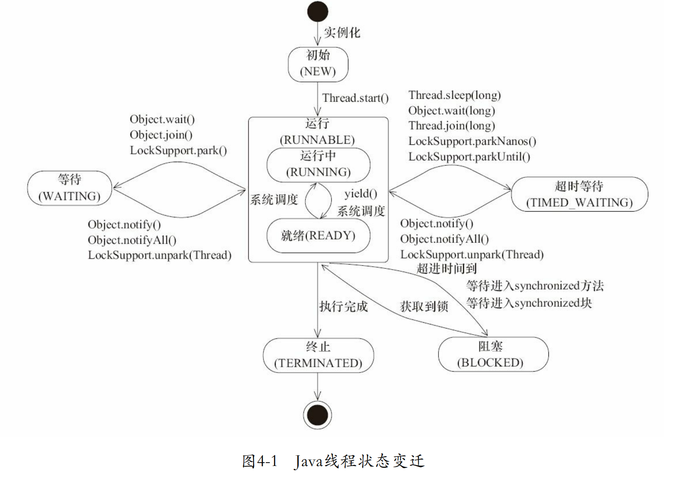

### 1. Thread State

> **NEW**:  Thread state for a thread which has not yet started. 尚未启动的线程状态，即线程创建，还未调用start方法

> **RUNNABLE**: A thread in the runnable state is executing in the Java virtual machine but it maybe waiting for other resources from the operating system. 就绪状态（调用start，等待调度）+正在运行
>
> 操作系统中的就绪和运行两种状态，在Java中统称为RUNNABLE。
>
> 就绪状态（READY)
>
> 当线程对象调用了`start()`方法之后，线程处于**就绪状态**，就绪意味着该线程**可以执行**，但具体啥时候执行将取决于JVM里线程调度器的调度。
>
> > It is never legal to start a thread more than once. In particular, a thread may not be restarted once it has completed execution.
>
> - 不允许对一个线程多次使用start。
> - 线程执行完成之后，不能试图用start将其唤醒。
>
> 其他状态 ->就绪
>
> - 线程调用start()，新建状态转化为就绪状态。
> - 线程sleep(long)时间到，等待状态转化为就绪状态。
> - 阻塞式IO操作结果返回，线程变为就绪状态。
> - 其他线程调用join()方法，结束之后转化为就绪状态。
> - 线程对象拿到对象锁之后，也会进入就绪状态。
>
> 运行状态(RUNNING)
>
> 处于就绪状态的线程获得了CPU之后，**真正开始执行run()方法的线程执行体时**，意味着该线程就已经处于**运行状态**。需要注意的是，**对于单处理器，一个时刻只能有一个线程处于运行状态。**
> 对于抢占式策略的系统来说，系统会给每个线程一小段时间处理各自的任务。时间用完之后，系统负责夺回线程占用的资源。下一段时间里，系统会根据一定规则，再次进行调度。
>
> **运行状态转变为就绪状态**的情形：
>
> - 线程失去处理器资源。线程不一定完整执行的，执行到一半，说不定就被别的线程抢走了。
> - 调用yield()静态方法，暂时暂停当前线程，让系统的线程调度器重新调度一次，它自己完全有可能再次运行。
>
> yield方法的官方解释：
>
> > A hint to the scheduler that the current thread is willing to yield its current use of a processor. The scheduler is free to ignore this hint.
>
> 提示调度程序，当前线程愿意放弃当前对处理器的使用。这时，**当前线程将会被置为就绪状态**，和其他线程一样等待调度，这时候根据不同**优先级**决定的**概率**，当前线程完全有可能再次抢到处理器资源。

> **BLOCK**: A thread in the blocked state is waiting for a monitor lock to enter a synchronized block/method or reenter a synchronized block/method after calling `Object.wait()` . 等待监视器锁时，陷入阻塞状态.
>
> 阻塞状态表示线程**正等待监视器锁**，而陷入的状态。
>
> 以下场景线程将会阻塞：
>
> - 线程等待进入synchronized同步方法。
> - 线程等待进入synchronized同步代码块。
>
> 线程取得锁，就会从阻塞状态转变为就绪状态。

> **WAITING**:  thread in the waiting state is waiting for another thread to perform a particular action. A thread is in the waiting state due to calling one of the following methods: `Object.wait()` , `Object.join()`, `LockSupport.park().`等待状态的线程正在等待另一线程执行特定的操作（如notify）
>
> For example, a thread that has called `Object.wait()` on an object is waiting for another thread to call
>
> `Object.notify()`  or `Object.notifyAll()`  on that object. A thread that has called  `Thread.join()` is waiting for a specified thread to terminate.
>
> 进入该状态表示**当前线程需要等待其他线程做出一些的特定的动作**（通知或中断）。
>
> 运行->等待
>
> - 当前线程运行过程中，其他线程调用`join`方法，当前线程将会进入等待状态。
> - 当前线程对象调用`wait()`方法。
>   -`LockSupport.park()`：出于线程调度的目的**禁用当前线程**。
>
> 等待->就绪
>
> - 等待的线程**被其他线程对象唤醒**，`notify()`和`notifyAll()`。
> - `LockSupport.unpark(Thread)`，与上面park方法对应，给出许可证，**解除等待状态**

>**TIMED_WAITIING**: Thread state for a waiting thread with a specified waiting time. A thread is in the timed waiting state due to calling one of the following methods with a specified positive waiting time:
>
> `Thread.sleep(long), Object.wait(long),Thread.join(long), LockSupport.parkNanos(), LockSupport.parkUntil()`. 具有**指定等待时间**的等待状态.
>
>区别于`WAITING`，它可以在**指定的时间**自行返回。
>
>运行->超时等待
>
>- 调用静态方法，`Thread.sleep(long)`
>- 线程对象调用`wait(long)`方法
>- 其他线程调用指定时间的`join(long)`。
>- `LockSupport.parkNanos()`。
>- `LockSupport.parkUntil()`。
>
>补充：
>sleep和yield的不同之处：
>
>- sleep(long)方法会**使线程转入超时等待状态**，时间到了之后才会转入就绪状态。而yield()方法不会将线程转入等待，而是强制线程进入就绪状态。
>- 使用sleep(long)方法**需要处理异常**，而yield()不用。
>
>超时等待->就绪
>
>- 同样的，等待的线程被其他线程对象唤醒，`notify()`和`notifyAll()`。
>- `LockSupport.unpark(Thread)`。

> **TREMINATED**: The thread has completed execution.
>
> 即**线程的终止**，表示线程已经执行完毕。前面已经说了，已经消亡的线程不能通过start再次唤醒。
>
> - run()和call()线程执行体中顺利执行完毕，**线程正常终止**。
> - 线程抛出一个没有捕获的Exception或Error。
>
> 需要注意的是：主线成和子线程互不影响，子线程并不会因为主线程结束就结束



### 2. WAIT/SLEEP Difference

> 1. sleep 是 Thread 的静态方法，wait 是 Object 的方法，任何对象实例都能调用。
>
> 2. sleep 不会释放锁，它也不需要占用锁。wait 会释放锁，但调用它的前提是当前线程占有锁(即代码要在 synchronized 中)。
>
> 3. 它们都可以被 interrupted 方法中断。

### 3. Four Ways to create thread

> 1. Extend the Thread and overwite the `run()` method
>
>    ```java
>    class SampleThread extends Thread {
>        //method where the thread execution will start 
>        public void run(){
>            //logic to execute in a thread    
>        }
>        //let’s see how to start the threads
>        public static void main(String[] args){
>           Thread t1 = new SampleThread();
>           Thread t2 = new SampleThread();
>           t1.start();  //start the first thread. This calls the run() method.
>           t2.start(); //this starts the 2nd thread. This calls the run() method.  
>        }
>    }
>    ```
>
> 2. Implemnt Runable interface.有时我们要同时融合实现Runnable接口和Thread子类两种方式。例如，实现了Thread子类的实例可以执行多个实现了Runnable接口的线程。一个典型的应用就是线程池
>
>    `````
>    class A implements Runnable{
>        @Override
>        public void run() {
>            // implement run method here 
>        }
>        public static void main() {
>            final A obj = new A();
>            Thread t1 = new Thread(new A());
>            t1.start();
>        }
>    }
>    `````
>
> 3. Implement Callable interface + FutureTask
>
>    `````
>    class Counter implements Callable {
>        private static final int THREAD_POOL_SIZE = 2;
>        // method where the thread execution takes place
>        public String call() {
>            return Thread.currentThread().getName() + " executing ...";
>        }
>        public static void main(String[] args) throws InterruptedException,
>                ExecutionException {
>            // create a pool of 2 threads
>            ExecutorService executor = Executors.newFixedThreadPool(THREAD_POOL_SIZE);
>            Future future1 = executor.submit(new Counter());
>            Future future2 = executor.submit(new Counter());
>            System.out.println(Thread.currentThread().getName() + " executing ...");
>    
>            //asynchronously get from the worker threads
>            System.out.println(future1.get());
>            System.out.println(future2.get());
>        }
>    }
>    `````
>
> 4. Thread pool
>
>    ```java
>    Executors.newFiexedThreadPool(3);
>    //或者
>    new ThreadPoolExecutor(corePoolSize, maximumPoolSize, keepAliveTime, TimeUnit unit, workQueue, threadFactory, handler);
>    ```

### 4.  2 Ways to control thread

> 1. **synchronized** 
>
>    synchronized 是 Java 中的关键字，是一种同步锁。它修饰的对象有以下几种：
>
>    1. 修饰一个代码块，被修饰的代码块称为同步语句块，其作用的范围是大括号{}括起来的代码，作用的对象是调用这个代码块的对象；
>
>    2. 修饰一个方法，被修饰的方法称为同步方法，其作用的范围是整个方法，作用的对象是调用这个方法的对象；虽然可以使用 synchronized 来定义方法，但 synchronized 并不属于方法定义的一部分，因此，synchronized 关键字不能被继承。如果在父类中的某个方法使用了 synchronized 关键字，而在子类中覆盖了这个方法，在子类中的这个方法默认情况下并不是同步的，而必须显式地在子类的这个方法中加上synchronized 关键字才可以。
>    3. 修改一个静态的方法，其作用的范围是整个静态方法，作用的对象是这个类的所有对象；
>
>    4. 修改一个类，其作用的范围是 synchronized 后面括号括起来的部分，作用主的对象是这个类的所有对象。
>
>    如果一个代码块被 synchronized 修饰了，当一个线程获取了对应的锁，并执行该代码块时，其他线程便只能一直等待，等待获取锁的线程释放锁，而这里获取锁的线程释放锁只会有两种情况：
>
>    1）获取锁的线程执行完了该代码块，然后线程释放对锁的占有；
>
>    2）线程执行发生异常，此时 JVM 会让线程自动释放锁。
>
>    关键字 synchronized 与 wait()/notify()这两个方法一起使用可以实现等待/通知模式
>
>    `````java
>    public synchronized void incr() throws InterruptedException {
>            while(number != 0) { //判断number值是否是0，如果不是0，等待
>                this.wait(); //在哪里睡，就在哪里醒
>            }
>            number++;//如果number值是0，就+1操作
>            System.out.println(Thread.currentThread().getName()+" :: "+number);
>            //通知其他线程
>            this.notifyAll();
>        }
>    `````
>
>    
>
> 2. **lock**
>
>    Lock 锁实现提供了比使用同步方法和语句可以获得的更广泛的锁操作。它们允许更灵活的结构，可能具有非常不同的属性，并且可能支持多个关联的条件对象。Lock 提供了比 synchronized 更多的功能。
>
>    Lock 与的 Synchronized 区别：
>
>    • Lock 不是 Java 语言内置的，synchronized 是 Java 语言的关键字，因此是内置特性。Lock 是一个类，通过这个类可以实现同步访问；
>
>    • Lock 和 synchronized 有一点非常大的不同，采用 synchronized 不需要用户去手动释放锁，当 synchronized 方法或者 synchronized 代码块执行完之后，系统会自动让线程释放对锁的占用；而 Lock 则必须要用户去手动释放锁，如果没有主动释放锁，就有可能导致出现死锁现象。
>
>    Lock 方法比较常用。 常用代码格式：
>
>    ```
>    lock.lock();
>    try {...} catch(Exception e){...} finally {lock.unlock();}
>    ```
>
>    关键字 synchronized 与 wait()/notify()这两个方法一起使用可以实现等待/通知模式
>
>    Lock 锁的 newContition()方法返回 Condition 对象，Condition 类也可以实现等待/通知模式. 使用 Condition 类可以
>
>    进行选择性通知， Condition 比较常用的两个方法：
>
>    • await()会使当前线程等待,同时会释放锁,当其他线程调用 signal()时,线程会重新获得锁并继续执行。
>
>    • signal()用于唤醒一个等待的线程。
>
>    锁的种类
>
>    1. ReentrantLock 可重入锁，是唯一实现了 Lock 接口的类
>    2. ReadWriteLock 读写锁。一个用来获取读锁，一个用来获取写锁。也就是说将文件的读写操作分开，分成 2 个锁分配给线程
>    3. ReentrantReadWriteLock 实现了 ReadWriteLock 接口。 
>    4. 如果有一个线程已经占用了读锁，则此时其他线程如果要申请写锁，则申请写锁的线程会一直等待释放读锁。如果有一个线程已经占用了写锁，则此时其他线程如果申请写锁或者读锁，则申请的线程会一直等待释放写锁
>
> 

### 5. Difference between lock and synchronized

> 1. Lock 是一个接口，而 synchronized 是 Java 中的关键字，synchronized 是内置的语言实现；
>
> 2. synchronized 在发生异常时，会自动释放线程占有的锁，因此不会导致死锁现象发生；而 Lock 在发生异常时，如果没有主动通过 unLock()去释放锁，则很可能造成死锁现象，因此使用 Lock 时需要在 finally 块中释放锁；
>
> 3. Lock 可以让等待锁的线程响应中断，而 synchronized 却不行，使用synchronized 时，等待的线程会一直等待下去，不能够响应中断；
> 4. 通过 Lock 可以知道有没有成功获取锁，而 synchronized 却无法办到。
> 5. Lock 可以提高多个线程进行读操作的效率。两者的性能是差不多的，而当竞争资源非常激烈时（即有大量线程同时竞争），此时 Lock 的性能要远远优于synchronized。

### 6. Thread safty in List, Set, Map

> List  is not thread safe. will throw java.util.ConcurrentModificationException. The ways to fix the issue
>
> 1. We can use **Vectore**, add 方法被 synchronized 同步修辞,线程安全!因此没有并发异常
> 2. Collections 提供了方法 synchronizedList 保证 list 是同步线程安全的
> 3. CopyOnWriteArrayList, 适用于小list， 大量读，少量写的情况
>
> HashMap is not thread safe. the ways to fix it
>
> 1. HashTable, synchronized 同步修辞
>
> 可以使用java.util.concurrent 并发包下的数据结构去解决数据并法问题

### 7. Callable and Future

> 有两种创建线程的方法-一种是通过创建 Thread 类，另一种是通过使用 Runnable 创建线程。但是，Runnable 缺少的一项功能是,当线程终止时（即 run（）完成时），我们无法使线程返回结果。为了支持此功能，Java 中提供了 Callable 接口.
>
> Callable 接口的特点如下(重点)
>
> • 为了实现 Runnable，需要实现不返回任何内容的 run（）方法，而对于Callable，需要实现在完成时返回结果的 call（）方法。
>
> • call（）方法可以引发异常，而 run（）则不能。
>
> • 为实现 Callable 而必须重写 call 方法
>
> • 不能直接替换 runnable,因为 Thread 类的构造方法根本没有 Callable
>
> **当 call（）方法完成时，结果必须存储在主线程已知对象中，以便主线程可以知道该线程返回的结果。为此可以使用 Future 对象。**
>
> Java 库具有具体的 FutureTask 类型，该类型实现 Runnable 和 Future，并方便地将两种功能组合在一起。 可以通过为其构造函数提供 Callable 来创建FutureTask。然后，将 FutureTask 对象提供给 Thread 的构造函数以创建Thread 对象。因此，间接地使用 Callable 创建线程.
>
> • 一般 FutureTask 多用于耗时的计算，主线程可以在完成自己的任务后，再去获取结果。
>
> • 仅在计算完成时才能检索结果；如果计算尚未完成，则阻塞 get 方法
>
> • 一旦计算完成，就不能再重新开始或取消计算
>
> • get 方法而获取结果只有在计算完成时获取，否则会一直阻塞直到任务转入完成状态，然后会返回结果或者抛出异常
>
> • **get 只计算一次**,因此 get 方法放到最后

### 8. JUC  三大辅助类

>**CountDownLatch**: 减少计数
>
>• CountDownLatch 主要有两个方法，当一个或多个线程调用 await 方法时，这些线程会阻塞,其它线程调用 countDown 方法会将计数器减 1(调用 countDown 方法的线程不会阻塞), 当计数器的值变为 0 时，因 await 方法阻塞的线程会被唤醒，继续执行
>
>`````
>//6个同学陆续离开教室之后，班长锁门
>    public static void main(String[] args) throws InterruptedException {
>        CountDownLatch countDownLatch = new CountDownLatch(6);  //创建CountDownLatch对象，设置初始值
>        for (int i = 1; i <=6; i++) {        //6个同学陆续离开教室之后
>            new Thread(()->{
>                System.out.println(Thread.currentThread().getName()+" 号同学离开了教室");
>                countDownLatch.countDown();//计数  -1
>            },String.valueOf(i)).start();
>        }
>        countDownLatch.await();        //等待
>        System.out.println(Thread.currentThread().getName()+" 班长锁门走人了");
>    }
>`````
>
>
>
>**CyclicBarrier**: 循环栅栏
>
>**CountDownLatch的计数器只能使用一次，CyclicBarrier的计数器可以使用reset()方法重置，可用于处理更为复杂的业务场景**
>
>在使用中CyclicBarrier 的构造方法第一个参数是目标障碍数，每次执行 CyclicBarrier一次障碍数会加一，如果达到了目标障碍数，才会执行 每个thread cyclicBarrier.await()之后的语句。
>
>```java
>public static void main(String[] args) {
>    CyclicBarrier cyclicBarrier =     //创建CyclicBarrier
>            new CyclicBarrier(7,()->{
>                System.out.println("*****集齐7颗龙珠就可以召唤神龙");
>            });
>    for (int i = 1; i <=7; i++) {     //集齐七颗龙珠过程
>        new Thread(()->{
>            try {
>                System.out.println(Thread.currentThread().getName()+" 星龙被收集到了");
>                cyclicBarrier.await();                 //等待
>            } catch (Exception e) {
>                e.printStackTrace();
>            }
>        },String.valueOf(i)).start();
>    }
>}
>```
>
>**Semaphore**: 信号灯
>
>**用于控制同时访问特定资源的线程数量，控制并发线程数。**
>
>Semaphore 的构造方法中传入的第一个参数是最大信号量（可以看成最大线程池），每个信号量初始化为一个最多只能分发一个许可证。使用 acquire 方法获得许可证，release 方法释放许可
>
>```java
>public static void main(String[] args) {
>    Semaphore semaphore = new Semaphore(3);     //创建Semaphore，设置许可数量
>    for (int i = 1; i <=6; i++) {     //模拟6辆汽车
>        new Thread(()->{
>            try {
>                semaphore.acquire();                //抢占
>                System.out.println(Thread.currentThread().getName()+" 抢到了车位");
>                TimeUnit.SECONDS.sleep(new Random().nextInt(5));                 //设置随机停车时间
>                System.out.println(Thread.currentThread().getName()+" ------离开了车位");
>            } catch (InterruptedException e) {
>                e.printStackTrace();
>            } finally {
>                semaphore.release();                 //释放
>            }
>        },String.valueOf(i)).start();
>    }
>}
>```

### 9. BlockingQueue

>特点： 
>
>1. 当队列是空的，从队列中获取元素的操作将会被阻塞
>
>2. 当队列是满的，从队列中添加元素的操作将会被阻塞
>3. 试图从空的队列中获取元素的线程将会被阻塞，直到其他线程往空的队列插入新的元素
>4. 试图向已满的队列中添加新元素的线程将会被阻塞，直到其他线程从队列中移除一个或多个元素或者完全清空，使队列变得空闲起来并后续新增
>
>在多线程领域：所谓阻塞，在某些情况下会挂起线程（即阻塞），一旦条件满足，被挂起的线程又会自动被唤起.
>
>需要 BlockingQueue好处是我们不需要关心什么时候需要阻塞线程，什么时候需要唤醒线程，因为这一切BlockingQueue 都给你一手包办了.
>
>多线程环境中，通过队列可以很容易实现数据共享，比如经典的“生产者”和“消费者”模型中，通过队列可以很便利地实现两者之间的数据共享。假设我们有若干生产者线程，另外又有若干个消费者线程。如果生产者线程需要把准备好的数据共享给消费者线程，利用队列的方式来传递数据，就可以很方便地解决他们之间的数据共享问题。但如果生产者和消费者在某个时间段内，万一发生数据处理速度不匹配的情况呢？理想情况下，如果生产者产出数据的速度大于消费者消费的速度，并且当生产出来的数据累积到一定程度的时候，那么生产者必须暂停等待一下（阻塞生产者线程），以便等待消费者线程把累积的数据处理完毕，反之亦然。
>
>常用的Blocking Queue
>
>1. ArrayBlockingQueue
>2. LinkedBlockingQueue
>3. DelayQueue。元素只有当其指定的延迟时间到了，才能够从队列中获取到该元素
>4. PriorityBlockingQueue。 基于优先级的阻塞队列（优先级的判断通过构造函数传入的 Compator 对象来决定），但需要注意的是 PriorityBlockingQueue 并不会阻塞数据生产者，而只会在没有可消费的数据时，阻塞数据的消费者。

### 10. Thread Pool

> 线程池（英语：thread pool）：一种线程使用模式。线程过多会带来调度开销，进而影响缓存局部性和整体性能。而线程池维护多个线程，等待着监督管理者分配可并发执行的任务。这避免了在处理短时间任务时创建与销毁线程的代价。不要使用Executors 去创建Thread pool 会导致资源耗尽。通过使用ThreadPoolExecutor 方式创建。
>
>  
>
> **Java** 中的线程池是通过 **Executor** 框架实现的，该框架中用到了 **Executor**，**Executors**，**ExecutorService**，**ThreadPoolExecutor** 这几个类.
>
> 1. 当线程池里存活的线程数小于核心线程数`corePoolSize`时，这时对于一个新提交的任务，线程池会创建一个线程去处理任务。当线程池里面存活的线程数小于等于核心线程数`corePoolSize`时，线程池里面的线程会一直存活着，就算空闲时间超过了`keepAliveTime`，线程也不会被销毁，而是一直阻塞在那里一直等待任务队列的任务来执行。
> 2. 当线程池里面存活的线程数已经等于corePoolSize了，这是对于一个新提交的任务，会被放进任务队列workQueue排队等待执行。
> 3. 当线程池里面存活的线程数已经等于`corePoolSize`了，并且任务队列也满了，假设`maximumPoolSize>corePoolSize`，这时如果再来新的任务，线程池就会继续创建新的线程来处理新的任务，知道线程数达到`maximumPoolSize`，就不会再创建了。
> 4. 如果当前的线程数达到了`maximumPoolSize`，并且任务队列也满了，如果还有新的任务过来，那就直接采用拒绝策略进行处理。默认的拒绝策略是抛出一个RejectedExecutionException异常。
>
> **线程池参数说明**
>
> • corePoolSize 线程池的核心线程数
>
> • maximumPoolSize 能容纳的最大线程数
>
> • keepAliveTime 空闲线程存活时间
>
> • unit 存活的时间单位
>
> • workQueue 存放提交但未执行任务的队列
>
> • threadFactory 创建线程的工厂类
>
> • handler 等待队列满后的拒绝策略 （总结起来，也就是一句话，当提交的任务数大于（workQueue.size() +maximumPoolSize ），就会触发线程池的拒绝策略。）
>
> **拒绝策略(重点)**
>
> CallerRunsPolicy: 当触发拒绝策略，只要线程池没有关闭的话，则使用调用线程直接运行任务。一般并发比较小，性能要求不高，不允许失败。但是，由于调用者自己运行任务，如果任务提交速度过快，可能导致程序阻塞，性能效率上必然的损失较大
>
> AbortPolicy: 丢弃任务，并抛出拒绝执行 RejectedExecutionException 异常信息。线程池默认的拒绝策略。必须处理好抛出的异常，否则会打断当前的执行流程，影响后续的任务执行。
>
> DiscardPolicy: 直接丢弃，其他啥都没有
>
> DiscardOldestPolicy: 当触发拒绝策略，只要线程池没有关闭的话，丢弃阻塞队列 workQueue 中最老的一个任务，并将新任务加入

### 11. Fork and Join

> Fork/Join 它可以将一个大的任务拆分成多个子任务进行并行处理，最后将子任务结果合并成最后的计算结果，并进行输出.Fork/Join 框架要完成两件事情：

### 12. CompleteableFuture

> CompletableFuture 实现了 Future, CompletionStage 接口，实现了 Future接口就可以兼容现在有线程池框架，CompletionStage 接口才是异步编程的接口抽象，里面定义多种异步方法，通过这两者集合，从而打造出了强大的CompletableFuture 类.
>
> 


